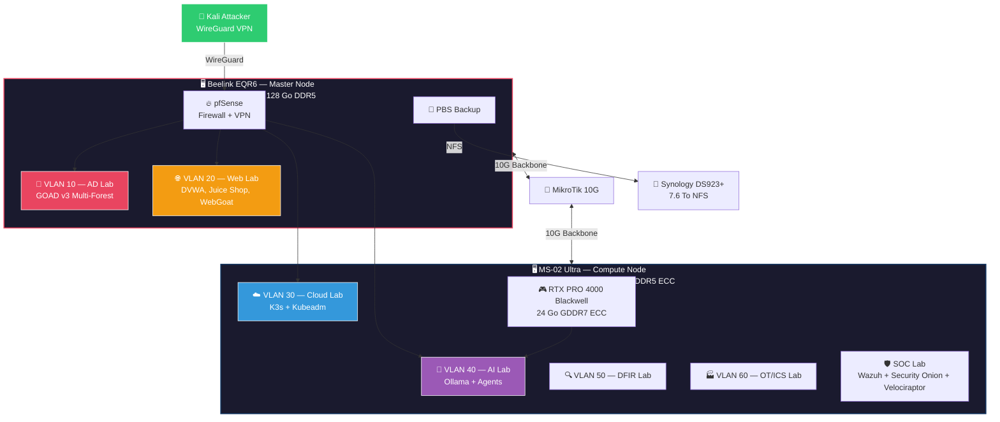

# HikenRoot Forge 🔥

[](LICENSE)
[](https://www.proxmox.com/)
[](https://github.com/Orange-Cyberdefense/GOAD)
[](https://kubernetes.io)
[](https://www.nvidia.com)

> **Enterprise-grade cybersecurity lab — Offensive & Defensive security training platform**
>
> Private cyber range covering ~95% of cybersecurity domains, built on bare-metal infrastructure with real enterprise scenarios.

---

## 🎯 Objective

Design and operate a **realistic enterprise environment** to practice the full attack-defense cycle:

- Active Directory attacks & defense (multi-forest)
- Web application security (OWASP Top 10, API)
- Cloud & Kubernetes security (offensive + defensive)
- AI/LLM security research (local GPU, agents)
- Network segmentation & monitoring (SIEM, EDR)
- Incident response & digital forensics

Built around a fictional company (**MediaTech Groupe SA**) with 40+ realistic penetration testing scenarios.

---

## 🏗️ Architecture Overview



> 📐 Full diagrams: [Architecture Overview](diagrams/architecture-overview.md) · [Network Topology](diagrams/network-topology.md)

---

## 🔌 Hardware

| Node | CPU | RAM | Storage | GPU | Role |
|------|-----|-----|---------|-----|------|
| **Beelink EQR6** | AMD Ryzen 9 6900HX | 128 Go DDR5 | 1 To NVMe | — | AD Lab, Web Lab, pfSense, PBS |
| **MS-02 Ultra** | Intel Core Ultra 9 285HX | 192 Go DDR5 ECC | 9 To NVMe | RTX PRO 4000 Blackwell 24 Go | Cloud, AI, DFIR, OT/ICS, SOC |
| **Synology DS923+** | — | — | 7.6 To | — | NFS Backup |
| **MikroTik CSS610** | — | — | — | — | 10G Backbone (8x 1G PoE + 2x SFP+) |

**GPU Specs:** NVIDIA RTX PRO 4000 Blackwell — 24 Go GDDR7 ECC, 70W TDP, Tensor Cores Gen 5, FP4/FP8 native. Runs 32B dense / 30B MoE parameter LLMs locally with zero cloud dependency.

---

## 🔒 Network Segmentation

| VLAN | Subnet | Host | Purpose | Status |
|------|--------|------|---------|--------|
| 10 | 192.168.10.0/24 | Beelink | 🏰 AD Lab — GOAD v3 Multi-Forest | ✅ Operational |
| 20 | 192.168.20.0/24 | Beelink | 🌐 Web Lab — DVWA, Juice Shop, WebGoat, VAmPI | ✅ Operational |
| 30 | 192.168.30.0/24 | MS-02 | ☁️ Cloud Lab — K3s (pentest) + Kubeadm (certif) | 🔧 Deploying |
| 40 | 192.168.40.0/24 | MS-02 | 🤖 AI Lab — Ollama, RAG, Hashcat, GPU native | 🔧 Deploying |
| 50 | 192.168.50.0/24 | MS-02 | 🔍 DFIR Lab — SIFT, TheHive, MISP | 📋 Planned |
| 60 | 192.168.60.0/24 | MS-02 | 🏭 OT/ICS Lab — GRFICSv2, SWaT, OpenPLC | 📋 Planned |
| 70 | 192.168.70.0/24 | MS-02 | 📱 Mobile Lab — Android Emulator | 📋 Planned |
| 100 | 192.168.100.0/24 | Archer 5G | 📡 External Attack Simulation | 📋 Planned |

All traffic routes through a **single pfSense** firewall with WireGuard VPN access (10.10.10.0/24).

---

## 🧪 Labs

### ✅ Operational

**AD Lab — GOAD v3 (VLAN 10)**
Multi-forest Active Directory environment with 5 Windows Server VMs, inter-domain trusts, complex ACLs, and realistic misconfigurations. Deployed with Infrastructure as Code (Packer, Terraform, Ansible).

Attack techniques: Password Spraying, AS-REP Roasting, Kerberoasting, DCSync, GPO Abuse, ACL Abuse (WriteDACL, GenericAll), Delegation Attacks, ADCS, Forest Trust Abuse, Golden/Silver Ticket.

→ [AD Lab Documentation](docs/goad/)

**Web Lab (VLAN 20)**
Docker-based web application security lab with 7+ vulnerable applications: DVWA, OWASP Juice Shop, WebGoat, VAmPI, DVGA, SQLi-Labs, VulnApp.

→ Documentation coming soon

### 🔧 In Progress

**Cloud Lab (VLAN 30)** — Dual Kubernetes cluster: K3s for pentesting (Kubernetes Goat, 20 scenarios) + Kubeadm for certification prep (CKA/CKAD/CKS).

**AI Lab (VLAN 40)** — Local LLM stack with GPU native deployment: Ollama serving 32B dense models (Qwen3, DeepSeek-R1), vulnerable RAG pipeline, autonomous pentest agents, Hashcat GPU cracking.

### 📋 Planned

**SOC Lab** — Wazuh SIEM + Security Onion + Velociraptor EDR. Purple team: attack from Kali, detect from SOC.

**DFIR Lab (VLAN 50)** — SIFT Workstation, TheHive + Cortex, MISP for incident response and forensics.

**OT/ICS Lab (VLAN 60)** — GRFICSv2, SWaT, OpenPLC for industrial control system security.

**Mobile Lab (VLAN 70)** — Android emulator for mobile application security testing.

---

## 🤖 AI / LLM Stack

Running **locally on GPU** — zero cloud, zero data leakage.

| Model | VRAM | Role |
|-------|------|------|
| qwen3:32b | ~22 Go | General purpose — best local dense model |
| qwen3:30b-a3b | ~3 Go active | Fast agent & AI Red Team loops |
| qwen3-coder:30b | ~18 Go | Exploit generation (Python, PowerShell, C#) |
| deepseek-r1:8b | ~8 Go | Autonomous pentest agent |
| phi4-reasoning:14b | ~10 Go | SOC investigation & log analysis |
| mistral-small3.2:24b | ~14 Go | Report generation |

AI modules: Autonomous Pentest Agent, Auto-Exploit Generator, SOC Copilot, Malware Analyzer, Pentest Report Generator.

---

## 🎯 Scenarios — MediaTech Groupe SA

40+ realistic enterprise scenarios built around a fictional digital media company:

| Category | Codes | Examples |
|----------|-------|---------|
| Executive | SC-DIR-001 to 003 | CEO fraud, board compromise |
| Finance | SC-FIN-001 to 003 | Wire fraud, payment manipulation |
| Legal/GDPR | SC-JUR-001 to 003 | Data exfiltration, compliance breach |
| IT/Technical | SC-IT-001 to 004 | Admin compromise, supply chain |
| Cloud/K8s | SC-CLD-001 to 004 | Container escape, RBAC abuse |
| AI Security | SC-IA-001 to 004 | Prompt injection, model poisoning |
| DFIR | SC-DFIR-001 to 003 | Post-incident analysis |
| OT/ICS | SC-OT-001 to 003 | SCADA compromise |

Each scenario follows the full cycle: **Threat Model → Exploitation → Detection → Remediation**.

---

## 🎓 Certifications Alignment

| Certification | Labs Used | Priority |
|---------------|-----------|----------|
| **OSCP+** | GOAD + WebLab | 🔴 High |
| **CRTO** | GOAD + C2 | 🔴 High |
| **CKA / CKS** | Cloud Lab (Kubeadm) | 🔴 High |
| **CAIPT-RT** | AI Lab | 🔴 High |
| eWPT | WebLab | 🟡 Medium |
| AZ-500 | Cloud Lab (K3s) | 🟡 Medium |
| GCFA/GCFE | DFIR Lab | 🟢 Low |

---

## 📊 Project Status

| Phase | Scope | Status | Timeline |
|-------|-------|--------|----------|
| **Phase 1** | Infrastructure foundation (Beelink + MS-02 + Network) | ✅ Complete | Feb 2026 |
| **Phase 2** | Cloud Lab + AI Lab + SOC Lab | 🔧 In Progress | Feb–Mar 2026 |
| **Phase 3** | DFIR + OT/ICS + Mobile Labs | 📋 Planned | Mar–Apr 2026 |
| **Phase 4** | Advanced AI modules + GOAD-KUBE | 📋 Planned | Apr 2026 |
| **Phase 5** | Documentation (FR + EN) + GitBook | 📋 Planned | May 2026 |

---

## 📂 Repository Structure

```
hikenroot-forge/
├── configs/              # Configuration files (pfSense, Proxmox, Docker, K8s)
├── diagrams/             # Architecture & network diagrams (Mermaid)
├── docs/
│   ├── goad/             # AD Lab documentation
│   ├── reports/          # Session reports & technical decisions
│   ├── en/               # English documentation
│   └── fr/               # French documentation
└── scripts/
    ├── backup/           # Backup automation scripts
    └── deploy/           # Lab deployment scripts
```

---

## 📖 Documentation

| Topic | Link |
|-------|------|
| AD Lab (GOAD v3) | [docs/goad/](docs/goad/) |
| Architecture Diagrams | [diagrams/](diagrams/) |
| MS-02 Architecture | [docs/ms02-architecture.md](docs/ms02-architecture.md) |
| Session Reports | [docs/reports/](docs/reports/) |

---

## 👤 Author

**Nadyr Chouarhi** — hik3nR00t

Penetration tester with 20 years of system administration experience. OSCP certified, preparing CRTO.

---

## 📄 License

This project is licensed under the MIT License — see [LICENSE](LICENSE).
