# HikenRoot Forge 🔥

**Enterprise-inspired cybersecurity lab — Offensive, defensive, cloud and AI security training platform**

## Objective

Design and operate a realistic enterprise environment to practice:

- Active Directory attacks & defense (on-premise + hybrid cloud)
- Web application security
- Cloud & Kubernetes security
- AI/LLM security research
- Network segmentation & monitoring
- Incident response & digital forensics

Built around a fictional company (MediaTech Groupe SA) with realistic penetration testing scenarios.

## Hardware

| Node | CPU | RAM | Storage | GPU | Role |
|------|-----|-----|---------|-----|------|
| **Beelink EQR6** | AMD Ryzen 9 6900HX | 128 Go DDR5 | 1 To NVMe | — | AD Lab, Web Lab, pfSense, PBS |
| **MS-02 Ultra** | Intel Core Ultra 9 285HX | 192 Go DDR5 ECC | Samsung 990 PRO 1 To + WD BLACK 4 To NVMe | RTX PRO 4000 Blackwell 24 Go | Cloud, AI, DFIR, OT/ICS, SOC |
| **Synology DS923+** | AMD Ryzen R1600 | 32 Go DDR4 | 3x 4 To IronWolf RAID 5 | — | NFS Backup |
| **MikroTik CSS610** | — | — | — | — | 10G Backbone (8x 1G PoE + 2x SFP+) |

## Architecture

```mermaid
graph TB
    subgraph INTERNET["Internet / External"]
        ARCHER["Archer NX200 5G<br/>192.168.100.0/24"]
        KALI_EXT["Kali External<br/>192.168.100.10"]
    end

    subgraph BACKBONE["MikroTik CSS610-8P-2S+IN — 10G Backbone"]
        direction LR
        SW_PORT1["Port 1-4<br/>Beelink"]
        SW_PORT2["Port 5-8<br/>MS-02"]
        SW_SFP["SFP+ 10G"]
    end

    subgraph BEELINK["Beelink EQR6 — Master Node<br/>Ryzen 9 6900HX | 128 Go DDR5 | 1 To NVMe"]

        subgraph PFSENSE["pfSense — Central Firewall"]
            PF_WAN["WAN 192.168.50.250"]
            PF_VPN["WireGuard 10.10.10.0/24"]
            PF_VLAN["Inter-VLAN Routing"]
        end

        subgraph VLAN10["VLAN 10 — AD Lab GOAD v3"]
            DC01["DC01<br/>192.168.10.10"]
            DC02["DC02<br/>192.168.10.11"]
            DC03["DC03<br/>192.168.10.12"]
            SRV02["SRV02<br/>192.168.10.22"]
            SRV03["SRV03<br/>192.168.10.23"]
        end

        subgraph VLAN20["VLAN 20 — Web Lab"]
            WEBLAB["Docker WebLab<br/>192.168.20.10"]
            DVWA["DVWA :8081"]
            JUICE["Juice Shop :8082"]
            WEBGOAT["WebGoat :8083"]
            VAMPI["VAmPI :8084"]
            SQLI["SQLi-Labs :8086"]
        end

        PBS["PBS<br/>192.168.50.129"]
    end

    subgraph MS02["MS-02 Ultra — Compute Node<br/>Core Ultra 9 285HX | 192 Go DDR5 ECC | 9 To NVMe"]
        GPU["RTX PRO 4000 Blackwell<br/>24 Go GDDR7 ECC | 70W TDP"]

        subgraph VLAN30["VLAN 30 — Cloud Lab"]
            K3S_M["K3s Master<br/>192.168.30.10"]
            K3S_W1["K3s Worker 1<br/>192.168.30.11"]
            K3S_W2["K3s Worker 2<br/>192.168.30.12"]
            EXAM_M["Kubeadm Master<br/>192.168.30.20"]
        end

        subgraph VLAN40["VLAN 40 — AI Lab"]
            OLLAMA["Ollama + Agents<br/>192.168.40.10<br/>GPU Passthrough"]
            RAG["RAG Vulnerable<br/>192.168.40.11"]
            HASHCAT["Hashcat<br/>192.168.40.12"]
        end

        subgraph VLAN50_DFIR["VLAN 50 — DFIR Lab"]
            SIFT["SIFT Workstation<br/>192.168.50.10"]
            THEHIVE["TheHive + Cortex<br/>192.168.50.11"]
        end

        subgraph VLAN60["VLAN 60 — OT/ICS Lab"]
            GRFICS["GRFICSv2<br/>192.168.60.10"]
            OPENPLC["OpenPLC<br/>192.168.60.12"]
        end

        subgraph SOC["SOC Lab — Multi-VLAN"]
            WAZUH["Wazuh SIEM"]
            SECONION["Security Onion"]
            VELOCI["Velociraptor EDR"]
        end
    end

    subgraph NAS["Synology DS923+"]
        SYNO["7.6 To NFS<br/>192.168.50.130"]
    end

    KALI_EXT --> ARCHER
    ARCHER -->|"Simulated External Attack"| BACKBONE
    PF_VPN -->|"WireGuard Tunnel"| KALI_VPN["Kali VPN<br/>10.10.10.2"]
    BACKBONE --- BEELINK
    BACKBONE --- MS02
    PBS -->|"NFS Backup"| SYNO
    PFSENSE -->|"Route"| VLAN10
    PFSENSE -->|"Route"| VLAN20
    PFSENSE -->|"Route"| VLAN30
    PFSENSE -->|"Route"| VLAN40

    style BEELINK fill:#1a1a2e,stroke:#e94560,stroke-width:2px
    style MS02 fill:#1a1a2e,stroke:#0f3460,stroke-width:2px
    style VLAN10 fill:#16213e,stroke:#e94560
    style VLAN20 fill:#16213e,stroke:#f39c12
    style VLAN30 fill:#16213e,stroke:#3498db
    style VLAN40 fill:#16213e,stroke:#9b59b6
    style SOC fill:#16213e,stroke:#2ecc71
    style PFSENSE fill:#0a3d62,stroke:#e94560,stroke-width:2px
```

## Network Segmentation

| VLAN | Name | Subnet | Purpose |
|------|------|--------|---------|
| 10 | AD Lab | 192.168.10.0/24 | Active Directory attacks & defense |
| 20 | Web Lab | 192.168.20.0/24 | Web exploitation & secure coding |
| 30 | Cloud Lab | 192.168.30.0/24 | Kubernetes & container security |
| 40 | AI Lab | 192.168.40.0/24 | LLM security research |
| 50 | Management | 192.168.50.0/24 | Infrastructure management |
| 60 | OT/ICS | 192.168.60.0/24 | Industrial control systems |
| 70 | Mobile | 192.168.70.0/24 | Mobile security |
| 100 | External | 192.168.100.0/24 | Simulated external attack |

## Technologies

- **Virtualization:** Proxmox VE 9.1, QEMU/KVM
- **Network:** pfSense, MikroTik 10G, WireGuard VPN, DAC SFP+
- **Containers:** Docker, Kubernetes (K3s + Kubeadm)
- **AI/ML:** NVIDIA RTX PRO 4000 Blackwell, Ollama (qwen3:32b, deepseek-r1:8b)
- **Active Directory:** GOAD v3 (Game of Active Directory) — 5 VMs, multi-forest
- **Monitoring:** Wazuh, Security Onion, Velociraptor (planned)
- **Backup:** Proxmox Backup Server → Synology NAS via NFS

## Cloud Lab — Kubernetes Penetration Testing

K3s cluster (3 nodes) on VLAN 30 running Kubernetes Goat — 5 exploitation scenarios with expert-level write-ups including SOC detection rules (Sigma/Falco), network diagrams, MITRE ATT&CK mapping, and financial impact analysis.

| Scenario | Attack Vector | Severity | Write-up |
|----------|--------------|----------|----------|
| SC-CLD-001 | Sensitive Keys in Codebases | Critical | [Read](docs/labs/cloud-lab/SC-CLD-001-sensitive-keys-in-codebases.md) |
| SC-CLD-002 | SSRF in Kubernetes | Critical | [Read](docs/labs/cloud-lab/SC-CLD-002-ssrf-in-the-kubernetes-world.md) |
| SC-CLD-003 | Container Escape to Host System | Critical | [Read](docs/labs/cloud-lab/SC-CLD-003-container-escape-to-host-system.md) |
| SC-CLD-004 | RBAC Least Privileges Misconfiguration | High | [Read](docs/labs/cloud-lab/SC-CLD-004-rbac-least-privileges-misconfiguration.md) |
| SC-CLD-005 | Attacking Private Registry | Critical | [Read](docs/labs/cloud-lab/SC-CLD-005-attacking-private-registry.md) |

Each write-up follows a professional pentest deliverable format:

- CVSS scoring & CWE/MITRE ATT&CK classification
- Executive summary (recruiter / auditor / CISO)
- Network diagram with real IPs
- Full exploitation walkthrough with command outputs
- SOC detection rules (Sigma, Falco, IOCs)
- Financial impact estimation (MediaTech Groupe SA)
- Remediation roadmap (immediate / short-term / long-term)

## AD Lab — GOAD v3

Multi-forest Active Directory environment (5 VMs, 3 domain controllers) for OSCP+/CRTO/CRTP/CRTE preparation.

6 exploitation scenarios completed — from initial recon to full domain compromise across north.sevenkingdoms.local and essos.local.

| Scenario | Technique | CVE / Method | Severity | Write-up |
|----------|-----------|-------------|----------|----------|
| SC-AD-001 | Recon & Initial Foothold | nmap, BloodHound, LDAP anonymous | High | [Read](docs/labs/ad-lab/SC-AD-001-recon-and-initial-foothold.md) |
| SC-AD-002 | Credential Harvesting | AS-REP Roasting, Kerberoasting, SYSVOL | Critical | [Read](docs/labs/ad-lab/SC-AD-002-credential-harvesting.md) |
| SC-AD-003 | NTLM Relay & Poisoning | Responder, ntlmrelayx, mitm6 | Critical | [Read](docs/labs/ad-lab/SC-AD-003-NTLM-Relay-Poisoning.md) |
| SC-AD-004 | ACL Abuse Chain | ForceChangePwd → GenericWrite → WriteDACL → DA | Critical | [Read](docs/labs/ad-lab/SC-AD-004-acl-abuse-chain.md) |
| SC-AD-005 | Domain Privesc | CVE-2021-42278/42287 (noPac) + CVE-2021-1675 (PrintNightmare) | Critical | [Read](docs/labs/ad-lab/SC-AD-005-nopac-samaccountname-spoofing.md) |
| SC-AD-006 | MSSQL Pivot | Linked servers, xp_cmdshell, UNC coerce | Critical | [Read](docs/labs/ad-lab/SC-AD-006-mssql-pivot.md) |

| Document | Description | Link |
|----------|-------------|------|
| Architecture | High-level design & network topology | [Read](docs/goad/architecture.md) |
| HLD (EN) | Architecture document (English) | [Read](docs/goad/HLD_GOAD_EN.md) |
| HLD (FR) | Architecture document (French) | [Read](docs/goad/HLD_GOAD_FR.md) |
| Backup Strategy | Golden snapshots & automated backups | [Read](docs/goad/backup-strategy.md) |
| WireGuard | VPN setup for remote access | [Read](docs/goad/wireguard-setup.md) |
| Troubleshooting | Common issues & solutions | [Read](docs/goad/troubleshooting.md) |
| Network Diagram | Interactive network topology | [Read](docs/goad/GOAD_Network_Diagram.html) |
| ROADMAP | AD lab learning path & certif alignment | [Read](docs/labs/ad-lab/ROADMAP.md) |

## AI Lab — LLM Stack

Ollama running natively on MS-02 host with NVIDIA GPU acceleration:

| Model | Size | VRAM | Usage |
|-------|------|------|-------|
| qwen3.5:27b | 17 GB | ~18 GB | General purpose |
| qwen3.5:35b | 24 GB | ~24 GB | High reasoning |
| deepseek-r1:8b | 5 GB | ~8 GB | Autonomous pentest agent |

## Certifications Alignment

| Certification | Lab | Priority |
|---------------|-----|----------|
| OSCP+ | GOAD + WebLab | High |
| CRTO | GOAD + C2 | High |
| CRTP | GOAD (AD escalation) | High |
| CRTE | GOAD (cross-forest) | High |
| eWPT | WebLab | Medium |
| CKA / CKS | Cloud Lab Kubeadm | High |
| AZ-500 | Cloud Lab + Entra ID | Medium |
| CAIPT-RT | AI Lab | High |
| C-AI/MLPen | AI Lab | High |

## Project Status

| Phase | Scope | Status |
|-------|-------|--------|
| Phase 1 | Infrastructure foundation (Proxmox, VLANs, GPU, Ollama, backups) | ✅ Complete |
| Phase 2 | Cloud + AI + SOC + Guacamole | 🔧 In Progress |
| Phase 3 | DFIR + OT/ICS + Mobile | Planned |
| Phase 4 | Documentation & GitBook | Planned |

## Additional Documentation

| Document | Description | Link |
|----------|-------------|------|
| Architecture Overview | Full infrastructure diagrams | [Read](diagrams/architecture-overview.md) |
| Network Topology | VLAN routing, attack & defense flows, backup architecture | [Read](diagrams/network-topology.md) |
| MS-02 Architecture | Compute node setup & GPU configuration | [Read](docs/ms02-architecture.md) |
| Session Reports | Technical troubleshooting and architecture decisions | [Read](docs/reports) |

## Author

**hik3nR00t**
