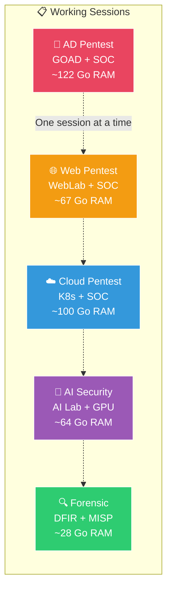
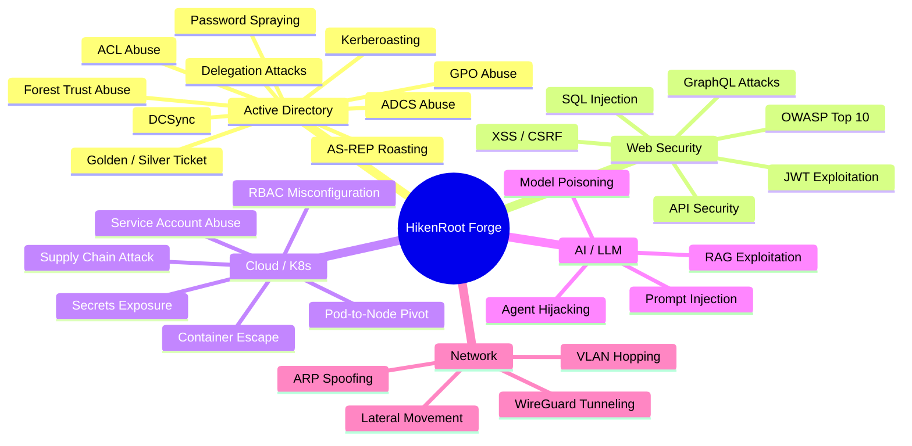

# Architecture Overview — HikenRoot Forge

## Global Infrastructure

```mermaid
graph TB
    subgraph INTERNET["☁️ Internet / External"]
        ARCHER["📡 Archer NX200 5G<br/>192.168.100.0/24"]
        KALI_EXT["🐉 Kali External<br/>192.168.100.10"]
    end

    subgraph BACKBONE["🔌 MikroTik CSS610-8P-2S+IN — 10G Backbone"]
        direction LR
        SW_PORT1["Port 1-4<br/>Beelink"]
        SW_PORT2["Port 5-8<br/>MS-02"]
        SW_SFP["SFP+ 10G"]
    end

    subgraph BEELINK["🖥️ Beelink EQR6 — Master Node"]
        direction TB
        BL_SPEC["AMD Ryzen 9 6900HX<br/>128 Go DDR5 | 1 To NVMe"]

        subgraph PFSENSE["🔥 pfSense — Central Firewall"]
            PF_WAN["WAN 192.168.50.250"]
            PF_VPN["WireGuard 10.10.10.0/24"]
            PF_VLAN["Inter-VLAN Routing"]
        end

        subgraph VLAN10["🏰 VLAN 10 — AD Lab (GOAD v3)"]
            DC01["DC01 — YOURSHIRE<br/>192.168.10.10"]
            DC02["DC02 — YOURSHIRE<br/>192.168.10.11"]
            DC03["DC03 — YOURSHIRE<br/>192.168.10.12"]
            SRV02["SRV02<br/>192.168.10.22"]
            SRV03["SRV03<br/>192.168.10.23"]
        end

        subgraph VLAN20["🌐 VLAN 20 — Web Lab"]
            WEBLAB["Docker WebLab<br/>192.168.20.10"]
            DVWA["DVWA :8081"]
            JUICE["Juice Shop :8082"]
            WEBGOAT["WebGoat :8083"]
            VAMPI["VAmPI :8084"]
            SQLI["SQLi-Labs :8086"]
        end

        PBS["💾 PBS<br/>192.168.50.129"]
    end

    subgraph MS02["🖥️ MS-02 Ultra — Compute Node"]
        direction TB
        MS_SPEC["Intel Core Ultra 9 285HX<br/>192 Go DDR5 ECC | 9 To NVMe"]
        GPU["🎮 RTX PRO 4000 Blackwell<br/>24 Go GDDR7 ECC | 70W TDP"]

        subgraph VLAN30["☁️ VLAN 30 — Cloud Lab"]
            K3S_M["K3s Master<br/>192.168.30.10"]
            K3S_W1["K3s Worker 1<br/>192.168.30.11"]
            K3S_W2["K3s Worker 2<br/>192.168.30.12"]
            EXAM_M["Kubeadm Master<br/>192.168.30.20"]
        end

        subgraph VLAN40["🤖 VLAN 40 — AI Lab"]
            OLLAMA["Ollama + Agents<br/>192.168.40.10<br/>GPU Passthrough"]
            RAG["RAG Vulnerable<br/>192.168.40.11"]
            HASHCAT["Hashcat<br/>192.168.40.12"]
        end

        subgraph VLAN50_DFIR["🔍 VLAN 50 — DFIR Lab"]
            SIFT["SIFT Workstation<br/>192.168.50.10"]
            THEHIVE["TheHive + Cortex<br/>192.168.50.11"]
        end

        subgraph VLAN60["🏭 VLAN 60 — OT/ICS Lab"]
            GRFICS["GRFICSv2<br/>192.168.60.10"]
            OPENPLC["OpenPLC<br/>192.168.60.12"]
        end

        subgraph SOC["🛡️ SOC Lab — Multi-VLAN"]
            WAZUH["Wazuh SIEM"]
            SECONION["Security Onion"]
            VELOCI["Velociraptor EDR"]
        end
    end

    subgraph NAS["💾 Synology DS923+"]
        SYNO["7.6 To NFS<br/>192.168.50.130"]
    end

    KALI_EXT --> ARCHER
    ARCHER -->|"Simulated External Attack"| BACKBONE
    PF_VPN -->|"WireGuard Tunnel"| KALI_VPN["🐉 Kali VPN<br/>10.10.10.2"]
    BACKBONE --- BEELINK
    BACKBONE --- MS02
    PBS -->|"NFS Backup"| SYNO
    PFSENSE -->|"Route"| VLAN10
    PFSENSE -->|"Route"| VLAN20
    PFSENSE -->|"Route"| VLAN30
    PFSENSE -->|"Route"| VLAN40

    style BEELINK fill:#1a1a2e,stroke:#e94560,stroke-width:2px
    style MS02 fill:#1a1a2e,stroke:#0f3460,stroke-width:2px
    style VLAN10 fill:#16213e,stroke:#e94560
    style VLAN20 fill:#16213e,stroke:#f39c12
    style VLAN30 fill:#16213e,stroke:#3498db
    style VLAN40 fill:#16213e,stroke:#9b59b6
    style SOC fill:#16213e,stroke:#2ecc71
    style PFSENSE fill:#0a3d62,stroke:#e94560,stroke-width:2px
```

## Session-Based Operation

The Forge runs in **session mode** — labs are activated based on the current training objective:

## GOAD v3 — Active Directory Topology

```mermaid
graph TB
    subgraph YOURSHIRE["🏰 Forest: YOURSHIRE"]
        DC01["DC01<br/>192.168.10.10<br/>Domain Controller"]
        DC02["DC02<br/>192.168.10.11<br/>Domain Controller"]
        SRV02["SRV02<br/>192.168.10.22<br/>Member Server"]
    end

    subgraph YOURSHIRE2["🏰 Forest 2"]
        DC03["DC03<br/>192.168.10.12<br/>Domain Controller"]
        SRV03["SRV03<br/>192.168.10.23<br/>Member Server"]
    end

    KALI["🐉 Kali Attacker<br/>10.10.10.2 (WireGuard)"]

    DC01 <-->|"Forest Trust"| DC03
    DC01 <--> DC02
    KALI -->|"Attack Path"| DC01
    KALI -->|"Attack Path"| SRV02
    KALI -->|"Attack Path"| DC03

    style YOURSHIRE fill:#2c1810,stroke:#e94560
    style YOURSHIRE2 fill:#2c1810,stroke:#f39c12
    style KALI fill:#2ecc71,stroke:#fff,color:#fff
```

## Attack Techniques Coverage

