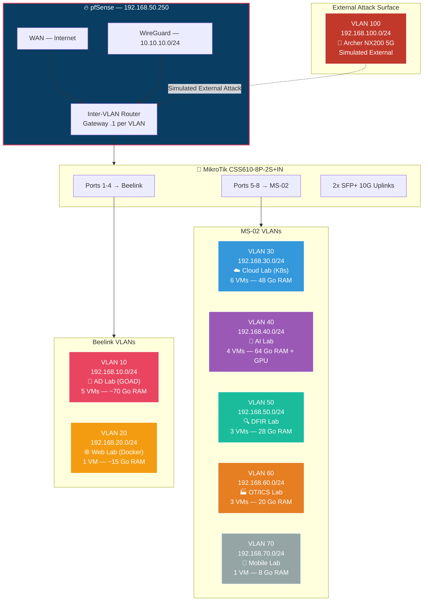
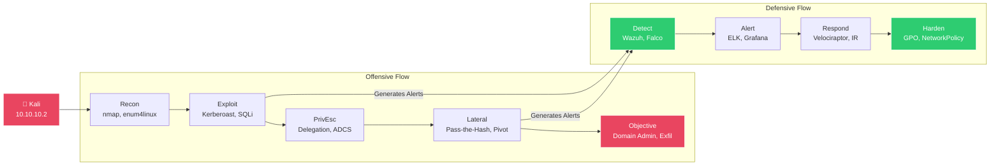
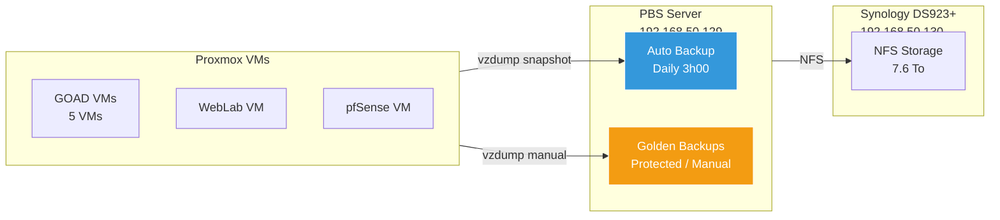

# Network Topology — HikenRoot Forge

## VLAN Segmentation

```mermaid
graph TB
    subgraph PFSENSE["🔥 pfSense — 192.168.50.250"]
        WAN["WAN — Internet"]
        WG["WireGuard — 10.10.10.0/24"]
        ROUTER["Inter-VLAN Router<br/>Gateway .1 per VLAN"]
    end

    subgraph MIKROTIK["🔌 MikroTik CSS610-8P-2S+IN"]
        P1["Ports 1-4 → Beelink"]
        P2["Ports 5-8 → MS-02"]
        SFP["2x SFP+ 10G Uplinks"]
    end

    WAN --> ROUTER
    WG --> ROUTER
    ROUTER --> MIKROTIK

    subgraph BEELINK_VLANS["Beelink VLANs"]
        V10["VLAN 10<br/>192.168.10.0/24<br/>🏰 AD Lab (GOAD)<br/>5 VMs — ~70 Go RAM"]
        V20["VLAN 20<br/>192.168.20.0/24<br/>🌐 Web Lab (Docker)<br/>1 VM — ~15 Go RAM"]
    end

    subgraph MS02_VLANS["MS-02 VLANs"]
        V30["VLAN 30<br/>192.168.30.0/24<br/>☁️ Cloud Lab (K8s)<br/>6 VMs — 48 Go RAM"]
        V40["VLAN 40<br/>192.168.40.0/24<br/>🤖 AI Lab<br/>4 VMs — 64 Go RAM + GPU"]
        V50["VLAN 50<br/>192.168.50.0/24<br/>🔍 DFIR Lab<br/>3 VMs — 28 Go RAM"]
        V60["VLAN 60<br/>192.168.60.0/24<br/>🏭 OT/ICS Lab<br/>3 VMs — 20 Go RAM"]
        V70["VLAN 70<br/>192.168.70.0/24<br/>📱 Mobile Lab<br/>1 VM — 8 Go RAM"]
    end

    subgraph EXTERNAL["External Attack Surface"]
        V100["VLAN 100<br/>192.168.100.0/24<br/>📡 Archer NX200 5G<br/>Simulated External"]
    end

    P1 --> BEELINK_VLANS
    P2 --> MS02_VLANS
    V100 -.->|"Simulated External Attack"| ROUTER

    style PFSENSE fill:#0a3d62,stroke:#e94560,stroke-width:2px,color:#fff
    style V10 fill:#e94560,stroke:#fff,color:#fff
    style V20 fill:#f39c12,stroke:#fff,color:#fff
    style V30 fill:#3498db,stroke:#fff,color:#fff
    style V40 fill:#9b59b6,stroke:#fff,color:#fff
    style V50 fill:#1abc9c,stroke:#fff,color:#fff
    style V60 fill:#e67e22,stroke:#fff,color:#fff
    style V70 fill:#95a5a6,stroke:#fff,color:#fff
    style V100 fill:#c0392b,stroke:#fff,color:#fff
```

## Data Flow — Attack & Defense

```mermaid
flowchart LR
    ATTACKER["🐉 Kali<br/>10.10.10.2"]

    subgraph ATTACK_PATH["Offensive Flow"]
        direction LR
        RECON["Recon<br/>nmap, enum4linux"]
        EXPLOIT["Exploit<br/>Kerberoast, SQLi"]
        PRIVESC["PrivEsc<br/>Delegation, ADCS"]
        LATERAL["Lateral<br/>Pass-the-Hash, Pivot"]
        OBJECTIVE["Objective<br/>Domain Admin, Exfil"]
    end

    subgraph DEFENSE["Defensive Flow"]
        direction LR
        DETECT["Detect<br/>Wazuh, Falco"]
        ALERT["Alert<br/>ELK, Grafana"]
        RESPOND["Respond<br/>Velociraptor, IR"]
        HARDEN["Harden<br/>GPO, NetworkPolicy"]
    end

    ATTACKER --> RECON --> EXPLOIT --> PRIVESC --> LATERAL --> OBJECTIVE
    EXPLOIT -->|"Generates Alerts"| DETECT
    LATERAL -->|"Generates Alerts"| DETECT
    DETECT --> ALERT --> RESPOND --> HARDEN

    style ATTACKER fill:#e94560,stroke:#fff,color:#fff
    style OBJECTIVE fill:#e94560,stroke:#fff,color:#fff
    style DETECT fill:#2ecc71,stroke:#fff,color:#fff
    style HARDEN fill:#2ecc71,stroke:#fff,color:#fff
```

## Backup Architecture

```mermaid
flowchart LR
    subgraph VMS["Proxmox VMs"]
        GOAD["GOAD VMs<br/>5 VMs"]
        WEBLAB["WebLab VM"]
        PF["pfSense VM"]
    end

    subgraph PBS_SRV["PBS Server<br/>192.168.50.129"]
        AUTO["Auto Backup<br/>Daily 3h00"]
        GOLDEN["Golden Backups<br/>Protected / Manual"]
    end

    subgraph SYNO["Synology DS923+<br/>192.168.50.130"]
        NFS["NFS Storage<br/>7.6 To"]
    end

    VMS -->|"vzdump snapshot"| AUTO
    VMS -->|"vzdump manual"| GOLDEN
    PBS_SRV -->|"NFS"| NFS

    style GOLDEN fill:#f39c12,stroke:#fff,color:#fff
    style AUTO fill:#3498db,stroke:#fff,color:#fff
```
