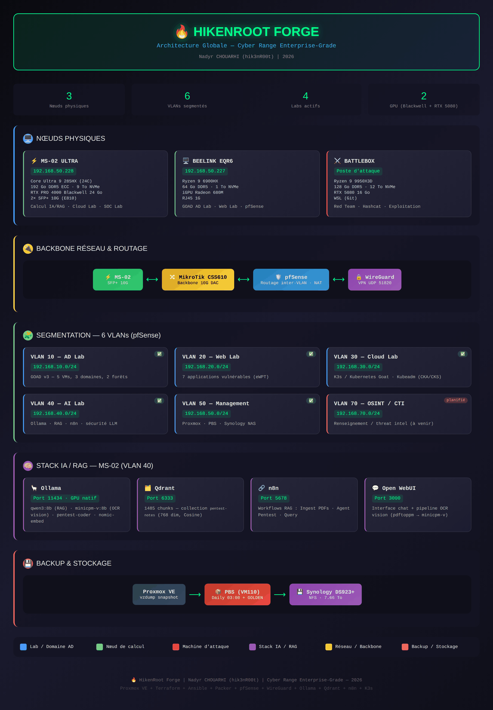

# HikenRoot Forge 🔥

**Cyber range professionnel construit autour d'une simulation d'entreprise réaliste**

> **Architecture globale** — 3 nœuds physiques · 6 VLANs · 4 labs actifs · GPU (Blackwell + RTX 5080). Diagramme complet → [architecture-globale.md](architecture-globale.md)

## Présentation

HikenRoot Forge est une plateforme auto-hébergée d'entraînement en cybersécurité conçue pour simuler des attaques et des défenses en conditions réelles d'entreprise. Contrairement aux labs CTF classiques, chaque scénario est construit autour de **MediaTech Groupe SA**, un groupe de presse numérique fictif avec des départements réalistes (DSI, Juridique, Finance, RH, Production éditoriale), une infrastructure Active Directory, des services cloud et des flux métiers.

Cette approche fait le lien entre l'exploitation technique et l'impact business — chaque write-up inclut un scoring CVSS, un mapping MITRE ATT&CK, une estimation de risque financier, une analyse réglementaire (RGPD/NIS2/ISO 27001) et des recommandations de remédiation à destination du COMEX.

## MediaTech Groupe SA — Contexte métier

Tous les scénarios techniques sont contextualisés autour de **MediaTech Groupe SA**, un groupe de presse numérique fictif (250 utilisateurs, multi-départements : DSI, Juridique, Finance, RH, Production, Prestataires). Ce cadre fait le lien entre l'exploitation brute et l'impact business réel.

**Dans chaque write-up**, la section « Impact métier » transpose les résultats techniques dans le contexte de MediaTech :
- Estimation du risque financier (€) basée sur des opérations réalistes de groupe de presse
- Analyse réglementaire — impacts RGPD, NIS2, ISO 27001
- Recommandations COMEX — décisions attendues de la direction après incident
- Matrice de risque — probabilité vs. impact (diagrammes Mermaid)

**Prévu — Simulation métier pilotée par l'IA :**
- Des agents LLM (Ollama + n8n) simuleront les employés MediaTech : utilisateurs naïfs répondant au phishing, interactions helpdesk, chatbots vulnérables
- Génération automatique de scénarios — le LLM crée des contextes d'attaque réalistes adaptés aux certifications visées (OSCP vs CRTO vs CRTE)
- Bibliothèque de scénarios métiers : fraude (SC-FIN), exfiltration de données (SC-JUR), menace interne (SC-IT), supply chain (SC-SUP), spear phishing (SC-USR) — environ 40 scénarios prévus
- Postes Windows 11 intégrés au domaine avec profils utilisateurs réalistes, déployés via Ansible + Terraform (provider Proxmox) — même approche IaC que GOAD

## Infrastructure

| Nœud | Caractéristiques | Rôle |
|---|---|---|
| **Beelink EQR6** | Ryzen 9 6900HX, 128 Go DDR5, 1 To NVMe | Lab AD GOAD, WebLab, pfSense, PBS |
| **MS-02 Ultra** | Core Ultra 9 285HX, 192 Go DDR5 ECC, 9 To NVMe, RTX PRO 4000 Blackwell 24 Go | Nœud de calcul, Ollama, labs Cloud/SOC |
| **Battlebox** | Ryzen 9 9950X3D, RTX 5080 16 Go, 128 Go DDR5, 12 To NVMe | Plateforme d'attaque, Hashcat, Red Team |

**Réseau :** pfSense + MikroTik CSS610 backbone 10G + VPN WireGuard

## Segmentation réseau

| VLAN | Sous-réseau | Fonction |
|---|---|---|
| 10 | 192.168.10.0/24 | Lab AD — GOAD v3 (5 DCs, 3 domaines, 2 forêts) |
| 20 | 192.168.20.0/24 | Lab Web — 7 applications vulnérables |
| 30 | 192.168.30.0/24 | Lab Cloud — K3s pentest + Kubeadm certification |
| 40 | 192.168.40.0/24 | Lab IA — Sécurité LLM, orchestration n8n |
| 50 | 192.168.50.0/24 | Management — Proxmox, PBS, NAS |

## Scénarios & Write-ups

### Lab Active Directory — GOAD v3

Environnement AD multi-forêts réaliste (sevenkingdoms.local, north.sevenkingdoms.local, essos.local) transposé dans l'infrastructure de MediaTech Groupe SA.

*Démo : Chaîne d'abus ACL — ForceChangePassword → Kerberoast → WriteDACL → AddSelf → ShadowCreds → DCSync → Domain Admin*

| Scénario | Titre | Techniques | Statut |
|---|---|---|---|
| SC-AD-001 | [Recon & Initial Foothold](labs/ad-lab/SC-AD-001-recon-and-initial-foothold.md) | nmap, LDAP anonyme, BloodHound, SYSVOL | ✅ |
| SC-AD-002 | [Credential Harvesting](labs/ad-lab/SC-AD-002-credential-harvesting.md) | AS-REP Roasting, Kerberoasting, Password Spray | ✅ |
| SC-AD-003 | [NTLM Relay & Poisoning](labs/ad-lab/SC-AD-003-NTLM-Relay-Poisoning.md) | Responder, ntlmrelayx, SMB relay | ✅ |
| SC-AD-004 | [ACL Abuse Chain](labs/ad-lab/SC-AD-004-acl-abuse-chain.md) | ForceChangePwd → GenericWrite → WriteDACL → DA | ✅ |
| SC-AD-005 | [noPac / SamAccountName Spoofing](labs/ad-lab/SC-AD-005-nopac-samaccountname-spoofing.md) | CVE-2021-42278/42287, PrintNightmare | ✅ |
| SC-AD-006 | [MSSQL Pivot](labs/ad-lab/SC-AD-006-mssql-pivot.md) | Impersonate, linked servers, xp_cmdshell | ✅ |
| SC-AD-007 | [Kerberos Delegation](labs/ad-lab/SC-AD-007-kerberos-delegation.md) | Unconstrained, Constrained, RBCD, Shadow Creds | ✅ |
| SC-AD-008 | [ADCS Certificate Abuse](labs/ad-lab/SC-AD-008-adcs-certificate-abuse.md) | ESC1/2/3/4/6/8, certipy, PetitPotam | ✅ |
| SC-AD-009 | [Domain Dominance](labs/ad-lab/SC-AD-009-domain-dominance.md) | Golden/Silver Ticket, AdminSDHolder, DCSync | ✅ |
| SC-AD-010 | [Cross-Forest Trusts](labs/ad-lab/SC-AD-010-cross-forest-trusts.md) | raiseChild, SID History, foreign groups | ✅ |
| SC-AD-011 | [Coerce & File-based Attacks](labs/ad-lab/SC-AD-011-coerce-file-based-attacks.md) | .lnk, .scf, .url, searchConnector-ms, WebDAV | ✅ |
| SC-AD-012 | [ADCS Avancé](labs/ad-lab/SC-AD-012-adcs-advanced.md) | ESC5 Golden Certificate, ESC9, ESC11 RPC Relay | ✅ |

### Lab Cloud & Kubernetes

| Scénario | Titre | Techniques | Statut |
|---|---|---|---|
| SC-CLD-001 | [Sensitive Keys in Codebases](labs/cloud-lab/SC-CLD-001-sensitive-keys-in-codebases.md) | Secrets Git, fuites env, exposition registry | ✅ |
| SC-CLD-002 | [SSRF in the Kubernetes World](labs/cloud-lab/SC-CLD-002-ssrf-in-the-kubernetes-world.md) | SSRF → metadata, tokens service account | ✅ |
| SC-CLD-003 | [Container Escape to Host](labs/cloud-lab/SC-CLD-003-container-escape-to-host-system.md) | Container privilégié, montage host, nsenter | ✅ |
| SC-CLD-004 | [RBAC Misconfiguration](labs/cloud-lab/SC-CLD-004-rbac-least-privileges-misconfiguration.md) | Abus ClusterRole, vol de token, mouvement latéral | ✅ |
| SC-CLD-005 | [Attacking Private Registry](labs/cloud-lab/SC-CLD-005-attacking-private-registry.md) | Énumération registry, altération d'images | ✅ |

### Format des write-ups

Chaque scénario suit un format professionnel standardisé :

1. **Classification** — Sévérité, CVSS 3.1, systèmes affectés
2. **Résumé exécutif** — Pour recruteur / auditeur ISO 27001 / RSSI
3. **Kill Chain** — Diagramme Mermaid du flux d'attaque
4. **Exploitation** — Étape par étape avec commandes réelles et sorties
5. **Impact métier — MediaTech Groupe SA** — Estimation financière, matrice de risque, impact réglementaire (RGPD/NIS2/ISO 27001), décisions COMEX
6. **Détection** — Event IDs Windows, règles Sigma, IOC
7. **Remédiation** — Secure by Design (0-24h / 1 semaine / 1 mois)
8. **Architecture cible** — Diagramme Mermaid

## Documentation technique

| Document | Description | Lien |
|---|---|---|
| GOAD HLD (EN) | High-Level Design — Architecture lab AD | [docs/goad/HLD_GOAD_EN.md](goad/HLD_GOAD_EN.md) |
| GOAD HLD (FR) | Architecture macro — Lab AD | [docs/goad/HLD_GOAD_FR.md](goad/HLD_GOAD_FR.md) |
| Architecture MS-02 | Hardware, stockage, GPU, réseau | [docs/ms02-architecture.md](ms02-architecture.md) |
| Configuration WireGuard | VPN pour accès pentest | [docs/goad/wireguard-setup.md](goad/wireguard-setup.md) |
| Stratégie de sauvegarde | PBS + NAS Synology + snapshots GOLDEN | [docs/goad/backup-strategy.md](goad/backup-strategy.md) |
| Troubleshooting | 50+ problèmes résolus | [docs/goad/troubleshooting.md](goad/troubleshooting.md) |
| Roadmap Lab AD | Suivi de progression GOAD | [docs/labs/ad-lab/ROADMAP.md](labs/ad-lab/ROADMAP.md) |
| Diagramme réseau GOAD | Topologie complète du lab (image) | [docs/goad/GOAD-Network-Diagram.md](goad/GOAD-Network-Diagram.md) |

## Ingénierie assistée par IA

L'IA est utilisée dans ce projet comme un **outil d'ingénierie** — souverain, local, et sous contrôle humain :

- **Lab LLM souverain (VLAN 40) :** les modèles sont servis localement via **Ollama** sur le nœud MS-02 Ultra (RTX PRO 4000 Blackwell) et orchestrés avec **n8n** — les opérations du lab ne dépendent d'aucune API IA externe.
- **RAG local sur les notes de pentest :** un pipeline de recherche indexe les write-ups, notes de méthodologie et documentation du lab pour accélérer la recherche et croiser les découvertes entre scénarios.
- **Conventions repo pour assistants IA :** le fichier [`CLAUDE.md`](../CLAUDE.md) à la racine encode la structure, le format des write-ups et les conventions du dépôt afin que tout assistant IA utilisé en maintenance reste cohérent. Chaque sortie est **relue et validée par l'humain** avant commit — l'IA accélère la rédaction et le croisement, l'auteur assume chaque affirmation technique.

## Alignement certifications

| Certification | Labs couverts |
|---|---|
| OSCP+ | Lab AD GOAD + WebLab |
| CRTO / CRTP / CRTE | Lab AD GOAD + C2 |
| eWPT | WebLab (7 apps) |
| CKA / CKAD / CKS | Cluster Kubeadm (VLAN 30) |
| AZ-500 | Cluster K3s pentest |
| CAIPT-RT / C-AI/MLPen | Lab IA (VLAN 40) |

## État du projet

| Phase | Périmètre | Statut |
|---|---|---|
| Phase 1 | Socle infrastructure | ✅ Terminé |
| Phase 2 | Cloud + IA + SOC + Guacamole | 🔧 En cours |
| Phase 3 | DFIR + OT/ICS + Mobile | 📋 Prévu |
| Phase 4 | Documentation GitBook FR/EN | 📋 Prévu |

## Écosystème HikenRoot Forge

Autres dépôts du projet :

- [ad-hardening-baseline](https://github.com/hikenroot/ad-hardening-baseline) — Boîte à outils PowerShell de durcissement AD (CIS / NIST 800-53 / ISO 27001 / MITRE ATT&CK), testée sur GOAD.
- [m365-admin-toolkit](https://github.com/hikenroot/m365-admin-toolkit) — scripts d'audit Microsoft 365 en lecture seule (exfiltration Exchange, délégation de boîtes, Conditional Access / MFA) mappés CIS / NIST 800-53 / Purview Unified Audit Log.

## Auteur

**hik3nR00t** — 21 ans d'ingénierie d'infrastructure d'entreprise, désormais spécialisé en sécurité Active Directory & identité (offensif + défensif). OSCP+ · ISO 27001 Lead Implementer · SC-300 · CRTP (en cours).

---

*HikenRoot Forge — Cyber range professionnel*
