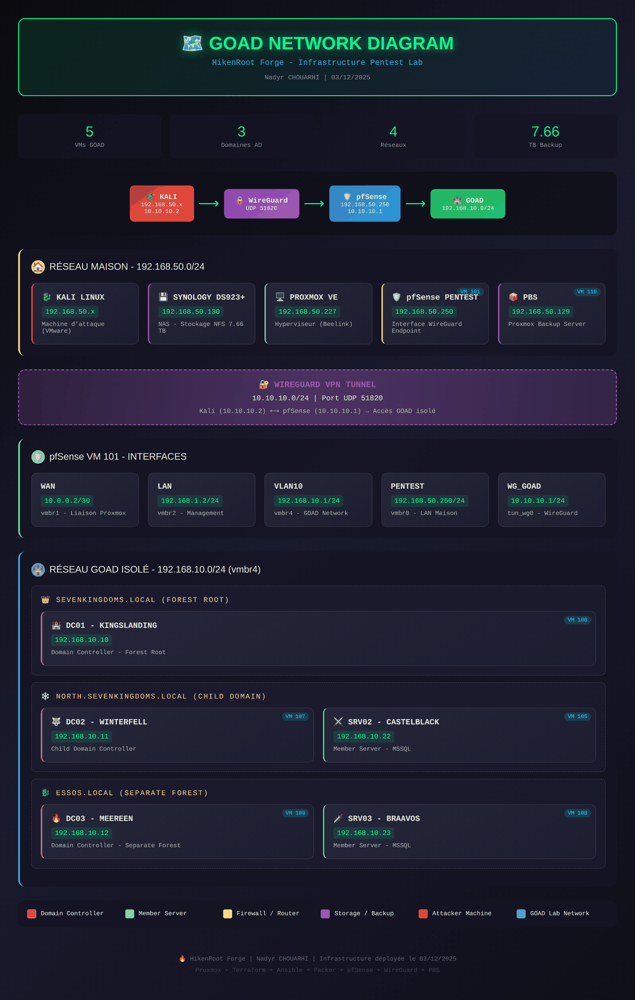

# GOAD — Diagramme réseau du lab / Lab Network Diagram

Topologie réseau du **lab Active Directory GOAD v3** au sein de HikenRoot Forge : chaîne d'accès (Kali → WireGuard → pfSense → GOAD), réseau d'administration, interfaces pfSense, et le réseau GOAD isolé (3 domaines, 5 VMs).

> **Périmètre** : ce diagramme couvre le **lab GOAD (VLAN 10)** et son accès — état de décembre 2025.
> L'**architecture globale** de HikenRoot Forge (3 nœuds physiques, 6 VLANs, labs Cloud/IA/SOC) est documentée dans [`ms02-architecture.md`](../ms02-architecture.md).

> **Version interactive** : le rendu HTML stylé est dans [`GOAD_Network_Diagram.html`](GOAD_Network_Diagram.html).
> GitHub n'affiche pas les fichiers `.html` directement — ouvre-le en local dans un navigateur, ou publie-le via GitHub Pages. L'image ci-dessus en est le rendu fidèle.

---

*HikenRoot Forge — GOAD v3 — hik3nR00t*
