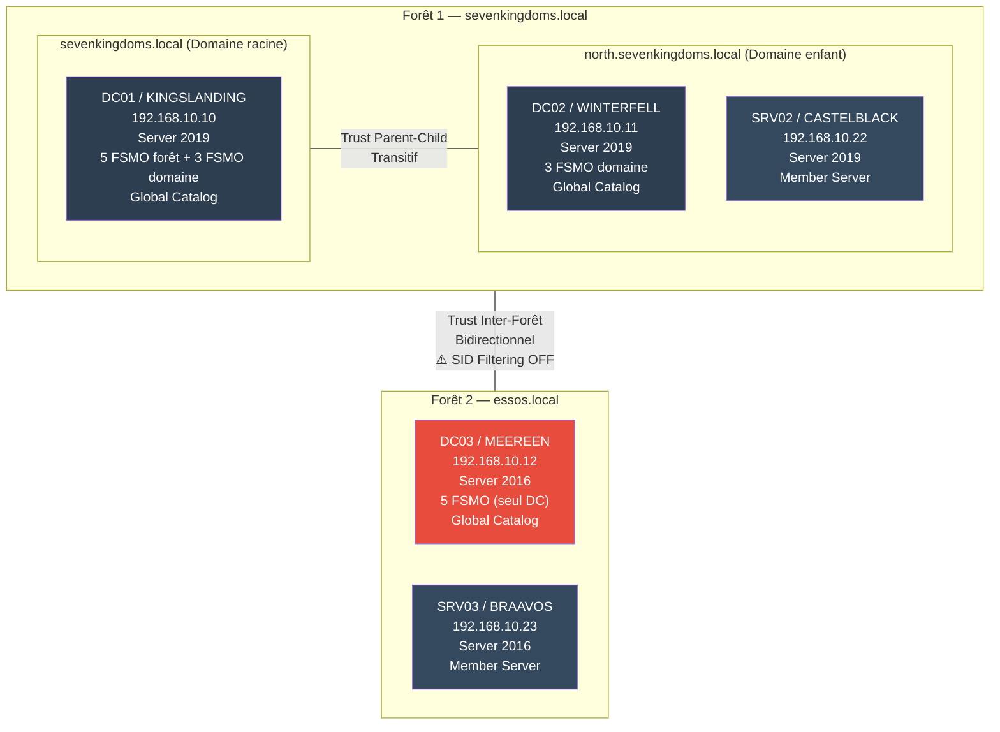
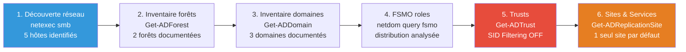
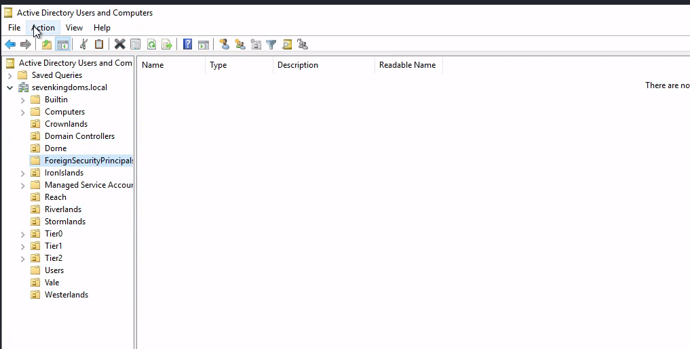
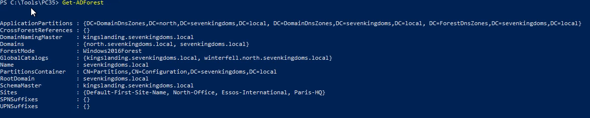
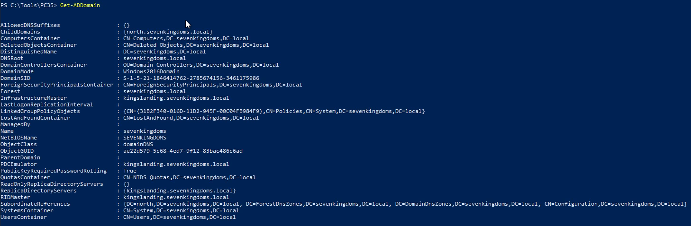
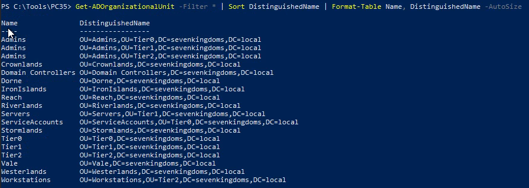
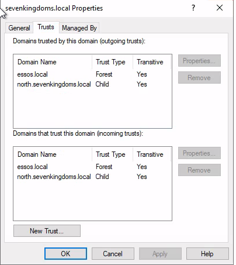
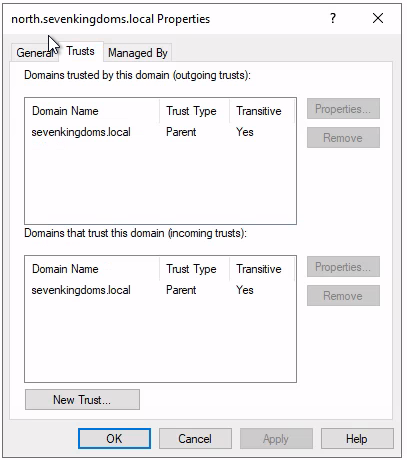
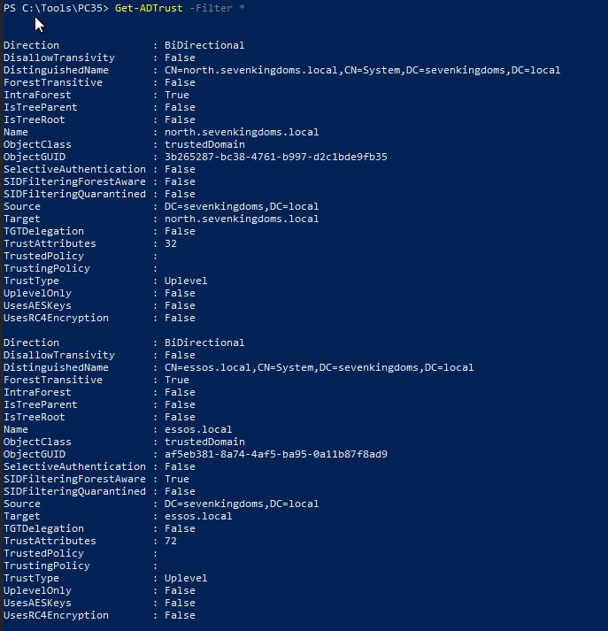

# SC-ID-001 — Cartographie AD Multi-Forêts

## Classification

| Champ | Valeur |
|-------|--------|
| **Code scénario** | SC-ID-001 |
| **Nom** | Cartographie AD Multi-Forêts — Inventaire complet de l'environnement Active Directory |
| **Cible** | GOAD v3 — 192.168.10.0/24 (2 forêts, 3 domaines, 5 machines) |
| **VLAN** | 10 — AD Lab (192.168.10.0/24) |
| **Phase** | Phase 1 — Auditer |
| **Référentiel** | ISO 27001 A.8 (Gestion des actifs), ANSSI PA-022 |
| **Date** | Février 2026 |
| **Auteur** | hik3nR00t |

---

## Résumé exécutif

### Pour un recruteur

Ce scénario démontre la capacité à **cartographier une infrastructure Active Directory complexe** (multi-forêts, multi-domaines) en conditions réelles. L'exercice couvre la découverte réseau, l'inventaire des contrôleurs de domaine, l'analyse des FSMO, la documentation des trusts inter-forêts et l'identification des risques architecturaux. C'est la première étape de toute mission Identity — sans cartographie fiable, aucun hardening ni hybridation ne peut être planifié.

### Pour un auditeur ISO 27001 / NIS2

La cartographie exhaustive de l'annuaire Active Directory répond directement aux exigences de l'ISO 27001 **A.8 Gestion des actifs** (inventaire des actifs informationnels) et aux recommandations ANSSI **PA-022** (administration sécurisée des SI). L'absence de documentation à jour de l'infrastructure AD est un finding récurrent dans les audits de conformité. Ce scénario produit un inventaire structuré couvrant les forêts, domaines, trusts, FSMO, sites, et Global Catalogs.

### Pour un RSSI

La cartographie révèle 7 findings architecturaux dont 2 critiques : SID Filtering désactivé sur le trust inter-forêt (risque d'élévation de privilèges cross-forest) et un DC unique pour toute la forêt essos.local (single point of failure). Ces findings constituent le socle du plan de remédiation qui sera implémenté dans les scénarios suivants.

---

## Architecture découverte



---

## Méthodologie



---

### Preuves — Forêts et Domaines









### Preuves — Relations d'approbation (Trusts)







---

## Étape 1 — Découverte réseau

**Commande :**
```bash
netexec smb 192.168.10.0/24
```

**Résultat :**
```
SMB  192.168.10.10  445  KINGSLANDING  Windows Server 2019  (domain:sevenkingdoms.local)  signing:True   SMBv1:False
SMB  192.168.10.11  445  WINTERFELL    Windows Server 2019  (domain:north.sevenkingdoms.local)  signing:True   SMBv1:False
SMB  192.168.10.12  445  MEEREEN       Windows Server 2016  (domain:essos.local)  signing:True   SMBv1:True
SMB  192.168.10.22  445  CASTELBLACK   Windows Server 2019  (domain:north.sevenkingdoms.local)  signing:False  SMBv1:False
SMB  192.168.10.23  445  BRAAVOS       Windows Server 2016  (domain:essos.local)  signing:False  SMBv1:True
```

**Analyse :**
- 3 domaines identifiés, 2 forêts distinctes
- BRAAVOS et CASTELBLACK : SMB Signing désactivé → vulnérables au relay NTLM
- MEEREEN et BRAAVOS : SMBv1 actif → protocole obsolète, surface d'attaque

---

## Étape 2 — Inventaire de la forêt sevenkingdoms.local

**Commande (depuis DC01) :**
```powershell
Get-ADForest
```

**Résultat clé :**
- Nom : `sevenkingdoms.local`
- Mode : `Windows2016Forest`
- Schema Master : `kingslanding.sevenkingdoms.local`
- Domain Naming Master : `kingslanding.sevenkingdoms.local`
- Global Catalogs : `kingslanding` + `winterfell`
- Domaines : `sevenkingdoms.local` + `north.sevenkingdoms.local`
- Sites : `Default-First-Site-Name` (un seul → non configuré)

---

## Étape 3 — Inventaire des domaines

**Commande (depuis DC01) :**
```powershell
Get-ADDomain
```

| Attribut | sevenkingdoms.local | north.sevenkingdoms.local | essos.local |
|---|---|---|---|
| DC | kingslanding | winterfell | meereen |
| Mode domaine | Windows2016Domain | Windows2016Domain | Windows2016Domain |
| PDC Emulator | kingslanding | winterfell | meereen |
| RID Master | kingslanding | winterfell | meereen |
| Infrastructure Master | kingslanding | winterfell | meereen |

---

## Étape 4 — Distribution FSMO

**Commande :**
```powershell
netdom query fsmo
```

**Forêt sevenkingdoms.local :**
- Schema Master → KINGSLANDING
- Domain Naming Master → KINGSLANDING
- PDC Emulator → KINGSLANDING
- RID Master → KINGSLANDING
- Infrastructure Master → KINGSLANDING

**Domaine north.sevenkingdoms.local :**
- PDC Emulator → WINTERFELL
- RID Master → WINTERFELL
- Infrastructure Master → WINTERFELL

**Forêt essos.local :**
- Les 5 FSMO → MEEREEN (seul DC)

**Finding :** KINGSLANDING porte les 5 FSMO de la forêt parent. En prod, on distribue le Schema Master et Domain Naming Master sur un DC séparé pour la résilience. MEEREEN porte tout seul les 5 FSMO d'essos → single point of failure.

---

## Étape 5 — Trusts inter-domaines et inter-forêts

**Commande :**
```powershell
Get-ADTrust -Filter *
```

**Résultat :**

| Source | Destination | Direction | Type | SID Filtering |
|---|---|---|---|---|
| sevenkingdoms.local | north.sevenkingdoms.local | Bidirectionnel | Parent-Child | N/A (même forêt) |
| sevenkingdoms.local | essos.local | Bidirectionnel | External | ⚠️ OFF |

**Finding critique :** Le SID Filtering est désactivé sur le trust inter-forêt sevenkingdoms ↔ essos. Un attaquant qui compromet un DC dans essos peut forger un ticket Kerberos avec un SID History appartenant à sevenkingdoms et obtenir des privilèges cross-forest. En prod, le SID Filtering doit toujours être activé sur les trusts inter-forêts.

---

## Étape 6 — Sites & Services AD

**Commandes :**
```powershell
Get-ADReplicationSite -Filter *
Get-ADReplicationSubnet -Filter *
Get-ADReplicationSiteLink -Filter *
```

**Résultat :**
- **Sites :** 1 seul → `Default-First-Site-Name`
- **Subnets :** aucun déclaré
- **SiteLink :** `DEFAULTIPSITELINK`, cost 100, intervalle 180 min

**Finding :** Aucune topologie de sites configurée. Les clients AD ne savent pas quel DC est "proche" d'eux. En environnement multi-sites (bureaux distants), ça cause des authentifications lentes et une réplication non optimisée. Ce sera corrigé dans SC-ID-003.

---

## Synthèse des findings

| # | Finding | Criticité | Catégorie |
|---|---|---|---|
| F1 | SID Filtering OFF sur trust inter-forêt essos ↔ sevenkingdoms | 🔴 Critique | Trusts |
| F2 | Meereen single DC pour toute la forêt essos — zéro redondance | 🔴 Critique | Architecture |
| F3 | Aucun site AD configuré | 🟠 Haut | Sites & Services |
| F4 | Aucun subnet déclaré | 🟠 Haut | Sites & Services |
| F5 | SMB Signing OFF sur CASTELBLACK et BRAAVOS | 🟠 Haut | Sécurité réseau |
| F6 | SMBv1 actif sur MEEREEN et BRAAVOS | 🟠 Haut | Sécurité réseau |
| F7 | KINGSLANDING porte les 5 FSMO de sevenkingdoms seul | 🟡 Moyen | Résilience |

---

## Remédiation proposée

| Priorité | Action | Scénario associé |
|---|---|---|
| P0 | Activer SID Filtering sur le trust inter-forêt | Remédiation manuelle |
| P0 | Ajouter un second DC à essos.local | Hors scope lab |
| P1 | Créer des sites AD et déclarer les subnets | SC-ID-003 |
| P1 | Activer SMB Signing sur tous les serveurs | GPO — SC-ID-007 |
| P2 | Désactiver SMBv1 sur MEEREEN et BRAAVOS | GPO — SC-ID-007 |
| P2 | Distribuer les FSMO de sevenkingdoms | Recommandation |

---

## Correspondance mission client

| Étape lab | Équivalent mission client |
|---|---|
| netexec + Get-ADForest | Audit de posture Identity — inventaire de l'existant |
| Tableau FSMO + trusts | Livrable "État des lieux AD" pour le client |
| Findings F1-F7 | Matrice de risques priorisée dans le rapport d'audit |
| Remédiation proposée | Plan de remédiation chiffré présenté au RSSI/COMEX |
