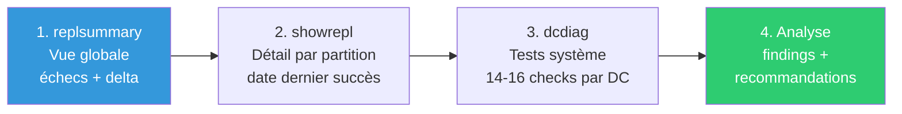

# SC-ID-002 — Santé Réplication AD

## Classification

| Champ | Valeur |
|-------|--------|
| **Code scénario** | SC-ID-002 |
| **Nom** | Santé Réplication — Diagnostic de la réplication inter-DC |
| **Cible** | GOAD v3 — 3 DC (KINGSLANDING, WINTERFELL, MEEREEN) |
| **Phase** | Phase 1 — Auditer |
| **Référentiel** | ANSSI PA-022, Microsoft AD Best Practices |
| **Date** | Février 2026 |
| **Auteur** | Nadyr Chouarhi (hik3nR00t) |

---

## Résumé exécutif

### Pour un recruteur

Ce scénario démontre la capacité à **diagnostiquer l'état de santé de la réplication Active Directory** sur une infrastructure multi-DC / multi-forêts. L'analyse couvre la réplication intra-forêt (KINGSLANDING ↔ WINTERFELL), l'absence de partenaires pour le DC isolé (MEEREEN), et l'identification des problèmes DFSR au démarrage. C'est une compétence N3 attendue d'un architecte Identity — savoir lire un `repadmin /replsummary` et en tirer des actions concrètes.

### Pour un RSSI

La réplication AD est le mécanisme qui assure la cohérence des données d'authentification entre les DC. Un problème de réplication non détecté peut entraîner des incohérences de mots de passe, des lockouts, ou dans le pire cas une corruption de l'annuaire. L'audit révèle un risque critique : MEEREEN n'a aucun partenaire de réplication (DC unique de la forêt essos.local).

---

## Méthodologie



---

## Étape 1 — Vue globale (replsummary)

**Commande (depuis KINGSLANDING) :**
```powershell
repadmin /replsummary
```

**Résultat :**
- KINGSLANDING ↔ WINTERFELL : **0 échecs** sur 4 partitions, delta ~46 min → OK
- MEEREEN n'apparaît pas → normal, forêt séparée (le trust ne réplique pas les données AD)

**Les 4 partitions répliquées entre KINGSLANDING et WINTERFELL :**
1. **Schema** — définition des classes et attributs AD
2. **Configuration** — paramètres forêt-wide (sites, services)
3. **ForestDnsZones** — enregistrements DNS niveau forêt
4. **DC=north** — partition du domaine enfant (KINGSLANDING est GC, réplique un sous-ensemble read-only)

---

## Étape 2 — Détail par DC (showrepl)

**Commande :**
```powershell
repadmin /showrepl
```

**KINGSLANDING :** 4 partitions répliquent avec WINTERFELL via RPC, toutes en succès.

**WINTERFELL :** Réplique avec KINGSLANDING, 0 échec.

**MEEREEN :** Aucun partenaire de réplication. Sortie vide.

---

## Étape 3 — Diagnostic système (dcdiag)

**Commande (exécutée sur chaque DC) :**
```powershell
dcdiag /v
```

| DC | Tests réussis | Tests total | Findings |
|---|---|---|---|
| KINGSLANDING | 14 | 16 | DFSR transitoire au boot |
| WINTERFELL | 13 | 16 | DFSR + faux positifs auth cross-domain |
| MEEREEN | 14 | 16 | DFSR + erreurs COM (Server 2016) |

**Problème DFSR commun aux 3 DC :** Erreur 160 au boot — le champ DC est vide pendant les premières minutes de démarrage, puis se résout. Problème systémique lié à l'ordre de démarrage DNS/DFSR dans l'environnement GOAD. Non bloquant mais à documenter.

---

## Synthèse des findings

| # | Finding | Criticité | Catégorie |
|---|---|---|---|
| F1 | MEEREEN : aucun partenaire de réplication (DC unique forêt essos) | 🔴 Critique | Résilience |
| F2 | DFSR erreur 160 au boot sur les 3 DC | 🟡 Moyen | Démarrage |
| F3 | Erreurs COM (EventID 0x2720) sur MEEREEN (Server 2016) | 🟢 Faible | OS |

---

## Recommandations

| Priorité | Action |
|---|---|
| P0 | Ajouter un second DC à essos.local pour assurer la redondance |
| P1 | Investiguer l'ordre de démarrage DNS/DFSR (dépendance de service) |
| P2 | Corriger les permissions DCOM sur MEEREEN |

---

## Correspondance mission client

| Étape lab | Équivalent mission client |
|---|---|
| repadmin /replsummary | Check quotidien N2 ou audit ponctuel architecte |
| dcdiag /v sur chaque DC | Diagnostic post-incident ou pré-migration |
| Finding MEEREEN isolé | Recommandation architecturale dans le rapport d'audit |
| Tableau de synthèse | Livrable "Santé réplication" pour le client |
