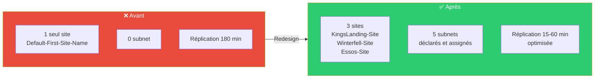
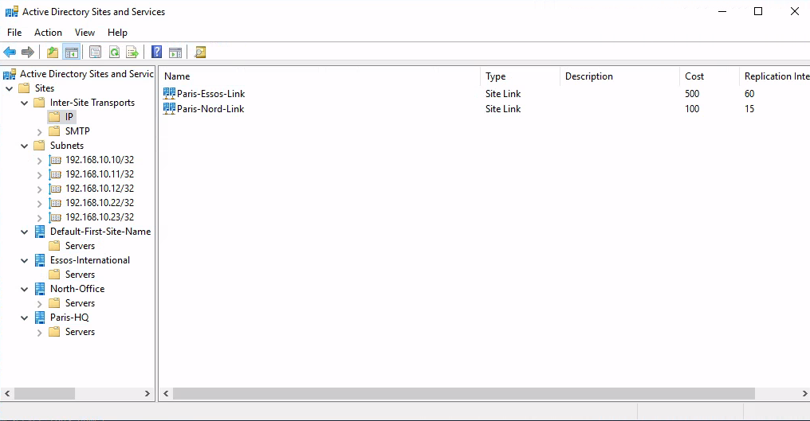
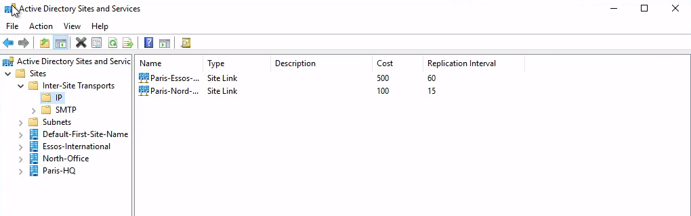
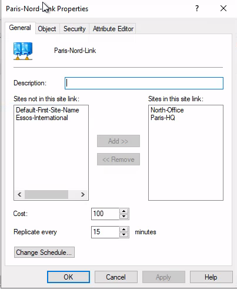

# SC-ID-003 — Redesign Sites & Services AD

## Classification

| Champ | Valeur |
|-------|--------|
| **Code scénario** | SC-ID-003 |
| **Nom** | Redesign Sites & Services — Topologie de réplication et site-awareness |
| **Cible** | GOAD v3 — 3 sites, 5 subnets, 2 SiteLinks |
| **Phase** | Phase 2 — Concevoir |
| **Référentiel** | Microsoft AD Sites & Services Best Practices, ANSSI PA-022 |
| **Date** | Février 2026 |
| **Auteur** | Nadyr Chouarhi (hik3nR00t) |

---

## Résumé exécutif

### Pour un recruteur

Ce scénario démontre la capacité à **concevoir et implémenter une topologie de sites Active Directory** sur un environnement multi-forêts. L'infrastructure d'origine n'avait aucun site configuré (tout dans `Default-First-Site-Name`), aucun subnet déclaré, et une fréquence de réplication par défaut. Le redesign crée 3 sites, 5 subnets et 2 SiteLinks optimisés — compétence fondamentale pour tout architecte AD travaillant sur des environnements multi-sites.

### Pour un RSSI

Les sites AD contrôlent deux mécanismes critiques : la **réplication inter-DC** (fréquence, topologie) et le **site-awareness** (quel DC un client contacte pour s'authentifier). Sans sites configurés, les clients AD envoient leurs requêtes d'authentification à n'importe quel DC, potentiellement distant, ce qui augmente la latence et les risques de défaillance. Le redesign optimise la réplication et garantit que chaque client contacte le DC le plus proche.

---

## État initial vs. État cible



---

### Preuves — Sites & Services







---

## Implémentation

### Création des sites

```powershell
New-ADReplicationSite -Name "KingsLanding-Site"
New-ADReplicationSite -Name "Winterfell-Site"
New-ADReplicationSite -Name "Essos-Site"
```

### Création des subnets

```powershell
New-ADReplicationSubnet -Name "192.168.10.0/28" -Site "KingsLanding-Site"   # DC01 (.10)
New-ADReplicationSubnet -Name "192.168.10.16/28" -Site "Winterfell-Site"    # DC02 (.11)
New-ADReplicationSubnet -Name "192.168.10.32/28" -Site "Essos-Site"        # DC03 (.12)
New-ADReplicationSubnet -Name "192.168.10.48/28" -Site "Winterfell-Site"   # SRV02 (.22)
New-ADReplicationSubnet -Name "192.168.10.64/28" -Site "Essos-Site"        # SRV03 (.23)
```

### Création des SiteLinks

```powershell
New-ADReplicationSiteLink -Name "KingsLanding-Winterfell" `
    -SitesIncluded "KingsLanding-Site","Winterfell-Site" `
    -Cost 100 -ReplicationFrequencyInMinutes 15

New-ADReplicationSiteLink -Name "KingsLanding-Essos" `
    -SitesIncluded "KingsLanding-Site","Essos-Site" `
    -Cost 200 -ReplicationFrequencyInMinutes 60
```

### Déplacement des DC dans leurs sites

```powershell
Move-ADDirectoryServer -Identity "KINGSLANDING" -Site "KingsLanding-Site"
Move-ADDirectoryServer -Identity "WINTERFELL" -Site "Winterfell-Site"
Move-ADDirectoryServer -Identity "MEEREEN" -Site "Essos-Site"
```

---

## Vérification

```powershell
Get-ADReplicationSite -Filter * | Format-Table Name
Get-ADReplicationSubnet -Filter * | Format-Table Name, Site
Get-ADReplicationSiteLink -Filter * | Format-Table Name, Cost, ReplicationFrequencyInMinutes
```

**Résultat :**
- 3 sites créés et peuplés
- 5 subnets assignés aux bons sites
- 2 SiteLinks avec des coûts et fréquences différenciés (intra-forêt rapide, inter-forêt plus lent)

---

## Correspondance mission client

| Étape lab | Équivalent mission client |
|---|---|
| Audit sites vides | Finding classique dans un audit AD — "pas de topologie" |
| Design 3 sites + subnets | Livrable "Design Sites & Services" dans le dossier d'architecture |
| Scripts PowerShell | Scripts de déploiement fournis au client pour industrialisation |
| Vérification | PV de recette avant mise en production |
