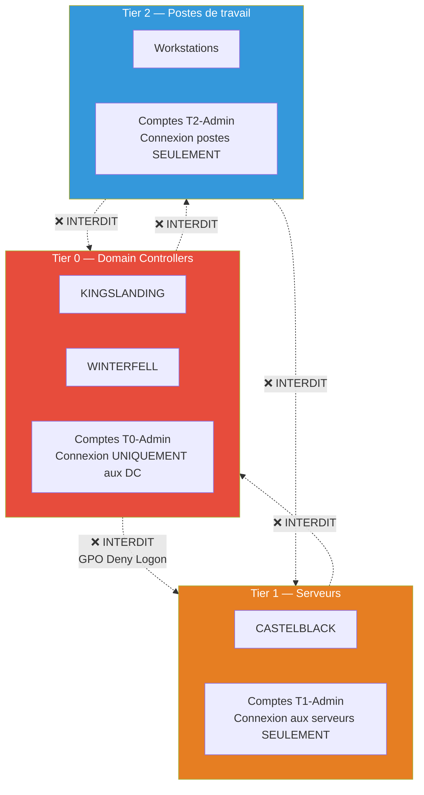
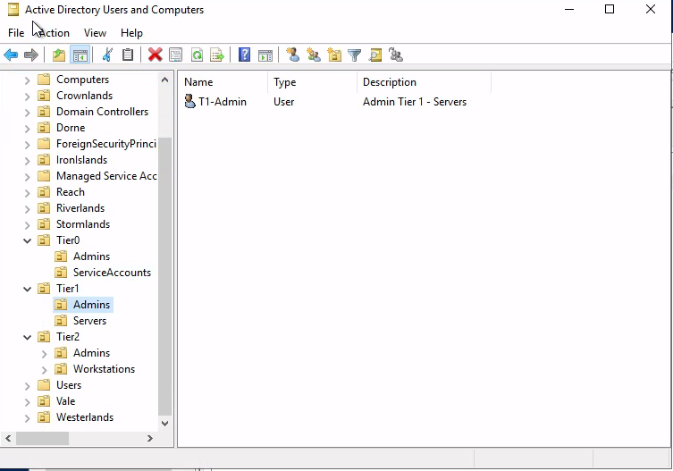
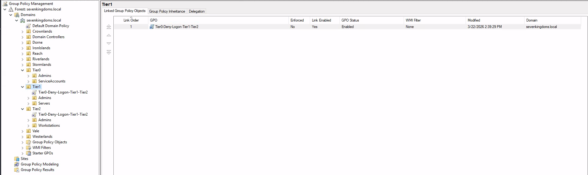
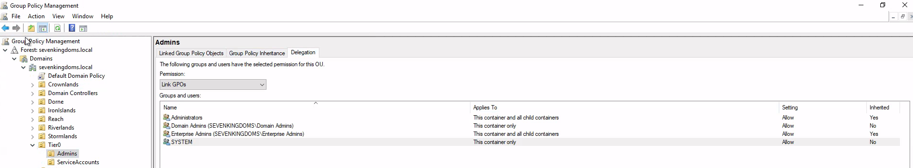
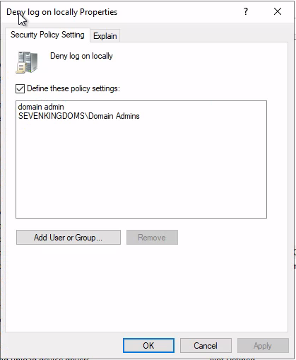
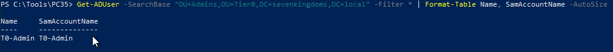

# SC-ID-004 — Tiering Model

## Classification

| Champ | Valeur |
|-------|--------|
| **Code scénario** | SC-ID-004 |
| **Nom** | Tiering Model — Séparation des privilèges par niveaux |
| **Cible** | GOAD v3 — sevenkingdoms.local, north.sevenkingdoms.local |
| **Phase** | Phase 2 — Concevoir & Implémenter |
| **Référentiel** | Microsoft Tiering Model, ANSSI PA-022, ESAE |
| **Date** | Février 2026 |
| **Auteur** | Nadyr Chouarhi (hik3nR00t) |

---

## Résumé exécutif

### Pour un recruteur

Le Tiering Model est le **fondement de toute architecture AD sécurisée**. Ce scénario implémente la séparation des privilèges en 3 niveaux (Tier 0 / Tier 1 / Tier 2) avec création des OUs dédiées, des comptes d'administration par tier, et des GPO de restriction de connexion. C'est la recommandation numéro 1 de Microsoft et de l'ANSSI pour sécuriser Active Directory. Un architecte Identity senior doit savoir le concevoir et l'implémenter.

### Pour un RSSI

Sans Tiering Model, un compte admin qui gère les postes de travail (Tier 2) peut se connecter aux contrôleurs de domaine (Tier 0). Si ce compte est compromis (phishing, malware poste utilisateur), l'attaquant obtient un accès direct aux DC. Le Tiering empêche cette escalade en interdisant les connexions cross-tier via GPO.

---

## Architecture Tiering



---

### Preuves — Implémentation du Tiering











---

## Implémentation

### Structure OUs créée (9 OUs)

```
sevenkingdoms.local
├── Tier0
│   ├── Accounts    → comptes admin Tier 0
│   ├── Groups      → groupes Tier 0
│   └── Servers     → (DC déjà dans Domain Controllers)
├── Tier1
│   ├── Accounts    → comptes admin Tier 1
│   ├── Groups      → groupes Tier 1
│   └── Servers     → serveurs membres
└── Tier2
    ├── Accounts    → comptes admin Tier 2
    ├── Groups      → groupes Tier 2
    └── Workstations → postes de travail
```

### Comptes d'administration créés

| Compte | Tier | Usage |
|---|---|---|
| T0-Admin | Tier 0 | Administration des DC uniquement |
| T1-Admin | Tier 1 | Administration des serveurs membres |
| T2-Admin | Tier 2 | Administration des postes de travail |

### GPO de restriction — Deny Logon

**GPO "Tiering-Deny-T1T2-on-DC" liée à l'OU Domain Controllers :**
- Deny log on locally → T1-Admin, T2-Admin
- Deny log on through Remote Desktop → T1-Admin, T2-Admin
- Deny access to this computer from the network → T1-Admin, T2-Admin

**Effet :** Les comptes Tier 1 et Tier 2 ne peuvent physiquement pas se connecter aux contrôleurs de domaine, même si un attaquant obtient leurs credentials.

---

## Vérification

```powershell
# Vérifier les OUs
Get-ADOrganizationalUnit -Filter * | Where-Object {$_.Name -match "Tier"} | Select Name, DistinguishedName

# Vérifier la GPO
gpresult /r /scope computer  # Sur un DC — doit montrer la GPO Tiering
```

---

## Correspondance mission client

| Étape lab | Équivalent mission client |
|---|---|
| Design Tiering 3 niveaux | Livrable "Architecture cible AD" — schéma directeur |
| Création OUs + comptes | Implémentation contrôlée — change management |
| GPO Deny Logon | Durcissement — validation avec les équipes ops |
| Test de connexion cross-tier | PV de recette — preuve que la restriction fonctionne |
