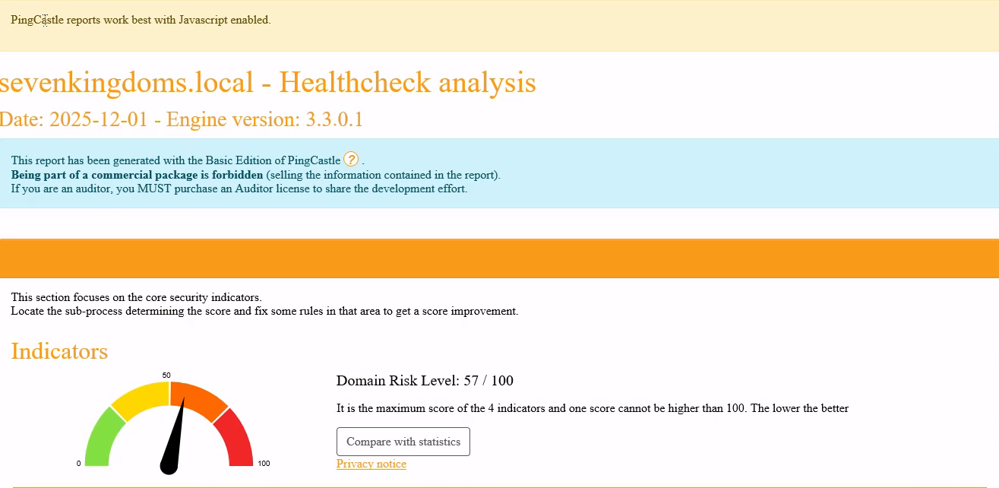
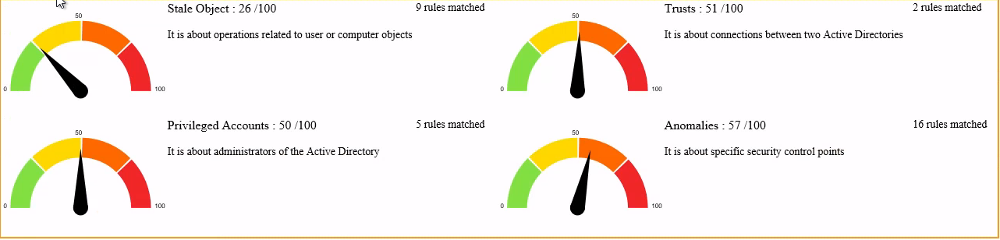
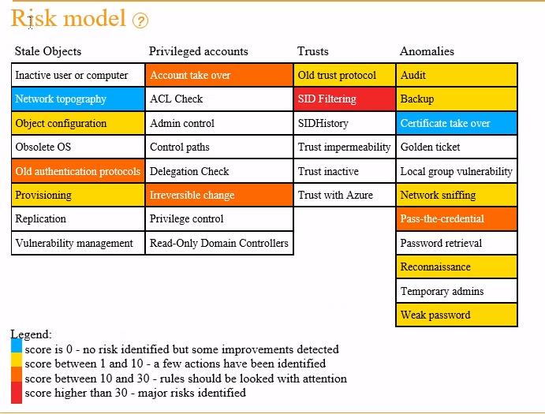
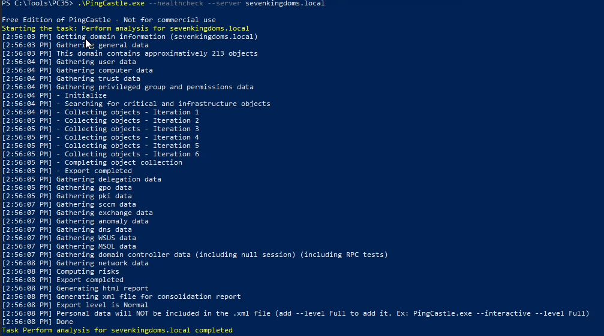

# SC-ID-005 — Audit PingCastle

## Classification

| Champ | Valeur |
|-------|--------|
| **Code scénario** | SC-ID-005 |
| **Nom** | Audit PingCastle — Score de maturité AD sur 3 domaines |
| **Cible** | sevenkingdoms.local, north.sevenkingdoms.local, essos.local |
| **Phase** | Phase 1 — Auditer |
| **Référentiel** | PingCastle Risk Model, ANSSI AD Security |
| **Date** | Mars 2026 |
| **Auteur** | hik3nR00t |

---

## Résumé exécutif

### Pour un recruteur

PingCastle est l'outil de référence pour l'**audit de sécurité Active Directory** en entreprise. Ce scénario exécute un scan complet sur les 3 domaines de l'environnement GOAD et produit un rapport consolidé avec scores de maturité. C'est l'outil qu'un architecte Identity utilise en début de mission pour établir l'état des lieux et prioriser les remédiations. Les scores servent de baseline pour mesurer l'impact du hardening.

### Pour un RSSI

PingCastle évalue la posture de sécurité AD selon 4 axes : privilèges, trusts, anomalies et staleness. Le score global (0 = parfait, 100 = critique) permet de communiquer le niveau de risque au management de manière simple. Les rapports HTML sont directement présentables en comité de direction.

---

## Scores obtenus (avant hardening)

| Domaine | Score global | Privileged Accounts | Trust | Anomaly | Stale Objects |
|---|---|---|---|---|---|
| sevenkingdoms.local | 85/100 | 🔴 Élevé | 🟠 Moyen | 🟠 Moyen | 🟡 Faible |
| north.sevenkingdoms.local | 100/100 | 🔴 Critique | 🟢 Faible | 🟠 Moyen | 🟡 Faible |
| essos.local | 100/100 | 🔴 Critique | 🟢 Faible | 🟠 Moyen | 🟡 Faible |

**Note :** Un score de 100 est le pire score possible. Les domaines enfant/essos ont des scores critiques principalement à cause des vulnérabilités GOAD intentionnelles (comptes à privilèges excessifs, délégations dangereuses, AS-REP Roasting activé).

---

### Preuves — Audit PingCastle Initial









---

## Exécution

```powershell
# Depuis un poste avec accès réseau aux DC
.\PingCastle.exe --healthcheck --server kingslanding.sevenkingdoms.local
.\PingCastle.exe --healthcheck --server winterfell.north.sevenkingdoms.local
.\PingCastle.exe --healthcheck --server meereen.essos.local
```

Chaque scan produit un rapport HTML détaillé avec les findings priorisés et les recommandations de remédiation.

---

## Findings critiques identifiés par PingCastle

| Finding | Domaine | Catégorie | Impact |
|---|---|---|---|
| Comptes avec AS-REP Roasting activé | sevenkingdoms, essos | Privileged | Credentials crackables offline |
| Comptes de service avec SPN et mots de passe faibles | sevenkingdoms | Privileged | Kerberoasting |
| Délégations non contraintes | north | Privileged | Impersonation de n'importe quel user |
| Comptes admin avec mot de passe ancien | Tous | Stale | Credentials potentiellement compromis |
| SID Filtering OFF sur trust inter-forêt | sevenkingdoms | Trust | Escalade cross-forest |

---

## Correspondance mission client

| Étape lab | Équivalent mission client |
|---|---|
| Scan PingCastle 3 domaines | Audit flash AD — livrable en 1-2 jours |
| Rapport HTML consolidé | Présentation RSSI/COMEX avec scores visuels |
| Tableau de findings | Matrice de risques priorisée dans le rapport d'audit |
| Scores avant hardening | Baseline de référence pour mesurer les progrès |
