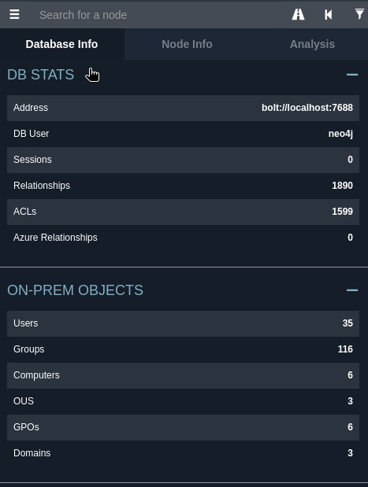
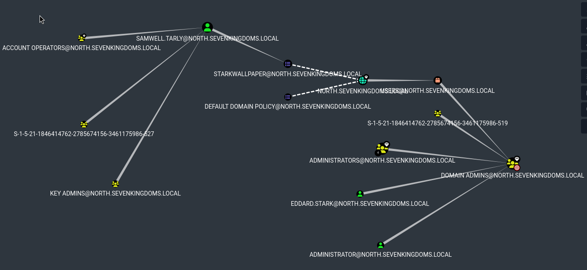
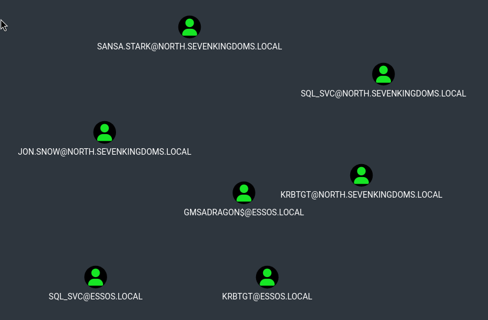
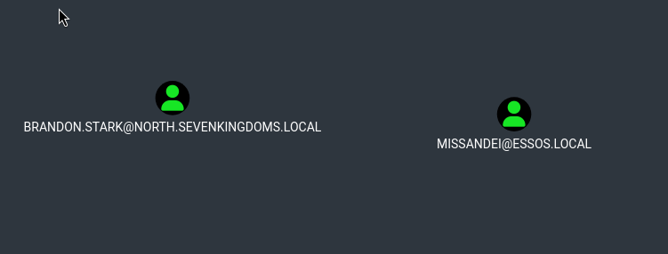
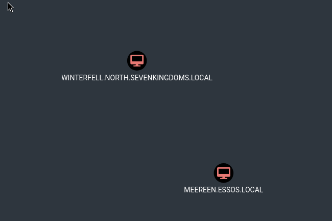

# SC-ID-006 — BloodHound — Chemins d'Attaque AD

## Classification

| Champ | Valeur |
|-------|--------|
| **Code scénario** | SC-ID-006 |
| **Nom** | BloodHound CE — Analyse des chemins d'attaque multi-domaines |
| **Cible** | GOAD v3 — 3 domaines, collecte SharpHound + bloodhound-python |
| **Phase** | Phase 1 — Auditer |
| **Référentiel** | MITRE ATT&CK, BloodHound Enterprise, ANSSI |
| **Date** | Mars 2026 |
| **Auteur** | Nadyr Chouarhi (hik3nR00t) |

---

## Résumé exécutif

### Pour un recruteur

BloodHound est l'outil de référence pour **visualiser les chemins d'attaque dans Active Directory**. En mission architecte, on l'utilise pour montrer au client "voilà les chemins qu'un attaquant peut emprunter pour atteindre Domain Admin" et justifier les remédiations. Ce scénario couvre la collecte multi-domaines (SharpHound depuis Windows + bloodhound-python depuis Linux) et l'import dans BloodHound CE (Community Edition 5.x).

### Pour un RSSI

BloodHound permet de répondre à la question : "Combien de comptes compromis faut-il pour atteindre Domain Admin ?". La réponse dans cet environnement est souvent 1 — un seul compte à faible privilège suffit via des enchaînements de permissions mal configurées (ACL abuse, délégations, SPN). La cartographie BloodHound est le complément indispensable de PingCastle pour prioriser les remédiations.

---

## Collecte de données

### SharpHound (depuis Windows — collecte la plus complète)

```powershell
.\SharpHound.exe -c All --domain sevenkingdoms.local
.\SharpHound.exe -c All --domain north.sevenkingdoms.local
.\SharpHound.exe -c All --domain essos.local
```

### bloodhound-python (depuis Linux — collecte alternative)

```bash
bloodhound-python -u 'user' -p 'password' -d sevenkingdoms.local -ns 192.168.10.10 -c All
bloodhound-python -u 'user' -p 'password' -d essos.local -ns 192.168.10.12 -c All
```

**Note importante :** BloodHound CE (5.x) est incompatible avec les fichiers ZIP générés par bloodhound-python (format Legacy). SharpHound produit le format compatible CE. En mission, privilégier SharpHound pour la collecte.

---

## Import dans BloodHound CE

1. Démarrage de BloodHound CE via Docker
2. Import des fichiers JSON/ZIP SharpHound
3. Analyse des chemins d'attaque via l'interface graphique

---

### Preuves — BloodHound











---

## Chemins d'attaque identifiés

| Chemin | Départ | Arrivée | Nombre de hops | Technique |
|---|---|---|---|---|
| ACL Abuse Chain | User standard | Domain Admin | 4 | ForceChangePwd → GenericWrite → WriteDACL → AddSelf |
| Kerberoast → DA | User authentifié | Domain Admin | 2 | SPN → Crack → Compte à privilèges |
| AS-REP → Lateral | Anonyme | User authentifié | 1 | AS-REP Roasting → Crack offline |
| Delegation abuse | User standard | Domain Admin | 3 | Unconstrained → Impersonation → DC |

---

## Correspondance mission client

| Étape lab | Équivalent mission client |
|---|---|
| Collecte SharpHound multi-domaines | Audit technique — collecte des données AD |
| Analyse chemins d'attaque | Livrable "Attack Paths" — présentation visuelle au RSSI |
| Identification des quick wins | Plan de remédiation priorisé (ACL, délégations, SPN) |
| BloodHound CE vs Enterprise | En entreprise, BloodHound Enterprise (payant) pour le monitoring continu |
