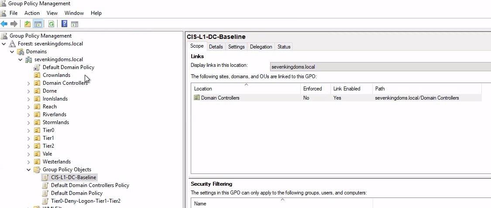
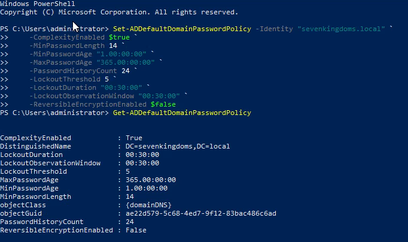
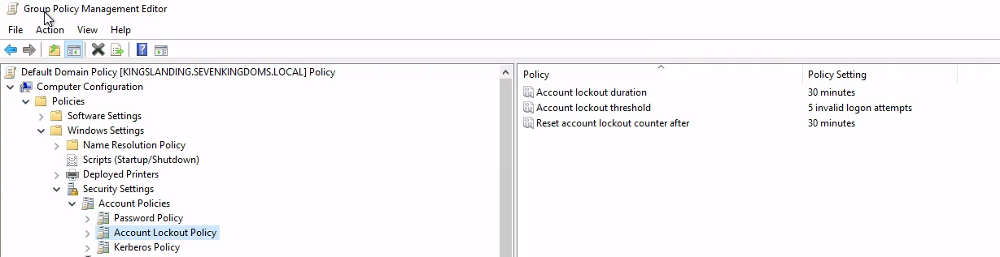
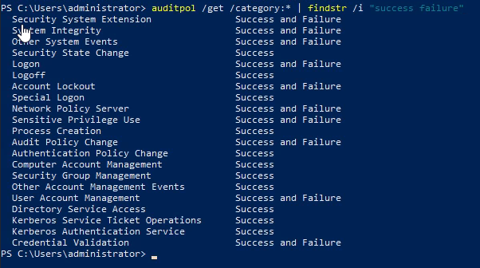
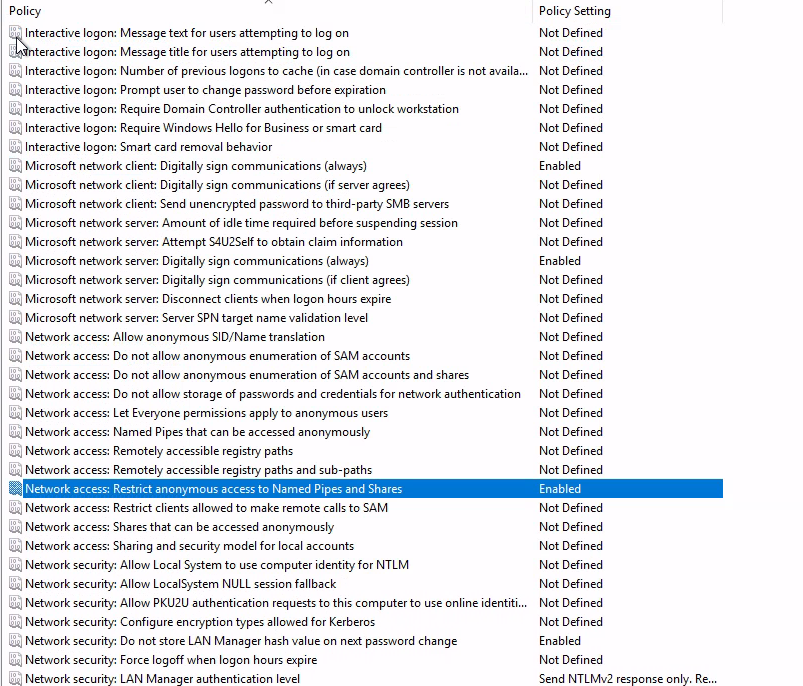
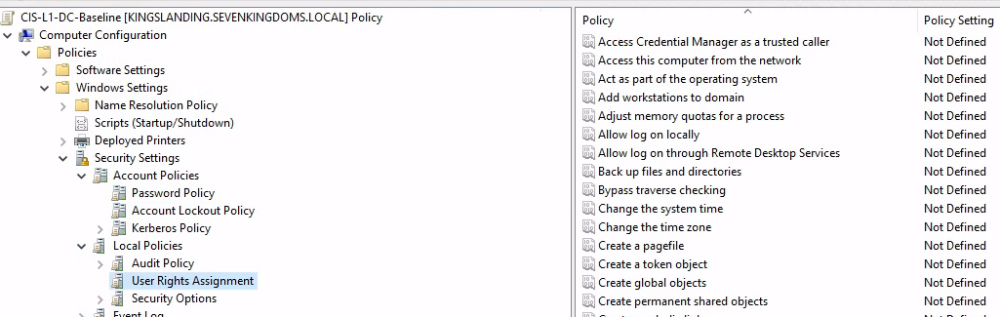
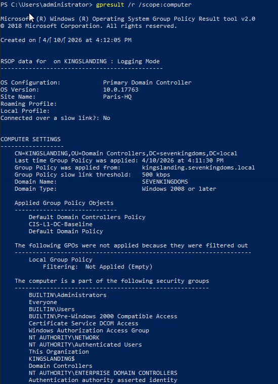

# SC-ID-007 — GPO CIS Baseline (Level 1 DC)

## Objectif

Appliquer le **CIS Benchmark Level 1 pour Domain Controllers** sur l'environnement `sevenkingdoms.local` afin de durcir la posture de sécurité Active Directory.

## Contexte

Le CIS (Center for Internet Security) publie des benchmarks de sécurité reconnus comme standards de l'industrie. Le **Level 1 DC** couvre les paramètres de sécurité essentiels pour les contrôleurs de domaine : politiques de mots de passe, verrouillage de comptes, audit avancé et options de sécurité réseau.

## Infrastructure cible

| Composant | Détail |
|---|---|
| GPO | `CIS-L1-DC-Baseline` |
| Liaison | OU `Domain Controllers` (sevenkingdoms.local) |
| DCs impactés | KINGSLANDING (DC01) |

## Implémentation

### 1. Création et liaison de la GPO

La GPO `CIS-L1-DC-Baseline` a été créée via GPMC et liée à l'OU `Domain Controllers` :



### 2. Password Policy (Default Domain Policy)

Les password policies domain-level s'appliquent **uniquement via la Default Domain Policy** — c'est une contrainte architecturale AD. Les paramètres CIS ont donc été appliqués sur la Default Domain Policy :

```powershell
Set-ADDefaultDomainPasswordPolicy -Identity "sevenkingdoms.local" `
    -ComplexityEnabled $true `
    -MinPasswordLength 14 `
    -MinPasswordAge "1.00:00:00" `
    -MaxPasswordAge "365.00:00:00" `
    -PasswordHistoryCount 24 `
    -LockoutThreshold 5 `
    -LockoutDuration "00:30:00" `
    -LockoutObservationWindow "00:30:00" `
    -ReversibleEncryptionEnabled $false
```

**Vérification :**

```powershell
Get-ADDefaultDomainPasswordPolicy
```

| Paramètre | Valeur CIS | Appliqué |
|---|---|---|
| ComplexityEnabled | True | ✅ |
| MinPasswordLength | 14 | ✅ |
| MaxPasswordAge | 365 jours | ✅ |
| MinPasswordAge | 1 jour | ✅ |
| PasswordHistoryCount | 24 | ✅ |
| LockoutThreshold | 5 tentatives | ✅ |
| LockoutDuration | 30 minutes | ✅ |
| LockoutObservationWindow | 30 minutes | ✅ |
| ReversibleEncryption | False | ✅ |



### 3. Account Lockout Policy

Configurée via `Set-ADDefaultDomainPasswordPolicy` (voir section précédente). Visible dans la Default Domain Policy :



### 4. Advanced Audit Policy

Les audit policies CIS Level 1 DC ont été appliquées via `auditpol` :

```powershell
# Account Logon
auditpol /set /subcategory:"Credential Validation" /success:enable /failure:enable

# Account Management
auditpol /set /subcategory:"Security Group Management" /success:enable
auditpol /set /subcategory:"User Account Management" /success:enable /failure:enable
auditpol /set /subcategory:"Computer Account Management" /success:enable
auditpol /set /subcategory:"Other Account Management Events" /success:enable

# Detailed Tracking
auditpol /set /subcategory:"Process Creation" /success:enable

# Logon/Logoff
auditpol /set /subcategory:"Logon" /success:enable /failure:enable
auditpol /set /subcategory:"Logoff" /success:enable
auditpol /set /subcategory:"Account Lockout" /success:enable /failure:enable
auditpol /set /subcategory:"Special Logon" /success:enable

# Policy Change
auditpol /set /subcategory:"Audit Policy Change" /success:enable /failure:enable
auditpol /set /subcategory:"Authentication Policy Change" /success:enable

# Privilege Use
auditpol /set /subcategory:"Sensitive Privilege Use" /success:enable /failure:enable

# System
auditpol /set /subcategory:"Security State Change" /success:enable
auditpol /set /subcategory:"Security System Extension" /success:enable /failure:enable
auditpol /set /subcategory:"System Integrity" /success:enable /failure:enable
```

**Vérification :**

```powershell
auditpol /get /category:* | findstr /i "success failure"
```



### 5. Security Options (GPO CIS-L1-DC-Baseline)

Les Security Options ont été configurées directement dans la GPO `CIS-L1-DC-Baseline` via GPMC :

| Setting | Valeur | Impact |
|---|---|---|
| Microsoft network client: Digitally sign communications (always) | Enabled | Force le SMB signing côté client |
| Microsoft network server: Digitally sign communications (always) | Enabled | Force le SMB signing côté serveur |
| Network access: Restrict anonymous access to Named Pipes and Shares | Enabled | Bloque l'accès anonyme aux Named Pipes |
| Network security: Do not store LAN Manager hash value | Enabled | Empêche le stockage des hash LM (crackable) |
| Network security: LAN Manager authentication level | Send NTLMv2 response only. Refuse LM & NTLM | Force NTLMv2, bloque LM et NTLM v1 |



### 6. User Rights Assignment

La GPO CIS-L1-DC-Baseline contient également les paramètres User Rights Assignment pour les DCs :



## Vérification

### Application de la GPO

```powershell
gpupdate /force
gpresult /r /scope:computer
```

La GPO `CIS-L1-DC-Baseline` apparaît dans la liste des GPOs appliquées sur KINGSLANDING, aux côtés de la Default Domain Controllers Policy et de la Default Domain Policy :



## Impact PingCastle

L'application des Security Options (SMB signing, NTLMv2, NoLMHash) a eu un impact mesurable sur le score PingCastle :

| Catégorie | Avant CIS | Après CIS |
|---|---|---|
| Anomalies | 72/100 | 62/100 |
| Règles matchées | 16 | 15 |

La réduction de 10 points sur la catégorie Anomalies confirme l'efficacité des mesures appliquées, notamment la désactivation du stockage LM hash et le forçage de NTLMv2.

## Points d'attention

- **Password Policy domain-level** : ne peut être appliquée que via la Default Domain Policy (contrainte AD, pas la GPO CIS)
- **Account Lockout** : configuré via la même Default Domain Policy pour la même raison
- **Audit policies via auditpol** : appliquées localement, non persistantes après redémarrage sans GPO. En production, ces settings seraient poussés via la GPO Advanced Audit Policy Configuration
- **NTLMv2 only** : vérifié qu'aucun client legacy (XP/2003) n'est présent dans l'environnement avant activation

## Auteur

**Nadyr Chouarhi** (hik3nR00t) — Consultant Identity & Sécurité Microsoft
