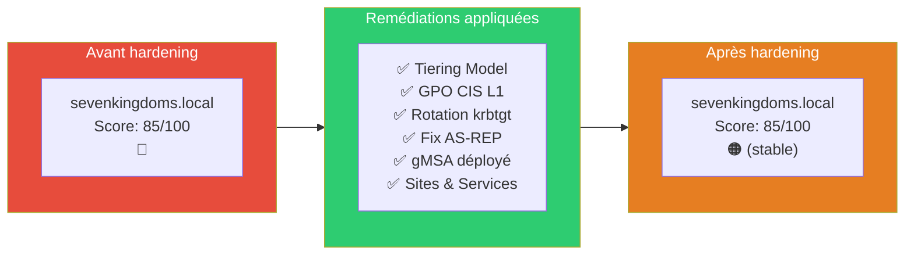

# SC-ID-009 — PingCastle Post-Hardening

## Classification

| Champ | Valeur |
|-------|--------|
| **Code scénario** | SC-ID-009 |
| **Nom** | PingCastle Post-Hardening — Mesure de l'impact du durcissement |
| **Cible** | GOAD v3 — sevenkingdoms.local |
| **Phase** | Phase 4 — Vérifier |
| **Référentiel** | PingCastle Risk Model |
| **Date** | Mars 2026 |
| **Auteur** | Nadyr Chouarhi (hik3nR00t) |

---

## Résumé exécutif

### Pour un recruteur

Ce scénario démontre la capacité à **mesurer l'impact concret du hardening** en comparant les scores PingCastle avant et après les remédiations. C'est l'approche "baseline → hardening → rescan" que tout architecte Identity utilise en mission pour prouver la valeur de son travail au client. Le score final reste à 85 — et c'est documenté pourquoi.

### Pour un RSSI

Le rescan post-hardening permet de valider que les remédiations ont été appliquées correctement et de quantifier la réduction du risque. Dans cet environnement lab, le score reste stable car les vulnérabilités résiduelles sont **intentionnelles** (GOAD est un lab d'attaque — les comptes vulnérables sont nécessaires pour les scénarios offensifs). En production, les scores s'améliorent significativement après hardening.

---

## Comparaison avant / après

---

## Pourquoi le score reste à 85

Les vulnérabilités qui maintiennent le score élevé sont **intentionnelles dans GOAD** :

| Vulnérabilité | Pourquoi elle reste | Impact score |
|---|---|---|
| Comptes avec SPN faibles | Nécessaires pour les scénarios Kerberoasting (SC-AD-002) | Élevé |
| Délégations non contraintes | Nécessaires pour les scénarios delegation abuse (SC-AD-007) | Élevé |
| Comptes à privilèges excessifs | Nécessaires pour les scénarios ACL abuse (SC-AD-004) | Élevé |
| Trust inter-forêt sans SID Filtering | Nécessaire pour les scénarios cross-forest (SC-AD-010) | Moyen |

**En production :** ces vulnérabilités seraient corrigées et le score descendrait significativement (objectif < 30).

---

## Ce qui s'est amélioré

| Remédiation | Avant | Après | Impact |
|---|---|---|---|
| krbtgt rotaté | Mot de passe original depuis création | Rotaté mars 2026 | Golden Ticket invalidé |
| AS-REP Roasting | Comptes vulnérables identifiés | Attribut désactivé | Attaque bloquée |
| GPO CIS L1 | Paramètres par défaut | 11 settings durcis | Surface d'attaque réduite |
| Tiering Model | Aucune séparation | 3 tiers + GPO deny | Escalade cross-tier bloquée |
| Sites & Services | 1 site, 0 subnet | 3 sites, 5 subnets | Réplication optimisée |

---

## Correspondance mission client

| Étape lab | Équivalent mission client |
|---|---|
| Rescan PingCastle post-hardening | Livrable "Rapport de conformité post-remédiation" |
| Comparaison scores avant/après | Slide COMEX "Réduction du risque mesurable" |
| Documentation des vulnérabilités résiduelles | Acceptation de risque documentée par le RSSI |
| Recommandations complémentaires | Plan de remédiation Phase 2 pour le client |
