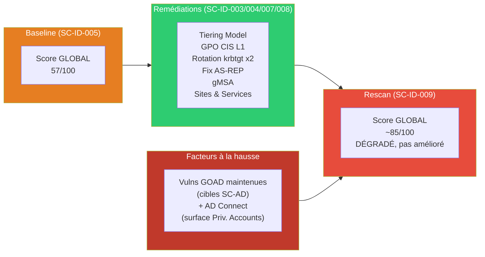
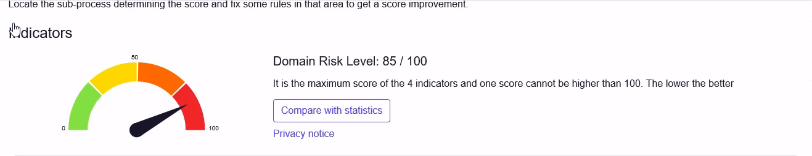
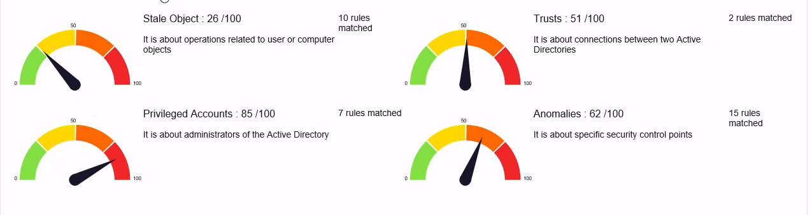

# SC-ID-009 — PingCastle Post-Hardening

## Classification

| Champ | Valeur |
|-------|--------|
| **Code scénario** | SC-ID-009 |
| **Nom** | PingCastle Post-Hardening — Lecture critique d'un score sur lab volontairement vulnérable |
| **Cible** | GOAD v3 — forêt sevenkingdoms.local + essos.local |
| **Phase** | Phase 4 — Vérifier |
| **Référentiel** | PingCastle Risk Model (0 = idéal · 100 = pire) |
| **Date** | Mars 2026 |
| **Auteur** | hik3nR00t |

---

## Résumé exécutif

### Pour un recruteur

Ce scénario démontre une compétence plus rare qu'un simple « avant/après » : **savoir lire un score de sécurité de façon critique**. Après avoir appliqué le durcissement (tiering, CIS, Kerberos), le rescan PingCastle **ne montre pas de baisse du score global** — et c'est le point intéressant. Sur cet environnement, deux facteurs l'expliquent : les vulnérabilités de GOAD sont **maintenues volontairement** (ce sont les cibles des scénarios offensifs SC-AD), et l'ajout d'**AD Connect** a mécaniquement augmenté la surface d'exposition des comptes à privilèges. La vraie valeur du hardening se mesure donc **au niveau granulaire** (catégorie *Anomalies* : 72 → 62, règles précises corrigées), pas sur le score global — qui, sur un lab d'attaque, est un **KPI trompeur**. Savoir dire ça à un client vaut mieux que maquiller un chiffre.

### Pour un RSSI

Le rescan post-hardening confirme que les remédiations ont bien été appliquées (rotation krbtgt, désactivation AS-REP, tiering, GPO CIS), mais **le score global PingCastle ne reflète pas ce gain** dans ce contexte, pour deux raisons documentées ci-dessous. La bonne pratique de reporting est donc de **piloter sur les catégories et les règles**, pas sur le score agrégé, tant que subsistent des vulnérabilités structurelles connues et acceptées. En production — sans vulnérabilités intentionnelles — le même durcissement ferait chuter le score global significativement (objectif < 30).

---

## Rappel de l'échelle PingCastle (⚠️ point clé)

> **0 = idéal · 100 = pire.** Un score qui **monte** = risque qui **augmente**.

C'est contre-intuitif et c'est la source d'erreur classique : une progression « 57 → 85 » n'est **pas** une amélioration, c'est une **dégradation** de 28 points.

---

## Baseline (SC-ID-005) — rappel des vrais chiffres

| Périmètre | Score baseline | Lecture |
|---|---|---|
| **Score global (consolidé 3 domaines)** | **57/100** 🟠 | Point de départ « avant hardening » |
| sevenkingdoms.local | 85/100 🔴 | Domaine racine, déjà élevé |
| north.sevenkingdoms.local | 100/100 🔴 | Plafond — vulns intentionnelles |
| essos.local | 100/100 🔴 | Plafond — vulns intentionnelles |

> Correction vs version initiale de ce write-up : le **57 est le score GLOBAL**, pas le score de `sevenkingdoms.local` (qui était déjà à **85** en baseline). L'ancienne formulation « sevenkingdoms 57 → 85 » confondait les deux.

---

## Résultat post-hardening — honnête

### Preuves

---

## Pourquoi le score global n'a PAS baissé (2 causes légitimes)

### Cause 1 — Vulnérabilités GOAD maintenues volontairement

GOAD est un **lab d'attaque** : les vulnérabilités à fort poids PingCastle sont les **cibles** des scénarios offensifs, on ne peut pas les corriger sans casser le lab.

| Vulnérabilité | Pourquoi maintenue | Poids score |
|---|---|---|
| Comptes avec SPN faibles | Cibles Kerberoasting (SC-AD-002) | Élevé |
| Délégations non contraintes | Cibles delegation abuse (SC-AD-007) | Élevé |
| Comptes à privilèges excessifs | Cibles ACL abuse (SC-AD-004) | Élevé |
| Trust inter-forêt sans SID Filtering | Cibles cross-forest (SC-AD-010) | Moyen |

### Cause 2 — Hybridation AD Connect (surface ajoutée)

L'ajout d'**AD Connect** (bloc2, SC-ID-011/012) et de ses comptes de service a **augmenté** la surface de la catégorie *Privileged Accounts* (~50 → ~85). C'est un effet réel et attendu : brancher une synchro hybride ajoute des identités et des droits à surveiller. Le score global en tient compte → il monte.

> **En production** (sans vulns intentionnelles), ces mêmes vulnérabilités seraient corrigées et le score global chuterait nettement (objectif < 30). Le plafond observé ici est **spécifique au lab**.

---

## Où le hardening EST mesurable (le bon KPI)

Le gain ne se lit pas sur le score global, mais sur les **catégories** et les **règles** :

| Indicateur | Avant | Après | Effet |
|---|---|---|---|
| Catégorie **Anomalies** | 72 | **62** | Effet direct des GPO CIS L1 |
| Golden Ticket (krbtgt) | Mot de passe d'origine | **Rotaté x2** | Golden Ticket invalidé |
| AS-REP Roasting | Comptes `DONT_REQ_PREAUTH` | **Attribut désactivé** | Vecteur bloqué |
| Escalade cross-tier | Aucune séparation | **Tiering + deny-logon** | Chemin Tier2→Tier0 coupé |
| Réplication / topologie | 1 site, 0 subnet | **3 sites, 5 subnets** | Topologie maîtrisée |

C'est **ça**, la preuve d'efficacité — vérifiable règle par règle, indépendamment d'un score agrégé plafonné par le design du lab.

---

## Correspondance mission client

| Étape lab | Équivalent mission client |
|---|---|
| Rescan PingCastle post-hardening | Livrable « Rapport de conformité post-remédiation » |
| Lecture critique du score (global vs granulaire) | Note méthodo « pourquoi le score global n'est pas le bon KPI ici » |
| Documentation des vulnérabilités résiduelles | **Acceptation de risque** formalisée par le RSSI (registre des risques) |
| Effet AD Connect sur la surface | Point d'attention « le hardening et l'extension de périmètre tirent le score dans des sens opposés » |
| Gain granulaire (Anomalies, règles) | Slide COMEX « **efficacité mesurée au niveau des contrôles**, pas du score agrégé » |

---

## Points à retenir (leçon terrain)

- **Sens de l'échelle** : PingCastle, 100 = pire. Un score qui monte = c'est plus mauvais.
- **Le score global est un mauvais KPI sur un lab volontairement vulnérable** — il est plafonné par les vulns intentionnelles.
- **Mesurer au bon niveau** : catégories (Anomalies 72→62) et règles précises, pas le chiffre agrégé.
- **Extension de périmètre vs hardening** : ajouter AD Connect augmente la surface — les deux mouvements se compensent, il faut le dire, pas le cacher.
- **Honnêteté > cosmétique** : documenter un score qui ne baisse pas, en expliquant pourquoi, est plus crédible en mission qu'un « avant/après » maquillé.

---

*SC-ID-009 corrigé — cohérent avec la baseline SC-ID-005 (global 57) et le README identity-lab — hik3nR00t*
