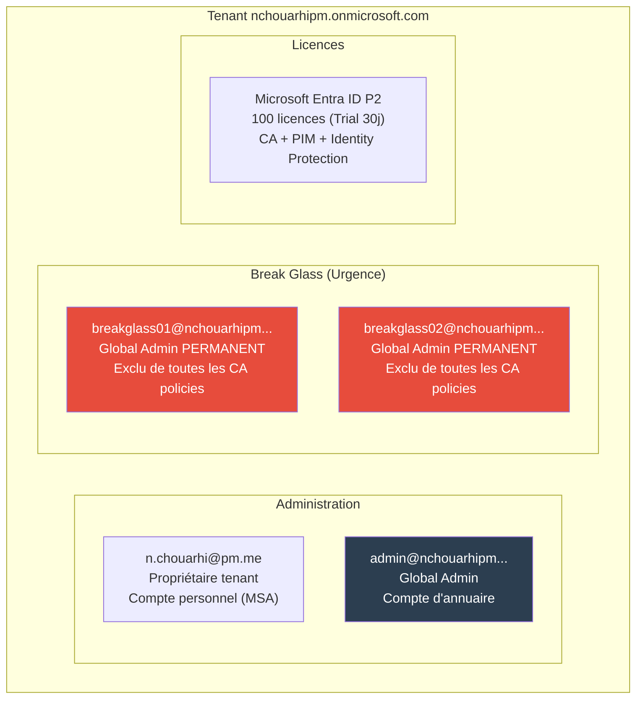

# SC-ID-010 — Tenant Azure & Break Glass Accounts

## Classification

| Champ | Valeur |
|-------|--------|
| **Code scénario** | SC-ID-010 |
| **Nom** | Création du Tenant Entra ID et comptes Break Glass |
| **Cible** | Tenant nchouarhipm.onmicrosoft.com |
| **Phase** | Phase 1 — Préparer le Tenant |
| **Référentiel** | Microsoft Entra ID Best Practices, ANSSI |
| **Date** | Mars 2026 |
| **Auteur** | Nadyr Chouarhi (hik3nR00t) |

---

## Résumé exécutif

### Pour un recruteur

Ce scénario couvre la **création et la préparation d'un tenant Microsoft Entra ID** pour une hybridation avec Active Directory on-prem. Cela inclut la création du tenant, d'un compte admin dédié (séparé du propriétaire), l'activation de la licence P2, et le déploiement de **Break Glass accounts** — comptes d'urgence exclus de toutes les policies de sécurité. C'est le fondement de toute mission hybride Identity.

### Pour un RSSI

Les Break Glass accounts sont une exigence de sécurité fondamentale recommandée par Microsoft. Sans eux, un lockout MFA (panne Authenticator, perte de téléphone de tous les admins) rend le tenant inaccessible. Deux comptes d'urgence avec des mots de passe complexes stockés dans un coffre physique garantissent l'accès en toute circonstance. Ils sont exclus de toutes les Conditional Access policies et conservent un rôle Global Admin permanent.

---

## Architecture du Tenant

---

## Étapes réalisées

### 1. Création du tenant

- Tenant : `nchouarhipm.onmicrosoft.com`
- Tenant ID : `eea0e92c-08ea-4aa8-a0b2-d5e8854c81cd`
- Propriétaire : `n.chouarhi@pm.me` (compte personnel Microsoft)

### 2. Compte admin dédié

- Création de `admin@nchouarhipm.onmicrosoft.com` avec rôle Global Admin
- Séparation du compte propriétaire (MSA) et du compte d'administration (annuaire)
- Location : France

**Pourquoi un compte séparé :** le compte propriétaire (`n.chouarhi@pm.me`) est un MSA (Microsoft Account personnel). Il ne supporte pas toutes les fonctionnalités Entra ID (PIM, CA). Le compte `admin` est un compte d'annuaire natif qui supporte tout.

### 3. Activation licence P2

- Microsoft Entra ID P2 Trial activé (100 licences, 30 jours)
- Licence assignée à : admin, breakglass01, breakglass02

**Fonctionnalités débloquées par P2 :**
- Conditional Access (policies basées sur conditions)
- PIM (Privileged Identity Management — accès JIT)
- Identity Protection (détection de risque)
- Access Reviews (revue des accès)

### 4. Break Glass accounts

| Compte | Rôle | Exclusions | Usage |
|---|---|---|---|
| breakglass01 | Global Admin permanent | Toutes les CA policies | Urgence + Approbateur PIM |
| breakglass02 | Global Admin permanent | Toutes les CA policies | Backup urgence |

**Règles Break Glass en production :**
- Mots de passe complexes (20+ caractères, aléatoires)
- Stockés dans un coffre physique (pas un password manager)
- Pas de MFA configuré (ou FIDO2 key dans le coffre)
- Monitoring des connexions (alerte si un BG se connecte)
- Test de connexion trimestriel

---

## Problème rencontré — Licence P2 désactivée

Le trial P2 s'est désactivé prématurément à cause du compte de facturation "Default Directory" (MOSA) passé en statut inactif. Le Marketplace M365 était également indisponible (erreur serveur). Résolution via ticket support Microsoft qui a réactivé le compte de facturation.

**Leçon :** en entreprise, les trials liés à des comptes MOSA inactifs peuvent se bloquer. Il faut vérifier l'état du compte de facturation avant d'activer des trials, ou utiliser un compte MCA (Microsoft Customer Agreement) pour les achats.

---

## Correspondance mission client

| Étape lab | Équivalent mission client |
|---|---|
| Création tenant | Rarement fait — le client a déjà un tenant M365 |
| Compte admin séparé | Best practice — séparer les comptes d'urgence des comptes nominatifs |
| Break Glass accounts | Exigence de sécurité — premier check d'un audit Entra ID |
| Licence P2 | Discussion budget avec le client — P2 vs P1 vs Free |
