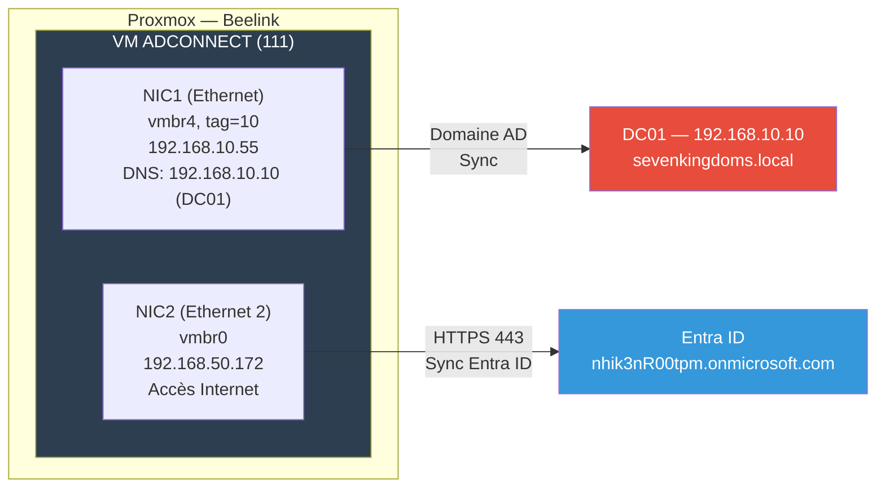
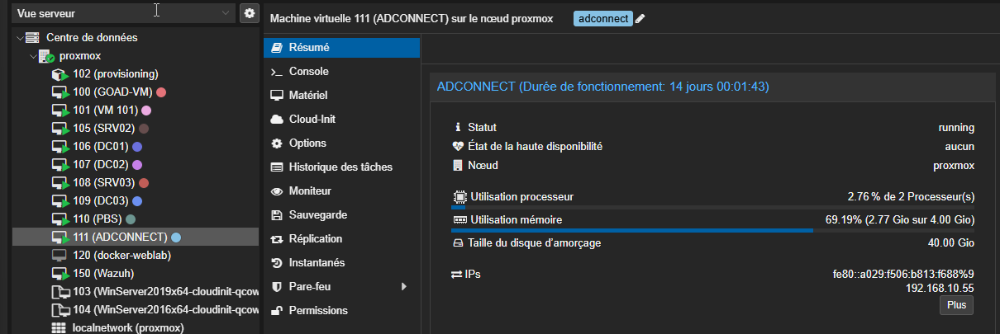
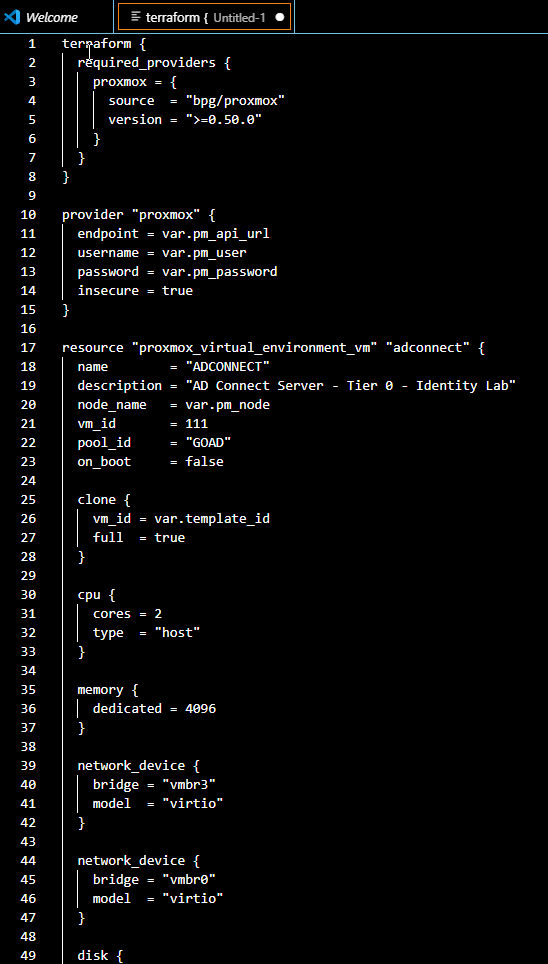
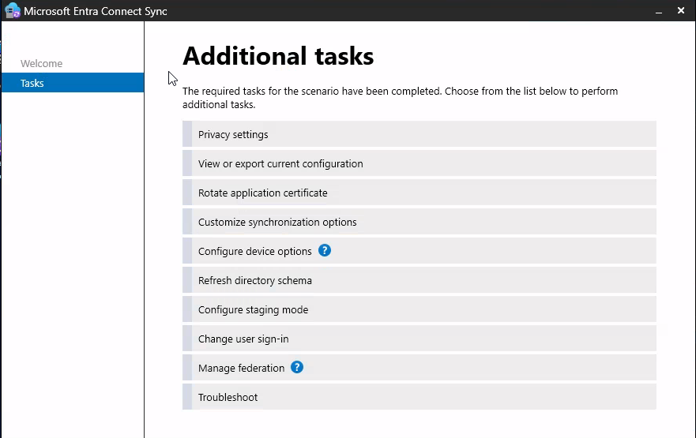

# SC-ID-011 — VM AD Connect (Infrastructure as Code)

## Classification

| Champ | Valeur |
|-------|--------|
| **Code scénario** | SC-ID-011 |
| **Nom** | VM AD Connect — Déploiement IaC sur Proxmox via Terraform |
| **Cible** | Proxmox (Beelink) — VMID 111 |
| **Phase** | Phase 1 — Préparer l'Infrastructure |
| **Référentiel** | Microsoft AD Connect Prerequisites, Terraform Best Practices |
| **Date** | Mars 2026 |
| **Auteur** | hik3nR00t |

---

## Résumé exécutif

### Pour un recruteur

Ce scénario démontre le déploiement d'un **serveur AD Connect via Infrastructure as Code** (Terraform + provider Proxmox). La VM est créée automatiquement avec les bons paramètres réseau (double NIC : un vers le LAN AD, un vers Internet), jointe au domaine, et préparée pour l'installation d'AD Connect. L'approche IaC est la méthode standard en entreprise pour des déploiements reproductibles et documentés.

### Pour un RSSI

Le serveur AD Connect est un composant **Tier 0** — il a accès en lecture/écriture aux mots de passe de tous les utilisateurs (PHS) et aux attributs AD. Sa sécurisation est critique : il doit être traité comme un contrôleur de domaine en termes d'accès et de monitoring.

---

## Architecture réseau de la VM



---

## Spécifications VM

| Paramètre | Valeur |
|---|---|
| VMID | 111 |
| Hostname | ADCONNECT |
| OS | Windows Server 2019 (clone template 103) |
| vCPU | 2 |
| RAM | 4 Go |
| Disque | 60 Go |
| Pool | GOAD |
| NIC1 | vmbr4, tag=10 → 192.168.10.55 |
| NIC2 | vmbr0 → 192.168.50.172 (DHCP) |
| Domaine | sevenkingdoms.local |

---

## Déploiement Terraform

**Provider :** bpg/proxmox v0.99.0
**Exécution :** depuis goad-vm (192.168.50.100)

```hcl
resource "proxmox_virtual_environment_vm" "adconnect" {
  name      = "ADCONNECT"
  node_name = "beelink"
  vm_id     = 111
  pool_id   = "GOAD"

  clone {
    vm_id = 103  # Template Windows Server 2019
    full  = true
  }

  cpu    { cores = 2 }
  memory { dedicated = 4096 }
  disk   { size = 60 }

  network_device { bridge = "vmbr4", vlan_id = 10 }
  network_device { bridge = "vmbr0" }
}
```

---

## Problèmes rencontrés et résolus

| # | Problème | Cause | Solution |
|---|---|---|---|
| 1 | NIC1 sur mauvais bridge | Terraform avait créé NIC1 sur vmbr3 | `qm set 111 -net0 bridge=vmbr4,tag=10` |
| 2 | Conflit IP | goad-vm utilisait déjà .50 | IP changée à .55 dans pfSense |
| 3 | DNS incorrect | DHCP pfSense donnait 192.168.10.1 | DNS forcé à 192.168.10.10 (DC01) |
| 4 | TLS 1.2 manquant | Registre SChannel non configuré | Script registre SChannel + .NET |
| 5 | RDP non fonctionnel | fDenyTSConnections=1 | Activé + firewall rule 3389 + NLA off |

**Leçon infrastructure :** les VMs GOAD utilisent `vmbr4` avec tag=10, PAS vmbr3. C'est un détail critique qui a causé des heures de debug.

---

## Vérification post-déploiement

```powershell
# Vérifier la jonction au domaine
(Get-WmiObject Win32_ComputerSystem).Domain

# Vérifier la connectivité DC
Test-NetConnection -ComputerName 192.168.10.10 -Port 389

# Vérifier la connectivité Internet (pour Entra ID)
Test-NetConnection -ComputerName login.microsoftonline.com -Port 443

# Vérifier TLS 1.2
[Net.ServicePointManager]::SecurityProtocol
```

---

### Preuves







---

### Preuves


---

### Preuves


---

## Correspondance mission client

| Étape lab | Équivalent mission client |
|---|---|
| Terraform IaC | En entreprise : SCCM, MDT, ou Azure VM — mais l'approche IaC est valorisée |
| Double NIC (AD + Internet) | Architecture standard AD Connect — séparation des flux |
| Jonction domaine + DNS | Prérequis AD Connect — souvent source de problèmes en mission |
| TLS 1.2 + RDP | Hardening de base du serveur Tier 0 |
