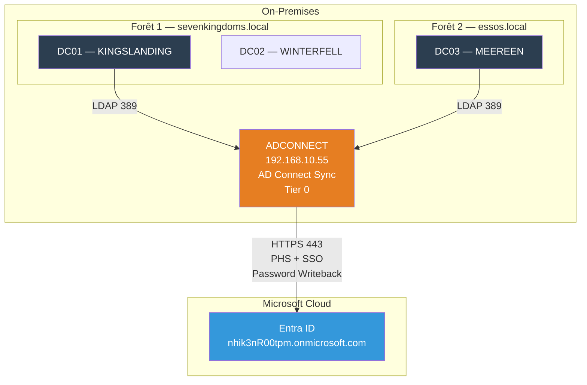
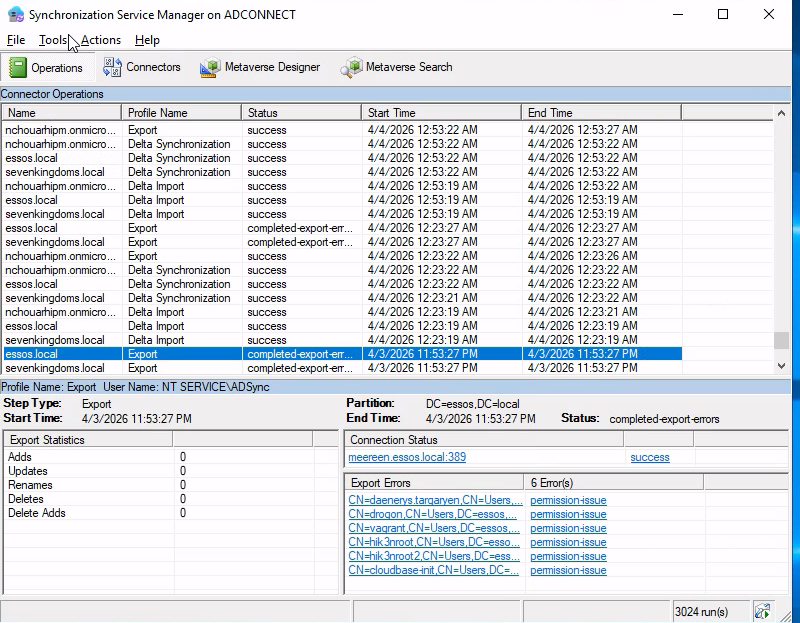
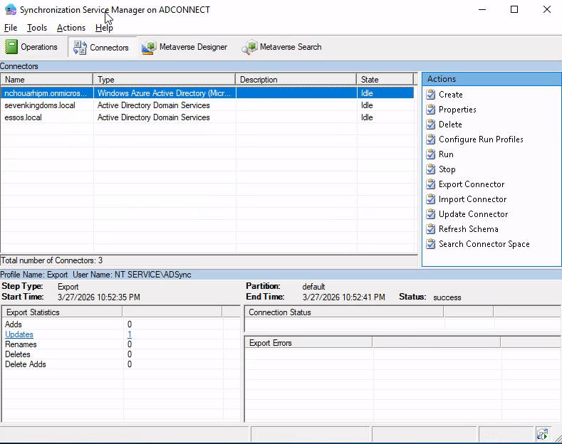
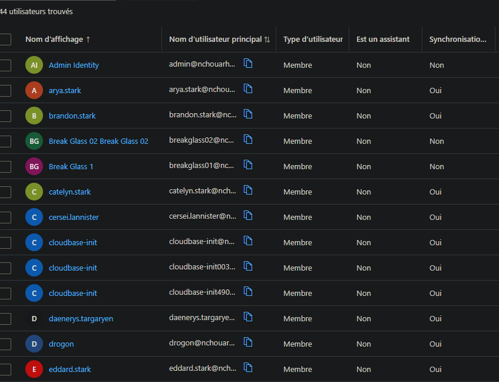
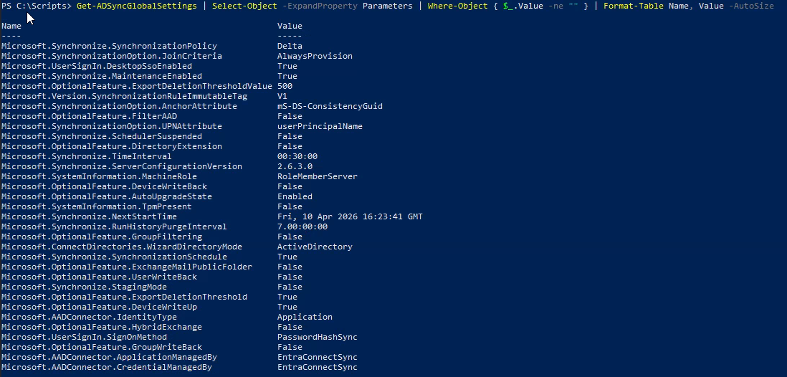
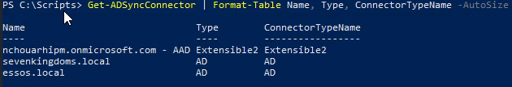

# SC-ID-012 — AD Connect — Hybrid Identity

## Classification

| Champ | Valeur |
|-------|--------|
| **Code scénario** | SC-ID-012 |
| **Nom** | AD Connect — Synchronisation hybride multi-forêts |
| **Cible** | ADCONNECT (192.168.10.55) → Entra ID |
| **Phase** | Phase 2 — Implémenter l'Hybridation |
| **Référentiel** | Microsoft Entra Connect Best Practices |
| **Date** | Mars 2026 |
| **Auteur** | hik3nR00t |

---

## Résumé exécutif

### Pour un recruteur

Ce scénario implémente une **synchronisation hybride multi-forêts** entre Active Directory on-prem et Microsoft Entra ID. La configuration couvre deux forêts (sevenkingdoms.local et essos.local), Password Hash Synchronization (PHS), Seamless Single Sign-On, Password Writeback, et un filtrage OUs pour exclure les objets Tier 0 de la synchronisation cloud. C'est la mission hybride la plus demandée sur le marché Identity.

### Pour un RSSI

AD Connect synchronise les identités on-prem vers le cloud. Le choix de PHS (vs PTA ou ADFS) est un compromis sécurité/simplicité : les hash des mots de passe sont envoyés chiffrés vers Entra ID, ce qui permet l'authentification cloud même si l'AD on-prem est indisponible. Le filtrage OUs empêche la synchronisation des comptes Tier 0 (Domain Controllers, Builtin) vers le cloud — réduisant la surface d'attaque en cas de compromission du tenant.

---

## Architecture de synchronisation



---

## Configuration AD Connect

### Méthode d'authentification

| Option | Choix | Justification |
|---|---|---|
| **Password Hash Sync (PHS)** | ✅ Sélectionné | Simplicité, résilience (fonctionne si AD on-prem down), détection de credentials leakés |
| Pass-Through Auth (PTA) | ❌ | Dépend de l'AD on-prem pour chaque auth |
| ADFS (Fédération) | ❌ | Complexité infrastructure, coût maintenance |

### Seamless SSO

Activé sur les deux forêts. Les utilisateurs on-prem qui sont sur des machines jointes au domaine sont automatiquement authentifiés sur les services M365 sans re-saisir leur mot de passe.

### Password Writeback

Activé. Permet aux utilisateurs de changer leur mot de passe depuis le portail Entra ID (SSPR) et que le changement soit répliqué vers l'AD on-prem.

### Connecteurs configurés

| # | Connecteur | Type | Forêt/Tenant |
|---|---|---|---|
| 1 | nhik3nR00tpm.onmicrosoft.com | AAD Connector | Entra ID |
| 2 | sevenkingdoms.local | AD Connector | Forêt 1 |
| 3 | essos.local | AD Connector | Forêt 2 |

### Filtrage OUs

**Objectif :** ne pas synchroniser les objets Tier 0 vers le cloud.

**sevenkingdoms.local — OUs exclues :**
- Builtin
- Domain Controllers
- LostAndFound
- Tier0

**north.sevenkingdoms.local — OUs exclues :**
- Builtin
- Domain Controllers

**essos.local — OUs exclues :**
- Builtin
- Domain Controllers
- LostAndFound

### Paramètres techniques

| Paramètre | Valeur |
|---|---|
| Source Anchor | mS-DS-ConsistencyGuid (géré par Azure) |
| Seuil de suppression | 500 |
| Service | ADSync (doit être Running) |
| Module PowerShell | `Import-Module "C:\Program Files\Microsoft Azure AD Sync\Bin\ADSync\ADSync.psd1"` |

---

## Vérification de la synchronisation

```powershell
# Depuis la VM ADCONNECT — se placer dans le bon répertoire
cd "C:\Program Files\Microsoft Azure AD Sync\Bin"
Import-Module .\ADSync\ADSync.psd1

# Vérifier le statut
Get-ADSyncScheduler

# Lancer une sync manuelle
Start-ADSyncSyncCycle -PolicyType Delta

# Vérifier les exports
Get-ADSyncConnectorRunStatus
```

**Résultat :** Users GOAD visibles dans le portail Entra ID → synchronisation opérationnelle.

---

## Problème technique — WAM bug

L'authentification Microsoft Graph depuis PowerShell 5.1 sur Windows Server 2019 échoue avec l'erreur `AADSTS5000611: Symmetric Key Derivation Function version 'KDFV1' is invalid`. Cause : Web Account Manager (WAM) incompatible avec DeviceCode auth sur PS 5.1.

**Solution :** utiliser PowerShell 7 sur WSL avec :
```powershell
Set-MgGraphOption -DisableLoginByWAM $true
Connect-MgGraph -UseDeviceCode -TenantId "eea0e92c-..."
```

---

### Preuves











---

### Preuves


---

## Correspondance mission client

| Étape lab | Équivalent mission client |
|---|---|
| Choix PHS vs PTA vs ADFS | Atelier de design avec le client — document d'architecture |
| Configuration multi-forêts | Mission d'hybridation complexe — plusieurs semaines |
| Filtrage OUs Tier 0 | Best practice sécurité — exclu du cloud par design |
| SSO + Password Writeback | Quick wins visibles pour les utilisateurs |
| Vérification sync | PV de recette — users visibles dans Entra ID |
