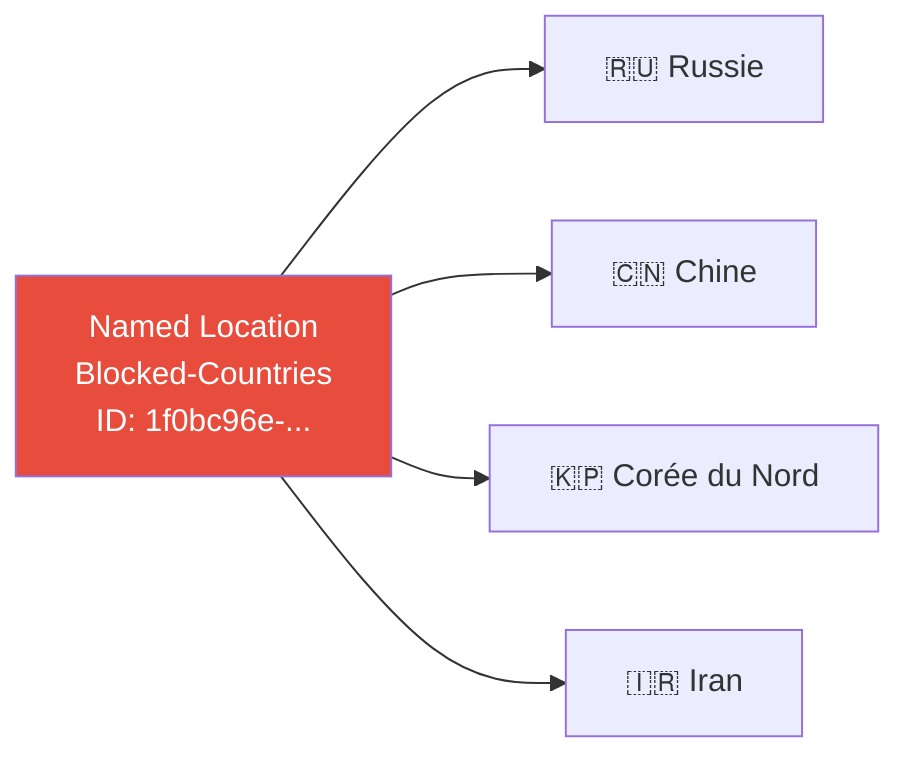
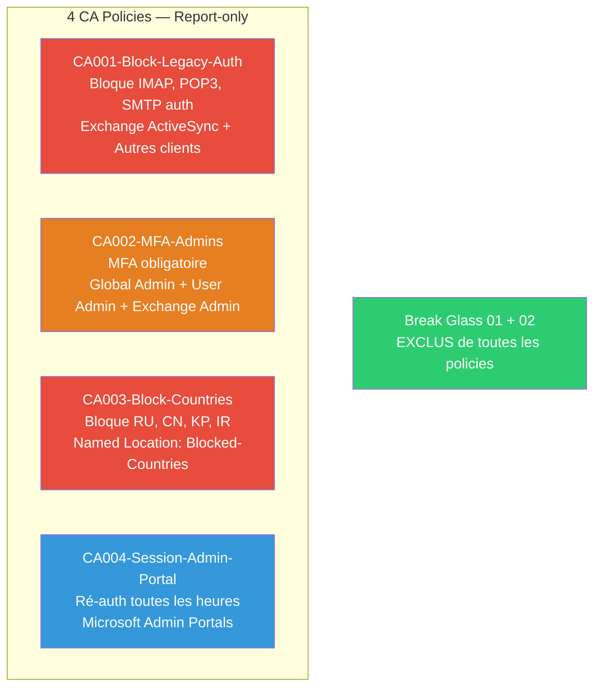

# SC-ID-013 — Conditional Access

## Classification

| Champ | Valeur |
|-------|--------|
| **Code scénario** | SC-ID-013 |
| **Nom** | Conditional Access — 4 policies de sécurité en Report-only |
| **Cible** | Tenant nchouarhipm.onmicrosoft.com |
| **Phase** | Phase 3 — Sécuriser le Tenant |
| **Référentiel** | Microsoft Conditional Access Best Practices, Zero Trust |
| **Date** | Avril 2026 |
| **Auteur** | Nadyr Chouarhi (hik3nR00t) |

---

## Résumé exécutif

### Pour un recruteur

Le Conditional Access est le **cœur de la sécurité Entra ID**. Ce scénario déploie 4 policies couvrant les protections fondamentales : blocage des protocoles legacy, MFA obligatoire pour les admins, blocage géographique, et contrôle de session sur les portails d'administration. Toutes les policies sont déployées en **Report-only** d'abord — la méthode standard en production pour valider l'impact avant l'enforcement. Les Break Glass accounts sont exclus de toutes les policies.

### Pour un RSSI

Le Conditional Access remplace les "Security Defaults" de Microsoft par des rules granulaires et auditables. Le déploiement en 4 policies couvre le **framework de base recommandé par Microsoft** pour tout tenant Entra ID. Le mode Report-only génère des logs dans les Sign-in Logs sans bloquer personne — permettant 2-4 semaines d'analyse avant le passage en enforcement.

---

## Prérequis réalisés

### Désactivation des Security Defaults

Les Security Defaults (MFA basique pour tous, blocage legacy auth global) et le Conditional Access ne peuvent pas coexister. Les Security Defaults ont été désactivées avec la raison "Mon organisation prévoit d'utiliser l'accès conditionnel".

### Named Location — Blocked-Countries



Créée via PowerShell Graph (le portail Entra avait un bug de rendu — bouton "Emplacement des pays" grisé malgré licence P2 active et rôle Global Admin).

```powershell
$params = @{
    "@odata.type" = "#microsoft.graph.countryNamedLocation"
    displayName = "Blocked-Countries"
    countriesAndRegions = @("RU", "CN", "KP", "IR")
    includeUnknownCountriesAndRegions = $false
}
New-MgIdentityConditionalAccessNamedLocation -BodyParameter $params
```

---

## Les 4 Conditional Access Policies



---

### CA001 — Block Legacy Authentication

| Paramètre | Valeur |
|---|---|
| **Utilisateurs** | Tous — Exclure : breakglass01, breakglass02 |
| **Ressources** | Toutes les ressources |
| **Conditions** | Applications clientes : Exchange ActiveSync + Autres clients |
| **Octroyer** | Bloquer l'accès |
| **Mode** | Report-only |

**Pourquoi :** les protocoles legacy (IMAP, POP3, SMTP auth, ancien ActiveSync) ne supportent pas le MFA. C'est le premier vecteur de password spray en entreprise. On bloque ces protocoles pour forcer l'utilisation de clients modernes qui supportent le MFA.

---

### CA002 — MFA for Admins

| Paramètre | Valeur |
|---|---|
| **Utilisateurs** | Rôles : Administrateur général, Administrateur d'utilisateurs, Administrateur Exchange |
| **Exclure** | breakglass01, breakglass02 |
| **Ressources** | Toutes les ressources |
| **Octroyer** | Accorder l'accès + Exiger MFA |
| **Mode** | Report-only |

**Pourquoi :** un Global Admin compromis sans MFA = game over sur le tenant. Le MFA bloque 99,9% des attaques par credential stuffing selon Microsoft. Les 3 rôles ciblés sont les plus critiques (contrôle total, gestion des comptes, accès aux emails).

---

### CA003 — Block Countries

| Paramètre | Valeur |
|---|---|
| **Utilisateurs** | Tous — Exclure : breakglass01, breakglass02 |
| **Ressources** | Toutes les ressources |
| **Conditions** | Emplacements : Inclure Blocked-Countries (RU, CN, KP, IR) |
| **Octroyer** | Bloquer l'accès |
| **Mode** | Report-only |

**Pourquoi :** réduit la surface d'attaque géographique. Ces 4 pays sont les sources les plus fréquentes de brute-force et password spray dans les statistiques Microsoft. Si l'organisation n'a pas d'activité dans ces pays, aucune raison d'accepter des connexions.

---

### CA004 — Session Admin Portal

| Paramètre | Valeur |
|---|---|
| **Utilisateurs** | Rôle : Administrateur général — Exclure : breakglass01, breakglass02 |
| **Ressources** | Microsoft Admin Portals |
| **Session** | Fréquence de connexion : 1 heure (réauthentification périodique) |
| **Mode** | Report-only |

**Pourquoi :** force une ré-authentification toutes les heures pour les Global Admin sur les portails d'administration. Limite le risque de token theft / session hijacking — si un attaquant vole un token de session admin, il a maximum 1h avant expiration.

---

## Vérification

Les 4 policies sont visibles dans le portail Entra ID → Accès conditionnel → Stratégies, toutes en état **"Rapport seul"**.

**Prochaines étapes en production :**
1. Analyser les Sign-in Logs pendant 2-4 semaines (onglet "Report-only" dans les logs)
2. Identifier les faux positifs (utilisateurs légitimes qui seraient bloqués)
3. Ajuster les exclusions si nécessaire
4. Passer en mode **"Activé"** policy par policy

---

## Correspondance mission client

| Étape lab | Équivalent mission client |
|---|---|
| Désactivation Security Defaults | Discussion avec le client — passage aux CA policies granulaires |
| Named Location pays bloqués | Adapté au contexte client (pays où l'entreprise opère) |
| 4 CA policies Report-only | Déploiement Phase 1 — analyse d'impact 2-4 semaines |
| Exclusion Break Glass | Exigence de sécurité — validé avec le RSSI |
| Passage en enforcement | Phase 2 — après validation des logs, policy par policy |
