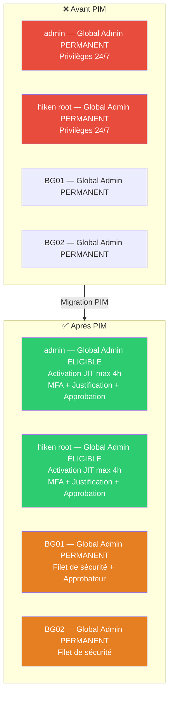
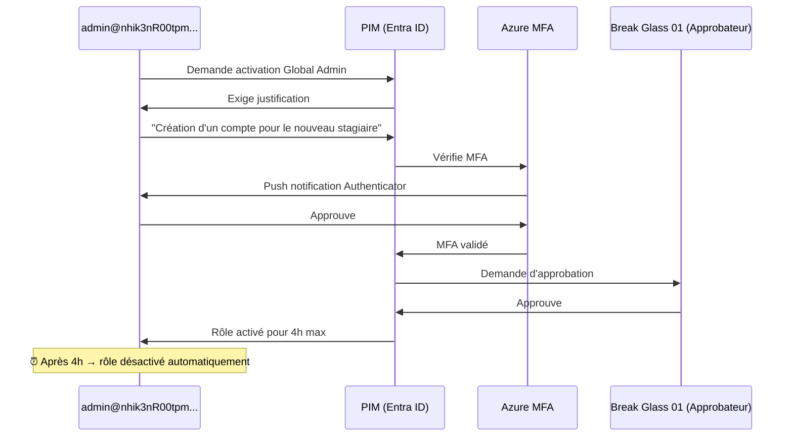

# SC-ID-014 — PIM — Privileged Access Management

## Classification

| Champ | Valeur |
|-------|--------|
| **Code scénario** | SC-ID-014 |
| **Nom** | PIM — Gestion des accès privilégiés Just-In-Time |
| **Cible** | Tenant nhik3nR00tpm.onmicrosoft.com |
| **Phase** | Phase 3 — Sécuriser le Tenant |
| **Référentiel** | Microsoft PIM Best Practices, Zero Trust, NIST SP 800-53 |
| **Date** | Avril 2026 |
| **Auteur** | hik3nR00t |

---

## Résumé exécutif

### Pour un recruteur

PIM (Privileged Identity Management) est la **dernière couche de sécurité Zero Trust** pour les accès privilégiés. Ce scénario transforme les rôles Global Admin permanents en rôles **éligibles** (Just-In-Time) — les admins doivent activer leur rôle à la demande avec MFA, justification et approbation, pour une durée maximale de 4 heures. Les Break Glass accounts restent en permanent comme filet de sécurité. C'est la configuration que tout auditeur vérifie après le Conditional Access.

### Pour un RSSI

Sans PIM, les comptes Global Admin ont des privilèges maximaux 24h/24 — même quand l'admin regarde Netflix. Si le compte est compromis (phishing, token theft, malware), l'attaquant a immédiatement les pleins pouvoirs. PIM réduit la fenêtre d'exposition : les privilèges n'existent que pendant les 4 heures d'activation, avec une trace d'audit complète (qui a activé, quand, pourquoi, qui a approuvé).

---

## Architecture PIM

---

## Configuration PIM — Rôle Administrateur général

### Settings d'activation

| Paramètre | Valeur | Pourquoi |
|---|---|---|
| Durée maximum d'activation | **4 heures** | Limite la fenêtre d'exposition |
| Exiger à l'activation | **Azure MFA** | Prouve l'identité de l'admin |
| Justification obligatoire | **Oui** | Trace d'audit — pourquoi l'admin a besoin du rôle |
| Approbation obligatoire | **Oui** | Un autre admin doit valider la demande |
| Approbateur désigné | **Break Glass 01** | En prod : un manager ou un admin senior |

### Flux d'activation

---

## Attributions finales

### Affectations éligibles (JIT)

| Compte | Rôle | Type | Durée max |
|---|---|---|---|
| Admin Identity | Administrateur général | Éligible permanent | 4h par activation |
| hiken root | Administrateur général | Éligible permanent | 4h par activation |

### Affectations actives (permanentes)

| Compte | Rôle | Type | Justification |
|---|---|---|---|
| Break Glass 1 | Administrateur général | Actif permanent | Compte d'urgence |
| Break Glass 02 | Administrateur général | Actif permanent | Compte d'urgence backup |
| Microsoft.Azure.Sync | Lecteurs de répertoire | Actif permanent | Service AD Connect |

---

## Problème technique rencontré

L'erreur **"You cannot update self assignment for this role"** empêche un admin de modifier son propre rôle Global Admin. C'est une protection de sécurité Microsoft — un admin ne peut pas se retirer ses propres privilèges.

**Solution :** se connecter avec un **autre compte Global Admin** (breakglass01) pour effectuer la migration Active → Eligible sur le compte admin.

**Leçon :** en mission client, toujours planifier la migration PIM en binôme — deux admins qui se migrent mutuellement.

---

## Correspondance mission client

| Étape lab | Équivalent mission client |
|---|---|
| Configuration settings PIM | Atelier de design avec le RSSI — durée, MFA, approbation |
| Migration Active → Eligible | Change management — communication aux admins impactés |
| Break Glass en permanent | Validation RSSI — acceptation de risque documentée |
| Test d'activation | PV de recette — l'admin peut activer et travailler normalement |
| Monitoring des activations | Dashboard PIM — qui active quoi, quand, pourquoi |
