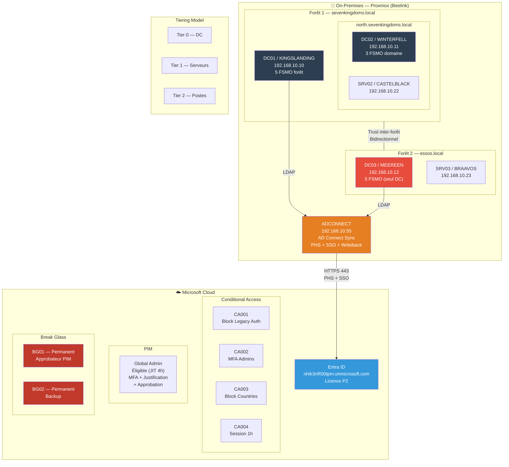
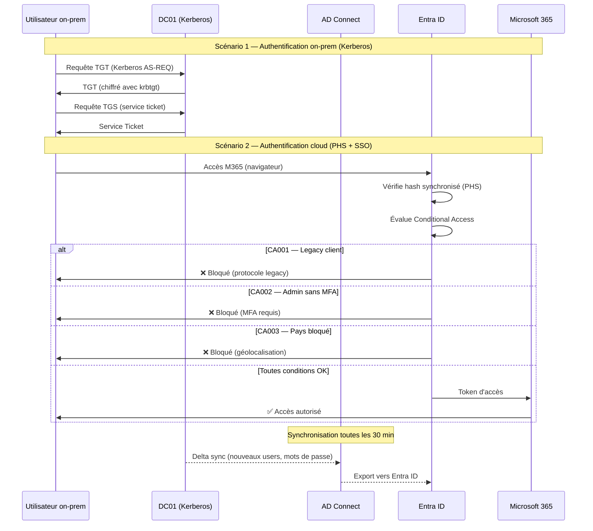
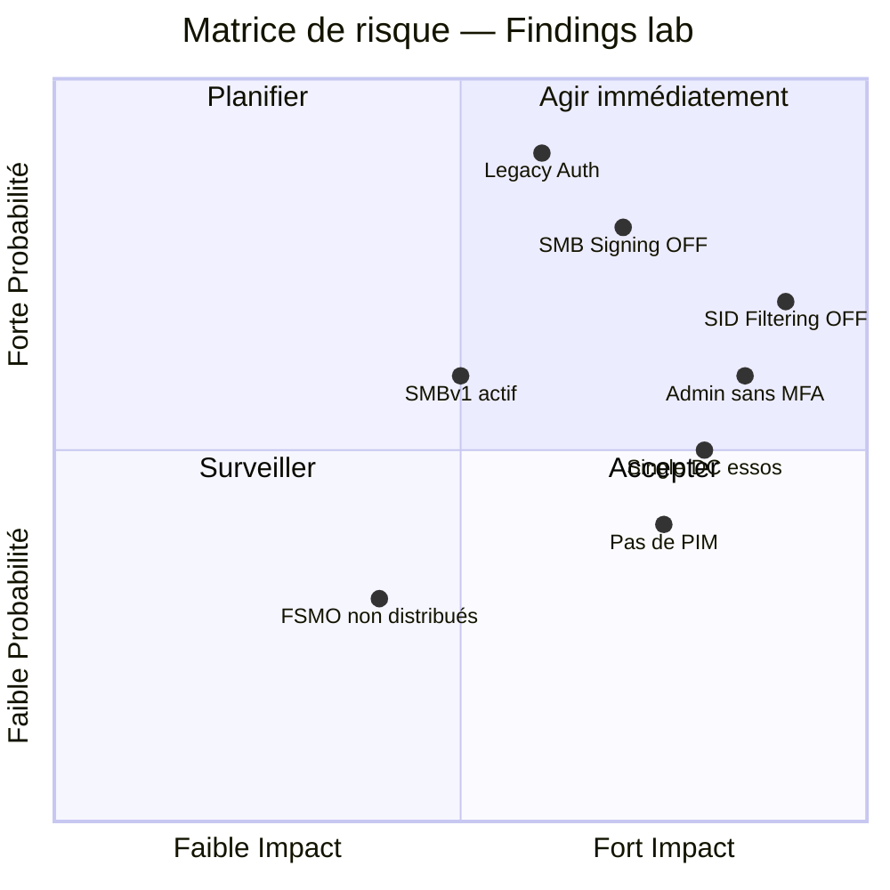

# Architecture Complète — Lab Identity GOAD v3

## Vue d'ensemble

```mermaid
graph TB
    subgraph CLOUD["☁️ Microsoft Cloud"]
        ENTRA["Entra ID<br/>nhik3nR00tpm.onmicrosoft.com<br/>Licence P2"]
        
        subgraph CA["Conditional Access"]
            CA001["CA001<br/>Block Legacy Auth"]
            CA002["CA002<br/>MFA Admins"]
            CA003["CA003<br/>Block Countries"]
            CA004["CA004<br/>Session 1h"]
        end

        subgraph PIM_BLOCK["PIM"]
            PIM["Global Admin<br/>Éligible (JIT 4h)<br/>MFA + Justification<br/>+ Approbation"]
        end

        subgraph BG["Break Glass"]
            BG01["BG01 — Permanent<br/>Approbateur PIM"]
            BG02["BG02 — Permanent<br/>Backup"]
        end
    end

    subgraph ONPREM["🏢 On-Premises — Proxmox (Beelink)"]
        subgraph FOREST1["Forêt 1 — sevenkingdoms.local"]
            DC01["DC01 / KINGSLANDING<br/>192.168.10.10<br/>5 FSMO forêt"]
            
            subgraph CHILD["north.sevenkingdoms.local"]
                DC02["DC02 / WINTERFELL<br/>192.168.10.11<br/>3 FSMO domaine"]
                SRV02["SRV02 / CASTELBLACK<br/>192.168.10.22"]
            end
        end

        subgraph FOREST2["Forêt 2 — essos.local"]
            DC03["DC03 / MEEREEN<br/>192.168.10.12<br/>5 FSMO (seul DC)"]
            SRV03["SRV03 / BRAAVOS<br/>192.168.10.23"]
        end

        ADSYNC["ADCONNECT<br/>192.168.10.55<br/>AD Connect Sync<br/>PHS + SSO + Writeback"]
    end

    subgraph TIERING["Tiering Model"]
        T0["Tier 0 — DC"]
        T1["Tier 1 — Serveurs"]
        T2["Tier 2 — Postes"]
    end

    FOREST1 ---|"Trust inter-forêt<br/>Bidirectionnel"| FOREST2
    ADSYNC -->|"HTTPS 443<br/>PHS + SSO"| ENTRA
    DC01 -->|"LDAP"| ADSYNC
    DC03 -->|"LDAP"| ADSYNC

    style ENTRA fill:#3498db,color:#fff
    style DC01 fill:#2c3e50,color:#fff
    style DC02 fill:#2c3e50,color:#fff
    style DC03 fill:#e74c3c,color:#fff
    style ADSYNC fill:#e67e22,color:#fff
    style BG01 fill:#c0392b,color:#fff
    style BG02 fill:#c0392b,color:#fff
```

---

## Flux d'authentification hybride

```mermaid
sequenceDiagram
    participant User as Utilisateur on-prem
    participant DC as DC01 (Kerberos)
    participant ADC as AD Connect
    participant Entra as Entra ID
    participant M365 as Microsoft 365

    Note over User,M365: Scénario 1 — Authentification on-prem (Kerberos)
    User->>DC: Requête TGT (Kerberos AS-REQ)
    DC->>User: TGT (chiffré avec krbtgt)
    User->>DC: Requête TGS (service ticket)
    DC->>User: Service Ticket

    Note over User,M365: Scénario 2 — Authentification cloud (PHS + SSO)
    User->>Entra: Accès M365 (navigateur)
    Entra->>Entra: Vérifie hash synchronisé (PHS)
    Entra->>Entra: Évalue Conditional Access
    alt CA001 — Legacy client
        Entra->>User: ❌ Bloqué (protocole legacy)
    else CA002 — Admin sans MFA
        Entra->>User: ❌ Bloqué (MFA requis)
    else CA003 — Pays bloqué
        Entra->>User: ❌ Bloqué (géolocalisation)
    else Toutes conditions OK
        Entra->>M365: Token d'accès
        M365->>User: ✅ Accès autorisé
    end

    Note over ADC: Synchronisation toutes les 30 min
    DC-->>ADC: Delta sync (nouveaux users, mots de passe)
    ADC-->>Entra: Export vers Entra ID
```

---

## Matrice de sécurité

```mermaid
quadrantChart
    title Matrice de risque — Findings lab
    x-axis Faible Impact --> Fort Impact
    y-axis Faible Probabilité --> Forte Probabilité
    quadrant-1 Agir immédiatement
    quadrant-2 Planifier
    quadrant-3 Surveiller
    quadrant-4 Accepter
    SID Filtering OFF: [0.9, 0.7]
    Single DC essos: [0.8, 0.5]
    SMB Signing OFF: [0.7, 0.8]
    Legacy Auth: [0.6, 0.9]
    Admin sans MFA: [0.85, 0.6]
    Pas de PIM: [0.75, 0.4]
    SMBv1 actif: [0.5, 0.6]
    FSMO non distribués: [0.4, 0.3]
```
