# SC-300-01 — Gestion des utilisateurs et des rôles d'annuaire

## Classification

| Champ | Valeur |
|-------|--------|
| **Code scénario** | SC-300-01 |
| **Nom** | Cycle de vie des comptes et délégation de rôles d'annuaire (moindre privilège) |
| **Type** | 🛡️ Défensif — Administration & gouvernance des identités (Entra ID) |
| **Environnement** | Tenant Microsoft Entra `nchouarhipm.onmicrosoft.com` (Entra ID P2) |
| **Domaine SC-300** | D1 (Implement and manage user identities) |
| **Module Entra** | Users · Roles & administrators · Bulk operations · Microsoft Graph PowerShell · Licenses |
| **Criticité opérationnelle** | 🟠 Élevée (provisioning & droits d'administration) |
| **Contrôles ISO 27001** | A.5.16 (Gestion des identités), A.5.18 (Droits d'accès), A.8.2 (Accès privilégiés) |
| **Exigences NIS2** | Art. 21.2(i) — contrôle d'accès, gestion du cycle de vie des comptes |
| **MITRE D3FEND** | D3-UAP (User Account Permissions), D3-ANCI (Account Locking) |
| **Réf. lab SC-300** | `Lab_01_ManageUserRoles` |
| **Date** | Août 2026 |
| **Auteur** | Nadyr Chouarhi (hik3nR00t) |

---

## Contexte & scénario

> **MediaTech Groupe SA** onboarde de nouveaux collaborateurs et doit industrialiser la gestion de leurs comptes : création, attribution de droits d'administration **au plus juste**, révocation en fin de mission, provisioning de masse automatisé, réversibilité des suppressions et attribution de licences.
>
> Le fil rouge est le **moindre privilège** : un compte créé n'a **aucun** droit d'administration tant qu'un rôle précis ne lui est pas délégué, et ce rôle est **retiré** dès qu'il n'est plus nécessaire. Ce write-up déroule le cycle de vie complet sur le tenant réel, et met en évidence deux observations de posture : le tenant **force la MFA** à la première connexion (durcissement) et le **provisioning est réalisé par automation Graph** (le bulk du portail étant défaillant).

---

## Résumé exécutif

### Pour un recruteur

Ce write-up couvre le **cycle de vie complet d'un compte** dans Microsoft Entra : création, délégation d'un rôle d'administration ciblé (*Application Administrator* plutôt que *Global Admin*), révocation, provisioning de masse via **Microsoft Graph PowerShell**, suppression réversible (soft-delete 30 j) et attribution de licence. Compétences cœur du métier d'administrateur IAM et du domaine 1 de l'examen SC-300.

### Pour un auditeur ISO 27001 / NIS2

Le scénario démontre une **gestion maîtrisée du cycle de vie des identités** (A.5.16) : provisioning traçable et automatisé (Graph), délégation par rôle correspondant strictement à la fonction (A.5.18), révocation immédiate en fin de besoin, suppression réversible garantissant la continuité, et attribution de licence conditionnée à une **UsageLocation** conforme aux obligations légales/export. Chaque opération est journalisée dans les journaux d'audit Entra. Observation positive : la MFA est **imposée dès l'enregistrement** (renforce A.8.5 — authentification sécurisée).

### Pour un RSSI

Risque adressé : le **privilege creep** (droits qui s'accumulent) et le **provisioning non maîtrisé**. En prouvant qu'un compte standard ne peut rien administrer, en déléguant des rôles ciblés puis en les révoquant, on réduit la surface d'attaque privilégiée. Le soft-delete (30 j) garantit la réversibilité des erreurs d'offboarding. Le tenant applique déjà la **MFA obligatoire**, réduisant le risque de compromission de compte.

---

## Objectif & périmètre

Maîtriser la création, la délégation de rôle, la révocation, le provisioning de masse, la suppression/restauration et le licensing d'utilisateurs Entra, dans une logique de moindre privilège et de cycle de vie contrôlé.

---

## Prérequis

- Rôle **Global Administrator** (compte Break Glass) ou **User Administrator** pour créer/gérer les comptes et déléguer des rôles.
- **PowerShell 7** + modules `Microsoft.Graph.Authentication` et `Microsoft.Graph.Users` pour le provisioning par script.
- Une licence disponible pour l'exercice de licensing (⚠️ voir Phase 6 — aucun siège libre dans ce tenant).

---

## Procédure de mise en œuvre

### Phase 1 — Créer un user et prouver l'absence de droits (Ex.1)

> Session **breakglass01** (GA).

1. `entra.microsoft.com` → **Entra ID → Utilisateurs → Tous les utilisateurs → + Nouvel utilisateur → Créer un utilisateur**.
2. UPN `ChrisG` · Nom `Chris Green` · **Générer le mot de passe** (copier) → `Vérifier + créer` → `Créer`.
   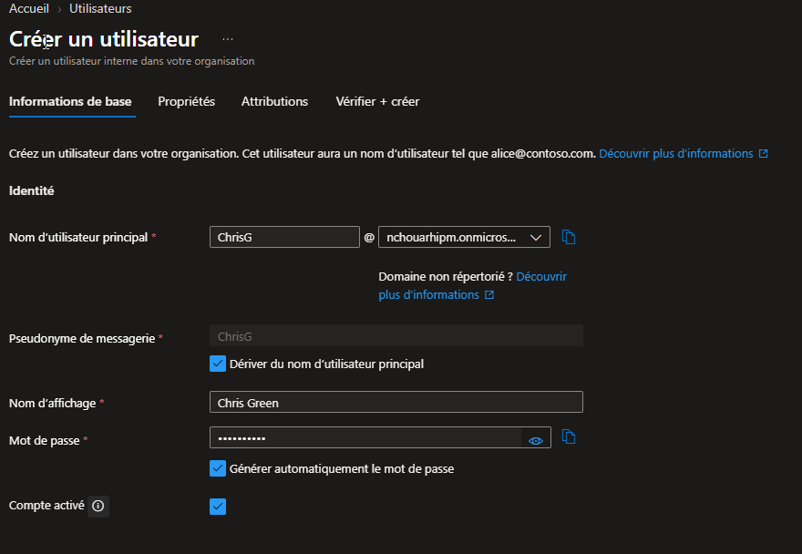
3. Fenêtre **InPrivate** → connexion Chris Green.
   > **Observation posture :** le tenant **force l'enregistrement MFA** (Microsoft Authenticator) à la première connexion — durcissement absent du tenant vanilla du lab officiel.
4. Recherche **Applications d'entreprise → + Nouvelle application** → **« Créer votre propre application » est GRISÉ**.
   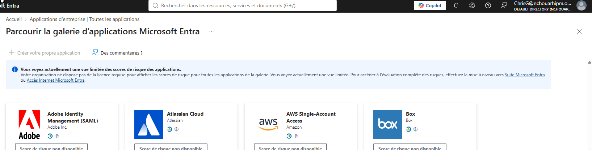

> **Logique métier :** un nouvel arrivant sans rôle ne peut rien administrer. Baseline de moindre privilège prouvée.

### Phase 2 — Déléguer *Application Administrator* (Ex.2)

5. `Utilisateurs → Chris Green → Rôles affectés → + Ajouter des affectations`.
6. Rôle **Administrateur d'application** → `Suivant` → onglet **Paramètre** → Type **Actif** → justification `lab SC-300` → **Affecter**.
   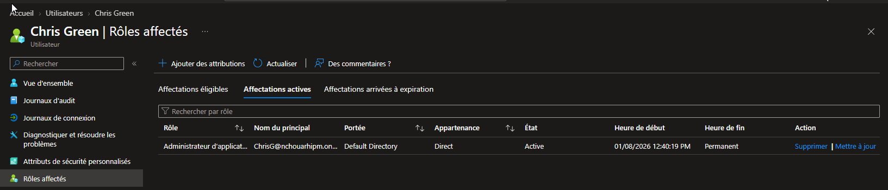
   > Comme PIM est activé sur le tenant, l'affectation passe par PIM (Éligible/Actif). En prod : privilégier **Éligible** (JIT). Ici **Actif** pour tester l'effet immédiat.
7. InPrivate Chris Green → **Applications d'entreprise → + Nouvelle application** → cette fois **« Créer votre propre application » est DISPONIBLE**.
   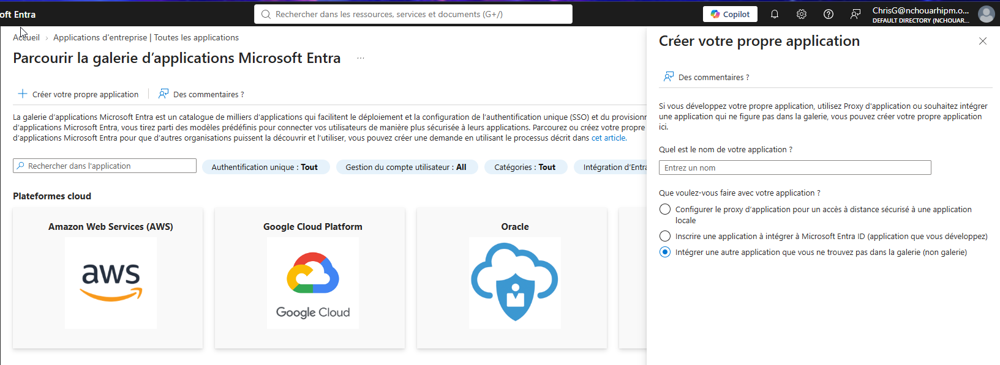

> **Logique métier :** délégation ciblée = *Application Administrator* plutôt que *Global Admin*. Effet immédiat et réversible.

### Phase 3 — Révoquer le rôle (Ex.3)

8. `Utilisateurs → Chris Green → Rôles affectés → Affectations actives → Administrateur d'application → Supprimer → Oui`.
   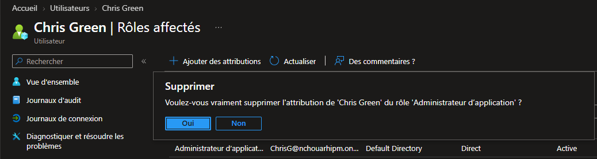

> **Logique métier :** cycle de vie des accès — le rôle se retire dès qu'il n'est plus nécessaire (lutte contre le privilege creep).

### Phase 4 — Provisioning de masse (Ex.4)

**A. Bulk CSV (portail) — échec (bug Microsoft) :**

Le nouveau service d'opérations en bloc du portail reste bloqué à l'état **`WaitingForFileInput`** et renvoie une « erreur inattendue » à la soumission, malgré un CSV valide chargé avec succès. Bug côté Microsoft (un bandeau recommande d'ailleurs de « continuer à utiliser l'expérience d'origine »).
   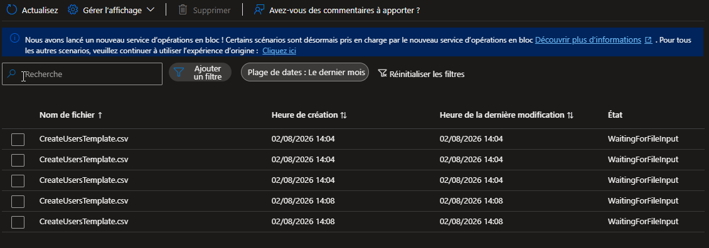

> **Décision :** pivot vers **Microsoft Graph PowerShell** — plus fiable, reproductible, et industrialisable (angle automation).

**B. Microsoft Graph PowerShell — succès :**

> ⚠️ **PowerShell 7 requis** — le SDK Graph 2.x échoue à charger sur Windows PowerShell 5.1 (conflit d'assemblies). N'installer que les sous-modules nécessaires (plus léger et stable que le méta-module `Microsoft.Graph`).

```powershell
# 1. Installation (PowerShell 7)
Install-Module Microsoft.Graph.Authentication, Microsoft.Graph.Users -Scope CurrentUser -Force

# 2. Connexion — compte GA breakglass01, consentement User.ReadWrite.All
Connect-MgGraph -Scopes "User.ReadWrite.All"

# 3. Profil mot de passe (sans changement forcé pour le lab)
$PWProfile = @{ Password = "LabP@ss12345!"; ForceChangePasswordNextSignIn = $false }

# 4. Création des utilisateurs (-AccountEnabled = comptes actifs, -UsageLocation obligatoire pour les licences)
New-MgUser -DisplayName "Lab User 1" -GivenName "Lab" -Surname "User1" `
  -MailNickname "labuser1" -UsageLocation "FR" `
  -UserPrincipalName "labuser1@nchouarhipm.onmicrosoft.com" `
  -PasswordProfile $PWProfile -AccountEnabled -Department "IT" -JobTitle "Lab"

New-MgUser -DisplayName "Lab User 2" -GivenName "Lab" -Surname "User2" `
  -MailNickname "labuser2" -UsageLocation "FR" `
  -UserPrincipalName "labuser2@nchouarhipm.onmicrosoft.com" `
  -PasswordProfile $PWProfile -AccountEnabled -Department "IT" -JobTitle "Lab"

# 5. Vérification
Get-MgUser -Filter "startswith(displayName,'Lab User')" |
  Select-Object DisplayName, UserPrincipalName, AccountEnabled
```
   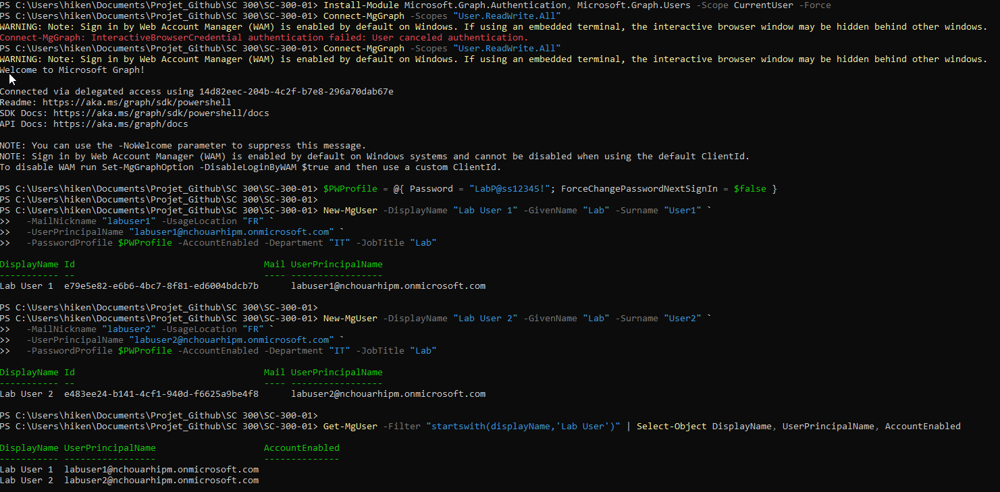

> **Logique métier :** onboarding de masse (promo, acquisition) via pipeline RH → Graph. Reproductible, versionnable, auditablé — bien supérieur au clic-bouton.

### Phase 5 — Supprimer et restaurer un user (Ex.5)

9. `Utilisateurs → Chris Green → Supprimer → Oui` (le portail rappelle : *rétablissable jusqu'à 30 jours*).
   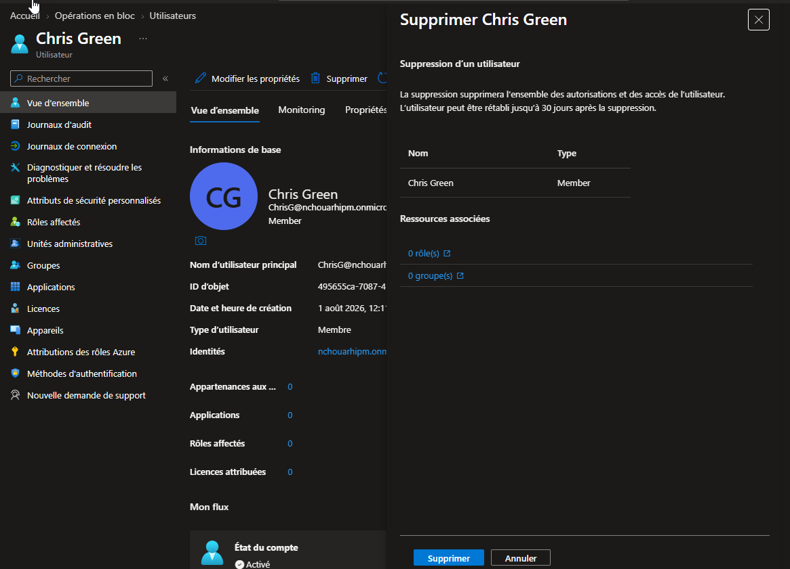
10. `Utilisateurs supprimés → Chris Green → Restaurer l'utilisateur → OK`. La vue « Utilisateurs supprimés » affiche la **date de suppression** et la **date de purge définitive (+30 j)**.
   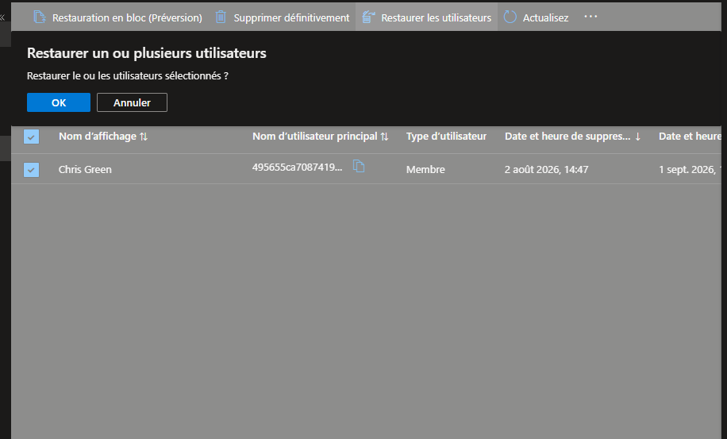

> **Logique métier :** soft-delete 30 jours = offboarding réversible, erreurs récupérables avec conservation du SID et des attributs.

### Phase 6 — Attribuer une licence (Ex.6)

Ce tenant ne dispose que d'**1 licence Azure AD Premium P2, 0 siège disponible** (affectée à Admin Identity). La procédure est documentée sans attribution réelle (pas de siège libre).

11. `Utilisateurs → Lab User 1 → Licences → + Attributions`.
   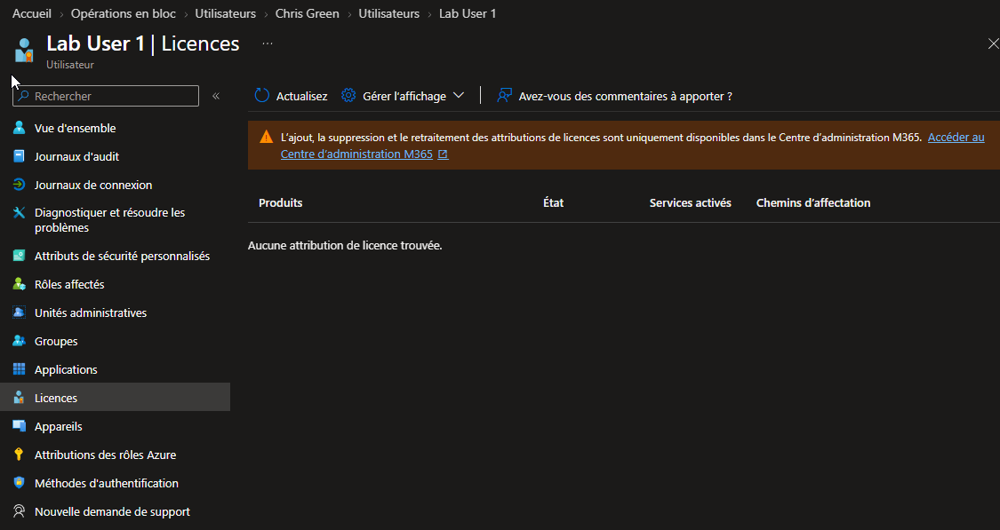
    Le portail Entra renvoie vers le **Centre d'administration M365** (`admin.microsoft.com → Facturation → Licences`) pour l'ajout/retrait des licences.

> **Points clés :**
> - **UsageLocation obligatoire** avant toute attribution de licence (nos Lab Users ont `FR`). Sans elle → échec.
> - En prod, préférer le **group-based licensing** (cf. SC-300-03) : la licence suit l'appartenance à un groupe → zéro oubli, zéro licence fantôme.
> - Pour une attribution réelle : activer un **trial** (EMS E5 / M365 E5) fournissant des sièges assignables.

---

## Vérification & preuves d'audit

```
☐ Chris Green créé sans rôle → app registration grisée      → 01, 02
☐ MFA forcée à la 1re connexion (posture durcie)            → (obs. Phase 1)
☐ Application Administrator assigné → app registration OK    → 03, 04
☐ Rôle retiré → Chris absent des affectations                → 05
☐ Bulk portail bloqué (WaitingForFileInput) → pivot Graph    → 06
☐ New-MgUser → Lab User 1 & 2 créés et actifs                → 07
☐ Suppression (30 j) puis restauration réussie               → 08
☐ Licence : procédure + UsageLocation (0 siège dispo)        → 09
☐ Audit logs → "Add user" / "Add member to role" / "Delete user" / "Restore user"
```

---

## Impact métier — MediaTech Groupe SA

### Synthèse narrative

Pour MediaTech Groupe SA, la gestion du cycle de vie des comptes est un enjeu de **sécurité** (droits au plus juste, révocation rapide) **et** d'**efficacité opérationnelle** (onboarding de masse automatisé, licensing maîtrisé). Un provisioning manuel et des droits non révoqués génèrent à la fois du risque (comptes sur-privilégiés) et du coût (licences fantômes). L'automation Graph et le modèle least-privilege adressent les deux.

### Estimation financière

| Poste | Sans gouvernance | Avec cycle de vie maîtrisé |
|-------|------------------|----------------------------|
| Privilege creep (comptes sur-privilégiés) | vecteur d'escalade — remédiation coûteuse | droits révoqués, surface réduite |
| Licences non réclamées | gaspillage récurrent (10-30 €/user/mois) | group-based licensing = 0 oubli |
| Onboarding manuel de masse | heures d'admin | Graph = minutes, reproductible |

### Matrice de risque

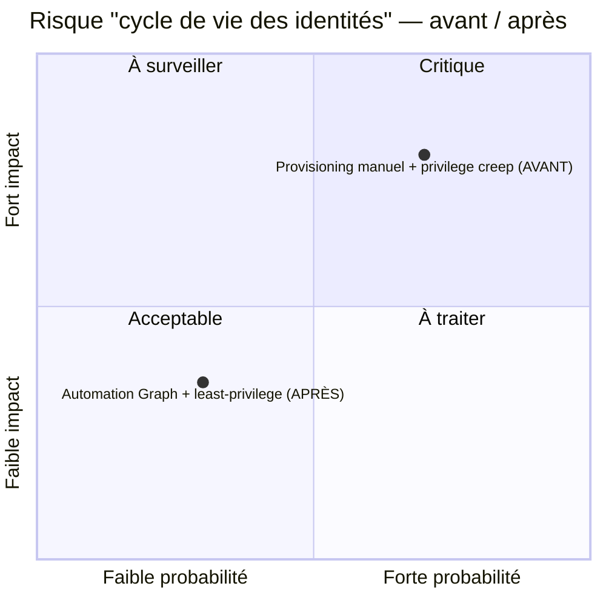

### Impact réglementaire

RGPD Art. 32 (sécurité des accès), NIS2 Art. 21 (gestion du cycle de vie des comptes), ISO 27001 A.5.16 / A.5.18.

### Top 5 actions prioritaires

- **0–24 h** : audit des rôles d'annuaire actifs, révocation des droits inutiles.
- **1 semaine** : basculer les rôles privilégiés en éligible PIM.
- **1 semaine** : automatiser l'onboarding via Graph (pipeline RH → Entra).
- **1 mois** : group-based licensing pour supprimer les licences fantômes.
- **1 mois** : Access Reviews sur les rôles et les comptes.

### Décisions attendues du COMEX

- Valider la **politique de moindre privilège** sur les rôles d'annuaire.
- Financer l'**automatisation du provisioning** (RH → Entra via Graph).
- Mandater une **revue trimestrielle** des licences et des droits.

---

## Détection SOC / SIEM

| Source | Événement | Intérêt |
|--------|-----------|---------|
| Audit logs | `Add user` / `Delete user` / `Restore user` | Cycle de vie des comptes |
| Audit logs | `Add member to role` | Délégation de privilège |
| Audit logs | Création de comptes en masse inhabituelle | Provisioning anormal → à alerter |

```kusto
AuditLogs
| where OperationName in ("Add user","Delete user","Restore user","Add member to role")
| extend Initiator = tostring(InitiatedBy.user.userPrincipalName)
| project TimeGenerated, OperationName, Initiator, TargetResources
| order by TimeGenerated desc
```

---

## Durcissement continu / posture — `m365-admin-toolkit`

Contrôle continu via [`m365-admin-toolkit`](https://github.com/hikenroot/m365-admin-toolkit) (PowerShell 7 + Microsoft.Graph, mappé CIS M365 / NIST 800-53) :

| Contrôle | Script toolkit (rôle : Global/Security Reader) |
|----------|------------------------------------------------|
| Détection de comptes inactifs / orphelins | `audit-inactive-accounts` |
| Rôles d'annuaire actifs (privilège permanent) | `audit-privileged-roles` |
| Comptes sans licence / licences fantômes | `audit-tenant-config` (licences) |
| `Users can register applications = No` (durcissement) | `audit-security-policies` |

- **0–24 h** : `Users can register applications = No` ; audit des rôles actifs.
- **1 semaine** : rôles privilégiés en éligible PIM ; automatisation onboarding Graph.
- **1 mois** : group-based licensing ; Access Reviews.

---

## Points d'examen SC-300

- Un utilisateur **sans rôle** ne peut pas gérer les app registrations (bouton grisé).
- **UsageLocation obligatoire** avant d'attribuer une licence.
- **Soft-delete = 30 jours** récupérable ; au-delà = définitif.
- **Application Administrator** ≠ Global Administrator (moindre privilège).
- `New-MgUser` (Microsoft Graph) remplace l'ancien `New-AzureADUser` (déprécié) — **PowerShell 7 requis** pour le SDK v2.
- Group-based licensing = méthode recommandée en prod (vs assignation directe).

---

## Références

- [SC-300 Study Guide](https://learn.microsoft.com/en-us/credentials/certifications/resources/study-guides/sc-300)
- [Lab_01 Manage User Roles](https://microsoftlearning.github.io/SC-300-Identity-and-Access-Administrator/Instructions/Labs/Lab_01_ManageUserRoles.html)
- Microsoft Graph PowerShell — `New-MgUser` (learn.microsoft.com/powershell/microsoftgraph)
- [m365-admin-toolkit](https://github.com/hikenroot/m365-admin-toolkit) — audit & durcissement M365
