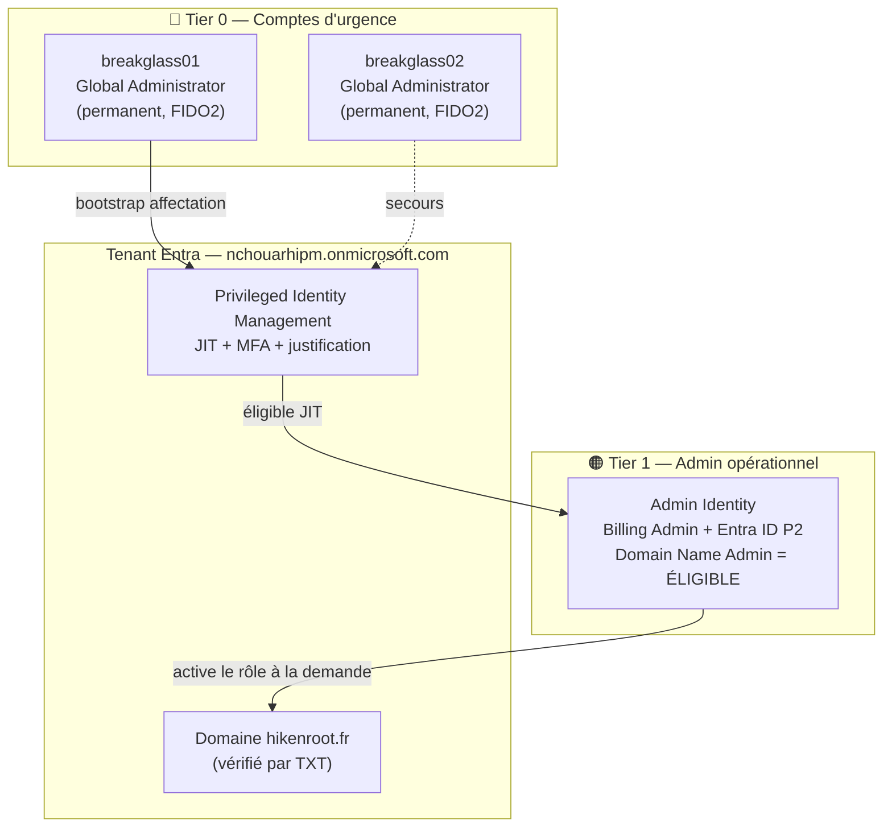
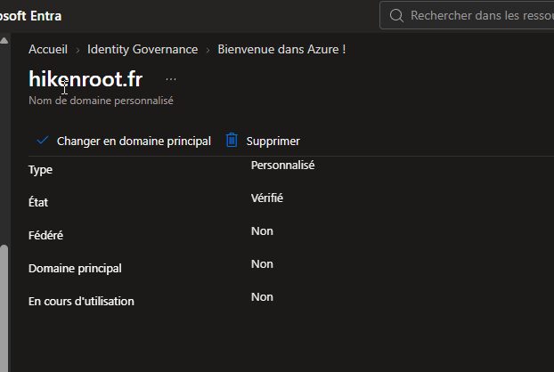
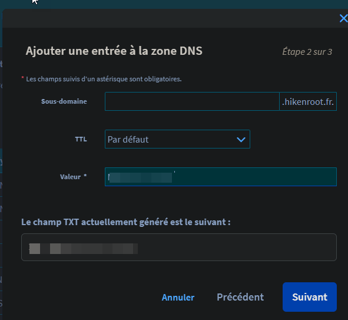
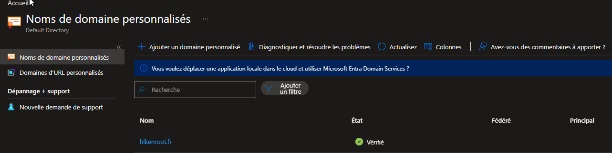
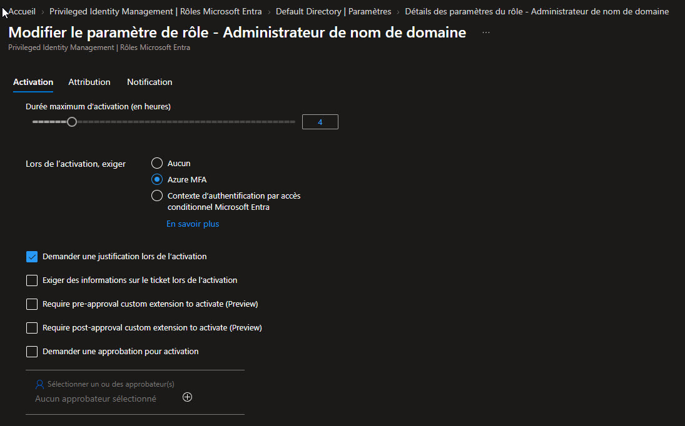
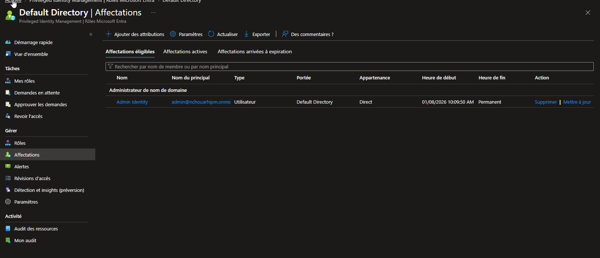
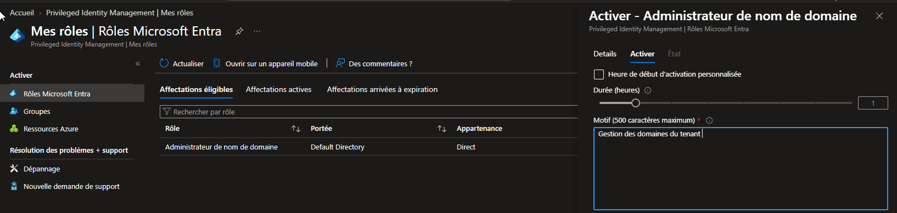
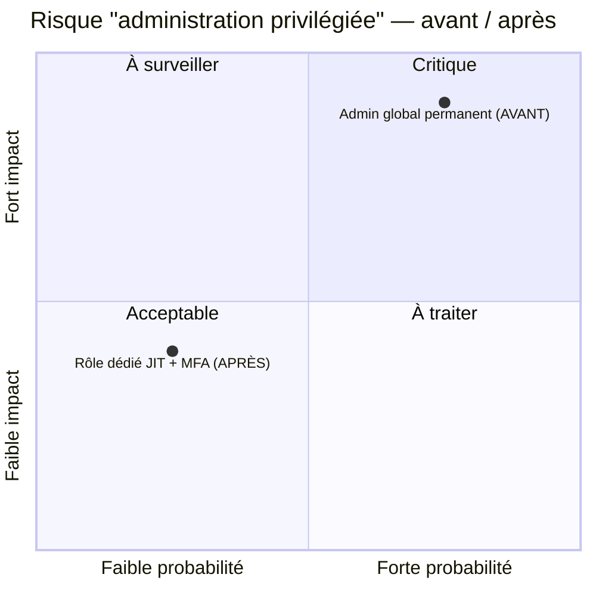
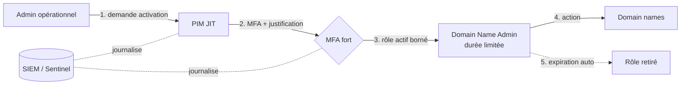

# SC-300-02 — Domaine personnalisé & rôles privilégiés least-privilege (PIM)

## Classification

| Champ | Valeur |
|-------|--------|
| **Code scénario** | SC-300-02 |
| **Nom** | Intégration d'un domaine personnalisé et délégation d'administration des domaines en moindre privilège via PIM |
| **Type** | 🛡️ Défensif — Administration & durcissement identité (Entra ID) |
| **Environnement** | Tenant Microsoft Entra `nchouarhipm.onmicrosoft.com` → domaine `hikenroot.fr` |
| **Domaine SC-300** | D1 (Implement identities) + D4 (Identity governance) |
| **Module Entra** | Domain names · Roles & administrators · Privileged Identity Management |
| **Criticité opérationnelle** | 🟠 Élevée (gouvernance des accès privilégiés) |
| **Contrôles ISO 27001** | A.5.15 (Contrôle d'accès), A.5.16 (Gestion des identités), A.5.18 (Droits d'accès), A.8.2 (Accès privilégiés) |
| **Exigences NIS2** | Art. 21.2(i) — contrôle d'accès et gestion des actifs ; politique d'accès au moindre privilège |
| **MITRE D3FEND** | D3-ANCI (Account Locking), D3-PAM (Privileged Account Management), D3-JIT (Just-in-Time Privilege) |
| **Réf. labs SC-300** | `Lab_02_WorkingWithTenantProperties` · `Lab_26_ConfigurePrivilegedIdentityManagementForAADRoles` (connexe `Lab_11`) |
| **Date** | Août 2026 |
| **Auteur** | Nadyr Chouarhi (hik3nR00t) |

---

## Contexte & scénario

> **MediaTech Groupe SA** migre son système d'information vers Microsoft 365 et vient d'acquérir son domaine de marque `hikenroot.fr`. La DSI doit l'intégrer au tenant Microsoft Entra, le vérifier par DNS, puis confier la gestion des domaines à un **administrateur opérationnel** — **sans** lui accorder les pleins pouvoirs d'administration globale, réservés aux comptes d'urgence (Break Glass, Tier 0).
>
> L'enjeu : permettre à l'équipe IT d'opérer au quotidien tout en garantissant qu'**un compte opérationnel compromis ne donne jamais les clés du tenant**. La réponse retenue : un rôle **least-privilege** (*Domain Name Administrator*) attribué en **éligible Just-in-Time** via Privileged Identity Management, activable à la demande sous MFA et justification, avec expiration automatique.
>
> Ce write-up documente la mise en œuvre complète, de l'intégration du domaine à l'activation JIT, avec les preuves d'audit à chaque étape.

---

## Résumé exécutif

### Pour un recruteur

Ce write-up démontre la mise en œuvre d'une **gouvernance des accès privilégiés de niveau entreprise** sur un tenant Microsoft Entra. Le domaine de l'organisation (`hikenroot.fr`) est intégré et vérifié par DNS, puis le droit de gestion des domaines est **délégué à un compte opérationnel sans lui accorder les pleins pouvoirs** : au lieu de « Administrateur général », on attribue le rôle ciblé *Domain Name Administrator*, en mode **éligible Just-in-Time (JIT)** via Privileged Identity Management. Les comptes d'urgence (Break Glass, Tier 0) restent les seuls détenteurs permanents de l'administration globale. Ce scénario illustre la maîtrise du **modèle de tiering**, du **moindre privilège** et de l'**activation à la demande** — compétences cœur de l'examen SC-300 et du métier d'IAM Administrator.

### Pour un auditeur ISO 27001 / NIS2

Cette mise en œuvre répond directement à plusieurs exigences de contrôle d'accès :

- **Moindre privilège (A.8.2 / A.5.18)** : aucun compte opérationnel ne détient de rôle « Administrateur général » permanent. Le droit de gérer les domaines est isolé dans le rôle *Domain Name Administrator*, correspondant strictement à la fonction exercée. Le périmètre du rôle peut être restreint à une *Administrative Unit* pour un cloisonnement encore plus fin.
- **Accès Just-in-Time (A.5.15)** : l'affectation est **éligible**, non active. Le titulaire doit activer le rôle pour une durée bornée, avec **MFA** et **justification métier** obligatoires, satisfaisant l'exigence de contrôle d'accès contextuel et de traçabilité.
- **Comptes d'urgence maîtrisés (A.5.16)** : deux comptes Break Glass constituent le Tier 0, exclus de l'usage quotidien, réservés au bootstrap et à la reprise. Leur usage est journalisé et revu.
- **Traçabilité (A.5.16 / NIS2 Art. 21)** : chaque affectation éligible et chaque activation génère un événement dans les journaux d'audit Entra, exploitable en SIEM pour la revue périodique des accès.

En logique NIS2, ce dispositif démontre une **gouvernance documentée des identités privilégiées** sur un composant critique du SI (le fournisseur d'identité cloud), avec séparation des privilèges, activation contrôlée et journalisation.

### Pour un RSSI

Le risque adressé est la **prolifération des droits d'administration globale** — première cause d'escalade lors d'une compromission de compte cloud. En cantonnant l'administration des domaines à un rôle dédié, activé à la demande et sous MFA, on **réduit la surface d'attaque privilégiée** : un compte opérationnel compromis ne donne pas les clés du tenant. Les comptes Break Glass, seuls détenteurs permanents du pouvoir global, sont protégés par des facteurs forts (FIDO2/clé matérielle) et exclus des politiques d'accès conditionnel pour garantir la reprise en cas d'incident. Coût de mise en œuvre : nul (licence P2 déjà présente). Gain : conformité et réduction directe du rayon d'explosion d'un incident d'identité.

---

## Architecture identité (état cible)



---

## Objectif & périmètre

Intégrer le domaine `hikenroot.fr` au tenant et le vérifier par DNS, puis **déléguer sa gestion sans sur-privilégier** : attribution du rôle *Domain Name Administrator* en **éligible PIM** au compte opérationnel `Admin Identity`, activation JIT sous MFA. **Hors périmètre** : configuration des enregistrements mail (MX/SPF/DKIM — cf. SC-300-XX à venir).

---

## Prérequis

- Compte **Break Glass** (Global Administrator) pour la vérification du domaine et le bootstrap PIM.
- Licence **Entra ID P2** active (présente sur `Admin Identity`) — obligatoire pour PIM.
- Accès à la **zone DNS** du domaine (registrar OVH).

---

## Procédure de mise en œuvre

### Phase 1 — Intégration et vérification du domaine (Lab 02)

> Session **Break Glass** (Global Admin requis).

1. `entra.microsoft.com` → **Entra ID → Domain names → + Add custom domain**.
2. Saisir `hikenroot.fr` → **Add domain**.
   
3. Relever l'enregistrement de vérification affiché :
   ```
   Type : TXT   Host : @   Value : MS=msXXXXXXXX   TTL : 3600
   ```
4. OVH → **Domaines → hikenroot.fr → Zone DNS → Ajouter une entrée TXT** → sous-domaine vide, valeur `MS=msXXXXXXXX` → Appliquer.
   
5. Retour Entra → **Verify**.
   

### Phase 2 — Paramétrage du rôle PIM (Lab 26 / Ex.1)

6. `Identity Governance → Privileged Identity Management → Rôles Entra → Settings`.
7. Rôle **Domain Name Administrator → Edit** :
   - MFA à l'activation : **ON**
   - Justification requise : **ON**
   - Durée d'activation max : **1–4 h**
   - Approbation (option) : approbateur = pair / Break Glass
   

### Phase 3 — Affectation éligible (Lab 26 / Ex.2 T1)

8. `PIM → Rôles Entra → Affectations → + Ajouter des affectations`.
9. Rôle **Domain Name Administrator** · Membre **Admin Identity** · Type **Éligible** (pas Actif) · Scope **Directory** (ou Administrative Unit).
   

### Phase 4 — Activation JIT (Lab 26 / Ex.2 T3)

10. Session **Admin Identity** → `PIM → Mes rôles → Domain Name Administrator → Activer`.
11. Durée + justification métier → **MFA challenge** → Activer.
    

---

## Vérification & preuves d'audit

```
☐ Domain names → hikenroot.fr = Verified / Healthy         → SC-300-02-03
☐ PIM → Domain Name Administrator → affectation ÉLIGIBLE visible   → SC-300-02-05
☐ PIM → activation temporaire ACTIVE après JIT                    → SC-300-02-06
☐ Audit logs → filtre "PIM" → "Add eligible assignment" + "Activate role"
☐ Roles & administrators → Admin Identity NE possède PAS Global Administrator
☐ Break Glass 01/02 = seuls Global Admin permanents
```

---

## Impact métier — MediaTech Groupe SA

### Synthèse narrative

Pour MediaTech Groupe SA, le fournisseur d'identité cloud est le **point de contrôle central** de tous les accès aux services (messagerie, SharePoint, applications métier). Laisser plusieurs comptes en « Administrateur général » permanent revient à distribuer des passe-partout : un seul de ces comptes compromis (phishing, vol de token) donne le **contrôle total du SI**. En cantonnant chaque fonction d'administration à un rôle dédié, activé à la demande sous MFA, MediaTech réduit drastiquement le rayon d'explosion d'un incident d'identité et satisfait ses obligations réglementaires.

### Estimation financière (évitement de risque)

| Poste | Sans moindre privilège | Avec PIM JIT |
|-------|------------------------|--------------|
| Compromission d'un compte admin permanent | Contrôle total tenant — remédiation ~150 k€ + arrêt d'activité | Accès borné, JIT expiré — impact contenu |
| Amende RGPD/NIS2 sur défaut de contrôle d'accès | jusqu'à 2 % du CA / 10 M€ | Conformité documentée |
| Coût de la mesure | — | **0 € (licence P2 déjà acquise)** |

### Matrice de risque



### Impact réglementaire

- **RGPD Art. 32** : mesures techniques de sécurité des accès aux données personnelles — le moindre privilège en fait partie.
- **NIS2 Art. 21.2(i)** : politiques de contrôle d'accès et gestion des actifs — dispositif conforme.
- **ISO 27001 A.8.2** : gestion des droits d'accès privilégiés — séparation, activation contrôlée, revue.

### Top 5 actions prioritaires

- **0–24 h** : vérifier qu'aucun compte opérationnel n'a de rôle GA permanent ; basculer les rôles privilégiés en éligible PIM.
- **0–24 h** : confirmer que Break Glass 01/02 sont protégés (FIDO2) et exclus des CA.
- **1 semaine** : activer MFA + justification sur tous les paramètres de rôles PIM.
- **1 semaine** : restreindre les rôles à des Administrative Units là où c'est pertinent.
- **1 mois** : mettre en place des **Access Reviews** trimestrielles sur les rôles privilégiés.

### Décisions attendues du COMEX

- **Valider la politique « zéro admin global permanent »** hors comptes Break Glass.
- **Nommer les approbateurs** PIM et les responsables des revues d'accès.
- **Intégrer la journalisation PIM** au périmètre du SOC / SIEM.

---

## Détection SOC / SIEM

### Journaux Entra à superviser

| Source | Événement | Intérêt |
|--------|-----------|---------|
| Audit logs | `Add member to role (eligible)` | Nouvelle affectation privilégiée |
| Audit logs | `Add member to role completed (PIM activation)` | Activation JIT d'un rôle |
| Sign-in logs | Activation sans MFA réussie | Anomalie de politique |
| Audit logs | `Add member to role (permanent/active)` sur rôle sensible | **À alerter** — contournement du modèle JIT |

### Requête KQL (Microsoft Sentinel)

```kusto
AuditLogs
| where OperationName has "Add member to role"
| where TargetResources has "Domain Name Administrator"
   or TargetResources has "Global Administrator"
| extend Initiator = tostring(InitiatedBy.user.userPrincipalName)
| project TimeGenerated, OperationName, Initiator, Result
| order by TimeGenerated desc
```

Alerte prioritaire : toute affectation **active/permanente** (hors éligible) sur un rôle Tier 0/Tier 1 → contournement du modèle → investigation.

---

## Durcissement continu / posture

- **0–24 h** : audit des rôles permanents (`Get-MgRoleManagementDirectoryRoleAssignment` via Graph), bascule en éligible.
- **1 semaine** : paramètres PIM homogènes (MFA + justification) sur tous les rôles sensibles ; exclusion des Break Glass des CA vérifiée.
- **1 mois** : Access Reviews récurrentes ; alerte SIEM sur affectation active de rôle privilégié ; revue des comptes Break Glass (usage, rotation des secrets).

### Automatisation — `m365-admin-toolkit`

Le durcissement et le contrôle continu de cette configuration s'appuient sur les scripts du toolkit défensif [`m365-admin-toolkit`](https://github.com/hikenroot/m365-admin-toolkit) (PowerShell 7 + Microsoft.Graph, mappés CIS M365 Benchmark / NIST 800-53) :

| Contrôle | Script toolkit (rôle : Global/Security Reader) |
|----------|------------------------------------------------|
| Audit des domaines vérifiés du tenant | `audit-tenant-config` (domaines, auth) |
| Détection des rôles privilégiés **permanents** (hors PIM) | `audit-privileged-roles` |
| Vérification MFA/CA sur activation des rôles | `audit-security-policies` (Defender, CA, MFA) |

> Cible : exécuter ces audits en lecture seule (moindre privilège) en récurrent, et alerter sur tout écart au modèle JIT (affectation active non éligible, rôle sans MFA à l'activation).

---

## Architecture cible sécurisée



---

## Points d'examen SC-300

- **Domain Name Administrator** = rôle least-privilege pour la gestion des domaines (piège : « Global Administrator »).
- **Eligible ≠ Active** : éligible = JIT à activer ; active = permanent.
- **PIM exige Entra ID P2** (pas P1).
- **Global Admin requis** pour la vérification initiale d'un domaine et la 1re config PIM.
- Un rôle peut être **scopé à une Administrative Unit** pour un moindre privilège plus fin.
- **PIM rôles Entra** ≠ **PIM rôles ressources Azure** (deux plans de contrôle).

---

## Références

- Microsoft Learn — [SC-300 Study Guide](https://learn.microsoft.com/en-us/credentials/certifications/resources/study-guides/sc-300)
- Lab officiel — [Lab_02 Working With Tenant Properties](https://microsoftlearning.github.io/SC-300-Identity-and-Access-Administrator/Instructions/Labs/Lab_02_WorkingWithTenantProperties.html)
- Lab officiel — [Lab_26 Configure PIM for Entra roles](https://microsoftlearning.github.io/SC-300-Identity-and-Access-Administrator/Instructions/Labs/Lab_26_ConfigurePrivilegedIdentityManagementForAADRoles.html)
- Microsoft — Privileged Identity Management (docs.microsoft.com/entra/id-governance/privileged-identity-management)
