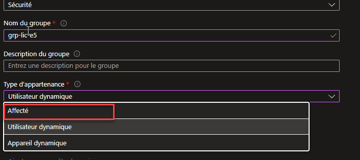
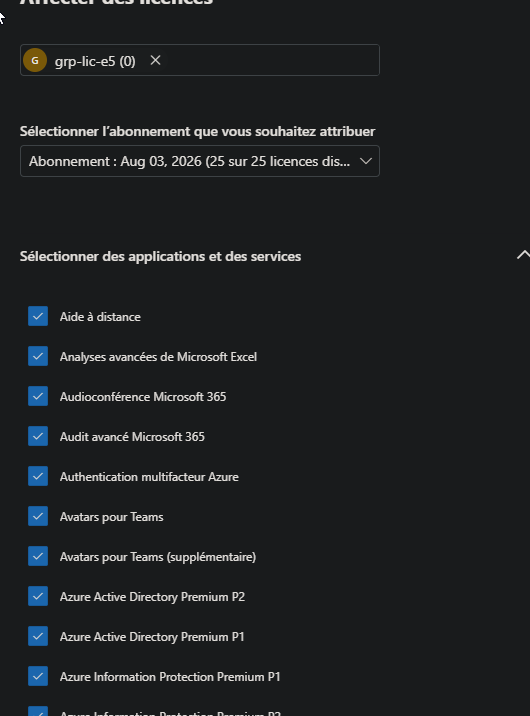
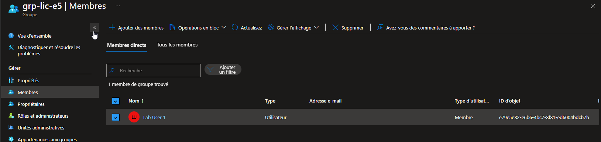
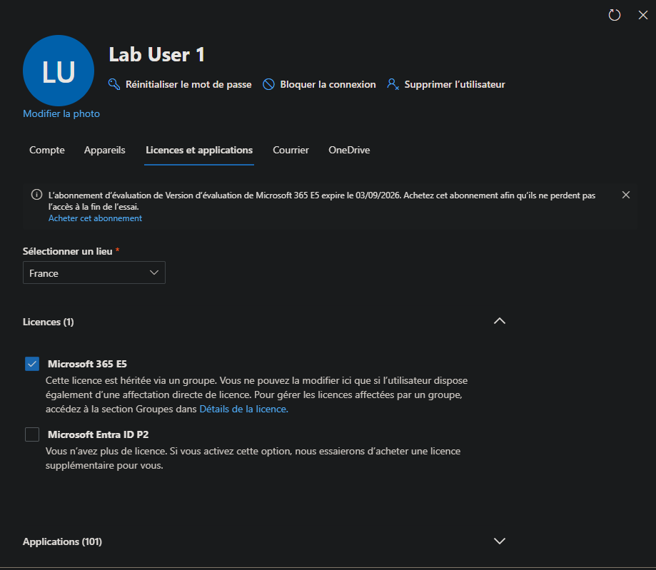

# SC-300-03 — Attribution de licences par appartenance à un groupe

## Classification

| Champ | Valeur |
|-------|--------|
| **Code scénario** | SC-300-03 |
| **Nom** | Attribution de licences Microsoft 365 par appartenance à un groupe (group-based licensing) |
| **Type** | 🛡️ Défensif — Gouvernance des licences & du cycle de vie (Entra ID) |
| **Environnement** | Tenant Microsoft Entra `nchouarhipm.onmicrosoft.com` |
| **Domaine SC-300** | D1 (Implement identities) |
| **Module Entra** | Groups · Licenses · M365 admin center (Facturation) |
| **Criticité opérationnelle** | 🟡 Modérée (gouvernance des droits & coûts) |
| **Contrôles ISO 27001** | A.5.16 (Gestion des identités), A.5.18 (Droits d'accès), A.8.2 |
| **Exigences NIS2** | Art. 21.2(i) — contrôle d'accès |
| **MITRE D3FEND** | D3-UAP (User Account Permissions) |
| **Réf. lab SC-300** | `Lab_03_UseGroupsToManageAssignmentOfAccessRights` (Licenses by group) |
| **Date** | Août 2026 |
| **Auteur** | hik3nR00t |

---

## Contexte & scénario

> **MediaTech Groupe SA** doit provisionner des licences Microsoft 365 E5 à ses équipes sans les attribuer une par une (ingérable à l'échelle, source d'erreurs et de sur-licensing). L'approche prod : **attribuer la licence à un groupe de sécurité** — tout membre l'hérite automatiquement à l'entrée, et la perd automatiquement au départ. La licence suit l'**appartenance**, pas une action manuelle. C'est le socle du provisioning/déprovisioning à l'échelle.

---

## Résumé exécutif

### Pour un recruteur

Ce write-up met en place le **group-based licensing** : création d'un groupe de sécurité, attribution d'une licence Microsoft 365 E5 **au groupe**, puis vérification que l'utilisateur membre **hérite** de la licence sans affectation directe. C'est le mode de gestion des licences à l'échelle en entreprise (joiner/mover/leaver automatisé).

### Pour un auditeur ISO 27001 / NIS2

L'attribution par groupe rend les droits **déterministes et traçables** (A.5.18) : l'accès aux services (et leur coût) découle de l'appartenance à un groupe, elle-même reviewable (Access Reviews). Le déprovisioning est automatique au retrait du groupe → pas de licence orpheline, pas de droit résiduel après un départ. La preuve d'héritage est visible côté utilisateur (« licence héritée via un groupe »).

### Pour un RSSI

Attribuer les licences à la main = dérive garantie : comptes sur-licenciés, licences non révoquées après départ (coût + surface d'accès résiduelle). Le **group-based licensing** aligne droits et appartenance : un seul point de contrôle (le groupe), héritage/révocation automatiques, base saine pour coupler **Conditional Access** et **Access Reviews**. Point de vigilance opérationnel : l'attribution par groupe est désormais **pilotée depuis le M365 admin center** (Microsoft l'a retirée du portail Entra), et un **UsageLocation** manquant bloque silencieusement l'héritage.

---

## Objectif & périmètre

Créer un groupe de sécurité, lui attribuer une licence Microsoft 365 E5, ajouter un utilisateur membre, et prouver l'héritage. **Hors périmètre** : appartenance dynamique par règle (documentée en variante §Variante prod), Access Reviews sur le groupe (cf. SC-300-25).

---

## Prérequis

- Rôle **Global Administrator** / **License Administrator** (+ **User Administrator** pour gérer l'appartenance).
- Licence **Entra ID P1** minimum (le group-based licensing exige AAD Premium P1/P2).
- **Sièges de licence disponibles** — ici : essai **Microsoft 365 E5** (25 sièges), renouvellement auto désactivé.
- Chaque membre doit avoir un **UsageLocation** défini (sinon l'affectation échoue).

---

## Procédure de mise en œuvre

> Session **breakglass01** (GA).

### 1. Créer le groupe de sécurité

`Identité → Groupes → Tous les groupes → + Nouveau groupe`
- Type : **Sécurité**
- Nom : `grp-lic-e5`
- Description : `Groupe de licences - héritage automatique Microsoft 365 E5 (SC-300-03)`
- Type d'appartenance : **Affecté** (⚠️ *pas* « Utilisateur dynamique » — sinon on ne peut pas ajouter de membre à la main)



### 2. Attribuer la licence AU GROUPE

> ⚠️ **Changement Microsoft** : l'attribution de licence par groupe n'est **plus disponible dans le portail Entra** (bandeau : *« L'ajout… des attributions de licences sont uniquement disponibles dans le Centre d'administration M365 »*). Elle se fait désormais **uniquement** dans le M365 admin center.

`admin.microsoft.com → Facturation → Licences → Microsoft 365 E5 → Affecter des licences`
- Rechercher et cocher **grp-lic-e5**
- Laisser les services par défaut (tout activé) → **Affecter**



> Résultat : compteur **1/25 attribuée(s)**, ligne `grp-lic-e5` de type **Groupe**.

### 3. Ajouter le membre

`Groupes → grp-lic-e5 → Membres → + Ajouter des membres` → **Lab User 1** → Sélectionner.



> Entra pousse alors la licence au membre (traitement par lots, ~1-3 min).

### 4. Vérifier l'héritage (preuve)

`admin.microsoft.com → Utilisateurs → Utilisateurs actifs → Lab User 1 → Licences et applications`



> **Microsoft 365 E5** coché, mention **« Cette licence est héritée via un groupe »** — l'utilisateur n'a **aucune** affectation directe. Les 101 applications portent le libellé **« basée sur un groupe et ne peut pas être modifiée ici »**.

---

## Vérification & preuves d'audit

```
☐ Groupe grp-lic-e5 créé (Sécurité, appartenance Affecté)              → 01
☐ Licence E5 attribuée au GROUPE (M365 admin center, 1/25)            → 02
☐ Lab User 1 membre du groupe                                          → 03
☐ Licence E5 visible côté user = "héritée via un groupe" (pas directe) → 04
☐ Onglet "Erreurs et problèmes" : 0 erreur, 0 membre sans licence
☐ Audit logs → "Change user license" / "Update group"
```

---

## Impact métier — MediaTech Groupe SA

### Synthèse narrative

MediaTech provisionne l'E5 à l'échelle sans toucher aux comptes un par un : rejoindre `grp-lic-e5` = obtenir la licence ; quitter le groupe = la perdre. Le licensing devient un **effet de l'appartenance**, gouvernable et auditable, et le déprovisioning au départ est automatique — plus de licence payée pour un compte parti.

### Estimation financière

| Poste | Attribution manuelle | Group-based licensing |
|-------|----------------------|-----------------------|
| Provisioning (arrivées) | ticket + action manuelle par user | héritage auto à l'ajout au groupe |
| Déprovisioning (départs) | licence souvent oubliée (coût résiduel) | révocation auto au retrait |
| Sur-licensing | difficile à tracer | 1 point de contrôle (le groupe) |
| Cohérence des services activés | variable par user | uniforme (défini sur le groupe) |

### Impact réglementaire

RGPD Art. 32 (minimisation des accès), ISO 27001 A.5.18, NIS2 Art. 21.2(i).

### Top actions

- **0–24 h** : basculer les licences des populations homogènes (ex. « tous les IT ») en group-based.
- **1 semaine** : coupler le groupe à un **Access Review** trimestriel (cf. SC-300-25).
- **1 mois** : passer les groupes de population stable en **appartenance dynamique** (règle sur `department`/`jobTitle`) → provisioning 100 % piloté par les attributs RH.

### Décisions COMEX

- **Politique** : licences attribuées par groupe, jamais en direct (sauf exception tracée).
- Aligner les groupes de licensing sur l'organigramme / la source RH.

---

## Détection SOC / SIEM

| Source | Événement | Intérêt |
|--------|-----------|---------|
| Audit logs | `Change user license` | Attribution/retrait de licence (héritée) |
| Audit logs | `Add member to group` / `Remove member from group` | Déclencheur de l'héritage/révocation |
| Audit logs | Retrait de licence d'un **groupe** | **À alerter** (impacte tous les membres) |

```kusto
AuditLogs
| where OperationName in ("Change user license","Add member to group","Remove member from group")
| extend Target = tostring(TargetResources[0].userPrincipalName), Initiator = tostring(InitiatedBy.user.userPrincipalName)
| project TimeGenerated, OperationName, Target, Initiator
| order by TimeGenerated desc
```
> Un **retrait de licence sur le groupe** = perte d'accès pour **tous** les membres d'un coup → événement à fort impact, à surveiller.

---

## Pièges rencontrés (terrain)

| Symptôme | Cause | Correctif |
|----------|-------|-----------|
| « Aucune attribution de licence » côté user malgré licence sur le groupe | **Groupe à 0 membre** (l'user n'avait pas été ajouté) | Ajouter le membre → héritage auto |
| Impossible d'attribuer la licence depuis le portail Entra | Microsoft a **déplacé** l'opération vers le M365 admin center | Passer par `admin.microsoft.com → Facturation → Licences` |
| Affectation échoue silencieusement | **UsageLocation** manquant sur le membre | Définir `Emplacement d'utilisation` (ex. France) |
| Panneau « Introuvable / 404 » sur la vue licence du groupe (Entra) | Bug d'affichage du portail Entra (blade licences déprécié) | Ignorer — vérifier côté M365 admin center |
| Produit affiché en GUID (`06ebc4ee-…`) au lieu du nom | Quirk d'affichage Entra | GUID = SKU M365 E5, sans impact |

> Ces frictions sont **caractéristiques de la transition** licensing Entra → M365 admin center : à connaître pour l'exploitation réelle (et pour l'examen, qui teste le *bon* emplacement de l'opération).

---

## Variante prod — appartenance dynamique

Pour une population stable, remplacer l'appartenance **Affecté** par **Utilisateur dynamique** avec une règle :

```
(user.department -eq "IT") and (user.accountEnabled -eq true)
```

→ Tout compte du département IT hérite automatiquement de l'E5, **sans aucune action manuelle**, dès sa création/synchronisation RH. C'est le provisioning entièrement piloté par les attributs — nécessite Entra ID P1/P2. À réserver aux critères fiables et stables (un mauvais attribut = mauvaise licence à l'échelle).

---

## Durcissement continu — `m365-admin-toolkit`

| Contrôle | Script toolkit |
|----------|----------------|
| Inventaire licences directes vs par groupe | `audit-tenant-config` |
| Comptes sur-licenciés / licences orphelines | `audit-security-policies` |
| Membres en erreur de licence (usage location, conflits SKU) | `audit-security-policies` |

- **0–24 h** : rapport des licences attribuées en direct (à migrer vers groupe).
- **1 mois** : réconciliation appartenance ↔ licences ↔ coût, revue des erreurs d'affectation.

---

## Points d'examen SC-300

- **Group-based licensing** exige **Entra ID P1** minimum ; la licence s'attribue au **groupe**, les membres l'**héritent**.
- Une licence héritée **ne peut pas être retirée** au niveau de l'utilisateur — seulement en le retirant du groupe (ou en retirant la licence du groupe).
- **UsageLocation obligatoire** sur chaque utilisateur, sinon l'affectation échoue (obligation de disponibilité produit par région).
- **Conflits de licence** (deux SKU aux services incompatibles) → apparaissent dans **« Erreurs et problèmes »**.
- Groupes d'appartenance **Affecté** (manuel) vs **Dynamique** (règle sur attributs).
- L'attribution par groupe se gère depuis le **Centre d'administration M365** (Facturation → Licences), plus depuis le portail Entra.

---

## Références

- [SC-300 Study Guide](https://learn.microsoft.com/en-us/credentials/certifications/resources/study-guides/sc-300)
- [Group-based licensing (Microsoft Learn)](https://learn.microsoft.com/en-us/entra/identity/users/licensing-groups-assign)
- [Lab_03 — Use groups to manage assignment of access rights](https://microsoftlearning.github.io/SC-300-Identity-and-Access-Administrator/)
- [m365-admin-toolkit](https://github.com/hikenroot/m365-admin-toolkit)
