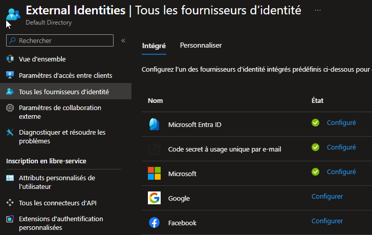
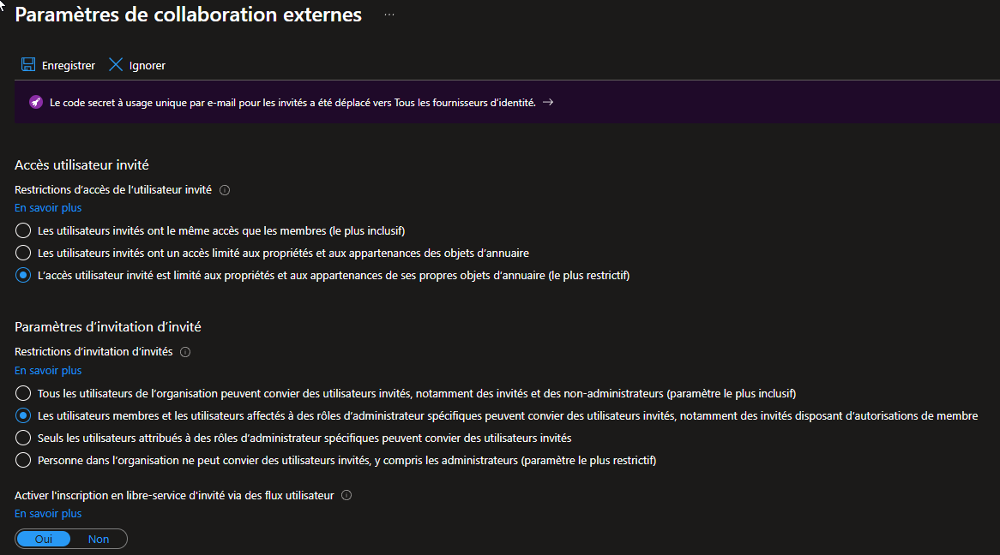

# SC-300-04 — Paramètres de collaboration externe (B2B)

## Classification

| Champ | Valeur |
|-------|--------|
| **Code scénario** | SC-300-04 |
| **Nom** | Durcissement des paramètres de collaboration externe (B2B) |
| **Type** | 🛡️ Défensif — Gouvernance des identités externes (Entra ID) |
| **Environnement** | Tenant Microsoft Entra `nchouarhipm.onmicrosoft.com` |
| **Domaine SC-300** | D1 (Implement identities) |
| **Module Entra** | External Identities · External collaboration settings · Identity providers |
| **Criticité opérationnelle** | 🟠 Élevée (surface B2B / accès externes) |
| **Contrôles ISO 27001** | A.5.18 (Droits d'accès), A.5.19 (Sécurité relations fournisseurs), A.5.14 (Transfert d'information) |
| **Exigences NIS2** | Art. 21.2(d) — sécurité de la chaîne d'approvisionnement / accès tiers |
| **MITRE D3FEND** | D3-UAP (User Account Permissions), D3-ANCI |
| **Réf. lab SC-300** | `Lab_04_ConfigureExternalCollaborationSettings` |
| **Date** | Août 2026 |
| **Auteur** | hik3nR00t |

---

## Contexte & scénario

> **MediaTech Groupe SA** collabore avec des prestataires et partenaires externes qui doivent accéder à certaines ressources. Ouvrir le tenant à des invités B2B crée une **surface d'attaque** : un invité sur-privilégié peut cartographier l'annuaire, et une politique d'invitation trop permissive laisse n'importe quel utilisateur ouvrir la porte à l'extérieur.
>
> Objectif : autoriser la collaboration externe **tout en la cadrant** — accès invité au strict minimum, invitations restreintes aux rôles habilités, et authentification passwordless (Email OTP) pour les externes.

---

## Résumé exécutif

### Pour un recruteur

Ce write-up configure la **collaboration externe B2B** dans Microsoft Entra selon le moindre privilège : accès invité « le plus restrictif » (un externe ne voit que ses propres objets), restriction des droits d'invitation aux membres et rôles d'administration habilités, et activation de l'authentification par **code à usage unique (Email OTP)** pour les invités sans compte Microsoft.

### Pour un auditeur ISO 27001 / NIS2

Le paramétrage adresse la **sécurité des accès tiers** (A.5.19, NIS2 chaîne d'approvisionnement) : les invités sont cantonnés au moindre privilège (A.5.18), la capacité d'inviter est restreinte (réduction du risque d'ouverture non maîtrisée du SI à l'externe), et l'authentification des externes repose sur l'Email OTP (pas de gestion de mot de passe côté partenaire). Ces réglages sont journalisés et revus.

### Pour un RSSI

Le risque adressé est la **reconnaissance de l'annuaire depuis un compte invité compromis** et l'**ouverture non contrôlée du tenant à l'extérieur**. En passant l'accès invité en « le plus restrictif » et en limitant qui peut inviter, on réduit la surface B2B — vecteur fréquent d'attaques par pivot depuis un partenaire compromis.

---

## Objectif & périmètre

Configurer les paramètres de collaboration externe : accès invité restrictif, restrictions d'invitation, et Email OTP. **Hors périmètre** : restrictions de collaboration par domaine (allow/deny list) laissées par défaut.

---

## Prérequis

- Rôle **Global Administrator** (Break Glass) ou **External Identity Provider Administrator**.

---

## Procédure de mise en œuvre

> Session **breakglass01** (GA).

### Phase 1 — Fournisseur Email OTP

1. `Identité → Identités externes → Tous les fournisseurs d'identité`.
2. Vérifier que **« Code secret à usage unique par e-mail »** est **Configuré**.
   

> Email OTP = authentification passwordless pour les invités sans compte Microsoft/Google.

### Phase 2 — Paramètres de collaboration externe

3. `Identité → Utilisateurs → Paramètres utilisateur → Gérer les paramètres de collaboration externe` (ou `Identités externes → Paramètres de collaboration externe`).
4. **Accès utilisateur invité** → **« L'accès utilisateur invité est limité aux propriétés et aux appartenances de ses propres objets d'annuaire (le plus restrictif) »**.
5. **Restrictions d'invitation d'invités** → **« Les utilisateurs membres et les utilisateurs affectés à des rôles d'administrateur spécifiques peuvent convier des utilisateurs invités… »**.
6. **Activer l'inscription en libre-service d'invité via des flux utilisateur** → **Oui**.
7. **Enregistrer**.
   

---

## Vérification & preuves d'audit

```
☐ Email OTP = Configuré                                        → 02
☐ Accès invité = le plus restrictif                            → 03
☐ Invitation = membres + rôles admin (pas "tous")             → 03
☐ Audit logs → "Update authorization policy" / external collaboration settings
```

---

## Impact métier — MediaTech Groupe SA

### Synthèse narrative

MediaTech ouvre son SI à des partenaires sans en faire une passoire : les externes accèdent au strict nécessaire, ne peuvent pas cartographier l'organisation, et seuls les profils habilités peuvent inviter. Cela équilibre **agilité business** (collaboration possible) et **maîtrise du risque tiers**.

### Estimation financière (évitement de risque)

| Poste | Sans durcissement | Avec durcissement |
|-------|-------------------|-------------------|
| Reconnaissance annuaire via invité | énumération org facilitée | invité aveugle (own objects only) |
| Ouverture non maîtrisée à l'externe | tout user peut inviter | restreint aux habilités |

### Impact réglementaire

RGPD Art. 32 (accès tiers), NIS2 Art. 21.2(d) (chaîne d'approvisionnement), ISO 27001 A.5.19.

### Top actions

- **0–24 h** : passer l'accès invité en « le plus restrictif ».
- **1 semaine** : restreindre les droits d'invitation ; revue des invités existants.
- **1 mois** : Access Reviews sur les comptes invités (cf. SC-300-25).

### Décisions COMEX

- Valider la **politique d'accès tiers** au moindre privilège.
- Mandater une **revue périodique des invités**.

---

## Détection SOC / SIEM

| Source | Événement | Intérêt |
|--------|-----------|---------|
| Audit logs | `Invite external user` | Nouvel accès tiers |
| Audit logs | `Update external collaboration settings` | Modification de la politique B2B |
| Sign-in logs | Connexions invités (Email OTP) | Suivi des accès externes |

```kusto
AuditLogs
| where OperationName in ("Invite external user","Update authorization policy")
| extend Initiator = tostring(InitiatedBy.user.userPrincipalName)
| project TimeGenerated, OperationName, Initiator, TargetResources
| order by TimeGenerated desc
```

---

## Durcissement continu — `m365-admin-toolkit`

| Contrôle | Script toolkit |
|----------|----------------|
| Audit des paramètres de collaboration externe | `audit-tenant-config` |
| Inventaire des comptes invités (dormants/orphelins) | `audit-inactive-accounts` |
| Revue des droits d'invitation | `audit-security-policies` |

- **0–24 h** : accès invité restrictif.
- **1 mois** : Access Reviews invités + restrictions de collaboration par domaine si besoin.

---

## Points d'examen SC-300

- **Accès invité « le plus restrictif »** = un invité ne voit que ses propres objets d'annuaire.
- **Restrictions d'invitation** : 4 niveaux (du plus inclusif « tous » au plus restrictif « personne »).
- **Email OTP** = authentification par défaut des invités sans compte Microsoft/social.
- Collaboration restrictions = allow/deny list de domaines (contrôle des domaines invitables).

---

## Références

- [SC-300 Study Guide](https://learn.microsoft.com/en-us/credentials/certifications/resources/study-guides/sc-300)
- [Lab_04 External Collaboration Settings](https://microsoftlearning.github.io/SC-300-Identity-and-Access-Administrator/Instructions/Labs/Lab_04_ConfigureExternalCollaborationSettings.html)
- [m365-admin-toolkit](https://github.com/hikenroot/m365-admin-toolkit)
