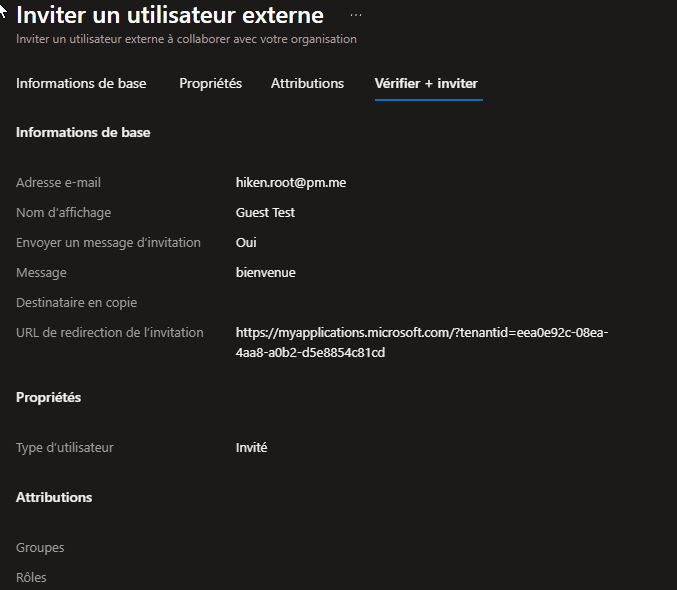
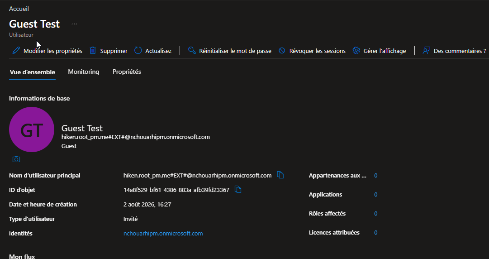
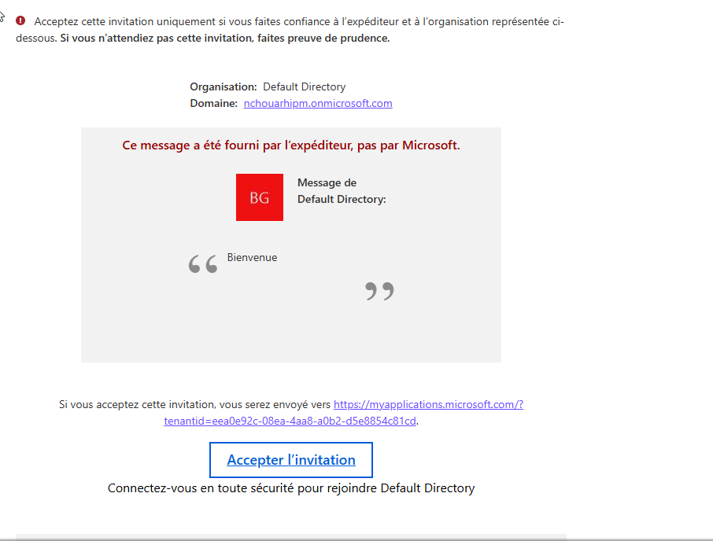

# SC-300-05 — Invitation d'utilisateurs invités (B2B)

## Classification

| Champ | Valeur |
|-------|--------|
| **Code scénario** | SC-300-05 |
| **Nom** | Invitation et intégration d'un utilisateur invité B2B |
| **Type** | 🛡️ Défensif — Gouvernance des identités externes (Entra ID) |
| **Environnement** | Tenant Microsoft Entra `nchouarhipm.onmicrosoft.com` |
| **Domaine SC-300** | D1 (Implement identities) |
| **Module Entra** | Users · External Identities (B2B) |
| **Criticité opérationnelle** | 🟡 Modérée (cycle de vie des accès tiers) |
| **Contrôles ISO 27001** | A.5.16 (Gestion des identités), A.5.19 (Relations fournisseurs) |
| **Exigences NIS2** | Art. 21.2(d) — accès tiers |
| **MITRE D3FEND** | D3-UAP (User Account Permissions) |
| **Réf. lab SC-300** | `Lab_05_AddGuestUsersToTheDirectory` |
| **Date** | Août 2026 |
| **Auteur** | hik3nR00t |

---

## Contexte & scénario

> **MediaTech Groupe SA** intègre un consultant externe qui doit accéder à des ressources partagées. Plutôt que de créer un compte interne, on l'invite en **B2B** : son identité reste chez son fournisseur d'origine, il n'a pas de mot de passe dans notre tenant, et son accès est révocable en un clic.

---

## Résumé exécutif

### Pour un recruteur

Ce write-up réalise l'**invitation B2B** d'un utilisateur externe dans Microsoft Entra : envoi de l'invitation, création automatique de l'objet invité (`#EXT#`), et acceptation via le lien reçu par e-mail. L'invité collabore sans compte interne ni mot de passe géré côté organisation.

### Pour un auditeur ISO 27001 / NIS2

Le B2B applique le principe de **gestion maîtrisée des accès tiers** (A.5.19) : l'identité externe reste sous la responsabilité de son fournisseur d'origine, l'objet invité est tracé (`#EXT#`, journaux d'audit), et l'accès est révocable/reviewable. Combiné aux paramètres de collaboration externe restrictifs (cf. SC-300-04), le risque tiers est cadré.

### Pour un RSSI

L'invitation B2B évite la prolifération de comptes internes pour des externes (pas de mot de passe à gérer, pas de compte orphelin à la fin de la mission). L'accès est **désactivable instantanément** et **auditable**. Point de vigilance : hériter des paramètres restrictifs (SC-300-04) pour que l'invité ne cartographie pas l'annuaire.

---

## Objectif & périmètre

Inviter un utilisateur externe en B2B, vérifier la création de l'objet invité, et confirmer la réception de l'invitation.

---

## Prérequis

- Rôle **Global Administrator** / **User Administrator** / **Guest Inviter**.
- Une adresse e-mail externe contrôlée pour recevoir l'invitation.

---

## Procédure de mise en œuvre

> Session **breakglass01** (GA).

1. `Identité → Utilisateurs → Tous les utilisateurs → + Nouvel utilisateur → Inviter un utilisateur externe`.
2. E-mail = adresse externe · Nom = `Guest Test` · message d'invitation (optionnel) → **Réviser + inviter → Inviter**.
   
3. Vérifier dans `Tous les utilisateurs` : l'objet apparaît, **Type = Invité**, UPN en `…#EXT#@…onmicrosoft.com`.
   
4. Côté invité : réception de l'e-mail d'invitation avec le bouton **« Accepter l'invitation »**.
   

---

## Vérification & preuves d'audit

```
☐ Invitation envoyée                                           → 01
☐ Objet invité créé, Type = Invité, UPN #EXT#                  → 02
☐ E-mail d'invitation reçu (Accepter l'invitation)            → 03
☐ Audit logs → "Invite external user" / "Redeem external user invitation"
```

---

## Impact métier — MediaTech Groupe SA

### Synthèse narrative

MediaTech intègre un externe sans créer de dette d'identité : pas de compte interne, pas de mot de passe, accès révocable et traçable. Le consultant collabore, et à la fin de sa mission l'accès se coupe proprement (cf. lifecycle SC-300-24).

### Estimation financière

| Poste | Compte interne pour externe | Invitation B2B |
|-------|-----------------------------|----------------|
| Licence/gestion mot de passe | coût + risque compte orphelin | 0 (identité externe) |
| Révocation en fin de mission | oubli fréquent | 1 clic / automatisable |

### Impact réglementaire

RGPD Art. 28/32 (sous-traitants/accès), NIS2 Art. 21.2(d), ISO 27001 A.5.19.

### Top actions

- **1 semaine** : hériter des paramètres restrictifs (SC-300-04) pour tous les invités.
- **1 mois** : Access Reviews + lifecycle des invités (SC-300-24/25).

### Décisions COMEX

- Standardiser le **B2B** pour tout accès externe (pas de compte interne).

---

## Détection SOC / SIEM

| Source | Événement | Intérêt |
|--------|-----------|---------|
| Audit logs | `Invite external user` | Nouvel invité |
| Audit logs | `Redeem external user invitation` | Acceptation |
| Sign-in logs | Connexion invité | Suivi accès externe |

```kusto
AuditLogs
| where OperationName in ("Invite external user","Redeem external user invitation")
| extend Guest = tostring(TargetResources[0].userPrincipalName)
| project TimeGenerated, OperationName, Guest
| order by TimeGenerated desc
```

---

## Durcissement continu — `m365-admin-toolkit`

| Contrôle | Script toolkit |
|----------|----------------|
| Inventaire des invités (actifs / dormants) | `audit-inactive-accounts` |
| Invités sans connexion depuis N jours | `audit-tenant-config` |

- **1 mois** : Access Reviews récurrentes sur les invités ; suppression des invités dormants.

---

## Points d'examen SC-300

- Un invité B2B a un UPN en **`…#EXT#@tenant.onmicrosoft.com`** et Type = **Invité**.
- L'identité reste chez le fournisseur d'origine (pas de mot de passe local).
- L'invitation peut être **auto-acceptée** ou nécessiter le lien e-mail selon les paramètres.
- Les invités héritent des **paramètres de collaboration externe** (SC-300-04).

---

## Références

- [SC-300 Study Guide](https://learn.microsoft.com/en-us/credentials/certifications/resources/study-guides/sc-300)
- [Lab_05 Add Guest Users](https://microsoftlearning.github.io/SC-300-Identity-and-Access-Administrator/Instructions/Labs/Lab_05_AddGuestUsersToTheDirectory.html)
- [m365-admin-toolkit](https://github.com/hikenroot/m365-admin-toolkit)
