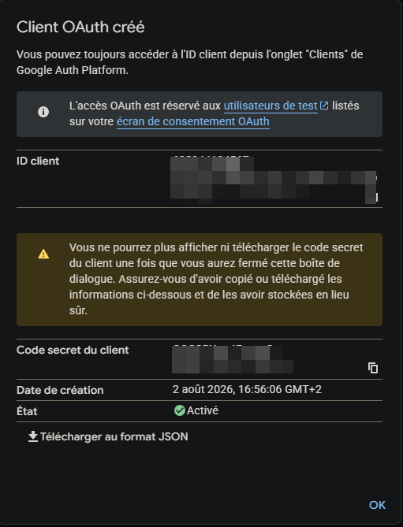
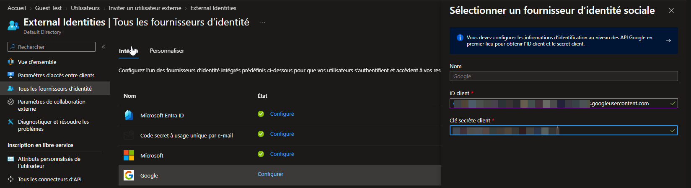

# SC-300-06 — Fournisseur d'identité fédéré (Google)

## Classification

| Champ | Valeur |
|-------|--------|
| **Code scénario** | SC-300-06 |
| **Nom** | Fédération d'un fournisseur d'identité externe (Google) pour la collaboration B2B |
| **Type** | 🛡️ Défensif — Fédération d'identités externes (Entra ID) |
| **Environnement** | Tenant Microsoft Entra `nchouarhipm.onmicrosoft.com` + Google Cloud (OAuth 2.0) |
| **Domaine SC-300** | D1 (Implement identities) |
| **Module Entra** | External Identities · Identity providers · OAuth 2.0 fédération |
| **Criticité opérationnelle** | 🟡 Modérée (fédération d'auth externe) |
| **Contrôles ISO 27001** | A.5.16 (Gestion des identités), A.5.17 (Informations d'authentification) |
| **Exigences NIS2** | Art. 21.2(i) — contrôle d'accès |
| **MITRE D3FEND** | D3-SAOR (Strong Authentication) |
| **Réf. lab SC-300** | `Lab_06_AddFederatedIdentityProvider` |
| **Date** | Août 2026 |
| **Auteur** | hik3nR00t |

---

## Contexte & scénario

> Les partenaires de **MediaTech Groupe SA** utilisent des comptes Google. Pour fluidifier la collaboration B2B, on **fédère Google** comme fournisseur d'identité : les invités disposant d'un compte Google s'authentifient directement avec, sans créer d'identifiant Microsoft ni recevoir de code OTP.

---

## Résumé exécutif

### Pour un recruteur

Ce write-up met en place une **fédération OAuth 2.0 entre Microsoft Entra et Google** : création d'un client OAuth côté Google Cloud (ID client + secret, URI de redirection Entra), puis configuration de Google comme fournisseur d'identité dans Entra. Les invités Google s'authentifient de façon transparente (SSO externe).

### Pour un auditeur ISO 27001 / NIS2

La fédération repose sur **OAuth 2.0** avec un flux de redirection contrôlé (URI de redirection Entra spécifique, restreint au tenant). Les secrets OAuth sont gérés hors du dépôt (jamais commités). L'authentification des invités est déléguée à un fournisseur externe de confiance, réduisant la gestion d'informations d'authentification côté organisation (A.5.17).

### Pour un RSSI

Fédérer Google améliore l'expérience B2B mais introduit une **dépendance à un fournisseur externe** : la confiance repose sur le client OAuth. Points de vigilance — protéger le **secret client** (rotation, jamais en clair), restreindre l'URI de redirection au tenant, et surveiller les connexions fédérées. Le secret ne doit **jamais** être publié (masqué dans toute preuve).

---

## Objectif & périmètre

Fédérer Google comme IdP pour les invités B2B. **Hors périmètre** : Facebook et autres IdP sociaux (même procédure).

---

## Prérequis

- Rôle **Global Administrator** / **External Identity Provider Administrator**.
- Un projet **Google Cloud** (gratuit, sans facturation).

---

## Procédure de mise en œuvre

### Partie A — Google Cloud (client OAuth 2.0)

1. `console.cloud.google.com` → sélectionner/créer un projet.
2. Rechercher **OAuth** → **Google Auth Platform** → **Premiers pas** : nom d'app, e-mail d'assistance, **Audience = Externe**, coordonnées → créer.
3. **Créer un client OAuth** :
   - **Type** : Application Web
   - **Origines JavaScript autorisées** : `https://login.microsoftonline.com`
   - **URI de redirection autorisés** : `https://login.microsoftonline.com/te/<TENANT-ID>/oauth2/authresp`
4. Récupérer l'**ID client** + le **Code secret client**.
   

> ⚠️ Le **Code secret** est sensible → masqué dans la capture, **jamais commité en clair**.

### Partie B — Entra (fournisseur d'identité)

5. `Identité → Identités externes → Tous les fournisseurs d'identité → Google → Configurer`.
6. Coller **ID client** + **Code secret client** → **Enregistrer**.
   
7. Résultat : **Google = Configuré** dans la liste des fournisseurs.

---

## Vérification & preuves d'audit

```
☐ Client OAuth Google créé (Application Web, URI redirect Entra)   → 01
☐ Google = Configuré dans Entra                                    → 02
☐ Secret OAuth masqué / non commité
☐ Audit logs → "Add identity provider"
```

---

## Impact métier — MediaTech Groupe SA

### Synthèse narrative

MediaTech fluidifie la collaboration avec ses partenaires Google : plus de friction OTP, connexion directe. En contrepartie, une **dépendance de confiance** à Google et un **secret OAuth à protéger** — d'où la rigueur sur la gestion du secret.

### Estimation financière

| Poste | Sans fédération | Avec fédération Google |
|-------|-----------------|------------------------|
| Friction B2B (OTP à chaque connexion) | ralentit la collaboration | SSO transparent |
| Gestion des secrets OAuth | — | rotation à prévoir |

### Impact réglementaire

RGPD Art. 28/32, ISO 27001 A.5.17 (informations d'authentification), NIS2 Art. 21.2(i).

### Top actions

- **0–24 h** : stocker le secret OAuth dans un coffre (jamais en clair).
- **1 mois** : planifier la **rotation** du secret client Google ; surveiller les connexions fédérées.

### Décisions COMEX

- Valider la **fédération des partenaires stratégiques** (Google/autres) vs Email OTP.

---

## Détection SOC / SIEM

| Source | Événement | Intérêt |
|--------|-----------|---------|
| Audit logs | `Add identity provider` | Nouvelle fédération |
| Sign-in logs | Connexions via IdP externe (Google) | Suivi des auth fédérées |
| Sign-in logs | Échecs d'auth fédérée | Anomalie / secret expiré |

```kusto
SigninLogs
| where AuthenticationDetails has "google" or ResourceDisplayName has "External"
| project TimeGenerated, UserPrincipalName, ResultType, AppDisplayName
| order by TimeGenerated desc
```

---

## Durcissement continu — `m365-admin-toolkit`

| Contrôle | Script toolkit |
|----------|----------------|
| Inventaire des fournisseurs d'identité configurés | `audit-tenant-config` |
| Surveillance expiration des secrets/certs de fédération | `audit-security-policies` |

- **0–24 h** : secret OAuth au coffre.
- **1 mois** : rotation planifiée du secret ; revue des IdP fédérés.

---

## Points d'examen SC-300

- La fédération Google/Facebook repose sur un **client OAuth 2.0** (ID client + secret) créé côté fournisseur.
- L'**URI de redirection** Entra : `https://login.microsoftonline.com/te/<tenant-id>/oauth2/authresp`.
- Un invité fédéré s'authentifie chez son IdP d'origine (pas d'OTP, pas de compte MS).
- L'ordre de priorité des méthodes d'auth invité : fédération > compte MS > Email OTP.

---

## Références

- [SC-300 Study Guide](https://learn.microsoft.com/en-us/credentials/certifications/resources/study-guides/sc-300)
- [Lab_06 Add a Federated Identity Provider](https://microsoftlearning.github.io/SC-300-Identity-and-Access-Administrator/Instructions/Labs/Lab_06_AddFederatedIdentityProvider.html)
- [m365-admin-toolkit](https://github.com/hikenroot/m365-admin-toolkit)
