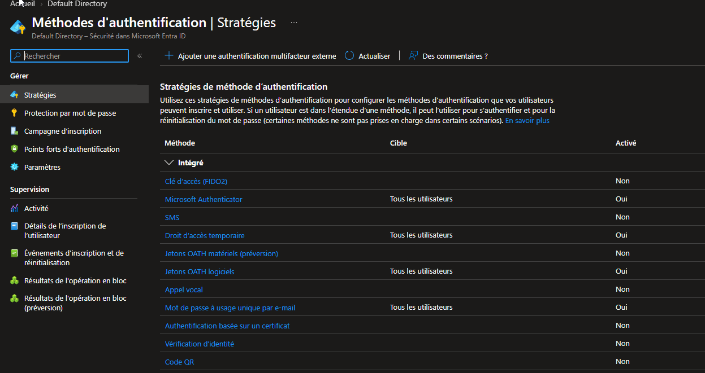
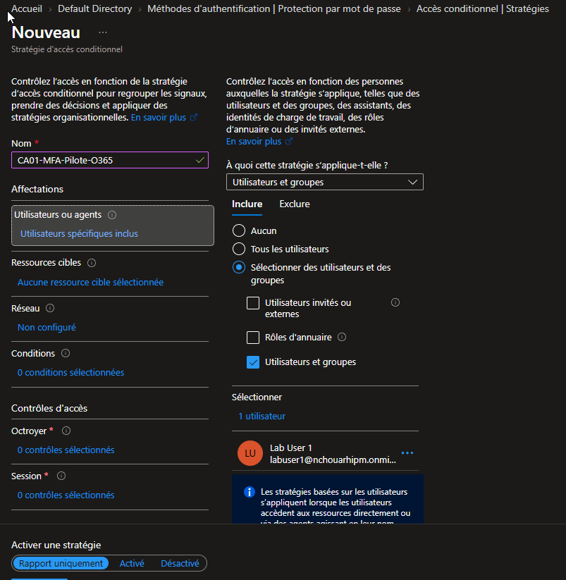
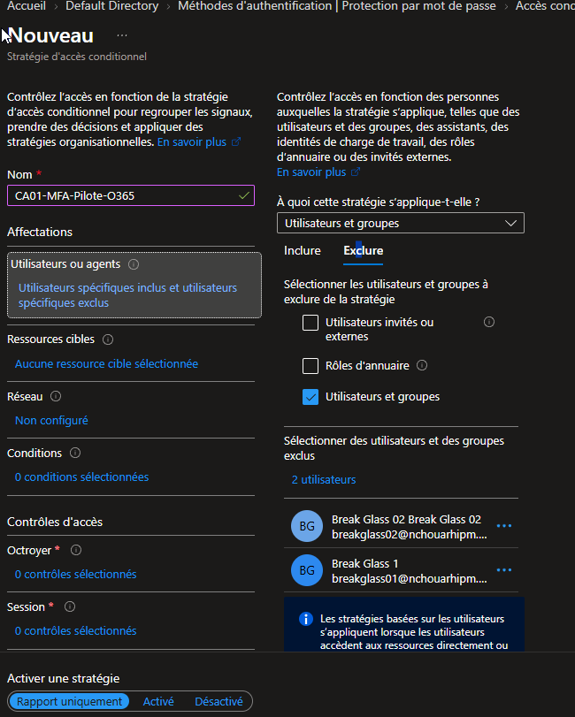
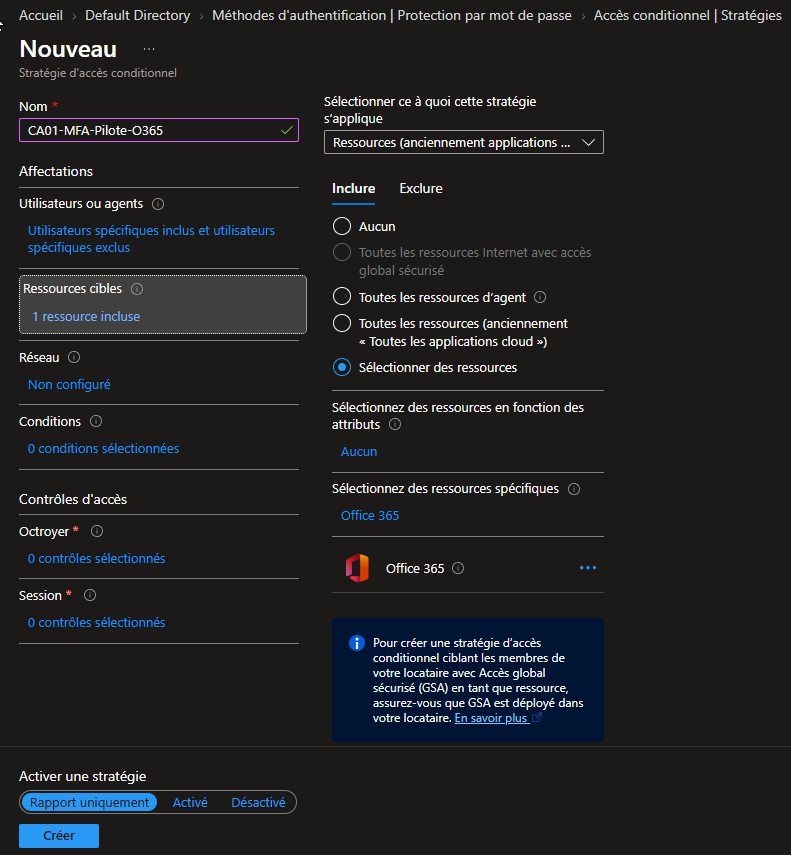
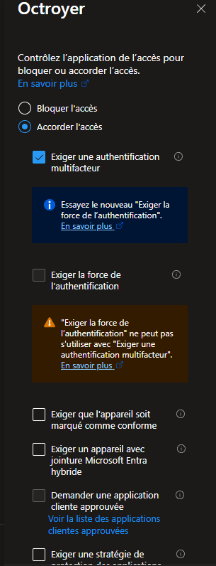
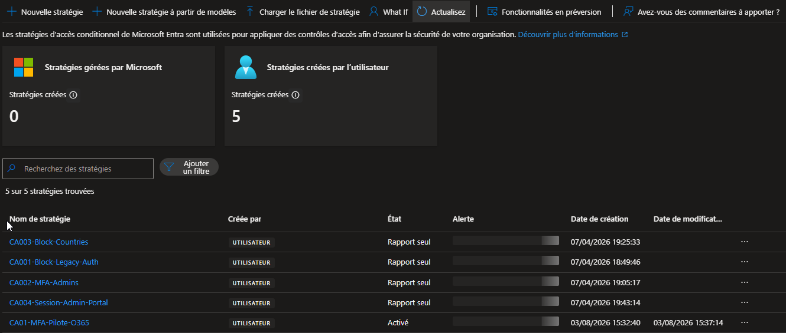
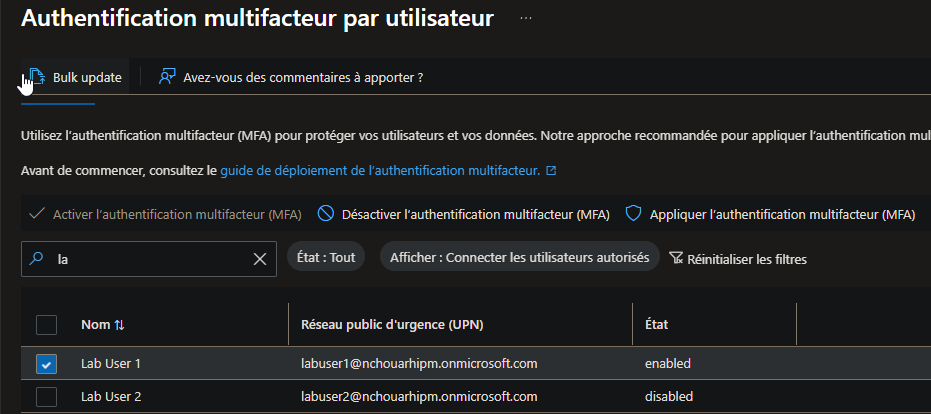
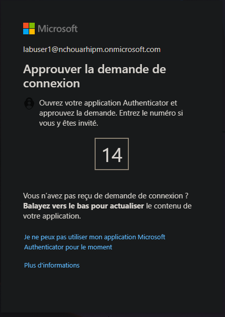
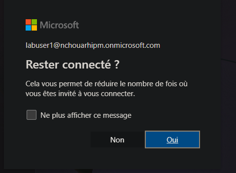

# SC-300-08 — Enable Multi-Factor Authentication (MFA)

## 1. Classification

| Champ | Valeur |
|-------|--------|
| **Code** | SC-300-08 |
| **Type** | Lab de mise en œuvre — Authentification forte |
| **Domaine SC-300** | D2 — Implémenter l'authentification et la gestion des accès (25-30%) |
| **Lab officiel** | `Lab_08_EnableAzureADMultiFactorAuthentication.md` (MicrosoftLearning/SC-300) |
| **ISO 27001:2022** | A.5.17 (Informations d'authentification), A.8.5 (Authentification sécurisée), A.8.2 (Droits d'accès privilégiés) |
| **NIS2** | Art. 21.2(j) — recours à l'authentification multifacteur / authentification continue |
| **MITRE D3FEND** | D3-MFA (Multi-factor Authentication), D3-SPP (Strong Password Policy) |
| **MITRE ATT&CK (contré)** | T1078 (Valid Accounts), T1110 (Brute Force), T1621 (MFA Request Generation) |
| **Tenant** | `nchouarhipm.onmicrosoft.com` · Entra ID P2 |
| **Auteur** | hik3nR00t |
| **Date** | 03/08/2026 |

---

## 2. Contexte & scénario — MediaTech Groupe SA

> *MediaTech Groupe SA (groupe de presse, ~1 200 collaborateurs) a subi une campagne de phishing ciblant les boîtes O365 de sa rédaction. Un audit interne pointe l'absence de MFA sur les accès Office 365 comme cause racine du risque de compromission de compte (ATO) et de fraude au président (BEC). Le RSSI demande la mise en place d'une authentification multifacteur imposée par Conditional Access, avec exclusion stricte des comptes d'urgence (break-glass), et une preuve d'audit exploitable par le SOC.*

Ce lab reproduit cette exigence sur le tenant réel HikenRoot Forge : MFA imposé sur `labuser1` pour l'app Office 365, comptes Tier 0 exclus, preuve du challenge et de la trace annuaire.

---

## 3. Résumé exécutif

### Pour un recruteur
Mise en œuvre d'une authentification multifacteur d'entreprise sur Microsoft Entra ID, imposée via une stratégie d'accès conditionnel ciblant Office 365. Le déploiement respecte les bonnes pratiques : exclusion des comptes d'urgence pour éviter tout verrouillage du tenant, méthode forte (Microsoft Authenticator avec number matching, résistante au MFA fatigue), et validation par preuve de connexion réelle + trace d'audit.

### Pour un auditeur ISO 27001 / NIS2
- **A.8.5 (Authentification sécurisée)** : l'accès à Office 365 exige désormais un second facteur — le mot de passe seul ne suffit plus à ouvrir une session.
- **A.5.17 (Informations d'authentification)** : méthode Authenticator avec correspondance de nombres (number matching) activée par défaut → mitige le *MFA request bombing* (T1621).
- **A.8.2 (Accès privilégiés)** : les comptes break-glass (Global Admin) sont explicitement exclus de la stratégie, conformément au principe de disponibilité des accès d'urgence, mais restent protégés par FIDO2/clé matérielle hors périmètre de cette policy.
- **NIS2 Art. 21.2(j)** : recours effectif à la MFA documenté et vérifiable, contrôle mesurable via les journaux de connexion (`AuthenticationRequirement = multiFactorAuthentication`).
- **Séparation des contrôles** : coexistence maîtrisée d'une phase Report-only (4 autres stratégies) et d'une stratégie en enforcement, illustrant un déploiement CA progressif et auditable.

### Pour un RSSI
L'exposition principale — compromission de compte par phishing / credential stuffing sur les accès O365 — est neutralisée sur le périmètre testé. Le contrôle est imposé côté annuaire (Conditional Access), pas côté application, donc non contournable par un client alternatif. La méthode retenue (Authenticator + number matching) résiste aux attaques de fatigue MFA. Le déploiement à l'échelle de MediaTech consiste à remplacer le ciblage `labuser1` par un groupe pilote, à observer via *Insights et rapports*, puis à généraliser à tous les utilisateurs.

---

## 4. Objectif & périmètre

Imposer la MFA sur les connexions à **Office 365** pour un utilisateur cible (`labuser1`), via **Conditional Access** (méthode recommandée, P1+), en :
- excluant les 2 comptes break-glass (Tier 0) de la stratégie ;
- validant le déclenchement réel du challenge MFA ;
- produisant une preuve d'audit.

Couverture pédagogique de l'Exercice 2 du lab officiel (**per-user MFA legacy**) à titre comparatif — non retenu comme cible d'architecture.

**Hors périmètre** : configuration fine des méthodes (Lab 15 — MFA Registration Policy), SSPR (Lab 09), risk-based (Lab 14).

---

## 5. Prérequis

- Licence **Entra ID P2** (P1 suffit pour la CA ; P2 déjà présent sur le tenant).
- **Security Defaults = OFF** (sinon la création de stratégies CA est bloquée). Vérifié : bandeau « Votre organisation n'est pas protégée par les paramètres de sécurité par défaut ».
- Session **breakglass01** (Global Administrator).
- Compte cible `labuser1@nchouarhipm.onmicrosoft.com` (UsageLocation = France).
- Méthode **Microsoft Authenticator** activée dans les stratégies de méthodes d'authentification.

---

## 6. Procédure de mise en œuvre

> Session **breakglass01** · portail `entra.microsoft.com` · labels FR.

### 6.0 — Énumération : méthodes d'authentification (baseline)

`Entra ID → Protection → Méthodes d'authentification → Stratégies`

État avant modification : Microsoft Authenticator = **Oui** (Tous), TAP = Oui, OATH logiciels = Oui, OTP e-mail = Oui ; SMS / Appel vocal / FIDO2 = **Non**.



### 6.1 — Exercice 1 : stratégie Conditional Access

`Entra ID → Accès conditionnel → Stratégies → + Nouvelle stratégie`

**Nom** : `CA01-MFA-Pilote-O365`

**a) Utilisateurs — Inclure** : Lab User 1.



**b) Utilisateurs — Exclure** : Break Glass 1 + Break Glass 2 (Tier 0, anti-lockout).



**c) Ressources cibles** : Office 365.



**d) Octroyer** : Accorder l'accès → **Exiger l'authentification multifacteur** → *Demander tous les contrôles sélectionnés*.



**e) Activer la stratégie** : `Activé` (bascule depuis *Rapport uniquement* → *Enregistrer*).

Résultat : `CA01-MFA-Pilote-O365` = **Activé**. Les 4 autres stratégies du tenant restent en **Report-only** (phase de staging).



### 6.2 — Exercice 2 : per-user MFA (legacy, comparatif)

Portail legacy : `https://account.activedirectory.windowsazure.com/UserManagement/MultifactorVerification.aspx`

Recherche `labuser1` → **Activer l'authentification multifacteur** → état passe à **enabled** (on ne passe **pas** en *Enforced* pour conserver la période d'enregistrement). Break-glass laissés `disabled`.



### 6.3 — Test de bout en bout

Fenêtre **InPrivate** → `office.com` → connexion `labuser1` (mot de passe réinitialisé depuis la fiche user, changement forcé au 1er login) → enregistrement Authenticator → **challenge MFA number matching**.



Après approbation : écran **« Rester connecté ? »** (KMSI) = connexion aboutie post-MFA.



---

## 7. Vérification & preuves d'audit

### Checklist

```
☐ Security Defaults = OFF (prérequis CA)
☐ CA01-MFA-Pilote-O365 = État Activé, contrôle = Exiger MFA
☐ Inclure = labuser1 (1 user) · Exclure = breakglass01 + breakglass02 (2 users)
☐ Ressource = Office 365
☐ labuser1 (per-user) = enabled ; break-glass = disabled
☐ Challenge MFA number matching obtenu au login réel
☐ Sign-in log : AuthenticationRequirement = multiFactorAuthentication
```

### Vérification Graph PowerShell (pwsh)

```powershell
Connect-MgGraph -Scopes "Policy.Read.All","AuditLog.Read.All","Reports.Read.All"

# 1. Stratégie CA active + contrôle MFA + exclusions
Get-MgIdentityConditionalAccessPolicy |
  Where-Object DisplayName -eq 'CA01-MFA-Pilote-O365' |
  Select-Object DisplayName, State,
    @{n='Grant';e={$_.GrantControls.BuiltInControls}},
    @{n='Include';e={$_.Conditions.Users.IncludeUsers}},
    @{n='Exclude';e={$_.Conditions.Users.ExcludeUsers}},
    @{n='Apps';e={$_.Conditions.Applications.IncludeApplications}}

# 2. État d'enregistrement MFA
Get-MgReportAuthenticationMethodUserRegistrationDetail |
  Where-Object UserPrincipalName -like 'labuser1*' |
  Select-Object UserPrincipalName, IsMfaRegistered, IsMfaCapable, MethodsRegistered

# 3. Preuve d'enforcement dans les sign-in logs
Get-MgAuditLogSignIn -Top 5 `
  -Filter "userPrincipalName eq 'labuser1@nchouarhipm.onmicrosoft.com'" |
  Select-Object CreatedDateTime, AppDisplayName, AuthenticationRequirement,
    @{n='CA';e={($_.AppliedConditionalAccessPolicies |
      Where-Object Result -eq 'success').DisplayName}}
```

Attendu : `State = enabled`, `Grant = mfa`, `Exclude` contient les 2 break-glass, et sur la connexion de test `AuthenticationRequirement = multiFactorAuthentication`.

---

## 8. Impact métier — MediaTech Groupe SA

### Synthèse narrative
La MFA sur Office 365 supprime la classe d'attaque « mot de passe seul » : phishing de credentials, credential stuffing, password spray n'ouvrent plus de session sans le second facteur. Pour un groupe de presse dont les boîtes O365 concentrent sources, contrats et données RH, c'est le contrôle au meilleur rapport coût/risque.

### Estimation financière (risque évité)

| Scénario évité | Estimation | Justification |
|---|---|---|
| Account takeover d'un compte rédaction | 150 000 € – 800 000 € | Exfiltration mails/sources, atteinte confidentialité des sources (protection légale) |
| Fraude BEC (fraude au président) | 300 000 € – 2 000 000 € | Virement frauduleux via boîte compromise |
| Amende RGPD (violation données perso) | 100 000 € – 3 000 000 € | Art. 32 — absence de mesure technique appropriée |
| Investigation & remédiation | 50 000 € – 200 000 € | Forensic, reset massif, notification |
| **Total risque évité** | **600 000 € – 6 000 000 €** | Pour un coût de déploiement quasi nul (licence déjà détenue) |

### Impact réglementaire
- **RGPD Art. 32** : la MFA constitue une mesure technique appropriée attendue pour les traitements sensibles.
- **NIS2 Art. 21.2(j)** : MFA explicitement citée parmi les mesures de base ; son absence est un écart de conformité pour une entité essentielle/importante.
- **ISO 27001 A.8.5** : exigence d'authentification sécurisée satisfaite et auditable.

### Top actions prioritaires
**0–24h** : (1) étendre `CA01` d'un user pilote à un **groupe pilote** ; (2) confirmer l'exclusion break-glass + protection FIDO2 de ces comptes.
**1 semaine** : (3) basculer les 4 stratégies Report-only vers enforcement après analyse *Insights et rapports* ; (4) activer une **MFA Registration Policy** (Lab 15) pour forcer l'enrôlement sous X jours.
**1 mois** : (5) généraliser MFA à *Tous les utilisateurs* / *Toutes les ressources*, désactiver le per-user MFA legacy, viser le phishing-resistant (FIDO2) pour les admins.

### Décisions attendues du COMEX
- Valider la **généralisation MFA à 100 % des utilisateurs** (impact support/change management).
- Arbitrer le passage au **phishing-resistant (FIDO2 / passkeys)** pour les rôles à privilèges.
- Mandater la **sortie du per-user MFA legacy** avant sa dépréciation Microsoft.

---

## 9. Détection SOC / SIEM

### Signaux clés

| Source | Signal | Usage |
|---|---|---|
| `SigninLogs` | `AuthenticationRequirement` | Distingue singleFactor / multiFactor |
| `SigninLogs` | `ConditionalAccessStatus` | success / failure / notApplied |
| `AuditLogs` | `Update conditional access policy` | Détecte toute modif/désactivation de la CA |
| `SigninLogs` | `ResultType 500121` | Échec/deny MFA (fraude possible / MFA fatigue) |

### Requêtes KQL

```kql
// 1. Connexions O365 SANS MFA (contrôle de couverture)
SigninLogs
| where AppDisplayName has "Office 365" or ResourceDisplayName has "Office 365"
| where AuthenticationRequirement == "singleFactorAuthentication"
| where ConditionalAccessStatus != "success"
| project TimeGenerated, UserPrincipalName, AppDisplayName, IPAddress, ConditionalAccessStatus
| sort by TimeGenerated desc
```

```kql
// 2. Preuve d'enforcement CA01 sur labuser1
SigninLogs
| where UserPrincipalName == "labuser1@nchouarhipm.onmicrosoft.com"
| mv-expand ca = ConditionalAccessPolicies
| where tostring(ca.displayName) == "CA01-MFA-Pilote-O365"
| project TimeGenerated, AppDisplayName, AuthenticationRequirement,
          caResult = tostring(ca.result)
| sort by TimeGenerated desc
```

```kql
// 3. Détection MFA fatigue / fraude (denials répétés)
SigninLogs
| where ResultType in ("500121","50074","50076")
| summarize denials = count(), apps = make_set(AppDisplayName) by UserPrincipalName, bin(TimeGenerated, 10m)
| where denials >= 3
| sort by denials desc
```

```kql
// 4. Alerte : désactivation/altération d'une stratégie CA
AuditLogs
| where OperationName has "conditional access policy"
| where OperationName has_any ("Update","Delete","Disable")
| project TimeGenerated, OperationName, InitiatedBy, TargetResources
| sort by TimeGenerated desc
```

---

## 10. Pièges rencontrés (terrain)

- **Onglet « Utilisateurs » disparu de la blade MFA moderne** : `Authentification multifacteur → Prise en main` ne contient plus le tableau per-user. Accès direct nécessaire via l'URL legacy `account.activedirectory.windowsazure.com/.../MultifactorVerification.aspx`.
- **Policy créée en Report-only par défaut** : le toggle en bas du wizard reste sur *Rapport uniquement*. En Report-only Entra journalise mais **n'impose rien** → aucun prompt MFA au test. Il faut rouvrir la policy (*Afficher ou Modifier*) et basculer sur *Activé*.
- **Pas de mot de passe labuser1** : réinitialisation depuis la fiche user (GA) → mot de passe temporaire → changement forcé au 1er login, puis enchaînement sur l'enregistrement MFA.
- **Première connexion « sans prompt visible »** : l'enregistrement Authenticator ayant été fait pendant le login initial, le challenge n'apparaît qu'aux connexions suivantes (d'où le number matching obtenu sur une nouvelle session).

---

## 11. Durcissement continu

- Basculer les stratégies `CA001→CA004` (Report-only) vers enforcement après analyse d'impact.
- Généraliser MFA à *Tous les utilisateurs* / *Toutes les ressources* + exclusion break-glass unique et documentée.
- Migrer les admins vers **phishing-resistant** (FIDO2 / passkeys, actuellement `Non`).
- Activer une **MFA Registration Policy** (Lab 15) pour borner le délai d'enrôlement.
- Restreindre **OTP e-mail** aux invités B2B (actuellement « Tous les utilisateurs »).
- Décommissionner le **per-user MFA legacy** (déprécié par Microsoft).

> Cross-ref audit/vérification automatisée : [`m365-admin-toolkit`](https://github.com/hikenroot/m365-admin-toolkit) — scripts d'inventaire CA, couverture MFA et détection des comptes non couverts. Cross-ref durcissement identité : [`ad-hardening-baseline`](https://github.com/hikenroot/ad-hardening-baseline).

---

## 12. Points d'examen SC-300

- **CA vs per-user MFA vs Security Defaults** = mutuellement exclusifs en pratique. Security Defaults ON **bloque** la création de CA. Bonne réponse pour du MFA granulaire = **Conditional Access** (P1+).
- **Toujours exclure les comptes break-glass** d'une stratégie MFA/CA → sinon lock-out total du tenant.
- **Report-only ≠ enforcement** : une policy en Report-only n'impose rien (piège classique).
- **Number matching** = protection contre le **MFA fatigue / request bombing** (T1621), activé par défaut sur Authenticator.
- **Enabled vs Enforced** (per-user) : *Enabled* laisse la période d'enregistrement, *Enforced* la supprime.
- **`AuthenticationRequirement`** dans les sign-in logs = preuve que le MFA a été **imposé** (≠ simplement *enregistré*).
- Le **per-user MFA est déprécié** au profit des Authentication methods policies + CA.

---

## 13. Références

- Study Guide SC-300 — Domaine « Implement authentication and access management ».
- Lab officiel : `Lab_08_EnableAzureADMultiFactorAuthentication` — MicrosoftLearning/SC-300 · [github.io](https://microsoftlearning.github.io/SC-300-Identity-and-Access-Administrator/Instructions/Labs/Lab_08_EnableAzureADMultiFactorAuthentication.html)
- Docs : Conditional Access — Require MFA · Authentication methods · Number matching.
- Toolkits : [`m365-admin-toolkit`](https://github.com/hikenroot/m365-admin-toolkit) · [`ad-hardening-baseline`](https://github.com/hikenroot/ad-hardening-baseline)

---

*Write-up HikenRoot Forge — SC-300-08 — hik3nR00t — 03/08/2026*
