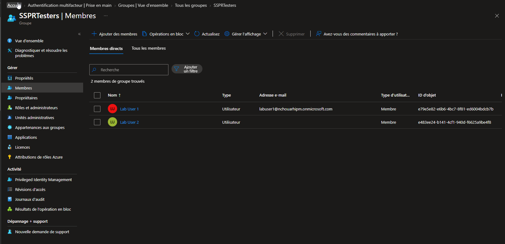
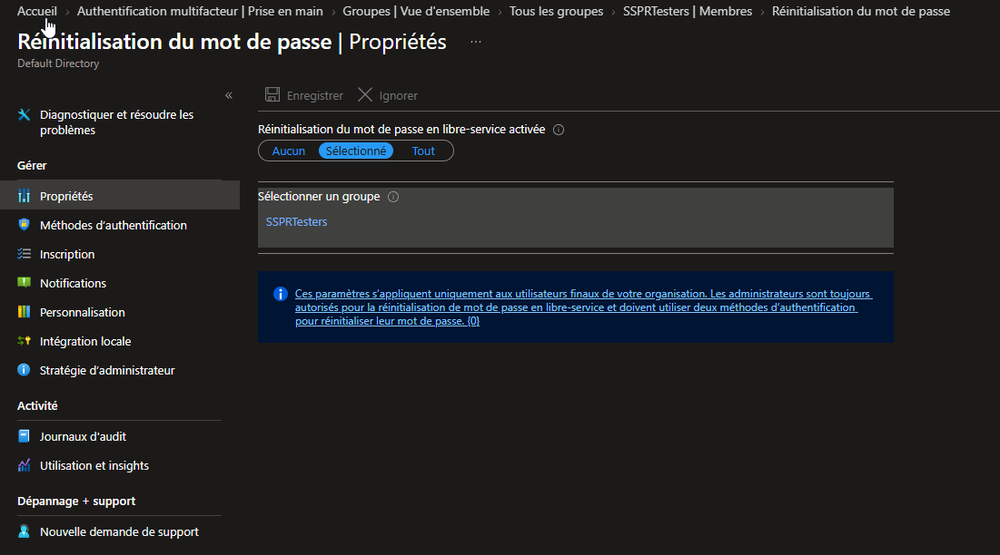
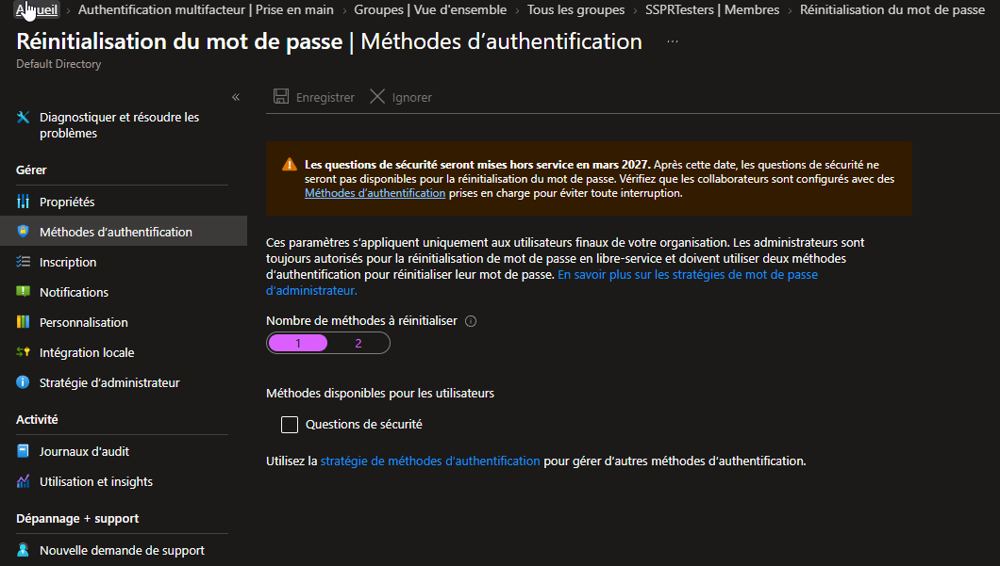
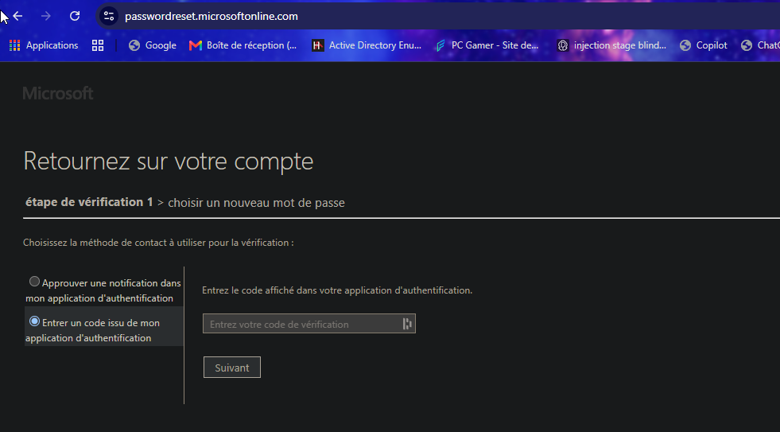
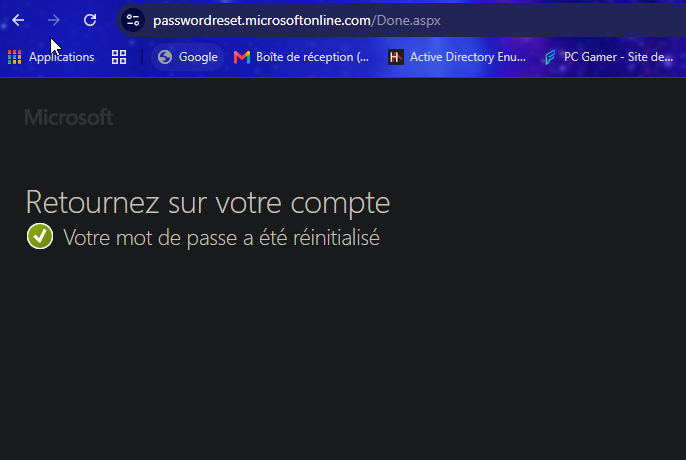
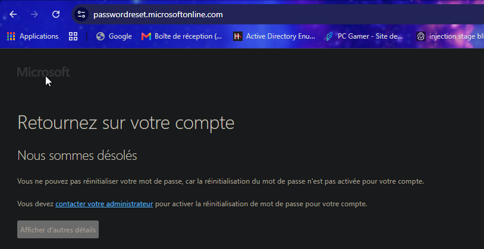

# SC-300-09 — Self-Service Password Reset (SSPR)

## 1. Classification

| Champ | Valeur |
|-------|--------|
| **Code** | SC-300-09 |
| **Type** | Lab de mise en œuvre — Réinitialisation de mot de passe en libre-service |
| **Domaine SC-300** | D2 — Implémenter l'authentification et la gestion des accès (25-30%) |
| **Lab officiel** | `Lab_09_ConfigureAndDeploySelfServicePasswordReset.md` (MicrosoftLearning/SC-300) |
| **ISO 27001:2022** | A.5.17 (Informations d'authentification), A.8.5 (Authentification sécurisée), A.5.16 (Gestion des identités) |
| **NIS2** | Art. 21.2(i)/(j) — politiques de contrôle d'accès et hygiène d'authentification |
| **MITRE D3FEND** | D3-MFA (reset protégé par MFA), D3-SPP (Strong Password Policy) |
| **MITRE ATT&CK (réduit)** | T1531 (Account Access Removal — récupération autonome), réduction surface support (vishing helpdesk T1598) |
| **Tenant** | `nchouarhipm.onmicrosoft.com` · Entra ID P2 |
| **Auteur** | hik3nR00t |
| **Date** | 04/08/2026 |

---

## 2. Contexte & scénario — MediaTech Groupe SA

> *MediaTech Groupe SA veut réduire la charge du helpdesk (30 % des tickets = mots de passe oubliés) et supprimer une faille sociale : le reset manuel par téléphone est vulnérable au vishing (un attaquant se fait passer pour un collaborateur). Le RSSI demande un déploiement progressif de la réinitialisation en libre-service (SSPR) — d'abord sur un groupe pilote, avec vérification forte (MFA), avant généralisation.*

Ce lab reproduit ce déploiement progressif sur le tenant réel : SSPR ciblé sur un groupe `SSPRTesters`, reset self-service protégé par Authenticator, et vérification que les utilisateurs hors périmètre restent exclus.

---

## 3. Résumé exécutif

### Pour un recruteur
Déploiement d'une réinitialisation de mot de passe en libre-service sur Microsoft Entra ID, ciblée sur un groupe pilote et protégée par authentification forte (Microsoft Authenticator). Le libre-service réduit la charge support et supprime le vecteur d'ingénierie sociale du reset manuel. Le déploiement respecte l'approche « pilote → généralisation » recommandée par Microsoft, avec preuve du reset réussi et de l'exclusion des utilisateurs hors périmètre.

### Pour un auditeur ISO 27001 / NIS2
- **A.5.17 (Informations d'authentification)** : la récupération de mot de passe est encadrée par une vérification d'identité forte (Authenticator), pas par un canal non tracé.
- **A.5.16 (Gestion des identités)** : cycle de vie du credential maîtrisé — l'utilisateur peut renouveler son secret de façon autonome et auditée.
- **Traçabilité** : chaque reset self-service génère un événement `AuditLogs` (activité « Reset password (self-service) ») exploitable par le SOC.
- **Déploiement par périmètre** : le scoping sur groupe (`SSPRTesters`) démontre un contrôle granulaire et un rollout progressif, conforme à une gestion du changement maîtrisée.
- **Comptes à privilèges** : les administrateurs sont soumis d'office à **2 méthodes** (paramètre non désactivable), renforçant la protection des accès sensibles.

### Pour un RSSI
Le SSPR supprime le reset téléphonique manuel (surface de vishing / usurpation) et réduit la dépendance au helpdesk. La récupération exige une preuve de possession (Authenticator) — un attaquant connaissant seulement l'e-mail ne peut pas réinitialiser. Le déploiement à l'échelle de MediaTech consiste à élargir le groupe pilote, exiger l'enrôlement des méthodes (registration policy), puis passer sur *Tous*.

---

## 4. Objectif & périmètre

Activer et valider le **SSPR ciblé sur un groupe** (`SSPRTesters`), avec :
- reset self-service réel protégé par Authenticator (labuser1) ;
- vérification négative : un utilisateur hors groupe ne peut pas réinitialiser (scoping) ;
- réglage cohérent du nombre de méthodes requises vs méthodes enregistrées.

**Hors périmètre** : write-back on-prem (Hybrid — AZ-500), campagne d'enregistrement forcée (registration policy — connexe Lab 15), personnalisation du portail.

---

## 5. Prérequis

- Licence **Entra ID P1+** (P2 présent).
- Session **breakglass01** (Global Administrator).
- Utilisateurs cibles avec au moins une **méthode d'auth SSPR-éligible enregistrée**. `labuser1` a déjà **Microsoft Authenticator** (enregistré au lab SC-300-08).
- Tenant en **méthodes d'authentification convergées** (les méthodes hors questions de sécurité sont gérées par la stratégie de méthodes d'authentification).

---

## 6. Procédure de mise en œuvre

> Session **breakglass01** · `entra.microsoft.com` · labels FR.

### 6.1 — Créer le groupe pilote

`Entra ID → Groupes → Tous les groupes → + Nouveau groupe`
- Type : **Sécurité** · Nom : `SSPRTesters` · Appartenance : **Attribué**
- Membres : **Lab User 1** + **Lab User 2** → Créer.



### 6.2 — Activer SSPR sur le groupe

`Entra ID → Protection → Réinitialisation du mot de passe → Propriétés`
- **Réinitialisation en libre-service activée** : **Sélectionné**
- Groupe : `SSPRTesters` → **Enregistrer**.



### 6.3 — Régler les méthodes d'authentification

Onglet **Méthodes d'authentification** :
- **Nombre de méthodes à réinitialiser** : **1** (cohérent : labuser1 a 1 méthode enregistrée — Authenticator).
- **Questions de sécurité** : décoché (méthode faible, retirée par Microsoft en mars 2027).
- Les autres méthodes (Authenticator, téléphone, e-mail) sont pilotées par la **stratégie de méthodes d'authentification** (modèle convergé), où Authenticator = activé.



> **Point clé** : `Nombre de méthodes requises ≤ méthodes réellement enregistrées par l'utilisateur`, sinon le SSPR bloque à « vous devez enregistrer plus d'informations ».

### 6.4 — Test positif : reset self-service (labuser1)

Fenêtre **InPrivate** → `https://aka.ms/sspr` → `labuser1@nchouarhipm.onmicrosoft.com` + captcha → **Suivant**.
Étape de vérification 1 → **code Authenticator** (TOTP) → **Suivant**.



Choix d'un nouveau mot de passe → **Terminer** → écran **« Votre mot de passe a été réinitialisé »**.



### 6.5 — Test négatif : utilisateur hors groupe

Fenêtre InPrivate → `https://aka.ms/sspr` → `arya.stark@nchouarhipm.onmicrosoft.com` + captcha → **Suivant**.
Résultat : **refus** — « la réinitialisation du mot de passe n'est pas activée pour votre compte… contactez votre administrateur ».



---

## 7. Vérification & preuves d'audit

### Checklist

```
☐ Groupe SSPRTesters = Sécurité / Attribué, membres labuser1 + labuser2
☐ Password reset = Sélectionné → SSPRTesters (enregistré)
☐ Nombre de méthodes requises = 1 (≤ méthodes enregistrées)
☐ labuser1 : reset self-service réussi via Authenticator (/Done.aspx)
☐ arya.stark (hors groupe) : reset refusé
☐ Comptes admin : 2 méthodes imposées (non désactivable)
```

### Vérification Graph PowerShell (pwsh)

```powershell
Connect-MgGraph -Scopes "Group.Read.All","Policy.Read.All","AuditLog.Read.All"

# 1. Périmètre SSPR (groupe ciblé) — via la policy de reset
#    (le scope SSPR se lit dans les paramètres d'authorization policy / SSPR)
Get-MgGroup -Filter "displayName eq 'SSPRTesters'" |
  Select-Object DisplayName, Id, SecurityEnabled

# 2. Membres du groupe pilote
Get-MgGroupMember -GroupId (Get-MgGroup -Filter "displayName eq 'SSPRTesters'").Id |
  ForEach-Object { $_.AdditionalProperties.userPrincipalName }

# 3. Preuve du reset self-service dans les journaux d'audit
Get-MgAuditLogDirectoryAudit -Top 20 `
  -Filter "loggedByService eq 'SSPR'" |
  Select-Object ActivityDateTime, ActivityDisplayName, Result,
    @{n='User';e={$_.InitiatedBy.User.UserPrincipalName}}
```

Attendu : `SecurityEnabled = True`, membres = labuser1/labuser2, et un événement SSPR `Reset password (self-service)` = `success` pour labuser1 + un `Blocked from self-service password reset` (ou absence d'éligibilité) pour arya.stark.

---

## 8. Impact métier — MediaTech Groupe SA

### Synthèse narrative
Le SSPR transforme un coût récurrent (tickets helpdesk) en libre-service sécurisé et supprime un vecteur d'ingénierie sociale (reset téléphonique usurpable). Pour MediaTech, c'est un gain opérationnel immédiat doublé d'un durcissement du processus de récupération de compte.

### Estimation financière (gain + risque évité)

| Poste | Estimation annuelle | Justification |
|---|---|---|
| Réduction tickets reset helpdesk | 40 000 € – 120 000 € | ~30 % des tickets, coût unitaire 15-25 € |
| Risque vishing / usurpation helpdesk évité | 100 000 € – 800 000 € | Un reset frauduleux = prise de contrôle de compte |
| Productivité utilisateurs (déblocage immédiat) | 20 000 € – 60 000 € | Suppression du délai d'attente support |
| **Total valeur** | **160 000 € – 980 000 €** | Coût de mise en œuvre quasi nul (licence détenue) |

### Impact réglementaire
- **NIS2 Art. 21** : hygiène d'authentification et contrôle d'accès renforcés.
- **ISO 27001 A.5.17 / A.8.5** : récupération d'identifiant encadrée et tracée.
- **RGPD Art. 32** : réduction du risque d'accès non autorisé par usurpation du canal de reset.

### Top actions prioritaires
**0–24h** : (1) élargir `SSPRTesters` à un groupe pilote représentatif ; (2) communiquer la procédure aux pilotes.
**1 semaine** : (3) activer la **campagne d'enregistrement** / registration policy pour forcer l'enrôlement des méthodes ; (4) surveiller les événements SSPR dans les logs.
**1 mois** : (5) basculer SSPR sur **Tous les utilisateurs**, retirer les questions de sécurité, viser Authenticator/FIDO2 comme méthodes.

### Décisions attendues du COMEX
- Valider la **généralisation SSPR à 100 %** (change management, communication).
- Arbitrer l'**abandon des questions de sécurité** au profit des méthodes fortes.
- Financer une **campagne d'enrôlement** des méthodes d'authentification.

---

## 9. Détection SOC / SIEM

### Signaux clés

| Source | Signal | Usage |
|---|---|---|
| `AuditLogs` | `Reset password (self-service)` | Reset self-service réussi |
| `AuditLogs` | `Blocked from self-service password reset` | Tentative bloquée / abus |
| `AuditLogs` | `User registered security info` | Enrôlement de méthode SSPR |
| `AuditLogs` | Reset admin (`Reset user password`) | Doit rester rare / justifié |

### Requêtes KQL

```kql
// 1. Resets self-service (volume + users)
AuditLogs
| where LoggedByService == "Self-service Password Management"
| where ActivityDisplayName has "self-service"
| project TimeGenerated, ActivityDisplayName, ResultReason,
          User = tostring(InitiatedBy.user.userPrincipalName)
| sort by TimeGenerated desc
```

```kql
// 2. Tentatives SSPR bloquées / échecs répétés (abus possible)
AuditLogs
| where LoggedByService == "Self-service Password Management"
| where Result == "failure" or ActivityDisplayName has "Blocked"
| summarize attempts = count() by User = tostring(InitiatedBy.user.userPrincipalName),
            bin(TimeGenerated, 15m)
| where attempts >= 3
| sort by attempts desc
```

```kql
// 3. Corrélation reset + connexion depuis nouvelle IP (prise de contrôle ?)
let resets = AuditLogs
  | where ActivityDisplayName has "self-service" and Result == "success"
  | project ResetTime = TimeGenerated, UPN = tostring(InitiatedBy.user.userPrincipalName);
SigninLogs
| join kind=inner resets on $left.UserPrincipalName == $right.UPN
| where TimeGenerated between (ResetTime .. (ResetTime + 1h))
| project TimeGenerated, UserPrincipalName, IPAddress, Location, AppDisplayName
```

---

## 10. Pièges rencontrés (terrain)

- **Blade en modèle convergé** : l'onglet Méthodes d'authentification n'affiche que « Questions de sécurité » ; les autres méthodes sont gérées dans la **stratégie de méthodes d'authentification**. Ne pas cocher les questions de sécurité pour « débloquer » Enregistrer — c'est inutile et déconseillé.
- **Bouton Enregistrer grisé** : normal quand aucune valeur n'a changé (ex. Nombre déjà à 1). Grisé = déjà enregistré, pas un bug.
- **Nombre de méthodes > méthodes enregistrées** : si on force 2 méthodes alors que labuser1 n'a que l'Authenticator, le reset échoue. Régler à 1 pour le test.
- **Admins toujours à 2 méthodes** : paramètre non modifiable (bandeau d'info) — normal, protection des comptes à privilèges.

---

## 11. Durcissement continu

- Activer une **campagne d'enregistrement** (registration policy, Lab 15) pour garantir que chaque user a ≥ 2 méthodes fortes avant généralisation.
- Passer SSPR sur **Tous** après phase pilote, en s'appuyant sur *Utilisation et insights*.
- **Retirer les questions de sécurité** (faibles, retrait Microsoft mars 2027).
- Privilégier **Authenticator / FIDO2** comme méthodes de récupération ; éviter SMS.
- Alerter le SOC sur la séquence **reset self-service → connexion nouvelle IP** (indicateur de prise de contrôle).

> Cross-ref audit PowerShell : [`m365-admin-toolkit`](https://github.com/hikenroot/m365-admin-toolkit) — inventaire des méthodes enregistrées et couverture SSPR par utilisateur. Cross-ref : [`ad-hardening-baseline`](https://github.com/hikenroot/ad-hardening-baseline).

---

## 12. Points d'examen SC-300

- **SSPR ciblé par groupe** = `Sélectionné` + groupe de sécurité. `Tous` = généralisation.
- **Nombre de méthodes requises ≤ méthodes enregistrées** (piège de test classique).
- **Les administrateurs exigent toujours 2 méthodes** — non configurable.
- **SSPR ≠ MFA** : deux fonctionnalités distinctes, mais méthodes d'auth partagées (modèle convergé).
- **Questions de sécurité** = méthode faible, en fin de vie (mars 2027) — ne pas recommander.
- **Password write-back** requis pour propager le reset vers un AD **on-prem** (scénario hybride, hors ce lab).
- Traçabilité SSPR dans **AuditLogs** (service « Self-service Password Management »).

---

## 13. Références

- Study Guide SC-300 — « Implement authentication and access management ».
- Lab officiel : `Lab_09_ConfigureAndDeploySelfServicePasswordReset` — MicrosoftLearning/SC-300 · [github.io](https://microsoftlearning.github.io/SC-300-Identity-and-Access-Administrator/Instructions/Labs/Lab_09_ConfigureAndDeploySelfServicePasswordReset.html)
- Docs : Self-service password reset — deployment · Authentication methods (converged) · SSPR reporting.
- Toolkits : [`m365-admin-toolkit`](https://github.com/hikenroot/m365-admin-toolkit) · [`ad-hardening-baseline`](https://github.com/hikenroot/ad-hardening-baseline)

---

*Write-up HikenRoot Forge — SC-300-09 — hik3nR00t — 04/08/2026*
